# 斯坦福大学《SwiftUI的iOS应用开发｜CS193p Developing Applications for iOS using SwiftUI 2023》 p13 -13-Lecture 13 _ Stanford CS193p 2023.zh_en -BV1HyzNYdEiD_p13-

Today， as I said from last time we're going to have this gigantic demo and it's all demo and these are all the things you can go look at this later and make sure that you remember me saying these things。

 but before I even do that， I'm going to show you and I don't like to do this because I don't want to stifle your creativity。

 I'm going to show you a little bit of what your A6 is supposed to look like。

This is not a required task so I'm showing you it's a hint just so that you have an idea of it before we go do the lecture today which is going to cover a lot of the stuff you're going to do here is one possible implementation of your a6 so a6 is all about the themes for memorize it's not about the game anymore you've already done the game you're going use the same game for a2 in this going to change it but it's about the themes managing themes so in a1 and A2 like you choose random themes or whatever here you're going to not only pick the theme you're going be able to edit the theme I can have multiple themes so here you can say I have my themes Halloween flags。

 vehicles， places， whatever and I can delete them I can swipe to delete them。

I can swipe the other way and edit them。So here I'm picking the emojis I want to be in here。

 I can pick the color I want in my theme， I can pick how many cards are in the theme here and when I edit these these things and go back it's updated here and when I click on one yeah it shows me a game and I can play the game here but this is not the important part this is just your A1 a2 you're not going to change that much the real key is out here with the themes and you can add a new theme okay this is a new。

Theme and then maybe one edit this new theme to change your emojis or whatever。

And so this is what you're going to be trying to build and this does a lot of things that you don't know how to do like put up another window on screen and all that stuff and so we're going to learn about all that stuff today and again。

 you don't have to do it this way。The first thing I'm going to do today。

 the same thing I did last time is funny。 I guess since would getting me be a habit。

 I made do a little fun thing first， which is in our app over here。

We have this nice little menu down here。 and this menu down here， this context menu。

 This is where we're gonna to spend all our time today adding things， doing things。

 First thing I'm gonna do is add a menu item here， which lets me go to and bring up another menu item。

 any of this palettes， So I can jump right to a palette。 So it's like a little go to menu。

 how do we do that。 Well to go to something we have to create another little submen。

 which is going have a list of all our palettes in that。 So let's do that here we are in our chooser。

 this is where we have our context menu It has these two things。

 I'm going create a little private bar here I'm going to call it my go to menu and this is gonna to be some view。

 it could actually also be some menu because it is going to be a menu。

 but a menu is a view I'm going say some view here。

 and I'm going create a sub menu by using the menu Sw Ui view。 It's called menu and inside there。

 you just put buttons。 how you make a menu it couldn't be more straight。

 And in fact in my menu I'm going create one for each。Of my stores pallets like this。 and of course。

 palette。In。And I'm going to use my animated action button。

 the same action button I've been using up here。 I'm going to use those in my little go to menu。

Put the pallet's name。And we'll have to do something when it's clicked。

Then it needs to label this menu， so this is going to be the thing that's in our main menu right the same menu that has new and delete。

 it needs a little label in here and I'm going to have my label B go to。

It's going to use a system image I looked around for one I found this one text do insert。

 going to seems like it looked good。Let's put it inside this context menu， go to menu。

So we've added a menu as a submenu to this one， now we'll run。

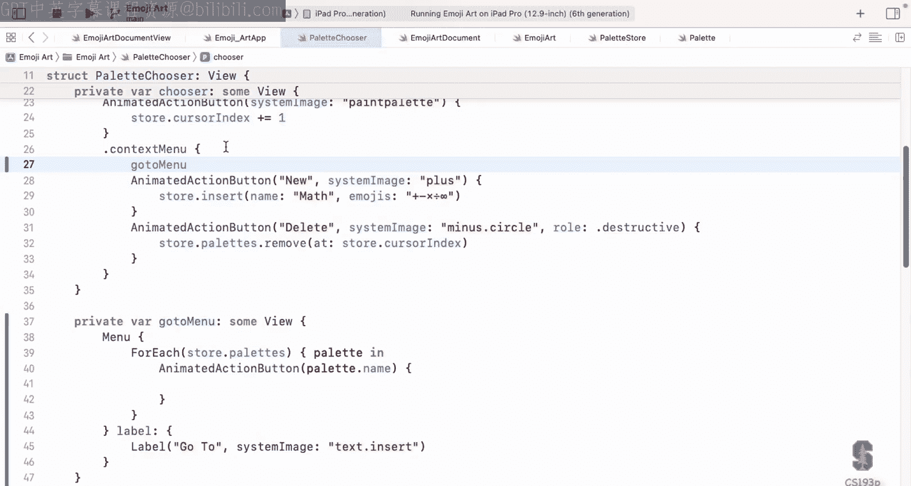

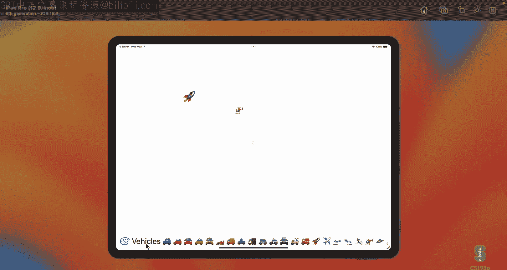

And there it is， go to and see when we go to it， we get to sub menu and we can say， oh。

 let's go to the music one。Now we didn't put any code to do anything。

 but this is what the UI looks like， everyone understand what we built。All right， what do we do。

 How are we going to go to the one that was chosen a little tricky here。

 we're going to have to do that if let index equal the stores pallets。First index where dollar0。

id equals this pallets ID， so we essentially have to look up and find the index of this thing in our store because what we're going to do is say store set your cursor index to that index。

Remember， the cursor index is the one that's showing。

 so we need to set the one that's showing to be that index there。

 and we have to use double equals instead of single equals。

Im cool with this little piece of code right there， all right， let's run see if that works。We go。

 go to and animals。 Yeah， go to。Weather， who？Okay， so that's how you do a sub menu and context menu it's really nice to be able to have sub menus。

 keep your main context menus maybe a little smaller and more accessible。

But so I saw that in there not really relevant necessarily to all we're doing。

 but it seemed like a good place to show that to you。

Now to the heart of the matter of what we're doing today。

 we're going to start by building a user interface for editing our pallets。

 changing the name of the palette， adding and removing Moji just like you saw you're going to have to do for your themes and memorize how are we going to do that here Well we're going to do it for our palettes。

 I'm going to have this UIB accessible by having an animated action button in my menu called edit。

And what is the system image that I found for that， oh yeah， pencil？Okay， fanil。

 and it's definitely not destructive。And we don't remove something instead we need to show another whole window。

 a whole another view needs to pop up， I'm going to talk about how we do it first and then we'll come back and make it happen here。

The way we present another view on top of us is with dot sheet。

So dot sheet has an argument is presented and is presented is a boolean value whether this sheet should be showing on the screen right now。

 very simple that's what I call is presented， but what's really interesting about this is that it's a binding to that Boolean and I'm going to call it show palette editor because that's what it does。

And this finding to show palette editor is used both directions that Boolean gets set to true by us when we want it to appear。

 and when the user dismisses it， it gets set back to false by the sheet view modifier so you see how it's going both ways that show palette editor is both used for us to present it and to tell us when it stopped being presented。

We just need it to be a little local at sign state， private bar， show palette。

Editor we'll start it out as false because we don't want to start out with this thing visible clearly and all we need to do down here when we want to present it is just set this show palette editor equal to true as soon as we set that to true this sheet is going to see that that's true and it's going to present this view and that's what this curly brace is it's a view builder that makes the view to put there。

I'm going to put in here a view called palette Ed， we're going to create that in another file。

 so file new file get the Sw UI view， it's called palette Ed。

 I'm going to make sure I'm putting it in the right place， of course。Palette。Eitor。

And so we got our pal of editor， lets move it down here。

And we'll start out with this palette editor saying something like palette editor so that we know which view it is and it's a normal view。

 this view is eventually going to have a whole bunch of stuff for editing a palette just like again you're memorized one's going have choosing our color and it's all going to be in there we're going to get to it but we're going to start with just palette editor so let's see let's go back and see our。

Code over here， this is the code that when it's presented it's going to present this palette editor。

 let's run and see what this looks like。

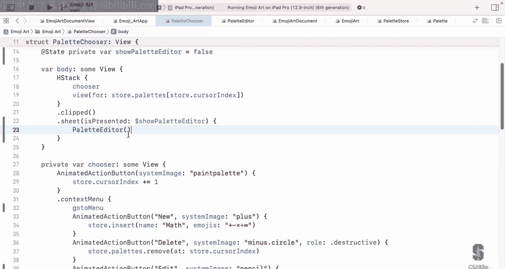

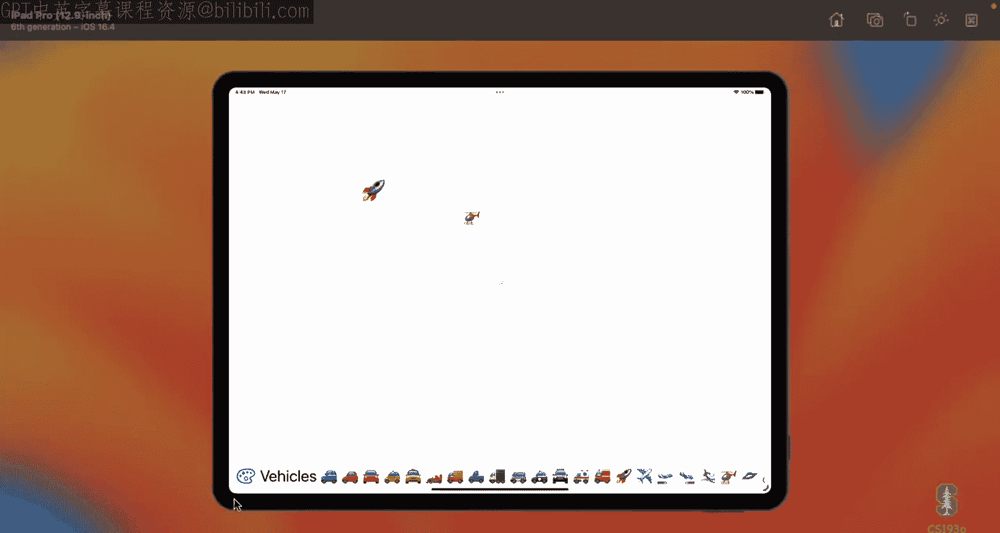

Down here， we added this edit， there it is with the pencil， ready， do it。

It appeared and there it is the text that we have their palette editor。

 So we're going to fill this in with the implementation of app palette editor。 but before I do that。

 I actually want to show you another way you can put something up on screen which is a popover kind of like a sheet。

 but it's not so huge doesn't cover up the whole thing and very importantly it points to whatever it's modifying or whatever the context is So if you have something that's very context specific like it wants to point at the button that brought it up or some piece of text you can use a popover it looks just like sheet except for you're going to put it on the view you want it to point to So here I'm going to make this a popover and I'm going to have it point to the chooser button that brought it up by attaching this popover to it So's see what that looks like。

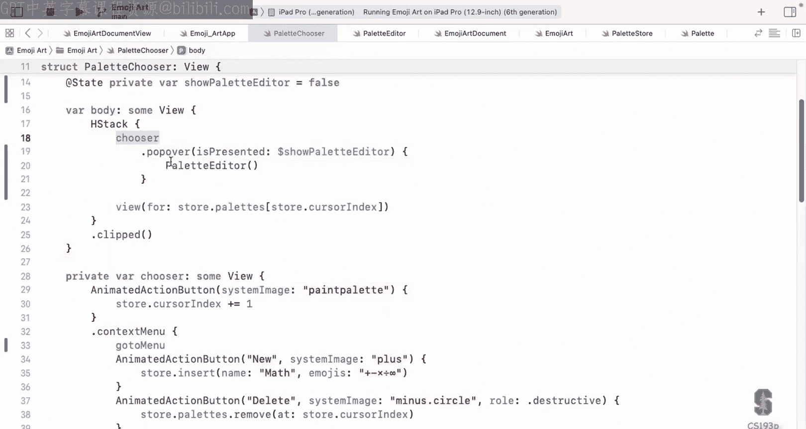

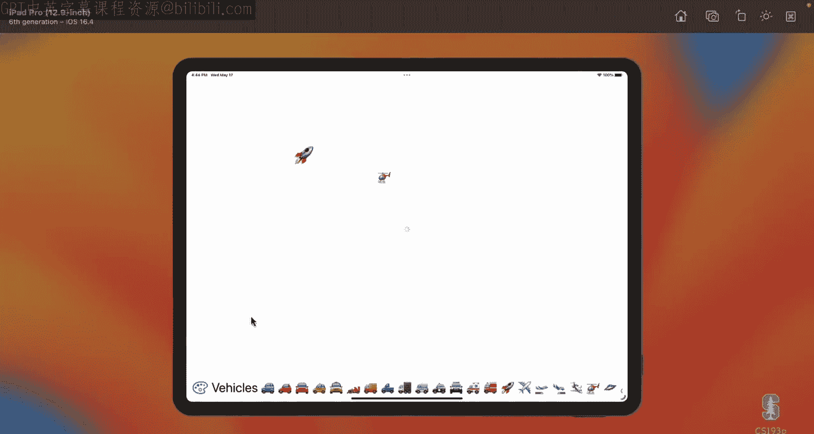

There we go。Down here， edit。Paalette editor， and it's maybe hard to see。

 but there's actually a little。Arrow pointing to it。 Now， it looks terrible。

 It's all jammed in there。 but there's no reason we can't put some padding in there。 And in fact。

 more than just putting padding， if we want to make sure that this thing is big enough at some minimum size。

 we can enforce that and just go back to our palette editor。

And say that this text has to have a frame， which is a min width of let's say。

 300 and a min height of 35。 we talked about the frame。

ViewMoifier it's got a whole bunch of things on there like width and height just pick the width and height。

 but it also has minimum width and height to just say well you can be what size you want but please be at least this pig and if I put that in there and run。

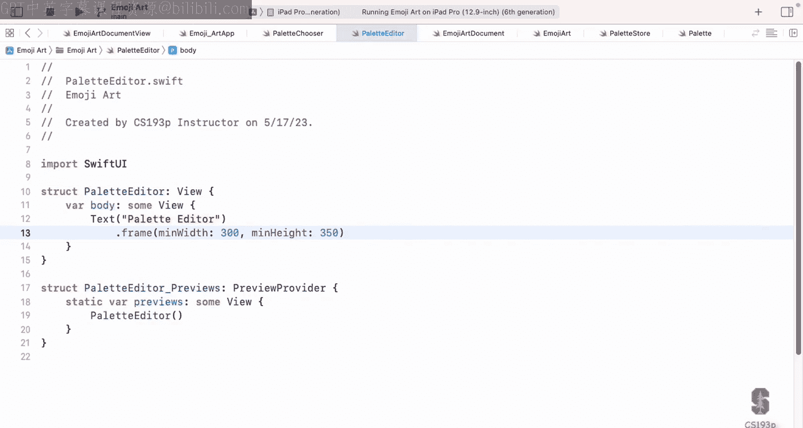

Now when I do this edit。

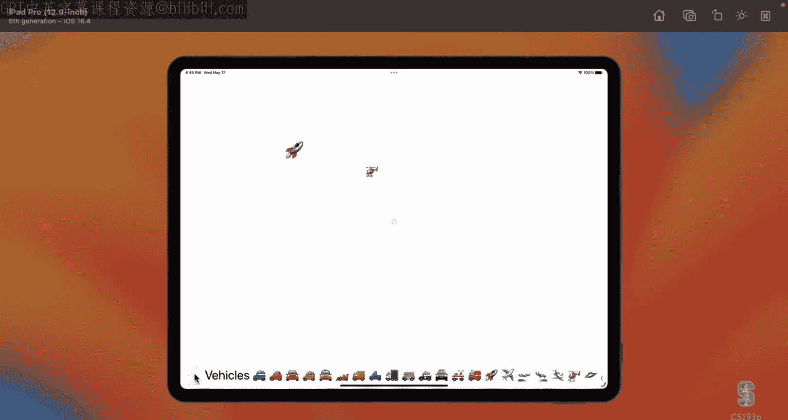

See， its minimum size， more room to maneuver in there to make it look a little nicer。Now。

 remember that this。Popover points to whatever view you put it on so let's say what if we put it on this one instead。

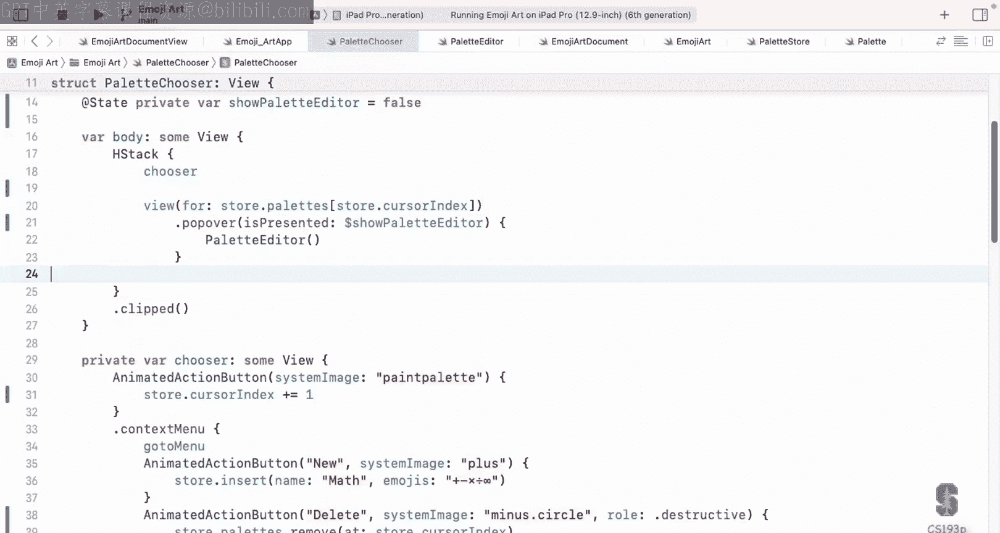

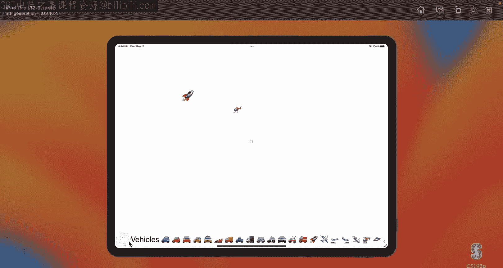

Now it's pointing to this one， this other view。

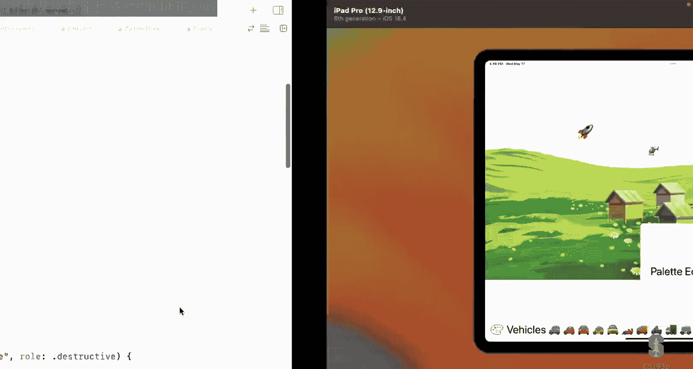

Both the poplars and sheets。They're what's called modal presentations。

 They put this view palette editor up and they're asking the user to deal with this right now。

 don't do anything else， don't scroll in your emojis don't deal with this and when you're done dismiss it and now you can go back and do something So that's modal presentation and modal presentation you don't want to overuse it in your app you don't want to be constantly putting in the user in a state where it's like they have to deal with this or else It makes more sense when you have like an editor like you want to edit the theme well that's what the user ask to do so let's do it right now and then we'll get back to do what we were doing before I say this because some people will build their whole apps with just modal presentation after modal presentation and they don't understand that the user sometimes changes their mind and they want to go do something else and they want to be able to navigate so try to not overuse modal presentation like this。

And I'm going to put this pop over back as a sheet。

Because this is a big enough UI probably not going to put it in a popover it's close it's close to being one we could put in there The thing about it for popover is there's also really nothing it really needs to point at。

 there's no reason for it to point at the chooser button there's no reason to put it。

 you could argue it should point at the pallet since it's editing that palette。It。Probably。

Design choice thing。All right， so we know about popovers now。

 we know about how to set the size we got the sheet。

 let's start building our palette editor and see what it would actually look like so it's not just a text like this。

It's probably something like， let's say a V stack， I'm going to align it leading。

 I'm going to put in there the pallet's name。🤢，And I'm doing something that I'm often doing this class I'm just typing what I want to type here and I'll go fix all the errors that come up later and this part of doing declarative programming you just can say what you wanted to do remove emojis。

 what I want my editor to basically have is a way to edit the text of the name and a way to add some emojis to my app palette and then a way to remove emojis。

I'm just kind of typing what I want here。 So let's get rid to some of these errors。 The first one is。

 cannot find palette in scope。 Well， obviously， if we're going to have palette editor。

 we get to pass it a palette to edit。So I'm going to just do that up here。 I's say。

 let palate eat palate。That we want to edit。And what else we got here， remove emojis。 All right。

 we need some sort of UI to remove emojis。 So I actually worked on that before we came here just to speed things up。

 I just made a little lazy B grid。 see it right here。 It has all the pallet's emojis in there。

 I unique them and turn them into strings like we did in the other place。

 and it just shows them and we're going eventually make it so that you have an on tap gesture when you tap on it it removes the emoji it's not we haven't done that yet but so far we just have this。

And this has caused some problems also because I added this palette that you have to provide to edit and of course the preview wants it now for now I'm going to comment the preview out so we don't have to deal with that but I am going to have to go back to my palette chooser right here where I'm doing the palette editing and actually provide the palette so what palette are we editing。

Back in here， well， we're editing our stores。Palets。Store。cursor index。

 because when we say edit that little pencil thing， we mean edit the currently showing one。

 the one at the cursor。Let's go look， see what happens here。

 see what our cool palette editor looks like。AtVehicles we're going to edit vehicles here。

There it is well。bad Okay， we can kind of see it taking shape here。

 doesn't look anywhere and as nice as what we saw with the memorized one。

 but I've got my tap to remove emojis this nice little instruction that I put there and then hopefully I can click here and edit this and type some emojis and add them and then of course I want to be able to change the name of the thing。

Now how do I make this look a lot nicer with one line of code and we know in Swift UI we can always use one line of code and makes this a lot better well here we really could do it I'm going to go back here and in our palette editor this B stackack instead I'm going to make it a form。

So form is extremely powerful。GStack like thing for when you want to collect information from the user。

And it's used all over the place in Swift in iOS in general， like the Se app。

 form after form after form and the settings app， and that's what you saw in memorize so just just that one change。

 just changing that one thing， look what that does to our UI here。

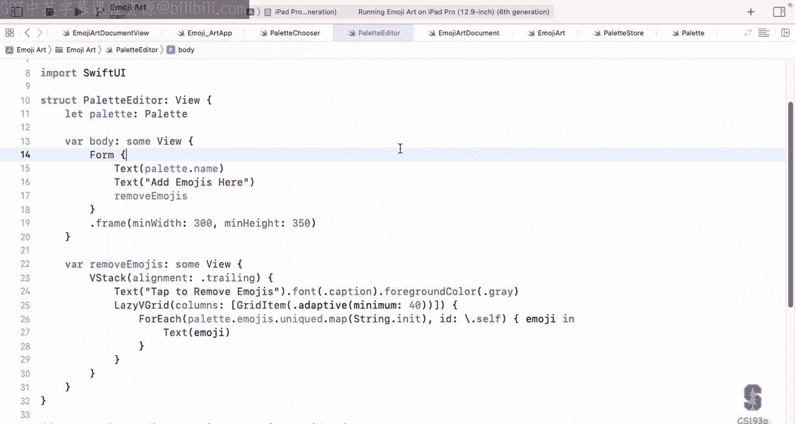

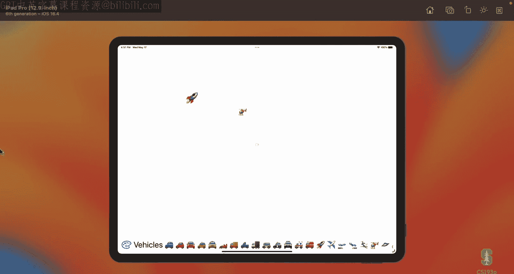

Organized it nicely， put some lines in between put the little gray background on it。

 etc so you can see why you're going to use form anytime you have to do something like this get some information when the user toggled information or text or whatever you're going to do something using a form form really really powerful and really important you can see forms all the time and we can do more with the form the form has a lot of features in it you're going to read its documentation I'm going cover them all today Ive got so much to cover today but I'm going to show you one thing in forms which is you can divide the stuff in the form up in sections。

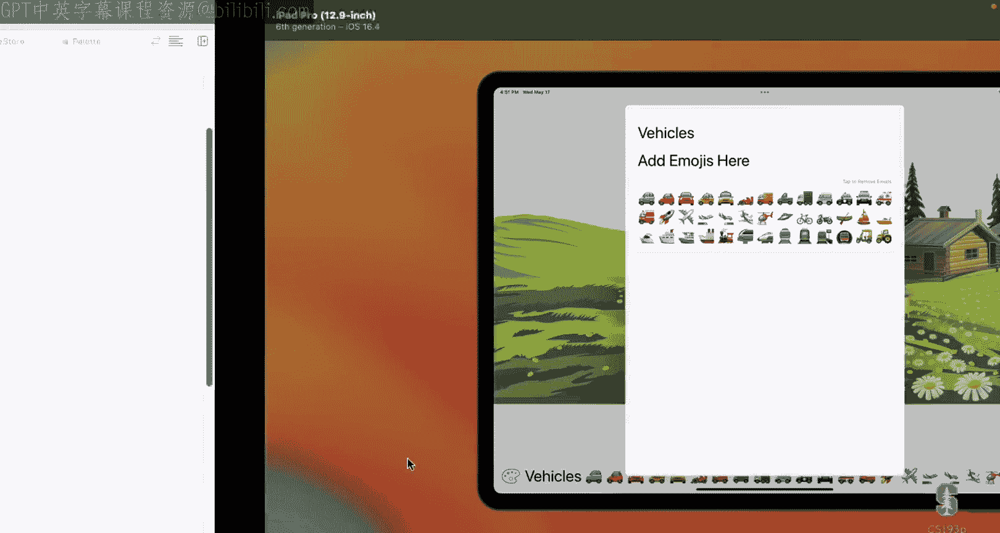

We have two obvious sections here， one is the name at the top section has a header。

It can put any view you want here， but I'm going to have just simple text， this is name。

That's this one， and then there's another section here for the emojis header。

Called this my emojis section。It's got both of these emojis things in there。

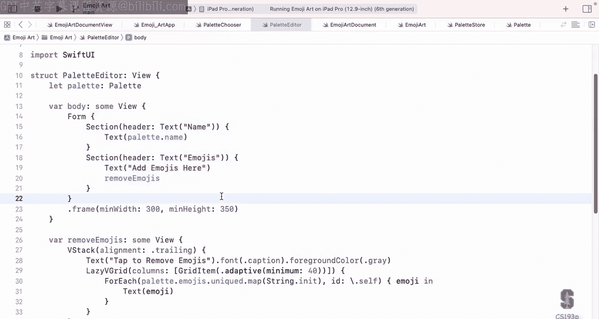

Let's go see what it does to add the section there。

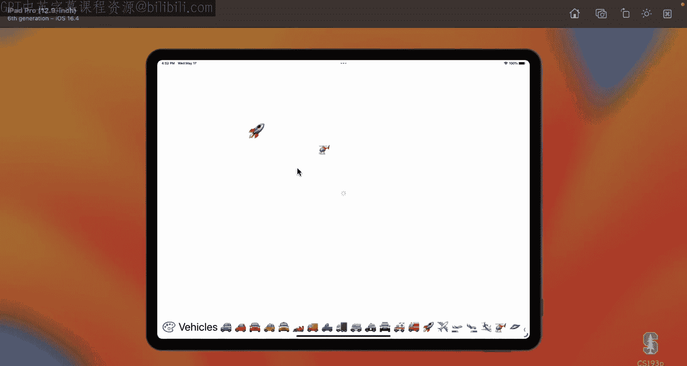

All right， see it put a little header and the emojis header in there Now we got a problem here actually this doesn't look that great。

 all the fonts are huge and that actually works nice for a demo but why are those fonts so big if you use iOS all the time you don't see fonts like that Well it's because we set the font of this thing。

To be big because we wanted it to be big for the user to drag these emojis out when we presented the sheet。

 it got that font passed on down to it and we didn't want that。 We do not want this to have that。

 So how do we stop a font once we go to another sheet or some other UI。 We don't want it anymore。

 We can do that with font nil。 I'm going to go back to my pallet user here。

 Here's where I put my palette editor up， and I'm going to say font nil In other words。

 go back to whatever the default is stop using whatever somebody set on me。

That's going to make a big difference here。Gotten small again。 This is a kind of normal size。

 Now these are too small。 I really I want， especially the remote tap to remove emojis。

 I want it to be larger there， and I also want the font of add emojis here to be the same size as the font for the emojis that I'm removing。

 I want them kind of match So I'm going to go back and actually set that font separately back to my palette editor here。

's create a little private let emoji font I'll call it， and it's going to be a font， system font。

 size， let's say 40， whatever size we really want there。

 and I'm going to put this emoji font on all the places I want it。

 which is to say I want it here in my remove emojis。And I also want it on this little ad emojis here。

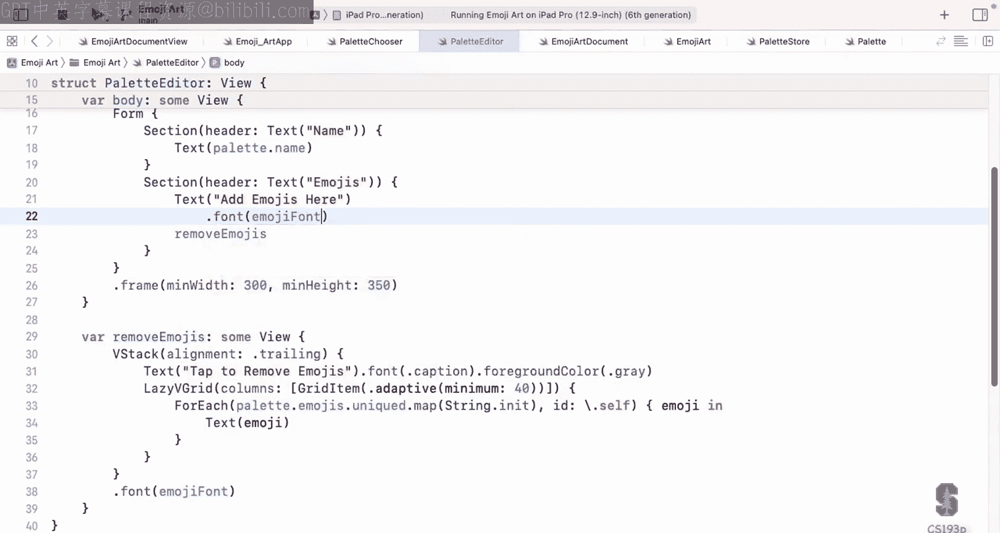

All， that looks better。All right， next thing， most important thing。

 I want to be able to edit the title and also to add the emoji。

 so how do I take that text field that we have up here。

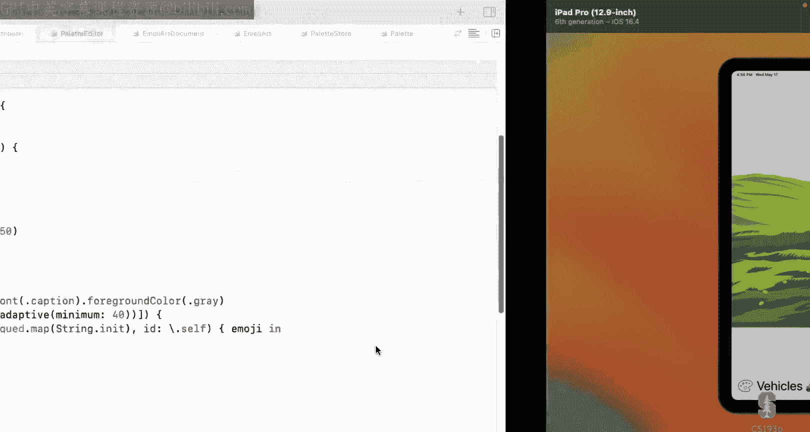

And make it an editable text field。 Well， editable text fields in Swift are different views than text。

 They're called instead of text， text field， and a text field has two arguments。

 One of them is kind of a placeholder or a。A word that can be used to help the user understand what we're asking for here。

 a label， if you want to think of it that way， and then a second argument called text。

 which is the actual text that's being edited inside this text field。Now this is yet another。

 this is our second binding。If you think about what's going on here。

 we have our text field says vehicles in it， we want to be able to pass in the initial value of it。

 vehicles， and whenever it changes， we want to know about it。

 and the way we're going to do that is by creating a single source of truth for that text and the way we're going to do that is with a binding。

Specifically， this argument to a text field is a binding。

 the text field knows that it doesn't want to hold a copy of what's being edited。

 it wants to edit that thing directly， so it's asking you to give a binding to that source of truth。

Well， what is the source of truth for this palette dot name， It's in our view model。

 our pallet store， so we need to give our text field here a binding all the way back to our view model to do that。

 we need a binding to the palette we've been given to edit at the top of our palette editor view here by making this far at sign binding we are forcing whoever creates this palette editor to give us a binding to the source of truth for this palette。

Now， anytime we reference this palette， anywhere in our code here in the palette editor。

 we'll actually be referencing the palette back in the view model。

And we can also use this binding to pass a binding to the name into our text field。

 that's because dollar sign the dollar sign projected value of a binding is another binding to that binding so dollar sign palette do name here means a binding to the binding to this palette which is going to be bound all the way back to our view model now our text field will be editing the palette name directly in the view model。

You can see these dollar signs， these bindings are flowing through our view system。

So now back in our palette chooser， you can see we're going to error here because this is supposed to be a binding。

To the truth not here I'm passing the truth and so this is value type programming so it copies the truth。

 I don't want to copy the truth， I want to bind into it and I can get it here by saying dollar sign here because this store is an environment object and the binding the dollar sign the project value of an environment object just like an observed object。

Is。A bindingiding to that store or that view models variables， including its pallets。

Our pallet store has a var called pallets， it's a computed v even。

 but we can bind right into in back look， I'm even binding to a certain element of that array。

Combined all the way down through。So I've created a binding to this source of truth。

 this is the source of truth， and'm to pass that binding to my editor。

 now everything that my editor does with that palette is going to be changing it in the source。

Not changing it local or anything back in that source， it's actually being changed。

Let's go back to our editor and look here。Why we run？

We edit now it says vehicles because it's showing you what's in the model and watch this if I go now and change this to travel。

Look what's happening even as I'm deleting， you see， it's changing it in the model。

You can see it down there， travel。Right。We are directly editing this thing in the model there's a single source of truth work it。

Let's also bind our little ad emojis here， but the interesting thing about ad emojis here is that's not actually in my palette。

 This is a text field， this addd emoji here when I type it。

 it should add it to my palette dot emojis it's not replacing my palette do emojis I didn't pick a Ui which is type your emojis here it's add these emojis and then click here to remove so I didn't quite match my UI to what my representation in my view model is which is perfectly fine So in this case we're going have the source of truth for ad emojis here be a local assign state but every time the As state changes I'm going to update my model by adding the emojis。

'See what that looks like。Here's add emojis。We get a text field I like add emojis here as the prompt and the text is going to be emojis to add essentially。

 we'll go up here and create an outside state， private far emojis to add， it's a string。

 it'll start out as no emojis to add。And literally， I'm just going to say。Right after this。

 on change of emojis to add， and it gives me back the new version。Of the emojis to add。 Now。

 I'm going to add those emojis。Powerfully here， I'm going to put the new emojis at the beginning of the list。

 assuming that they're new and we want them there。 I'm also going to unique them。

 I'm also going to strip out anything that's not an emoji So if you go to add emojis here and you type hello it's not going to put hello down there or eight it's going be just emojis there're emojis only now I can imagine one day maybe where I do want words and stuff in my pallets down there。

 but not today emojis only in this course I'm gonna say palette emojis equal and that's a important statement right there when I say palette do emojis equal I'm talking about the palette in the view model I'm changing the view model right here because I have a binding all the way back。

So that's going to change the view model directly I'm going to say my emojis to add plus the emojis already have。

And I'm going to filter them by making sure they're only emojis now this is emoji。

 I' talk about that in a second， and I'm also going to unique them we already know about unique is emoji is not something that's in Swift。

 I actually wrote that function， it's in my extensions。It's not a perfect emoji test。

 but it's pretty good， it catches most emojis， but bottom line is I only want emojis here。

So everyone got what I did， I took the emojis to add and I am adding them to the powder I have and I'm uniqueing them。

We's see what that looks like。This is travel， let's go look to it in our emojis。

 we have travel here somewhere， where is travel。There it is， okay。

 maybe we add a couple of shifts now notice that I actually double click type it's okay because it uniques them。

 it only adds one and see how it's adding it to the front。Of the list of emojis。

 this list of emojis to remove， that's coming straight out of the model。

So as I'm adding to the model， it's just updating automatically。

 you're starting to get the picture here that by binding everything， everything just works。

 everything is you type add things to your model and they show up， they show up not only up there。

 look， they show up here。You see， travel， I just added added those ships。What about removing em。

 let's do the tap to remove go down here and see that our travel had added our ships that we added there and of course our pallet thing is completely persistent so every time we quit and come back it's all still there。

Removing emojis， real easy down here on tap gesture。I'm going to do it with animation。

 I want them to nicely animate。 I's going to say my palette do emojis do remove emoji。

First it should be a single emoji string， but we can say first to get the first thing out of it。

 which it's only one thing in the string so it will be the thing and remove is another function I wrote just to make this simpler。

I'm also going to remove it out of the emojis to add too， because if you removed it。

 you probably don't want it anymore。So Ba removed it out of both of them。

Let's see what this looks like。Again， when I say pallet。moojis。remove， I'm modifying the model。

There's our travel， got our boats。Here we go， let's remove the boats， we don't have the boats see。

 we're removing them and if we went back here and we and I did want that boat I can't even see which ones are boats there or there's a boat。

 put it back and they actually don't want it get removed them from there。

Now this is not a great UI for adding or removing Mojis。

 okay I picked this UI because I wanted to show you how we're updating the model all over the place in there and it's just updating everywhere and this is the fundamental part in this whole declarative approach is that there's a single source of truth and that you edit that source of truth then it just shows up in the UI it doesn't require a lot of extra you know messing around to have it happen。

I'm going to do one other thing while I'm here unrelated to all this cool binding and all that stuff。

 which is when we first appear。I'm bring this up and edit。Nothing's editable， no keyboard comes up。

 it didn't pick either of the two things to edit， but it should you know it's like why wouldn't it just pick the ad emojis here so that I can just immediately start typing but let's talk a little about how you make the keyboard come up。

It's not how you would think it's not like a view modifier on text， oh， by the way。

If you search for viewmodifiers that start with dot text you'll find a lot of them。

 there's a lot of ways you can customize your text field， auto capitalization， auto correction。

 you know when you type in this correcting your words annoyingly。

 you can make it do that or not all that stuff dot text viewmodifiers we're not going cover them but just look up that in the documentation。

So how can I make it so that it puts the focus on there and brings that keyboard up and that's done with something called focus and here's how it works kind of interesting。

 we're going to create a new kind of outside thing called actign focus state and focus state is a thing that's used to keep track of which of the text fields has the focus of the keyboard。

I'm going make it a private var， oftentimes this is a bo because you'll only have one text field and you either it's either focused or not but we have two text fields。

 so I'm going to make my focus be my own little enum so let's create an enum focused and it's going to have the name or the add emoji so are the two things that can be focused and so my focus is going to be a focused and it has to be optional because neither of them might be focused in fact that's the case now when it comes up neither of them have the focus so there's no keyboard。

This is going to be used with a binding as well because we need to be able to tell it which one we want to be focused。

 but the user could click on the other one and then it needs to tell us that it's the other one so we're going to a binding here that works like this dofocus and you give it a binding to these little focus state thing like that and you tell it here which one this one is which is name。

We're going to do the exact same thing down here， top focused。

Is the focus thing equals this case dot add emojis。

 You see how I'm just by using this little modifier， I'm just telling the system which。

Thing to set to what when this thing becomes a focus。 And vice versa。

 if someone sets this focus equal to this， then this will become the focus。

 It'll get the blink in cursor and the keyboard will come up。 And once I have this mechanism。

 Now I can do something really fun。 I can say when I appear。If my palette's name is empty。

Then focus my palette's name。Otherwise。Focus the a emojis。See so now when my palette editor appears。

 I'm going to pick which one of those， if I have no name， then I'm going to make the name be edit。

 but if I have a name， I'm going to do to add emojis， let's see this go。W， keyboard comes up。

 add emojis because we have a name travel， so it's good to go。

Now this would really be cool when we create a new emoji I'm talking about down here。

 when we say new， right now it adds math， what if it created an empty one and put that editor up on it？

Good that。All right， so here we go。 Here's our new。 Instead of having new do math。

 I'll have new do nothingness。 No emojis。 And let me say show palette editor equals true。

Because we built good primitives here， it's real easy to go here and say give me a new one。

 it's blank and look what it picked the name because I had that little focus thing。

 there's no name so I picked it maybe I would say， oh， I want blue emojis here， go down here。

 think pick blue ones or little blue one， blue， blue。

Things that are blue now I have a new one here blue。

We punted over here in our palette editor on our preview。

Why did we punt there well because they had to have an argument and now it's especially tricky because the argument is a binding。

How in my preview， am I going to test my preview out and have a binding that is really like there's no way to do it。

 right， where do I put to binding here？I'm going to show you a really cool thing you can do with previews in general that really works nicely for bindings。

 which is that you can make your own view for the preview right in line here I'm going saystruct my preview。

 it's a view， it has a v body which is some view and this var body is going to be a palette editor and this thing needs some binding to its palette。

 oh no problem， we can just say outside state private bar。ThePette。

I can even give it an initial value， let's say something like make a pallet store on the fly here named Preview and let's get its pallets。

And maybe we' can script the first one and we know that the pallets can't be empty。

 so we'll just exclamation point to you unwrap it and now we can pass a binding to that palette。

Now down here in our previews， we just put one of these views， a preview view。

I wanted to preview this palette editor so I need something to edit。

 so I created a view that has at sign state and then I passed a binding to that As sign state and I'm just showing this view。

Your previews don't always have to just be the thing that you're previewing。

 they could be some other view that shows the thing that you're previewing。

 which is what I'm doing here。Another thing we could have done here is an App signed state object with just this pallet store。

 and then we could have done Dos store do pallet that would have been fine to either way。

 were creating something we combined bind into。Okay that's it for the pallet editor for now。

 we're going to go away from it， we're going to come back to it。

The next thing I want to do is show you some UI to show a list of pallets。

We're going to use this list to do a lot of things， navigate around， look at our palettes。

 edit them eventually etc ce， but first I just want to put a list of palettes up and I'm going to do that with another animated action button here。

This one I'm going to call list because it's going to be a list of them and I found this one list。

 bulletet。 rececttangle doportit， you know it's really fun looking through the SF symbols to try and find symbols you're like。

 oh that's the thing but I will say that probably there are images you're supposed to use for some of these features。

Like new you're probably always supposed to use a plus I would say maybe I should be better and actually go look is pencil really what I should use for edit I think it is Apple'suterine interface face because I should really check that out it'll help you with things like this anyway I thought this one looked like a list of palettes'm so I chose it。

And here I'm not going to show the palette editor instead I'm going to show a palette list。

 so this is a new。1。Go up here and create another。Ting called show palette L。

But I'm going to do this exact same thing， I'm going to create a sheet with it。

Is presented a dollar sign show palette。List and this one I'm going to do a pallet list another new thing。

 which is a pallet list Oh and before I even go over there I know this one also I'm going to want to do font nil because I don't want my pallet list to inherit my gigantic fonts。

This is a swift UI view， of course， palette list， make sure it's in the right place it is。

Coll it list。Yeah it's probably right there， it's fine。List of palettes， let's just do a little。

V stack here。For each。My stores pallets。T it in。We'll just put the name of the palette。

And notice I'm accessing a store， so I'm just going to grab my environment store。

 the store that's even injected down into all of these things， no reason I can't。Just use that。

Let's go look at this。No。Here's list， right， this new thing。Yes， there it is。NiceNice list of pals。

Extremely ugly。 This is not what we want。 Well on the other one。

 we were able to use that really powerful thing form。

 Well there's another one we can use to make this look really good。 Anytime we have a list of things。

 we're going to use a different。 So Q I view called。😊，List。See what that looks like。

O much nicer lines and again， the gray background white so list another thing like form you're gonna use a lot of you guys have used iPhones。

 you see these list absolutely everywhere list is also another one you want to go look at the documentation dot list view modifiers mechanisms you can do to make your list look how you want。

 so definitely go look at the dot list view modifiers to make your list look cool The other thing about list you can actually combine it with your for each。

So if you do list like this。明日。You can make it a simple little list。

 other words list has its own built in kind of for each thing you can even do the ID self if you want to do that there。

Now we have that list is great， but what really cool is if we can click on something to list and have it navigate slide over and show us that palette so we got list of pallets。

 click on one oh show it to us， not editing it yet just show it to us so we can see what it looks like so that clicking on something and have it slide over is called navigation and we do it everywhere in Swif Ui again you've used iOS apps。

 you go click them all the time in fact， let's hop over to our simulator here and run the settings app and we go settings and see how we're clicking and navigating around now we can hit back buttons to go back。

😊。

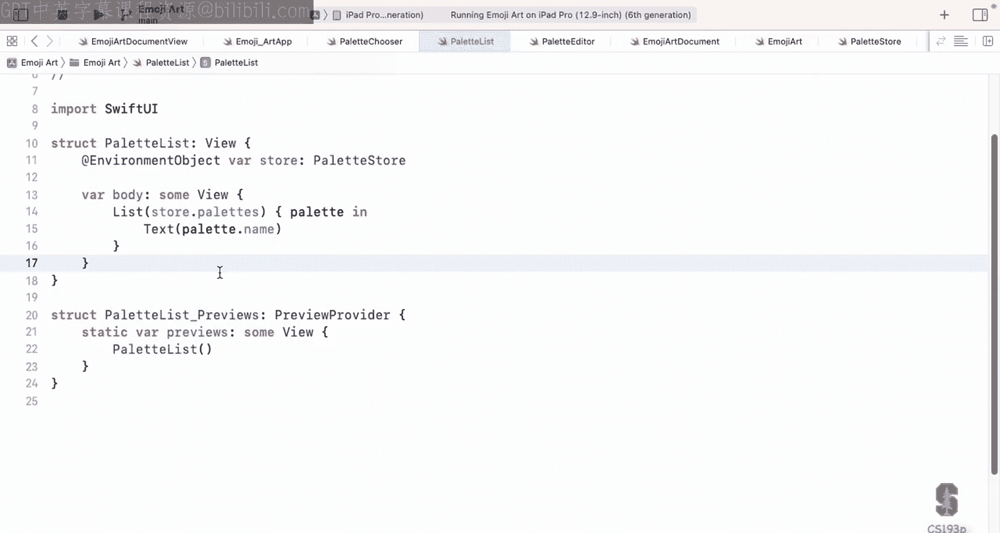

This kind of navigating around is fundamental to iOS now here we have it's an iPad so it's nice we have a column here and we're navigating here but even once we're over here we're still navigating over further right further and further so we want to be able to do this navigate deep down really nice when you have a lot of information that's hierarchical。

You have your workout schedules and then you click on it and it tells you the day and then you pick the day and it tells you the kind of workout and then you click see what I'm saying you're going down in a hierarchical structure that's what we're trying to build here so back in RFf we want to be able to click on this and have it show it to it and then we're going to put another level too where we click on one of the emojis and they chose some detail on that as well how do we do that there's really three pieces to navigation first of all you're usually going to have a list。

 but you don't have to you can navigate from anything the only thing is users are used to navigating from things in lists right and I told you it was hierarchical so know usually hierarchical things are in list but it doesn't have to be。

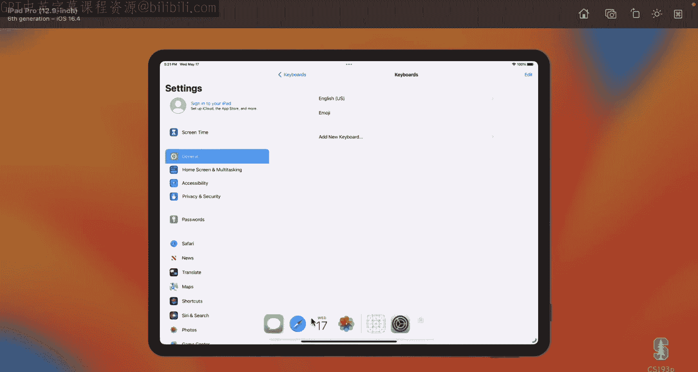

The first thing you got to do is put it in a navigation stack so this navigation stack has to be around everything that's happening in the navigation。

 this is the highest level this is the container that allows all the navigation to happen if you don't put a navigation stack around this then all the other stuff I'm showing you it just will do nothing in fact it'll put errors on the console that says you've tried to navigate and you're not in a navigation stack so you' got to have that on the outside。

😡，The second thing is you have to say what is the thing in the UI that a user can touch on to navigate so in our case it's one of the things in the list。

 this little text right here if you click on that text it should navigate and the way you tell it that is by putting a navigation link around it。

SoA navigation link takes a view builder， which is just the thing you're going to be clicking on。

 and it has this other very important argument here called value。

The value is the value that Swiftyi is going to associate with clicking on that thing In our case。

 it's obvious a palette we're clicking on the name of a pallet。

 the pallet is what we're associating with but you can actually associate it with anything but what's going to happen next is we're going to take that association and then figure out what to navigate to based on what it is okay in this case the pallet we'll get that in a second because first we have a problem here it says this requires the pallet conforms to hashable which kind of make sense if you're going to have the things that's associated with every link be a pallet SwifUi needs to like build a hash table that goes from the pallet to the thing you're going to navigate to so it needs to build a hash table so it needs to be hassable luckily real easy and go over to our pallets。

And make it hashable， go down here and say。Appable。And this is a value type。Magic， it's hassable。

 we don't have to do anything when entrepreneur hashs functions or whatever。

 all of our vs are hashable， and so it's hassable， it's the same thing same thing we got with codeable where it just as long as all of our vs are that。

 it can just build it for us automatically。That was really easy。Go back here too。

 or where are we I list。Oh， hopefully we fix that。have so that's number two， okay。

 navigation stack one， navigation link two， the third thing is tell SwifUI what to do when that value is chosen。

When that value that's in that navigation link is chosen， where do we go with it， We do that with。

Navigation， destination。For what type of thing in our case， the pallets？

What this is saying is when a palette， when the value of a link is a palette。

 then this is what to do， the view to show essentially， so it'll give you that palette back。

 that's this value that was up here， it's going to give it back to you and now you have to build a view that will show that palette and it's going to navigate to it。

So here we're going to have a little view， I'm calling a palette view that takes a palette。

Shows the palette in the view。To make it quick， I'm just going to。

Type this in because it's so simple。To my palette view。

 a kin and lazy V grid that shows the emojis unique as strings， nothing special there。

 you guys have seen it all。That's it。Three things， navigation stack， navigation link。

 the destination。See this in action。Here's our list。 One thing you can see right away。

 these little chevrons。 you see the little things。 That's what tells the user， oh。

 this is a navigation link。 If you click on this， it's going to navigate。

 Now those don't appear on random views generally， but they're always going to appear if they're in a list。

 That's another reason to put things that navigating in the list。 Here we go。 Travel。 it did it。

 It's showing us all the things。 And look， I have a back button。 I can go back music。

 there's the music ones back。 It's cool。😊，Now， the only thing is when I clicked and went through here。

 it showed me the emojis， but I didn't put the name。CoVd name at the top there。

 I left that off because I want to show you a way that you can put that on。

Here I've got a pallet view， and if I put inside my palette view that its navigation title is the pallets。

Name。Then that saying anytime this view is the currently showing thing。

 use this as the title at the top of the navigation stack， that's how the titles work。

 they're not something you set externally， you attach them to the views that appear， a view appears。

 it has a navigation title， it'll use it at the top。Let's see what that looks like。

And when I click CoVd now， look， I heard CoVId at the top as a little title of the navigation。

 and I can do it with this level2。 This has no title at the top， right This navigation has no title。

 Let's give it one。 That's back up here。Dot navigation title and this is the basically the name of the store so let's say back slash store do name pallets it's the pallets in that store right that's what the top level is。

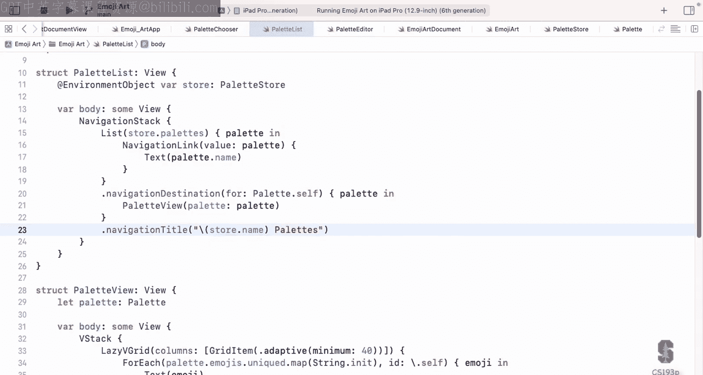

See this in action。

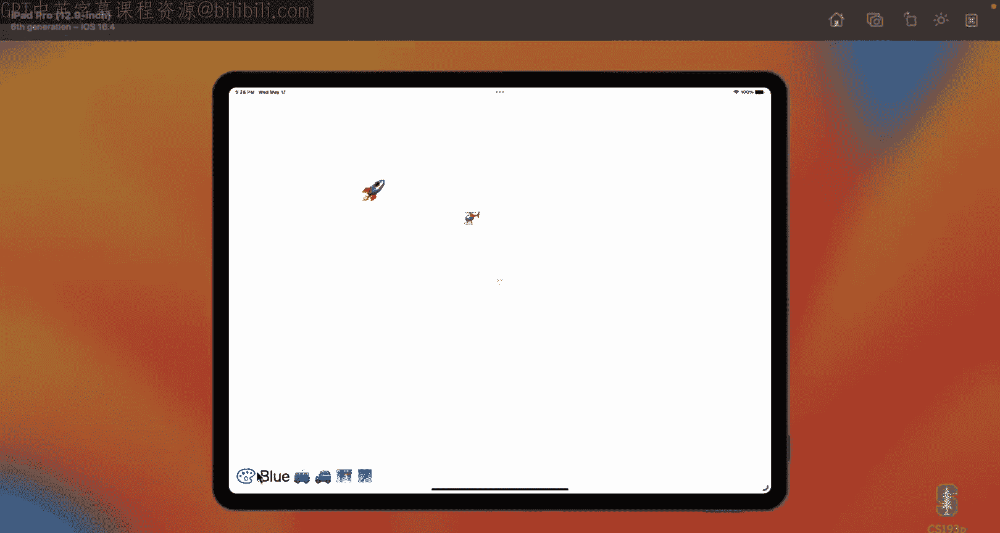

Main palettes and since I gave a title to my root view of the navigation。

 it's using this large title for it and now when I navigate in it'll keep using the large title so it inherits it essentially from the thing that navigate it the other thing is notice my back button it no longer says back now it says main pallets because it knows what's there so when I hit main pallets it goes back to it。

Now one thing I want to emphasize about navigation title well two things really one is again。

 you attach it to the view that is going to be on screen when you want that to be the title and number two is you put it inside the navigation stack noticeice I did not put this navigation title outside here。

On the navigation stack， this would not work because these navigation titles go on the views that are appearing in there。

The second thing I want to emphasize is that with these navigation destinations。

 they don't want to go inside the list。They go outside the list。

 so don't attach them to this text or to this navigation link or inside of for each see it's on this navigation is on the outside of this list because the links are all piling up inside the list and we're saying here's the value for this one and now outside the list we're saying here's where to go。

😡，The other thing I will say is for kind of nice programming style。

 put the navigation links and the navigation destinations that go with them close together in the code。

 even if it means you have to kind of factor some stuff out。

Having them close together helps someone reading your code understand what's going to happen here。

 So notice these two are close together and then down here。We're going to make another one。

 we're going to put these close together。This one I'm going to put down here is when I click on the emoji。

 I'm going to show the emoji really big。Really easy to do。Navigation link。

The value here is the emoji， that's the value I want associated with that being shown。

 and then outside the for each， even outside this lazy V grid。

 I'm going to say navigation destination for strings because what those emojis are is just a text of that emoji with a really large font。

A coupleup of things knows here， I put these in here。

 there's no navigation stack anywhere here the navigation stack is over somewhere else and it doesn't have to be here the navigation stack can be surrounding the whole world。

 it might be way far away， but these two things are going together the link and the destination they're nearby even though the destinations outside the lazy V grid they're close by visually in the code。

Let's see what this looks like。All right， we got this， go to sports， here it is。

 let's tap on one of these。Oh。Pretty cool。And COVD doesn't kind of scary。

Notice that the back button here is COVID because we're going back to COVID and the back button here is main pals。

Next thing I want to do is the same palette list thing but editable and I mean seriously editable。

 not just we're going to use an editable thing here when we click our palette editor that we have but also when we're at this list back here I want to be able to swipe to delete and move them around to a different order right or add a new one。

 I want to be able to do all that stuff， so this is a fully editable palette list。Let's go make that。

I'm going to do it by starting with this same palette list code。

 but I'm going copy and paste it because I want it to be something where you can look at them both and see them side by side。

 the editable one and how it works and the non-editable one thats very。

 very similar but doesn't have all the editing features right next to it so I'm starting with this same thing and start right off the bat having the list be a little more than just the names I'm going to be a little more like what we saw in memorize with the themes I'm going to put the names and the emojis there so I'm going to turn this little thing into a vStack well do alignment leading。

We'll put the name and we're also going to put the emojis However， I if it has a ton of emojis。

 I don't want it to be multiple lines so that every line is a different height I want them all to just be two lines name and emojis so I'm going to use a cool little。

Thing called line limit。One， you can send to a text that says only one line， and if it won't fit。

 then just put dot dot dot at the end， which is exactly what I want here。

Let's use this instead of using the non editable one。

 so I'm going back to my chooser where I say palette list and I'm saying Edable palette list instead。

 so I'm just picking the different one that I just created right here。

We haven't really done anything to make it editable， but we can see it looks kind of cooler。

' got more stuff going on in there and what we want to be able to do here is swipe to delete and we tap on it we want to go to our palette editor so we're editing the palette and I want to be able to pick them up and move them around。

 put them into different order than when I cycle through and I'm going have a little plus button up at the top that adds a new one so I'm going to be doing a lot of stuff here and it's gonna to be surprisingly not as much work as you might think。

Let's start with the swipe to delete and moving them around that is incredibly easy only trick to it is we can't do this list like this。

 we have to break it out into a four each because for each is the thing that has one little view modifier that does the move and one that does the delete so you can do it with one line one viewmodifier but only on a for each it doesn't work on a list so I'm just going to take my list and break it up into a four each put it back the way it was essentially。

This is inside a list for each， everyone， see what I did there， just separated them out。

 and then the for each has a really cool thing called on deletete。

And it takes what's called an index set， an index set is exactly what it sounds like。

 a set of indices into the four inchess array。And of course we're on delete it's just going to be one of them because you can only swipe delete one of them you can't swipe delete multiple I don't think。

 so I'm going to animate this deletion I'm going to say with animation store。 pallets。

Dot remove at offsets those index sets， so remove at offsets is just something in array that takes an index set and removes all the things at that those indices in one batch it's like batch remove from an array。

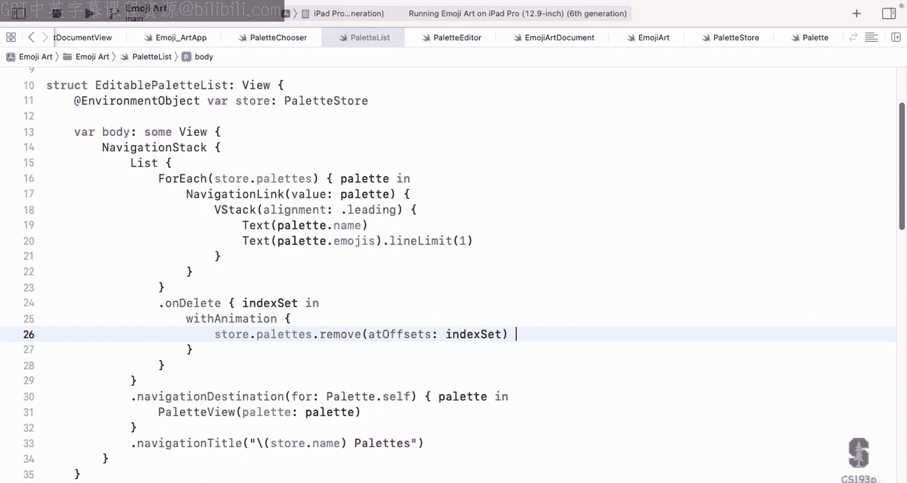

That's all we need to do here。Before each providing us this really nice on delete， we go over here。

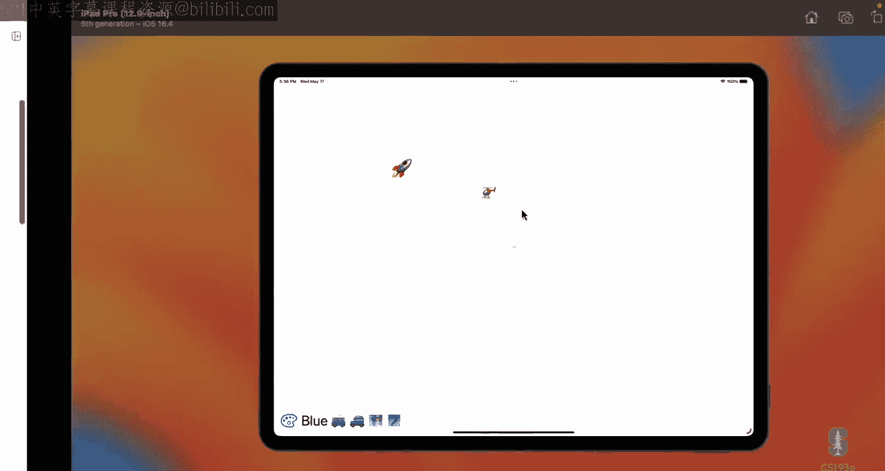

Our list， we swipe， gone and if we swipe just a little， then we get a chance to confirm。

 so a big swipe deletes it entirely， a smaller swipe。Let's believe， and you can cancel like， no。

 I don't really want to do it。Now the move is exactly the same moving things in around the middle list dot on move this line。

 instead of just taking the one index set， it takes an index set and a destination for that which is new offset in and again there's a nice array thing to do this pallets dot move from these offsets。

The index set。To the offset new offset one liner moves things around in the array。 it's a batch move。

 bunch of indexes gets moved to a new place in the array。And for each provides this nice UI for this。

You're going just press and hold and you can drag it around to where you want it， let go。

And watch what happens if I put it at the top。It replaced the thing in the bottom， you see。

 because the cursor index at the top， so it's going to replace。

The cursor index because this becomes the new first thing in the list。

What about a plus sign in the upper right to add a new one to this Also really easy do that using a toolbar so one thing that's really great about putting things in navigation stacks and honestly people sometimes put stuff in navigation stacks just so they get this feature you can put a toolbar buttons at the top see these toolbar buttons all over the place you and you can put them on other views that don't have to be a navigation stacks but it's a really easy way to do if you have a navigation stack the way you put a toolbar in there it looks like this do toolbar you just put the buttons you want here's a button。

We'll talk about what it does in a second and its label is going to be the system name for plus because it's adding。

And what do we want to do to add something here， where we know how to add a pallet， store。insert。

 an empty pallet。Same thing we did with the new button down the context menu。

 let's see this in action。See， plus button up there， get at a toolbar and you can have multiple。

 that toolbar thing can take multiple buttons up there if you want to have them。

 they hit plus and it added it right here at the top。

Now our other new is better because you hit new and it adds it and then it goes there and navigates to it。

 so let's do that for this one too， But first we have to make it so that when we tap on one of these it doesn't go to this static view it actually goes to our editor how do we get this thing to go to our editor pretty straightforward right here's the destination when you click on a pallet instead of going to a pallet view。

 I want to go to a palette editor， but of course a palette editor takes a binding to a pallet because it's going to edit that thing how are we going to get a binding to a palette here instead of the pallet that we just clicked on well I'm going to go look at my store and find the palette there that has the same ID as the one I just clicked on and path a binding to it in here so this is the now very popular little line of code that we do all the time which is if let index equals store pallets。

That first index where the 0 do ID equals this pallet's ID， then we can go down here。

And instead of passing a pallet， pass。A dollar sign store do pallets at that index。

So when you want to pass a bind into something， sometimes you have to go look it up。

 find it somewhere in your view model so that you can dollar sign it。Because if we just tried to say。

Dollar sign pallet here that wouldn't work this palette is not a state or anything like that it's just a bar that got passed in there it's a copy of a pallet。

 there's no way you can dollar sign it， you have to dollar sign states， observed objects。

 things like that。Let's go see if this works。Here we go COVID it's the editing UI for COVID and we can put some more COVID COVID train。

 I guess， oh andm sorry when we interesting about this too， we go here to COVID。

 you can see that we added our train there， let's add another one， the COVID Vepa。

 we can still navigate back。We don't have to exit or anything like that we can navigate around and it always is remembering what's going on because we're changing it in the model。

Now what about this new opening this up automatically。

 that requires a little different navigation destination。

So here's another form of navigation destination， navigation destination and this one is instead of saying navigation destination4。

 you're going to say navigation destination is presented and you have to give it a binding。

 I'll call this one show we'll show the cursor palette that if we just created a new one it' will be added at the cursor。

 so we'll show a cursor palette when we do this and this is also the palette editor。Showing。

 but instead of the index here， this is the Stores cursor index。So if I set a Boolean。

 which I haven't created yet called show cursor palette。

 it's going to navigate to the cursor palette， the editor for the cursor index。

 so let's give ourselves that little at sign state private var show cursor palette。Go false。

AndSo that's an outside state so we can pass a binding to it。

 and then when we create a new palette down here， we'll just say show cursor palette equals true and it will navigate to that。

But to delete this or we're not confused ready plus。There it is， it navigates to it。

 they can say I don't know， green this time。Go down here add some green emojis。

That green looks green， I've drop some green in it， some green。

There we go back and there it is green at the top。That's all I want to show you for that stuff The last thing I want to show you or' short on times I'm going to run just a little over is when you're on an iPad you can have more space so you don't necessarily need your navigation to always be replacing what you're seeing with something else you could actually have multiple things showing we saw that in settings remember in settings there was a column on the left when we click on it and then on the right we were navigating over there but we could have two or possibly even three columns so how does that work and for this one just to make this go a little faster I'm going create one of these multipane things and put it as our content view so I don't have to always keep going back and choosing this little list thing down here I don't want have to keep going back here and hitting list so I'm just going to replace my whole emoji art with that。

Let's go back here， create this thing first， new file。It's a view。

 I'm going to call this one my pallet manager and what the pallet manager is going to do is's going to manage all the palates in all the stores。

 not just our veine pallet， this bit got injected down。

 but it's going to manage all the pallets in all the stores。

So here's our palette manager and I'm going to start right off the bat showing you how this works with navigation here。

 instead of using navigation stack， you're going to use something called navigation split view and navigation split view has an extra little thing here。

 which is a second pane and it can actually have a third pane， which I'm going to do in a second。

But I'm going to start here by just having all my stores in the left pane and then the pallets that are in that store on the right。

 store on the left， click up store boom， you see the pallet in it。Let's like I said。

 go back to my emoji art app instead of showing my emoji art document view here。

 I'm going to show this palette manager instead and I can even run this like this and give you an idea of what these things generally looks like a little hard to see but just see this very thin gray line right here so this is the left side and this is the right side and we don't have anything in either side so they're blank notice there's a little button in the upper left that hides the left side。

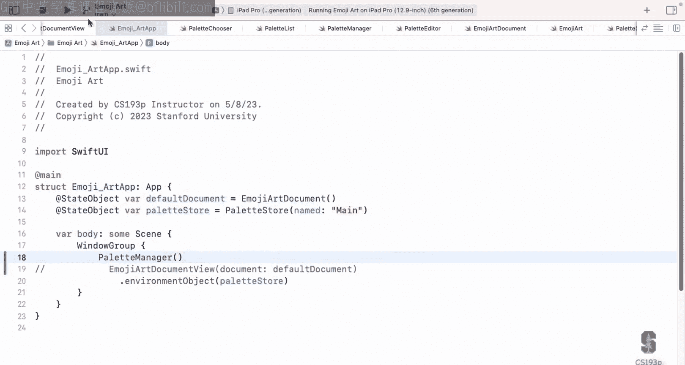

The gray line disappeared if you can't see it， and this brings it back。

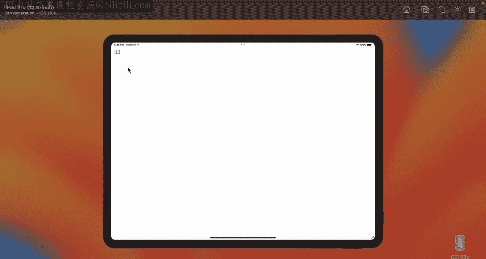

So this is a two pane version of this in the left pane I'm going to put a bunch of stores。

 so let's go ahead and do that， go back to my pallet manager。

And had a let stores be an array of pallet stores， I'm going to show these array of pallet stores in my left pane list stores。

Store in。Now I want to say store dot name， but this is bad， why is this bad？

It's because this store that we want to show the name of is not held in an atign observed object in our pallet manager。

 It was passed to us in an array of stores。 we want to be disciplined about only accessing the vs of an observable object from a var that is marked atign observed object or atign environment object if we don't。

 then we won't get the atign observed object behavior。

 which is that when one of our atign observed objects published vs change。

 our view might have to redraw itself。Of course， it's not really a problem here because the Val Do's name is not even atign published and in fact it's a constant let。

 but it's still bad form to access an observable objects vs from a var that is not marked at sign observed object。

Now the fix here is to just create another view， maybe we'll call it pallet door view。

 and pass this store into an atign observed object bar in that view， and then it can show the name。

We're pressed for time here， so I'm not going to do that。

 but I'll put it in the code that I post for this after lecture， so check that out。

Notice that when I put the stores in a list like that it says， oh well wait a second。

 you're putting that essentially in a four each， those things have to be identifiable。

 so we have to go back to our pallet store over here。And we have to make it。B。😊，Identifiable。

 this might seem kind of weird because this is a view model。I'm putting a view model in a list。

 but there's nothing wrong with that。 I can do that。 Also notice that I said endentifiable。

 it's not complaining。Classes。Are identifiable by the pointer to them。

So if you say class is identifiable， it's identifiable， I actually don't want this。Behavior。

Because I can create two pallet stores with the same name。

 they're both writing into the same user default place， they'll be the same palace store。

 they will be writing and sharing each other's data。

 so identifiable for a P store really is v ID a string which is my name。

 that's what identifies me as a palacelet store。Because I store all my data into one database。

Multiple versions of me with the same name would be the same thing。

So that's a little different there。Back to our palette manager here。

That fixes that little store thing Now what about the detail here I'm going to just for now say choose a store because I want the person to choose a store in the left pane and then I'll show them the store in the right plane so for now we're gonna say that and then also this pallet manager here let's just not have a preview but I could easily make a preview now the thing is I have an argument here to my pallet manager so let's provide that we have my pallet manager stores we'll put our pallet store which is the thing we inject let's make a couple more。

Store 2。Store 3， I'll call this one。 my alternate store。 I'll call this one maybe。

Special store or something， but there are different stores and we'll pass them in so we have multiple stores to choose from store to。

And store three。

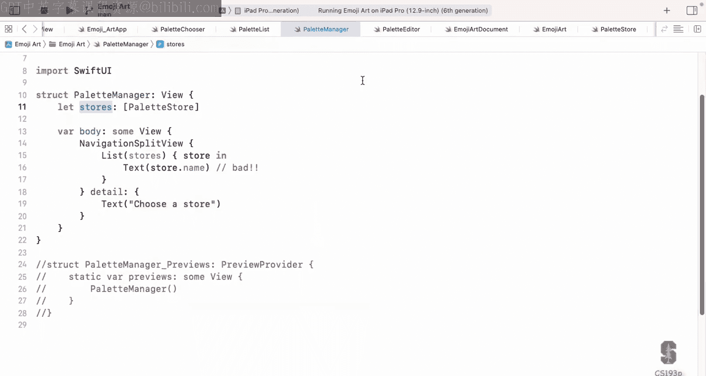

Let's go see what that looks like。there we go， left side。

 you see we have our stores and what we want is when we tap on one of these。

Show me the palette in that store。

So how do we make that happen Well， we could actually make that happen with navigation links and navigation destination just the same way we' doing stack。

 it worked exactly the same。 We could go near and put around this text store named navigation link with the store and then navigation destination。

 but I'm going to show you a different way to do it I'm going to keep track of the selection in that list and then based on the selection I'm going to pick the thing in the detail So how do I keep track of a selection and list and this is valuable anytime you have a list not just in this case where you're in a split view It's really easy you just say selection and you have to provide a binding to something that can identify that selection so I'm going to call this selected store I'll put a little at sign state up here private var selected store。

Pette。Store question mark and it has to be question mark if you allow nothing to be selected。

 which I'm going to allow， but if you don't allow nothing to be selected。

 then you make it not question mark but then you're going to have to give it a starting value also because it can never not be selected in that case。

Now we're seeing another error here that says referencing that requires the Plet door has to be hashable as you can imagine again。

 same kind of problem we had before， so let's make P door hashable。

 I'm going to do this in an extension let's do it at the top here so you can see it instead of just putting hashable on here。

 I'm going to put it in an extension。Two pallet store。

That makes it hashable and I'm doing this because I want to emphasize that you can add protocol conformance in an extension。

 You don't have to put it in the mainstruct。 you can add it in an extension。

 Now notice that it says palace store does not conform too equtable I type hassable。

 Why is it saying equtable Well hassable depends on equtable So let's do equtable first because we're very familiar with that and when we say that we can do our little fix here。

 here's our protocol stuffub for equtable And for us two palace stores are the same if their name is the same。

Anybody agree with that？Now we have equtable， let's go to Hasable。

You're going to have a problem here， as you'll see， it says。Palace door is not conform to passable。

 All right， we'll just fix。Oh there's no fix I can't fix unfortunately hashable it doesn't know how to add that protocol stuffub I'm not harm sensor sure why so you're just going have to type it the name of the function is hash okay hash into and the way you do hashing is you just take this hassher that's given to you and you combine all your vs that you want to be part of your hash right your hash value here just our name in this case I'm not going to talk about this hashing you can look in the documentation this in out just means that the haser is given to you you hash it up and then it comes back out on the in out don't worry about it too much。

All right， so we got our hassable there。But this selected store。

 how does it get associated with the views because all I have in there is text store。

t name Well you need to add something here called dot tag。

And the tag is the thing that gets stored in here， so they have to match have to be the same type or they won't get in there and vice versa。

 if you set this selected store， then the view with that tag will get selected。

So don't forget tags when you're doing selection in a list selection in a list is create an outside state。

 add this selection with a binding to it， and then put the tags for each view that will store the value in here let's see what happens here。

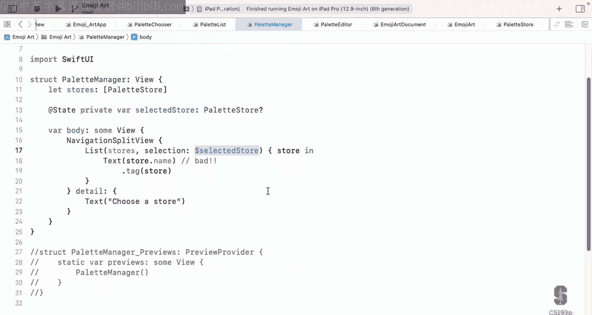

Now we can select， you see。

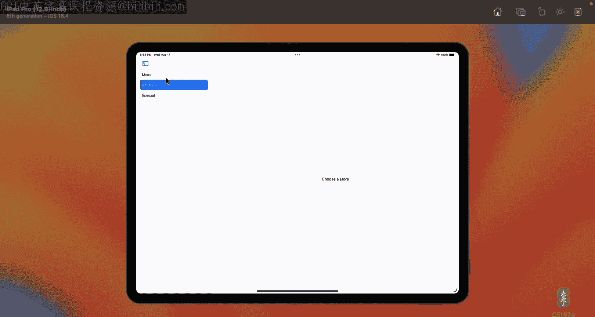

We know which one of these three things are selected and since we know which is selected。

 now we can draw the right palette editor in here， we can pick the right palette editor。

 so I'm going to say if I can let a selected store， in other words， something is selected here。

 then let's go ahead and put one of our editable palette lists。

Where the store is that selected store now unfortunately， when we made editable palette list here。

 we injected the store into it。 remember this pallet list editable pallet list。

 oh it's injection mode， so this has to go back to be not。

Injection mode and that's going to cause us to have to go back to the ballot chooser over here and pass the store to it。

 which is fine it will just pass that the one was injected into us so sometimes that injection not really what you want you might have to go back and do it makes sense here。

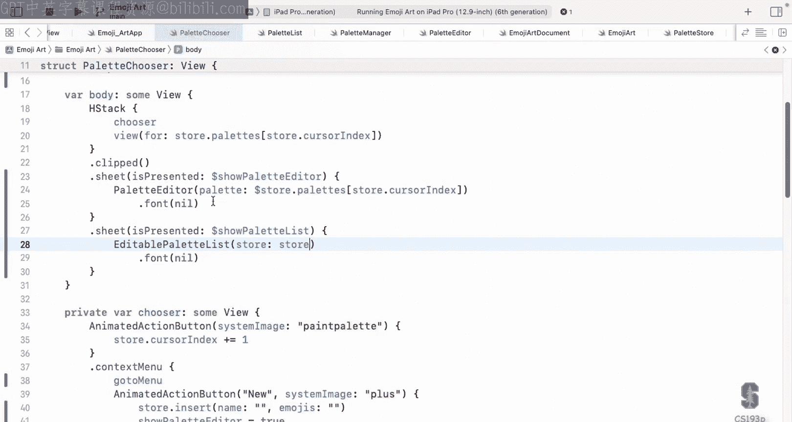

R。Maine there's our editable palette list with the things in that store， go here。

 we can still do all the things that we could do before here and if I delete something let's say let's get rid of blue and go over to alternatenate and go back to Maine。

 no blue。So it's keeping track of them separately。What about the third pain。

 because it would be really nice if when I clicked here instead of replacing this whole pan。

 it added a third pane。So that I had three things， the store， the palette and the editing。

 how do I do a third pane， go back here to our palette manager and add another little intermediate thing here。

 content， but I actually want this one right here to be the content that's the middle pane。

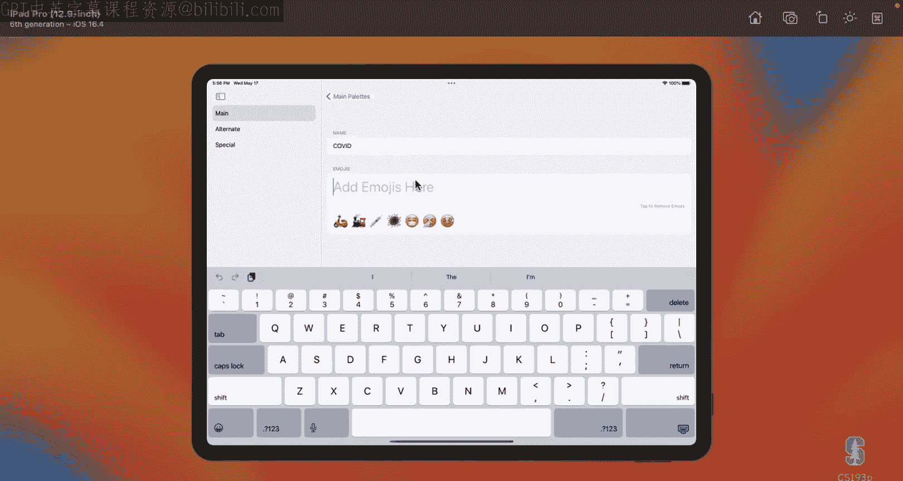

And the detail， which I guess by default default， will have it be choose a palette。

This detail I'm not going to do that and with selection。

 I'm going to do that with navigation links and navigation destination， in fact。

 the navigation destinations I already put in will just work except for one thing。

 watch what happens if I do this。

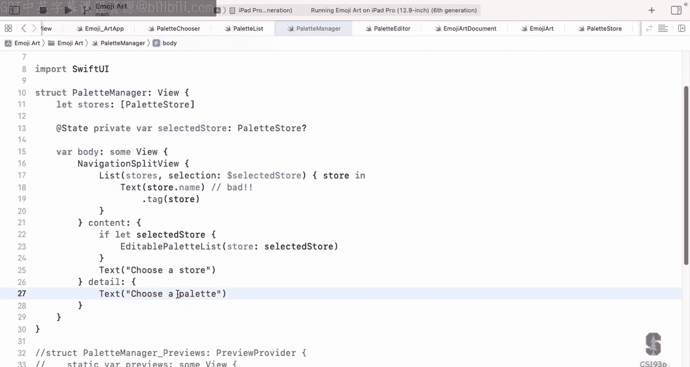

Goat here。Got three panes you see that the stores， the pals thing okay I'll pick this one and I'll pick this Oh no。

 why is it navigating like this inside here instead of just using this beautiful third thing it has the reason for that is that in editable palette list right here。

 we have a navigation stack。

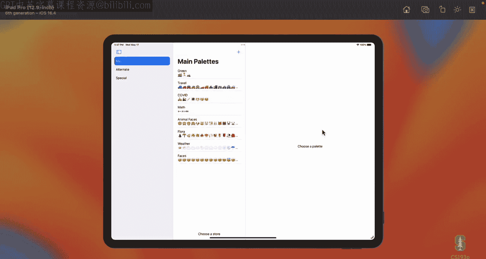

Since we have a navigation stack there， the navigation link and the navigation destination in there are always going to use that stack。

So we can reuse this entire view， but we can't wrap it in a stack if we want it to use the split view。

Do you see the problem？This is a good thing because sometimes when you're building that three pan thing you do want one of the panes to go in its own little stack and sometimes you don't but in this case we don't。

 so I'm going to remove the navigation stack here at this level just take it completely out of here。

 which by the way。If I remove this navigation stack here back in my palette chooser。

 I'm going to have to put it back here。Otherwise， this one's not going to work because none of itss navigation works if it's not in a navigation stack。

 but I did this because I wanted to show you that the navigation stack can be at a very high level。

 it doesn't have to be where the navigation links are so it can be at this top level and this frees up our navigation split view so that the navigation will work inside it so we go here。

 domain， you click here， and now it can use this third pane instead of doing navigation stack on top of itself。

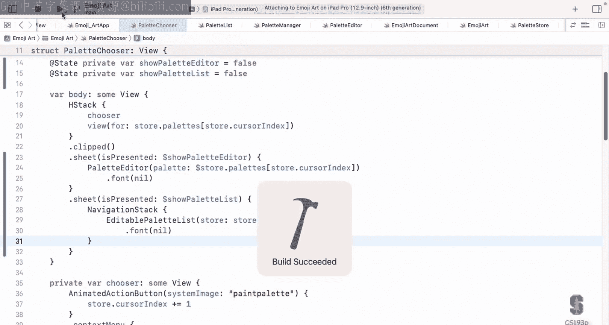

The last thing I'm want to show you is this problem， watch this COVID。

 you see the selected COVID in the middle range， I'm going to press spacebar， it deselected COVID。

Why did it dese and if I hit backspace？It reseed it。

The reason for that is that the navigation links in here are linked to the pallet。

 not the pallet's ID， but the palette， so when I say COVID space， it's a different palette。

It got changed to a different palette of whose name is COVID space， instead of COVID。

So how can I keep that selection in the middle one well all I need to do is have my navigation link be looking at the ID instead of looking at the pallet it's really easy to go back here to our editable palette list right here and right now the value that we look for in our link is this palette well I'm just going to have it linked to the ID of the pallet then down here instead of doing a destination for the palette I'm doing a pallets ID this becomes a palette ID and here instead of looking at a pallet ID I'm going to say palette ID。

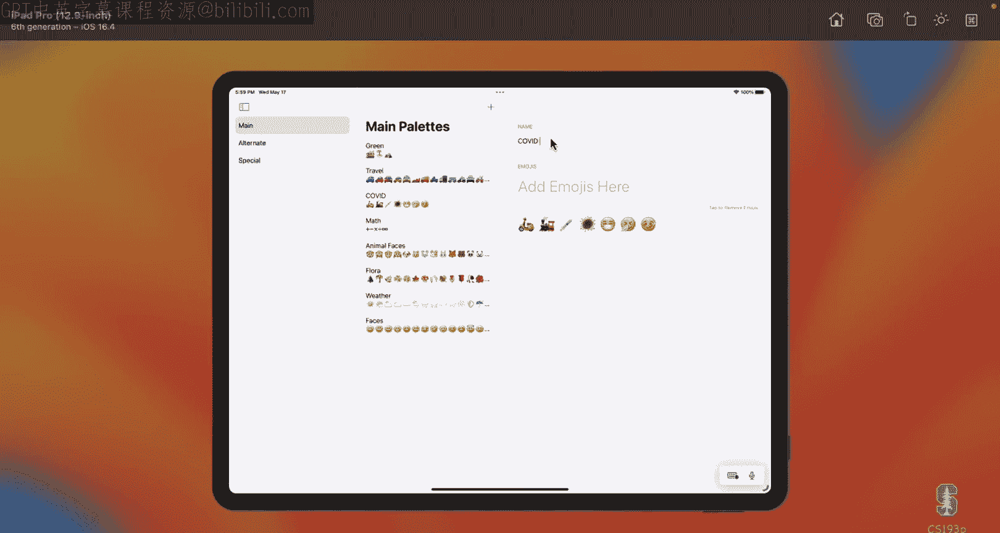

So this value that you link each of the things in your list too doesn't always have to be the thing you're actually showing。

 it could be the ID of that thing。And the great thing about an ID is of course， it doesn't change。

 even if you change the name or the emojis of something， it's the same， so here we go。

 mainine travel in this case， we go up here， space， you see。

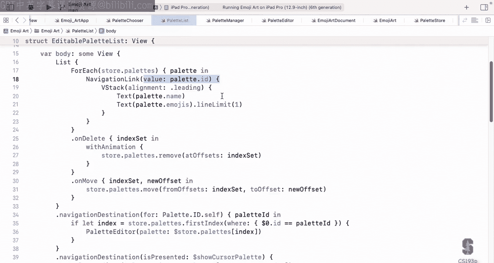

I'm typing， it's changing it， but it's still selected because it's selecting it by ID navigation link is the ID。

And that is all we have time for today。 So I will see you all next Monday。

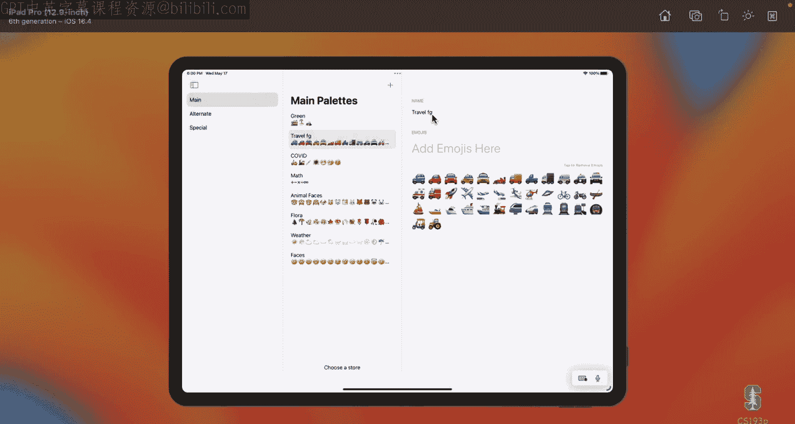