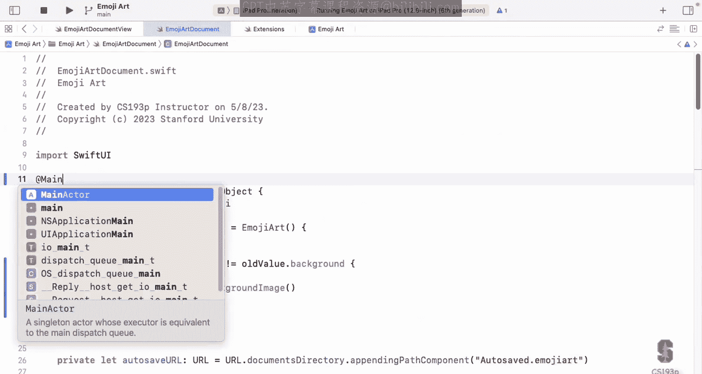
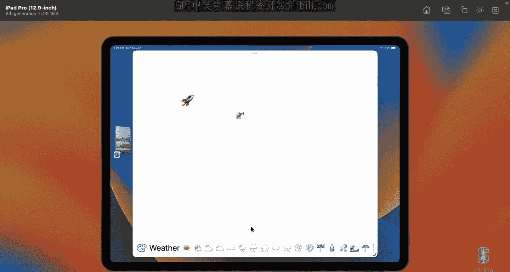
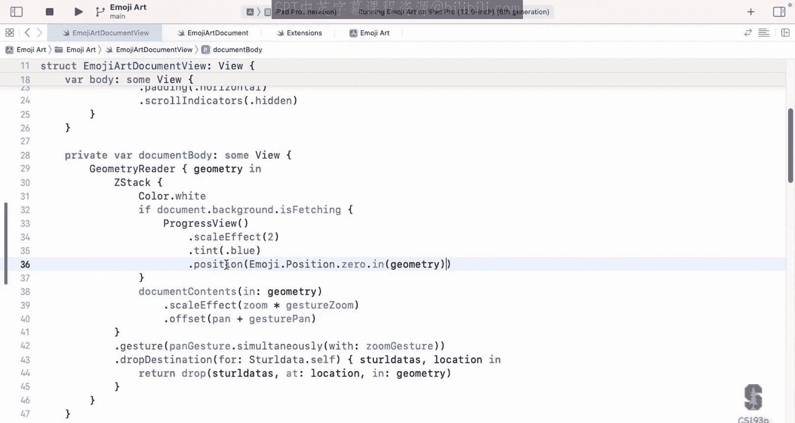
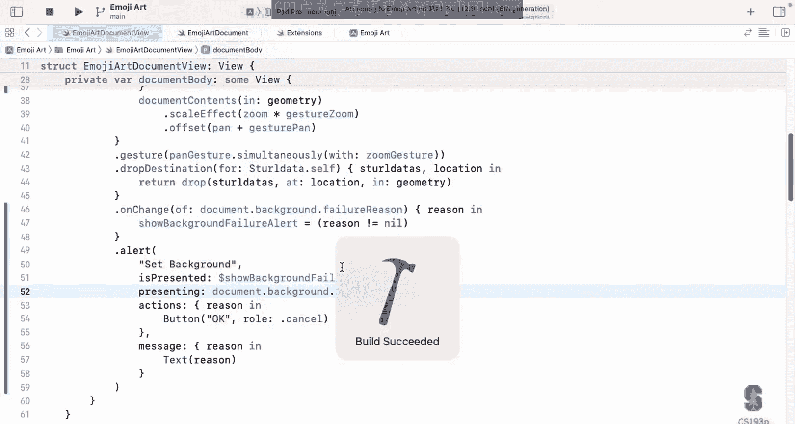
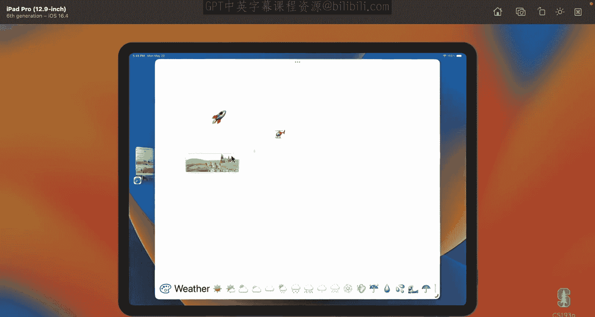
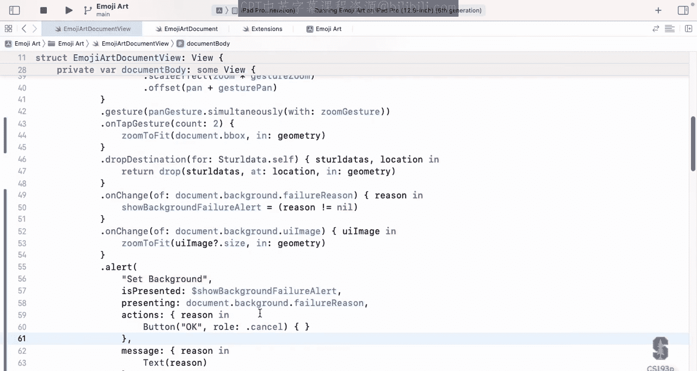

# 斯坦福大学《SwiftUI的iOS应用开发｜CS193p Developing Applications for iOS using SwiftUI 2023》 p14 -14-Lecture 14 _ Stanford CS193p 2023.zh_en -BV1HyzNYdEiD_p14-

Lecture 14， today I'm going to take just a couple of seconds with the star here to talk about colors and images。

It's a minor little topic just bookkeeping thing and then we're going to talk about the main thing for today which is multithed programming and we're going to revisit a little bit about error handling and we' already learned a little bit about that but now we're going to learn some more and this multithreaded programming thing is just all about making sure our apps are responsive not getting blocked and。

Stock and having these hangs for a second， that's a terrible experience for our users。

 so we got to learn how to do this to prevent that。

All right color now you guys already know about the colorstruct。

 it's pretty coolstruct because it implements a lot of different protocols but it can be used to specify a color like foreground color color do green。

 that means make that color green， but it also as we saw can be a shape style so I can say fill of a color and it fills it just like a gradient or other shape styles and it can even act like a view I'm not sure if I did this ever。

 but you can just say color dot white actually did we do that maybe an emoji。

 but you can just say color do white， and that means a rectangle filled with white because color also implements the view protocol。

But when it comes to actually representing a color。

 that's a bit of a tricky thing in general in the world， not just in Swift。

 because when you say that you have a color and it's a certain shade of pink， well。

 if you're an ad agency and you're trying to get an emotional reaction out of people with that exact shade of pink。

 well you want it when it hits the video to be exactly that shade of pink so there are a lot of mechanisms for specifying colors very。

 very specifically and accurately， and the color struck is really that's not the business at at the end。

There's another little thing called UI color and that's what we use to actually represent colors and it knows how to create colors in different color spaces like RGB red green blue and also HSB H saturation and brightness in others and it's how you would kind of store a color or represent a color is UI color so you see UI color that's all it is it's just a representation of a color and you can easily create a color struck up above from a UI color by just saying color UI color as the argument and create it there I just want to make sure you understood because you're going to see both in code that you write I mean examples I' like well。

 it's the difference of color in UI color that's the difference there's also another one called CG color of course we know Cg is short for core graphics Cg rack CG size CG point all that stuff we've been seeing when we draw so there's also CG color which is the base level representation of a color in the choreographic system。

mightight see that you can maybe get a CG color from a color struck to a CG color although it returns an optional so you could possibly get back Neil in certain circumstances anyway you're only going to seeG color one out of a thousand times you go see a color so don't worry too much about that one。

Now， images have a similar kind of。Duality of existence here we know all about the image struck we use it to put images on screen we've been doing especially with that system name thing but you can also put images JpeG images or whatever in your assets that showed you on the very first day of class there's this little X assets thing you can drag them in there and give them names and you can get them out of there with image of that name and it goes and looks the name up inside your Xe assets and that assets over there lets you specify things like this resolution of this thing and all kinds of stuff so you can control the images pretty well doing that you also know about the system name and things like the image scale which is like relatively scaling the system images relative to the font and we know that if we apply the dot font modifier to an image it's going to scale the system image to match the font and system images have another little use we see it a lot which is using them as masks it like the little tabs at the bottom。

A tab view that looks kind of like an inverted image or whatever that it gets colorized by being used as a mask and a color gets kind of filtered through that for example。

 so you'll see system images used as masks。Now， image is not though the way you would represent an actual image。

 if you wanted to have an image in your hand， you would use UI image。UI image is the thing。

 for example， they can take a bunch of JpeEG data and turn it into an image so if you had a bunch of JpeEG data in a file or we dragged and dropped it into emojiard or whatever and we want to put an image on screen of it we would have to turn it into a UI image first and that's what Async image does because you pass Async image that view a URL it goes and turns it into UI image and then uses it now we're going to do our own async image today and you're going to see that when we go out to the internet to get our background image we're going to turn it into a UI image first that's how we'll hold on to it and then when we want to display it。

 we'll pass it to an image。That's a minor little thing。

Multior programming not a minor little thing why do we bring this up Well we do not want to block R UI to say that that's important it's a dramatic understatement all of you I'm sure you've used an app where you touched on something or you tried to swipe and it's like it stuck and then a second or two later it freeze up in a move nothing more annoying for users of that they will just stop using apps that do that so we got to figure out some way to never have that happen even though sometimes we do things that take a long time。

What kind of things cause this problem Well， anything that is going to access the network。

 it's definitely going to be something we're gonna have to do multithreader programming for Every time we go out to network to get a background image or something it could take 10 seconds it could take a minute and we can't have your app blocked for a minute so that's clear but even some very CPU intensive things you might do maybe you're doing some machine learning thing right and you're feeding it a lot of data and training it or something or you're sending it something and having it crunch on it to see what it thinks it is though that could take a long time that you can't do blocking the UI either so we need threads to deal with these things that is our solution threads of execution now raise your hand if you've seen or kind of been exposed to any kind of system that does threads。

Not quite almost all of you， but not quite so hopefully this will still make sense to you if you haven't seen it and if you have seen it probably possibly you've only barely seen it。

 hopefully this will make some sense and you're going to get some really good news on the end of this next slide so let's talk about threads and Swt and iOS in general。

Most modern operating systems have threads， okay， most devices， modern devices are multi core。

 so even if they're not multi processorcessor， they've got multiple cores in there that could be running multiple things literally at the same time。

 okay two different threads of execution now。From our perspective as programmers when we're programming with threads what it looks like is different pieces of code in our app are running at the same time that's what it seems like and that may not actually to be true because you can have multithreading on a system that's single core。

 single processor and what's happening there is that the OS is quickly swapping between them giving confused cycles so this little cycles this one they seem to be running at the same time so it's not exactly that but from our perspective it just looks like two pieces of code or 10 pieces of code all running simultaneously now in Swift all these threads are managed behind the scenes who you do not have to create threads or any of that。

But the system does need a little help from us a little bit of hints of when it can go put something on another thread right when something takes a long time and maybe should run another thread because it's a network call or whatever so we're going to talk about the API the keywords in the Sw language that we use to help it understand。

Whenen to use threads， but it's going to do all the thread management for us。

 which is one of the really cool things about Swift。

So here's the first thing this was going to make the most sense to you。

 which is what if you have something that's going to take a long time and you just don't want to be done on the main thread where the UI is running。

 you can just create one of these objects called a task。

 it has an argument priority which is how important is this task should I give it a lot of cycles right or should it not be that important and by the way theI as a kind of task is very important。

 in fact it's almost impossible to create a task with this that's more important than the UI。😡。

And all you do is create this asking you give it a closure and whatever codes in that closure is going to be run on some other thread now you don't know which thread anything about all you know is the priority you've given it。

 but it's up to the system to go manage all the threads All youve said is here's a closure。

 please go run that。Now notice you get a little return thing there。

 this little task when I say this line of code it returns immediately。

 the system grabs that closure and it kind of puts it in its little cu of things to do to go run it on another thread but this returns instantly and the thing it returns that green thing is just a little blob that lets you cancel the task if you're like I don't really want it anymore。

 you can yield to that task， if you have other task going on that might depend on it。

 you can sleep if this closure returns a value you could。Basically block and wait for that to return。

 which kind of defeats the purpose of workingking off on another strip， but you could do it。

The incredible thing about this is we almost never do this。 Let task equal。 We just say task do it。

 We fork off a task and we just let it run。 It's rare that we want to cancel a task we might and by the way。

 even canceling doesn't kill the task it really just kind of sets a flag that the task the little closure can look at and say oh I've been canceled。

 I better stop doing this and just return that's really all cancellation is so we don't really do let task equal very often we usually just say task curly brace of boom and it's instant you say that returns immediately put that closure on a queue to go run on other threads So this is simple multis writing Everyone understand this piece of it right here。

Notice that when you do this， put a closure and tasks like there。

 you're basically telling the system， hey， I'm going to do something might take a long time。

 maybe it's going to access the network and can get block or maybe it's a machine learning thing like I said。

 and so the system knows that it's going to go off and use threads and make this be in parallel this is the simplest basic multitasking。

Multi writing thing going on here。Now this is not quite enough， this would sound like oh。

 this is fine， but there's a humongous problem multithed programming any of you who have actually done it know what the problem is the problem is access to data structures you got multiple pieces of code all running the same time if they're all banging on the same data structure that data structure gets absolutely mangled you have an array and you're adding things to array you're moving from the array and maybe even doing that is not atomic so it's like you get halfway through adding something and someone else comes in' remove something from the array it's a mess so how do we manage the shared access to data structures Well this is all again kind of manage for us by swift and Sw syntax but we have to help it out we have to give it an idea how we do that and we do that with a type I didn't even mention when I talked about the swift type system remember I talk about classes andstructs and enums and functions these are all types in the swift type system well I sneakily didn't mention this one and actorctor。

It's declared just like a class or astruct， you say actor name of the thing。

 implements certain protocols kind of almost exactly the same。

 but the two big things to note about an actor type is that it's a reference type like a class in other words it lives in the heap and you have a pointer to it so a lot of people can be pointing to the same actor and sharing it。

And the thing that an actor does thatstructs and class don't do is that it synchronizes all access to its vs and functionsks。

 so the actor is the fundamental unit of synchronization when we're trying to not smash all our data structures with these multi threaded pieces of code。

Now， if you're not writing any multi threaded code yourself。

 you're not doing this machine learning thing in the background， blah， blah， whatever。

 you're never going to have to create your own actor。

If all you're using multi threadread for is to keep your UI going fast and do other stuff off the UI。

 then there's the main actor， which we're going to talk about。

 the main actor is an actor that the system creates where all the UI stuff happens and you just want to make sure that you're doing the right stuff on the main actor and the rest of the slow stuff off the main actor。

 right？So we're going to talk all about the main actor in a couple slides here。

So let's talk about how actors work how do they do this synchronization couple of rules here。

 The first rule and this one makes for sense only one of the actor's functions or vs can be running at any one time now there might be 100 threads assigned to run code for this actor but only one of them can be running at the same time so you never have a situation where two functions in the actor are running in two different threads at the same time。

 that is the fundamental unit of synchronization you can see that solves the problem right you might say well wait a second I don't even have asynchronous programming anymore。

 but you're gonna to see that we do because the second thing here is that a function in an actor either runs to completion or it can get suspended。

And if it gets suspended， now other actor functions and bars can run and they'll run for a while and then eventually you are going to tell the system。

 okay I'm ready to unsuspend and it'll put you on the list to get back to you and have you running again you're only gonna to be continued after whatever other functions in the actor have run to completion or suspended but you're going go back and it's the suspension points that allow us to have an actor only running one thing at time and still swapping between the various functions because they're getting suspended and now it can go run another one and that one gets suspended and now I can go over run this other one so it's switching back and forth。

 but the fact that we're going back and forth and either running to completion or suspension means we never have to worry about smashing each other's data structures when we get suspended when we come back。

 we better be careful because other actor things might have run but we never have to like as we're running through our oh no something changed out from unders because we get to run to completion or suspension。

Now I put suspended in purple because it's very important part of making this all work so the first thing is we have to let the system know when a function can suspend okay when it's possible for this function to be suspended and we do that by marking it a syncnc just like we put throws on a function that can throw we put aync on a function that is。

Could be possibly suspended。 and that's why we call these suspenable functions here， async functions。

Functions that do things like access the network are almost always async and I'm going to show you one in the demo thats not there was not async and why we would never use it to access the network even though it's capable of it。

 and I'll show you another version that is async and the reason you want to have your network access functions marked async is because when they go send off their HTTB request。

 they're going to suspend themselves。And they're going to wait until that request comes back and then they're going to say。

 okay， right you keep going and then their actor will get back to them and let them run。

When there's time， because they might be running some other function at the time that you say you're done。

Now Async is an advertisement that a suspension could happen， but it's not saying it will happen。

 so I could have a function marked async and it runs to completion it never suspends ever。

 it just doesn't even have it why would I ever have an Async function that does that well maybe it takes a long time to run and so essentially what I'm saying through the rest of the world is yeah I might suspend so you better watch out but really I'm just going to take a very long time。

All right， so that's part one is marking our functions async here。

So the other rule here is that when you call an async function you have to use the keyword a weight again like when you call a function that throws you have to say try well。

 when you call a function that's marked async you have to say a weight which a weight is a great word it means you are awaiting that thing that could take a long time because it can suspend itself or it might just take a very long time but you see what I'm saying you are awaiting for it so I'm awaiting that and that's why you have to mark it with a weight now of course marking it with a weight here is not for Sw Swt knows you're calling an async function。

 it's for you in your code to note oh yeah I'm gonna possibly suspend here and that's what a weight means really weight means I could be suspended here and the only way you can be suspended is by calling a function to say synchronous that is there's no other way to say oh yeah suspend here please you have to call a function that's asynchronous and be awaiting on it that's when you。

Your actor knows oh you're suspended， I can go run some of my other ones and then when that function you're waiting on finishes。

 that's when you say， okay， I'm done， I'm ready to go again and then the actor when it has time it's going to come back to you and let you continue that's how this whole system works。

That's all there is， asynct function and awaiting， and thus you can be suspended at those points。

And they really did a good job of making it simple here。

 so there's not a lot of other keywords for saying you want to suspend yourself this is it。

 this is all there is。The reason you want to have this await keyword to remind yourself is because when you could get suspended。

 your actor might go off and change itself because the actor is then allowed to go run other functions on itself while you're suspended so when you have a function weight you need to look at the code in the rest of your function after the await and make sure there's not some assumptions you're making about your actor's data structures that might have been changed because other code in your actor run so you maybe have to check to make sure that array is in the state you thought now the good news is you come back from the weight。

 you check the array to make sure it's what you want and now you get to run the completion because once you get resumed。

 you get to run the completion unless you have another suspension sometimes you'll go through your app and just search for a weight and go to every single one and say am I sure that when I come back from this world is going to be what I think and you're gonna to see in the demo today there's actually a reason for us to do this I made the demo exactly this way so you would say oh。

 I see why I have to pay attention to my await when I could be suspended。That's it。

 asyynnc and weight， that's all there is in there。Now。

 if you have a function and you want to do something that takes a long time access the network or whatever。

 but you don't want to suspend， you do not want to be suspended。

 maybe you're the UI main actor and you want to keep on going。

 but you still't want this thing to happen， there's a way to do it， which is to put it in a task。😡。

If you put it in the task， that thing I said the start。

 then it can go off and run and even if the first thing you do in that task is await something。

 you're not blocking your function， you're blocking that closure that you pass a task that's a different thing it's a closure you pass it it's blocking not you so you get to keep running to completion in your actor so that's the way you can do this without suspending this is one of the primary things we use task force is a fork off some longrunning thing and we get to keep going。

What about closures I said that if you call something that's async。

 you have to say a weight and then when you say weight you have become async right because you can suspend now so you have to mark yourself as async but how do you mark a closure async okay you can't a closure you pass an argument and so this is a restriction on closures。

 closures can only have suspending things they can only be async when they are past to a function that marks its closure argument as async。

In other words， functions that take closures that are able to suspend themselves have to say that they know how to do that that they're willing to have that thing be suspended and you can see why this is too what if you're passing it to some UI thing you don't want the UI to get blocked because you pass some closure that has a suspension in it okay so the UI would have to know that's happening and in fact there are some viewmodifiers that take asynclosure。

 here's a couple of good examples， one is called task this is a fantastic viewmodifier what this does is it takes a closure naynclosure。

 so that closure can have suspensions in it in other words it's awaiting things like going out on the network doing whatever terrible slow things and it starts that task off in a task thing it says task closure it sends the thing over there and what's cool about this is that that task only lives as long as the view lives as soon as the view goes away it cancels that task for you。

So that's really great if you have a view， it shows an image， it needs to go load that image。

 the view appears。😡，It has a task view modifier， the closure goes on the network。

 loads this slow image。 It finally arrives。 it puts it up and puts it in the view。

 But if the view comes on screen and it does that and then the view goes away because the user swipes or something like that then its cancel that task So it doesn't waste its time doing that thing anymore another one do refreshable pretty cool viewmodifier you've seen when you swipe or kind of pull down on a list。

 it puts a little spinning wheel at the top and reloads the data you do that so trivial you just say refreshable and then you give it a closure that reloads the data reloading the data might want to go out in the network or who knows what it's doing So you want that to be async So that's an async closure but you see how these。

Prototypes of these functions says async closure。In the argument。All right， the main actor。

 this is really where the rubber meets the road here because the most important data structure that we want to protect with multith writing is the UI。

 the UI is this massive data structure， all those views and all their v and huge data structure。

 We got to protect that against multith writing So very simple it's just all the stuff in the UI happens on one actor it's called the main actor and this thing is the actor that all UI activity has to happen I mean all of it there's no exception to it and if you try to do some code that affects the UI in any way off the main actor you will get in your Xcode purple runtime errors you know this code got execute off the main actor and if you see that purple your app is not going work It might seem like it's working like maybe it works while you're debugging。

 but you ship it to customers and they're gonna start reporting weird bugs likeow somethings strange to happen on my screen never ever have those。

Errors。Now all of your view functions right， the functions inside your views。

 those are all automatically done the main actor， so no worries he's there。

 but you got to be careful if you were to do task closure and in there you did it now you're off for the main actor so be careful there。

Your view model， unfortunately， is not run on the main actor。

So if you have code in your view model that does something that causes the UI to change。

 that's going to cause a problem。Luckily， you can just put@ign main actor right at the top right before you say class。

 whatever my view model class is， and it will now make all the code in your viewmod run on the main actor。

Or if you don't need to do that much granularity， you can mark individual functions in your view model with outside main actor。

We'll see this in the demo because we're going to have a function in our view model that it needs to。

Be sure that it runs on the main actor。Now air handling。

 why do I talk about error handling like right as I'm talking about Async Well Async and air handling go together really。

 really well and why is this Well if I'm sitting waiting awaiting an Async function to do what it does and it has some problem like a network error or something like that Well it's going to throw that error and then immediately we're eligible to be unsuspended。

So it's a great way for async functions to say， I can't do what this person wanted。

 I give up and then instantly have those people awaiting。

 be right to start going as soon as their actor got time for them to continue。

And plus all the other good things about your handling just makes our code look nice so we don't have to be returning error codes and all that stuff。

 we throw them， and then we can handle them and catch them at whatever level we want to do。

One thing that you've already noticed， I'm sure about air handling is syntactically。

 it feels a lot like multithread or asynchronous programming right。

 okay you got functions that can suspend or marked async functions that can throw or marked throws。

 you have to call async functions with a weight you have to call throwing functions with try。

Similar kind of thing and when you're using them together so much they really fit nicely side by side。

 you have a lot of code that says try await this that's a very common thing to say try await this and you have a lot of functions that are marked async throws。

Becauseuse they do both。All right， let's look at how you throw an error so far。

 the only time we ever had a function that throws was something that was calling something that might throw and it was just rethrowing it。

 remember back when we were doing our emojiR persistence Well what if I actually wanted to throw my own error that I made up Here is a function called the1 lecture and if I slept in then I'm going to throw this error CS193p error missed lecture throw it out of there Now if I do that look at the next line of code ask questions。

 you don't get to ask any questions you missed lecture So when you throw that missed lecture it bas out of there and does not continue with this function So that's great feature of it。

Now this CS193P error that mis lecture it can be an enum or struck usually their enums and it just has to implement the error protocol that's the only requirement on it that just means this one bar here localized description you don't actually have to provide a localized description but you have to mark yourself as a colon error like this you can have as many cases as you want in the demo I'm only going to have one case so it's not much of an enNum but you'll get the idea of how it works here and that's it that's how you throw your own error。

Now what about catching these special errors and how do you look at error so far when we caught it an error if you look at the do catch right here。

 we've only had this bottom green version where we just said catch or catch let error right and that catches all the errors that weren't caught up till now but do catch can actually have multiple catches you see how I have multiple catches here so in the blue one I'm catching specifically the CS193p error late homework and I'm getting its associated value right it's an enum it's got associated value days late I'm getting it I'm handling that specifically in here and in the purple one I'm catching all other CS193p errors so I'm saying catch and then I'm letting the error be assigned to a little variable here CS193p error that's just a local variable where that variable is a CS193P error。

Is is a new keyword and Sw that you haven't seen before that checks to see if a variable is of a certain type。

So I'm just checking to see if this CS193P error that I just caught here。

 I when I checked to make sure that it is an error and if so I'm going to handle it。

 otherwise just keep on going to the next catch。And then the green one will catch all non CS1 and H errors because the purple one is going to catch。

All the ones are CS193 PRs。Now you see down here the print keep going。

 I put this down here to remind you that after you catch the error， it's going to continue down here。

 so it's kind of the opposite of the thrower right when the thrower throws the rest of his function doesn't get executed when the catcher catches the rest of their function does get implemented。

All right， background， image fetching。So let's talk about how I'm going to do this conceptually。

I'm going to use a state machine how many people have actually written code they use a state machine？

Not too many interesting。 Okay， so the idea of state machine programming is I'm going to think about all the states that I can be in as I go and do some process。

 and I'm going to。Actually， code them， make notations in my code somehow for each of those steps and a great。

Data type for save machines is an enum because by definition you're moving through the states。

 they're distinct states and so enums are distinct states。So here is what my state machine is。

 I'm going to go， let's put this and put it right here。But all of this code actually in its own。明系。

Background。Image。Handling。I an enum， I'm going to call it my background。

And what are the states of fetching something Well。

 you could be like in the none state you're doing nothing。

 no background thing has been dragged and dropped in you're just nowhere。

 maybe I'm out there fetching it so I might have the case fetching while I'm fetching I probably want to know the URL that I'm fetching so I' could little associated data there for my URL then I fetch that URL and either it comes back and I've got the image or it failed a network failure or something so I really have two cases in my state machine there I could found the image in which case I'll just hold on to the UI image I found or I could failed think failed in which case I could keep the error the error that I got I'm just gonna keep a string just to make a simple a string that described probably the localized description of the error that I got So this is my state machines。

States， and I'm just going to kind of go through this state machine step by step and do all the steps that are involved now。

 since I have this nice little。State machine Eum， I also created some little convenience functions here。

 I called them my background convenience functions， so let's take a look at these。

These are little vs that all they do is they return the associated data of a certain state in my background。

 if I'm in that state， so you see UI image， it's switching on myself and if I'm in the found state。

 it's returning the image， otherwise it just returns nil。

You got there and now I'm doing the same thing with the URL being fetched。

 I'm switching on myself and I'm I'm fetching on return my URL and I'm doing down here with the failure reason。

 same thing if I am in the failed state， give me my failure reason。

And these are just convenience so I can just say what's my background UI image right now and it'll just be nil if I don't have if I'm not in the state where I found one。

 I'm in any other state， none or fetching or whatever it'll just be nil and then I put a nice little bull in here am I fetching is fetching and that's just if my URL being fetched is not nil。

 then I'm clearly fetching because when I'm in the fetching state the do fetching up here。

 I have a URL but that's the only time I have a URL。now that I have this nice little state thing。

 what I'm going to do is get rid of this as my background I comment it out so as you remember it was there and instead I'm going to create a little at sign published。

Var， I'm going to call my background and now it's going to be a type background。

 and I'll start it out in the nu state。And I'm making it published because this is how myUI is going to see the background。

 and it's going to be able to see what state I'm in at all times because， look。

 I'm giving it that enum and it could even use the convenience functions， for example。

So as long as I properly progress through these states as the URL is changing in my emoji art。

 then my UI should be able to see all kinds of stuff， am I in the middle of fetching。

 that's the is fetching thing， do I have an image to show do I get an error。

 it can even put up an alert with an error because it can see where we are？All right， let's in fact。

 go do that just to see what I mean by that Here we are in my view。

 here's async image remember we had this phase stuff here and the phase stuff is kind of like doing this。

 this phase is an enum， it's kind of going through the phases。

 it doesn't really let you look at it whenever you want so we're going to get rid of our async image entirely and replace it with our thing how would our thing work I'm just going say if I can let UI image equal my documents backgrounds UI image which that's only going to be non- nil when I'm in the found and image state of my state machine my state machine only if Ive found an image is my UI image going to be non- nil so I have an image to display fine I'll display it image UI image of that UI image。

And I want it positioned the exact same。As the async image was。That's it。

 look how simple my UI code is， no errors。Why is this so easy here well。

 because I picked a good abstraction for my searching for this image and my UI is just going to watch it？

And since it's published， this background is published， as soon as UI image appears。

 it's going to show it。All right， now we have to go into our view model here and make this state machine go to make a step through these states。

 but where does it start？It starts， somebody sets a URL of our background image。

 as soon as someone sets our background image， we got to circle in fetching it。

So where can we find out that that's happened there's a really cool place to do it right here。

This is our emoji art， our model， and we're already doing something when it changes。

 which is we're auto savingaving it now we're just going to do another thing when it changes if we're going to see if the background has changed and if it is we're going to start fetching。

Very simple， I'm just going to say if my emoji art background does not equal the old values background。

 in other words， this is happening when emoji art changes I'm now saying。

 and I specifically am interested in when the background changes。What am I going to do here。

 let's just have a function， fetch background image， and this is going to run our state machine。

That's what batch background image is going to do。Let's go down here inside our nice little background image area at the top and have our private bunk。

Thattch， background image。And you guys know how I like to program。

 I like to just type it in like it would just work and then go fix all the problems because when I just type it in。

 then I get an idea at least what I'm looking for I might be all wrong and it might just won't work that way。

 but at least I can just。Typeping in how I want， so here's what I want。If their URL。Exists。

 so if the emoji art has a background， then I want to start out my state machine by saying that I'm fetching that URL。

 the emoji arts。Background。All right， which is that what that URL is。

And then I want to move on to the next level， which is I found it， hopefully。

 and how am I going to set the UI image that I found？I'm going to need to function for that。

 so I'll just call it FeUI image from URL。Or it might have failed。

 in which case I want to go background dot failed with some error message or some sort。

 the proper error message， and if URL is nil， then my background thing is back to none。

Do you see how this moves me through my state machine。 I obviously have problem here。

 I don't have any such thing fetch UI image like to do that。

 and maybe we'll have some other changes as we go。 But let's go and do that thing。

 Private funk fetch UI image from some URL。And it's going to return a UI image。

What does this function look like？Well， I need to get the data out of that URL。

 Hopefully it's like a JpeG or PG or tip file or something。

 Get that data out and create a UI image from it。 Remember I told you that UI image is the thing we do to kind of hold on to an image in our hand。

 Let's do that。 We actually know how to get the data from URL。 We did it before。

 which is data equals data。Contents of URL。 remember that。Function that we had。

 and then maybe I could just say return a UI image。With that data。So this is an idea。

It's not a very good idea， but it's an idea。What's problem with this thing？It's not these errors。

 it's that this is not an async function， so it blocks but if I call this right here。

 it is going to block my application。So while I'm out there fetching， it's going to be sitting there。

 not responding to touches， no swipes， no， nothing， it's just stuck because it is blocked right here。

And data contents of URL， it works for HTE URLs， but it's not really intended to be used for that。

 it's for file URLs where you won't block， right a file URL it maps the file so you're going to get it really quick。

So that is not what we want to use luckily， of course there is something we can use to get this data which is a URL session the URL session is a struct that has all kinds of mechanism for downloading stuff from the URL and it's really sophisticated and powerful but it has a nice shared global shared one that we can use so that we can build one and it has some configuration stuff。

 but it has this shared one that has all the most common configurations and one of the functions that is in a URL session is data from URL。

Async call in a function that does not support concurrency So this is async。 it's marked async。

 It knows how to do the whole suspension game and all that。

 that's exactly what we want here and we're going to get to have we do that in a second Now have another problem here which is it says cannot cover value of type data comma URL response to type data Well。

 this URL session share doesn't actually return just the data it also in a tuple returns the URL response you got So when you make an HP request。

 you get some information back about what happened with that request not just the data that was in the file you asked for but some info。

Now we don't need any of that， so I'm actually going to underbar that to just get that out of my way because all I want is the actual data。

 not doing any。Kind of HtGP specific stuff there。Now another problem we got down here value of optional type UI image must be unwrapped interesting well we're gonna to puncht on that for the moment。

 I'm just going to force unwrap it to make that error go away but we are going to have to deal with that fact because this UI image data data returns nil whenever it couldn't see a JPEG file in there or not TIF or PNs not I can't get an image now UI image is really good at looking at raw data and figuring out is that a JPg tomorrow what is that in there but if you can't figure it out it returns nil。

This is what's called a fable initializer， hopefully rememberre reading that from your reading。

 but it's just a initializer that can return nil if it can't do what you're asking。

So we'll have to fix that in a second， but for now we'll just force and wrap it and crash our app if we try to drag and drop some random URL in。

All right， but before we do that， let's focus on this async business so what do we have to do when we call an async function like URL session that shared that data from URL we had to market a weight。

Every time you cannot call a function like this without saying a weight。

 which means I want to await the answer that comes back from doing this possibly long running thing。

Now it also says here。That。This call can throw but is not marked with try。

 so URL session share data could also throw network onavailable， for example。

 or no such URL out there。So we also want to make this to be。Try and so you can see this try await。

 I told you it's common and it is you're going to see this all the time this try await。

The other thing that's saying here is that this async call is in a function that does not support concurrency。

And that's because if we can suspend here on this line， which we can， because we said wait。

 if you say wait， you can suspend there， you have to mark yourself as a function that can suspend and you do that with async。

But now it's saying errors thrown from here are not handled and we're used to seeing this。

 we tried something， how do we handle it， we could do catch it。

 but what I'm going to do is rethrow it here， I'm going to rethrow it back up because I actually want my state machine to see that error and update into the failed state。

I'm going to say aync throws。Now。Since we're throwing already from this function。

 let's throw an error if that UI image comes back nil。that UI image that we're returning。

 let's go here and say。If I can let UI image equal that， then I will return it。Otherwise。

 I'm going to throw an error。And what error am'm going to throw I'm going make up anything I want I'll say a fetch error I'm going to make mine be an enum so fetch error do bad image data because that's what that was you made me go out in that URL and get that data and it wasn't an image I couldn't make a UI image out of it so I'll just make a little enum here called fetch error and it has to be an error protocol in the case bad image data。

NowI could have associated data here if I wanted， I don't need any。

 but I'm allowed to have associated data just like I had back in the CS193P error case right if you were late homework。

 it was how many days late I could have that here and I could obviously have more cases but I really only have this one error that I'm going to deal with here。

Look， no errors there in that fatuI image is perfectly fine to just say， else。

 throw this error if I get this error。But the problem here now is we have fetchui image。

 it's async throws， we're just bumping the problem up a level to here because now this is saying。

 wait， you're making an async call in a function that doesn't support concurrency。

 this one right here， fetchch background image。Well。

 I'm going to fix that one by also marking myself async。And just saying，A this。

If I could put a weight before any function call， perfectly reasonable。

 even a function call that I'm using to set the associated value of an N fine。

 it's just a function call。And now we got another one here call can throw but is not marked with try。

 which we know that Peui image look at that aync throws it can throw Now here I'm not going to rethrow I'm going to handle errors now because look I'm in my state machine the very next line is background equals dot failed w perfect time to catch that error and set my state machine state to be the failed state。

Really simple， I'm just going to around this call， do。Even this。Catch。

 but it do catch around that and inside the catch， I'm going to say。

This background failed instead of just saying error message about something like couldn't。

Set background。And let's go ahead and give them the errors's localized description so they can see what the error was and again。

 remember this is the same as lead error， so this variable here is this variable here。

 but this is the common case so swift let's you just leave that off。And of course。

 if I'm going to call a function that can throw， I have to mark it as try。All problem solved。

 we marked ourselves as async so we could await something， we can be suspended there。

 which makes sense that we could be suspended there we're way fetching an image and we are handling our errors。

We're almost done here and look how close this function ended up to being the state machine I just typed it in it was almost exactly right I just had to put the do catch in there that's really the only thing that was different and this is the power of this the way they've done this async program is it kind of just all flows how you would normally flow it and you just have to make sure you understand that you might be suspended now the fact that we can be suspended there is going to cause a problem。

Possibly and I'll get back to that， but so far looks good， no errors except oh up here。

 this is a problem because this is now an async function fetch background image， of course。

 because it can be suspend。What do we do here， Well， of course， we have to say， oh wait。

Because we're calling an anc function。And this is now going to say wait a second， I understand， wait。

 great， except you're still calling it in a context that's not concurrent because。

This is not in an async function。Yeahikes， what are we going do here。

 This is a did set of a property of rag。 Where do I put the async。

 We need to fork this off and let it be done somewhere else。 So this is a classic place where we say。

 I can't be async here。 so I'm going to fork this off。Task。

Closure and I'm never going to cancel it or whatever you could imagine some day down the road we might want to be able to cancel like we start fetching some it takes a really long time and we give up on it maybe we want to cancel but for now we'll just fork it off。

The closure that you give task is by definition an async function， so you can do a weight in there。

This should just work because we have no errors， everything。

 the state machine is fully specified through all four of its states。

 let's see what happens when we were on here。It worked。

Because I took out async image and put our thing in， it worked， it loaded it there it is right there。

 it seems like everything's working fine。 Let's go back and look what's happening over here。

Now if you look at this， you'd be like， oh yeah， everything's fine but look at the top at the very top purple triangle of death。

 Do you see the little purple triangle that says one。

Let's click on that oh publishing changes from background threads is not allowed and it's even showing us this line right here。

 I'm setting my background to found with the result of this that's causing my UI to redraw。

Do you see why， because I have this code over here in my UI that says， when this gets published。

 draw this image。So it worked， and I might think， oh， my program's fine。

 I'll ignore this purple thing it drew the background， but don't。

how do we fix this We can't have verbal errors I that's this main actor thing I was talking about just like you were saying over there。

 this stuff that I forked off on a different task gets' not running on the main actor and it's happening at the same time Now I can fix this in a couple of ways one way I could do it is I could make my entire view model always do all of its stuff on the main actor I do this and run and then all functions and vs in the view model running on the main actor really loves it。

No purple。 You'll notice the purple a lot if you have your navigator open， but if you don't。

 the only indication you get is that little triangle up there。 So keep an eye out for that。

So that's a fix， it's a little bit of a blunt force fix to make our entire view model do that really the only function down here that has this problem is this one right here。

This is the only one that actually does any code that has this problem right that's changing UI this one down here doesn't。

 you see this one down here， that image UI image。It does something that looks like it might be a UI thing。

 this UI image， but this does not actually change our UI， it just creates a UI image。

 it's not putting it in the UI or anything just creating it， it's all doing and returning it。

 so it doesn't need to be on the main actor。Now， how does this kind of work to just mark this main actor well essentially？

We've forked off that task up at the top， right， Fech background image。 It calls this。

And as soon as it wants to execute a line of code in this function。

 it switches over to the main actor's thread。Because it's not allowed to execute any lines of code inside here off the main actor now it might have to wait by the way because the main actor might be busy user swiping or tapping or doing something else and that's fine that's one of the great thing about this actor system is things want an actor and they can't get it they're suspended that to wait and it's fine just it's just kind of keeping a queuee and just always feeding the next one and of course we know tasks have priority so it kind of knows which one is most important to go next and it's doing all behind the scenes and it makes this really simple to get this stuff working。

Now this seems like we're expert multi threadrated programmers here， right。

 we got this right and everything is just good but there's actually quite a possible problem here and let me describe this scenario to you。

I go to my moji yard， I drag in an image from a very slow website and it's taken a long time。

 I'm like I forget it I'll just use a different image and I drag an image from a very fast website whoop bam it appears what's going to happen a few seconds later。

 the other one's going to come in and blast my background。

because both of them were forked off to go do it and while I was waiting for the long time taking one。

 the quick one came in and did it， but then when the long one came in here。

 when this finally return fetch youI image， I didn't check to see if the user had chosen something else so this is what I'm saying every time you call a weight。

 you want to say when this comes back is there anything that might have changed in my world。

And what might have changed here is the user drags some other URL in。

So I have to protect against that here。Let the image equal this same exact thing。

Then I'll say found image here。But I'm going to have to check before I set this image。

 I'm going to say if the URL that I went and fetched， that's this URL right here。

Equals the background。Then I'll set my state machine。To that。

I'm just double checking here to make sure that in the meantime。

 the user didn't choose a different background for their emoGR。

This is a great example of what I'm talking about every time you're having a wait。

Go look at the code after it and make sure okay yeah it's right because multithr of programming Swift has absolved us of a lot of the having to deal with things。

 but it's still not absolved us of the semantic problem of doing things multiple threads。

 we still have to think for our program what that means。Now that we have this great engine。

 this state machine， we can do some other cool features。For example， remember in the async image。

 I had the little spinning wheel show off。That didn't reliably actually do the right thing。

 but we can do exactly the right thing here because we know from our state machine。

When we're fetching， we always know when we're in this state of fetching， in fact。

 I even put a little is fetching down here。To denote that， so let's go back to our UI。And。Appear。

I'm going to say。If my documents background。Is fetching， then put a progress view here， please。

This is actually a little better than we had before。

 because before our async image was down here at the bottom in our document contents。

 and that made it got scaled。We don't want our progress view the spinning thing to get scale if we happen' to be zoomed way in。

 it are gigantic。Progress view， so this is really more accurate to be handling this outside of that。

If we did want to scale it， like if we have wanted it to be。

 let's say twice as big as it usually is and maybe we want to put some tint on it。

 some blue on there or something， we can do that The other thing about our progress view is we want it to be in the middle。

Right in the center， we know how to do that， that is just dot position， emoji dot position do0。

In our geometry。Let's see what this looks like。

Co back to this image， I think this is a pretty big image right here。

 hopefully we will get a little progress for you。

Tinted， scaled up twice the size of normal。That was cool， what else can we do。

 how about an error right now we have terrible error handling where we put the URL。

what we really want is an alert this is a great chance to learn how to do alerts too。

 so how do we put up an alert that says ah couldn't load that thing。We're going to do that by。

Having a little on change of here， let's do this on change of the documents， backgrounds。

 failure reason。 remember， that's the little thing I put on there。

 It's only non nil when we actually have a failure。

Then I need to put up an alert and putting up an alert is similar to putting up a sheet or a pop over。

 we need a bo to do it and I'm going to say show the background。Failure alert equals true。Of course。

 we need an outside state， private bar。This thing。Starts out being false。And then when that's true。

 how do we make the thing go up now we could put a sheet up and design something that looks just like an alert。

 but of course there's a built in thing for doing alerts， it's called dot alert。

You attach it just like a sheet or something， alert。

Let' the one that has all the arguments here and I will。Spread them out so we can see them clearly。

So here's an alert again kind of like sheet or popover。

 but it's obviously got some extra arguments here The first argument title key is the title that's going to show up on the top of the alert by the way the alert is going to look like all the alert you've ever seen on iPhone right little gray box center the screen okay cancel at the bottom that whole deal so the title here this alert when are we putting it up we're putting it up when someone' trying to set the background so I'm going to have the title B set background just the person knows Yeah I know you're setting a background I have an alert for you。

The second thing is presented just like the other ones， this is a binding to that bull。

 so dollar sign， show background failure alert。Presenting is a very interesting argument。

 This is semantically， what is it you're presenting here。And what are we presenting with this alert。

 we're presenting the failure。We're presenting that reason that things failed。

 so when we say what are we presenting here and notice it's a T question mark it's a don't care can be anything we want has to be an optional though。

How about document， dot background， that failure reason。

That is what we're presenting in this alert we are presenting to now that's not all the alert can say。

 but that is semantically fundamentally what we're presenting here。

Now the next thing actions is what buttons are on this alert okay， cancel whatever， we just want one。

 which is an OK button so I'm going to go here to actions what's really cool about actions is it gives us this。

 whatever present thing we're presenting back to us。

And what's nice about it is it's not an optional here。Here， document background of failure reason。

 that has to be an optional because if you're presenting nil， it won't put the alert up。

Or at least it's not supposed to， it seems to me like it actually does。

 a documentation says if this is nil won't put the alert up but。I've tried it， it does。But anyway。

 this is an optional， has to be an optional， this will be the same thing but not optional because presumably you're actually showing it so you wouldn't be up there。

And inside here， I'm just gonna say it make a button。 I only need an okay button。

 And I actuallym gonna make this thing be a cancel button。 I'll show you why in a second。

 And the button， when I click， okay， it does nothing。 There's no action need to be taken。

 it's just going to put the alert away。 Well， no matter what buttons you put here。

 When you click one of them， it dismisses the alert。 So you don't have to。

Explicitly set show background failure， alert to false or something， alert does that for you。

Why did I put roll cancel there， remember， I don't know if you。We didn't really dwell on this。

 but there was roll destructive。 remember on that other one， it came in red。

 well another role is cancel， I recommend if you just have one button。

In your alert that it's basically a cancel button， it's basically make this go away。

And a cancel button looks slightly different， it's a little like a little bolder text。

 and I just think it's kind of good。Strategy to do it now I could list multiple buttons here I could have okay and cancel so I could have this one be canceled and not have the role cancel on this one and have two buttons。

 but I don't need an okay to cancel because I'm not asking them do anything I'm just telling them something happened。

And of course， if I had okay in cancel， maybe in the closure for the OK button。

 I'm doing something and in the cancel one that I'm not doing anything。

full flexibility to do what you want to do there。And then the last thing message。

 that's the view that's going to be displayed at the top of the alert。

 normally a text with the text alert， but it's a view so you can put anything you want there and it also gets past that reason back to you if I get down here。

To closure， I get that reason back again， and this time I am going to use the reason。

 I'm going to say text of the reason， so I'm just going to put the reason in the alert as a text。

But I can do much more here， this is a view builder do anything we want。Oh， we have an error。

We always set this thing to true， no matter what the reason is， when the reason is nil。

 then we want this to be false， so this needs to be reason does not equal nil。

Appmrenheses if you want。Let's take a look at this。

Get our air one first。Set background says couldnn't set background。

 the resource cannot be loaded because the app transport security policy requires the use of a secure connection。

Which is true， this app does not allow it non secure HGB。Back here， let's get our good one。

不说。Another thing we could do is when we drag in an image。

 what if we sized our entire document to fit that image， so we drag a small image， it'll zoom it out。

 we drag a big image and zoom in a little bit easy to do。Another on change of。

 I'm going to say on change of our documents background image。

There's some Zoom to fit function that I'm going to have to provide， take the UI images size。

In our geometry， so zoom to that size。Let's add zoom to fit， I have it down here。

 I do that fast because we're running out of time， here's my zoom to fit code that I just typed in really。

 really really fast。This zoom to fit， there's one that zooms to fit a size and one that zooms to fits erect here right one calls the other all I'm doing here is looking at my geometry size and the size of the rectangle that I'm zooming to。

 picking whichever one is the smaller zoom and then setting my zoom and pan。You can go look。

 you don't have to understand that all right now it's only a few lines of code if you look at it later。

 but it's just setting my zoom in pan to zoom in on that thing， let's see this in action。Again。

 we were able to do this with one line of code there that on change of because we have these primitives and there did it actually。

 you see it loaded up this document， it zoomed it exactly to fit that。

 let's go find another one here， this little guy。See zoomed him out。

How about double tap to zoom What if we double tap to include all emojis and the backgrounds zoom to just barely fit it about that one that would be one。

 one that's easy up here with a double tap gesture dot on tap gesture。Count of two。

 that's a double cap。There we'll just do zoom to fit there as well， zoom to fit。

This one is I need to basically fit a documents B box bounding box in my geometry。

 I don't have a B box bar for my B model， but I could add it to go over here。

Put it up here where we get our emojis I think I have a B box here for my document and there it is。

 there's a little B box function I'm just going through each of the emojis and unioning its B box with starting out at zero and then also unioning in the background size。

So we need emoji B box as well， so let's go down here， add that as a nice extension。

 just like we add font， B box emoji。There it is。And it's just the B box of a certain emoji。

 it's just a rectangle it's centered on the position。

 but the B box is presented in the position of nil no geometry， so if I'm going to allow no geometry。

 that means I have to make this be question mark， which is no problem I'll just make this geometry dot frame here be question mark and if it's nil。

 then zero as my center。Because here I'm trying to get the kind of absolute B box of all these things so that I can zoom it and fit it to the middle。

So I don't really need to use the geometry of any particular view to get this behavior here。

So trying to see if that works。All right， let's make it small and then doubled out。 it dark。

 and let's put maybe。Some emoji off here to the side and scroll around so it's not there double tap zoom in to include it as well you might have been in here working on this double tap shows me all my emoji so that way if I have emojis off to the side I can find them all。

All these things that we were able to do here。Like this on tap gesture and the error and zooming to fit a new UI and putting the alert are all because we had that nice little state machine that we predictably knew where we always were in loading that image。

All right， your assignment six is due in two days I've seen most of you very active on the forums so I know you're all working on that so that's good right after that you're going to start on your final project the next Wednesday I'll see you back here and we'll turn em OGR into a multi document app。

