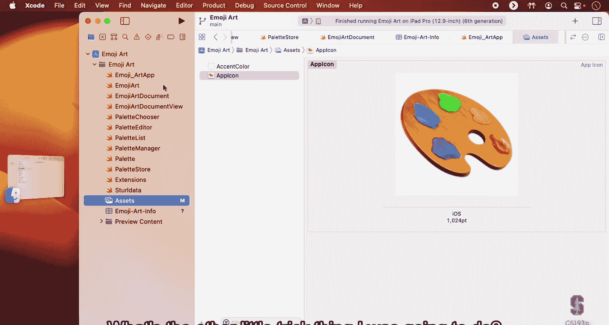
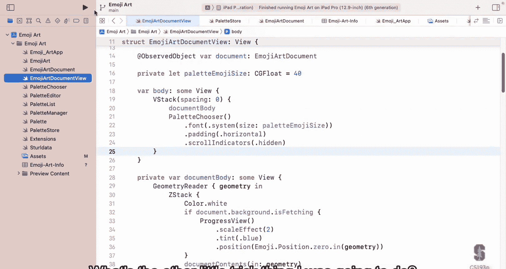
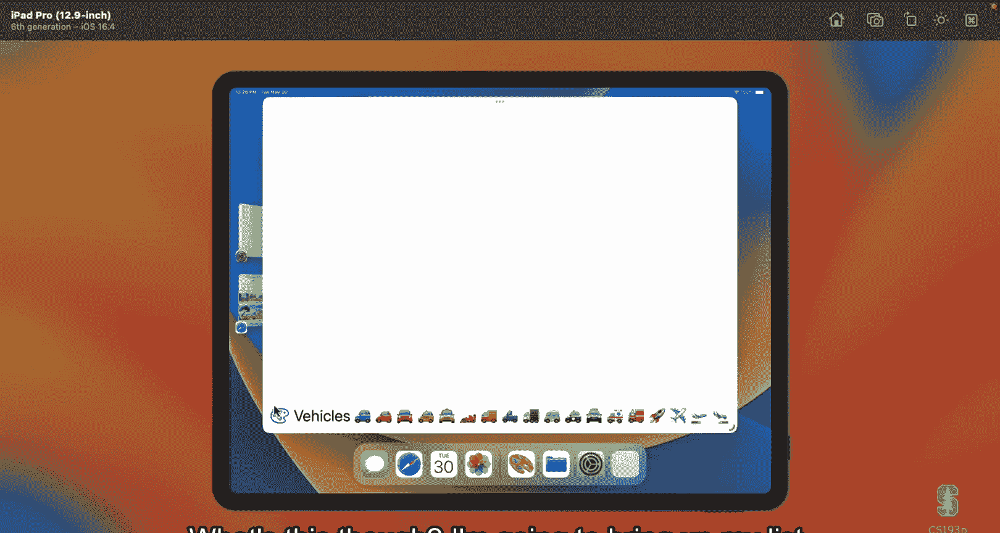
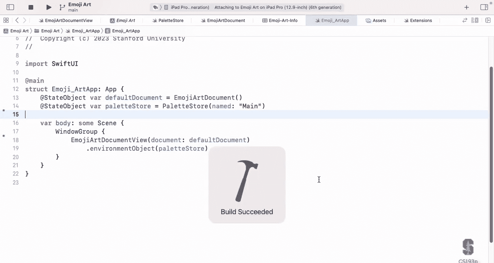
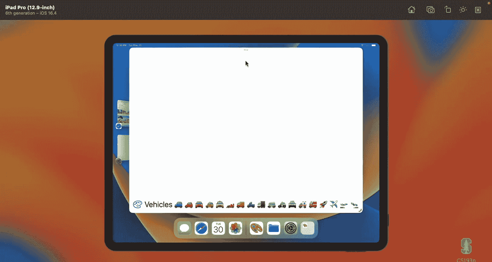
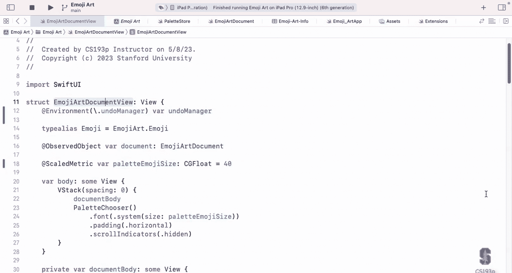
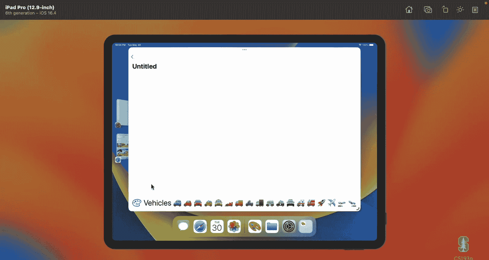
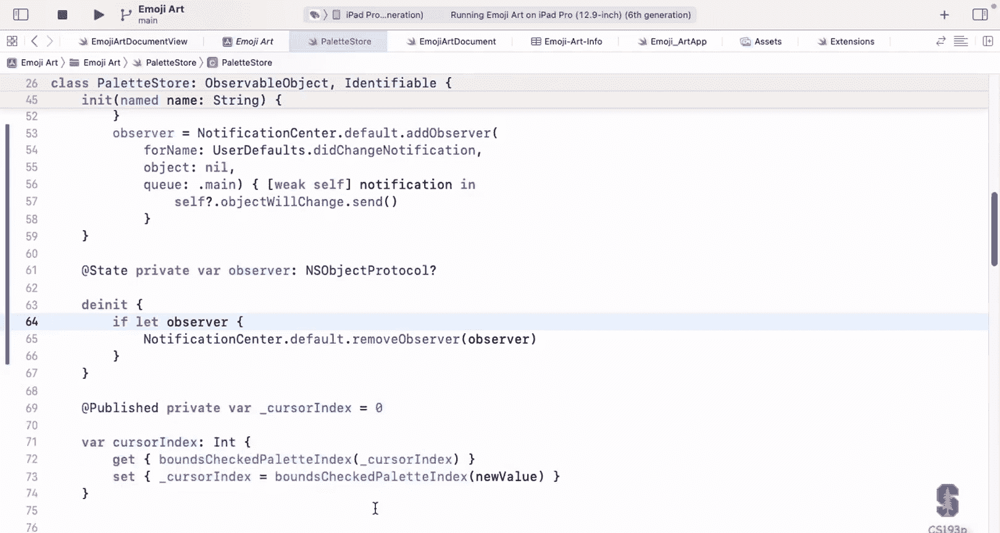

# 斯坦福大学《SwiftUI的iOS应用开发》课程：第15讲：面向文档的应用、撤销与通知 📄

在本节课中，我们将学习如何构建面向文档的iOS应用。与之前适用于几乎所有应用的主题不同，文档应用（如我们的EmojiArt）需要处理文件的保存、重命名和在云端移动等特定功能。我们还将深入探讨App与Scene协议的基础，并学习实现撤销功能以及使用通知系统。

## App与Scene协议 🏗️

上一节我们介绍了课程的整体安排，本节中我们来看看构成SwiftUI应用基础的两个核心协议：`App`和`Scene`。

`App`协议与`View`协议类似，它有一个`body`属性，但其类型是`some Scene`，而非`some View`。你的应用由多个`Scene`组成，每个`Scene`在iPad或Mac上可以表现为一个独立的窗口。

`Scene`是一个容器，它包含你的顶级视图。我们通常使用系统内置的场景构造器，而不是创建自定义的`Scene`。

以下是主要的场景构造器：

*   **`WindowGroup`**：这是我们目前一直在使用的，用于创建可以显示多个窗口的场景。
*   **`DocumentGroup`**：这是面向文档应用的核心，它有两种形式，用于创建可编辑或只读的文档界面。

在`WindowGroup`中，所有窗口默认共享在App层级注入的`@StateObject`（视图模型）。而在`DocumentGroup`中，每个场景（窗口）通常会拥有自己独立的视图模型，因为它代表一个独立的文档。

## 实现DocumentGroup 📂

现在，让我们看看如何将我们的应用转换为一个文档应用。核心是将`WindowGroup`替换为`DocumentGroup`。

在App的主结构中，代码将变得非常简洁：

```swift
@main
struct EmojiArtApp: App {
    var body: some Scene {
        DocumentGroup(newDocument: { EmojiArtDocument() }) { config in
            EmojiArtDocumentView(document: config.document)
        }
    }
}
```

这段代码的含义是：
*   **黄色部分**：调用`DocumentGroup`场景构造器。
*   **蓝色部分**：一个闭包，用于在用户点击“新建文档”时创建一个新的视图模型（文档）。
*   **绿色部分**：一个闭包，接收一个`config`参数。`config.document`就是系统为我们创建或打开的文档视图模型，我们直接将其传递给我们的主视图即可。

系统会自动处理文件的创建、打开和保存界面，我们只需要在视图模型中实现具体的读写逻辑。

## 使视图模型符合ReferenceFileDocument 📄

为了让`DocumentGroup`工作，我们的视图模型（例如`EmojiArtDocument`）必须符合`ReferenceFileDocument`协议。这个协议定义了如何从磁盘读取文档以及如何将文档写入磁盘。

首先，我们需要定义我们的自定义文档类型。这需要在项目设置和代码中完成。

在项目设置的 `Info` 标签页下，我们需要：
1.  添加一个 **“Exported Type Identifier”**。
2.  填写名称（如 `EmojiArt`）、标识符（采用反向DNS格式，如 `edu.stanford.cs193p.emojiart`）和文件扩展名（如 `.emojiart`）。
3.  在 `Conforms To` 字段中添加 `public.data` 和 `public.content`。

在代码中，我们为 `UTType` 添加一个扩展，以便在代码中引用这个新类型：

```swift
import UniformTypeIdentifiers
extension UTType {
    static let emojiArt = UTType(exportedAs: "edu.stanford.cs193p.emojiart")
}
```

接下来，我们让视图模型符合 `ReferenceFileDocument` 协议并实现其要求：

**1. 指定可读写的文档类型**
```swift
static var readableContentTypes: [UTType] { [.emojiArt] }
```

**2. 实现初始化器以读取文档**
```swift
init(configuration: ReadConfiguration) throws {
    if let data = configuration.file.regularFileContents {
        emojiArt = try EmojiArt(json: data)
    } else {
        throw CocoaError(.fileReadCorruptFile)
    }
}
```







**3. 实现`snapshot`方法（在后台线程执行）**
```swift
func snapshot(contentType: UTType) throws -> Data {
    return try emojiArt.json()
}
```

**4. 实现`fileWrapper`方法以写入文档**
```swift
func fileWrapper(snapshot: Data, configuration: WriteConfiguration) throws -> FileWrapper {
    return FileWrapper(regularFileWithContents: snapshot)
}
```

## 实现撤销功能 ↩️

文档系统依赖撤销功能来感知文档是否被修改。只有注册了可撤销的操作，系统才会自动保存文档。

撤销功能通过 `UndoManager` 实现。我们可以在视图中通过 `@Environment(\.undoManager)` 获取 `UndoManager`，然后将其传递给视图模型的意图函数。





在视图模型中，我们创建一个通用的方法来包装任何修改模型的操作，使其可撤销：

```swift
private func undoablyPerform(_ action: String, with undoManager: UndoManager? = nil, doit: () -> Void) {
    let oldModel = emojiArt // 复制当前模型（因为它是值类型）
    doit() // 执行修改操作
    undoManager?.registerUndo(withTarget: self) { myself in
        myself.undoablyPerform(action, with: undoManager) {
            myself.emojiArt = oldModel // 撤销操作：恢复旧模型
        }
    }
    undoManager?.setActionName(action) // 为撤销操作命名
}
```

然后，在每个意图函数中，我们都使用这个包装器：

```swift
func setBackground(_ url: URL, undoWith undoManager: UndoManager?) {
    undoablyPerform("Set Background", with: undoManager) {
        // ... 设置背景的具体逻辑 ...
    }
}
```

这样，任何通过意图函数对模型的修改都会自动支持撤销和重做。

## 通知系统简介 📢

通知（`Notification`）是一种旧的API，用于在系统事件发生时（如用户默认设置更改、键盘弹出）异步通知代码的其他部分。在现代SwiftUI中，我们优先使用 `@Environment` 和响应式状态管理。

然而，在某些情况下，例如监听 `UserDefaults` 的变化，我们仍然需要使用通知。

在视图中，我们可以使用 `.onReceive` 修饰符来监听通知：

```swift
.onReceive(NotificationCenter.default.publisher(for: UserDefaults.didChangeNotification)) { notification in
    // 处理UserDefaults的变化
}
```





如果是在视图模型等非视图环境中，则需要手动添加和移除观察者：

```swift
private var observer: NSObjectProtocol?

init() {
    observer = NotificationCenter.default.addObserver(
        forName: UserDefaults.didChangeNotification,
        object: nil,
        queue: .main
    ) { [weak self] _ in
        self?.objectWillChange.send()
    }
}

deinit {
    if let observer = observer {
        NotificationCenter.default.removeObserver(observer)
    }
}
```

**重要提示**：为了避免循环引用导致内存泄漏，在闭包中捕获 `self` 时应使用 `[weak self]`。

## 总结 🎯

本节课中我们一起学习了构建SwiftUI文档应用的核心知识。

我们首先了解了`App`和`Scene`协议如何构成应用的基础结构。接着，我们掌握了使用`DocumentGroup`来搭建文档应用界面，并通过符合`ReferenceFileDocument`协议来实现模型数据的磁盘读写。我们还深入学习了如何利用`UndoManager`为操作添加撤销支持，这是文档自动保存的关键。最后，我们简要介绍了传统的通知系统，并了解了在SwiftUI中应优先考虑使用`@Environment`等现代响应式工具。



通过将这些技术整合到EmojiArt应用中，我们成功将其转变为一个功能完整的文档应用，支持多文档编辑、保存、撤销以及跨窗口状态管理。