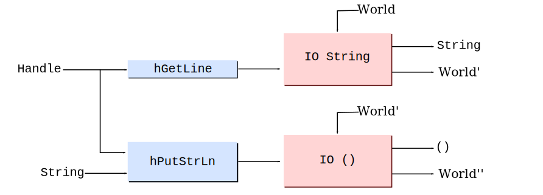
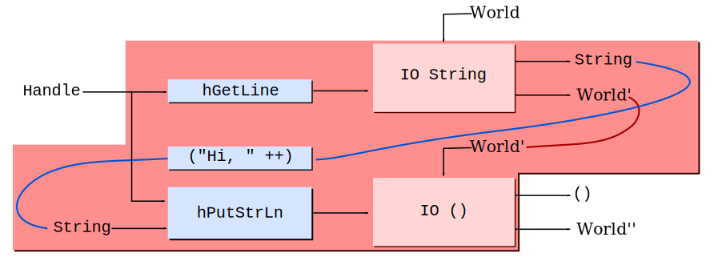

# CS240h：Haskell 中的功能系统

+   我是 David Mazières

    +   大部分职业生涯都在操作系统，系统和安全方面工作

    +   以前使用 C++和 C，但 5 年前开始使用 Haskell

    +   课程在某种程度上受到我学习 Haskell 的经验的启发

+   另一位讲师：Bryan O'Sullivan

    +   已经实现了许多当今广泛使用的关键 Haskell 库

    +   合著了[*现实世界的 Haskell*](http://book.realworldhaskell.org/)，一本非常好的非理论入门书籍

    +   也有很多系统经验（例如，Linux 早期用户空间代码）

+   课程助教：David Terei

    +   Haskell 标准委员会的成员！

    +   实现了[安全 Haskell](http://www.haskell.org/ghc/docs/latest/html/users_guide/safe-haskell.html)和 GHC LLVM 后端

## 为什么选择 Haskell？

+   Haskell 的表达能力可以提高生产力

    +   小语言核心提供了很大的灵活性

    +   代码可以非常简洁，加快开发速度

    +   从编译和解释语言中获得最佳效果

+   Haskell 使代码更易于理解和维护

    +   可以深入研究复杂的库并理解代码在做什么

        （*为什么*可能是另一回事，但简洁性留下了评论的空间...)

+   Haskell 可以增加系统的稳健性

    +   强类型在编译时捕获了许多错误

    +   函数式代码允许更好的测试方法

    +   可以在不改变语义的情况下并行化非并发代码

    +   并发编程抽象对数据竞争具有抵抗力

+   Haskell 让你实现新类型的功能（DIFC，STM，...）

## 为什么���择 CS240h？

+   学会在 Haskell 中以较低的前期成本构建系统

    +   从历史上看，Haskell 是语言研究的工具。

        这种语言通常的教学方式反映了其历史

    +   CS240h 将更多地从系统角度呈现这门语言

+   学习新的，令人惊讶的，有效的编程技术

    +   一些内容适用于其他语言（尽管在学习 Haskell 后返回其他语言可能会令人沮丧）

+   **你喜欢编程**

    +   使用 Haskell，你将以新的方式思考编程

+   你有时会对其他语言感到沮丧

    +   也许你想设计一种新语言，或者倾向于“最大化”现有语言功能（宏，模板，重载等）

    +   大多数语言需要更改的事情可以在 Haskell 库中完成

## 行政事务

+   我们假设你们中的一些人可能已经尝试过 Haskell，其他人则没有

+   第一周涵盖 Haskell 基础知识

    +   如果你没有使用过 Haskell，你应该通过阅读[Bryan 的书的部分内容](http://book.realworldhaskell.org/)和/或在线教程（例如[`www.haskell.org/tutorial/`](http://www.haskell.org/tutorial/)或[`learnyouahaskell.com/chapters`](http://learnyouahaskell.com/chapters)）来补充。

    +   如果你使用过 Haskell，你可能仍然可以从这些讲座中学到一些东西

+   本学期的其余时间将涵盖更高级的技术

+   最终成绩将基于几个因素

    1.  上课出勤和参与度 **-- 带上你的笔记本电脑**

    1.  有人可以记录其中一堂课 **-- 今天需要志愿者**

        +   我们计划收集所有笔记并在网络上免费分发

    1.  三个小的热身个人编程练习

    1.  一个大型的最终项目和演示

## 最终项目

+   在 Haskell 中实现你选择的项目

    +   项目可以由 1-3 人组成的团队完成

    +   与其中一位教师会面讨论项目

    +   完成并评估项目，并提交简短的论文

    +   最终考试将是一个迷你会议，在会议上你将展示你���工作

    +   **参加 6 月 10 日周二晚上 7:00-10:00 的考试是强制性的**

        但如果一致同意，我们可以将其移至 6 月 5 日星期四，12:15-3:15pm。（我们会提供午餐...）

+   我们鼓励 CS240h 项目与你的研究重叠

    +   你在 CS240h 中学到的编程技巧很可能与你正在进行的研究无关

+   我们对 CS240h 项目同时作为另一个班级项目表示满意，

    **只要另一位教师和所有队友（来自两个班级）都同意**

## 开始使用 Haskell

+   安装[Haskell 平台](http://hackage.haskell.org/platform/)或[`cabal`](http://www.haskell.org/cabal/users-guide/)（有时是`cabal-install`）+ [GHC](http://www.haskell.org/ghc/docs/latest/html/users_guide/index.html)

+   创建一个名为`hello.hs`的文件，内容如下：

    ```
    main = putStrLn "Hello, world!"
    ```

+   将你的程序编译成本地可执行文件，如下所示：

    ```
    $ ghc --make hello [1 of 1] Compiling Main ( hello.hs, hello.o ) Linking hello ... $ ./hello Hello, world!
    ```

+   或者在 [GHCI 解释器](http://www.haskell.org/ghc/docs/latest/html/users_guide/ghci.html) 中运行如下：

    ```
    $ ghci hello.hs GHCi, version 7.6.3: http://www.haskell.org/ghc/ :? for help ... Ok, modules loaded: Main. *Main> main Hello, world! *Main> 
    ```

## 绑定

+   Haskell 使用`=`符号声明*绑定*：

    ```
    x = 2 -- Two hyphens introduce a comment y = 3 -- ...that continues to end of line. main = let z = x + y -- let introduces local bindings in print z -- program will print 5
    ```

    +   绑定的名称不能以大写字母开头

    +   绑定由“`;`”分隔，通常由[布局](http://www.haskell.org/onlinereport/haskell2010/haskellch2.html#x7-210002.7)规则自动插入

+   一个绑定可以声明一个或多个参数的*函数*

    +   函数和参数之间用空格分隔（在定义或调用时）

    ```
    add arg1 arg2 = arg1 + arg2 -- defines function add five = add 2 3 -- invokes function add
    ```

+   括号可以包裹复合表达式，必须为参数这样做

    ```
    bad = print add 2 3 -- error! (print should have only 1 argument)
    ```

    ```
    main = print (add 2 3) -- ok, calls print with 1 argument, 5
    ```

## Haskell 是一种*纯*函数式语言

+   与命令式语言中的变量不同，Haskell 中的绑定是

    +   *不可变* - 在给定范围内只能绑定一个符号一次（尽管绑定的符号仍称为“变量”，因为函数参数可以在调用中变化）

    ```
    x = 5 x = 6 -- error, cannot re-bind x
    ```

    +   *无序* - 源代码中绑定的顺序不重要

    +   *惰性* - 仅在需要时才评估符号的定义

    ```
    safeDiv x y = let q = div x y -- safe as q never evaluated if y == 0 in if y == 0 then 0 else q main = print (safeDiv 1 0) -- prints 0
    ```

    +   *递归* - 绑定符号在其自身定义范围内

    ```
    x = 5 -- this x is not used in main main = let x = x + 1 -- introduces new x, defined in terms of itself in print x -- program "diverges" (i.e., loops forever)
    ```

## 如何在没有可变变量的情况下编程？

+   在 C 中，我们使用可变变量创建循环：

    ```
    long factorial (int n) { long result = 1; while (n > 1) result *= n--; return result; }
    ```

+   在 Haskell 中，使用递归在新范围中“重新绑定”参数符号

    ```
    factorial n = if n > 1 then n * factorial (n-1) else 1
    ```

    +   递归经常填补了对可变变量的类似需求

    +   但上述的 Haskell 阶乘函数比 C 的差--为什么？

## 尾递归

+   每个递归调用可能需要一个栈帧

    +   这段 Haskell 代码需要`n`个栈帧

        ```
        factorial n = if n > 1 then n * factorial (n-1) else 1
        ```

    +   相比之下，我们的 C 阶乘在常量空间中运行

+   幸运的是，Haskell 支持优化的*尾递归*

    +   如果一个函数以对自身的调用结束，则该函数是尾递归的

    +   不幸的是，`factorial n`在评估`factorial (n-1)`之后才乘以`n`

+   思路：使用 *累加器* 参数使调用尾递归

    ```
    factorial n = let loop acc n' = if n' > 1 then loop (acc * n') (n' - 1) else acc in loop 1 n
    ```

    +   这里 `loop` 是尾递归的，编译成实际循环

## Guards 和 `where` 子句

+   *Guards* 让您缩短函数声明：

    ```
    factorial n = let loop acc n' | n' > 1 = loop (acc * n') (n' - 1) | otherwise = acc in loop 1 n
    ```

    +   "`|`" 符号引入一个 guard

    +   Guards 从上到下进行评估；第一个 `True` guard 胜出

    +   系统预定义库（标准库）定义 `otherwise = True`

+   绑定也可以以 `where` 子句结束--类似于反转的 `let`

    ```
    factorial n = loop 1 n where loop acc n' | n' > 1 = loop (acc * n') (n' - 1) | otherwise = acc
    ```

    +   与 `let` 不同，`where` 子句作用于多个 guard 定义

    +   这对于绑定变量以在 guard 中使用很方便

## 提示：变量名

+   内部函数（`loop`）通常具有与外部函数相关的参数

    +   可以重复使用已在作用域中的变量名，但编译器会警告您

    +   典型做法是为内部函数的参数添加 `'`（撇号）

    +   Haskell 接受 `'` 字符作为变量，但不能作为第一个字符

+   就我个人而言，我觉得这种做法有点容易出错。

    +   在学习 Haskell 时，我反复犯了删除撇号的错误，例如：

    ```
    factorial n = loop 1 n where loop acc n' | n' > 1 = loop (acc * n) (n' - 1) -- bug | otherwise = acc
    ```

    +   您可以通过为外部函数使用更长的符号名称（即，更短的作用域使用更短的名称）来避免问题

    ```
    factorial n0 = loop 1 n0 where loop acc n | n > 1 = loop (acc * n) (n - 1) | otherwise = acc
    ```

    +   这里意外地输入 "`factorial n0 = loop 1 n`" 导致编译错误

## 每个表达式和绑定都有一个类型

+   一些基本类型：

    +   `Bool` - 要么 `True` 要么 `False`

    +   `Char` - 一个 Unicode 代码点（即，一个字符）

    +   `Int` - 固定大小的整数

    +   `Integer` - 一个任意大小的整数

    +   `Double` - 一个 IEEE 双精度浮点数

    +   *type1* `->` *type2* - 从 *type1* 到 *type2* 的函数

    +   `(`*type1*`,` *type2*`,` ...`,` *typeN*`)` - 一个元组

    +   `()` - 一个零元组，发音为 *unit*（类似于 C 语言中的 `void`）；这种类型只有一个值，也写作 `()`

+   您可以使用 `::` 声明符号或表达式的类型

    ```
    x :: Integer x = (1 :: Integer) + (1 :: Integer) :: Integer
    ```

    +   `::` 的优先级低于任何函数运算符（包括 `+`）

## 更多关于类型的内容

+   函数应用逐个参数进行（也称为“柯里化”）

    ```
    add :: Integer -> (Integer -> Integer) add arg1 arg2 = arg1 + arg2
    ```

    +   因此 `add 2 3` 等同于 `(add 2) 3`

    +   `(add 2)` 接受 3 返回 5，所以 `(add 2)` 的类型为 Integer -> Integer

    +   `->` 右结合，因此在多参数函数类型中通常省略括号：

        `fn ::` *argType1* `->` *argType2* `->` ... `->` *argTypeN* `->` *resultType*

+   通常编译器可以推断类型

    +   您可以使用 `:t` 让 [GHCI](http://www.haskell.org/ghc/docs/latest/html/users_guide/ghci.html) 显示推断的类型

    ```
    *Main> :t add add :: Integer -> Integer -> Integer
    ```

    +   最好总是声明顶层绑定的类型（如果缺少，编译器会警告）

## 用户定义的数据类型

+   `data` 关键字声明用户定义的数据类型（类似于 C 语言中的 `struct`）：

    ```
    data PointT = PointC Double Double deriving Show
    ```

    +   声明新类型，`PointT`，带有包含两个 `Double` 的构造函数 `PointC`

    +   `deriving Show` 意味着您可以打印该类型（在 GHCI 中很有帮助）

    +   还可以派生 `Read`、`Eq`、`Ord`、`Enum`、`Bounded`

+   注意数据类型和构造函数 *必须* 以大写字母开头

+   类型和构造函数可以使用相同的名称（通常如此），例如：

    ```
    data Point = Point Double Double deriving Show
    ```

+   一个类型可以有多个构造函数（类似于标记联合）：

    ```
    data Point = Cartesian Double Double | Polar Double Double deriving Show
    ```

    ```
    data Color = Red | Green | Blue | Violet deriving (Show, Eq, Enum)
    ```

## 使用数据类型

+   构造函数就像产生其类型值的函数

    ```
    data Point = Point Double Double deriving Show myPoint :: Point myPoint = Point 1.0 1.0
    ```

    ```
    data Color = Red | Green | Blue | Violet deriving (Show, Eq, Enum) myColor :: Color myColor = Red
    ```

+   `case`语句和函数绑定使用*模式*“解构”值

    ```
    getX, getMaxCoord :: Point -> Double getX point = case point of Point x y -> x getMaxCoord (Point x y) | x > y = x | otherwise = y
    ```

    ```
    isRed :: Color -> Bool isRed Red = True -- Only matches constructor Red isRed c = False -- Lower-case c just a variable
    ```

## 练习：石头、剪刀、布裁判

+   给定以下类型用于石头-剪刀-布游戏：

    ```
    data Move = Rock | Paper | Scissors deriving (Eq, Read, Show, Enum, Bounded) data Outcome = Lose | Tie | Win deriving (Show, Eq, Ord)
    ```

+   定义一个函数`outcome :: Move -> Move -> Outcome`

    +   第一个移动应该是你自己的，第二个是对手的

    +   应该告诉你赢了、输了还是平局

```
GHCi, version 7.6.3: http://www.haskell.org/ghc/ :? for help ... *Main> outcome Rock Paper Lose *Main> outcome Scissors Paper Win *Main> outcome Paper Paper Tie
```

## 答案

```
data Move = Rock | Paper | Scissors deriving (Eq, Read, Show, Enum, Bounded) data Outcome = Lose | Tie | Win deriving (Show, Eq, Ord) -- | @outcome our_move their_move@ outcome :: Move -> Move -> Outcome outcome Rock Scissors = Win outcome Paper Rock = Win outcome Scissors Paper = Win outcome us them | us == them = Tie | otherwise = Lose
```

## 带参数的类型

+   类型可以像函数一样具有参数

    +   类型参数以小写字母开头

    +   一些标准 Prelude 中的例子

    ```
    data Maybe a = Just a | Nothing
    ```

    ```
    data Either a b = Left a | Right b
    ```

+   你可以在 GHCI 中看到这些工作原理：

    ```
    Prelude> :t Just True Just True :: Maybe Bool Prelude> :t Left True Left True :: Either Bool b 
    ```

+   注意`Left True`的类型包含一个类型变量，`b`

    +   表达式`Left True`可以是类型`Either Bool b`，其中`b`是任意类型

    +   这是一种被称为*参数多态性*的特性的例子

## 更多解构提示

+   特殊变量"`_`"可以被绑定但不被使用

    +   当你不关心一个值时使用它：

    ```
    isJust :: Maybe a -> Bool -- note parametric polymorphism isJust (Just _) = True isJust Nothing = False
    ```

    ```
    isRed Red = True isRed _ = False -- we don't need the non-red value
    ```

    +   编译器会警告如果一个绑定变量未被使用；`_`可以避免这种情况

+   你可以在守卫内部解构类型并绑定变量，例如：

    ```
    addMaybes mx my | Just x <- mx, Just y <- my = Just (x + y) addMaybes _ _ = Nothing
    ```

    尽管通常有更简单的方法

    ```
    addMaybes (Just x) (Just y) = Just (x + y) addMaybes _ _ = Nothing
    ```

## 列表

+   我们可以用`data`关键字定义同质列表

    ```
    data List a = Cons a (List a) | Nil oneTwoThree = (Cons 1 (Cons 2 (Cons 3 Nil))) :: List Integer
    ```

+   但是 Haskell 内置了具有语法糖的列表

    +   类型不再是`List Integer`，而是写作`[Integer]`

    +   构造函数不再是`Cons`，而是被称为`:`且是*中缀*

    +   空列表不再是`Nil`，而是被称为`[]`

    ```
    oneTwoThree = 1:2:3:[] :: [Integer]
    ```

    +   但是对于同一个列表，还有更方便的语法：

    ```
    oneTwoThree' = [1, 2, 3] -- comma-separated elements within brackets oneTwoThree'' = [1..3] -- define list by a range
    ```

+   一个`String`只是一个`Char`列表，所以`['a', 'b', 'c'] == "abc"`

+   你可以对字面列表和`String`进行模式匹配

## Prelude 中的一些基本列表函数

```
head :: [a] -> a head (x:_) = x head [] = error "head: empty list"
```

```
tail :: [a] -> [a] -- all but first element tail (_:xs) = xs tail [] = error "tail: empty list"
```

```
a ++ b :: [a] -> [a] -> [a] -- infix operator concatenate lists [] ++ ys = ys (x:xs) ++ ys = x : xs ++ ys
```

```
length :: [a] -> Int -- This code is from language spec length [] = 0 -- GHC implements differently, why? length (_:l) = 1 + length l
```

```
filter :: (a -> Bool) -> [a] -> [a] filter pred [] = [] filter pred (x:xs) | pred x = x : filter pred xs | otherwise = filter pred xs
```

注意函数`error :: String -> a`报告断言失败

## 使用`deriving Read`和`reads`进行解析

+   我们一直在使用"`deriving Show`"和`show`来打印值

    +   默认情况下，`show`会给出一个有效的 Haskell 表达式

    ```
    *Main> show $ Point 1.0 1.0 "Point 1.0 1.0" <-- could paste string into your source
    ```

+   "`deriving Read`"让你在运行时解析一个值

    ```
    data Point = Point Double Double deriving (Show, Read)
    ```

    +   问题：可能有 0、1 或（如果模棱两可）更多可能的解析

    +   函数`reads`解析并返回`[(value, string_with_rest_of_input)]`

    ```
    *Main> reads "invalid Point 1 2" :: [(Point, String)] [] *Main> reads "Point 1 2" :: [(Point, String)] [(Point 1.0 2.0,"")] *Main> reads "Point 1 2 and some extra stuff" :: [(Point, String)] [(Point 1.0 2.0," and some extra stuff")] *Main> reads "(Point 1 2)" :: [(Point, String)] -- note parens OK [(Point 1.0 2.0,"")]
    ```

## 练习：使用`reads`

+   编写一个函数来解析移动：

    ```
    parseMove :: String -> Maybe Move
    ```

    +   成功解析时返回`Just`移动，否则返回`Nothing`

    +   如果更容易的话，可以选择接受空格或括号

    +   但是应该拒绝在移动后有任何尾随内容的字符串

+   使用示例：

```
*Main> parseMove "Rock" Just Rock *Main> parseMove "Paper" Just Paper *Main> parseMove "Scissors plus extra junk" Nothing
```

## 可能的解决方案

+   使用`reads`：

    ```
    parseMove :: String -> Maybe Move parseMove str = case reads str of [(m, "")] -> Just m _ -> Nothing
    ```

    +   `reads`的返回类型隐式受到`parseMove`的类型声明的约束

    +   移除`parseMove`的类型会使调用它变得困难

+   直接匹配关键字：

    ```
    parseMove :: String -> Maybe Move parseMove "Rock" = Just Rock parseMove "Paper" = Just Paper parseMove "Scissors" = Just Scissors parseMove _ = Nothing
    ```

    +   注意字符串是构造函数---你可以对它们进行模式匹配

    +   但是这种解决方案太过挑剔--不会接受尾随回车或空格。如果你做了这个改变，使用`reads`。

## 更宽容地处理行规则

+   如果读取终端输入，不同的操作系统有不同的规则

    +   例如，可能有尾随`"\n"`或`"\r\n"`

+   让我们容忍尾随空格

    +   将你的定义改为：

    ```
    parseMove :: String -> Maybe Move parseMove str = case reads str of [(m, rest)] | ok rest -> Just m _ -> Nothing where ok = all (`elem` " \r\n")
    ```

    +   现在应该表现如下

    ```
    *Main> parseMove "Rock \r\n" Just Rock *Main> parseMove "Rock \r\njunk" Nothing
    ```

## Hoogle

+   让我们找到 GHC 的`length`函数的源代码？

+   [Hoogle](http://www.haskell.org/hoogle/)是专门为 Haskell 函数设计的搜索引擎

    +   前往[`www.haskell.org/hoogle/`](http://www.haskell.org/hoogle/)

    +   点击*search plugin*

    +   关键字"`haskell.org`"对我来说太长了--我改成"`ho`"

+   让我们搜索长度...点击源代码

    +   所有那些`#`标记都是用于"未装箱类型"，它们更快但不是渐近的

    +   重要的一点是`len`是尾递归的

+   我在编码时一直使用 Hoogle，一直使用

    +   大多数源代码并不难理解

    +   Length 可能是一个不好的起始示例，仅仅因为未装箱类型

    +   尝试检查你正在使用的函数的代码，以更好地理解它们

## 例子：计算字母

+   这是一个计算`String`中小写字母数量的函数

    ```
    import Data.Char -- brings function isLower into scope countLowerCase :: String -> Int countLowerCase str = length (filter isLower str)
    ```

+   如果我们修复`length`，`countLowerCase`可能会在常量空间中运行

    +   回想一下 Haskell 懒惰地评估表达式...意味着在大多数情况下，值可以与函数指针（也称为*thunks*）互换使用

    +   `String`是`[Char]`，这是一个具有两个值的类型，一个*头*和*尾*

    +   但直到*头*或*尾*中的每一个被需要，它都可以被存储为函数指针

    +   因此`length`将导致`filter`逐个生成`Char`

    +   `length`在计数后不会保留字符；可以随意进行垃圾回收

## 函数组合

+   这里有一个更简洁的定义

    ```
    countLowerCase :: String -> Int countLowerCase = length . filter isLower
    ```

+   "`.`"运算符提供函数组合

    ```
    (f . g) x = f (g x)
    ```

    +   "`f . g`"是数学"*f* ∘ *g*"的 ASCII 近似

    +   在上一张幻灯片上，`countLowerCase`的参数名为`str`

    +   新版本不命名参数，这种风格称为*point-free*

+   函数组合几乎可以像 Unix 管道一样使用

    ```
    process = countLowercase . toPigLatin . extractComments . unCompress
    ```

+   练习：不要在 ghci 中键入`:t (.)`，写出"`.`"的类型

## Lambda 抽象

+   有时你想为参数命名但不想为函数命名

+   Haskell 允许通过*lambda 抽象*使用匿名函数

    +   表示法是`\`*变量* `->` *主体*

    +   "`\`"是"*λ*"的 ASCII 近似，因此发音为"lambda"

+   例子：

    ```
    countLowercaseAndDigits :: String -> Int countLowercaseAndDigits = length . filter (\c -> isLower c || isDigit c)
    ```

+   Lambda 抽象可以使用模式解构值，例如：

    ```
     ... (\(Right x) -> x) ...
    ```

    +   但请注意，不允许使用守卫或多个绑定

    +   模式必须具有正确的构造函数，否则将出现运行时错误

## 中缀与前缀表示法

+   我们已经看到一些中缀函数和构造函数：`+`, `*`, `/`, `.`, `||`, `:`

+   实际上，任何二元函数或构造函数都可以用作中缀或前缀

+   对于由字母、数字、`_`和`'`组成的函数和构造函数

    +   Prefix 是默认的：`add 1 2`

    +   将函数放在反引号中使其中缀：`1 `add` 2`

+   对于以`!#$%&*+./<=>?@\^|-~`中的一个开头的函数

    +   中缀是默认的，将函数放在括号中使它们成为前缀，例如，`(+) 1 2`

+   对于元组，前缀构造函数是`(,)`、`(,,)`、`(,,,)`、`(,,,,)`等

+   中缀函数可以在括号中部分应用

    ```
    stripPunctuation :: String -> String stripPunctuation = filter (`notElem` "!#$%&*+./<=>?@\\^|-~:") -- Note above string the SECOND argument to notElem ^
    ```

## 优先级

+   大多数操作符在 Haskell 中只是库函数

    +   语言语法中保留了很少的操作符

        (`..`, `:`, `::`, `=`, `\`, `|`, `<-`, `->`, `@`, `~`, `=>`, `--`)

    +   你可以疯狂地定义自己的运算符

    +   或者甚至使用您自己的定义而不是系统的定义

+   使用 fixity 声明定义中缀运算符的优先级

    +   关键字：`infixl`/`infixr`/`infix`用于左/右/无结合性

    +   语法：*infix-keyword* [0-9] *function* [, *function* ...]

    +   允许在任何类型声明允许的地方使用

+   0 是允许的最低优先级，9 是最高优先级

    +   前缀函数应用的优先级为 10--高于任何中缀调用

    +   Lambda 抽象、`else`子句和`let`...`in`子句尽可能向右延伸（意味着它们永远不会停在任何中缀运算符，无论优先级多低）

## 特定运算符的优先级

+   这是[标准运算符](http://www.haskell.org/onlinereport/haskell2010/haskellch4.html#x10-820061)的优先级：

```
infixl 9 !! -- This is the default when fixity unspecified infixr 9 . infixr 8 ^, ^^, ⋆⋆ infixl 7 ⋆, /, `quot`, `rem`, `div`, `mod` infixl 6 +, - -- Unary negation "-" has this fixity, too infixr 5 ++ -- built-in ":" constructor has this fixity, too infix 4 ==, /=, <, <=, >=, >, `elem`, `notElem` infixr 3 && infixr 2 || infixl 1 >>, >>= infixr 1 =<< infixr 0 $, $!, `seq`
```

+   如果你记不住，可以在[GHCI](http://www.haskell.org/ghc/docs/latest/html/users_guide/ghci.html)中使用`:i`：

    ```
    Prelude> :i && (&&) :: Bool -> Bool -> Bool -- Defined in GHC.Classes infixr 3 &&
    ```

    +   如果 GHCI 没有指定，表示默认为：`infixl 9`

## "`infixr 0`"运算符

+   `$`是函数应用，但优先级最低

    ```
    ($) :: (a -> b) -> a -> b f $ x = f x
    ```

    +   结果证明对于避免括号非常有用，例如：

    ```
     putStrLn $ "the value of " ++ key ++ " is " ++ show value
    ```

+   `seq :: a -> b -> b`只是返回第二个参数的值...

    但在评估第二个参数之前强制评估第一个参数

    +   所以当你完成时，第一个参数是一个值，而不是一个 thunk

    ```
    main = let q = 1 `div` 0 in seq q $ putStrLn "Hello world!\n" -- exception
    ```

    +   `seq`必须内置到编译器中

+   `$!`结合了`$`和`seq`

    ```
    f $! x = x `seq` f x
    ```

## 重新审视累加器

+   我们使用一个累加器来避免在`factorial`中积累`n0`个栈帧：

```
factorial n0 = loop 1 n0 where loop acc n | n > 1 = loop (acc * n) (n - 1) | otherwise = acc
```

+   不幸的是，`acc`可能包含一个长度为`n`的 thunk 链

    +   `(((1 * n) * (n - 1)) * (n - 2) ...)` -- 惰性意味着只有在需要时才会被评估

    +   GHC 足够聪明，不会积累 thunk，但只有在优化时才会这样

+   可以使用`$!`或`seq`来解决这类问题

```
factorial n0 = loop 1 n0 where loop acc n | n > 1 = (loop $! acc * n) (n - 1) | otherwise = acc
```

```
factorial n0 = loop 1 n0 where loop acc n | n > 1 = acc `seq` loop (acc * n) (n - 1) | otherwise = acc
```

## Hackage 和 cabal

+   [Hackage](http://hackage.haskell.org/packages/)是一个大型的 Haskell 包集合

+   [Cabal](http://www.haskell.org/cabal/users-guide/)是一个用于浏览 hackage 和安装包的工具

    +   Cabal 随[haskell 平台](http://hackage.haskell.org/platform/)一起提供

    +   运行`cabal update`以创建`$HOME/.cabal`，下载包数据库

    +   我强烈建议取消注释并编辑`$HOME/.cabal/config`中的这两行

        ```
        documentation: True library-profiling: True
        ```

    +   可能需要将`$HOME/.cabal/bin`添加到您的路径中

    +   我使用以下 shell 别名

        ```
        alias cbi='LC_CTYPE=en_US.UTF-8 cabal install --user --haddock-hyperlink-source'
        ```

+   例如，运行：`cbi network`

    +   在`$HOME/.cabal`中安装包，并在`$HOME/.ghc`中记录它们

    +   要重新开始，必须同时删除`$HOME/.cabal`和`$HOME/.ghc`

## 模块和`import`语法

+   Haskell 将顶层绑定分组为*modules*

    +   默认模块名为`Main`，因为程序从`Main`中的函数`main`开始

    +   除了`Main`，命名为*M*的模块必须位于名为*M*`.hs`的文件中

    +   模块名首字母大写；我使用小写文件名来命名`Main`模块

+   让我们将这些添加到我们源文件的顶部

    ```
    module Main where -- redundant since Main is the default import System.IO
    ```

    +   以"`module` *name* `where`"或"`module` *name* `(`*exported-symbol*[`,` ...]`) where`"（非导出符号提供模块化）开始模块

    +   `import` *module* - 导入*module*中的所有符号

    +   `import qualified` *module* `as` *ID* - 使用 *ID*`. ` 前缀导入的符号

    +   `import` *module* `(`*function1*[`,` *function2* ...]`)` - 只导入命名函数

    +   `import` *module* `hiding (`*function1*[`,` *function2* ...]`)` - 导入除了命名函数之外的所有函数

## `do` 符号

+   让我们写一个向某人打招呼的函数

+   将以下内容键入到文件 `greet.hs` 中：

    +   或者，快捷方式，输入：`wget` [`cs240h.stanford.edu/greet1.hs`](http://cs240h.stanford.edu/greet1.hs)

```
module Main where import System.IO greet h = do hPutStrLn h "What is your name?" name <- hGetLine h hPutStrLn h $ "Hi, " ++ name withTty = withFile "/dev/tty" ReadWriteMode main = withTty greet
```

+   现在尝试在 GHCI 中运行 `main`

## `do` 符号

```
greet h = do hPutStrLn h "What is your name?" name <- hGetLine h hPutStrLn h $ "Hi, " ++ name
```

+   问候任务需要一些不纯（非函数式）的操作

    +   读取和写入文件句柄

+   `do` 块允许您对 IO 操作进行排序。在 `do` 块中：

    +   *pat* `<-` *action* - 将 *pat*（变量或构造模式）绑定到执行 *action* 的结果

    +   `let` *pat* `=` *pure-value* - 将 *pat* 绑定到 *pure-value*（不需要 "`in` ..."）

    +   *action* - 执行 *action* 并丢弃结果，或者在块末返回结果

+   GHCI 输入就像 `do` 块（即，可以使用 `<-`，需要 `let` 进行绑定）

+   在前缀函数后不会解析 `do`/`let`/`case`

    +   通常说 "`func $ do` ..."

    +   也可以说 "`func (do` ...`)`"

## IO 操作的类型是什么？

```
main :: IO () greet :: Handle -> IO () hPutStrLn :: Handle -> String -> IO () hGetLine :: Handle -> IO String
```

+   `IO` 是一个带参数的类型（就像 `Maybe` 是带参数的一样）

    +   "`IO String`" 意味着如果执行的话会产生一个 `String` 的 IO 操作

    +   与 `Maybe` 不同，我们不会使用 `IO` 的构造函数，这有点神奇

+   如果我们尝试按如下方式复制一行输入会怎样？

    ```
    main = hPutStrLn stdout (hGetLine stdin)
    ```

    +   糟糕，`hPutStrLn` 期望类型为 `String`，而 `hGetLine` 返回 `IO String`

+   如何解构 `IO [String]` 以获得 `[String]`

    +   我们不能使用 `case`，因为我们没有 `IO` 的构造函数...此外，类似 `hPutStr` 的解构的顺序和数量很重要

    +   这是在`do`块中使用`<-`操作符的关键！

## IO 的另一种看法 [[Peyton Jones]](http://research.microsoft.com/en-us/um/people/simonpj/papers/marktoberdorf/mark.pdf)

```
do name <- hGetLine h hPutStrLn h $ "Hi, " ++ name
```



+   `hGetLine` 和 `hPutStrLn` 返回可以改变世界的 `IO` *actions*

    +   纯代码可以操纵这种操作，但实际上不能执行它们

    +   只有特殊的 `main` 操作会被执行

## IO 的另一种看法 [[Peyton Jones]](http://research.microsoft.com/en-us/um/people/simonpj/papers/marktoberdorf/mark.pdf)

```
do name <- hGetLine h hPutStrLn h $ "Hi, " ++ name
```



+   `do` 块从其他操作构建一个复合操作

    +   它按照操作将如何应用于真实世界进行了排序

    +   当执行时，将 `IO a` 操作应用于世界，提取类型 `a` 的值

    +   要执行的下一个动作可以取决于提取的 `a` 的值

## 运行 `greet`

```
$ ghc --make greet [1 of 1] Compiling Main ( greet.hs, greet.o ) Linking greet ... $ ./greet What is your name? David Hi, David
```

+   如果想在 GHCI 中运行它会怎样？

    ```
    $ ghci ./greet.hs ... Prelude Main>
    ```

    +   在 `Main` 之前没有 `*` 表示没有访问内部符号的权限（因为编译了），需要这样说：

    ```
    Prelude Main> :load *greet.hs [1 of 1] Compiling Main ( greet.hs, interpreted ) Ok, modules loaded: Main. *Main> 
    ```

## `return` 函数

+   如果我们想要 `greet` 返回人名会怎样？

    +   最后一个操作是 `hPutStrLn :: IO ()`；希望以返回 `name` 的操作结束

    +   这不起作用：

        ```
        do ... hPutStrLn h $ "Hi, " ++ name name -- Incorrect, will not compile
        ```

    +   问题：`IO` do 块中的每个操作都必须具有某种 `a` 类型的 `IO a`

    +   解决方案：`return`函数提供返回特定值的平凡`IO`操作

    ```
    greet :: Handle -> IO String greet h = do hPutStrLn h "What is your name?" name <- hGetLine h hPutStrLn h $ "Hi, " ++ name return name
    ```

+   注意：**`return`不是控制流语句**，只是一个函数

    ```
    return :: a -> IO a
    ```

## 无点 IO 组合

+   回忆无点函数组合与"`.`"（优先级 `infixr 9`）

+   函数`>>=`（发音为"bind"）允许无点 IO 组合

    ```
    (>>=) :: IO a -> (a -> IO b) -> IO b infixl 1 >>=
    ```

+   让我们用无点风格重新编写`greet`以避免变量`name`

    ```
    greet h = do hPutStrLn h "What is your name?" hGetLine h >>= hPutStrLn h . ("Hi, " ++)
    ```

    +   注意`>>=`从左到右组合，而`.`从右到左

+   `do`块只是调用`>>=`的[语法糖](http://www.haskell.org/onlinereport/haskell2010/haskellch3.html#x8-470003.14)

    ```
    -- Desugared version of original greet: greet h = hPutStrLn h "What is your name?" >>= \_ -> hGetLine h >>= \name -> hPutStrLn h ("Hi, " ++ name)
    ```

## 练习：与计算机玩剪刀石头布

+   编写一个函数来对抗用户的特定移动

    +   第一个参数是计算机的移动

    +   从`Handle`读取用户的移动，告诉用户他/她赢了/输了/平局

    ```
    computerVsUser :: Move -> Handle -> IO ()
    ```

+   起始代码：`wget` [`cs240h.stanford.edu/rock1.hs`](http://cs240h.stanford.edu/rock1.hs)

+   例：

    ```
    *Main> withTty $ computerVsUser Rock Please enter one of [Rock,Paper,Scissors] garbage Please enter one of [Rock,Paper,Scissors] Paper You Win *Main> withTty $ computerVsUser Scissors Please enter one of [Rock,Paper,Scissors] Paper You Lose
    ```

## 一个可能的解决方案

```
getMove :: Handle -> IO Move getMove h = do hPutStrLn h $ "Please enter one of " ++ show ([minBound..] :: [Move]) -- Here is the added code: input <- hGetLine h case parseMove input of Just move -> return move Nothing -> getMove h computerVsUser :: Move -> Handle -> IO () computerVsUser computerMove h = do userMove <- getMove h let o = outcome userMove computerMove hPutStrLn h $ "You " ++ show o
```

## 更多关于多态性

+   我们已经看到了一堆多态函数

+   这里有一些更方便的来自 Prelude 的函数

```
id :: a -> a id x = x
```

```
const :: a -> b -> a const a _ = a
```

```
fst :: (a, b) -> a fst (a, _) = a
```

```
snd :: (a, b) -> b snd (_, b) = b
```

```
print a = putStrLn (show a) -- what's the type? a -> IO ()?
```

```
show a = ??? -- how to implement?
```

## 参数化与特定多态性

+   这里实际上有*两种*多态性在起作用

+   *参数化多态性* -- 对每种类型都执行相同的操作

    +   例如，`id :: a -> a`只是将值传递

    +   对每种可能的类型都适用

+   *特定多态性* -- 在不同类型上执行不同的操作

    +   例如，`1 + 1`和`1.0 + 1.0`计算非常不同的函数

    +   例如，`show`将值转换为`String`，完全取决于输入类型

    +   仅适用于支持它的类型（因此在声明中 "`deriving Show`"）

    +   例如，无法`show`一个函数（类型 `Int -> Int`）

## 类和实例

+   特定多态函数称为*方法*，并用*类*声明

    ```
    class MyShow a where  myShow :: a -> String
    ```

+   每种类型的实际方法在*实例*声明中定义

    ```
    data Point = Point Double Double instance MyShow Point where myShow (Point x y) = "(" ++ show x ++ ", " ++ show y ++ ")"
    ```

    +   类声明也可以包括方法的默认定义

+   调用`myShow`的函数的类型是什么？在 GHCI 中询问：

    ```
    myPrint x = putStrLn $ myShow x
    ```

    ```
    *Main> :t myPrint myPrint :: MyShow a => a -> IO ()
    ```

## 类型声明的上下文

+   类型声明可以包含对类型变量的限制

    +   限制用"`(`*class* *type-var*, ...`) =>`"在类型开始处表示，例如：

    ```
    myPrint :: MyShow a => a -> IO ()
    ```

    ```
    sortAndShow :: (Ord a, MyShow a) => [a] -> String
    ```

    ```
    elem :: (Eq a) => a -> [a] -> Bool elem _ [] = False elem x (y:ys) = x==y || elem x ys
    ```

    ```
    add :: (Num a) => a -> a -> a add arg1 arg2 = arg1 + arg2
    ```

+   可以将上下文视为表示隐藏*字典*参数

    +   当你调用`myPrint`时，你明确给它一个类型为`a`的值

    +   但也隐含地为类型`a`的`MyShow`实例给出一个函数指针

## [可怕的](http://www.haskell.org/haskellwiki/Monomorphism_restriction) [单态性限制](http://www.haskell.org/onlinereport/haskell2010/haskellch4.html#x10-930004.5.5)（DMR）

+   假设你想要缓存超级昂贵函数的结果

    ```
    superExpensive val = len $ veryExpensive (val :: Int) where len [] = 0 len (x:xs) = 1 + len xs cachedResult = superExpensive 5
    ```

    +   `cachedResult`将作为惰性求值开始，执行一次，然后包含值

+   让我们思考一下类型

    ```
    *Main> :t superExpensive superExpensive :: Num a => Int -> a *Main> :t cachedResult cachedResult :: Integer
    ```

    +   `+`和`0`是重载的，所以`superExpensive`可以返回任何你想要的`Num`

    +   为什么我们没有`cachedResult :: (Num a) => a`？

    +   回忆上下文限制就像隐藏的参数...所以会将`cachedResult`变成一个函数，破坏我们的缓存目标！

    +   但编译器如何足够聪明地在这里为我们节省？

## 继续讨论 DMR

+   答案：在这种情况下，编译器实际上并不那么聪明

    +   启发式：如果看起来像一个函数，可以推断*特设*多态类型

    +   如果看起来像其他任何东西，除非明确声明，否则不会有*特设*多态性

    +   *参数化*多态类型总是可以推断的（没有隐藏参数）

+   看起来像一个函数的是什么？

    +   必须绑定一个单一符号（`f`），而不是一个模式（`(x, y) =` ...，`(Just x) =` ...）

    +   必须至少有一个显式参数（`f x =` ... 可以，`f =` ... 不行）

+   单态类型是如何推断的？

    +   如果绑定的符号在模块的其他地方使用，从使用中推断类型

    +   如果仍然存在歧义，并且类型属于`Num`类，请尝试`Integer`然后`Double`（这个顺序可以通过[`default`声明](http://www.haskell.org/onlinereport/haskell2010/haskellch4.html#x10-790004.3.4)进行更改）

    +   如果仍然存在歧义，编译将失败

## DMR 的主要信息

+   将类型限制视为隐式字典参数

    +   编译器不会给非函数加上隐式参数

+   这段代码将编译

    ```
    -- Compiler infers: show1 :: (Show x) => x -> String show1 x = show x
    ```

+   但这两者都不会：

    ```
    show2 = show show3 = \x -> show x
    ```

    +   我宁愿你从我这里听到，而不是从 GHC 那里...

+   相对容易解决 DMR

    +   为函数添加类型签名--对于顶层绑定来说总是个好主意，有时对于`let`绑定是必要的

        ```
        -- No problem, compiler knows you want ad hoc polymorphism show2 :: (Show x) => x -> String show2 = show
        ```

## 超类和实例上下文

+   一个类可能要求所有实例都是另一个类的成员

    +   类`Eq`包含'=='和'/='方法，而`Ord`包含`<`，`>=`，`>`，`<=`等

    +   没有理由有一个`Ord`实例而不是一个`Eq`实例

    +   `Ord`将`Eq`声明为一个超类，使用一个上下文

        ```
        class Eq a => Ord a where (<), (>=), (>), (<=) :: a -> a -> Bool a <= b = a == b || a < b -- default methods can use superclasses ....
        ```

    +   不需要在上下文中写出超类限制--任何具有`Ord`字典的函数都可以查找`Eq`字典

+   同样，一个实例可能需要一个上下文

    +   例如，为一个类为`MyShow`的项目列表定义`myShow`

    ```
    instance (MyShow a) => MyShow [a] where myShow [] = "[]" myShow (x:xs) = myShow x ++ ":" ++ myShow xs
    ```

## 参数化类型的类

+   也可以有参数化类型的类

+   `Functor`是一个类，用于将函数映射到参数化类型：

    ```
    class Functor f where  fmap :: (a -> b) -> f a -> f b
    ```

    +   注意没有类型 `f` 的参数/结果，而是类型 `f a` 和 `f b`

+   `Functor`的一个例子是`Maybe`：

    ```
    instance Functor Maybe where fmap _ Nothing = Nothing fmap f (Just a) = Just (f a)
    ```

    ```
    GHCi, version 7.6.3: http://www.haskell.org/ghc/ :? for help Prelude> fmap (+ 1) Nothing Nothing Prelude> fmap (+ 1) $ Just 2 Just 3
    ```

## 更多`Functor`

+   列表是一个`Functor`

    +   `[]`可以用作前缀类型构造函数（"`[] Int`"表示"`[Int]`"），并且可以用于声明实例

    ```
    map :: (a -> b) -> [a] -> [b] map _ [] = [] map f (x:xs) = f x : map f xs instance Functor [] where fmap = map
    ```

+   `IO`是一个`Functor`

    ```
    instance Functor IO where fmap f io = io >>= return . f -- equivalent to: do val <- io; return (f val)
    ```

    +   所以我们可以说：

    ```
    greet h = do hPutStrLn h "What is your name?" fmap ("Hi, " ++) (hGetLine h) >>= hPutStrLn h
    ```

## 种类

+   如果尝试为`Int`创建`Functor`实例会发生什么？

    ```
    instance Functor Int where -- compilation error fmap _ _ = error "placeholder"
    ```

    +   获得`fmap :: (a -> b) -> Int a -> Int b`，但`Int`没有参数化

+   编译器必须跟踪所有不同种类的类型

    +   一种类型（例如，`Int`，`Double`，`()`）直接描述值

    +   另一种类型需要一个类型参数（`Maybe`，`[]`，`IO`）

    +   另一种类型需要*两个*类型参数（`Either`，`(,)`）

    +   有时参数化类型被称为*类型构造函数*

+   使用符号 ∗ 和 → 命名种类，类似于柯里化函数

    +   ∗ 是代表值的类型的种类（`Int`，`Double`，`()`等）

    +   ∗ → ∗ 是具有一个类型参数 ∗ 的类型的种类（`Maybe`，`IO`等）

    +   ∗ → ∗ → ∗ 是一个带有两个参数（`Either`）的类型构造器

    +   一般来说，*a* → *b* 意味着一个类型构造器，应用于 *a* 类型，产生 *b* 类型

## `Monad` 类

+   **前两节课都在为这张幻灯片做准备**

+   `return` 和 `>>=` 实际上是一个叫做 `Monad` 的类的方法

```
class Monad m where  (>>=) :: m a -> (a -> m b) -> m b  return :: a -> m a  fail :: String -> m a -- called when pattern binding fails fail s = error s -- default is to throw exception  (>>) :: m a -> m b -> m b m >> k = m >>= \_ -> k
```

+   这具有深远的影响

    +   您可以使用 `do` 块的语法糖进行非 IO 目的

    +   许多单子函数在 `Monad` 中是多态的 - 发明一个新的单子，你仍然可以使用大部分现有的代码

## `Maybe` 单子

+   系统库为 `Maybe` 定义了一个 `Monad` 实例

    ```
    instance Monad Maybe where (Just x) >>= k = k x Nothing >>= _ = Nothing return = Just fail _ = Nothing
    ```

+   可以使用 `Nothing` 表示失败

    +   可能有一堆函数从数据中提取字段

    ```
    extractA :: String -> Maybe Int extractB :: String -> Maybe String ... parseForm :: String -> Maybe Form parseForm raw = do a <- extractA raw b <- extractB raw ... return (Form a b ...)
    ```

    +   通过 `IO` 线程化的世界将线程成功/失败状态

    +   由于 Haskell 是惰性的，在第一个 `Nothing` 处停止计算

## 代数数据类型

+   有一些数据类型有大量字段

    ```
    -- Argument to createProcess function data CreateProcess = CreateProcess CmdSpec (Maybe FilePath) (Maybe [(String,String)]) StdStream StdStream StdStream Bool
    ```

    +   很快就会变得相当笨重

+   代数数据类型允许您标记字段（类似于 C 的 `struct`）

    ```
    data CreateProcess = CreateProcess {  cmdspec :: CmdSpec,  cwd :: Maybe FilePath,  env :: Maybe [(String,String)],  std_in :: StdStream,  std_out :: StdStream,  std_err :: StdStream,  close_fds :: Bool }
    ```

+   让我们制作一个我们的 `Point` 类的代数版本

    ```
    data Point = Point { xCoord :: Double, yCoord :: Double }
    ```

## 代数类型 - 初始化和匹配

```
data Point = Point { xCoord :: Double, yCoord :: Double }
```

+   可以通过命名字段来初始化代数类型

    ```
    myPoint = Point { xCoord = 1.0, yCoord = 1.0 }
    ```

    +   未初始化的字段得到值 `undefined` - 一个抛出异常的惰性计算

+   也可以在任何字段子集上模式匹配

    ```
    -- Note the pattern binding assigns the variable on the right of = getX Point{ xCoord = x } = x
    ```

    +   [*As-patterns*](http://www.haskell.org/onlinereport/haskell2010/haskellch3.html#x8-590003.17.1) 可以方便地同时绑定变量和模式（使用 `@`）：

        ```
        getX' p@Point{ xCoord = x } | x < 100 = x | otherwise = error $ show p ++ " out of range"
        ```

        ```
        -- Also works with non-algebraic patterns getX' p@(Point x _) = ... processString s@('$':_) = ... processString s = ...
        ```

## 代数类型 - 访问和更新

+   可以将字段标签用作访问函数

    ```
    getX point = xCoord point
    ```

    +   `xCoord` 在任何您可以使用 `Point -> Double` 类型的函数中都有效

    +   一个后果：字段标签与顶层绑定共享相同的命名空间，并且必须是唯一的

+   有一种特殊的语法来更新一个或多个字段

    ```
    setX point x = point { xCoord = x } setXY point x y = point { xCoord = x, yCoord = y }
    ```

    +   显然不是破坏性地更新，而是返回新的、修改过的 `Point`

    +   在尾递归函数和 `Monads` 中维护状态非常方便

## 一些杂项要点

+   在数据字段类型之前加上 `!` 使其 *严格* - 即，不能是 thunk

    ```
    data State = State !Int Int data AlgState = AlgState { accumulator :: !Int , otherValue :: Int }
    ```

    +   在上述两种情况下，第一个 `Int` 不能保存一个 thunk，而只能保存一个值

    +   当初始化一个代数数据类型时，必须初始化所有严格字段（因为它们不能保存 `undefined` 的惰性计算）。

## 网络

+   在 [`Network`](http://hackage.haskell.org/packages/archive/network/latest/doc/html/Network.html) 中支持高级流（TCP 和 Unix 域）套接字

    ```
    connectTo :: HostName -> PortID -> IO Handle listenOn :: PortID -> IO Socket accept :: Socket -> (Handle, HostName, PortNumber) sClose :: Socket -> IO ()
    ```

+   在 [`Network.Socket`](http://hackage.haskell.org/packages/archive/network/latest/doc/html/Network-Socket.html) 中的低级 BSD 套接字函数

    ```
    socket :: Family -> SocketType -> ProtocolNumber -> IO Socket connect :: Socket -> SockAddr -> IO () bindSocket :: Socket -> SockAddr -> IO () listen :: Socket -> Int -> IO () accept :: Socket -> IO (Socket, SockAddr) -- not same accept as above
    ```

    +   [`getAddrInfo`](http://hackage.haskell.org/packages/archive/network/latest/doc/html/Network-Socket.html#v:getAddrInfo) 就像 [[RFC3493]](http://tools.ietf.org/html/rfc3493) 一样查找主机名（返回 `[`[`AddrInfo`](http://hackage.haskell.org/packages/archive/network/latest/doc/html/Network-Socket.html#t:AddrInfo)`]`）

    +   今天我们将坚持使用更高级的功能

## 网络示例

+   与 `withTty` 不同，让我们定义一个使用 TCP 的 `withClient`：

    +   要获取代码：`wget` [cs240h.stanford.edu/rock2.hs](http://cs240h.stanford.edu/rock2.hs)

    ```
    withClient :: PortID -> (Handle -> IO a) -> IO a withClient listenPort fn = do s <- listenOn listenPort (h, host, port) <- accept s putStrLn $ "Connection from host " ++ host ++ " port " ++ show port sClose s -- Only accept one client a <- fn h hClose h return a
    ```

+   尝试这样做：

    ```
    *Main> withClient (PortNumber 1617) (computerVsUser Rock)
    ```

    ```
    $ nc localhost 1617 Please enter one of [Rock,Paper,Scissors] Rock You Tie
    ```
