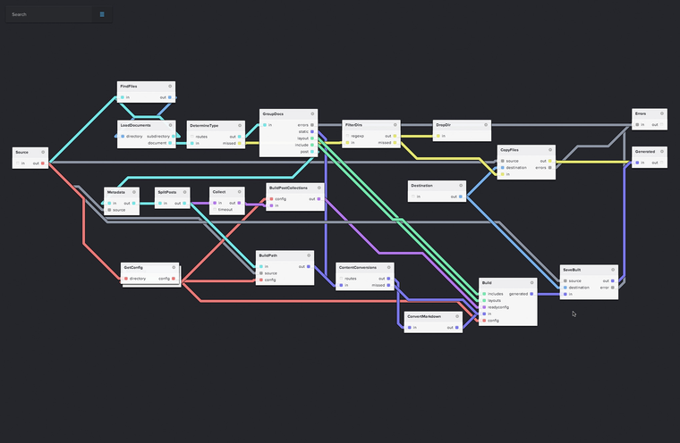

# Pipes

## Gabriel Gonzalez

### 2014 年 5 月 1 日 - CS240H

## 概述

+   **[`pipes`解决的问题]**

+   `pipes`如何工作

+   `pipes`背后的理论

+   `pipes` API 之旅

## 问题

```
replicateM :: Monad m => Int -> m a -> m [a] mapM :: Monad m => (a -> m b) -> [a] -> m [b] sequence :: Monad m => [m a] -> m [a]
```

+   不适用于无限列表

+   在所有内容被处理之前，你无法消费任何结果

+   即使你不需要每个结果，你也必须运行整个计算

+   这通过缓冲每个结果浪费内存

## 非解决方案：惰性 IO

+   仅适用于`IO`

+   仅适用于有副作用的源，不适用于有副作用的接收器或转换

+   通过将效果与评估顺序联系起来，使等式推理无效

+   承认失败（“Monad 太笨拙了”）

## `pipes` - 一个协程库

```
import Pipes import System.IO (isEOF) stdinLn :: Producer String IO () stdinLn = do eof <- lift isEOF if eof then return () else do str <- lift getLine yield str stdinLn useString:: String -> Effect IO () useString str = lift (putStrLn str) echo :: Effect IO () echo = for stdinLn useString main :: IO () main = runEffect echo
```

## 示例

```
$ ./example Hello<Enter> Hello CS240H<Enter> CS240H <Ctrl-D> $
```

## 问题？

## 概述

+   `pipes`解决的问题

+   **[`pipes`如何工作]**

+   `pipes`背后的理论

+   `pipes` API 之旅

## `Producer`

```
import Control.Monad.Trans.Class (MonadTrans(lift)) data Producer a m r = Yield a (Producer a m r) | M (m (Producer a m r)) | Return r yield :: a -> Producer a m () yield a = Yield a (Return ()) instance Monad m => Monad (Producer a m) where -- return :: Monad m => r -> Producer a m r return r = Return r -- (>>=) :: Monad m -- => Producer a m r -> (r -> Producer a m s) -> Producer a m s (Yield a p) >>= return' = Yield a (p >>= return') (M m) >>= return' = M (m >>= \p -> return (p >>= return')) (Return r) >>= return' = return' r instance MonadTrans (Producer a) where -- lift :: Monad m => m r -> Producer a m r lift m = M (liftM Return m)
```

## `stdinLn`

```
stdinLn = do eof <- lift isEOF if eof then return () else do str <- lift getLine yield str stdinLn useString str = lift (putStrLn str)
```

```
stdinLn = M (isEOF >>= \eof -> return $ if eof then Return () else M (getLine >>= \str -> Yield str stdinLn ) ) useString str = M (putStrLn str >>= \r -> return (Return r))
```

## `for`

```
for :: Monad m => Producer a m () -> (a -> Producer b m ()) -> Producer b m () for (Yield a p) yield' = yield' a >> for p yield' for (M m) yield' = M (m >>= \p -> return (for p yield')) for (Return r) _ = Return r
```

```
echo = for stdinLn useString echo = M (isEOF >>= \eof -> return $ if eof then Return () else M (getLine >>= \str -> M (putStrLn str >> return echo) ) )
```

## `runEffect`

```
data Void -- No constructors type Effect = Producer Void runEffect :: Monad m => Effect m r -> m r runEffect (M m) = m >>= runEffect runEffect (Return r) = return r
```

```
main = runEffect echo main = isEOF >>= \eof -> if eof then return () else getLine >>= \str -> putStrLn str >> main
```

## 问题？

## 概述

+   `pipes`解决的问题

+   `pipes`如何工作

+   **[`pipes`背后的理论]**

+   `pipes` API 之旅

## 什么使 Haskell 独特？

+   设计模式受范畴论启发

+   理论在类型类中得到文化上的奉献：

    +   `Monoid`，`Category`，`Applicative`，`Monad`，...

+   **目标：**减少软件复杂性

## 问题



## 如何减少复杂性？

```
class Monoid m where  mappend :: m -> m -> m  mempty :: m (<>) :: Monoid m => m -> m -> m (<>) = mappend
```

```
instance Monoid Int where -- mappend :: Int -> Int -> Int mappend = (+) -- mappend :: Int mempty = 0
```

```
-- Associativity (x <> y) <> z = x <> (y <> z) -- (x + y) + z = x + (y + z) -- Identity: mempty <> x = x -- 0 + x = x x <> mempty = x -- x + 0 = x
```

## `yield`

```
yield :: a -> Producer a IO ()
```

一个`Producer`，`yield`恰好一个元素：

```
yieldOne :: Monad m => Producer String m () yieldOne = yield "Hello"
```

一个`Producer`，`yield`多于一个元素：

```
yieldTwo :: Monad m => Producer String m () yieldTwo = do yield "Hello" yield "CS240H" -- yieldTwo = yield "Hello" >> yield "CS240H"
```

一个`Producer`，`yield`少于一个元素：

```
yieldZero :: Monad m => Producer String m () yieldZero = return ()
```

## 示例

```
>>> runEffect (for yieldOne useString) Hello >>> runEffect (for yieldTwo useString) Hello CS240H >>> runEffect (for yieldZero useString) >>> -- Nothing output
```

## 原始 vs. 派生

```
yieldFour :: Monad m => Producer String m () yieldFour = do yieldTwo yieldTwo -- yieldFour = yieldTwo >> yieldTwo
```

```
>>> runEffect (for yieldFour useString) Hello CS240H Hello CS240H
```

## `(>>)`和`return ()`形成一个 Monoid

```
(>>) :: Producer a IO () -- (<>) :: m -> Producer a IO () -- -> m -> Producer a IO () -- -> m return () :: Producer a IO () -- mempty :: m
```

结合性：

```
(p1 >> p2) >> p3 = p1 >> (p2 >> p3) -- (x <> y) <> z = x <> (y <> z)
```

身份：

```
return () >> p = p -- mempty <> x = x p >> return () = p -- x <> mempty = x
```

## 类别概括了 Monoids

```
class Category cat where -- class Monoid m where  (.) :: cat b c -> cat a b -> cat a c -- mappend :: m -> m -> m  id :: cat a a -- mempty :: m (>>>) :: Category cat => cat a b -> cat b c -> cat a c (>>>) = flip (.)
```

```
instance Category (->) where -- (.) :: (b -> c) -> (a -> b) -> (a -> c) (g . f) x = g (f x) -- id :: (a -> a) id x = x
```

```
-- Associativity (f . g) . h = f . (g . h) -- (x <> y) <> z = x <> (y <> z) -- Identity id . f = f -- mempty <> x = x f . id = f -- x <> mempty = x
```

## `(>=>)`和`return`形成一个 Category

```
(>=>) :: Monad m => (a -> Producer o m b) -- (>>>) :: cat a b -> (b -> Producer o m c) -- -> cat b c -> (a -> Producer o m c) -- -> cat a c (f >=> g) x = f x >>= g return :: Monad m => (a -> Producer o m a) -- id :: cat a a
```

结合性：

```
(f >=> g) >=> h = f >=> (g >=> h) -- (f >>> g) >>> h = f >>> (g >>> h)
```

身份：

```
return >=> f = f -- id >>> f = f f >=> return = f -- f >>> id = f
```

## Monad 定律

结合性：

```
(f >=> g) >=> h = f >=> (g >=> h) (m >>= g) >>= h = m >>= \x -> g x >>= h
```

左身份：

```
return >=> f = f return x >>= f = f
```

```
f >=> return = f m >>= return = m
```

## `(~>)`和`yield`形成一个 Category

```
(~>) :: (a -> Producer b IO ()) -- (>>>) :: cat a b -> (b -> Producer c IO ()) -- -> cat b c -> (a -> Producer c IO ()) -- -> cat a c (f ~> g) x = for (f x) g yield :: (a -> Producer a IO ()) -- id :: cat a a
```

结合性：

```
(f ~> g) ~> h = f ~> (g ~> h) -- (f >>> g) >>> h = f >>> (g >>> h)
```

身份：

```
yield ~> f = f -- id >>> f = f f ~> yield = f -- f >>> id = f
```

## `for`循环定律 - 第 1 部分

```
yield ~> f = f for (yield x) f = f x
```

```
>>> runEffect (for (yield "Hello") useString) Hello >>> runEffect (useString "Hello") Hello >>>
```

```
f ~> yield = f for m yield = m
```

```
>>> let yieldTwo' = for yieldTwo yield >>> runEffect (for yieldTwo' useString) Hello CS240H >>> runEffect (for yieldTwo useString) Hello CS240H >>>
```

## `for`循环定律 - 第 2 部分

```
(f ~> g) ~> h = f ~> (g ~> h) for (for p g) h = for p (\x -> for (g x) h)
```

```
stdinLn :: Producer String IO () -- Same as before twice :: Monad m => a -> Producer a m () twice a = do yield a yield a useString :: String -> Effect IO () -- Same as before
```

```
echoTwice :: Effect IO () echoTwice = for (for stdinLn twice) useString echoTwice' :: Effect IO () echoTwice' = for stdinLn $ \str1 -> for (twice str1) useString
```

## 示例

```
>>> runEffect echoTwice Hello<Enter> Hello Hello CS240H<Enter> CS240H CS240H ... >>> runEffect echoTwice' Hello<Enter> Hello Hello CS240H<Enter> CS240H CS240H ...
```

## 减少协程的复杂性

```
import Pipes import System.IO (isEOF) stdinLn :: Producer String IO () stdinLn = do eof <- lift isEOF if eof then return () else do str <- lift getLine yield str stdinLn useString:: String -> Effect IO () useString str = lift (putStrLn str) echo :: Effect IO () echo = for stdinLn useString main :: IO () main = runEffect echo
```

## 问题？

## 概述

+   `pipes`解决的问题

+   `pipes`如何工作

+   `pipes`背后的理论

+   **[`pipes` API 之旅]**

## `Consumer`

随时间变化的接收器

```
import Pipes import Pipes.Prelude (stdinLn) numbered :: Int -> Consumer String IO r numbered n = do str <- await let str' = show n ++ ": " ++ str lift (putStrLn str') numbered (n + 1) giveString :: Effect IO String giveString = lift getLine nl :: Effect IO () nl = giveString >~ numbered 0 main :: IO () main = runEffect nl
```

## 示例

```
>>> main Hello<Enter> 0: Hello CS240H<Enter> 1: CS240H ...
```

## `Consumer`

```
data Consumer a m r = Await (a -> Consumer a m r ) | M (m (Consumer a m r)) | Return r await :: Consumer a m a await = Await (\a -> Return a)
```

## `await`

```
await :: Consumer a IO a
```

一个`Consumer`，`await`多于一个元素：

```
awaitTwo :: Monad m => Consumer String m String awaitTwo = do str1 <- await str2 <- await return (str1 ++ " " ++ str2)
```

一个`Consumer`，`await`零个元素：

```
awaitZero :: Monad m => Consumer String m String awaitZero = return "Some string"
```

## 示例

```
>>> runEffect (giveString >~ awaitOne) Hello<Enter> Hello >>> runEffect (giveString >~ awaitTwo) Hello<Enter> CS240H<Enter> Hello CS240H >>> runEffect (giveString >~ awaitZero) Some string
```

## 原始 vs. 派生

```
awaitFour :: Monad m => Consumer String m String awaitFour = do str1 <- awaitTwo str2 <- awaitTwo return (str1 ++ " " ++ str2)
```

```
>>> runEffect (giveString >~ awaitFour) Hello<Enter> CS240H<Enter> You're<Enter> welcome!<Enter> Hello CS240H You're welcome!
```

## `(>~)`

```
(>~) :: Monad m => Consumer a m b -- (>>>) :: cat a b -> Consumer b m c -- -> cat b c -> Consumer a m c -- -> cat a c
```

```
>>> runEffect (giveString >~ awaitTwo >~ numbered) Hello<Enter> CS240H<Enter> 0: Hello CS240H You're<Enter> welcome!<Enter> 1: You're welcome! ...
```

## `(>~)`和`await`形成一个 Category

```
(>~) :: Consumer a IO b -- (>>>) :: cat a b -> Consumer b IO c -- -> cat b c -> Consumer a IO c -- -> cat a c await :: Consumer a IO a -- id :: cat a a
```

结合性：

```
(f >~ g) >~ h = f >~ (g >~ h) -- (f >>> g) >>> h = f >>> (g >>> h)
```

身份：

```
await >~ f = f -- id >>> f = f f >~ await = f -- f >>> id = f
```

## 问题？

## 使用`(>->)`混合`Producer`和`Consumer`

```
(>->) :: Producer a IO r -> Consumer a IO r -> Effect IO r
```

```
main :: IO () main = runEffect (stdinLn >-> numbered)
```

```
$ ./example Hello<Enter> 0: Hello CS240H<Enter> 1: CS240 <Ctrl-D> $
```

## `Pipe`

```
data Pipe a b m r = Await (a -> Pipe a b m r ) | Yield b (Pipe a b m r) | M (m (Pipe a b m r)) | Return r await :: Pipe a b IO a yield :: b -> Pipe a b IO ()
```

```
take :: Int -> Pipe a a IO () take n | n <= 0 = lift (putStrLn "You shall not pass!") | otherwise = do a <- await yield a take (n - 1)
```

```
import Control.Monad (replicateM_) take n = do replicateM_ n (await >>= yield) lift (putStrLn "You shall not pass!")
```

## 示例

```
>>> runEffect (stdinLn >-> take 2 >-> numbered) Hello<Enter> 0: Hello CS240H<Enter> 1: CS240H You shall not pass!
```

## 行为切换

```
import Control.Monad (forever) -- forever m = m >> forever m cat :: Pipe a a IO r cat = forever $ do a <- await yield a customerService :: Pipe String String IO () customerService = do yield "Hello" take 10 yield "Could you please hold for one second?" cat
```

## 类型是什么？- 第 1 部分

怎么回事？

```
lift :: IO r -> Producer a IO r lift :: IO r -> Consumer a IO r lift :: IO r -> Effect IO r
```

```
await :: Consumer a m a await :: Pipe a b m a
```

```
yield :: b -> Producer b m () yield :: b -> Pipe a b m ()
```

## 类型是什么？- 第 2 部分

```
(>->) :: Producer a IO r -> Pipe a b IO r -> Producer b IO r (>->) :: Pipe a b IO r -> Consumer b IO r -> Consumer a IO r (>->) :: Pipe a b IO r -> Pipe b c IO r -> Pipe a c IO r
```

## 多态性

`Consumer`是`Pipe`的特例

```
type Consumer a = Pipe a Void
```

`Producer`基本上是`Pipe`的特例

```
type Producer b = Pipe () b -- White lie
```

+   这是“参数多态性”（即泛型）

+   这*不是*特设多态（即类型类）

## `(>->)`和`cat`形成一个`Category`

```
(>->) :: Pipe a b IO r -- (>>>) :: cat a b -> Pipe b c IO r -- -> cat b c -> Pipe a c IO r -- -> cat a c cat :: Pipe a a IO r -- id :: cat a a
```

结合性：

```
(f >-> g) >-> h = f >-> (g >-> h) -- (f >>> g) >>> h = f >>> (g >> h)
```

身份：

```
cat >-> f = f -- id >>> f = f f >-> cat = f -- f >>> id = f
```

## 受范畴论启发的 API

| 组合 | 身份 |
| :-: | :-: |
| `(>=>)` | `return` |
| `(~>)` | `yield` |
| `(>~)` | `await` |
| `(>->)` | `cat` |

这只是个开始：

```
(f >=> g) ~> h = (f ~> h) >=> (g ~> h) -- (x + y) * z = (x * z) + (y * z) return ~> h = return -- 0 * z = 0
```

**目标：**范畴语义

## 结论

+   可组合性使软件架构保持扁平

+   少量理论可以走很长的路

## 练习 #1

实现`takeWhile`

```
import Pipes import Pipes.Prelude (stdinLn, stdoutLn) import Prelude hiding (takeWhile) takeWhile :: Monad m => (a -> Bool) -> Pipe a a m () takeWhile keep = ??? main = runEffect (stdinLn >-> takeWhile (/= "quit") >-> stdoutLn)
```

```
>>> main Hello<Enter> Hello CS240H<Enter> CS240H quit<Enter> >>>
```

## 解决方案 #1

```
import Pipes import Pipes.Prelude (stdinLn, stdoutLn) import Prelude hiding (takeWhile) takeWhile :: Monad m => (a -> Bool) -> Pipe a a m () takeWhile keep = do a <- await if keep a then do yield a takeWhile keep else return () main = runEffect (stdinLn >-> takeWhile (/= "quit") >-> stdoutLn)
```

## 练习 #2

实现`map`

```
import Pipes import Pipes.Prelude (stdinLn, stdoutLn) import Prelude hiding (map) map :: Monad m => (a -> b) -> Pipe a b m () map f = ??? main = runEffect (stdinLn >-> map (++ "!") >-> stdoutLn)
```

```
>>> main Hello<Enter> Hello! CS240H<Enter> CS240H! ...
```

## 解决方案 #2

```
import Pipes import Pipes.Prelude (stdinLn, stdoutLn) import Prelude hiding (map) map :: Monad m => (a -> b) -> Pipe a b m () map f = for cat (yield . f) main = runEffect (stdinLn >-> map (++ "!") >-> stdoutLn)
```

```
cat = forever $ do a <- await yield a for cat (yield . f) = forever $ do a <- await (yield . f) a = forever $ do a <- await yield (f a)
```

## 练习 #3

`mystery`是做什么的？

```
import Control.Monad (replicateM_) import Pipes mystery :: Monad m => Int -> Pipe a a m r mystery n = do replicateM_ n await cat
```

## 解决方案 #3

```
import Control.Monad (replicateM_) import Pipes drop :: Monad m => Int -> Pipe a a m r drop n = do replicateM_ n await cat
```

```
>>> runEffect (stdinLn >-> drop 2 >-> stdoutLn) A<Enter> B<Enter> C<Enter> C D<Enter> D ...
```

## 练习 #4

`mystery`是做什么的？

```
import Pipes mystery :: Monad m => Producer String m r mystery = return "y" >~ cat
```

## 解决方案 #4

```
import Pipes yes :: Monad m => Producer String m r yes = return "y" >~ cat
```

## 练习 #5

实现`grep`

```
-- grep.hs import Data.List (isInfixOf) import Pipes import qualified Pipes.Prelude as Pipes -- Use: hackage.haskell.org/package/pipes grep :: Monad m => String -> Pipe String String m r grep str = ??? main = runEffect (Pipes.stdinLn >-> grep "import" >-> Pipes.stdoutLn)
```

```
$ ./grep < grep.hs import Pipes import qualified Pipes.Prelude as Pipes $
```

## 解决方案 #5

```
-- grep.hs import Data.List (isInfixOf) import Pipes import qualified Pipes.Prelude as Pipes grep :: Monad m => String -> Pipe String String m r grep str = Pipes.filter (str `isInfixOf`) main = runEffect (Pipes.stdinLn >-> grep "import" >-> Pipes.stdoutLn)
```
