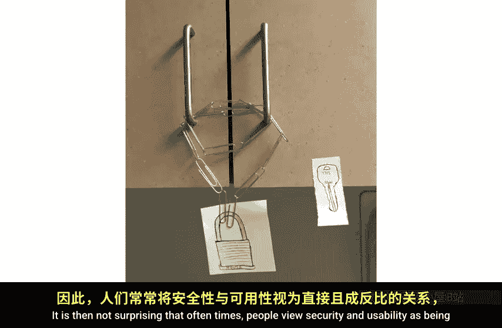
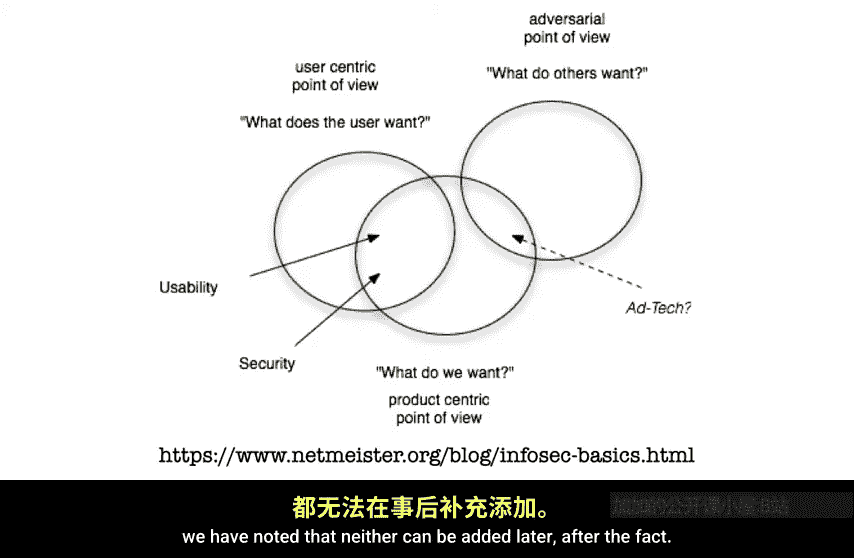
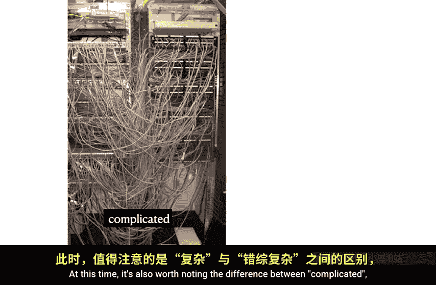
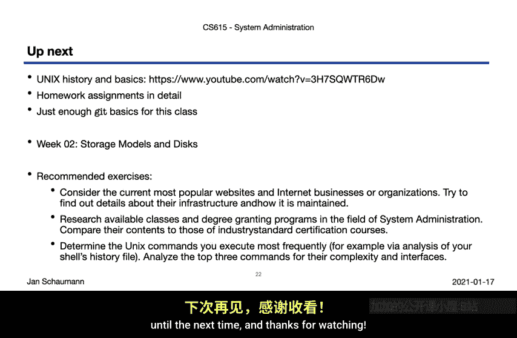

# 003：系统管理员核心原则与法则 🧠

在本节课中，我们将要学习系统管理员工作的三个核心原则：**可扩展性**、**安全性**和**简单性**。我们还将探讨一系列在系统管理和故障排查中非常有用的经验法则。

上一节我们讨论了系统管理员的角色，本节中我们来看看支撑这一角色的核心设计理念。

## 核心原则

系统管理员不仅仅是维护计算机和基础设施组件，他们控制着整个系统。随着经验和资历的增长，他们最终将负责构建这些系统，设计基础设施及其组件，因此职位头衔经常演变为系统架构师或网络架构师。

当一切运行良好时，系统管理员就承担起规划、设计和监督构建复杂系统的角色，这些系统既要满足当前的需求，也要预见组织未来的需求。我们成为了超级建造者。

但为了实现这一目标，我们需要将基础设施建立在两个基本原则之上：**可扩展性**和**安全性**。这两者都无法在系统构建完成后添加。在系统接口定义好之后再尝试应用安全性，只会带来限制和约束。试图让一个具有固有局限性的系统在其未设计的情况下运行，会产生各种“变通方案”，最终结果往往更像一个脆弱的纸牌屋，而非坚固可靠的结构。

但还有第三个核心原则是必要的，它实际上是实现前两个原则的基石：**简单性**。

简单性既是显而易见的，又是反直觉的。它构成了可扩展性和安全性的基础，因为降低复杂性意味着接口定义更清晰、通信或数据处理中的歧义最小化，以及灵活性增加。与其他两个核心方面一样，简单性也无法事后添加，它必须是架构中固有的。简单性是实现可扩展性和安全性的关键。

让我们更仔细地看看这三个核心原则。

### 可扩展性 📈

可扩展性是当今经常被提及的一个流行词，问“它能扩展吗？”是在会议中显得聪明的简单方法。但让我们思考一下可扩展性的真正含义。

假设你有一个网站，它变得非常受欢迎。比如它被发布在 Hacker News 首页或一个热门的 Reddit 板块上。你设计不佳的 Web 服务器无法应对突然增加的流量。换句话说，你的系统过载了。那么现在该怎么办？

每当遇到这样的资源问题时，只有有限的几种选择。一方面，你可以**垂直扩展**。也就是说，你购买一台更强大的服务器来处理增加的负载。垂直扩展很好，通常很容易做到，因为你不需要做太多改变。你购买一台性能强大的服务器，问题就解决了。在某种程度上，你是在用钱解决问题，如果你有钱，这是解决许多问题的好方法。当然，这也只是为你争取了时间。在某些时候，负载可能大到连这台“怪兽”服务器也无法承受。

那么你的另一个选择是**水平扩展**。当你进行水平扩展时，你增加更多相同的服务器，并尝试分配负载。水平扩展在这里似乎更好一些，因为它允许你持续承担额外的负载。你只需要不断添加服务器。

但水平扩展并不像垂直扩展那么容易。当你添加更多服务器时，你需要分配负载。因此你需要添加一个负载均衡器，而负载均衡器本身也需要进行健康检查和维护。也就是说，你增加了复杂性。天下没有免费的午餐。

当然，你也可以结合这两种方法：使用更强大的硬件，并在它们之间分配负载。通常，当人们谈论可扩展性时，指的就是这个意思。

但有一个方面经常被忽视：一旦你进行了水平或垂直扩展，或者两者兼有，你现在运行的成本就更高了。为了实现真正的可扩展性，你还需要能够**缩减规模**。如果你的流量没有保持在同一水平，那么你就是在浪费金钱。如果你只使用了一个 CPU 核心的 1%，却拥有一个满载冗余负载均衡服务器的数据中心，那是相当愚蠢的。

因此，我们对可扩展性的定义将倾向于强调可扩展系统的整体灵活性：**在运行时适应不断变化的需求的能力**。

在这个背景下，尤其是在谈论云计算时，你会经常听到一个术语：**弹性**，它或许更能描述这个特性。因此，无论是通过垂直还是水平手段，一个可扩展、灵活、有弹性的系统，就是一个能够轻松适应需求变化的系统。在整个学期中，当我们考虑需求可能激增百倍然后又消失的情况时，我们会努力记住这一点。

### 安全性 🔒

是的，顺便说一下，这是对许多情况下所谓“安全性”的最准确描述。软件信息技术行业常常将系统安全视为事后考虑，视为在满足所有其他功能需求后可以添加到最终产品上的东西。在用户界面确定之后，在所有代码编写完成之后。

因此，人们常常认为安全性和可用性是直接且成反比的关系，这并不奇怪。

然而，这表明降低风险的唯一方法是拿走有风险的功能。但每当你这样做时，用户就会绕过你的限制，或者完全停止使用你的产品。

相反，安全性需要从设计阶段就内置到系统中。也就是说，我们不应该从一个提供所需功能的解决方案开始，然后试图弄清楚如何使其达到安全状态；而应该从一个安全的、受限制的状态开始，然后在不损害安全性的前提下，慢慢添加功能，直到获得所需的能力。

也就是说，我们需要将安全性视为在设计最小可行产品时就存在的赋能因素。

本课程将经常讨论我们遇到的产品或系统中的安全故障或问题，并且很多时候，我们能够指出导致此类问题的产品设计目标之间的差异。

因此，我们将以边缘方式，几乎贯穿每周，并在学期末以总结的方式，涵盖许多与我们关心的计算机-人类系统直接相关的安全方面。这将包括广泛的密码学领域及其在保密性、完整性和真实性方面的辅助能力，物理安全、服务可用性、服务设计、社会工程学以及通常的通用信任。所有这些都应该帮助我们，从用户的角度（询问并理解用户在使用我们系统时真正想要什么）以及系统或产品中心的角度，来讨论每个领域和主题。很多时候，我们会发现这两个视角的交集，比与对抗性视角的交集更多。

### 简单性：可扩展性与安全性的基石 🧱

对于可扩展性和安全性这两个核心属性，我们已经注意到两者都无法事后添加。

回到之前的数据中心例子，你无法在这样一个混乱的系统中“添加”可扩展性。可扩展性和安全性都是你必须从一开始就包含在系统设计中的东西。

当做到这一点时，这些原则的实际应用会减少接口、端点、用例和整体差异。此时，也值得注意“复杂”和“繁杂”之间的区别。

如左图所示。一个**复杂**的系统可能组织良好，展现出清晰的逻辑结构，但需要微妙、错综复杂的连接或组件。而**繁杂**的系统则是不规则、不可预测或难以遵循的。

可扩展且安全的系统复杂性较低，并且非常、非常不繁杂。

作为系统管理员，我们喜欢 KISS。KISS 乐队非常出色，但这里指的不是他们滑稽的服装、烟火或厚底鞋。事实上，我们指的是一个核心系统原则的缩写：**KISS**。保持简单，傻瓜。也就是说，我们致力于降低复杂性。复杂性是敌人。我们将抵制构建我们不需要的功能的诱惑，转而构建可以组合的工具。

这样，我们将遵循 Unix 哲学，其中包括一个关键准则：**构建简单的工具，做好一件事**。也就是说，我们将创建像乐高积木一样可以组合的小组件。遵循相同接口并能很好配合的小工具。有了这样小而简单的构建模块。

你可以构建错综复杂、庞大且确实复杂的系统。乐高星球大战千年隼是他们最大的套装之一。它由超过 7500 个零件组成，因此肯定不简单。但我认为这很好地说明了我们追求的目标：小而简单的构建模块，可以组合起来创建复杂但结构良好的系统。

系统管理的一部分，以及软件工程、编程和各种其他相关且重叠的方面和学科，就在于设计和实现这样的复杂系统。因为我们在构建和使用构建模块时牢记简单性，这些系统将更具容错性、性能更好、更灵活。

因此，**简单性**作为卓越系统设计的第三个核心属性，确实是实现可扩展性和安全性的关键。这就是为什么我们要 KISS。

## 系统管理经验法则 ⚖️

现在，简单性的概念甚至可以超越系统设计或实现，延伸到我们解决问题的方法上。解决复杂甚至繁杂问题的一种方法是应用**奥卡姆剃刀**。

奥卡姆剃刀有许多不同的表述，但最常见的是：对于给定的问题，**最简单的解释通常是正确的**。当你试图排查复杂系统的故障时，记住这一点会很有用，复杂系统往往以复杂的方式失败，但原因通常是简单的。

需要内化的一个类似黄金法则是**热力学第二定律**，它规定封闭系统的熵随时间增加。应用到系统管理中，这告诉我们事物会趋向于更大的无序。用户越多、流量越大、系统越多，所有这些都会导致更多带有更多错误的软件连接到更多其他系统，如此循环。

长时间运行的系统最终会耗尽内存或磁盘空间，因为它们可能触发导致内存泄漏的边缘条件。硬件最终会失效。牢记这一点可以让我们预见并准备应对不可避免的情况。

我们系统管理法则系列中的下一个是**汉隆剃刀**。在某种程度上，汉隆剃刀是奥卡姆剃刀的一个变体。汉隆剃刀指出：**能解释为愚蠢的，就不要解释为恶意**。人们很容易草率下结论，担心某个国家行为体已经渗透了你的网络并植入了后门，而你不小心发现了这个改变了 `/dev/null` 权限的后门。或者，用户可能只是不小心做了这件事。哪个解释更简单，因此根据奥卡姆剃刀更有可能？汉隆剃刀值得特别提出，因为尤其是当你专注于安全时（系统管理员作为其工作的一部分必须这样做），很容易觉得到处都是恶意行为者。但值得记住的是，任何时候你防止了意外故障，你也帮助减轻了有人故意利用这种故障模式的风险。所以汉隆剃刀也能帮助你。

接下来是**帕累托原则**。该原则指出，在大多数情况下，大约 **80% 的结果来自 20% 的原因**，最初应用于经济学。但事实证明它几乎普遍适用。我相信你已经注意到，当你编写程序时，通用功能、所有主要部分都很容易，你很快就能完成大约 80% 的程序，然后将大部分时间花在最后 20% 上，调试棘手的问题并微调功能。所以，你 80% 的时间花在了 20% 的功能上，反之亦然。这个经验法则在估算软件开发时间、估算客户将如何使用可用磁盘空间、网络过滤器将捕获或阻止什么流量等方面，出人意料地有用。80/20 法则甚至可以递归应用，你可以再次估算需要在关键的少数上花费多少资源，以及在不可避免的长尾上花费多少。

然后是“垃圾”。等等，什么？那甚至不是鲤鱼，那是鲟鱼。好吧，**斯特金定律**。这是一条以科幻作家西奥多·斯特金命名的格言，他 famously 说过“**90% 的一切都是垃圾**”。他是在有人指出 90% 的科幻文学都是垃圾后说这句话的，但他观察到“那只是因为 90% 的一切都是垃圾”。也就是说，大多数东西都不出色。系统管理员很快就会痛苦地发现，无论是开源软件还是商业供应商提供的软件，这条定律都异常准确。它实际上并不像听起来那么虚无，而是一个有用的提醒，帮助你设定期望。

同样，我们都相当熟悉**墨菲定律**，对吧？**会出错的事总会出错**，或者更准确地说，可能发生的事情就会发生。和斯特金定律一样，它并不完全是悲观的，但最好记住，尤其是在涉及软件时。在那个领域，当我们在互联网规模上谈论软件系统时，我们更不能以“发生这种情况的几率有多大？”或“谁会在这个字段里输入那个？”为借口而不做准备。如果它可能发生，它就**会**发生。硬盘驱动器会故障。用户会在字段中输入无效数字。连接会中断。你双重冗余的电源最终会同时失效。我们的工作就是为这些可能性做好准备，预见可能发生的情况，并构建在这些情况下仍能运行的健壮系统。

最后，当我们谈论可能发生的事情，然后逻辑上不可能发生的事情不会发生时，我们最终进入了哲学领域，以帮助我们排查系统故障：**因果律**。对于每一个结果，都必须有一个原因。事情不会无缘无故发生。系统不会无缘无故崩溃。你的软件爆炸、负载均衡器将流量从健康的源服务器移开、你的数据库当前被锁定、你的流量再次激增，这些都有原因。有时这些结果的原因很难找到，但它们就在那里。

我刚才提到的各种规则和定律，希望能帮助你排除不合理的解释，并引导你找到真正的原因。所需要的只是坚持不懈和致力于找到问题的根源。

## 课程安排与建议 📚

好了，这些只是每个系统管理员最喜欢的一些法则中的一部分。你会发现我们将在整个学期中引用它们，我敢打赌，几年后在你的工作中遇到某些情况时，你也会想起它们。当然，还有许多类似的法律和观察，我们无疑会在每周的课程中穿插一些。但今天，我想我们已经讲得够多了。

那么，让我们看看接下来会发生什么。本周介绍的最后一个主题是 **Unix 的历史**，因为我们将在本课程中专门使用 Unix 系统，并且由于系统管理在许多方面与 Unix 系统及其发展和演变紧密相连，了解这个操作系统的历史非常重要。为此，你应该观看我上学期为我的另一门课程“CS 631: Unix 环境下的高级编程”录制的视频片段（链接在此）。该视频涵盖了 Unix 历史的所有关键方面，并解释了一些核心功能。虽然面向程序员，但 Unix 系统管理员也能从中受益并转化这些经验。在整个学期中，你会看到我们回到这个视频的某些方面，所以请不要认为这是可选部分，而是系列中的必修视频。

之后，我将解释各种作业以及我们如何设置在本课程中使用 Git。但这基本上就是第一周的内容了。恭喜你。

下周，我们将讨论存储模型和磁盘。因此，请务必阅读课程网站上发布的阅读材料，并在第二次互动课之前提交课程问卷。测验网站还包括每节课的一些不计分的练习，我强烈建议你在准备下一次视频讲座时完成这些练习。

此外，这里有一些方法可以让你复习本周涵盖的主题：

以下是你可以尝试的练习：

1.  **了解公司基础设施**：尝试了解某些公司如何管理其基础设施。你应该会发现许多公司都有公开博客，他们在上面发布大量关于他们使用的基础设施或软件产品的信息。这可能非常有趣，并让你很好地了解他们可能面临的可扩展性挑战。
2.  **研究相关学位课程**：尝试查找有哪些学校授予系统管理学位，以及他们的课程设置是什么样的。将其与我们将在本课程中涵盖的内容进行关联。
3.  **审视现有工具**：当我们准备在 Unix 环境中进行一些实际工作时，也许可以看看你目前如何使用系统。你最常使用哪些工具？在分析它们的复杂性和接口时，它们表现如何？

我想所有这些应该能让你忙上一阵子了。请记住，你能从这门课中获得什么取决于你自己。你投入更多精力去完成这些练习（即使它们不计分），你希望学到的就越多。

## 总结

本节课中我们一起学习了系统管理的三个核心原则：**可扩展性**、**安全性**和**简单性**。我们了解到，可扩展性和安全性无法事后添加，必须从设计之初就考虑，而**简单性**是实现这两者的基石。我们还探讨了一系列实用的经验法则，如奥卡姆剃刀、汉隆剃刀、帕累托原则等，这些法则将在未来的系统管理和故障排查中为我们提供指导。最后，我们明确了接下来的学习安排，包括了解 Unix 历史的重要性以及为下周课程所做的准备。