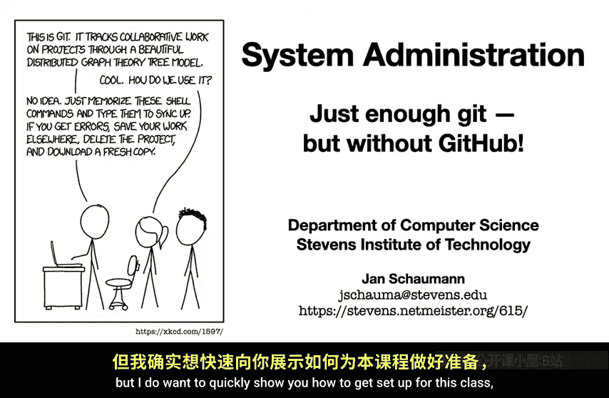
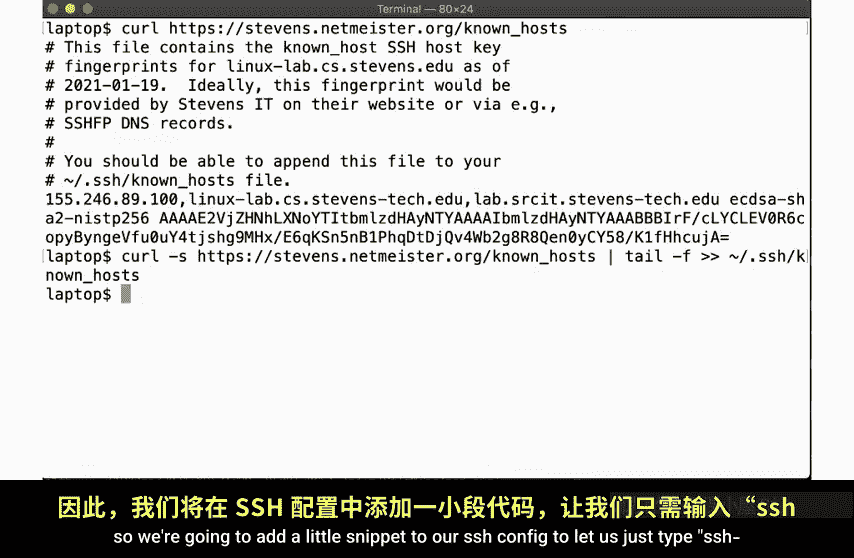
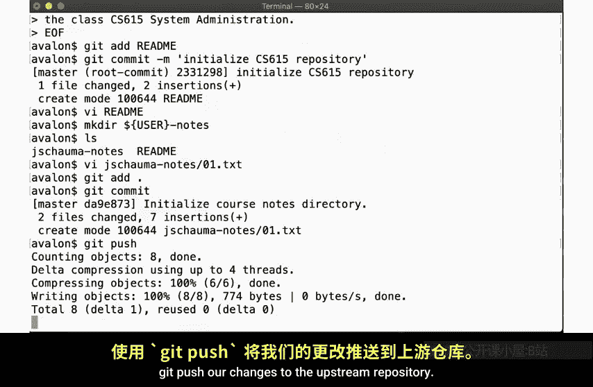
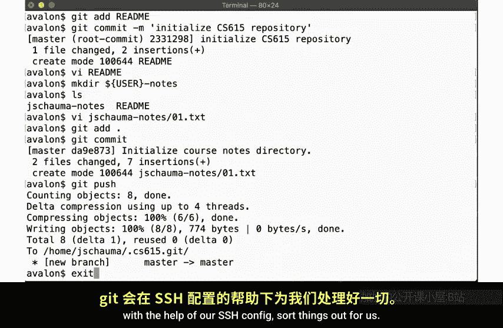
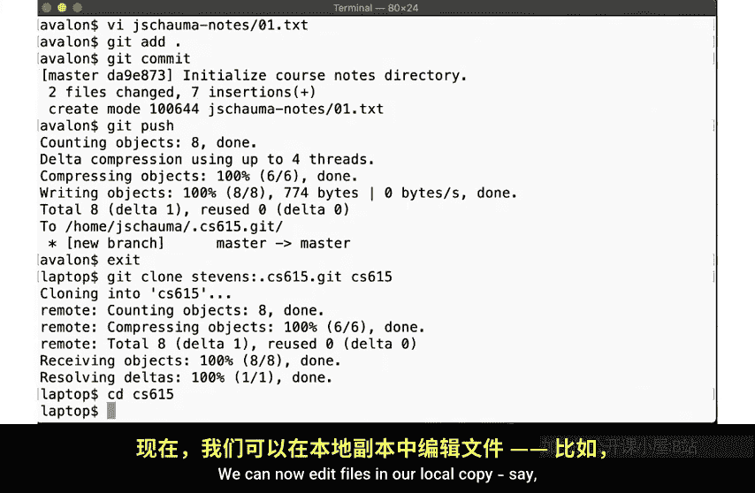
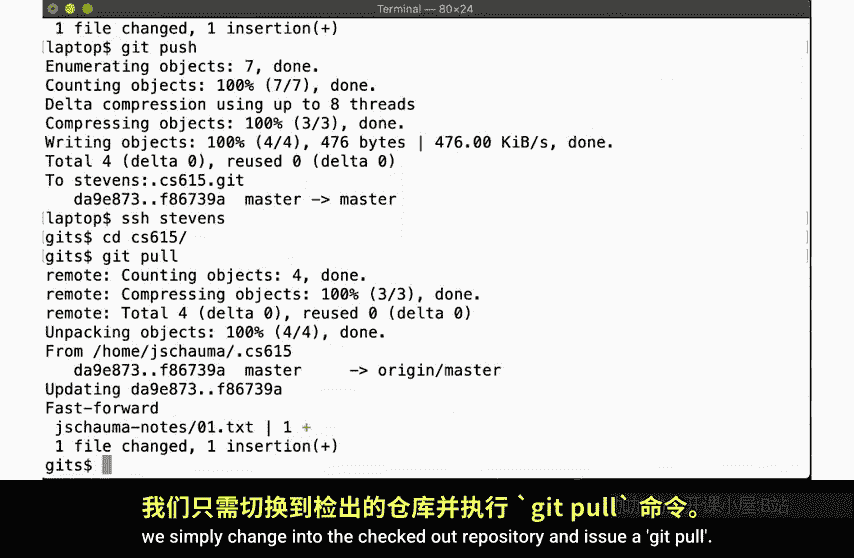
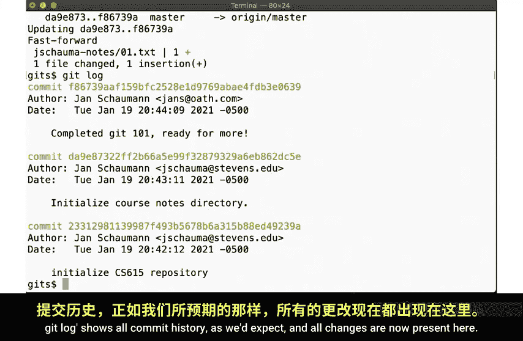
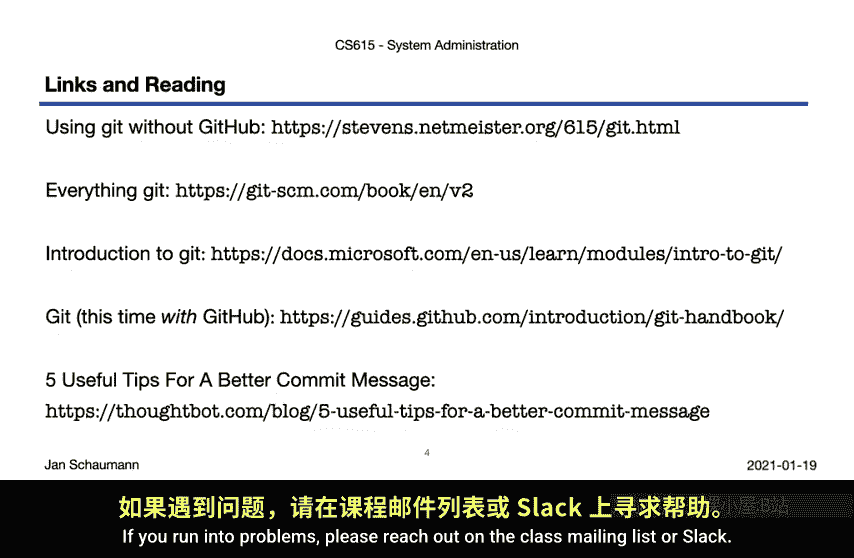

# 005：Git基础配置与使用（无需GitHub）💻

在本节课中，我们将学习如何为CS 615系统管理课程配置和使用Git版本控制系统。我们将从设置SSH连接到Linux实验室开始，然后初始化一个本地的Git仓库，并演示如何在本地和远程系统之间同步代码。整个过程将不依赖GitHub。

---

## 概述

Git是一个分布式版本控制系统。GitHub是微软旗下提供Git托管服务的公司。虽然GitHub非常流行，但Git的核心功能本身足以支持我们的课程需求。本节将指导你完成基础配置，确保你能顺利开始使用Git进行作业和项目管理。

---

## SSH配置

首先，我们需要配置SSH以安全、便捷地连接到史蒂文斯理工学院的Linux实验室系统。

### 配置已知主机指纹

首次连接到一个主机时，系统会询问你是否确认主机密钥的真实性。为了安全地连接，我们需要预先将实验室主机的SSH指纹添加到本地的`known_hosts`文件中。

实验室主机名指向一个负载均衡器，但我们现在只需要一行配置。你可以从课程网站获取正确的主机密钥指纹，并使用以下命令将其添加：

```bash
echo "linuxlab.cs.stevens.edu ssh-rsa <此处应放置实际的密钥指纹>" >> ~/.ssh/known_hosts
```



### 创建SSH配置文件

为了简化连接命令，我们可以在`~/.ssh/config`文件中创建一个快捷方式。这样，你只需输入`ssh stevens`即可连接。

以下是配置示例：

```bash
Host stevens
    HostName linuxlab.cs.stevens.edu
    User your_stevens_username
    IdentityFile ~/.ssh/your_private_key
    StrictHostKeyChecking yes
```

*   **Host**: 你定义的快捷名称。
*   **HostName**: 实际的主机地址。
*   **User**: 你在Linux实验室的用户名。
*   **IdentityFile**: 用于认证的私钥路径。
*   **StrictHostKeyChecking**: 启用严格检查，因为我们已配置正确的指纹。

配置完成后，你可以使用`ssh stevens`命令登录远程系统。

---

## Git基础配置

成功连接到Linux实验室后，我们可以在远程系统上配置Git。

### 设置用户信息

首先，设置你的姓名和邮箱地址，这些信息会记录在你的提交中。

```bash
git config --global user.email "your_email@example.com"
git config --global user.name "Your Name"
```

### 初始化裸仓库

我们将创建一个“裸仓库”（bare repository）作为中央存储库。裸仓库不包含工作目录，只包含Git的版本历史数据。

1.  创建一个新目录作为裸仓库：

    ```bash
    mkdir ~/coursework.git
    ```



2.  进入该目录并初始化为裸仓库：

    ```bash
    cd ~/coursework.git
    git init --bare
    ```

初始化后，请退出这个目录。这个`coursework.git`文件夹将作为你的远程仓库。

### 克隆仓库并开始工作

现在，我们从刚创建的裸仓库克隆一份到你的工作目录。

```bash
cd ~
git clone ~/coursework.git coursework
```

这会创建一个名为`coursework`的目录，里面包含一个连接到裸仓库的工作副本。

---

## 基本的Git工作流程

上一节我们创建了工作副本，本节中我们来看看如何使用Git进行基本的版本控制操作。

以下是使用Git添加文件、提交更改和推送的基本步骤：

1.  **创建或编辑文件**： 在工作目录中，创建一个`README.md`文件并添加内容。

    ```bash
    echo “本仓库包含CS 615系统管理课程的所有作业和笔记。” > README.md
    ```

2.  **添加文件到暂存区**： 使用`git add`命令将文件纳入Git的管理。

    ```bash
    git add README.md
    ```

3.  **提交更改**： 使用`git commit`命令将暂存区的更改永久记录到本地仓库。

    ```bash
    git commit -m “添加初始README文件”
    ```

4.  **推送更改到上游仓库**： 将本地提交推送到我们之前创建的裸仓库（上游）。

    ```bash
    git push origin main
    ```

你可以重复这个过程来管理所有课程文件和笔记。

---

## 从本地计算机同步

配置好远程仓库后，你也可以从自己的笔记本电脑上访问和同步代码。



### 从本地克隆远程仓库

在你的笔记本电脑上，使用配置好的SSH快捷方式克隆Linux实验室上的裸仓库。

```bash
git clone stevens:~/coursework.git local-coursework
```

这个命令会在你的本地创建一个`local-coursework`目录，它是远程仓库的完整副本。



### 在本地工作并推送

现在你可以在本地进行修改：



1.  编辑文件，例如`week1/notes.md`。
2.  提交更改：`git commit -am “更新第一周笔记”`
3.  将更改推送到Linux实验室的远程仓库：`git push origin main`

### 在远程拉取更新



当你回到Linux实验室的终端时，可以进入工作目录并拉取最新的更改。



```bash
cd ~/coursework
git pull origin main
```

使用`git log`命令可以查看完整的提交历史，确认所有更改都已同步。

---

## 总结

本节课中，我们一起学习了如何在不依赖GitHub的情况下，为系统管理课程设置和使用Git。我们从配置SSH连接开始，初始化了一个本地的裸Git仓库，并实践了完整的Git工作流程，包括在远程服务器和本地电脑之间同步代码。请确保按照此流程设置，并开始使用Git来管理你的课程笔记和作业。如果在设置过程中遇到问题，请在课程邮件列表或Slack频道中寻求帮助。



祝你学习顺利，我们下次见！🚀