# 006：熟悉EC2 🚀

在本节课中，我们将总结第一项作业，目标是帮助你完成AWS EC2的使用准备。你将学习如何设置环境、启动并访问EC2实例，同时运行一些为第二周课程（关于存储模型和文件系统）做准备的命令。

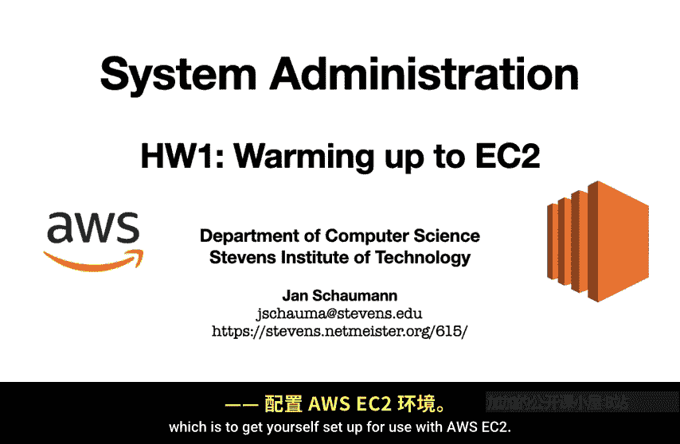

## 概述

本作业的主要目标是让你在首选环境中完成设置，以便能够顺利使用AWS工具，特别是能够毫无问题地启动和访问EC2实例。其次，你需要运行一些命令，为第二周讨论存储模型和文件系统的课程内容做准备。

我们将通过使用命令行工具来完成这些任务，正如在介绍视频中提到的。

## 环境设置建议

虽然你可以在自己的笔记本电脑、共享VPS或任何你选择的地方设置AWS命令行工具，但我强烈建议你使用史蒂文斯理工学院提供的She服务，即另一个名为Linux Lab的实验室。

在我们关于Git使用的视频中，已经介绍了如何方便地通过SSH访问这些系统。这些系统已经安装了AWS命令行工具，因此从那里开始会容易得多。

## 理解命令与输出

作业要求你运行一系列命令，你可能会遵循在线教程或搜索“如何开始使用AWS”时弹出的第一个Stack Overflow答案。重要的是，你需要真正理解你所运行的每一个命令。同样，理解所有命令的输出也至关重要。

因此，作业还要求你在提交的报告中提供额外的注释，并描述你遇到的任何问题。

完整的作业链接可以在课程网站上找到。

## 启动EC2实例演示

当你完成设置后，应该能够像我即将演示的那样启动EC2实例。

首先，通过SSH连接到Linux Lab。在AWS命令行工具正确设置后，你的配置文件应该类似于这样：

```
[default]
aws_access_key_id = YOUR_ACCESS_KEY
aws_secret_access_key = YOUR_SECRET_KEY
region = us-east-1
```

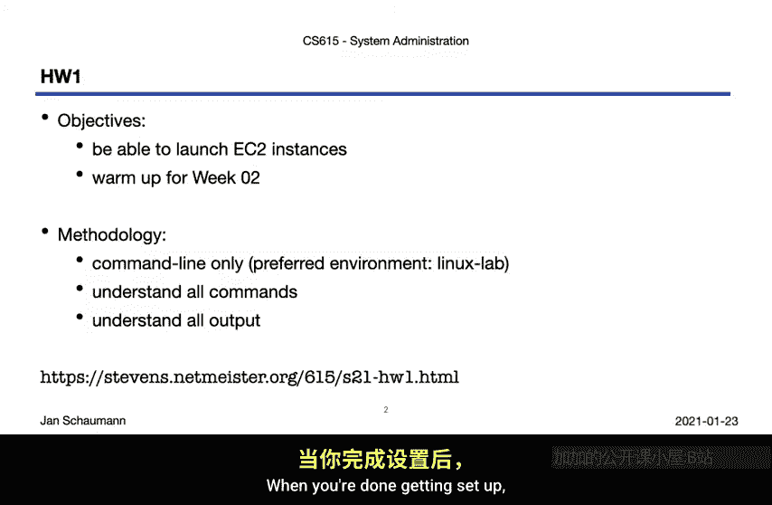

请确保妥善保护你的配置文件，因为它包含私有的访问密钥。同时，请不要向我发送你的私有AWS凭证，它们应该保持私有。

接下来，根据作业要求，我们将使用 `aws ec2 run-instances` 命令来启动一个新的NePSSD实例。根据你的AWS设置，你可能需要指定安全组或子网，尽管在许多情况下，默认的安全组和子网是可以使用的。

我的账户比较旧，它仍然默认为非VPC环境，这意味着我需要为许多AMI创建非默认的安全组和子网，但请不要因此感到困惑。如果你可以在不指定这些的情况下启动实例，那也没问题。同样，你可能有一个默认的SSH密钥对，使用它完全可以。

我根据启动实例的位置使用不同的密钥，这就是为什么你看到我在这里指定了一个非默认的密钥。

你可以选择你喜欢的实例类型，但需要确保为相关的操作系统选择正确的架构。

因此，你可能会在这里运行一个更简单的AWS命令。但无论如何，最终你将启动一个实例，并得到一堆JSON输出，如下所示。

## 处理JSON输出

JSON输出非常有用，因为你可以将其通过管道传递给 `jq` 工具来提取各个字段。

在这种情况下，我们将手动获取实例ID。因为我们很懒，不想一遍又一遍地输入它，所以我们将把它赋值给一个环境变量。

```
INSTANCE_ID=$(aws ec2 run-instances ... | jq -r '.Instances[0].InstanceId')
```

然后，我们可以通过使用 `aws ec2 describe-instances` 命令并将其通过管道传递给 `jq` 来检查新创建实例的主机名。

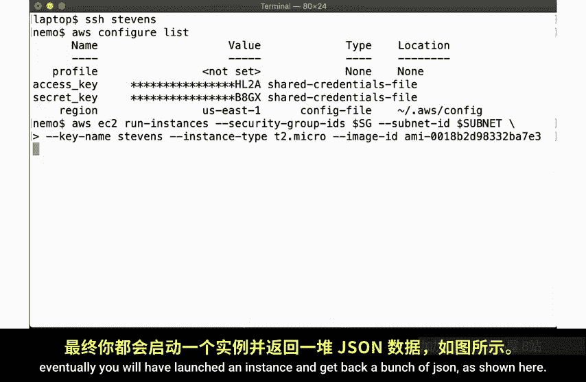

```
PUBLIC_DNS=$(aws ec2 describe-instances --instance-ids $INSTANCE_ID | jq -r '.Reservations[0].Instances[0].PublicDnsName')
```

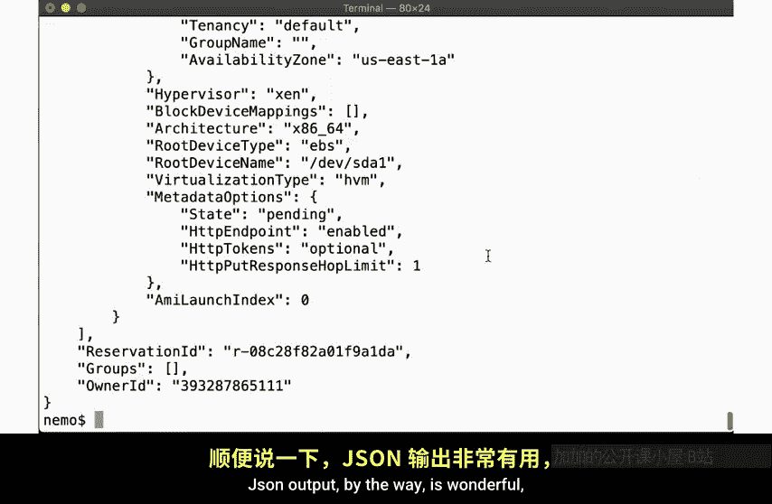

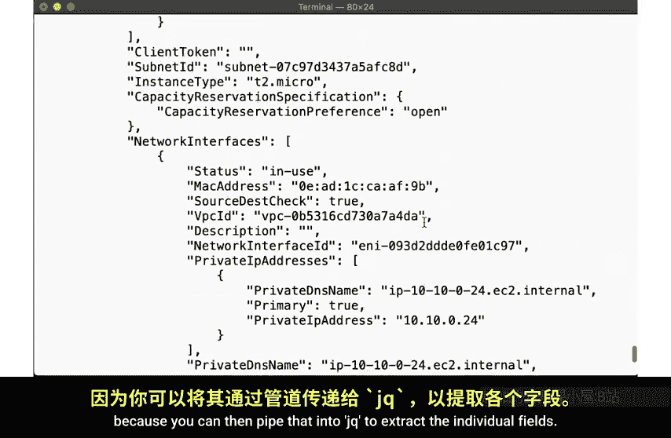

好了，我们得到了主机名。让我们看看实例是否已经启动并运行。使用 `ping` 命令检查。

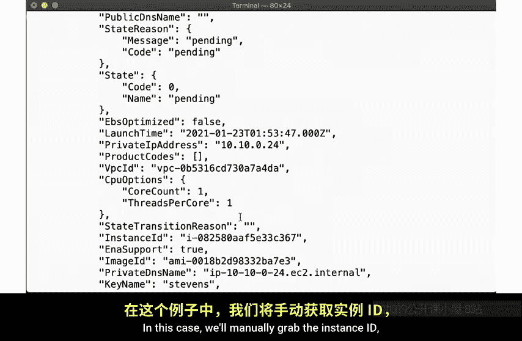

```
ping -c 4 $PUBLIC_DNS
```

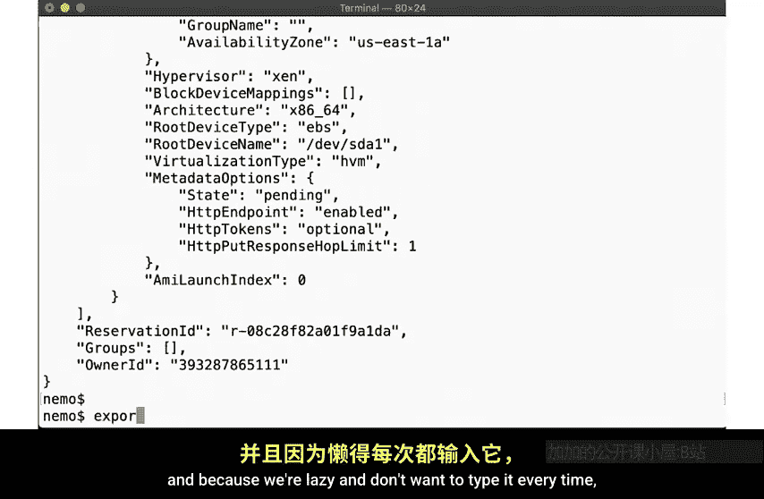

不，看起来还没有。让我们检查一下状态。使用 `aws ec2 describe-instance-status` 命令。

```
aws ec2 describe-instance-status --instance-ids $INSTANCE_ID
```

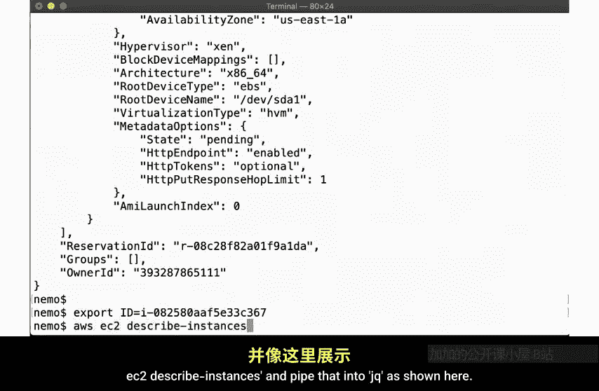

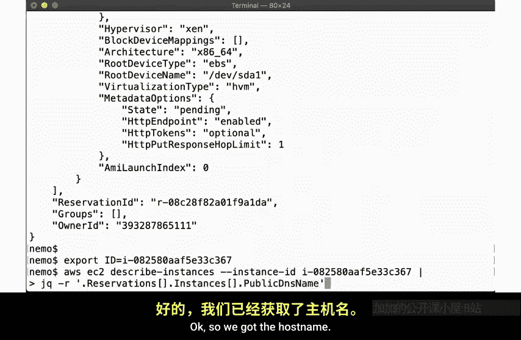

看，`jq` 不是很棒吗？如果你不熟悉它，你一定要查看并练习使用它，它会很有帮助。无论如何，实例显示正在运行。让我们再ping一次。嗯，仍然不工作。

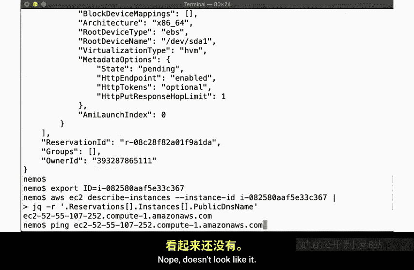

这是EC2有点烦人的事情之一。你启动了一个实例，但你不知道它什么时候准备好。我们将在批改作业时看到一些确定它何时可用的方法。但也许你可以寻找一些其他可能有帮助的AWS命令。

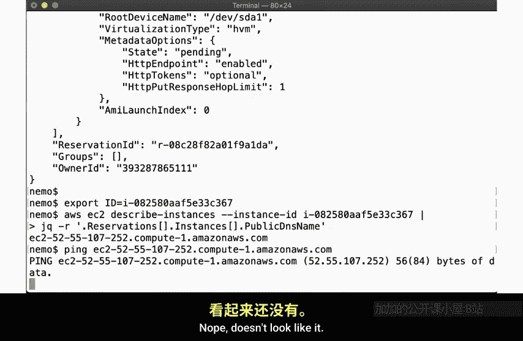

无论如何，让我们回去再检查一下我的ping。等待一段时间后，它似乎终于有响应了。所以实例现在应该已经启动并运行了。让我们登录。

我们指定要使用的正确SSH密钥以及root用户。

```
ssh -i /path/to/your-key.pem root@$PUBLIC_DNS
```

看，我们登录到了我们的NePSD实例。我们可以确认这是一个AM D60实例。我们可以通过 `dmesg` 命令查看启动消息，它显示了内核在启动时如何初始化虚拟硬件。

现在，在这里你通常会运行作业要求你运行的各种其他命令。但现在，我们只是退出。

## 终止实例

接下来，由于AWS资源需要花钱，我们要确保记得在使用完毕后终止实例。

因此，我们只需运行 `aws ec2 terminate-instances` 命令。

```
aws ec2 terminate-instances --instance-ids $INSTANCE_ID
```

就是这样。

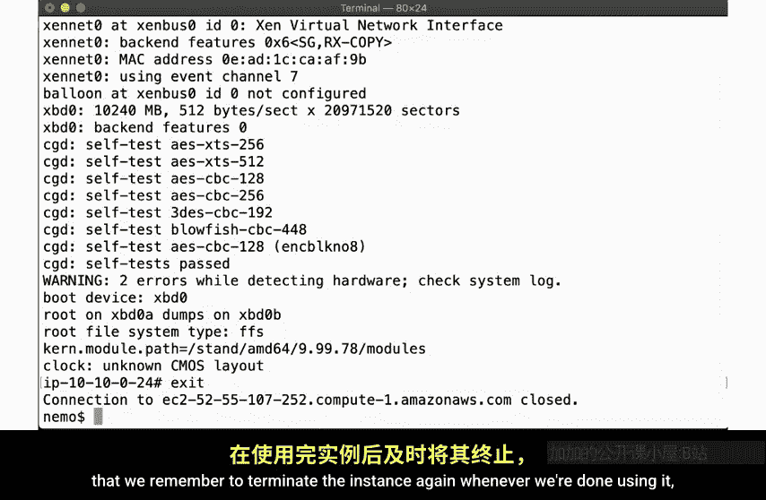

## 作业完成状态与求助

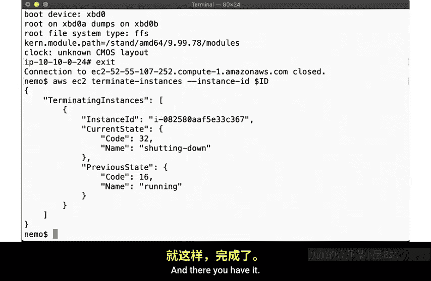

当你完成作业一时，你应该能够像我在这里展示的那样启动、访问和终止实例。如果你遇到问题，请确保将你的问题发送到班级邮件列表或在Slack上提问。

同时，请务必写下你可能遇到的任何问题，并回答这里提出的所有问题。这里显示的链接可能帮助你完成设置。

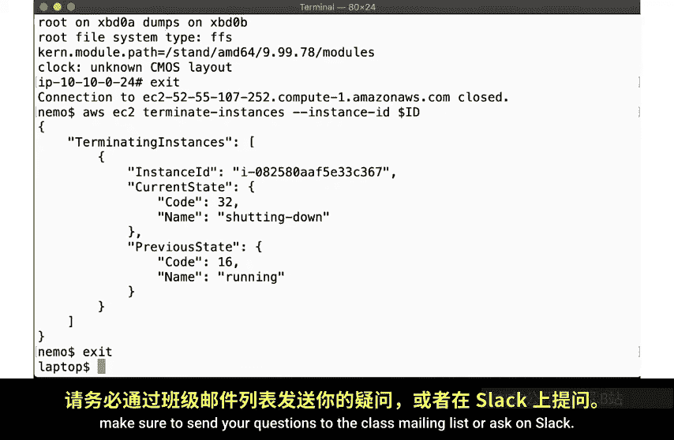

## 总结

本节课中，我们一起学习了如何为CS615课程的第一项作业做准备，重点是熟悉AWS EC2。我们了解了作业的目标、环境设置的建议、理解命令的重要性，并跟随演示学习了启动、连接和终止EC2实例的完整流程。记住，实践是掌握这些工具的关键，如果在过程中遇到困难，积极利用课程提供的沟通渠道寻求帮助。

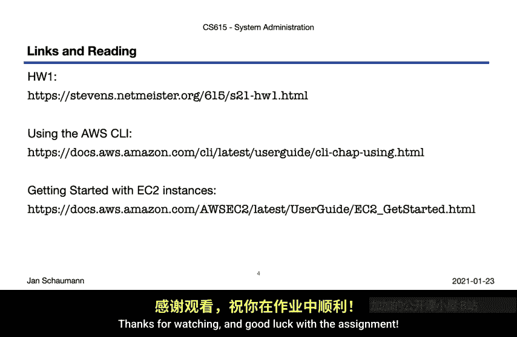

祝你作业顺利！