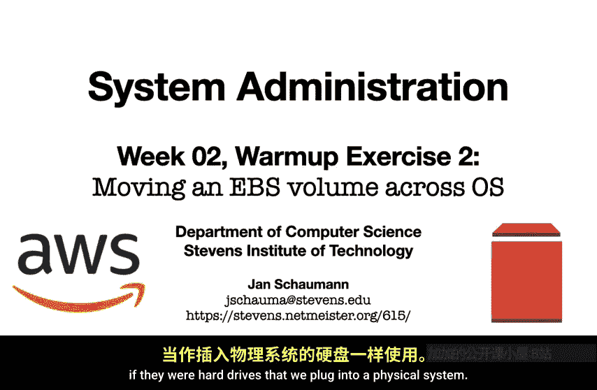
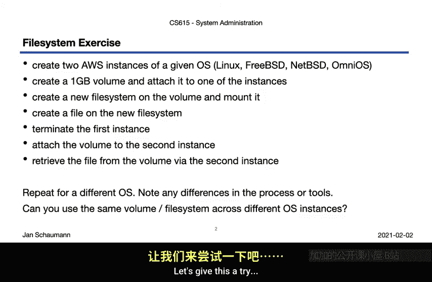
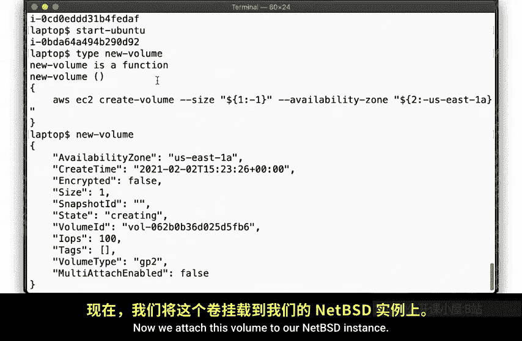
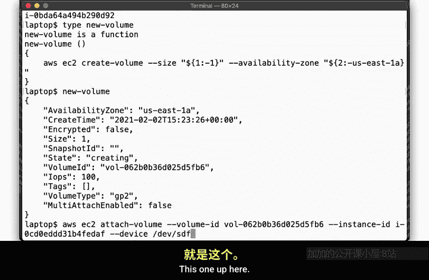
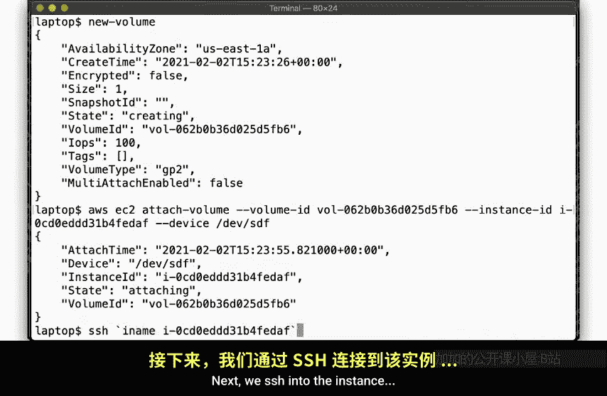
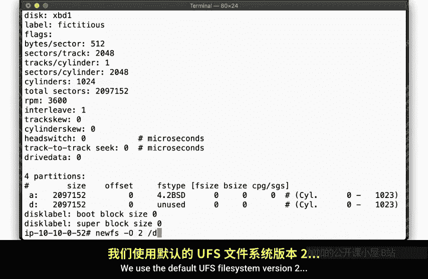
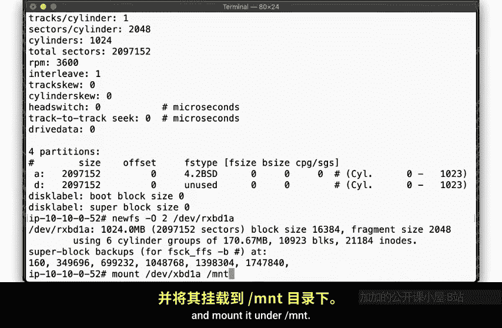
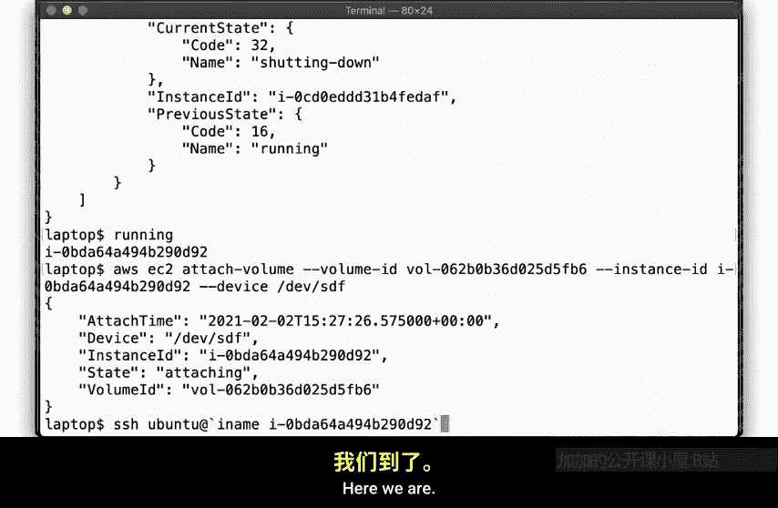
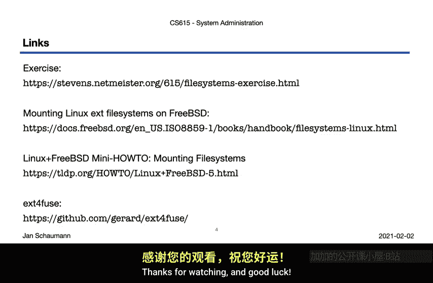

# 009：第2周热身练习2 - 跨操作系统迁移EBS卷 🚀

在本节课中，我们将学习如何将亚马逊弹性块存储卷从一个EC2实例迁移到另一个运行不同操作系统的实例。这个练习旨在帮助你熟悉云存储的概念，并理解EBS卷如何像物理硬盘一样在不同系统间移动和使用。

上一节我们介绍了EBS卷的基本概念，本节中我们来看看具体的操作步骤。

## 概述与目标 🎯

本练习的核心目标是演示EBS卷的独立性和可移植性。我们将创建两个运行不同操作系统的EC2实例，在一个实例上初始化EBS卷并写入数据，然后将其分离并挂载到另一个实例上，最终验证数据是否成功迁移。



## 操作步骤详解

以下是完成此练习的主要步骤。

### 1. 创建实例与卷

首先，我们需要创建两个EC2实例。在基础练习中，你可以创建两个相同操作系统的实例。但为了深入理解，本教程将使用两个不同的操作系统：一个NetBSD实例和一个Ubuntu实例。

同时，我们创建一个新的EBS卷。可以使用以下简化的shell函数来创建卷，它接受两个可选参数：卷大小（GB）和可用区。如果未指定，则默认为1GB，位于`us-east-1a`。

```bash
new_volume() {
    local size=${1:-1}
    local zone=${2:-us-east-1a}
    # AWS CLI命令创建卷
    aws ec2 create-volume --size $size --availability-zone $zone --volume-type gp2
}
```

### 2. 在第一个实例上初始化卷

创建卷后，将其附加到NetBSD实例。通过SSH连接到该实例，使用`dmesg`命令查看新添加的磁盘（例如`/dev/xbd1`）。

使用`disklabel`工具查看分区表，通常新磁盘默认是一个覆盖整个磁盘的单一分区。接着，在该磁盘上创建一个文件系统。我们使用默认的UFS文件系统（版本2）。

```bash
# 在NetBSD实例上执行
newfs /dev/xbd1a
```



创建文件系统后，将其挂载到一个目录下，例如`/mnt`。

```bash
mount /dev/xbd1a /mnt
```

然后，在文件系统中创建一个测试文件，以验证操作。

```bash
echo “Hello from NetBSD” > /mnt/testfile.txt
```





操作完成后，卸载磁盘并退出SSH连接。



### 3. 迁移卷到第二个实例

现在，从NetBSD实例分离该EBS卷，并终止该实例。请注意，实例根文件系统上的所有数据都会丢失，但EBS卷上的数据得以保留。

接下来，将同一个EBS卷附加到之前创建的Ubuntu实例。通过SSH连接到Ubuntu实例。





### 4. 在第二个实例上访问卷

在Ubuntu实例上，使用`lsblk`命令查看可用磁盘，找到新附加的卷（例如`/dev/xvdf`）。

由于该磁盘包含的是UFS文件系统（而非Linux常用的ext4），在挂载时需要指定文件系统类型。需要注意的是，Linux内核通常**仅支持以只读模式挂载UFS文件系统**。



```bash
# 在Ubuntu实例上执行
sudo mount -t ufs -o ufstype=ufs2,ro /dev/xvdf /mnt
```

挂载成功后，检查`/mnt`目录，应该能看到之前在NetBSD实例上创建的`testfile.txt`文件。

```bash
cat /mnt/testfile.txt
```

## 核心要点与扩展练习 💡

通过以上步骤，我们成功地将一个EBS卷从NetBSD实例迁移到了Ubuntu实例，并访问了其中的文件。这证明了EBS卷作为独立、持久化存储设备的特性。

为了巩固理解，建议你进行以下扩展练习：
*   尝试使用其他操作系统组合，例如在Amazon Linux上创建文件系统，然后挂载到FreeBSD上。
*   探索不同文件系统（如ext4, XFS）在跨操作系统挂载时的兼容性和要求。
*   查阅相关文档，理解`mount`命令中不同文件系统类型对应的选项。

如果在练习过程中遇到问题，可以随时在课程邮件列表或Slack频道中提问。

## 总结



本节课中我们一起学习了EBS卷跨操作系统迁移的完整流程。我们实践了创建卷、附加卷、创建文件系统、写入数据、分离卷以及在不同OS实例上重新挂载并读取数据的全过程。关键在于理解EBS卷独立于EC2实例的生命周期，以及不同操作系统对文件系统的支持差异（如Linux对UFS的只读支持）。掌握这些技能对于管理云基础设施至关重要。