# 012：存储虚拟化 🗂️

在本节课中，我们将要学习存储虚拟化的核心概念。我们将探讨如何将多个独立的物理磁盘设备组合成更大、更高效、更可靠的逻辑存储单元，并介绍实现这一目标的两种主要方法：基于硬件的RAID和基于主机的逻辑卷管理。

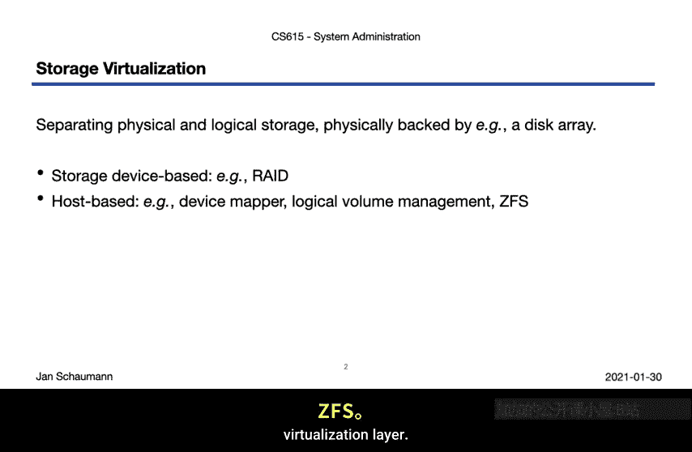

在上一节视频中，我们讨论了不同的磁盘设备及其连接方式。过程中，我们简要提到了几种将独立磁盘组合成更大存储池的配置方案。

本节中，我们将在此基础上，更详细地探讨存储虚拟化这一概念。

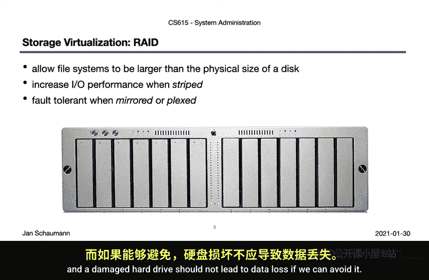

当我们听到“虚拟化”这个词时，通常会联想到虚拟机或AWS等云服务。但在基础层面上，存储虚拟化本质上就是将物理存储介质与逻辑存储单元分离开来。这意味着我们可以用多个硬盘填满一个大机箱，然后根据需要将其分割成虚拟磁盘。这种方式在某种程度上与将单个硬盘划分为独立分区的做法相反，我们将在下一节视频中详细讨论分区概念。

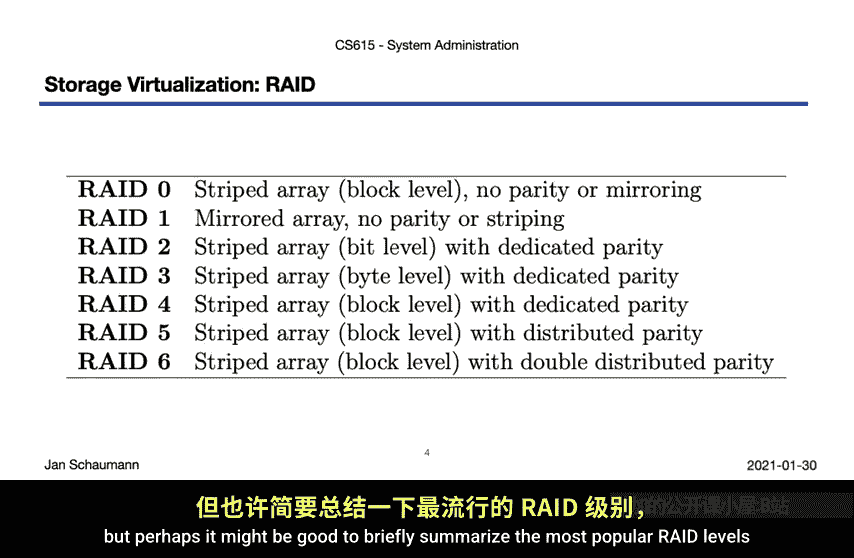

这里，我们将快速了解两种不同的存储虚拟化方法：一种是基于硬件的方案，例如RAID设备；另一种是基于主机的方案，即操作系统通过逻辑卷管理来组合物理存储设备。我们还将看到逻辑卷管理的两个实际例子：现代Linux系统中常用的设备映射器，以及包含了存储虚拟化层的ZFS文件系统。

## 基于硬件的RAID 🖥️

让我们从RAID开始。正如上一节视频提到的，下图展示的是一台现已过时的硬件设备——Apple X RAID设备。我们继续使用这个示例图片，因为它能直观地展示RAID的工作原理。

RAID设备，全称“独立磁盘冗余阵列”或最初所称的“廉价磁盘冗余阵列”，为多个独立硬盘提供机箱、管理固件，并通过例如SCSI等方式连接到您的存储区域网络。但仅仅把硬盘塞进机箱是不够的，这也正是RAID与上节提到的JBOD方式的区别所在。RAID不仅是一堆磁盘，它允许你将所有磁盘组合成一个单一的虚拟磁盘，从而创建一个跨越所有磁盘的大型文件系统。

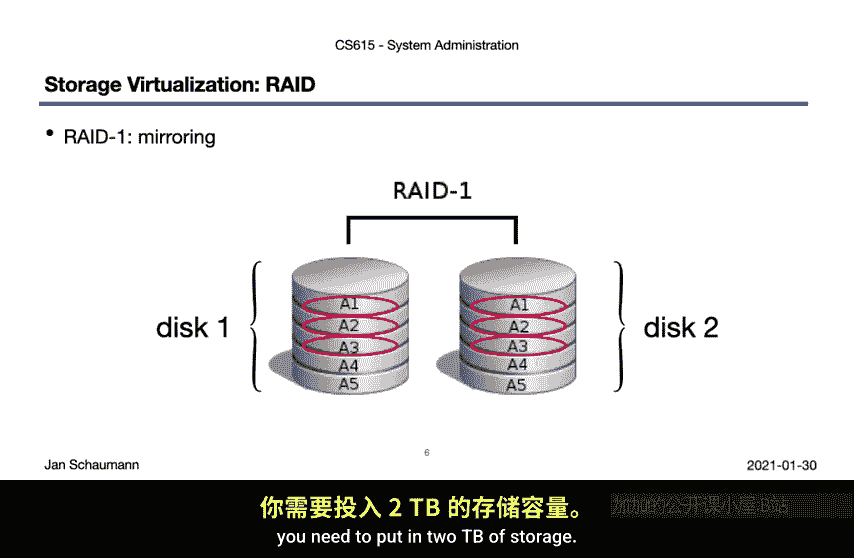

RAID设备提供的另一个优势是通过在所有驱动器间条带化数据来提高I/O效率，从而最小化硬盘寻道时间。第三，RAID提供了一定程度的数据冗余，它不是在所有驱动器上写入数据，而是在驱动器子集之间镜像数据，从而提供容错能力。这一点很重要，因为我们知道所有设备最终都会故障，如果可能的话，损坏的硬盘不应导致数据丢失。

## RAID级别详解 🔢

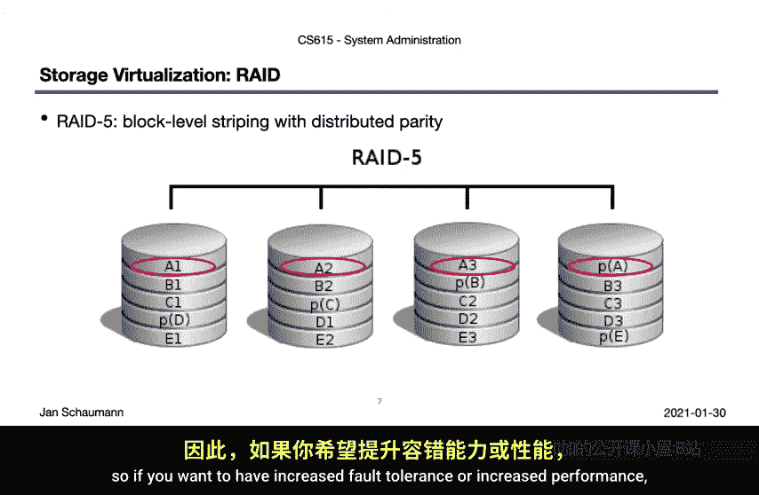

我们看到有几种方式可以组合和利用RAID阵列中的磁盘，我们使用以下数字级别来描述不同的方法。级别0到6代表了最常见的解决方案，你可以看到数据写入方式的区别，有时我们在物理块级别考虑I/O性能，有时在字节或位级别。别担心，我们将在下一节视频中详细讨论“块”在此上下文中的确切含义。但或许最好先简要总结一下最流行的RAID级别，以说明它们提供的优势。

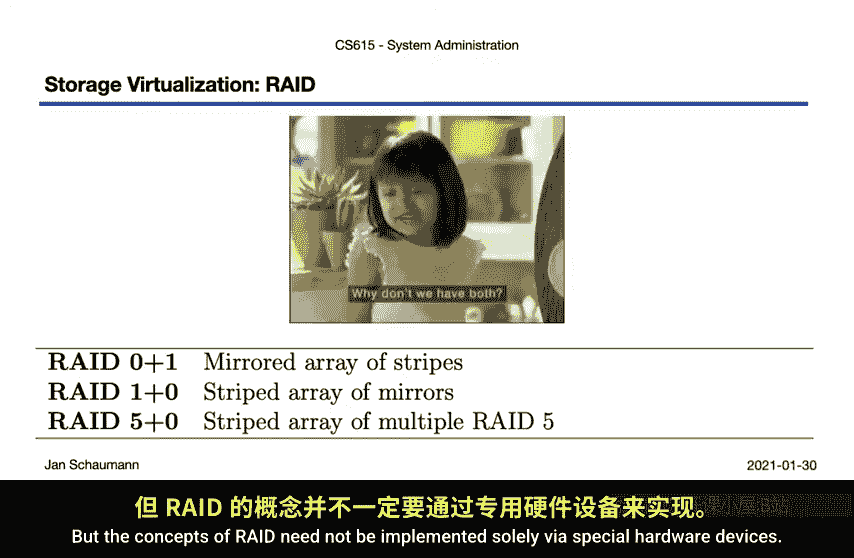

以下是几种常见的RAID配置方式：

*   **RAID 0**：最简单的多磁盘使用方式是将它们并排放置，然后将数据分布写入两个驱动器。当文件系统发出写操作时，RAID设备会在块级别将其分割，将第一个块写入磁盘1，第二个块写入磁盘2，第三个块再次写入磁盘1，依此类推。这样，I/O性能得到提升，因为读写数据的速度可以翻倍。然而，如果这两个磁盘中的任何一个发生故障，你就会丢失一半的数据，并且很可能无法重建丢失的数据。因此，RAID 0提供了I/O性能优势，但没有容错能力。
*   **RAID 1**：如果你想确保在磁盘故障时不丢失数据，可以使用RAID 1配置。在这种情况下，RAID会复制文件系统要求写入磁盘的每一个数据块，并写入两个副本，每个磁盘一份。这样，如果你丢失了一个磁盘，没有问题，你仍然在另一个磁盘上拥有所有数据。RAID会提醒你现在处于降级模式，你弹出损坏的磁盘，换上一个闪亮的新磁盘，当你插入新磁盘时，RAID会自动将所有数据从完好的磁盘复制到新磁盘上，你就能在不中断服务的情况下恢复运行。这非常棒。当然，在这种配置下，你放弃了I/O性能提升的好处，并且实际上只获得了投入系统磁盘空间的一半。
*   **RAID 5**：你可以选择RAID 5级别，它结合了I/O性能和容错能力。它通过在多块磁盘上条带化数据来实现这一点，每次写入都分布到不同的磁盘上，但同时还会写入奇偶校验位。这些奇偶校验位允许你在磁盘故障时重建数据。此外，RAID 5将奇偶校验位分布到所有磁盘上，这样你可以在任何时候丢失任何一块磁盘而不会丢失任何数据。当然，你需要至少三块磁盘，并且随着磁盘的增加，你获得的磁盘空间不是线性增长的，因为有一部分空间预留给了奇偶校验信息。但总的来说，这是在保持容错能力的同时提高性能的一种流行且高效的解决方案。

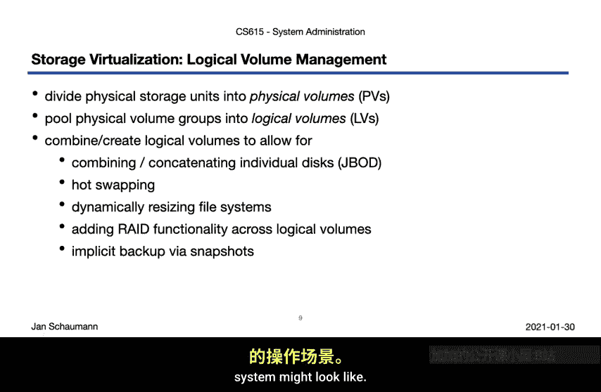

当然，你可以看到这其中的可能性，你可以以不同的方式组合这些方法。如果你想要更高的容错能力或更高的性能，你不必再局限于单一选择。也就是说，你可以组合不同的RAID级别来获得镜像的条带阵列、条带化的镜像阵列等等。

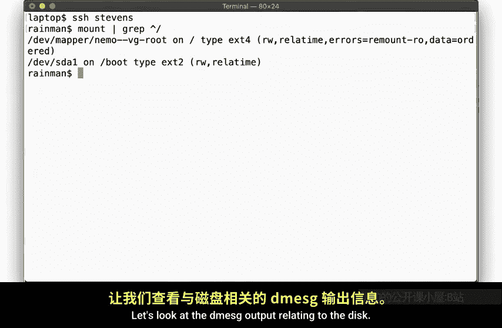

固件和控制器处理所有这些卷管理和热交换操作，这就是为什么系统可以在运行时进行所谓的“热插拔”。看到设备重建阵列并保存数据时的闪烁指示灯，会让任何系统管理员感到高兴。这样一个独立磁盘冗余阵列非常有用。

## 基于主机的逻辑卷管理 💾

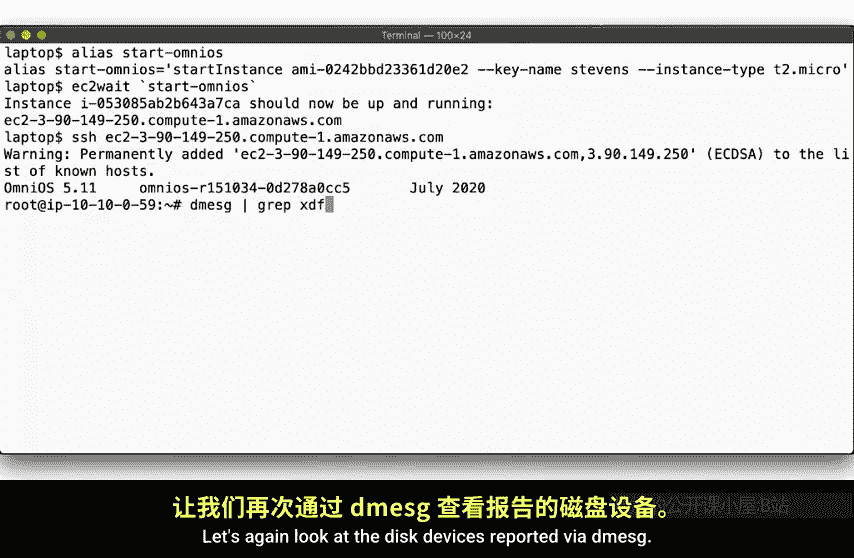

但RAID的概念不一定非要通过特殊的硬件设备来实现。一般来说，任何类型的存储虚拟化都可以使用软件来执行，这意味着内核暴露硬件，然后允许底层软件来管理它。这通常被称为逻辑卷管理。笼统地说，这可以分解为对物理存储单元的管理，例如硬盘或通过光纤通道连接的存储设备。这些单元被划分为物理卷，然后可以组合形成所谓的卷组。这些卷组可以跨越多个物理设备，提供一个抽象层，逻辑卷管理器可以在此基础上进一步组合或创建逻辑卷。这样，你就可以以类似JBOD的方式组合独立磁盘来创建更大的卷；通过允许在不中断服务的情况下更换故障磁盘来实现冗余和容错；允许在添加新磁盘时立即自动调整文件系统大小以扩展空间；提供我们已经讨论过的相同RAID功能；或者自动执行文件系统的定期快照，从而提供便捷的实时备份机制。我们将在本学期晚些时候更详细地讨论文件系统快照和备份。

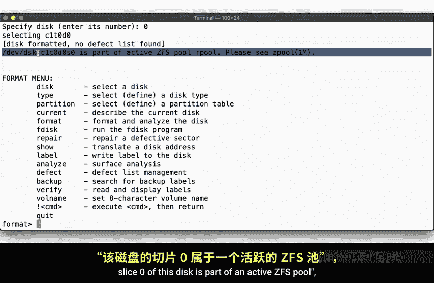

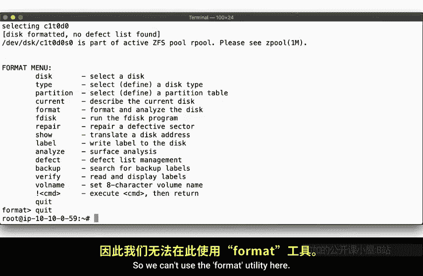

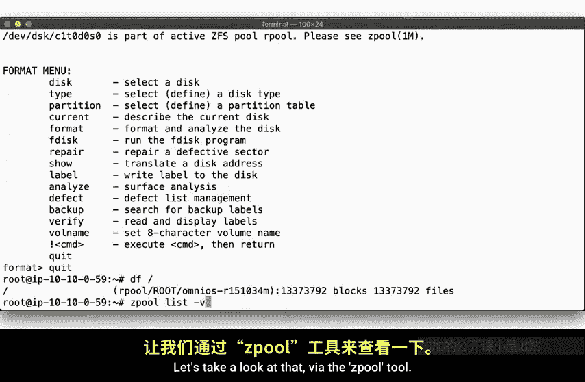

现在，让我们简要演示一下在典型的Linux系统中使用逻辑卷管理器可能是什么样子。

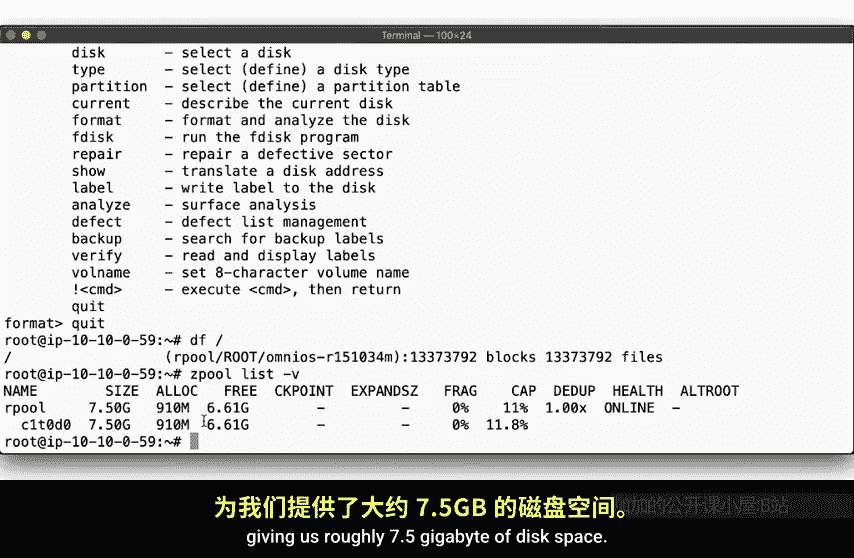

为此，我们登录到Linux实验室。我们观察到挂载了两个磁盘：`/dev/sda1`挂载在`/boot`下，以及一个映射设备作为根文件系统。因此，根文件系统并不位于常规磁盘分区上，而是似乎通过设备映射器进行管理，这是Linux中逻辑卷管理器的基础。让我们查看与磁盘相关的`dmesg`输出。在这里我们看到`/dev/sda`似乎是一个SCSI磁盘，包含几个分区。`lsblk`命令向我们展示了关于这个块设备的更多信息。我们有一个20GB的磁盘，第一个分区挂载在`/boot`下。第二个分区`/dev/sda2`是一个扩展分区，因此它只包含`/dev/sda5`的元信息，而`/dev/sda5`本身又被划分为两个子分区，都由LVM管理：一个用于根目录`/`，一个用于交换空间。`swapon`命令确认系统中可用的交换空间是由另一个设备映射器设备`/dev/dm-1`提供的。我们将在下一节视频中更详细地研究分区的概念，但如图所示，我们可以看到即使对于一个只有单个磁盘的非常简单的系统，也可以使用LVM。

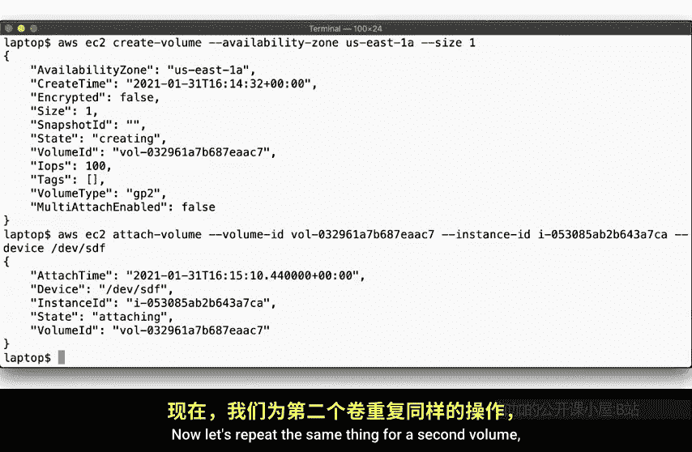

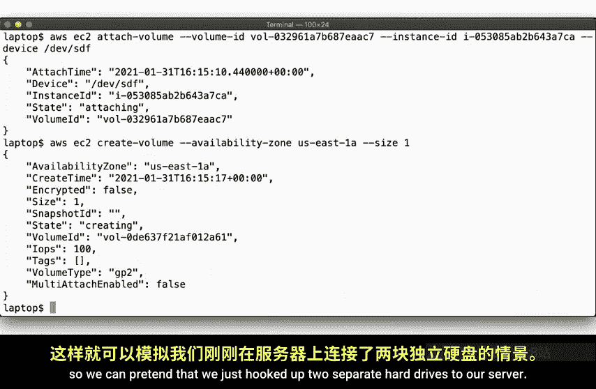

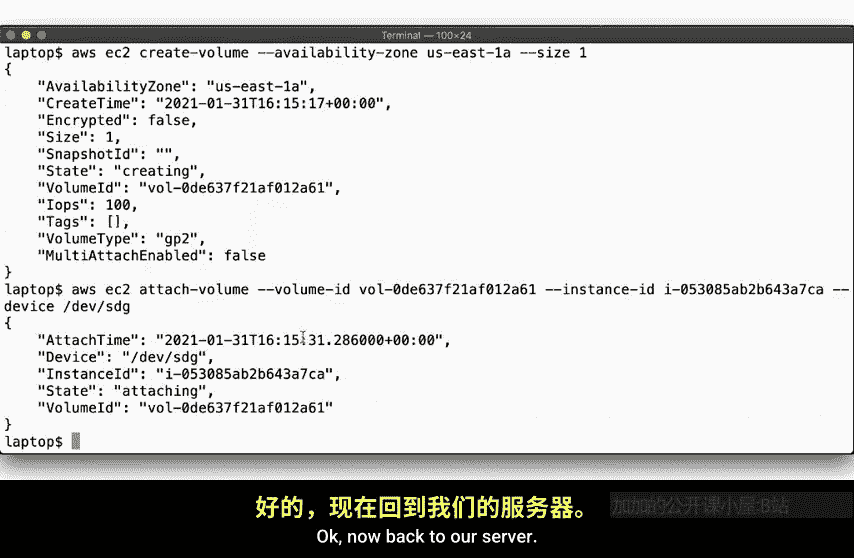

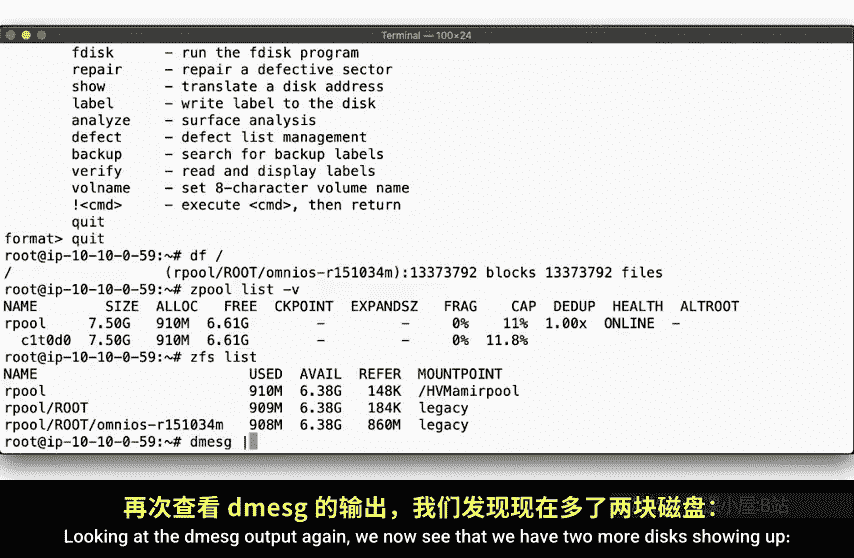

## ZFS存储管理示例 🌲

我想在这里演示的另一件事是使用ZFS来管理存储资源。ZFS是一个源自Sun（现在是Oracle）Solaris操作系统的文件系统。它是一个相当不同的系统，因为它包含了逻辑卷和存储池管理的所有组件，我们将会看到。让我们开始一个新的屏幕会话，并启动一个OmniOS实例。OmniOS是Illumos的一个版本，这是一个开源的Unix系统。它基于OpenSolaris，因此是运行Solaris变体的最简单方式。这里的这个AMI镜像让我们可以开始。在我们的自定义EC2等待函数中，当系统启动并运行时，它会通知我们。好的，让我们登录。我们进来了。让我们再次查看`dmesg`报告的磁盘设备。这里的磁盘叫做`xdf`。让我们尝试使用`format`实用程序来查看这个磁盘的分区表。我们找到一个磁盘，使用历史SCSI寻址方案标识为`c1t0d0`，其各个分区（在Solaris术语中称为“切片”）在此前缀之后被引用。当我们选择这个磁盘时，我们得到一个警告信息：这个磁盘的`slice0`是一个活跃的ZFS池的一部分。因此，我们不能在这里使用`format`实用程序。`df`命令确认我们的根文件系统似乎位于`rpool` ZFS池上。让我们通过`zpool`工具查看一下。在这里我们看到，`rpool`确实由那个磁盘`c1t0d0`支持，为我们提供了大约7.5GB的磁盘空间。`zfs list`命令向我们展示了在此池上创建的文件系统，其方式类似于Linux系统上的扩展分区包含根文件系统。

现在，假设我们正在向服务器添加一个新的物理磁盘，并打算从这些磁盘创建第二个存储池。为此，我们在一个单独的屏幕会话中运行AWS EC2创建卷命令。我创建了一个1GB的卷。然后我们将该卷附加到实例。我们的实例ID是什么来着？让我们用我们的一个别名检查一下正在运行的实例。好了，我们抓取这个实例ID并继续。现在，为第二个卷重复同样的操作，这样我们就可以假装刚刚将两个独立的硬盘连接到我们的服务器。好的，回到我们的服务器。再次查看`dmesg`输出，我们现在看到出现了两个新磁盘。`xdf0`仍然是根文件系统，但现在我们还有`xdf1`和`xdf2`。请注意，当我们使用AWS EC2附加卷命令时，我们指定了一个不同的设备名称，这有点令人困惑和恼人，因为我们选择的设备名称可能不是实例上操作系统使用的名称，但只能如此。还要注意，我们不必重启实例，我们可以简单地将新硬盘“热插拔”到运行中的系统中，这就是我们的磁盘。这很酷。不管怎样，让我们看看`disk info`告诉我们什么。它们在这里：我们的根磁盘，8GB大小，以及两个新磁盘，`c1t5d0`和`c1t6d0`。现在让我们用这两个磁盘创建一个新池，称之为`extra`。`zpool list`显示我们的新`extra`池结合了这两个磁盘的空间，产生大约1.9GB。所以总是涉及一点开销，我们没有得到完整的2GB空间，但我们看到了如何将存储组合到单个池中。`zfs list`显示我们的文件系统。但我们甚至还没有在`extra`池上创建一个文件系统。所以让我们快速创建一个。`zfs create extra/space`。现在告诉系统在哪里挂载这个新文件系统。好了，新的磁盘空间现在在`/mount`下可用。我们现在可以像预期的那样向这个文件系统写入数据。好的，到目前为止一切顺利。

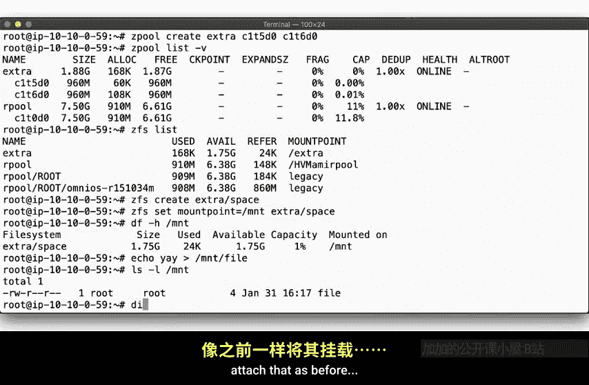

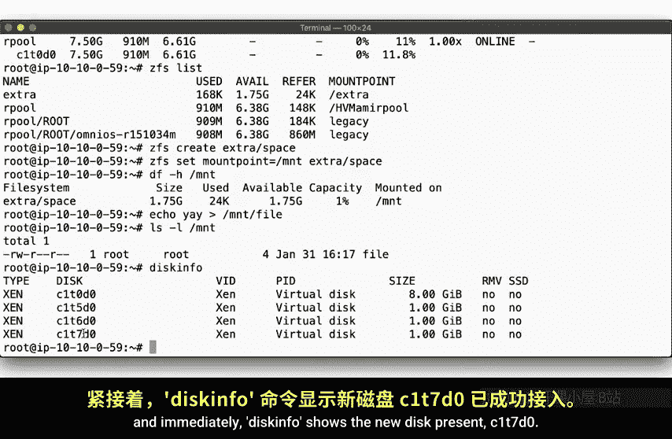

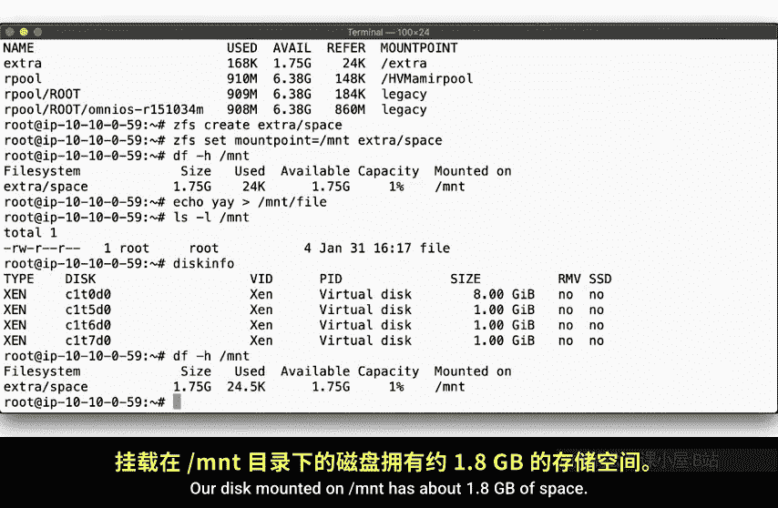

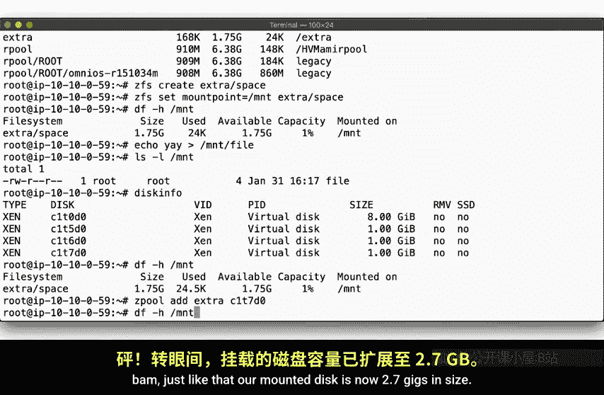

但现在假设我们又弄到了一块磁盘驱动器，想把它添加到池中。所以我们创建另一个卷。像之前一样附加它。立刻，`disk info`显示新磁盘存在，`c1t7d0`。我们挂在`/mount`上的磁盘大约有1.8GB空间。我们将新附加的磁盘添加到现有的ZFS池中。然后，砰的一下，我们挂载的磁盘现在大小变成了2.7GB。这真的很酷，对吧？我们不必关闭系统来连接磁盘，也不必对磁盘进行分区或重新创建文件系统或做任何事情。只需将磁盘添加到支持文件系统的池中，我们就获得了额外的空间。这让你对ZFS的灵活性和强大功能有了印象，也说明了存储虚拟化的概念，即以非常灵活的方式使用存储单元来组合和创建文件系统。

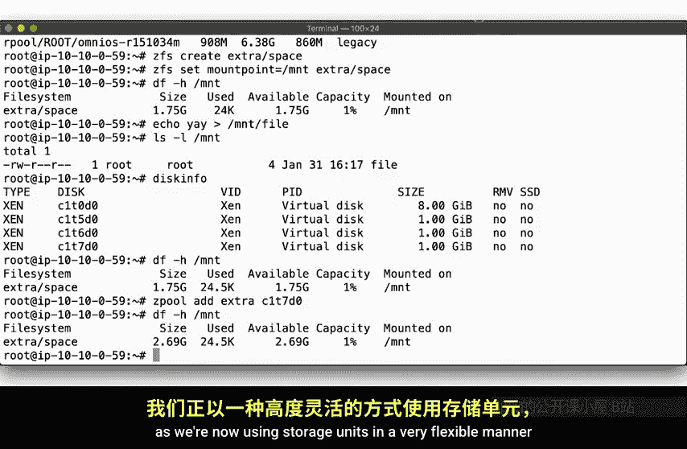

## 练习与总结 📝

好了，又到了休息时间。我想确保你跟上了这些例子，所以这里是我推荐给你的另一组练习。创建一个OmniOS实例，并使用ZFS创建不同类型的池。ZFS支持我们讨论的所有概念，你可以用它通过条带化数据来提高性能，通过镜像数据来增加容错能力，或者通过称为RAID-Z的方式组合这些功能。创建这样一个池并挂载文件系统后，通过分离EBS卷来模拟硬盘故障。系统如何处理这种情况？接下来，思考如果我们添加一个磁盘，系统会如何行为。添加磁盘会增加空间，所以扩展文件系统似乎是一件足够容易的事情。但如果你要移除一个磁盘呢？你能以这种方式缩小文件系统吗？只要文件系统上的数据仍然适合新的池，这似乎是可能的，但如果不是这样呢？正如你所见，这里有很多东西可以尝试，我希望你能以这种方式探索本节视频中的概念。如果遇到问题或有疑问，请随时寻求帮助。好的，今天就到这里。下次我们将讨论传统硬盘的物理结构，并继续我们今天已经略有提及的不同分区的讨论。到时见，感谢观看，再见。

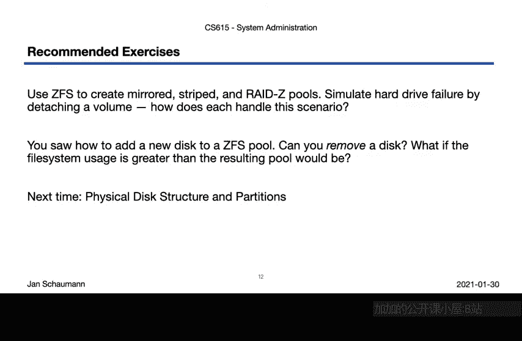

本节课中，我们一起学习了存储虚拟化的核心思想。我们了解了如何通过硬件RAID和软件逻辑卷管理将物理磁盘抽象为逻辑存储单元，从而获得性能提升、容量扩展和数据冗余等好处。我们还通过Linux LVM和ZFS的实际操作，直观感受了存储池的动态管理能力。理解这些概念是构建可靠、高效存储系统的基础。