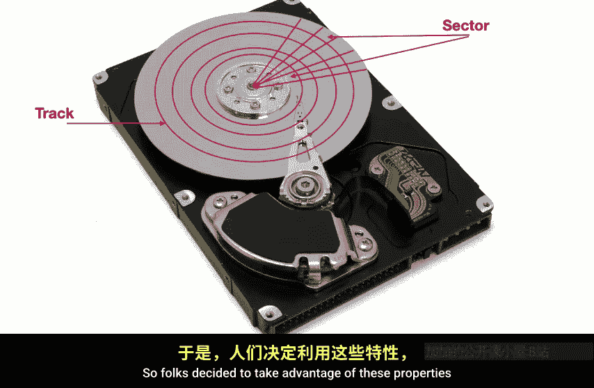
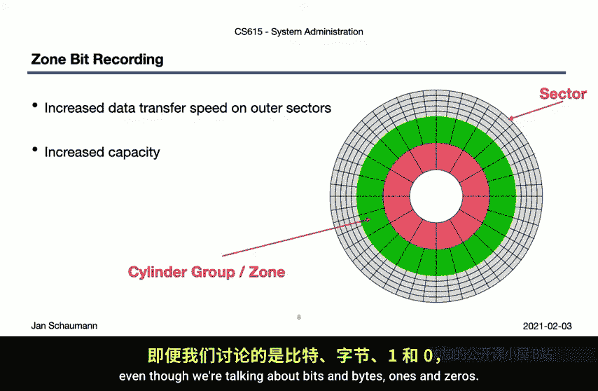
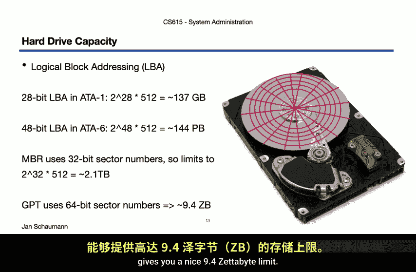
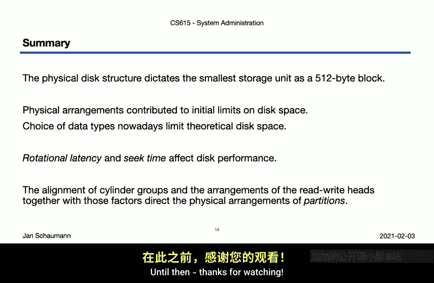

# 013：物理磁盘结构 💽

在本节课中，我们将学习硬盘驱动器（HDD）的物理结构。了解这些基础知识，不仅能让我们欣赏其精妙的工程设计，将抽象的数据存储概念与具体的机械设备联系起来，还能帮助我们更好地理解分区和文件系统等更广泛的概念。

## 硬盘的基本组成

上一节我们介绍了存储的基本模型。本节中，我们来看看最常见的存储单元——直接连接存储（DAS）模型中的硬盘驱动器（HDD）。尽管固态硬盘（SSD）具有诸多优势且日益普及，但为了说明问题，我们仍以传统的IDE硬盘为例，因为许多我们关心的考量因素，恰恰源于这类硬盘的物理特性。

以下是硬盘内部的主要组件：

*   **盘片**：一个或多个高速旋转的磁性盘片。高性能硬盘的转速可超过每分钟7000转，甚至达到15000转。
*   **读写磁头**：位于**磁头臂**末端，用于检测和改变盘片上微小区域的磁化方向，从而读写数据（0和1）。
*   **磁头臂**：带动所有读写磁头在盘片上方径向移动。所有磁头作为一个整体同步移动。

## 磁盘的逻辑结构

了解了物理组件后，我们来看看数据在盘片上是如何组织的。盘片被逻辑地划分为多个层次结构。

以下是磁盘的逻辑划分层次：

1.  **磁道**：盘片上以主轴为中心的一系列同心圆环。
2.  **柱面**：所有盘片上相同半径的磁道在垂直方向上构成的圆柱面。多个同心柱面组成**柱面组**。
3.  **扇区**：磁道被进一步划分成更小的弧段，这是硬盘上**最小的可寻址单元**。传统上，每个扇区存储 **`512`** 字节，构成标准的**磁盘块**。

这个 **`512`** 字节的块大小是一个硬件限制。尽管现在已有物理块大小为 **`4096`** 字节的硬盘，但大量计算机硬件和软件仍假定块大小为512字节，这意味着这些硬盘通常需要模拟一个比实际更小的块大小。

## 性能影响因素与区域位记录

由于物理限制，硬盘无法一次性读取少于512字节的数据。此外，其性能还受到几个关键物理因素的限制。

以下是影响传统硬盘性能的主要因素：

*   **寻道时间**：磁头臂将读写磁头移动到指定磁道所需的时间。为了最小化寻道时间，我们希望将相关数据存储在**同一柱面内的连续块**中。
*   **旋转延迟**：盘片旋转，使目标扇区移动到磁头下方所需的时间。平均而言，旋转延迟是盘片旋转半周所需的时间。
*   **数据传输率**：数据从盘片读取的速率，这取决于连续读取的数据块数量。

观察磁盘结构时，你可能注意到：外圈磁道的扇区物理尺寸比内圈磁道的扇区大。如果每个扇区都固定存储512字节，外圈空间就被浪费了。同时，在恒定角速度下，外圈扇区的线速度更快。

因此，人们利用这些特性，发展出了**区域位记录**技术。在这种技术下，磁盘被分成多个区域，外圈区域放置更多的扇区。在恒定角速度下，这提高了外圈的数据传输速度（因为单位时间经过的扇区更多），并总体上增加了存储容量（因为有了更多的扇区，即更多的512字节物理块）。

## 容量限制与寻址方案

除了性能，硬盘的**容量**也是一个关键限制。容量本质上取决于磁盘上能存储多少个独立的块。我们需要一种方法来寻址每一个块。

早期采用的一种方法是**柱面-磁头-扇区**寻址方案。其逻辑限制来自：
*   柱面（或磁道）数量
*   磁头数量
*   每磁道的扇区数量

早期的ATA规范、BIOS系统各有不同的限制值，导致实际可寻址的最大容量被限制在很低的水平（例如528MB）。随着时间推移，人们通过使用不同的数据类型来存储CHS参数提高了限制，但整个方案最终被**逻辑块寻址**所取代。LBA简单地按顺序索引每个块。

然而，LBA仍然存在限制，因为存储块总数需要数据类型。例如，ATA1使用28位LBA，最大支持约137GB；ATA6升级到48位LBA，支持约144PB。

容量限制不仅关乎硬盘本身，启动过程涉及的组件也必须能处理磁盘。例如，主引导记录分区表使用32位数据类型寻址，最大支持约2.1TB。幸运的是，**GUID分区表**使用64位数据类型，将限制提升到了约9.4ZB。

## 总结与下节预告

本节课我们一起学习了硬盘驱动器的物理结构。关键要点如下：

*   存在一个由驱动器决定的**物理块大小**，最常见的是 **`512`** 字节，这将影响文件系统性能。
*   硬盘容量曾受**物理因素**（如CHS寻址）限制，即使转向逻辑块寻址，仍受所选**数据类型的位数**限制。这提醒我们资源总是有限的。
*   **物理因素**（寻道时间、旋转延迟）直接影响传统硬盘性能，在选择存储方案时需加考虑。
*   旋转磁性盘片的物理属性安排，影响了我们如何对磁盘进行**分区**，即使存储空间可能是虚拟的（如LVM卷）或跨多个物理驱动器抽象的（如RAID），系统底层仍会模拟此类物理驱动器的行为。

下一节，我们将基于对物理结构的理解，深入探讨**磁盘分区**的概念。