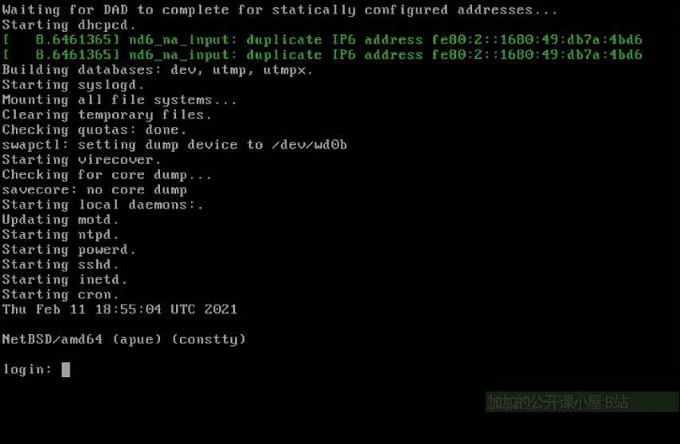
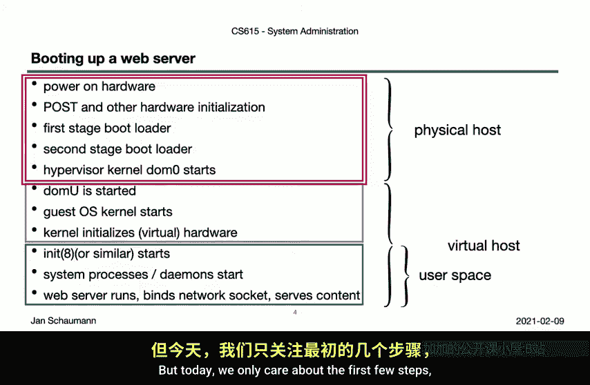
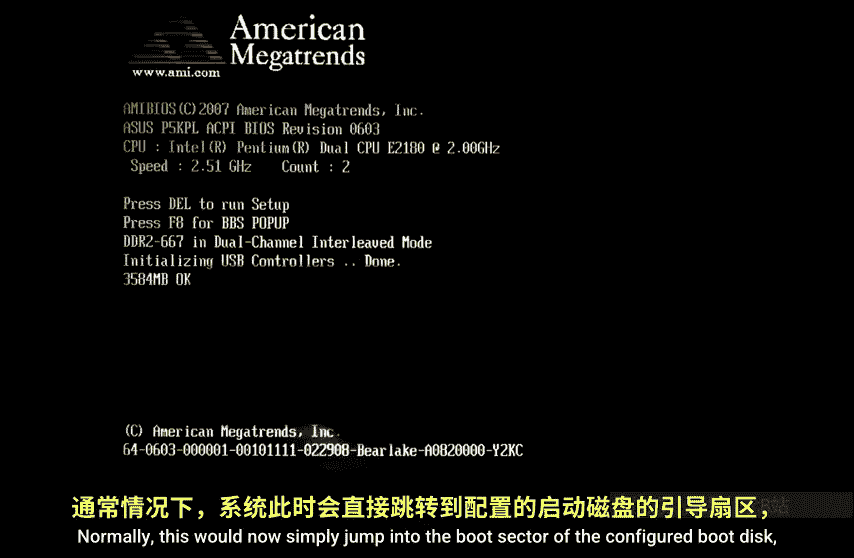
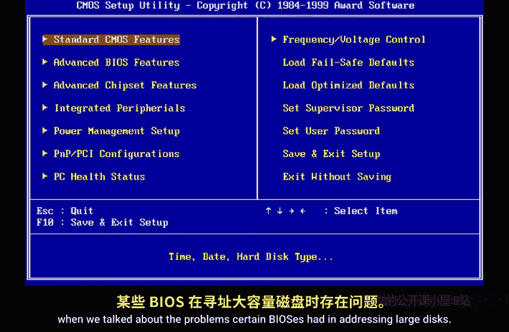
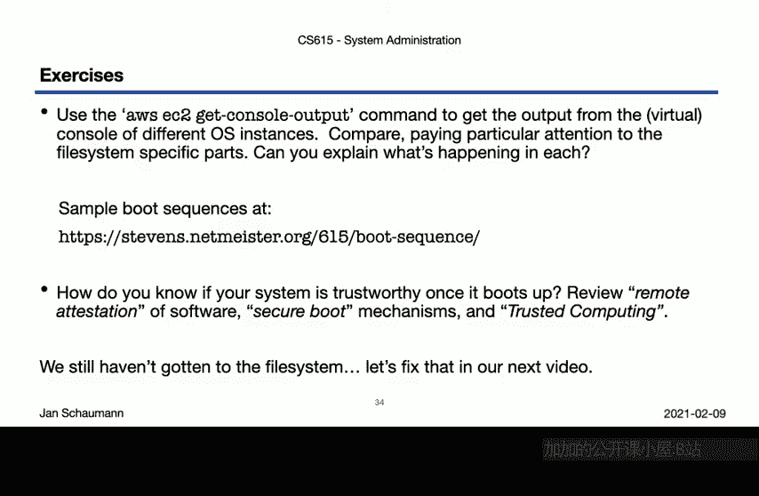

# 015：启动过程与主引导记录（MBR）🔧

在本节课中，我们将学习计算机系统的启动过程，并深入了解一个关键组件：主引导记录（MBR）。我们将从宏观的启动流程开始，逐步深入到MBR的具体结构和工作原理。

## 概述

启动过程是计算机从通电到操作系统完全运行所经历的一系列步骤。理解这个过程对于系统管理员至关重要，因为它涉及到硬件初始化、固件交互以及操作系统的加载。本节我们将重点探讨传统的BIOS启动流程及其核心——MBR。

## 启动过程详解

上一节我们讨论了磁盘分区。本节中，我们来看看系统如何利用这些分区来启动。

当系统启动时，我们可能在控制台上看到类似以下的消息。这是一个NetBSD引导加载程序的显示界面。它是一个BIOS引导加载程序，提供了一个交互式菜单来选择不同的启动方式。如果我们在超时前不做选择，它将开始正常的启动过程，加载BSD内核，并生成屏幕上显示的硬件初始化消息。最终，控制权会交给`init`进程，我们可以看到`init`进程继续引导过程，挂载文件系统，启动网络，并启动系统配置的所有守护进程，最后留下一个登录提示。

我们可以将刚刚看到的过程分解为以下几个独立的步骤。

以下是启动过程的各个阶段：

1.  **通电自检（POST）**：物理服务器通电后，系统首先执行通电自检。它会检查内存、CPU、存储设备等基本硬件的状态，并确定从哪个设备启动。
2.  **加载第一阶段引导加载程序**：自检完成后，系统会寻找第一阶段引导加载程序。传统上，这意味着在配置的启动磁盘的第一个扇区（启动扇区）中寻找特定的签名和可执行代码。这就是我们所说的主引导记录（MBR）。
3.  **加载第二阶段引导加载程序**：第一阶段引导加载程序可能会将控制权交给第二阶段引导加载程序。这是必要的，因为第一阶段引导加载程序的大小非常有限。如果需要执行比简单启动更复杂的操作，就需要跳转到其他地方的特定代码，然后才能找到并加载内核。
4.  **加载内核**：在第二阶段引导加载程序之后，最终会加载内核。对于虚拟机（如AWS实例），会有一个特殊的内核。例如，如果使用Xen进行虚拟化，启动的将是Dom0管理程序内核。
5.  **内核初始化**：内核启动后，会初始化它发现的硬件。在虚拟机的情况下，这是虚拟硬件。
6.  **启动用户空间进程**：内核将控制权交给`init`或`systemd`等进程，以启动各种服务。
7.  **运行应用程序**：如果启动的系统是Web服务器，应用程序将绑定到正确的网络端口并最终提供内容。

这些步骤涵盖了从通电到提供服务的完整启动过程。但今天，我们只关注前几个步骤，看看我们是如何到达内核的。

## 固件：BIOS与UEFI

当物理服务器通电时，你首先可能看到的是类似下图的内容。这是一个美国Megatrends BIOS的示例，显示了一次成功的通电自检。通常，此时它会直接跳转到配置的启动磁盘的启动扇区，但也可能允许你配置某些方面。也就是说，尽管这段软件必然很简单，但仍然允许一些灵活性。

由于BIOS通常位于主板上的只读存储器芯片中，不易更改，我们不称它为软件。它更难改变，但也不完全是硬件，所以我们称之为固件。下图展示了一个BIOS配置菜单的示例，允许我们选择设备的启动顺序等。

但BIOS可以追溯到70年代的CP/M操作系统，最初是IBM PC的专有技术，后来被其他人逆向工程，但并未标准化，并且通常针对特定的主板或其他硬件进行专门设计。BIOS也有一些技术限制，我们在上一个视频中看到并讨论了某些BIOS在寻址大磁盘时遇到的问题。

因此，我们现在有了统一可扩展固件接口（UEFI），它提供了一种现代且标准化的方式，用于在操作系统和底层固件之间进行交互。

但正如经常发生的那样，了解历史以及过去是如何做事的非常重要，事实证明，出于向后兼容的原因，今天仍然经常采用旧的方式。这就是为什么我们现在不看UEFI，而是看传统的MBR。

## 深入主引导记录（MBR）

传统的BIOS期望在启动磁盘的第一个扇区（即前512字节）找到主引导记录。没错，主引导记录只有512字节大小。在这512字节中，我们必须容纳相当多的信息，以及启动系统所需的代码。让我们看看这是什么样子。

在第一个扇区的末尾，我们期望找到“魔法字节”`0x55`和`0xAA`。这两个字节的存在向BIOS表明这是一个有效的启动扇区。

紧接着前面的64字节保存着分区表。这个分区表与我们上一个视频中讨论的分区表不同。这是BIOS分区表，它描述了BIOS可以看到哪些分区。

一个BIOS分区表条目是16字节大小，因此我们最多只能有四个这样的分区。也就是说，带有MBR的磁盘最多只能有四个BIOS分区。

但我们知道，如果需要，我们的操作系统可能希望将磁盘划分为多于四个分区，这本身就说明了区分BIOS分区和操作系统分区的必要性。也就是说，BIOS部分实际上只定义了磁盘的哪些部分属于给定的操作系统。操作系统然后用该磁盘切片做什么完全取决于它自己。

请记住，在上一个视频中，我们展示了BSD系统在其磁盘标签中使用`d`分区来引用整个物理磁盘，使用`c`分区来引用专用于此操作系统的磁盘部分。这个`c`分区实际上就是我们在这里定义的内容，然后操作系统可以在其中创建额外的分区。

无论如何，用2个字节存放魔法数字，64个字节存放分区表，我们还剩下446字节。也就是说，启动系统所需的一切都需要装在这446字节里。这就是为什么我们常说这是第一阶段引导加载程序。它只是足够的代码，可以将系统启动到一个点，也许可以访问第一磁道上的其他扇区，然后找到更复杂的代码并将控制权转移给它。那段代码被称为第二阶段引导加载程序。GNU GRUB就是一个可能包含多个阶段的引导加载程序的例子。

回到分区。我们有一个由区区64字节组成的分区表，留给我们更少的16字节来描述磁盘。我们如何组织这16个字节呢？

以下是BIOS分区表条目的16字节结构：

1.  **活动标志（1字节）**：指示此分区是否为活动（可启动）分区。
2.  **起始CHS地址（3字节）**：使用我们上一个视频讨论的柱面-磁头-扇区寻址方案来寻址磁盘的第一个扇区。
    *   第一个字节表示磁头（8位，最多256个磁头）。
    *   第二个字节的低6位表示扇区（最大扇区号为64），高2位是柱面地址的高位。
    *   第三个字节表示柱面地址的低8位。结合第二个字节的高2位，我们总共有10位用于柱面，最多1024个柱面。
3.  **分区类型（1字节）**：标识操作系统的分区类型，例如NetBSD或Linux。
4.  **结束CHS地址（3字节）**：与起始CHS地址结构相同，表示分区的最后一个扇区。
5.  **起始LBA地址（4字节）**：分区的第一个扇区的逻辑块地址。
6.  **扇区总数（4字节）**：分区包含的扇区总数。

由于CHS寻址的限制，我们无法寻址超过一定大小的磁盘，这个限制相当小。因此，我们改变了寻址方案，使用逻辑块寻址。现在我们有两种寻址扇区的方式。如何从一种转换到另一种呢？

我们可以从LBA地址开始，然后使用以下公式确定C、H和S值：
*   `C = LBA / (HPC * SPT)`
*   `H = (LBA / SPT) % HPC`
*   `S = (LBA % SPT) + 1`
其中，`HPC`是每柱面的磁头数，`SPT`是每磁道的扇区数。然后使用这些值填充CHS字段。

## 动手操作：创建MBR分区

现在我们知道这16个字节是什么样子了，我们应该能够通过将所需的字节写入正确的偏移量，为任何磁盘创建一个带有有效分区表条目的启动扇区。让我们试一试。

我们像往常一样，启动一个新的NetBSD实例，然后创建一个新的卷来操作。我们等待实例启动，并使用另一个shell函数附加卷以节省输入。登录实例后，我们通过`dmesg`命令检查磁盘。我们看到根磁盘和新附加的磁盘`xbd1`。

让我们通过`fdisk`命令查看根磁盘的BIOS分区表。我们看到驱动器的逻辑几何结构以及BIOS几何结构。分区表显示第一个分区类型为NetBSD且处于活动状态，起始于扇区2048，并显示了柱面-磁头-扇区地址。`fdisk`向我们展示了所有这些信息。但它实际上是什么样子的呢？

让我们使用`dd`命令检索磁盘的前512个字节，并用`hexdump`工具将其显示为十六进制。所有这些字节都是实际的引导代码。第一个分区在这里定义。在这16个字节里。在最后这里，我们看到MBR签名`55 AA`。

让我们单独看一下第一个分区。我们知道它的大小是16字节，位于偏移量`0x1BE`（十进制446）。所以，这就是它。这16个字节描述了`fdisk`显示的第一个分区条目。到目前为止，一切顺利。

现在，我们的第二个磁盘是什么样子的？`fdisk`显示没有定义分区，也没有活动分区。如果我们查看驱动器上的字节，毫不奇怪，它们都是零。

那么，我们如何将这个（全零）变成那个（有效的MBR）呢？让我们从头开始。或者说，从结尾开始。注意`fdisk`告诉我们这里的分区表无效，因为扇区末尾没有魔法数字。让我们修复它。

我们使用`printf`将十六进制字节`55 AA`写入`/dev/xbd1`的偏移量510处。现在，我们注意到`fdisk`不再抱怨分区表无效，但它仍然说没有活动分区。所以让我们在这里创建一个NetBSD分区。

为此，我们需要获取NetBSD的分区类型标识符。它是169。169的十六进制是什么？让我们使用`bc`工具来计算。`A9`是我们想要的十六进制值。让我们将其写入偏移量`0x1C2`（十进制450）。然后，通过将`0x80`写入偏移量`0x1BE`（十进制446）来将此分区标记为活动。现在看看`fdisk`怎么说。分区0现在是一个NetBSD分区，并被标记为活动。

但我们仍然缺少此分区的大小和定义。正如我们在这里看到的，柱面-磁头-扇区的定义都是0。所以，让我们定义它们。此分区的起始位置是扇区2048，因为正如我们提到的，整个第一磁道通常保留给额外的引导代码。所以我们可以使用我们的公式，从LBA地址计算CHS地址，这里的LBA地址是2048。

计算过程如下：
*   柱面 = 2048 / (16065) = 0
*   磁头 = (2048 / 63) % 256 = 32 (十六进制 `0x20`)
*   扇区 = (2048 % 63) + 1 = 33

现在我们可以写入这三个字节（磁头、扇区、柱面）到偏移量`0x1BF`（十进制447）作为起始扇区。检查一下，起始扇区在柱面0，磁头32，扇区33。

现在我们需要最后一个扇区。我们知道总共有这么多扇区，但第一个扇区包含MBR，所以减去它。然后除以每柱面的扇区数得到柱面地址的十进制数，这里是391。余数是10040。现在我们除以BIOS的每磁道扇区数63，得到十进制159。所以我们的磁头字节是`0x9F`。我们的扇区值是24十进制。但请记住，我们现在需要组合柱面和扇区的位。

我们需要将其转换为二进制。柱面391的二进制是`110000111`。取其高2位`01`，加上扇区的6位二进制`011000`，组合成`01011000`，即十六进制`0x58`。柱面的低8位是`10000111`，即十六进制`0x87`。所以现在我们有我们的C、H、S字节：`0x9F`， `0x58`， `0x87`。让我们将这些写入偏移量`0x1C3`（十进制451）。`fdisk`告诉我们什么？到目前为止看起来不错。我们有一个起始CHS地址和一个结束CHS地址。

但我们的MBR也需要LBA地址。让我们继续添加它们。我们知道起始地址的LBA是2048，即十六进制`0x800`。但LBA字段需要4个字节，并且使用小端字节序。所以，我们把`0x800`转换成`00 08 00 00`，并将这些字节写入偏移量`0x1C6`（十进制454）。最后一个扇区的LBA是总扇区数减去2048，转换为十六进制，再转换为小端序，写入偏移量`0x1CA`（十进制458）。现在，`fdisk`向我们显示了一个具有正确大小和地址的适当分区。

当然，有一种更简单的方法来做到这一点。让我们用零覆盖MBR来清除它。然后我们可以使用`fdisk`来指定我们想要激活分区0，指定类型169用于NetBSD，起始于扇区2048，并具有给定的大小。结果看起来就像我们手动写入磁盘一样。这表明我们用来操作磁盘的工具真的没有什么神奇之处。这完全就是知道将哪些位写入哪个位置的问题。这一点，以及能够使用`dd`、`hexdump`和`printf`来操作和写入单个位和字节，是相当有用的。

## 总结与练习

让我们回顾一下。我们首先讨论了典型的启动序列。我们说这一切都始于一些基本的固件，可能是BIOS或UEFI等。它可能执行POST检查，并初始化它看到的硬件，然后将执行转移到第一阶段引导加载程序，例如MBR。然后，MBR可能通过将控制权交给第二阶段引导加载程序来继续引导过程，第二阶段引导加载程序然后加载内核，内核最终将控制权交给用户空间进程，如`init`。这里需要注意的一点是，在虚拟化硬件中，其中一些步骤会重复，一些可能被跳过，一些可能被模拟，因为我们的虚拟主机在启动时会初始化虚拟硬件。但最终，我们到达了一个运行中的系统。

理解了MBR的细节后，让我们考虑一些额外的练习。

以下是推荐的课后练习：

1.  **比较不同操作系统的启动输出**：AWS实例允许你获取发送到虚拟控制台的输出。不同的操作系统显示不同级别的详细信息。当然，每个操作系统的启动过程都不同。一个好的练习是比较不同操作系统的输出。启动几个实例，例如NetBSD、FreeBSD、Ubuntu、Fedora或OmniOS实例，并比较控制台的输出。特别注意文件系统或磁盘特定的消息。确保你理解输出的含义。
2.  **思考启动过程的安全性**：正如我们所看到的，这个过程有好几层，涉及不同的软件：主板ROM中的固件，我们通常不会想到的写入启动扇区的位。我们如何确保没有人篡改过软件或固件？可信计算的概念在这里发挥作用。查找相关术语，例如远程认证或安全启动。
3.  **预习**：你可能已经注意到，我们还没有讲到实际使用文件系统或那可能是什么样子。让我们在下一个视频中解决这个问题。

本节课中，我们一起学习了计算机从通电到操作系统运行的完整启动流程，并深入剖析了传统BIOS启动中的核心——主引导记录的结构与操作。理解这些底层机制是进行系统管理、故障排查和安全加固的基础。