# 020：文件系统类型与挂载点详解 🗂️

在本节课中，我们将结束对分区和文件系统的高层次讨论。我们将深入了解Unix文件系统支持的文件类型及其行为，并探讨不同系统上通常挂载了哪些分区和文件系统。

## 文件类型详解 🔍

上一节我们介绍了如何挂载文件系统并创建文件。本节中，我们来看看Unix文件系统支持的具体文件类型。

以下是一个空目录，它通常包含两个条目：`.`（当前目录）和`..`（父目录）。

我们创建一个常规文件。`ls`命令通过权限字符串的第一个字符为`-`来标识它。

接下来，我们创建一个目录。`ls`命令通过权限字符串的第一个字符为`d`来标识它。

每个文件都由一个**inode**引用，该inode包含所有关联的元数据，如权限、所有权、时间戳等。目录中的文件名创建了对inode的引用。

虽然我们通常不这么称呼，但每个文件名到inode的映射都称为**硬链接**。

我们可以为同一个文件设置多个名称。如果文件已存在，我们可以将另一个目录条目链接到它。使用`ln`命令即可实现。

现在，这两个文件除了名称外无法区分。更准确地说，它们不是两个文件，而是同一个文件的**两个名称**。

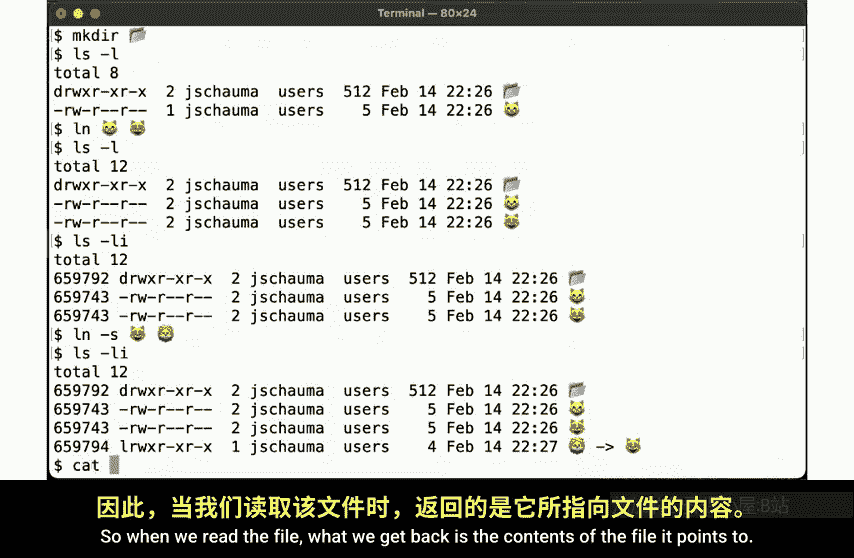

我们可以通过查看文件的inode编号来验证这一点，`ls`命令通过`-i`标志显示此信息。目录有一个inode编号，而两个常规文件共享同一个inode。这意味着，就系统而言，它们是同一个文件。

`ls`命令也在这里告诉我们，这个文件有两个名称。这个数字是**链接计数**，即文件系统中该文件存在的名称数量。

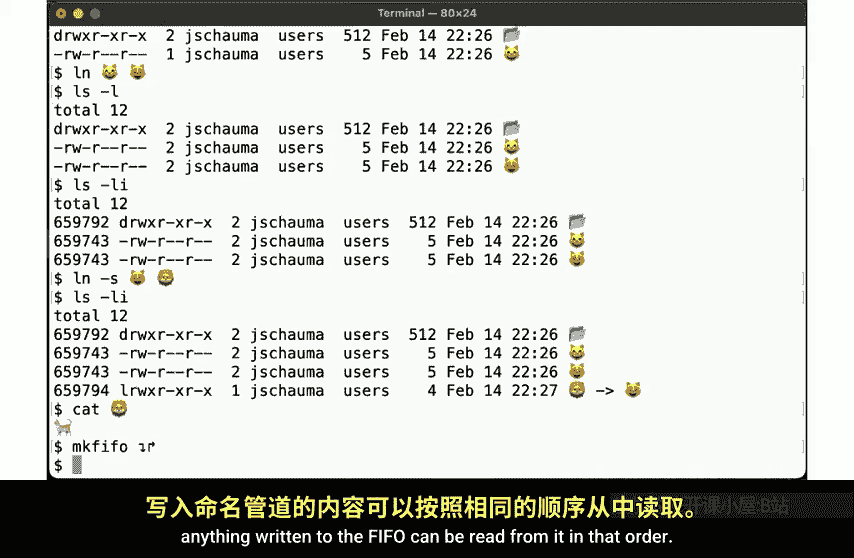

但还有另一种类型的链接，称为**符号链接**，使用`ln`命令的`-s`标志创建。现在我们可以看到这个符号链接确实是一个独立的文件。它有自己的inode编号，文件类型显示为`l`。

符号链接是一种特殊类型的文件，它表示：“嘿，别看我，任何操作都去找那个文件。”`ls`命令的输出也显示了符号链接的目标。

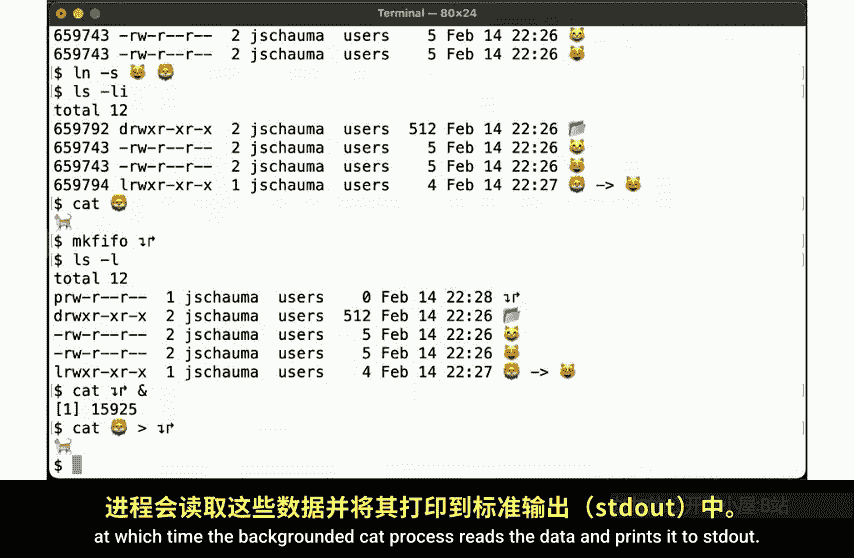

当我们读取文件时，得到的是它所指向的文件的内容。

## 其他文件类型 📁

我们已经看到了目录、常规文件（本质上是硬链接的另一种说法）和符号链接，但还有其他类型的文件。

其中之一是**FIFO文件**。FIFO本质上是管道概念在文件系统中的体现，其行为也类似。写入FIFO的任何内容都可以按顺序从中读取。

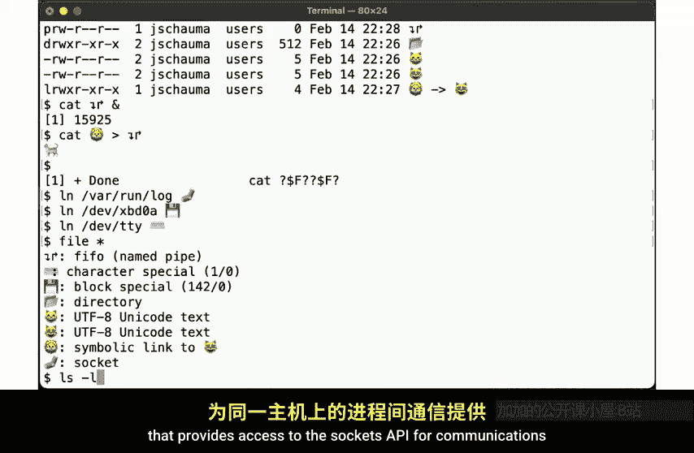

因此，`ls`命令使用`p`字符来表示FIFO，也称为**命名管道**。

FIFO的行为在初次使用时可能有些令人惊讶。为了说明，我们在后台启动一个从FIFO读取数据的进程。然后，我们可以将符号链接（重定向到常规文件）的内容输入到FIFO中。

此时，后台的`cat`进程读取数据并将其打印到标准输出。

当我们再次按回车键时，shell告诉我们后台进程已完成。

这也提醒我们，虽然文件名可以包含非ASCII字符，但这并不总是个好主意。

## 查看所有文件类型 📋

以下是不同文件类型的汇总。

我们创建一些指向当前目录中现有路径名的硬链接。然后使用`file`命令报告它们的信息。

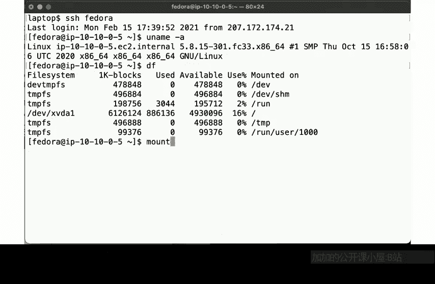

现在我们看到了一个FIFO、一个字符特殊设备（如TTY）、一个块特殊设备（如硬盘）、一个目录、包含UTF-8 Unicode的常规文件、一个符号链接以及一个套接字。

套接字是文件系统中的进程间通信会合点，为同一主机上的进程间通信提供套接字API访问。

这里，`ls -l`显示了更多信息，其中权限字符串的第一个字母再次给出了文件类型。

这些是你在正常Unix系统中可能会遇到的不同文件类型。还有其他一些文件类型，但其中一些是特定操作系统的实现细节。

## 默认挂载的文件系统 💾

现在，让我们看看在不同Unix版本上默认挂载了哪些文件系统。

首先是FreeBSD。我们看到根文件系统是从`da0p2`（GPT根文件系统）挂载的，这表明使用了GPT分区表。`mount`命令显示当前挂载的文件系统，在此情况下与`df`的输出没有区别。

接下来看OmniOS。运行`mount`命令，我们看到一个相当不同的视图，显示有几个其他东西被挂载。我们有根文件系统（我们知道它在ZFS池上），以及几个特殊用途的伪文件系统。

查看`/etc/mtab`手册页。这是将运行系统的信息投射到文件系统中的奇怪情况之一，使其看起来像常规文件。查看`/etc/mtab`文件，我们发现没有意外，挂载的文件系统与之前显示的一致。

系统如何知道要挂载哪些东西？查看`/etc/vfstab`手册页。这是一个实际的配置文件，描述了启动时挂载文件系统的默认设置。查看该文件，它描述了要挂载的内容，以及为给定特殊挂载点使用什么类型的伪文件系统。

现在，与Linux（特别是Fedora Linux）进行比较。`df`命令在这里给出了一些信息，显示了`tmpfs`等特殊文件系统的使用，以及根文件系统。如果我们运行`mount`命令，会显示很多在`df`中没有看到的东西。

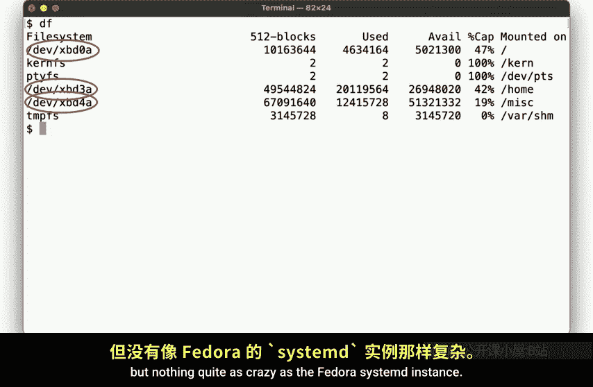

Fedora现在使用systemd来引导和管理运行系统，因此我们在这里看到一大堆额外的、奇怪的东西被塞了进来。我们看到`tmpfs`、`devpts`、`cgroup`等等，右边都显示了相应的挂载标志。

查看这个系统上的`man fstab`。`/etc/fstab`文件包含关于可以挂载哪些文件系统的信息。查看该文件，我们注意到它只包含一个条目，用于类型为`ext4`的根文件系统，并映射到具有给定UUID的设备。这与我们当前挂载的内容有很大不同。

那么这些信息在哪里跟踪？`/etc/mtab`指向`/proc/self/mounts`，使用`proc`伪文件系统将运行系统的信息反映到文件系统层次结构中。`/proc/self/mounts`看起来像常规文件，大小为0字节。但当我们获取它时，它显示了所有内容，就像`mount`命令所做的那样。

因此，我们再次注意到运行`df`报告空闲空间时可用文件系统与哪些其他伪文件系统处于活动状态之间存在差异。对于许多伪文件系统，报告文件使用情况没有太大意义，因为根据定义，它们只是将系统属性抽象到文件API中。

## 实际系统布局示例 🖥️

所有这些都有点奇怪。我们详细讨论了磁盘和分区，但我们在这里看到的大多数东西并不是真正的文件系统，也没有磁盘支持。这说明文件系统API和概念非常成功，以至于我们越来越多地将其用于其他目的。

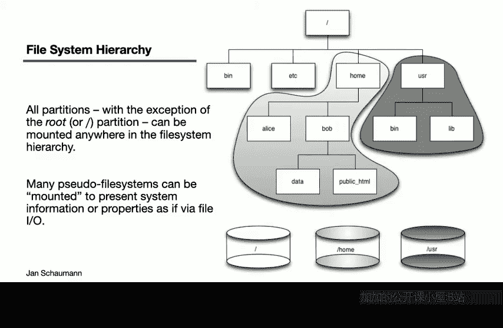

其次，值得注意的是，我们启动的AWS实例的默认布局不一定代表用于特定目的的实际生产系统的布局。

因此，让我们展示一个不同的例子。这里看到的是托管QSE网站的服务器上的`df`输出。这是一个NFS虚拟私有服务器，但正如你所见，这里有一个更正常的布局。

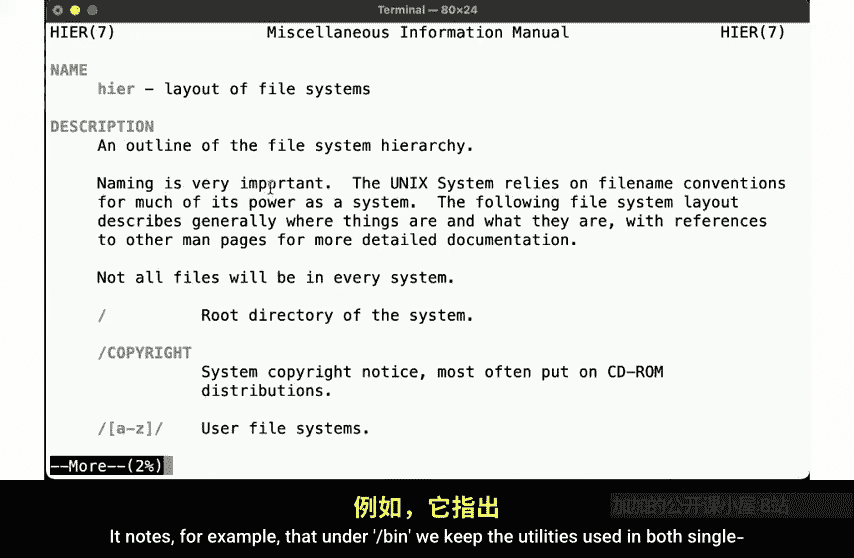

我们有一个提供操作系统的根磁盘，它被挂载在`/`下。但我们还有用于不同目的的额外磁盘。我们看到一个磁盘专门用于系统上所有用户的主目录，另一个磁盘挂载用于杂项数据文件。系统也有`devpts`、`proc`和`tmpfs`挂载，但不像Fedora实例那样疯狂。

## 挂载可视化与文件系统层次结构标准 📊

让我们可视化如何挂载磁盘。尽管如今我们经常有一个包含所有内容的大型分区，但我们仍然可能看到不同的磁盘，而不是不同的分区。

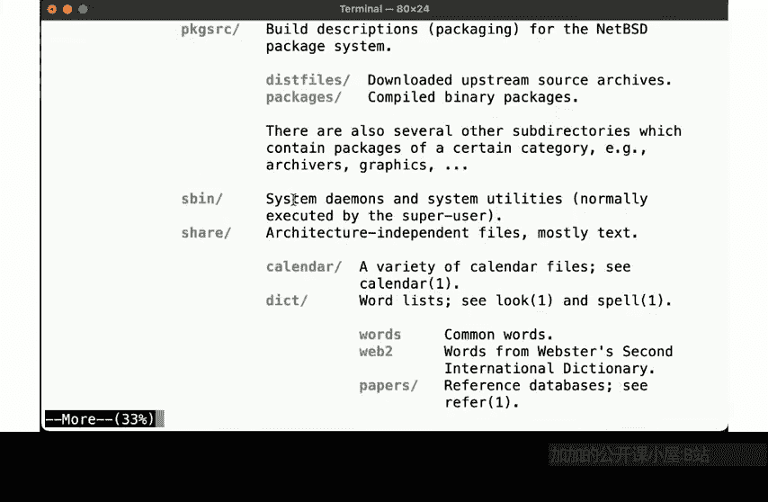

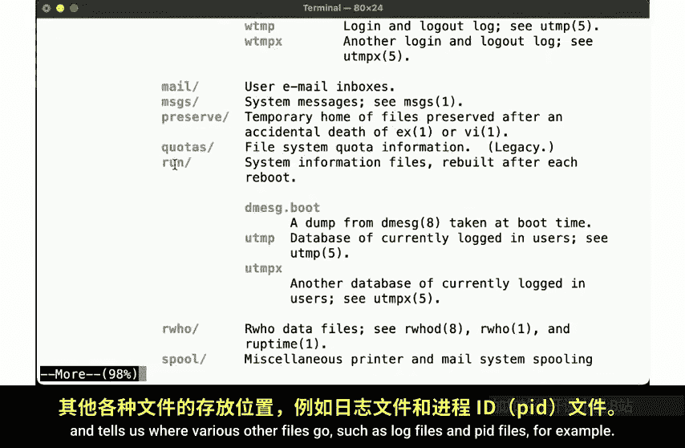

挂载分区的唯一规定是：分区可以挂载在任何地方，但根分区必须挂载在`/`下。

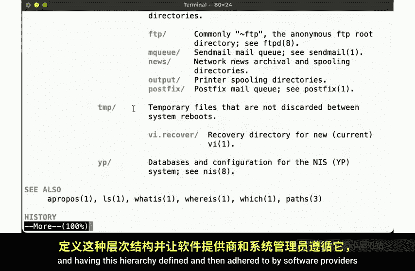

在磁盘空间仍然昂贵且稀缺的旧时代，通常有一个磁盘包含启动系统所需的最少文件，该分区将是根分区。而另一个磁盘可能包含所有额外的文件，例如出现在`/usr`下的文件，而用户的私有文件可能驻留在另一个分区上。顺便说一下，这就是为什么我们有一个`/usr`目录，而不是将所有文件都放在`/`下的原因之一。

我们马上会看到，这实际上有一些逻辑。正如我们刚才看到的，我们还可以挂载其他东西，但这些伪文件系统没有在图形中表示，因为我们想区分数据存放在哪里。

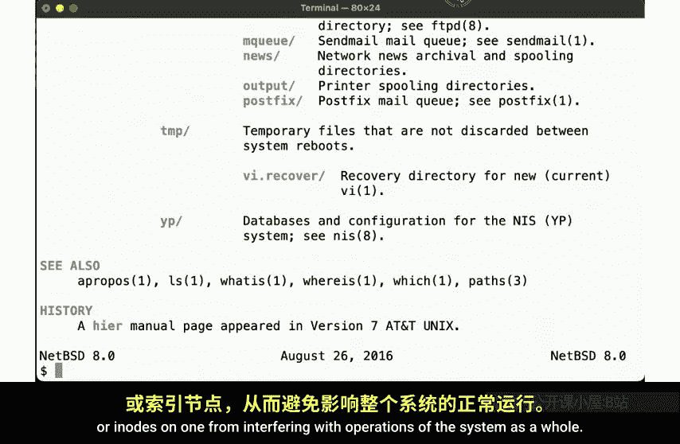

为此，我们可能还需要考虑跨不同操作系统的某种标准化，并考虑在哪里安装软件。我们将在下周的视频中更详细地讨论这个话题。

当我们想查找一些信息，比如哪些文件放在哪里，或者文件系统层次结构应该是什么样子时，我们该怎么做？我们不会在Google中输入“哪些文件放在哪里”，然后点击第一个Stack Overflow链接，指向某个随机的个人观点，认为内核应该放在`/all/my/kernels`下。

相反，我们查阅手册页。操作系统提供的`man hier`描述了文件系统层次结构。例如，它指出：

*   在`/bin`下，我们存放单用户和多用户环境都需要的实用程序。
*   系统配置文件放在`/etc`下。
*   它告诉我们用户数据放在哪里。
*   它告诉我们库放在哪里。
*   它指出我们不应依赖`/usr`的可用性，因为它可能驻留在启动时尚未可用的单独磁盘上。
*   它告诉我们系统实用程序的位置，从而回答了为什么我们同时有`/bin`和`/usr/bin`的问题。
*   它描述了用户层次结构本身，这在某种程度上镜像了根层次结构。
*   它告诉我们各种其他文件的位置，例如日志文件和PID文件。

因此，所有这些背后都有一些逻辑和原因。定义这个层次结构，然后由软件提供商和系统管理员遵守，使你更容易使用和维护系统。

通过仔细分离这些文件，你可以使用具有不同挂载标志和安全设置的不同分区，或者可能更好地预算磁盘空间，或者避免失控进程在一个分区上耗尽磁盘空间或inode，从而干扰整个系统的运行。

## 总结与思考练习 💡

本节课中，我们一起学习了Unix文件系统的不同类型（常规文件、目录、硬链接、符号链接、FIFO、设备文件、套接字），探讨了不同操作系统（FreeBSD、OmniOS、Linux）的默认挂载布局，并理解了文件系统层次结构标准（FHS）的逻辑和重要性。

以下是供你思考和实验的一些内容：

*   **查看不同挂载点**：查看不同操作系统中的不同挂载文件系统，确保理解差异并识别每个的用途。
*   **理解挂载选项**：查看文件系统的挂载方式。许多文件系统允许基于挂载标志有不同的行为。例如，你可以将磁盘挂载为只读，或启用/禁用某些属性以提高性能。确保理解所有不同标志的含义以及为什么可能使用它们。
*   **分析配置差异**：我们有时看到`/etc/fstab`中规定应挂载的内容与实际挂载的内容之间存在差异。尝试解释在什么情况下会出现这种差异，以及这是否是一个问题。
*   **复习文件系统实验**：回想本主题开始时，我们运行了一些尝试填满磁盘空间和使用inode的实验。重新运行这些练习，看看现在是否更明白了，你是否获得了更好的理解。
*   **探索文件系统限制**：
    *   思考文件系统的具体限制。例如，单个文件可以有多大？什么限制了它的大小？
    *   我们可以在文件名中使用UTF-8字符。你还可以使用哪些其他字符？哪些字符不能在文件名中使用？为什么不能？
    *   文件名可以有多长？尝试创建一个具有100、200或2000个字符的文件名。如果有任何限制，是什么？为什么？
    *   将这种思考扩展到路径名。如果路径名中的每个组件都是一个由斜杠分隔的文件名，并且文件名长度有限制，那么路径名的限制是什么？
    *   如果文件名只是一个硬链接，并且你可以为同一个文件有多个硬链接，你可以有100个、2000个吗？如果有任何限制，是什么？
    *   尝试跨磁盘或挂载点创建硬链接。你会发现这失败了。但为什么？
*   **理解软件安装**：我们还没有完全完成文件系统层次结构的讨论。正如我们在查看`hier`手册页时看到的，我们有理由将东西放在一个地方或另一个地方。但文件是如何到达那里的？我们将在接下来的视频中通过软件安装概念来直接和间接地介绍这一点。

如果你能回答所有这些问题，那么你将处于良好状态，并且认为你对迄今为止涵盖的主题有了更好的理解。

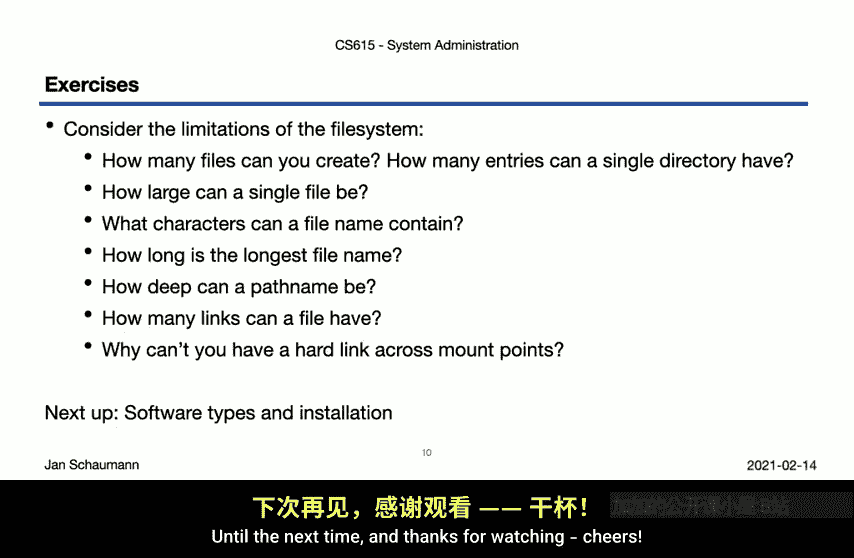

感谢观看。😊