# 024：第04周，第4节 - 包管理器陷阱 🚧

在本节课中，我们将探讨包管理器在实际使用中可能遇到的各种问题和陷阱。上一节我们高度赞扬了包管理器的各种实用功能，本节中我们来看看其背后的一些常见挑战。

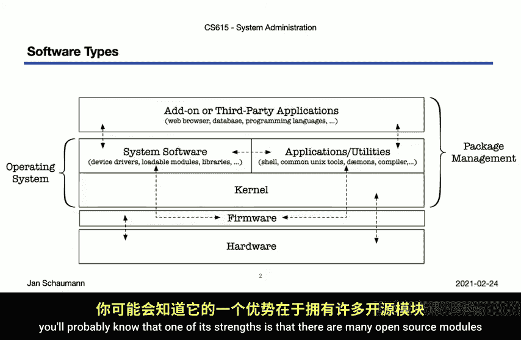

## 概述

包管理器极大地简化了软件安装和管理，但它们并非完美无缺。本节将讨论依赖关系混乱、软件完整性验证以及信任链等核心问题，这些问题在混合使用不同来源的软件包时尤为突出。

## 语言特定的包管理器

操作系统自带的包管理器（如RPM、APT）无法涵盖所有软件，尤其是编程语言生态中快速迭代的库和模块。因此，各种编程语言发展出了自己的包管理系统。

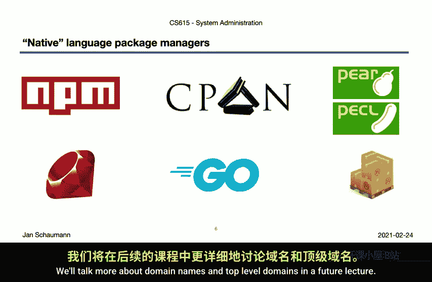

以下是几种常见语言的包管理器示例：
*   **Python**: 使用 `pip` 或 `easy_install`。
*   **Node.js**: 使用 `npm`。
*   **Perl**: 使用 `CPAN`。
*   **Ruby**: 使用 `gems`。
*   **Go**: 通常直接从 `GitHub` 获取代码。
*   **Rust**: 使用 `cargo` 管理包并上传到公共的 `crates.io` 注册表。

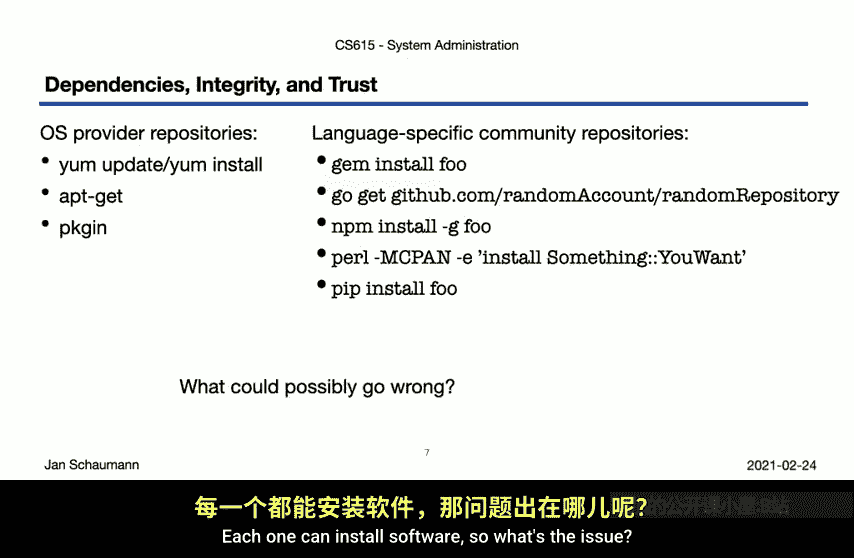

这些语言特定的包管理器与操作系统包管理器是独立并行的，这为后续的依赖管理问题埋下了伏笔。

## 依赖关系与冲突

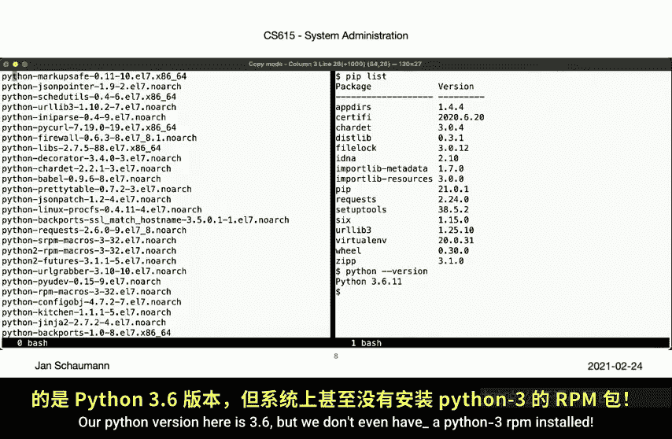

当操作系统包管理器和语言包管理器同时管理同一软件的不同版本时，就会产生依赖冲突。

考虑一个场景：系统通过RPM安装了 `urllib3` 1.10.0，同时通过 `pip` 安装了 `urllib3` 1.15.0。此时，一个Python工具运行时应该使用哪个版本？如果1.9版本存在安全漏洞并在1.15版本中修复，该系统是否受影响？如何准确清点主机上安装的所有版本？

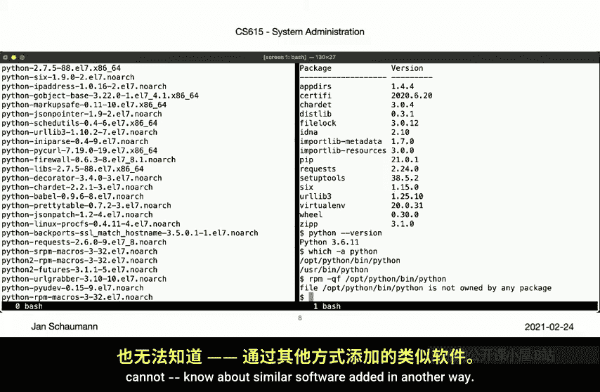

更复杂的是，我们甚至可能发现系统中运行的Python解释器本身并非由RPM包提供，例如：
```bash
$ which python3
/usr/local/bin/python3  # 此文件未被任何RPM包声明提供
```
每个包管理器都假设自己全权管理所有软件，无法感知通过其他方式安装的同类软件，因此依赖关系无法被跨管理器地表达、追踪和保证。

## 完整性与信任

如何确保我们安装的软件不包含后门？传统源码安装方式（`./configure && make && make install`）允许审查代码，但实际中几乎无人这么做，且不具备可扩展性。

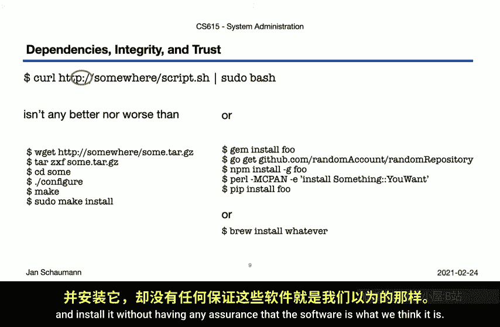

通过包管理器安装时，情况类似。我们下载文件并执行脚本，同样面临信任问题。使用HTTPS而非HTTP可以提供传输过程中的真实性保证，但这只是第一步。

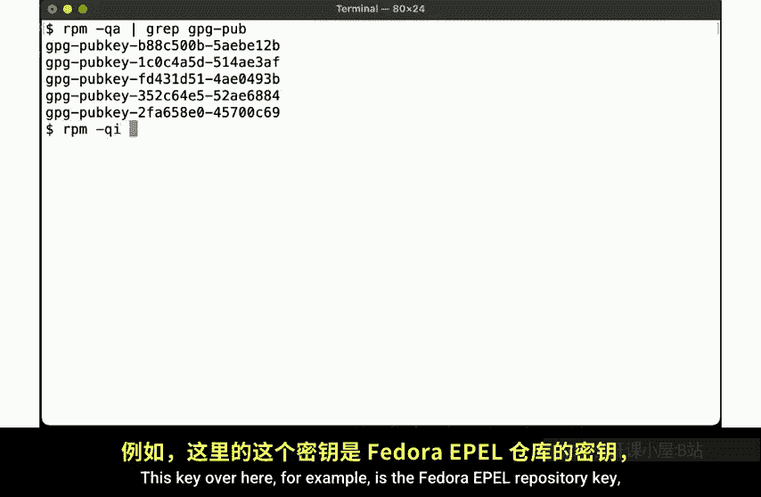

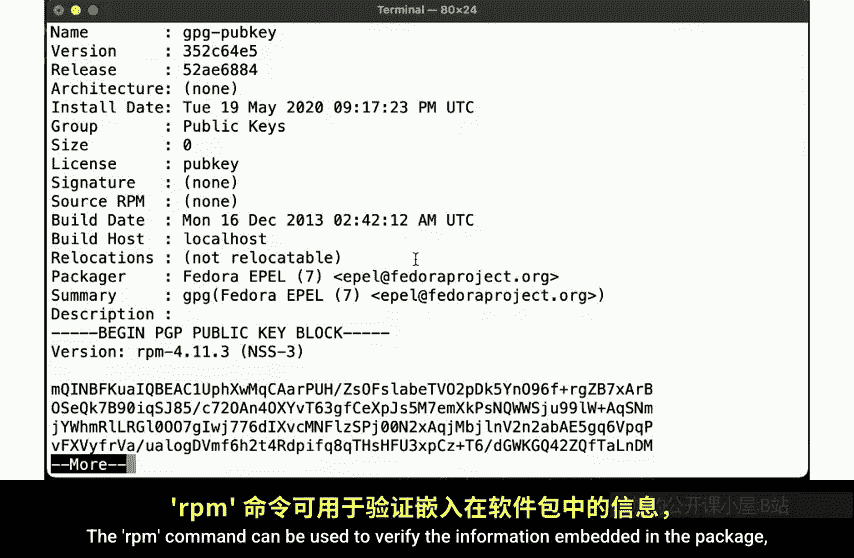

### 签名验证

一些包管理器支持签名包。例如，RPM包可以包含使用PGP密钥生成的数字签名。安装时，`rpm`命令会自动验证签名，确保软件包来自可信的发布者（如Fedora EPEL仓库），且未被中间人篡改。

验证过程可以表示为：
1.  仓库使用私钥对软件包元数据生成**签名**。
2.  用户系统持有对应的仓库**公钥**。
3.  安装时，使用公钥验证签名，确认软件包完整性。

这提供了强有力的保证，但信任链的建立本身是复杂的。

## 信任链的挑战

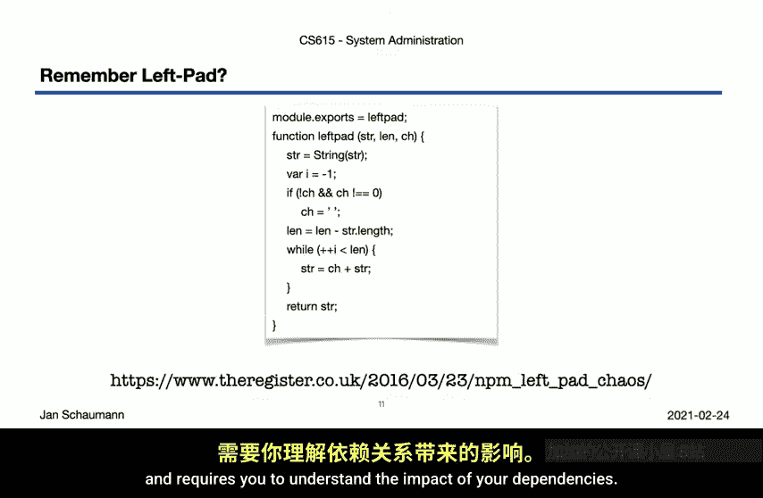

依赖上游仓库意味着你将信任置于他人之手。`left-pad`事件是一个典型案例：一个仅12行代码的流行Node.js模块被作者从公共仓库中移除，导致无数直接或间接依赖它的项目构建失败。这生动地说明了**你的依赖就是你的依赖**，它们消失，你就崩溃。

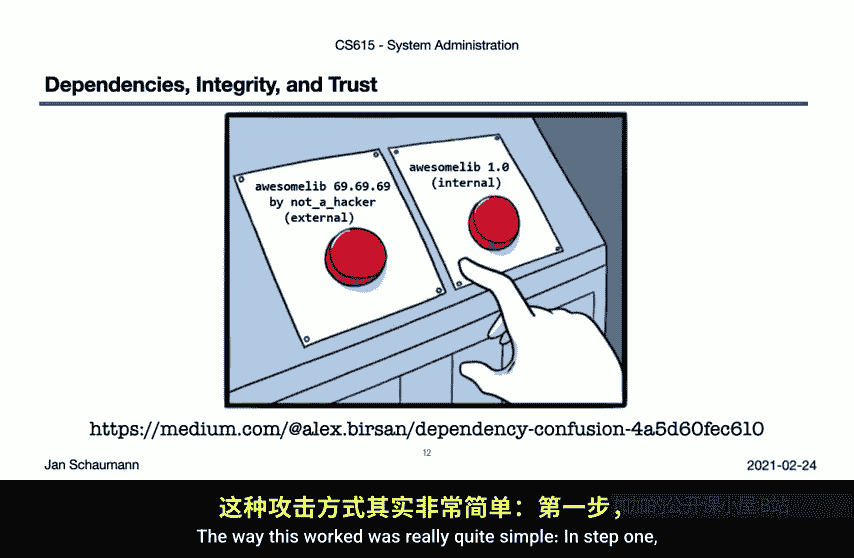

### 依赖混淆攻击

近期出现了一种名为“依赖混淆”的攻击方式，利用了包管理器的默认行为：
1.  **侦察**：攻击者搜索目标公司内部使用的、未公开发布的私有包名称（例如通过公开的GitHub代码）。
2.  **投毒**：在公共仓库（如npm）上发布同名恶意包，并赋予一个极高的版本号（如99.0.0）。
3.  **等待**：当目标公司的构建系统（默认配置下会同时查询内部和公共仓库）执行安装命令时，包管理器会选择版本号更高的包，即攻击者发布的恶意包。

这种攻击之所以可能，是因为默认情况下，许多包管理器会优先安装版本号最高的包，并且会查询公共源。防御方法包括严格配置只从内部仓库拉取包，但这需要细致的维护。

## 总结与回顾

本节课我们一起学习了包管理器在实际使用中的主要陷阱：

1.  **依赖的脆弱性**：你依赖于你的依赖。如果它们消失、引入破坏性变更或你无法控制它们，你的系统就会崩溃。
2.  **镜像的局限性**：内部镜像上游仓库可以解决可用性问题，但无法解决上游仓库被投毒或发布恶意更新的问题。镜像只是同步变化，并非隔离。
3.  **签名的部分解决方案**：使用签名包（如RPM）可以验证软件包来自可信源且未被篡改，但这建立在与供应商已建立信任关系的基础上。
4.  **信任链的传递**：所有信任最终都取决于最薄弱的一环。你软件构建的完整性受制于你依赖链中最不可靠的那个环节。

关于信任、完整性和威胁应对的更抽象讨论，我们将在后续课程中继续。现在，建议你思考本节提及的事件，研究类似问题，并审视你所用包管理器的配置：它们从何处拉取包？使用何种传输机制？如何断言完整性和真实性？你如何信任它们？

同时，请思考我们之前提出的核心问题：**在使用操作系统原生包管理器的环境中，如何安装和管理语言特定的模块？如何记录和解决由此产生的跨管理器依赖？** 正如我们所展示的，这远非一个已解决的问题，但值得你花时间深入探索。

关于包管理器的讨论暂时告一段落。在接下来的视频中，我们将转向多用户基础，探讨系统支持多用户意味着什么，以及这如何影响系统管理员的设计决策，并初步讨论身份验证基础。

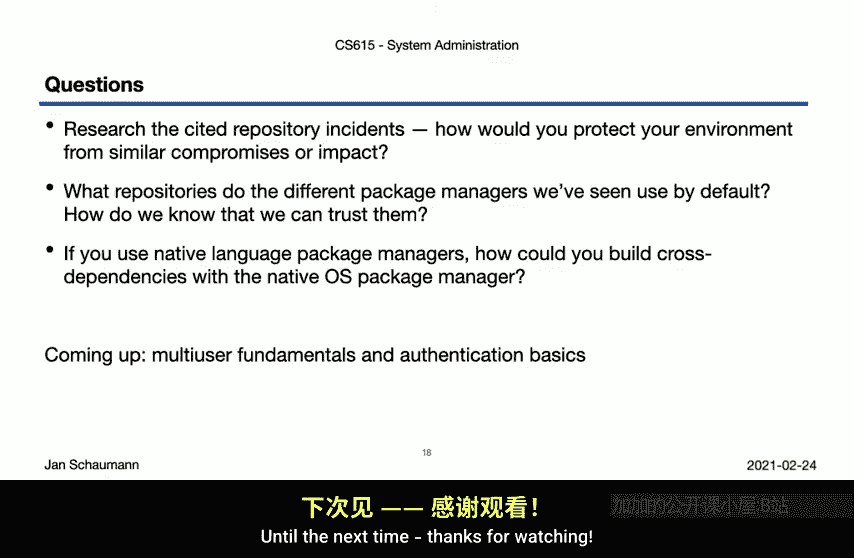

下次见。