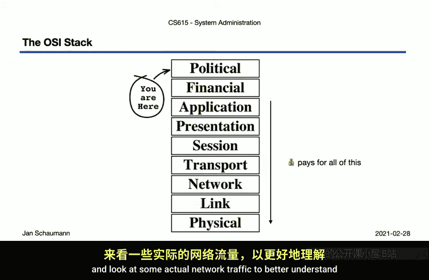
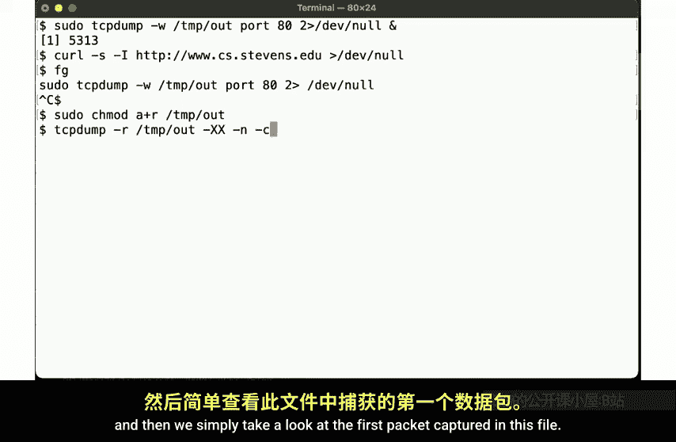
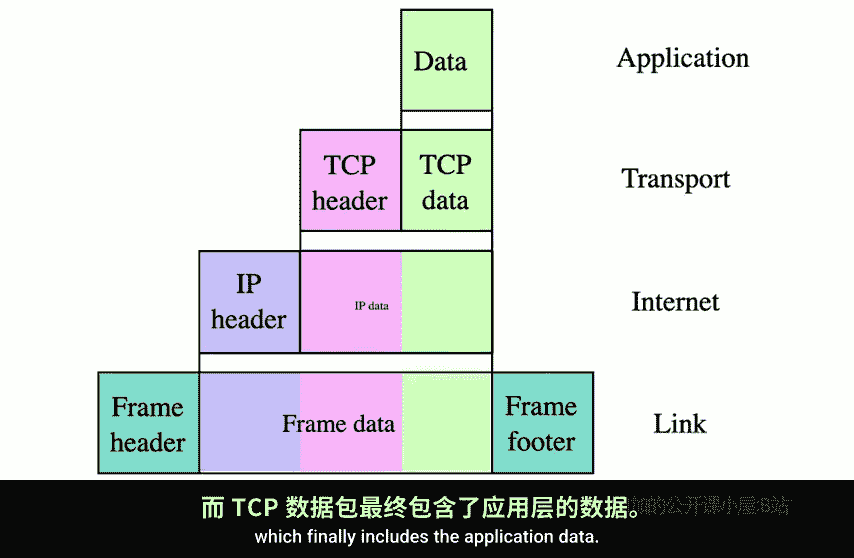
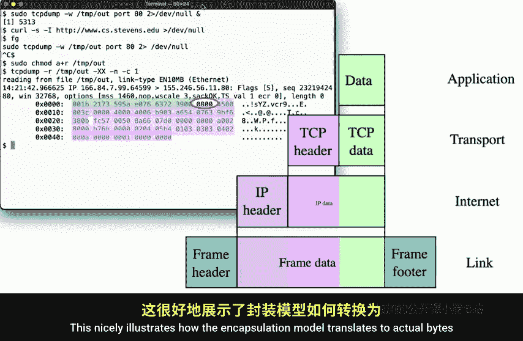
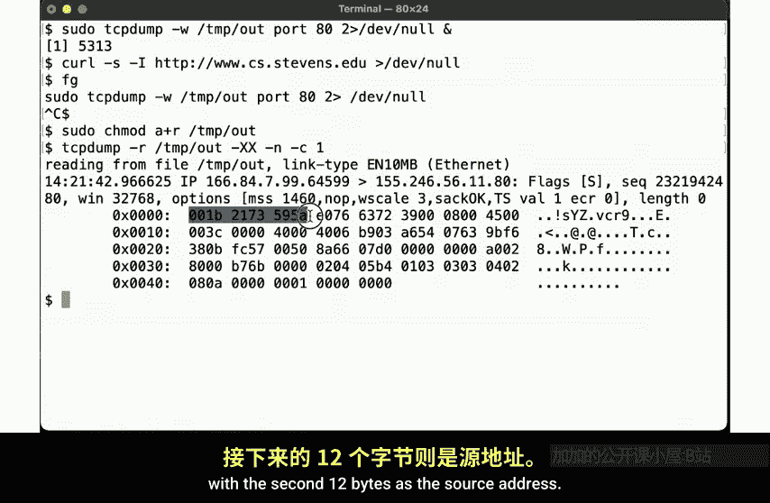
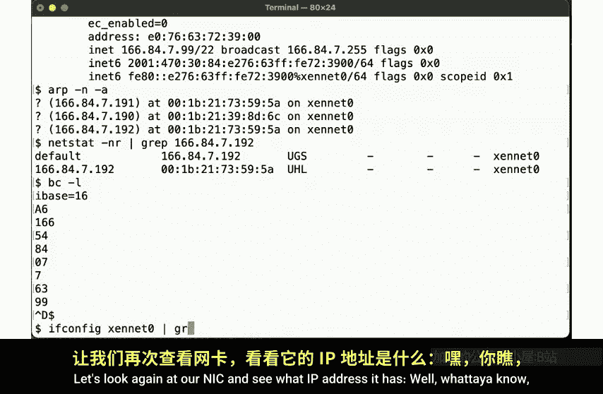
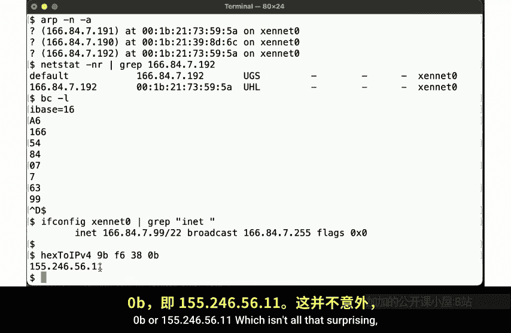
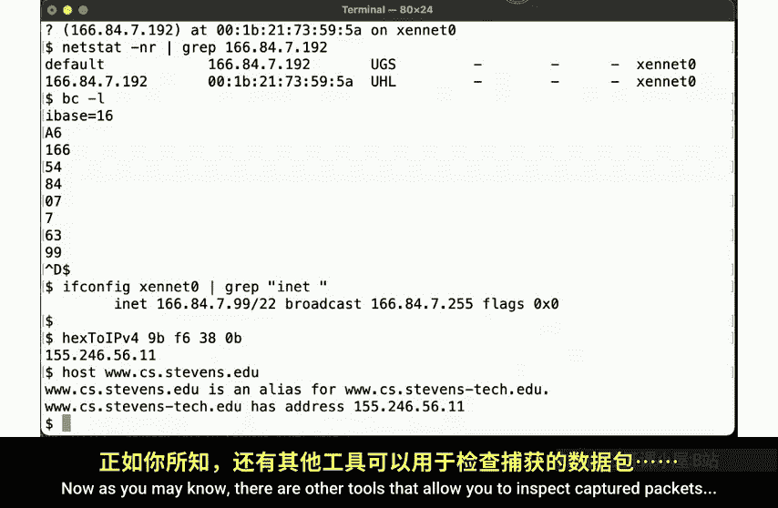
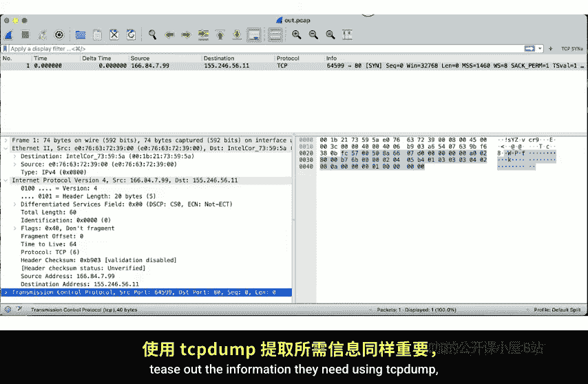
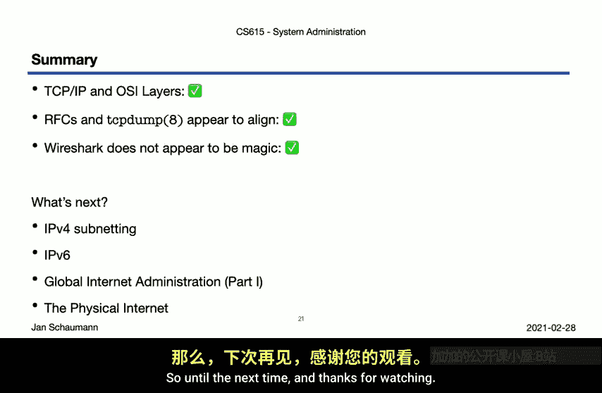

# 025：分层模型

## 概述

在本节课中，我们将开始一个关于网络的长篇讨论。我们将深入探讨Unix系统上的TCP/IP网络细节，并在这个过程中，上下遍历四层TCP/IP栈和七层OSI模型。我们将了解Unix系统如何与其他系统通信，学习互联网的物理结构及其治理的一些方面。

## OSI模型与TCP/IP模型

上一节我们介绍了课程概述，本节中我们来看看网络通信中最常用的分层模型。

我相信你们之前都见过这个模型，它通常用来表示通信网络中不同的功能部分。

以下是OSI七层模型：

1.  **物理层**：涉及物理介质、比特率、全双工/半双工等。
2.  **数据链路层**：使用物理介质进行节点到节点的数据传输。
3.  **网络层**：在不同网络之间移动数据包。
4.  **传输层**：TCP的大部分功能位于此层，但TCP也包含OSI模型中属于会话层的功能。
5.  **会话层**：关于会话和表示层具体包含什么内容存在很多混淆。
6.  **表示层**：OSI模型因此受到很多批评。
7.  **应用层**：日常讨论中的大多数区别要么属于第3层及以下，要么属于第7层。

然而，还有两个额外的层很少有人提及：

*   **第8层 - 财务层**：意味着最终必须有人为你在这里做的所有事情付费，这将影响你的开发方式。
*   **第9层 - 政治层**：组织的结构影响资金的分配，并为开发、部署和支持的内容设定方向。你几乎总是在这一层上操作。

我们将在未来的视频中讨论政治的影响，但现在让我们暂时放下这个理论布局模型，看看一些实际的网络流量，以更好地理解这个模型想要说明什么。

## 使用tcpdump捕获和分析数据包

上一节我们介绍了理论模型，本节中我们来看看如何通过实际数据包来理解这些模型。



让我们开始捕获一些网络数据包。我们使用`tcpdump`工具来实现，在后台启动并运行它，捕获我们在这个例子中感兴趣的80端口流量。

```bash
# 在后台启动tcpdump，捕获端口80的流量并保存到文件
sudo tcpdump -i any port 80 -w /tmp/capture.pcap &
```

在`tcpdump`运行于后台的情况下，我们向CS Stevens网站发起一个简单的HTTP HEAD请求。



```bash
# 发起HTTP HEAD请求
curl -I http://www.cs.stevens.edu
```

我们并不关心命令的输出，只关心收集到的数据包。然后，我们将`tcpdump`带回前台并中断它，更改输出文件的所有权以便以普通用户身份操作，最后查看捕获文件中的第一个数据包。

```bash
# 将tcpdump带回前台并中断（Ctrl+C）
fg
sudo chown $USER /tmp/capture.pcap
tcpdump -r /tmp/capture.pcap -c 1 -X
```

我们在这里看到了大量信息。能够理解原始的`tcpdump`输出是系统管理员的一项关键技能，因为我们经常需要排查网络连接和协议问题。

## TCP/IP模型与封装



那么，我们在这里看到的是什么？它如何与我们之前展示的OSI模型联系起来？

首先，让我们回到更简单的TCP/IP栈模型。别担心，我们马上会回到`tcpdump`的输出。



TCP/IP模型也使用层，但与OSI模型不同，它只使用四层。如下图所示，这些层实际上更像洋葱的层，每一层都包裹着另一层。



我们谈论的是**封装**，这里很好地展示了这一点：链路层提供头部和尾部，封装了网络层（在本例中使用IP协议），IP协议添加其头部并封装TCP数据包，TCP数据包最终包含应用层数据。

所以，让我们将这些层映射到我们在`tcpdump`输出中看到的内容。让我们查看细节和十六进制输出。

*   前24个字节包含链路层信息。
*   接下来的2个字节告诉我们封装了什么类型的协议（本例中是IP）。
*   我们在接下来的24个字节中找到IP信息。
*   剩余部分是TCP负载。

这很好地说明了封装模型如何转化为数据包捕获中的实际字节。

## 解析数据包：链路层与网络层

上一节我们看到了封装的概念，本节中我们来仔细看看这些字节里到底有什么。

前12个字节是链路层目的地址，第二个12字节是源地址。

它们具体是什么？我们的链路层数据链路协议是MAC（媒体访问控制）。我们的网络接口（本例中是`eth0`）有一个MAC地址，如下所示。由于MAC地址已经是十六进制格式，我们甚至不需要转换任何东西，可以直接在数据包中看到它：`e0:76:63:72:39:00`。这就是我们的源地址，我们通过它发送数据。

目的地址呢？我们可以查看ARP表，它保存了在其所在的第2层网络上看到的MAC地址到IP地址的映射。

```bash
# 查看ARP表
arp -a
```

我们看到目的MAC地址`00:1b:21:73:59:5a`映射到IP地址`166.84.7.192`，这被证实是我们的默认网关。这很合理：无论我们实际想将IP数据包发送到哪里，如果它不在我们的第2层网络段上，我们必须将其交给默认网关，以便它能被正确路由。这就是为什么我们的链路层帧的目的地址是我们的默认网关。然后，我们的默认网关将接收这个数据包，并解开链路层信息以查看内部的IP数据包。

IP数据包看起来像什么？它看起来像RFC 791中定义的IPv4数据包结构。这使我们能够查看在`tcpdump`数据包中观察到的所有不同字节并理解它们。

*   **第一个字节**：编码IP版本（本例中为4）以及IP头的总长度（5个32位块，共20字节）。`tcpdump`输出中的`5`也告诉我们，在这种情况下，没有IPv4选项或填充，这使我们能够确定负载（本例中的TCP数据）的开始位置。
*   **下一个字节**：编码区分服务代码点（DSCP）位（通常用于服务质量保证）以及显式拥塞通知（ECN）字段。在我们的例子中，全是0。
*   **接下来两个字节**：指定数据包的总长度，包括头部和数据。对我们来说，总共是60字节。这已经告诉我们，减去20字节的IP头后，TCP负载的大小是40字节。
*   **然后是两个字节的标识**：通常用于标识IP分片以便在传输中需要分片时进行重组。对我们来说，这里全是0。
*   **接下来两个字节**：再次编码两条信息。标志位（这里设置了“不分片”位）以及剩余的13位，用于在数据包被分片时标识偏移量。由于没有分片，偏移量为0，我们得到这两个字节的十六进制值为`40 00`。
*   **接下来是1字节的TTL**：告诉我们数据包最多可以经过多少跳。我们这里指定了默认值64，它在这里变成了十六进制的`40`。
*   **之后是1字节**：指定封装负载的协议。对于TCP，我们在这里指定`6`。
*   **然后是两个字节的IP头部校验和**：这是一个非常简单的反码校验和，提供最低限度的损坏保护。对我们来说，这里是十六进制的`b9 03`。
*   **剩余的64位**：指定源和目的IPv4地址，我们知道每个地址是32位（4字节）。这里的源地址是十六进制的`a6 54 07 c3`，目的地址是十六进制的`9b f6 38 0b`。

由于这个数据包中没有IP选项，`tcpdump`输出的剩余字节就是TCP负载。

## 解析IP地址

但是，IP地址是什么呢？我们知道它们的十六进制值。让我们看看为什么选择这些值。

我们知道这里的四个字节是源地址，这四个字节是目的地址。让我们将源地址的十六进制数转换为十进制。我们可以使用`bc`工具，将输入基数设置为16，然后简单地输入十六进制数，它会输出十进制值。

```bash
# 使用bc将十六进制转换为十进制
echo "ibase=16; A6" | bc # 输出 166
echo "ibase=16; 54" | bc # 输出 84
# ... 以此类推
```



让我们再次查看我们的网络接口，看看它有什么IP地址。

```bash
# 查看网络接口配置（示例命令，实际接口名可能不同）
ip addr show eth0
```

我们的IP地址确实是`166.84.7.199`。所以这是我们的源地址。



目的地址呢？由于我经常需要转换这样的地址，我创建了一个shell函数来更轻松地为我进行从十六进制到十进制的转换。如果你感兴趣，幻灯片末尾有一个链接指向一个包含几个此类函数的shell文件。



无论如何，我们的目的地址是十六进制的`9b f6 38 0b`，即`155.246.56.11`。这并不奇怪，因为我们尝试向`www.cs.stevens.edu`发起HTTP请求，它解析为`155.246.56.11`，即我们在`tcpdump`输出中观察到的目的地址。

## 使用Wireshark工具

我们已经成功并完整地剖析了从捕获的单个数据包中提取的链路层和网络层信息。恭喜！

正如你可能知道的，还有其他工具可以检查捕获的数据包。其中之一是流行的Wireshark应用程序。如果我们将包含单个数据包的pcap文件加载到Wireshark中，那么我们可以观察到与我们从原始十六进制转储中提取的所有相同数据。



像之前一样，我们在这里找到链路层源和目的地址，在这里找到IP信息，按版本、长度、DSCP和ECN位、长度、标识、标志、偏移量、TTL、协议、校验和以及最终的源和目的地址进行分解，以及剩余的TCP负载。

正如你所见，Wireshark确实是一个有用的工具，因为它可以轻松地为我们识别所有这些位，但我确实认为系统管理员能够使用`tcpdump`梳理出所需信息很重要，这就是为什么我在这段视频中逐一展示分解过程。

## 总结与下节预告

让我们在这里暂停一下，快速回顾一下。

*   我们按要求提到了OSI模型，但承认更简单的四层TCP/IP模型可能更有用一些。
*   我们观察到IPv4 RFC没有欺骗我们，它规定的信息确实就在它所说的位置。这是一个非常有用的经验：如果你能遵循规范，你就能理解任何应用程序或协议，而互联网RFC通常写得非常好且易于理解。
*   我也希望我展示了Wireshark虽然有用，但并非某种不可知的魔法，而只是对协议理解的应用。我认为你现在可以看到，基于你在这里学到的知识，你可以在概念上构建一个像Wireshark这样的工具。

但这只让我们到达了IP层，我们在网络覆盖方面还有很多主题要讨论。所以，让我们看看接下来会发生什么。

在下一个视频中，我们将讨论IPv4子网划分，然后继续讨论IPv6，看看它有什么不同。之后，我们将在这个栈上短暂绕道到第9层——政治层，并讨论互联网是如何在非常高的层面上进行管理和控制的，重点是IP空间分配和管理。但我们也会谈谈互联网的物理结构。



我知道，我知道，它只是一系列管道，或者真的是吗？我们将会发现。下次再见，感谢观看。