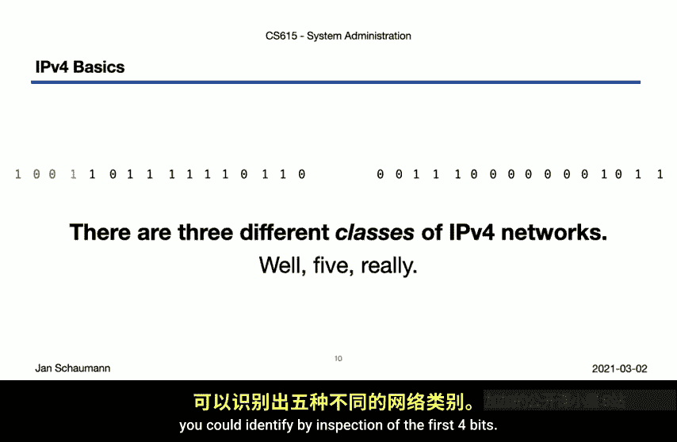
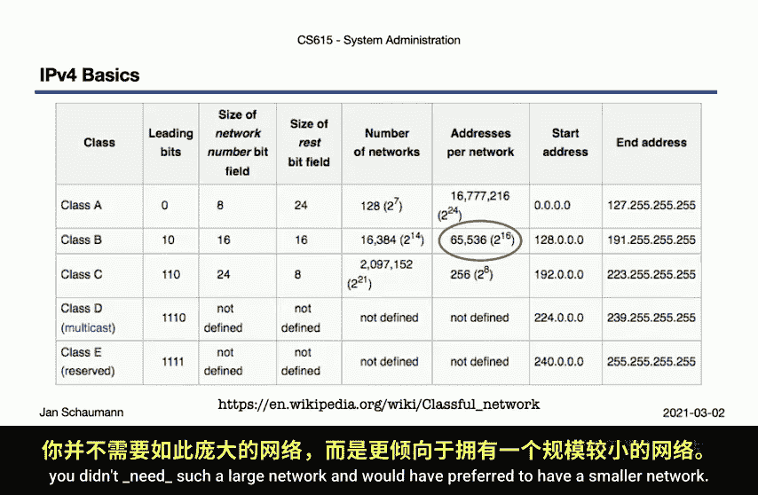
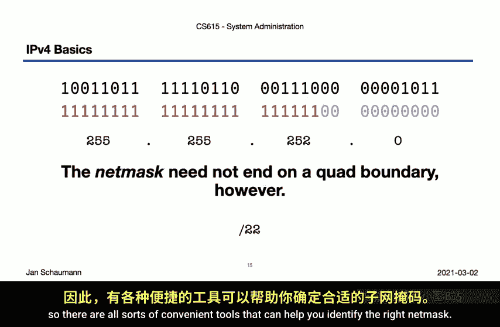
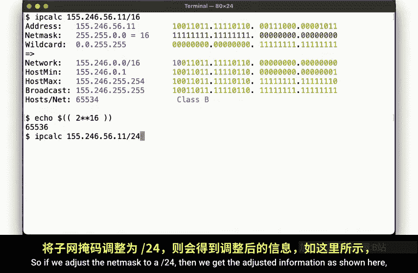
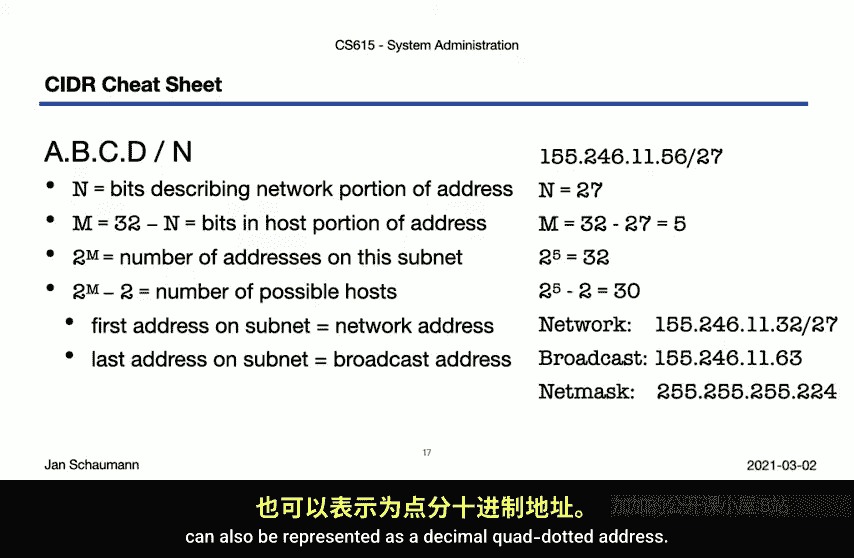
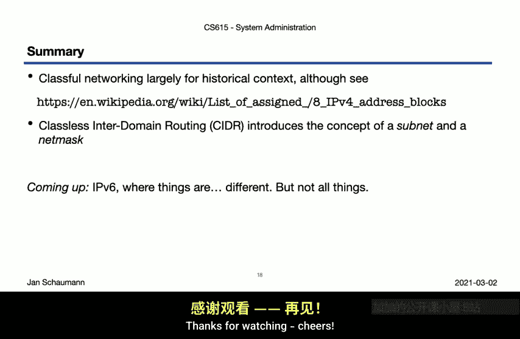

# 026：IPv4 基础与 CIDR 子网划分

## 概述

在本节课中，我们将学习 IPv4 地址的基本结构，了解如何通过地址判断设备所在的网络位置。我们将回顾互联网早期的网络分类概念，并重点学习目前普遍使用的无类别域间路由（CIDR）子网划分方法。

上一节我们详细分析了 IP 数据包的构成，本节中我们来看看 IPv4 地址本身。

## IPv4 地址的表示

在上一节的网络数据包图示中，我们注意到 IP 协议头包含两个 IPv4 地址：源地址和目的地址。在我们的例子中，目的地址是 `155.246.56.11`，即史蒂文斯理工学院 Web 服务器的地址。当然，在 IP 协议头中，这个地址是以二进制数字表示的。

这引出了第一个基本观察：**IPv4 地址是 32 位的数字**。这意味着整个 IPv4 地址空间有 2^32 种可能性。关于地址耗尽和 IPv6 的问题，我们将在下一节视频中讨论。

一个 32 位的二进制数字不便于记忆和使用，因此我们通常将这 32 位分成四个 8 位的组，称为“八位组”。每个八位组用一个十进制数值表示，并用点号分隔，这就形成了常见的点分十进制表示法，例如我们例子中的 `155.246.56.11`。当然，我们也可以使用十六进制来表示这些八位组，在 TCPDump 的十六进制输出中，目的地址就显示为 `9B F6 38 0B`。

## 网络部分与主机部分

但是，这个被分成四段的 32 位数字，如何帮助我们理解地址在网络中的位置，或者它能与哪些其他系统通信呢？

要理解这一点，我们需要知道每个 IP 地址都被划分为**网络部分**和**主机部分**。例如，我们可以观察到前 16 位代表地址的网络部分，后 16 位代表主机部分。

这有什么意义呢？拥有相同网络部分的主机可以在没有路由器帮助的情况下相互通信。我们称这为处于**同一个广播域**。这是网络层（第 2 层）和传输层（第 3 层）区别的一个例子。发往同一第 2 层网络内主机的数据包可以由网络交换机直接交付。如果目标主机在不同的网络上，则需要一个具备第 3 层功能的设备，例如路由器。

## 早期的网络分类

我们如何知道一个 IP 地址的网络部分是哪些位呢？在互联网早期，你只需要查看地址的前三位，它就能告诉你这个地址属于哪一类网络。

当时主要有三类网络：A 类、B 类和 C 类网络。实际上，通过检查前四位，可以识别出五类不同的网络。

以下是各类网络的判断方法：

*   **A 类网络**：如果 32 位 IP 地址以 `0` 开头，那么这就是一个 A 类网络。其前 8 位（第一个八位组）是网络部分，剩下的 24 位是主机部分。这意味着在同一个广播域内，可以寻址 2^24（超过 1600 万）台主机。
*   **B 类网络**：如果前两位是 `10`，那么这就是一个 B 类网络。其前 16 位（前两个八位组）是网络部分，后 16 位是主机部分。
*   **C 类网络**：如果前三位是 `110`，那么这就是一个 C 类网络。其前 24 位（前三个八位组）是网络部分，后 8 位是主机部分。
*   **D 类网络**：保留用于多播地址。
*   **E 类网络**：早期保留，以备将来使用。因为 IPv4 最初被设想为一个实验，所以预留了一部分地址。

所以，如果你有一个 B 类 IP 地址，意味着你有 16 位网络部分和 16 位主机部分，即你与大约 64,000 台其他主机处于同一个广播域。这是一个非常大的网络。很可能你并不需要如此大的网络，而更希望拥有一个更小的网络。

## 子网掩码与 CIDR

因此，我们不再仅仅通过查看 IP 地址的前几位来划分网络和主机部分，而是引入了**子网掩码**的概念。子网掩码是另一个 32 位的数字，用于“掩盖”原始地址中的某些位。其中所有为 `1` 的位代表网络部分，所有为 `0` 的位代表主机部分。

这种方法的优势在于，即使你拥有一个如上所示的 B 类网络 IP 地址，你也可以通过选择不同的子网掩码，将该网络进一步划分为更小的网络和子网。

例如，我们可以使用一个 24 位的子网掩码，留下 8 位作为主机部分。这实际上是在这个 B 类网络中创建了一个 C 类子网。这里的 24 个 `1` 在网络中可以用所谓的“斜线表示法”表示为 `/24`。我们也可以用十进制表示法来表示这个子网掩码，即 `255.255.255.0`。你可能见过这个子网掩码，它非常常见，因为它创建了一个大小合理的网络，同时便于人类快速识别该网络的起始和结束位置（正好在点分十进制的边界上）。

但子网掩码不必与十进制点边界对齐。毕竟，它本质上只是一串比特序列。所以，如果你想创建一个更小的子网，例如，可以使用一个 `/26` 网络，其十进制表示为 `255.255.255.192`。如果你需要一个更大的网络，则可能使用 `/22` 网络。

## 使用工具进行计算

幸运的是，我们不需要在头脑中执行这些逻辑运算。毕竟，计算机在处理数字，尤其是二进制数字方面比人类强得多。因此，有各种方便的工具可以帮助你确定正确的子网掩码。

例如，我们有 `ipcalc` 工具，你可以从你喜欢的包管理器中安装它。

如果我们传入我们的 IP 地址和以斜线表示法表示的子网掩码（在这个例子中使用 `/16`），那么我们会得到类似这样的输出。它向我们显示了 16 位的网络部分和全为 `1` 的子网掩码。但它也告诉我们，根据前两位的检查，这原本是一个 B 类网络地址。

由于主机部分剩下 16 位，我们现在知道了该子网上可以有多少台主机：接近 64K。但拥有 16 位，我们应该能得到 2^16 台主机，即正好 64K。但我们损失了两个地址，因为网络上的第一个和最后一个地址不能分配给主机。第一个地址是网络地址本身，最后一个地址是所谓的广播地址。发送到此地址的数据包将广播到网络上的所有主机。

如果我们将子网掩码调整为 `/24`，那么我们会得到调整后的信息，显示有 24 位网络部分和 8 位主机部分，产生 2^8 - 2 个可能的主机地址。

`/26` 子网掩码看起来像这样：26 位用于网络部分，6 位用于主机部分。

但 `ipcalc` 能为我们做更多事情。假设你想获取一个网络并创建不同大小的子网。例如，你想将一个现有的 `/24` 网络划分成三个子网，一个能容纳 24 台主机，一个能容纳 64 台主机，一个能容纳 48 台主机。那么正确的子网掩码是什么？

这就是 `ipcalc` 的用武之地。它向我们显示，对于第一个网络，我们需要使用 `/27`，能够容纳 30 台主机。对于第二个子网，我们需要 `/25`。对于第三个子网，我们需要 `/26`。`ipcalc` 还显示我们仍然有一些网络空间剩余，可以用剩余的 IP 地址创建另一个 `/27` 子网。

## CIDR 计算逻辑

`ipcalc` 向我们展示的是，CIDR 表示法的计算都遵循相同的逻辑。

假设你有一个 IP 地址 `A.B.C.D/N`，例如 `155.246.56.0/27`。

*   `N` 代表子网掩码中全为 `1` 的位数，即网络部分的长度（本例中为 27）。
*   总 IP 地址长度是 32 位，因此可用于主机部分的剩余位数是 `32 - N`（本例中为 `32 - 27 = 5`）。
*   此处可用的地址总数是 2 的那个数字次方，即 `2^(32-N)`（本例中为 `2^5 = 32`）。
*   但我们知道不能使用所有这些地址，我们必须减去 2 个：网络上的第一个地址（网络地址本身）和最后一个地址（广播地址）。
*   最后，子网掩码作为另一个 32 位数字，也可以表示为点分十进制地址。

## 总结

在本节视频中，我们简要提到了网络分类的历史背景。虽然这已不再使用，但理解它仍然有益。然后，我们讨论了通过使用子网掩码将网络划分为更小子网（子网划分）的概念，并识别了此过程中的不同逻辑步骤。

以上所有内容都适用于 IPv4。那么 IPv6 呢？我们将在下一节视频中讨论。你会发现 IPv6 世界中的情况有很大不同，但并非完全不同。这将非常有趣，请务必观看我们的下一节视频。感谢观看。