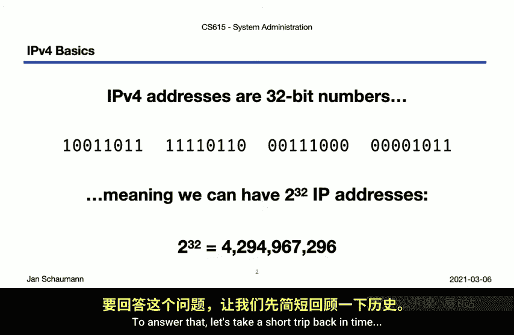
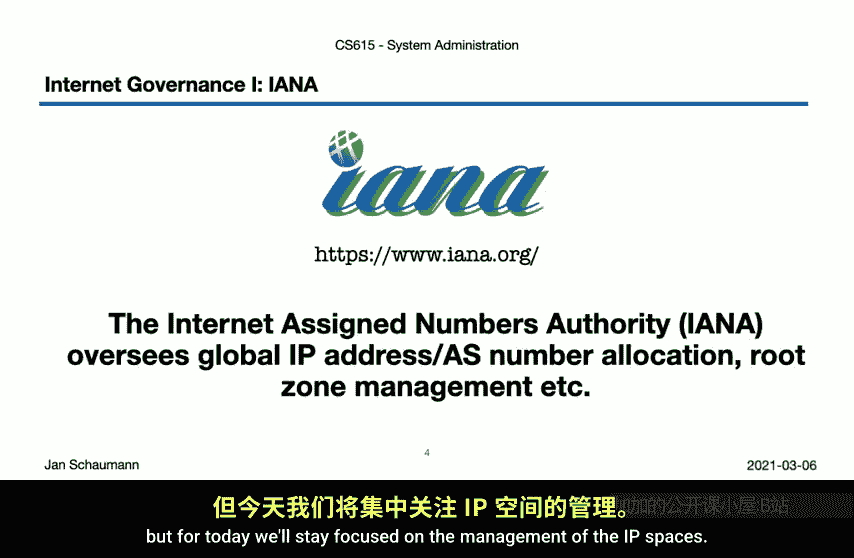
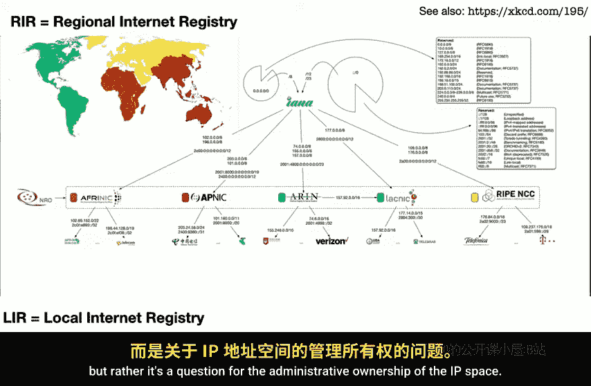
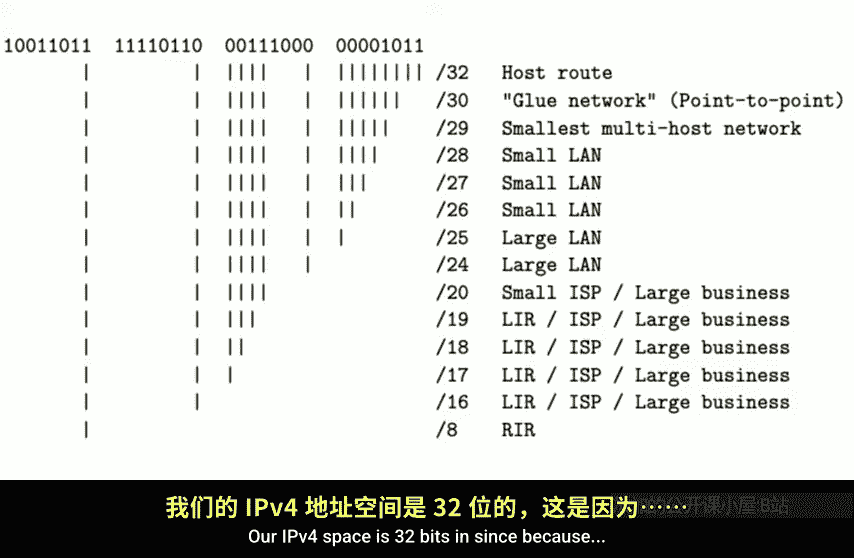
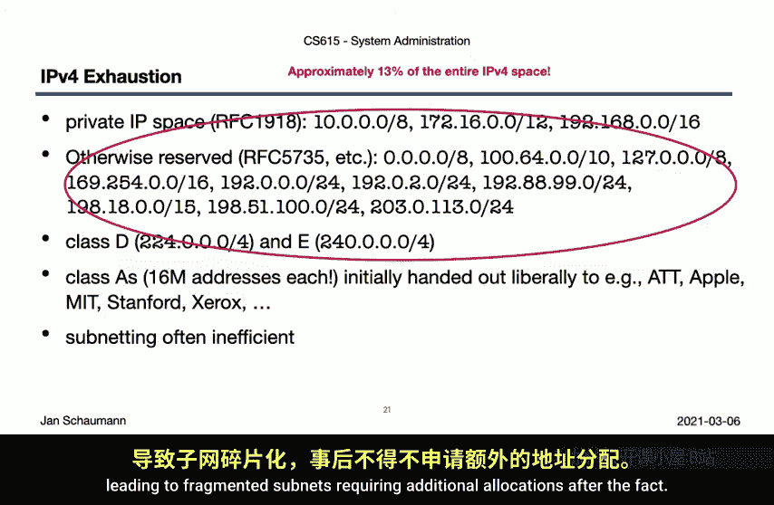
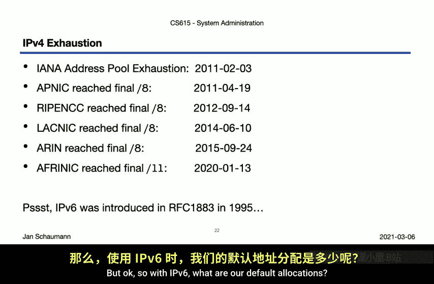
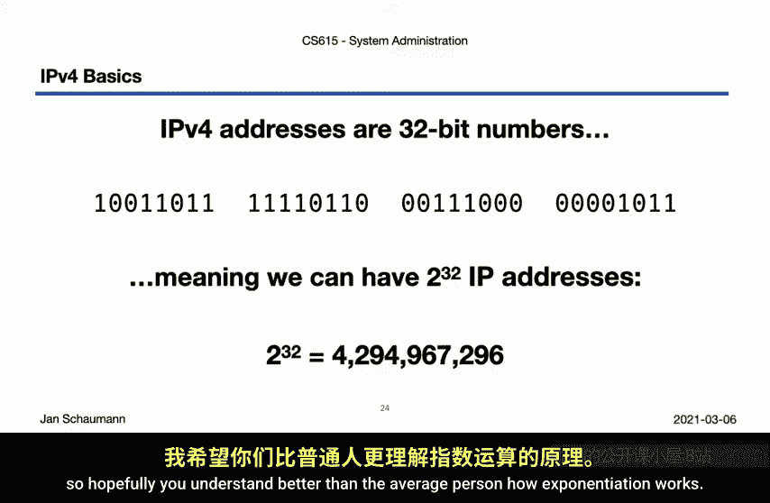
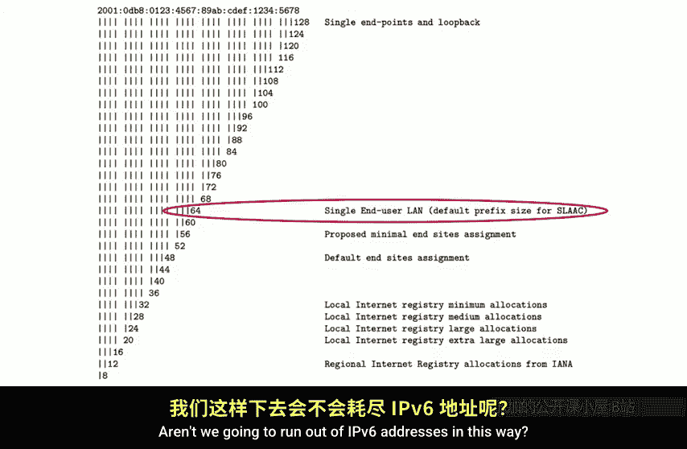
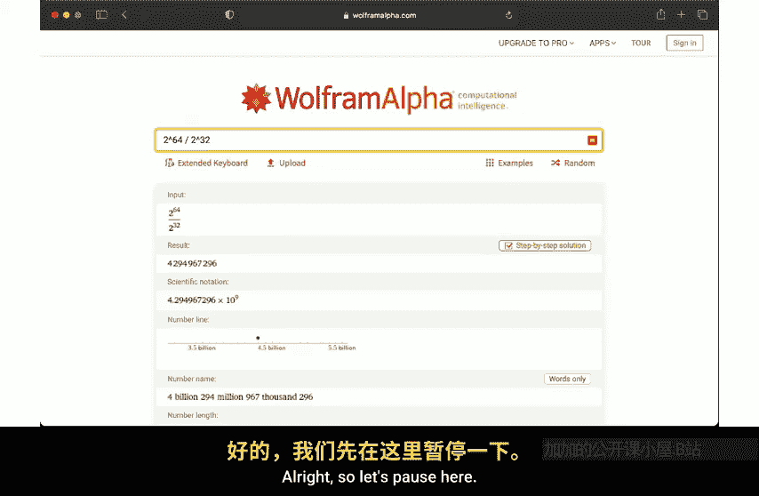
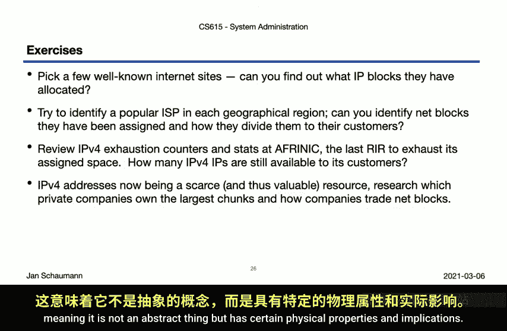

# 028：IP地址分配与IPv4耗尽 🌐

在本节课中，我们将学习IP地址的分配机制，并探讨IPv4地址耗尽的原因。我们将了解IP地址从何而来，以及全球互联网地址空间是如何被管理的。

---

## IP地址从何而来？🤔

上一节我们介绍了IPv4和IPv6的数据包头细节，但回避了一个核心问题：IP地址究竟从何而来？为什么我们同时拥有IPv4和IPv6？另外，IPv5发生了什么？

首先，让我们快速解答最后一个问题。确实存在一个使用协议版本5的IP层协议，即互联网流协议。逻辑上，也存在版本1、2和3的协议，其中版本3是TCP和IP被拆分开的第一个版本。

## IPv4地址空间与分配机制 📊

IPv4地址是一个32位的数字，这意味着我们最多可以有 **2^32** 个地址。**2^32** 是一个很大的数字，整个IPv4互联网地址空间大约有43亿个IP地址。这至少是理论上的空间。

那么，如何获得其中一个地址呢？许多系统通过DHCP等方式“神奇地”获取IP地址。这些地址来自哪里？以史蒂文斯理工学院为例，为什么我们几乎所有的IP地址都以155.246开头？

要回答这个问题，我们需要回到互联网的早期。当时，IP地址空间管理等事务很大程度上掌握在一个人手中——约翰·波斯泰尔。

约翰·波斯泰尔在互联网发展中极具影响力，最初管理着互联网号码分配机构。这意味着当组织需要分配IP空间时，由他负责处理。他还合著了大量RFC文档，包括那些成为域名系统基础的文档。但显然，让任何一个人负责IP地址空间分配是不可扩展的解决方案。

因此，IANA的管理权移交给了ICANN。这里我们略过了一位最伟大的互联网先驱和架构师的令人印象深刻的历史，强烈建议你自行阅读关于约翰·波斯泰尔的资料。你可能听说过波斯泰尔定律，也称为软件编程中的稳健性原则：“接受时要宽容，发送时要保守。”这也以约翰·波斯泰尔命名。

## 全球IP地址管理架构 🏛️

现在，我们有了ICANN，这是一个监督全球IP地址和自治系统号码分配、根区域管理等事务的非营利性标准组织。我们今天将重点讨论IP空间的管理。

ICANN控制着IPv4和IPv6空间，意味着它可以取出大的网络块并将其分配给其他实体。需要注意的是，图中显示的IP空间缺少某些部分，这些部分不可由ICANN分配。这是因为对于IPv4和IPv6，都有某些网络块被保留用于特殊用途，例如大家熟悉的RFC 1918私有IP空间及其IPv6等效空间。

在剩余可用的网络块中，ICANN可能会将大块地址分配给区域互联网注册管理机构，例如：
*   非洲网络信息中心
*   亚太网络信息中心
*   美国互联网号码注册机构
*   拉丁美洲和加勒比网络信息中心
*   欧洲网络协调中心

每个RIR管理特定地理区域的分配，这说明了互联网的分布式性质，尽管其起源明显在美国。顺便提一下，XKCD的艺术家兰德尔·门罗对IP空间做了一个简洁的插图，推荐查看。

## 分配层级与史蒂文斯理工的案例 🏫

RIR们松散地组织为号码资源组织，有助于协调这一层面的内部治理。每个RIR都从ICANN获得了IP空间分配，然后可以进一步划分这些网络块，并将其分配给所谓的本地互联网注册管理机构使用或进一步分配。大多数LIR是互联网服务提供商、学术机构或大型企业。

回到我们最初的问题：史蒂文斯理工学院是如何获得其IP空间的？它是由ARIN从ICANN分配给它的网络块中分配而来的。然而，ARIN由于早期以美国为中心的互联网管理，是一个特例。ARIN确实收到了大量历史性分配，然后它可能会进一步分配给另一个RIR。

我们看到IP空间实际上可能具有地理属性。如果你长期处理这些网络，甚至可能记住一些，并知道连接到系统的流量来自亚洲。但这可能有点误导性，因为IP地址本身并不固有地绑定特定的物理位置，而是一个关于IP空间管理所有权的问题。然而，这反过来可以被全球地理位置数据库所利用。

LIR可以进一步根据需要委托网络块，可能使用我们之前讨论过的CIDR进行划分。例如，我们知道史蒂文斯理工学院被分配了155.246.0.0/16网络块，并将155.246.89.0/24分配给了计算机科学系。我们还可以观察到，威瑞森在几年前收购雅虎后，成为了所示网络的新所有者，并特别将几个IP地址分配给了特定服务。

## IPv4地址耗尽危机 ⚠️

现在我们知道IP地址来自哪里了，但为什么我们除了IPv4还需要IPv6呢？回想一下我们刚刚讨论的分配。我们的IPv4空间是32位，因为Vint Cerf等人认为这对于一个看看“互联网这东西”能否成功的小实验来说是一个合理的选择。

结果它成功了。而我们从此就一直困在这个32位的空间里。尽管43亿个地址听起来很多，但实际上并非如此。首先，我们甚至无法获得完整的2^32空间用于互联网。如前所述，有些区块被保留，例如私有IP空间，以及其他几个用于不同目的的网络块，它们总共约占整个IPv4空间的13%。

不仅如此，在互联网早期，分配相当宽松。因此，一些早期参与者确实获得了整个A类网络（超过1600万个地址）分配给了AT&T、苹果、麻省理工学院等。另一个问题是组织自身分配空间效率不高，导致子网碎片化，事后需要额外分配。

当然，我们现在把灯泡、冰箱和牙刷都连上互联网，每个都需要IP地址，这无助于缓解问题。因此，我们最初拥有的2^32个地址很快就开始耗尽。ICANN大约在10年前耗尽了未分配的/8网络池，随后RIR们也迅速跟进：APNIC在2011年4月，RIPE NCC在2012年，LACNIC在2014年，ARIN在2015年，而AfriNIC在去年1月耗尽。这意味着我们在IPv4空间里正式耗尽了IP地址。43亿个地址几乎用完了。这是一个我们早就知道会到来的问题。

这就是为什么IPv6早在1995年就被引入，以及为什么看到在ICANN耗尽可分配的IPv4地址十年后的今天，仍然有组织和公司不支持IPv6，是如此令人失望。

## IPv6的广阔空间与分配 🚀

那么，对于IPv6，我们的默认分配是怎样的呢？

RIR通常被分配一个/12，然后它们以低至/32的块委托给LIR，LIR再以/48的块委托给最终用户。而最终用户设备（例如你的Wi-Fi接入点分配给你的地址）大部分是/64。想想看，大多数最终用户将获得一个/64。这听起来非常浪费。当然，你可以把你所有的冰箱、电视、灯泡和牙刷都放在这个/64网络上，但你仍然剩下那么多基本上被浪费的IP。我们不会以这种方式耗尽IPv6地址空间吗？😊

要理解为什么这不是问题，关键在于理解IPv6空间到底有多大。2^32是43亿个地址，我们刚刚意识到这真的不算多。现在你是计算机科学专业的学生，所以希望你能比普通人更好地理解指数运算的工作原理。

但让我们来说明一下IPv6空间中可用的地址数量。2^128是一个像这样的数字：39位十进制数，340 undecillion, 282 decillion, 3 sextillion, 66 quintillion。一个非常大的数字。这个数字有多大？让我们看看。

我们可以给地球上的每个人分配多少个IP地址？好吧，那是每人4.41 x 10^28个IP地址。这很难想象。一个普通人身上有多少个原子？大约7 x 10^27个。所以，我们可以给地球上每个人的每个原子分配IP地址。一个“原子互联网”。

我们还知道什么东西很多？星星。哦，银河系里的星星都不足以在这里真正产生影响。可观测宇宙呢？嘿，我们可以给可观测宇宙中的每颗星星分配340万亿个IP地址。如果可观测宇宙中的每颗星星都有一个像我们这样的星球呢？那么，我们可以给可观测宇宙中每颗星星的“地球”轨道上的每个人分配超过44000个IP地址。

这就是我们拥有的IP地址数量，这就是为什么给每个最终用户分配一个/64不会耗尽IPv6地址池。即使通过分配一个/64（即18 quintillion个地址），我们也是在给每个最终用户43亿个IPv4互联网。我知道指数运算很有趣，对吧？无论如何，我希望这里的这一点能让你对IPv6地址空间的大小有所了解。再多玩玩它，Wolfram Alpha是处理这类事情的一个相当不错的引擎。

## 总结与思考题 💡

好了，我们在这里暂停一下。我们已经看到了IP地址是如何分配的：ICANN将网络块分配给RIR，RIR进行划分并分配给LIR，LIR然后可以进一步委托或分配它们。

现在，看看周围。你能找出哪些IP块属于哪些公司或组织吗？你如何找出一个IP块分配给了哪个地理区域？

接下来，为了更好地理解IPv4耗尽在实践中意味着什么，并从RIR的角度出发，查看RIPE NCC提供的信息，看看他们还有多少IP地址可以分配。同时，思考为什么AfriNIC是最后一个耗尽的，以及这对全球互联网普及和流量分布说明了什么。

思考一下当一种资源变得稀缺时通常会发生什么。通常，会出现一个新的市场。你能找出组织可以在哪里以及如何交易他们可能不再需要的IP空间吗？所有这些问题都是为了让你从现实世界的角度思考互联网。这意味着它不是抽象的东西，而是具有某些物理特性和影响。

我们将在下一个视频中深入探讨互联网物理结构的一些细节。到时见，感谢观看。再见。

---

**本节课总结**：在本节课中，我们一起学习了IP地址的全球分层分配机制，理解了IPv4地址空间有限且已耗尽的原因，并认识了IPv6地址空间的巨大规模及其分配方式。我们了解到互联网地址管理是一个涉及ICANN、RIR和LIR的多层现实世界体系。