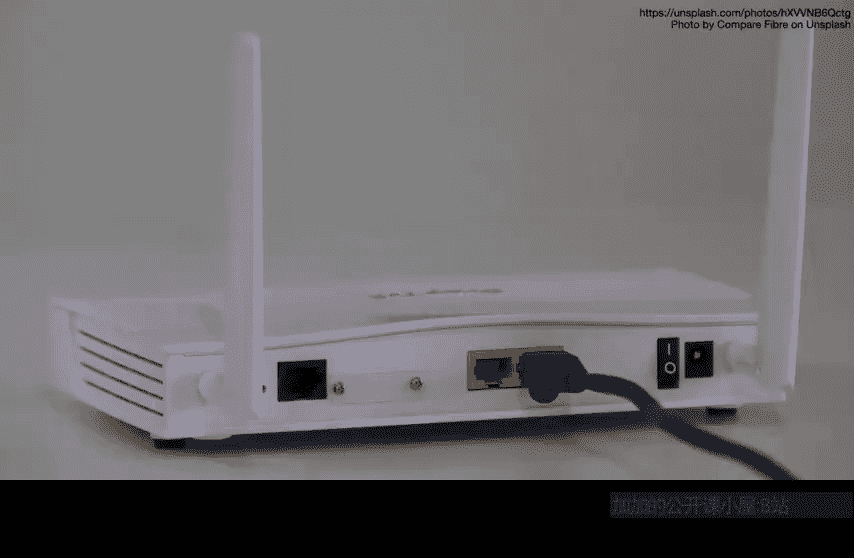
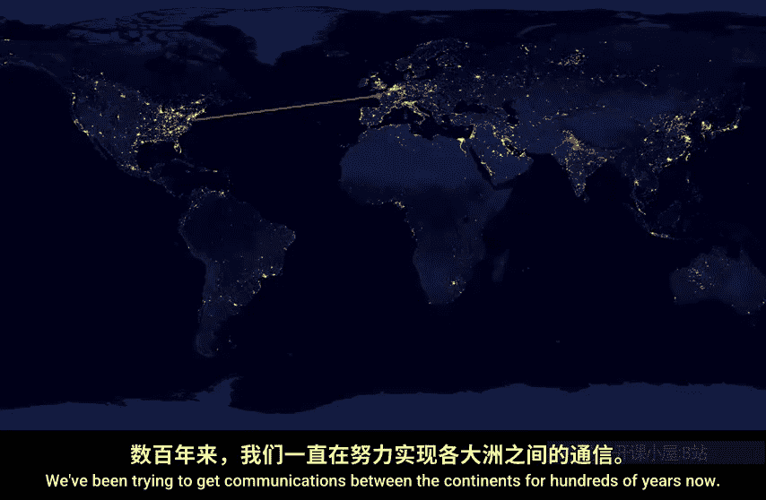
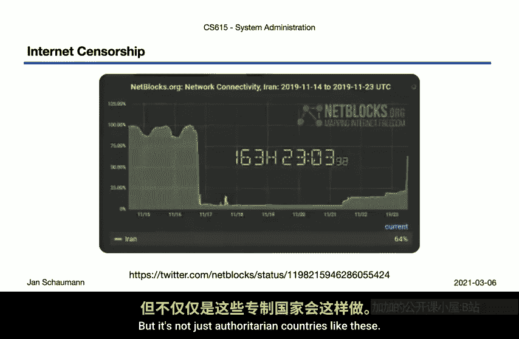
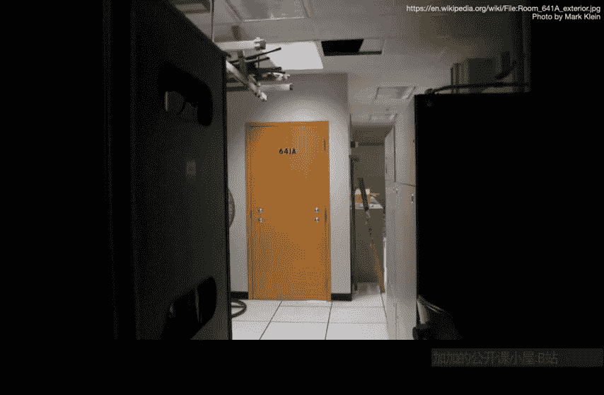

# 029：第5周第5节 - 物理互联网 🌐

## 概述
在本节课中，我们将要学习互联网的物理层面。我们将从数据包如何通过物理线路传输开始，探讨海底电缆的铺设与风险，并分析物理基础设施如何影响网络连接、审查制度乃至地缘政治。理解这些物理现实，对于系统管理员全面把握网络运行环境至关重要。

## 从抽象到物理：数据包的旅程
上一节我们介绍了IP地址的分配与地理划分。本节中，我们来看看数据包在物理上是如何从A点流动到B点的。

如果是一条点对点的链路，数据包的路径非常清晰。数据包从一端进入，从另一端出来。你可以沿着物理线缆从一端追踪到另一端。

即使是笔记本电脑与Wi-Fi接入点之间的通信，连接也相对容易理解。数据包到达接入点后，进入线缆，然后从你的互联网服务提供商（ISP）传送到某个机房或数据中心的交换机端口。

此时，数据包进入了“矩阵”。大多数人，甚至计算机专业的学生，对于互联网在这一层面的样貌也只有一个抽象的概念。将其比喻为“一系列管道”其实并不过分，因为本质上就是通过线缆连接，数据包在其中流转、转向和重定向。

## 全球网络与跨洋连接
互联网是一个全球网络。想象物理线缆跨越国家、在建筑物之间铺设是容易的，数据流也确实与人口密度相关，正如NASA的夜间灯光图所显示的那样。

但问题在于：我们如何将数据包从密集区域传送到其他地方？跨大陆通信并非新问题。自19世纪50年代起，人们就开始在海底铺设超长电缆以实现欧美间的电报通信。令人着迷的是，我们今天依然在做同样的事情。

我们使用装有数千公里网络电缆的特种船只，将长长的电缆铺设到海底，有时还会使用特殊的海底电缆犁将其埋入海床。虽然技术含量高，但原理简单：一根非常长的电缆。这是互联网物理层面需要牢记的一个方面，因为它带来诸多影响。

一方面，物理距离决定了理论上的最低延迟。例如，纽约与巴黎相距约5800公里，光速约为每秒300,000公里，这意味着一个数据包的单向传输不可能快于**约19毫秒**（计算：`5800 km / 300,000 km/s ≈ 0.0193 s`），实际中由于各种开销，延迟会更高。

## 海底电缆：动脉与风险
这些连接国家的电缆被称为海底互联网电缆，由不同的公司运营，包括通信供应商和一些互联网巨头。`submarinecablemap.com` 这个网站可以让你缩放并查看所有不同的电缆，非常有趣。

但将电缆铺设在海底意味着风险。电缆可能被好奇的鲨鱼咬坏，也可能被在港口外抛锚的船只的锚意外割断，导致严重的网络中断。

以下是部分重要海底电缆的例子：
*   **AEC-2电缆**：连接丹麦、挪威、爱尔兰和美国，长约8000公里，由包括Facebook和Google在内的财团运营，容量为每秒18太比特。其在美国的登陆点位于新泽西州沃尔镇，靠近史蒂文斯理工学院。
*   **日本-美国电缆**：横跨太平洋，经停夏威夷。
*   **东南亚-中东-西欧电缆**：从新加坡到法国。2008年，该电缆被意外切断，导致多个国家至少部分失去了互联网连接。

由此可见，这些主要通信线路一旦被破坏，无论是意外还是故意，都可能造成严重影响。

## 物理控制与网络访问
你可能听过约翰·吉尔摩的名言：“网络将审查视为损坏，并绕开它。”这强调了互联网分布式架构的好处。但不幸的是，这并不完全正确。

如果你拥有足够的权力并愿意承担后果，你确实可以审查或中断大部分公民的互联网接入。独裁者和威权政府越来越多地行使这种权力。当权者非常害怕民众自由沟通的能力，因此互联网必然对他们构成巨大威胁。

每当发生起义或政治动荡时，掌权政府都会尽力压制人民的沟通能力。例如：
*   **缅甸**：在2021年2月军方接管政权后的抗议活动中，切断了互联网。
*   **伊朗**：2019年，最高国家安全委员会在抗议期间下令完全断网。
*   **印度**：这个世界上人口最多的民主国家，却是互联网关闭次数最多的国家。其查谟和克什米尔地区曾经历长达6个月的断网，造成了超过24亿美元的经济损失和50万个工作岗位的流失，这说明了互联网接入在当下已是一项基本人权，而政府却越来越愿意且能够限制它。

如果你控制着负责物理传输数据包的法律实体，你就可以限制人们的访问。但这种权力不仅限于简单的“开”或“关”。

## 监控与伦理困境
更进一步，你能够访问流经你所控制的物理设备的所有通信。因此，如果有法律权力迫使私营企业监听所有经过的数据包，那么像美国政府这样的政府也会这么做就不足为奇了。

图中是旧金山AT&T大楼内的“641A房间”，一个秘密的网络机房。AT&T员工马克·克莱恩发现这个上锁的房间镜像了所有网络流量，他随后成为举报人，揭露美国政府不仅对全球通信（几乎所有大型情报机构都这么做），还试图对美国公民的通信进行无证监视和数据挖掘。

这一切再次强调了一个观点：无论我们多么专注于比特、字节、软件和系统管理，归根结底，我们都在**第9层（政治/社会层）** 之上运作。我们的工作本质上是政治性的。互联网工作促进或禁止信息的自由流动；连接性、路由和网络协议设计都必须考虑意外或故意的滥用；我们必须理解强大行为者（包括你自己的政府）的影响和能力。

正如马克·克莱恩所示，有时，我们必须做出艰难的决定，将政治影响置于工作保障之上。因为即使我们自己不在不同司法管辖区之间铺设电缆，互联网的物理层面仍然是我们工作中一个始终存在的因素。

## 总结
本节课中，我们一起学习了互联网的物理基础设施。我们从数据包的物理路径开始，了解了全球网络如何通过海底电缆连接，并认识到这些物理资产面临的意外风险（如鲨鱼、船锚）和故意破坏风险。更重要的是，我们探讨了物理控制如何直接转化为网络访问控制、审查和监控能力，使得互联网接入成为一个政治议题。作为系统管理员，理解这些物理现实及其政治含义，对于负责任地设计、管理和维护网络系统至关重要。

在接下来的章节中，我们将进一步探讨网络所有权问题，并审视物理互联网所反映的政治结构。在此之前，请务必查看幻灯片中包含的各种链接，阅读有关各种网络中断事件的资料，或许还可以研究一下互联网上其他重大的破坏性事件。我相信你会发现许多以前未曾仔细考虑的、有趣的信息，并开始将互联网视为一个更具体、更实在的物理存在。

感谢观看，下次再见。