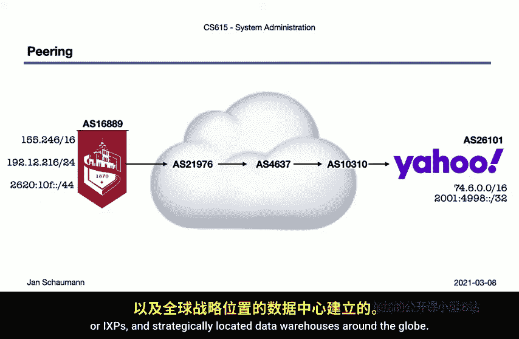
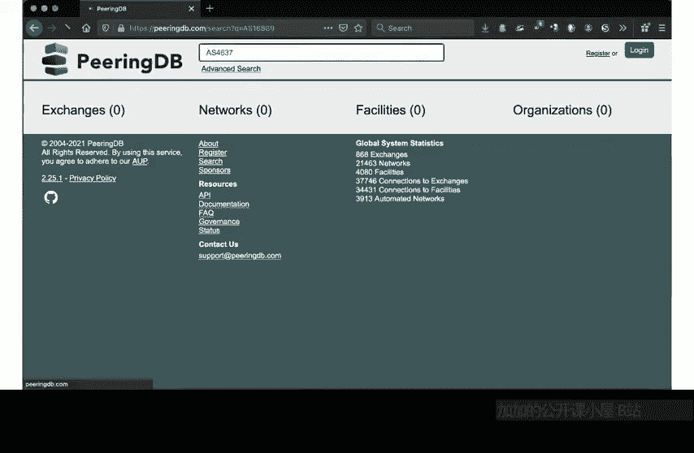
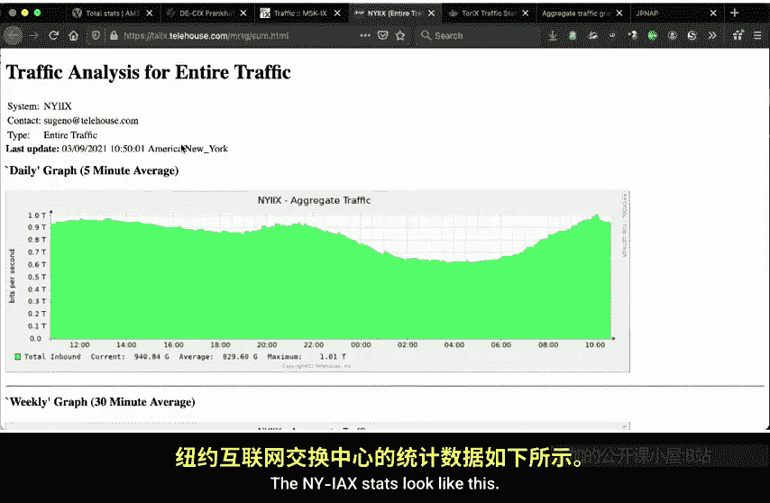
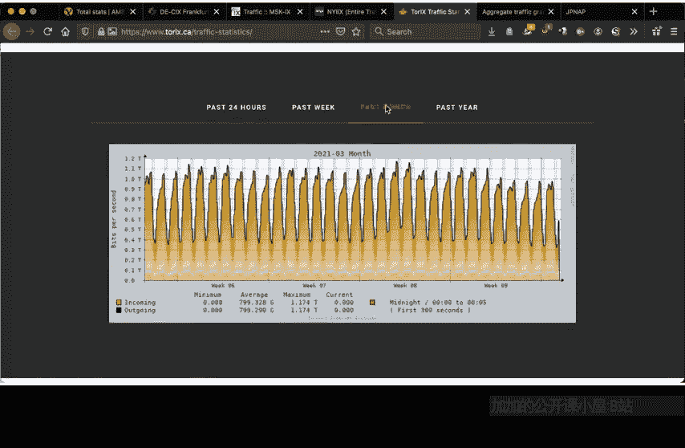
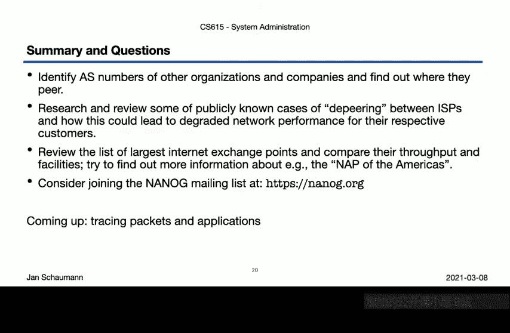

# 030：网络的网络 🌐

## 概述
在本节课中，我们将学习互联网的本质——它并非一个单一的网络，而是由众多独立网络相互连接构成的“网络的网络”。我们将探讨这些网络如何组织、如何被识别，以及它们之间如何通过“对等互联”建立连接。

---

## 网络的物理本质与法律实体
上一节我们探讨了互联网的物理构成及其现实影响。本节中，我们来看看互联网具体是如何由独立网络构成的。

我们已经知道，我们通过例如海底通信光缆等物理设施连接全球互联网，这些光缆将各大洲连接起来。我们直观地理解，这些光缆的端点显然由不同的法律实体控制，因此，由它们实现的连通性也由这些实体管理。

这正是互联网本质的一个直接体现：互联网不是一个单一网络，而是一个**网络的网络**。这个网络的网络自20世纪60-70年代起步以来，已经取得了巨大的发展。

早在1984年，Sun Microsystems的约翰·盖奇就提出了“**网络就是计算机**”的说法，意指所有计算机都只是连接到更大网络的接口。将计算资源全部置于网络上的想法并不新鲜。

但这确实带来了一些混淆，因此有必要澄清：**网络就是网络，计算机依然是计算机**。然而，这个网络本身并不是一个单一网络。尽管我们通常认为通过网络可达的计算资源存在于神奇的“云端”，但系统管理员非常清楚：**没有云端，只有别人的计算机**。毕竟，总得有人在某个地方维护这些资源。

---

## 从局域网到自治系统
现在，让我们更聚焦于网络，或者说构成这个网络的各个网络。

网络有增长的趋势。如果我们连接两个端点，这很简单。但当我们连接多个设备时，正如我们之前讨论过的，我们需要一个网络层。如果设备在同一个广播域内（例如通过交换机连接），那么我们拥有的是一个**第二层网络**。我们可以使用第三层设备（即路由器）将多个这样的第二层网络连接起来。通过这种方式，我们也讨论过需要补充我们的IP地址块。

当然，我们最终会希望连接多个这样的网络。当我们这样做时，我们开始谈论**自治系统**——即被分组在一起的网络集合。这样一个自治系统内的各个网络，可能由使用独立IP地址空间的独立网络组成。这些IP地址空间，正如我们在之前的视频中讨论的，是由IANA分配给区域互联网注册管理机构，再分配给本地互联网注册管理机构的。

当我们连接这些自治系统时，我们就在构建互联网。

---

## 互联网的可视化与路由
这里展示的是1997年左右互联网路由路径的可视化图，按分配地址空间的RIR进行了颜色编码，并通过连接路径分组。图中的中心星点代表连接到更多其他网络的系统。

到了2021年，这个网络看起来有些不同，显然有了更多的网络、更多的网络间连接和更多的地理区域，但它仍然像以前一样代表路由路径。

这些路由路径主要基于对这些自治系统的了解，因为**边界网关协议**会共享其路由信息，即不同网络通过其AS编号可达的信息。

---

## 如何获取AS编号？
那么，我们从哪里获得AS编号呢？还有谁比分配IP地址空间的同一实体更适合分配AS编号呢？

是的，我们再次回到**IANA**，它将AS编号块分配给RIRs，然后RIRs再分配具体的AS编号，其管理方式与IP地址块类似。

---

## 查询网络信息：`whois`命令
以下是一种查询给定网络块分配信息的方法：使用`whois`命令，该命令通过whois协议查询各个网络信息中心。

如你所见，查询通常从IANA开始，然后可能会查询相关的RIR以获取信息。这种方式与DNS协议类似，我们将在未来的视频中详细讨论DNS。

如果我们想查询史蒂文斯理工学院的网络信息，我们可以传入其Web服务器的IP地址。然后我们可以看到，IANA告诉我们它已将`155.0.0.0/8`地址块分配给了ARIN，而ARIN则告诉我们，它于1991年将`155.246.0.0/16`地址块分配给了史蒂文斯理工学院。ARIN还提供了一个URL，可提供关于此网络块的额外信息。

从这些信息中，我们可以提取出史蒂文斯理工学院的AS编号是**16889**。如果我们更详细地查看ARIN的信息，会发现史蒂文斯理工学院被分配了多个IP地址块，而不仅仅是常见的`155.246.0.0/16`。事实上，看起来史蒂文斯理工学院还被分配了一个IPv6网络，只是似乎使用得不多。

---

## 追踪数据包路径：`traceroute`
现在，我们可以开始可视化我们的网络如何连接到其他网络。假设这里的底部网络代表史蒂文斯理工学院，即AS 16889，以其认为合适的方式使用其网络块。

那么，史蒂文斯理工学院连接到的网络的AS编号是多少？为此，我们只需找出当与互联网上某个Web服务器通信时，我们的数据包所经过的路径。我们将在接下来的一个视频中更详细地研究`traceroute`工具的工作原理。

当我们追踪到雅虎网站的数据包时，返回的输出会显示沿途的不同跳点。我们看到，数据包从起点跳转到`155.246.0.0/16`网段内的另一个地址，然后是一个RFC 1918私有网络地址，接着是其他一些`155.246.0.0/16`地址，之后离开史蒂文斯理工学院网络，最终找到通往雅虎网络的路。

现在，让我们看看这里的第一个非史蒂文斯理工学院地址。这个地址属于新泽西高等教育网络分配的一个网段。我们可以使用一个专门提供此类信息的whois服务器来获取其AS编号。这样很方便，我们识别出了下一个网络的AS编号，在本例中NJH的AS是**21976**。

我们可以为沿途的每一跳手动执行此操作，但幸运的是，`traceroute`工具有一个选项可以为我们完成这项工作。于是我们得到：史蒂文斯理工学院 AS 16889 -> NJH AS 21976 -> AS 4637 -> AS 10310（似乎是雅虎的AS编号），此外还有AS 26101，这表明一个组织当然可以拥有多个AS编号。

有了这些信息，我们现在可以填充数据包如何穿越不同网络的图像：史蒂文斯理工学院AS 16889连接到NJH AS 21976，后者连接到AS 4637，再从那里连接到雅虎的AS 10310和AS 26101。

---

## 网络互联：对等与交换点
我们看到，网络之间的连接是在特定位置建立的。连接不同网络的这个过程称为**对等互联**，它以这些实体的系统之间的实际物理连接形式进行，允许它们通过BGP交换路由信息。

这些连接发生在所谓的**对等点**或**互联网交换点**，即全球战略位置的数据中心。

关于这一点，就像互联网上的许多事物一样，很棒的一点是它主要是公开信息。也就是说，我们可以在例如**PeeringDB**网站上查询谁在什么地点与谁对等。

如果我们输入NJH的AS编号21976，我们会看到关于该组织的大量信息，包括它在哪些IXP进行对等。其中之一是纽约国际互联网交换点。我们也可以在此处AS 4637下一跳的DNS名称中看到这一点。AS 4637属于Telstra公司，然后它连接到AS 10310，这是雅虎的AS编号之一。这里的条目显示了雅虎进行对等的所有IXP，结果证明在全球有相当多。

数据包在进入AS 26101之前，在AS 10310内跳转了一会儿。但我们没有在PeeringDB中找到AS 26101，也没有找到史蒂文斯理工学院的AS 16889。这是因为并非每个网络都直接在公共IXP与其他网络对等。除了公共对等位置，当然也存在**私有连接**，例如史蒂文斯理工学院和NJH之间的连接，后者在此处提供了通往更大互联网的网络连接。

像Telstra的AS 4637这样的大型网络会连接更多其他网络，从而成为我们在本视频开头看到的网络可视化图中的中心点。

---

## 互联网交换点的规模与统计
可以想象，这些对等点，即大型运营商之间建立连接的互联网交换点，需要拥有一些“大管道”。由于这是一个重要的卖点，你通常可以在它们的网站上找到一些有趣的统计数据。

阿姆斯特丹互联网交换点是世界上最大的IXP之一，显示日吞吐量达9.4太比特/秒。每日统计数据很好地显示了流量如何在夜间下降，白天上升，晚餐后达到峰值，然后再次下降。月度年度统计数据则显示了随时间推移总吞吐量的增长。

德国的DECIX，另一个世界最大的IXP，也有一些显示类似模式的统计数据。莫斯科交换点也是如此，尽管这里的吞吐量略低于阿姆斯特丹或法兰克福，IPv6的速率甚至更低。纽约、多伦多和瑞典的Netnod交换点的统计数据都呈现相似的模式和风格。

这并不奇怪，因为它们都是使用标准的开源网络流量绘图工具之一**MRTG**生成的。如果你参与任何网络架构和管理工作，你很可能会非常熟悉看起来都像这样的图表。

---

## 总结
本节课中，我们一起学习了互联网作为“网络的网络”的基本结构。我们了解了自治系统的概念、如何通过`whois`和`traceroute`工具查询网络和AS信息，以及网络之间如何通过对等互联和互联网交换点连接起来。我们还看到，网络流量可以通过工具进行测量和可视化。

为了确保你内化我们在此说明的经验，建议你尝试使用本视频中展示的工具，识别其他组织和公司的AS编号，并找出它们在何处进行对等。尝试了解当两个组织发生争议，一方想要取消与另一方的对等连接时会发生什么（已有数起竞争公司利用此手段或威胁取消对等来损害竞争对手的案例）。你可以在维基百科上找到最大互联网交换点的列表，并浏览它们的网站以查找我们刚才展示的统计数据。此外，也可以研究一些开放性较低的地点。

如果所有这些让你足够感兴趣，以至于你想成为真正从物理上构建互联网的网络运营商社区的一员，你可以加入北美网络运营商小组。其公共邮件列表是一个非常有趣的地方，可以了解互联网的结构以及大多数高层人士从未考虑过的各个方面。

至此，我们结束了第一周的网络主题学习，但正如我所承诺的，关于这个话题我们还没有结束。在接下来的几个视频中，我们将再次深入到数据包层面，追踪不同应用程序和协议流量，同时也需要看看我们的主机如何知道以及向何处发送数据包。你将非常熟悉`tcpdump`和各种统计工具。希望你能期待接下来的内容。