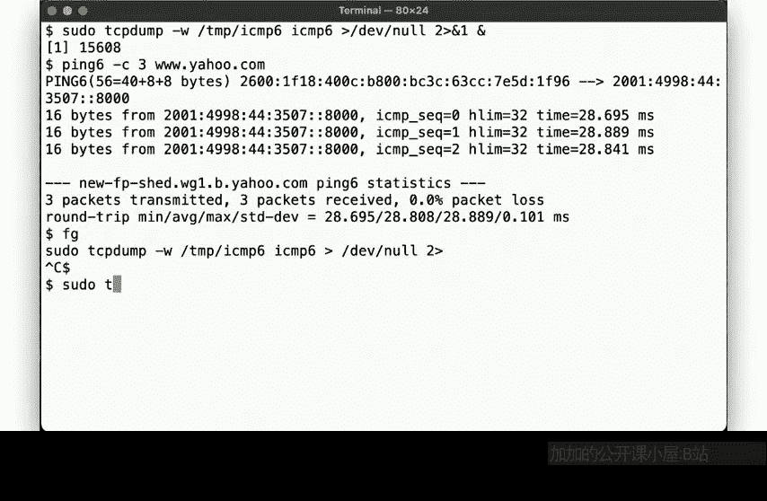
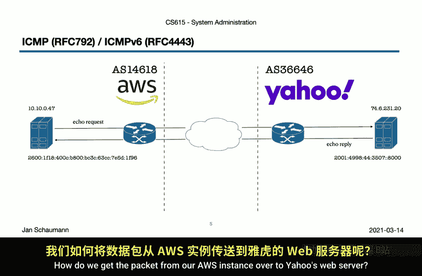
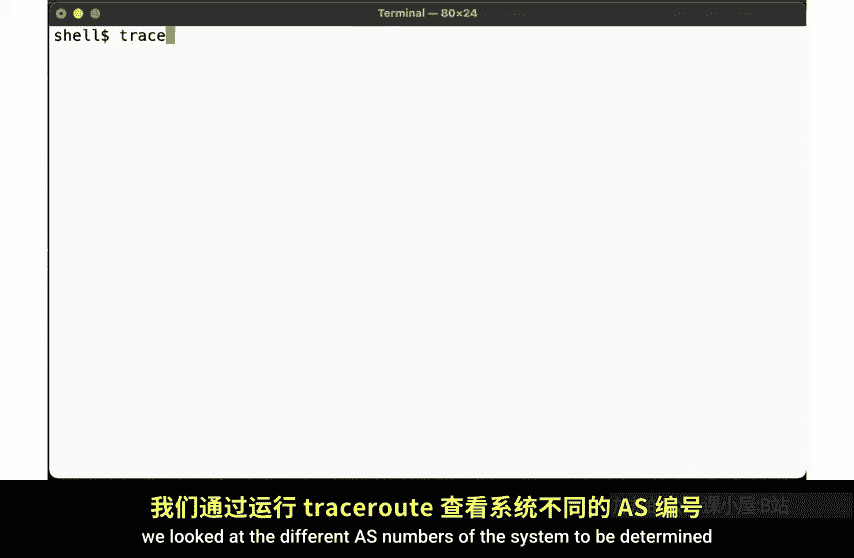
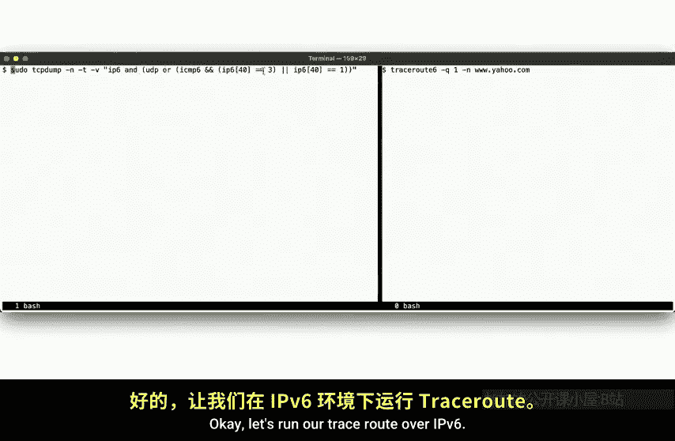
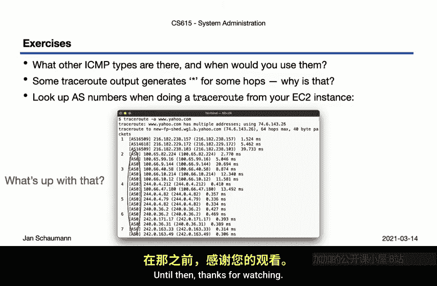

# 034：ICMP 🔍

## 概述
在本节课中，我们将学习互联网控制报文协议。我们将通过分析两个最常用的ICMP应用——Ping和Traceroute——来理解其工作原理，并观察它们在IPv4和IPv6环境下的具体表现。

---

## ICMP简介
上一节我们介绍了网络协议的基础，本节中我们来看看ICMP。ICMP是互联网控制报文协议，用于在IP主机和路由器之间传递控制消息。它对于网络诊断和故障排除至关重要。

## Ping：网络连通性测试
Ping是用于测试网络连通性的基本工具。它通过发送ICMP回显请求报文并等待回显应答来工作。

以下是使用`tcpdump`捕获和分析Ping数据包的基本步骤：

1.  在主机上启动`tcpdump`，捕获IPv4 ICMP数据包：
    ```bash
    sudo tcpdump -i any icmp
    ```
2.  使用`ping`命令向目标地址（例如 `www.yahoo.com`）发送三个回显请求：
    ```bash
    ping -c 3 www.yahoo.com
    ```
3.  观察`tcpdump`的输出，可以看到主机发送的每个回显请求都触发了来自远程服务器的回显应答。

ICMP回显请求/应答数据包格式相对简单。根据RFC定义，其结构包含：
*   **类型**：8表示回显请求，0表示回显应答。
*   **代码**：对于此类消息，通常为0。
*   **标识符**：用于匹配请求与应答。
*   **序列号**：用于标识报文序列。
*   **数据**：可选的数据部分。



数据部分可用于在故障排除时更好地识别和跟踪数据包。例如，可以使用`-p`标志在`ping`命令中填充特定数据：
```bash
ping -c 1 -p 48656c6c6f www.example.com
```
使用`tcpdump -X`查看完整数据包时，可以看到填充的数据。这虽然通常无害，但也展示了协议可能被用于非预期用途（如数据隐蔽传输），因此理解协议细节很重要。



## IPv6中的Ping
无论使用IPv4还是IPv6，Ping的工作原理基本相同。在IPv6中，ICMPv6同样用于回显请求和应答。



以下是捕获和分析IPv6 Ping数据包的步骤：

1.  捕获ICMPv6回显请求和应答数据包：
    ```bash
    sudo tcpdump -i any icmp6 and \"icmp6[0] == 128 or icmp6[0] == 129\"
    ```
2.  运行IPv6 Ping命令：
    ```bash
    ping6 -c 3 ipv6-target-host
    ```
3.  观察到的数据包交换与IPv4类似：发送回显请求，目标回复回显应答。

## Traceroute：路径追踪
Ping告诉我们目标是否可达，但无法揭示数据包经过的路径。这正是Traceroute的用途。它用于发现数据包从源系统到目标系统所经过的路由路径。

Traceroute巧妙地利用了IP数据包的**生存时间**字段。TTL决定了数据包在被丢弃前能经过的最大路由器跳数。

以下是Traceroute在IPv4中的工作原理：

1.  首先发送一个TTL设置为1的UDP数据包（目标端口通常是一个高端口号，如33435）。
2.  第一个路由器将TTL减1，发现TTL变为0，于是丢弃该数据包，并向源主机发送一个**ICMP超时**消息。这样我们就知道了第一个路由器的IP地址。
3.  接着发送一个TTL设置为2的UDP数据包。第一个路由器将TTL减为1并转发，第二个路由器将TTL减为0，丢弃并发送ICMP超时消息。我们从而得知第二个路由器。
4.  重复此过程，每次将TTL加1，直到数据包到达目标主机。
5.  目标主机收到UDP数据包后，发现没有进程监听该随机端口，于是回复一个**ICMP目标不可达（端口不可达）**消息。这标志着路径追踪完成。



可以使用`tcpdump`观察这个过程：
```bash
sudo tcpdump -v -i any \"icmp or udp\"
```
同时，在另一个终端运行Traceroute（限制发送单个探测包以便观察）：
```bash
traceroute -q 1 -N 1 www.yahoo.com
```

## IPv6中的Traceroute
在IPv6中，TTL被称为**跳数限制**，但原理完全相同。

以下是IPv6 Traceroute的工作流程：

1.  发送H.Limit设置为1的数据包，触发第一跳路由器的“超时”消息。
2.  发送H.Limit设置为2的数据包，触发第二跳路由器的“超时”消息。
3.  依此类推，直到数据包到达目标，触发“目标不可达”消息。

为了在捕获时过滤掉IPv6中其他的ICMPv6流量（如邻居发现），可以指定只捕获回显请求和应答类型：
```bash
sudo tcpdump -i any \"icmp6[0] == 128 or icmp6[0] == 129 or icmp6[0] == 3\"
```

## 其他注意事项与探索
Traceroute不仅可以使用UDP，也可以使用ICMP或TCP报文，以防路径中的设备阻塞UDP。

ICMP的用途远不止Ping和Traceroute。例如，**路径MTU发现**也使用ICMP来确定到达目标而不需要分片的最大数据包大小。其工作原理与Traceroute类似。

在实际互联网中运行Traceroute时，可能会遇到路径中显示星号`*`或最终超时无法到达目标的情况。思考一下在什么情况下会发生这些现象。

此外，我们可以查找路径中网络节点的自治系统号。当从AWS等云服务商进行追踪时，可能会发现许多节点被标记为属于AS16509（Amazon）。研究该AS的IP地址分配位置，可以解释为何会看到这些路由节点。



## 总结
本节课中我们一起学习了互联网控制报文协议。我们深入探讨了Ping和Traceroute这两个核心工具，观察了它们如何利用ICMP报文来测试连通性和发现网络路径，并比较了它们在IPv4和IPv6环境下的实现。理解ICMP有助于我们进行有效的网络诊断，并明白为何完全阻塞ICMP通常不是一个好主意。在后续课程中讨论应用层协议时，我们还会再次见到UDP和TCP的身影。