# 038：第08周第1节 - 电子邮件，第一部分 📧

在本节课中，我们将要学习电子邮件系统的基础知识。我们将从宏观视角了解电子邮件的工作原理，并通过实际操作观察简单邮件传输协议（SMTP）的通信过程。

## 概述

电子邮件是系统管理员必须理解的一项关键服务。与DNS类似，电子邮件也使用基于文本的简单协议——SMTP。尽管有观点认为即时通讯工具正在取代电子邮件，但数据显示，全球仍有约55亿个电子邮件账户，每天收发约3000亿封邮件。因此，理解其工作机制至关重要。

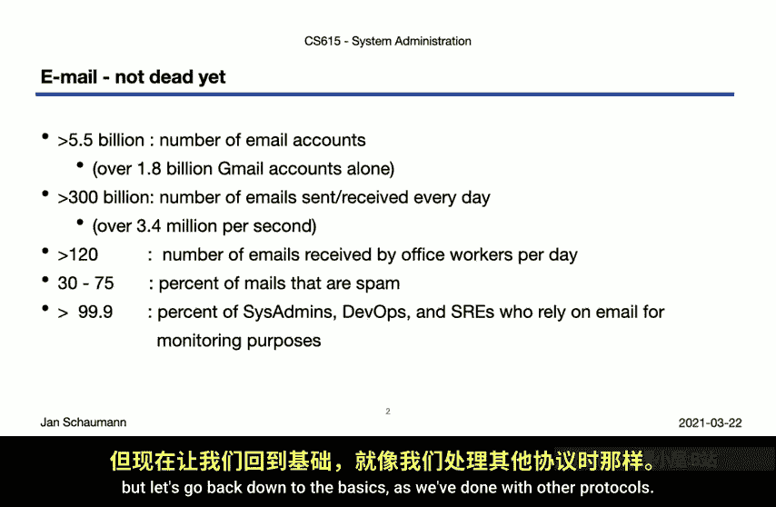

## 电子邮件系统架构

上一节我们介绍了电子邮件的普遍性，本节中我们来看看电子邮件系统的核心组件及其工作流程。

一个简单的认知是：用户撰写邮件并点击发送，邮件就会到达收件人的收件箱。但实际情况要复杂得多。

以下是电子邮件传递过程中涉及的主要组件：

*   **邮件用户代理**：用户用来阅读和撰写邮件的程序。例如命令行客户端、Outlook、Thunderbird或网页邮箱。
*   **邮件传输代理**：通常所说的“邮件服务器”，负责接收并转发邮件。常见的MTA软件有Postfix、Sendmail和Qmail。
*   **邮件投递代理**：负责将已接收的邮件进行最终处理，如分类、复制、转发或过滤。Procmail是一个常见的MDA。
*   **邮件访问代理**：当用户不直接登录邮件服务器时，通过POP或IMAP等协议远程访问邮件的服务。

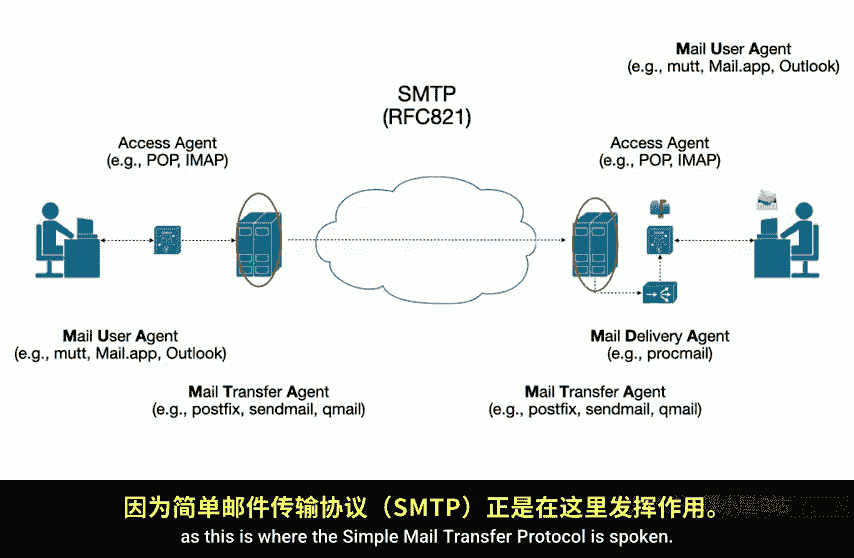

邮件发送的基本流程是：用户通过MUA撰写邮件，MUA将邮件交给发送方的MTA。发送方MTA查找收件人域名的邮件服务器（通过DNS MX记录），并通过SMTP协议将邮件转发给接收方MTA。接收方MTA可能进行垃圾邮件评估等处理，然后通过MDA将邮件投递到用户的邮箱。最后，用户通过MUA（或经由访问代理）读取邮件。

## 观察SMTP通信

了解了系统架构后，我们通过一个实际例子来观察SMTP协议的具体交互。

我们在一个EC2实例上使用`mail`命令发送一封测试邮件，并捕获网络流量。发送过程涉及以下关键步骤：

1.  **DNS查询**：发送方MTA首先查询收件人域名的MX记录，以确定负责接收邮件的服务器。
    ```bash
    # 示例：查找域的邮件服务器
    dig MX example.com
    ```
2.  **建立TCP连接**：根据查询到的IP地址，向接收方服务器的25端口发起TCP连接。
3.  **SMTP对话**：连接建立后，双方进行明文SMTP对话。主要命令包括：
    *   `HELO` 或 `EHLO`：客户端向服务器打招呼。
    *   `MAIL FROM:`：指定发件人地址。
    *   `RCPT TO:`：指定收件人地址。
    *   `DATA`：开始传输邮件内容（包括邮件头如`From:`, `To:`, `Subject:`和正文）。
    *   单独一行的 `.`：表示邮件内容结束。
    *   `QUIT`：结束会话。

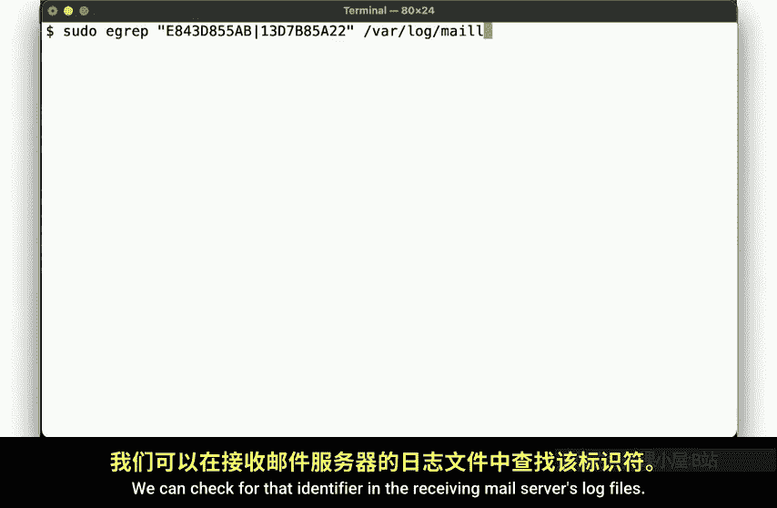

通过分析邮件服务器日志（如`/var/log/mail.log`），我们可以追踪邮件的处理状态，包括分配的唯一消息ID、投递尝试（可能因缺乏反向DNS记录而被拒绝）以及最终的成功投递。

## 手动模拟SMTP会话

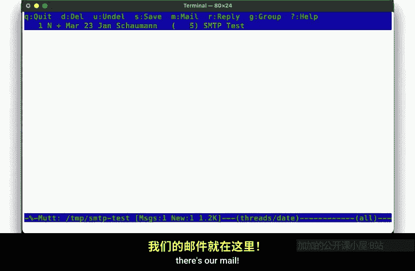

为了更深入地理解SMTP的简单性，我们可以使用`telnet`命令手动完成一次邮件发送。

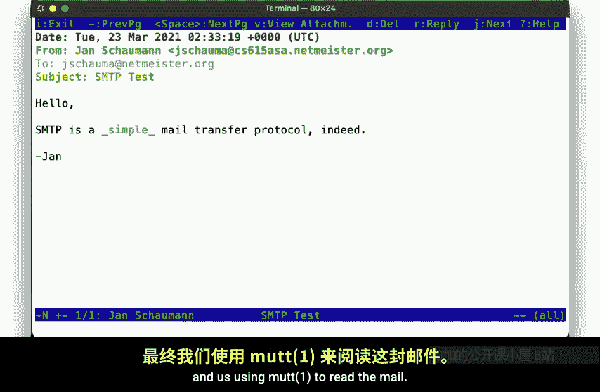

以下是核心步骤的模拟：

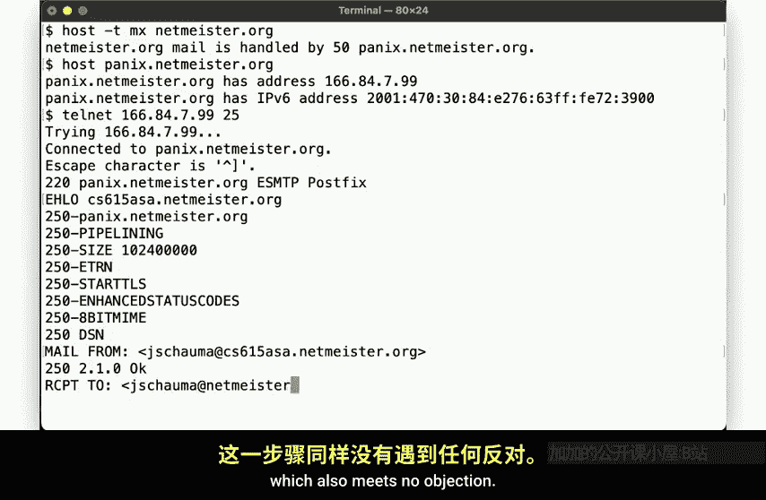

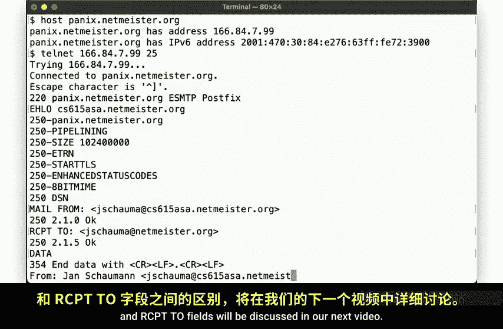

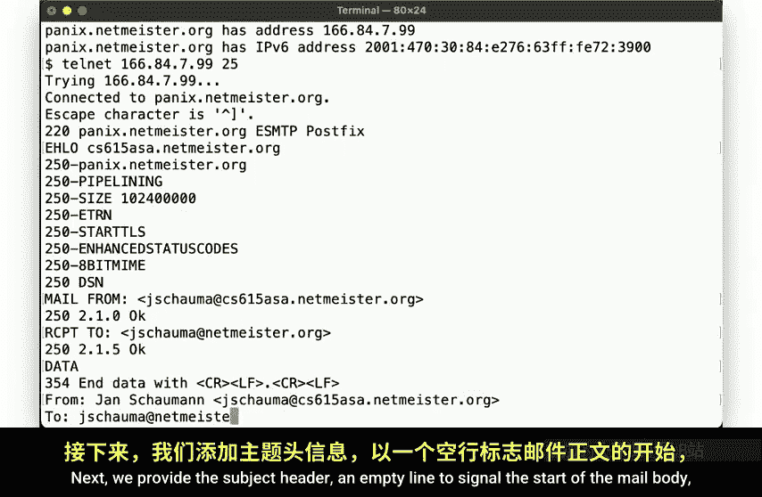

1.  查找目标域的MX记录和A记录。
2.  使用`telnet`连接到该邮件服务器的25端口。
3.  遵循SMTP协议进行交互：
    ```bash
    telnet mail.example.com 25
    220 mail.example.com ESMTP
    HELO myclient.example.com
    250 mail.example.com Hello
    MAIL FROM:<sender@example.org>
    250 2.1.0 Sender OK
    RCPT TO:<recipient@example.com>
    250 2.1.5 Recipient OK
    DATA
    354 End data with <CR><LF>.<CR><LF>
    From: Sender Name <sender@example.org>
    To: Recipient <recipient@example.com>
    Subject: Test Manual SMTP

    This is the body of the email.
    .
    250 2.0.0 OK: queued as ABC123
    QUIT
    221 2.0.0 Bye
    ```
这个过程清晰地展示了SMTP是一种基于请求-响应的简单文本协议。

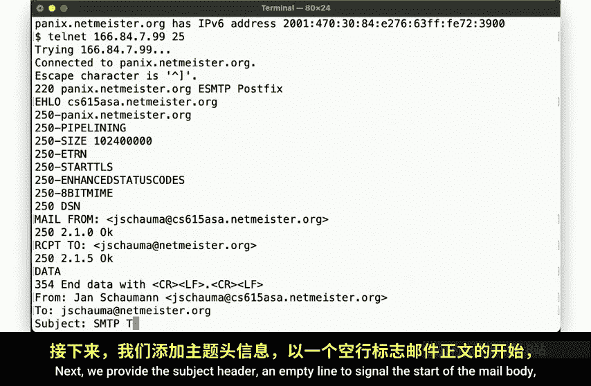

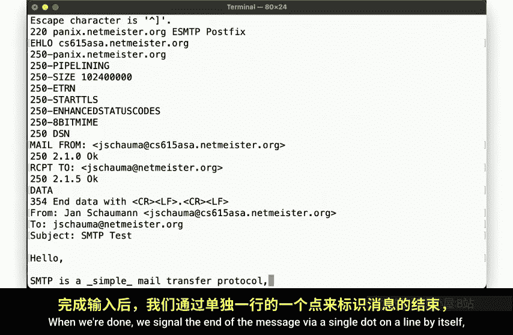

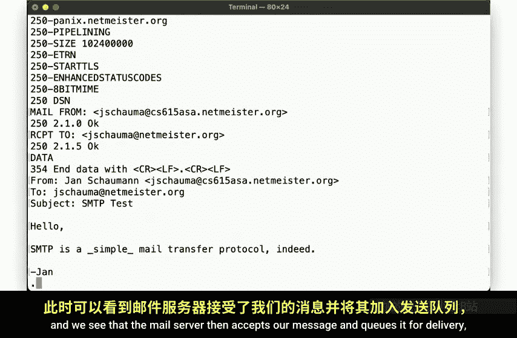

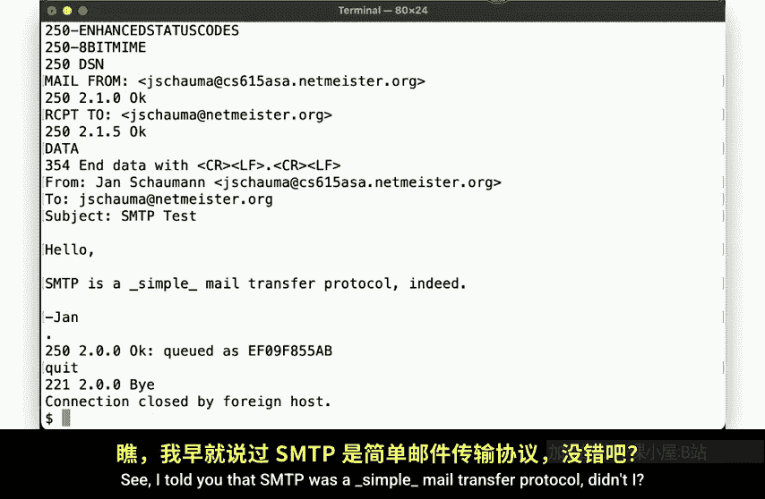

## 本节总结

本节课中我们一起学习了电子邮件系统的基础。我们了解到电子邮件并非由单一服务完成，而是由MUA、MTA、MDA等多个组件协作。核心传输协议SMTP工作于TCP 25端口，其通信是明文的，易于观察和调试，但也带来了安全和隐私挑战。

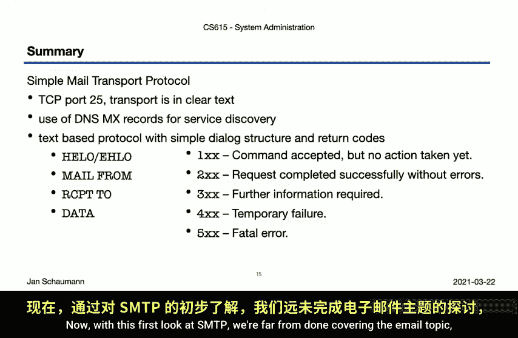

我们观察到邮件发送始于DNS MX记录查询，并通过一系列简单的SMTP命令完成传输。服务器返回的数值状态码（如250表示成功）指导着客户端下一步操作。

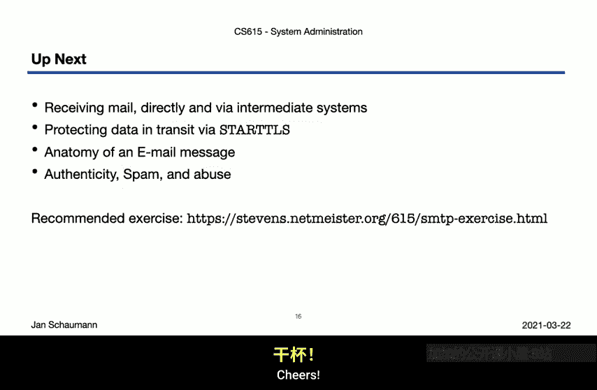

然而，这只是电子邮件主题的入门。在接下来的视频中，我们将更深入地探讨邮件的接收过程、使用TLS加密传输、分析邮件头的解剖结构，并讨论如何防范垃圾邮件等滥用行为。