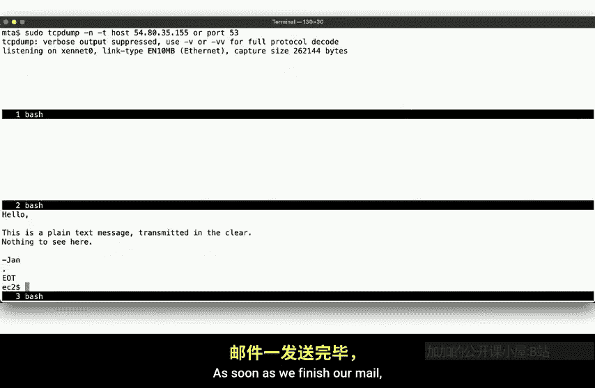
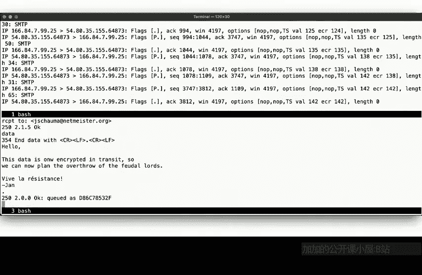
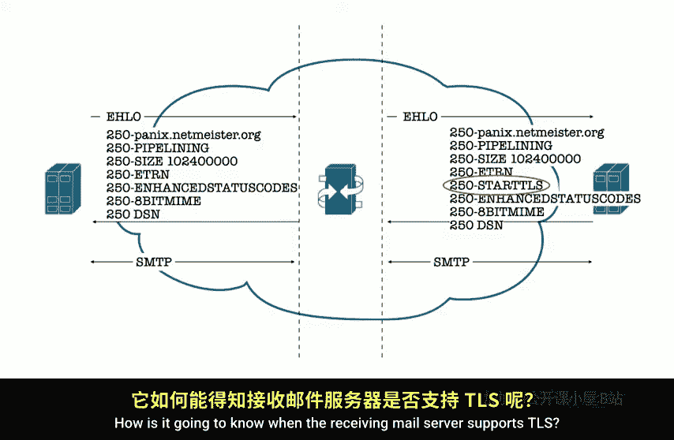
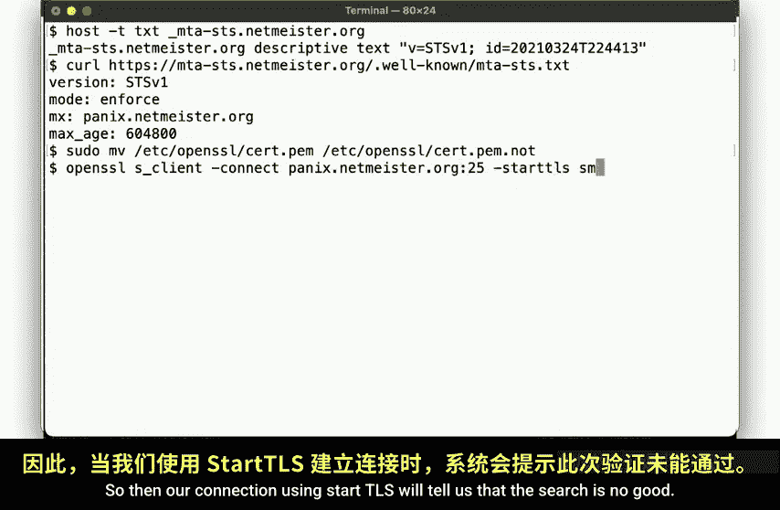
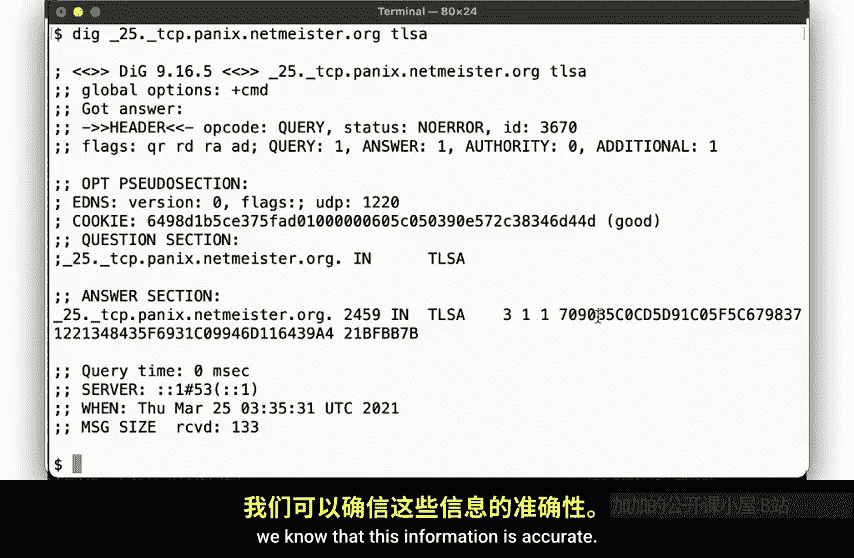
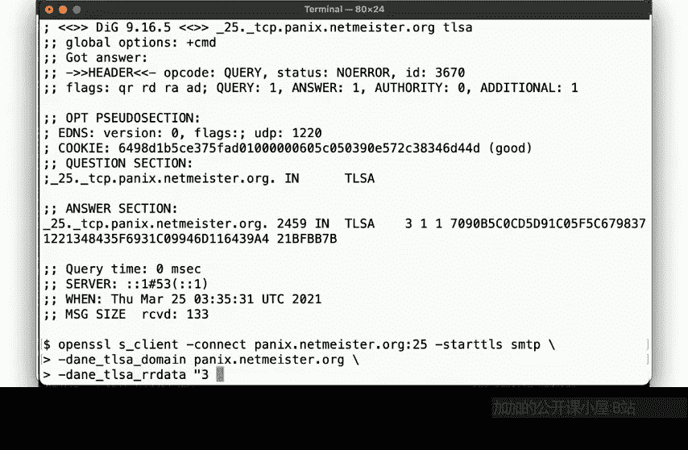
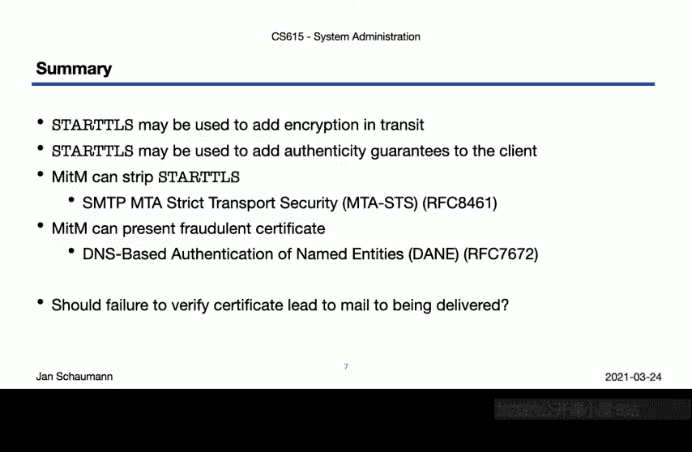

# 039：Week 08, Segment 2 - 电子邮件传输安全 🔐

在本节课中，我们将继续探讨邮件系统，重点关注邮件在传输过程中的安全问题。我们将学习如何保护电子邮件，使其在传输过程中不被窃听或篡改。

上一节我们介绍了简单邮件传输协议，并观察了邮件如何从客户端发送到邮件服务器。本节中，我们来看看邮件服务器接收邮件时会发生什么，并讨论保护邮件信息在传输中不被拦截或观察的方法。



## 观察标准SMTP通信

首先，我们通过一个实验来观察标准的、未加密的SMTP通信过程。

以下是实验设置和观察到的步骤：

1.  **发送邮件**：我们像之前一样，使用`telnet`命令手动连接邮件服务器并发送一封测试邮件。
2.  **服务器日志**：在邮件服务器上，我们查看日志，可以看到连接建立、DNS查询（如反向PTR查找、MX记录查询）以及邮件被接收和处理（例如，交给SpamAssassin进行垃圾邮件过滤）的全过程。
3.  **数据包捕获**：通过`tcpdump`工具，我们可以清晰地看到所有SMTP命令（如`HELO`， `MAIL FROM`， `RCPT TO`， `DATA`）和邮件内容都以明文形式在网络中传输。

这个实验清楚地表明，基本的SMTP协议是不加密的，通信内容对路径上的任何观察者都是可见的。

## 启用传输加密：STARTTLS 🛡️

为了解决明文传输的问题，SMTP协议提供了`STARTTLS`命令，用于将明文连接升级为加密的TLS连接。

以下是使用`STARTTLS`建立加密连接的步骤：

1.  **初始问候**：客户端连接服务器并发送`HELO`命令。
2.  **服务器能力通告**：服务器回复，并在其支持的特性列表中包含`STARTTLS`。
3.  **启动加密**：客户端发送`STARTTLS`命令。
4.  **TLS握手**：服务器确认后，双方进行TLS握手，建立加密通道。
5.  **加密通信**：此后所有的SMTP命令和邮件内容都在加密通道内传输，数据包捕获工具只能看到加密的数据流，无法解析内容。



我们可以使用`openssl s_client`命令来模拟支持`STARTTLS`的客户端，并验证连接是否已加密。

```bash
openssl s_client -starttls smtp -connect mail.example.com:25
```

然而，`STARTTLS`提供的是一种“机会性加密”。这意味着加密是可选的，而不是强制性的，这带来了安全风险。

## 机会性加密的风险与MITM攻击 👤



“机会性加密”的主要问题在于，攻击者可能发起中间人攻击。

攻击流程如下：
1.  攻击者拦截客户端与服务器之间的通信。
2.  当服务器回复支持`STARTTLS`时，攻击者可以将其从列表中删除，再转发给客户端。
3.  客户端误以为服务器不支持加密，便会继续使用明文SMTP通信。
4.  攻击者从而能够持续窃听或篡改邮件内容。

因此，仅依赖`STARTTLS`不足以保证通信安全，我们需要一种机制来强制要求使用TLS。

## 强制TLS：MTA-STS 📜

MTA严格传输安全是一种通过DNS声明，强制要求对指定域名的邮件传输必须使用TLS的机制。



其工作原理分为两步：
1.  **策略发现**：发送方MTA查询`_mta-sts.example.com`的TXT记录，以确认该域名是否使用了MTA-STS策略。
    ```bash
    dig TXT _mta-sts.example.com
    ```
    返回示例：`v=STSv1; id=20230830T010101;`
2.  **策略获取**：如果存在策略记录，发送方MTA通过HTTPS获取`https://mta-sts.example.com/.well-known/mta-sts.txt`的策略文件。
    策略文件示例：
    ```
    version: STSv1
    mode: enforce
    mx: mail1.example.com
    mx: mail2.example.com
    max_age: 604800
    ```
    `mode`字段可以是`testing`（仅报告问题）、`enforce`（强制使用TLS，否则中止发送）或`none`（禁用）。

当模式为`enforce`时，如果发送方连接收件方服务器但无法成功建立TLS连接，则应中止邮件发送，从而有效抵御降级攻击。

## 证书验证：DANE 🔒





即使强制使用了TLS，我们仍需验证服务器证书的真实性，以防攻击者使用伪造的证书。DANE协议提供了一种不依赖传统CA体系的证书验证方法。

DANE利用DNSSEC来保证DNS记录的真实性，并通过TLSA记录来关联域名与证书。

工作流程如下：
1.  发送方MTA查询收件方服务器（如`_25._tcp.mail.example.com`）的TLSA记录。
    ```bash
    dig TLSA _25._tcp.mail.example.com
    ```
    返回的TLSA记录包含了服务器证书公钥的哈希值（例如SHA-256）。
2.  当建立TLS连接时，发送方将服务器提供的证书与TLSA记录中的哈希值进行比对。
3.  由于TLSA记录受DNSSEC保护，发送方可以确信该哈希值是真实有效的。如果匹配，则证书验证通过；否则，连接应被视为不安全。

这确保了即使传统的证书颁发机构被攻破，只要DNSSEC是安全的，邮件传输的认证就是可靠的。

## 总结与面临的挑战 🤔

本节课我们一起学习了保护电子邮件传输安全的关键机制。

我们首先回顾了SMTP明文协议的风险，然后引入了`STARTTLS`来实现机会性加密。为了克服其可能被降级攻击的弱点，我们探讨了**MTA-STS**，它通过DNS策略强制要求使用TLS。最后，为了确保连接服务器的真实性，我们介绍了**DANE**协议，它利用DNSSEC和TLSA记录来验证TLS证书，无需依赖传统的CA体系。

然而，在实际部署中仍面临挑战：
*   **严格性与可用性的权衡**：将MTA-STS设置为`enforce`模式可能导致因配置错误而无法投递邮件，因此许多提供商仍处于`testing`模式。
*   **部署普及度**：DANE的广泛应用依赖于DNSSEC的部署，而这尚未完全普及。



尽管存在挑战，理解这些机制对于构建和维护安全的邮件系统至关重要。在下一节课中，我们将探讨如何验证邮件发送者的身份，以保护邮件服务器不被滥用于发送垃圾邮件。