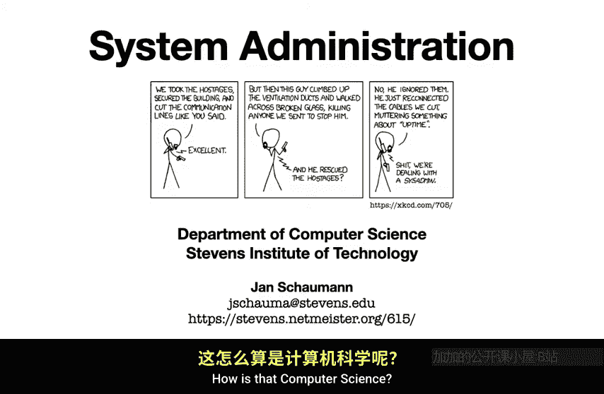
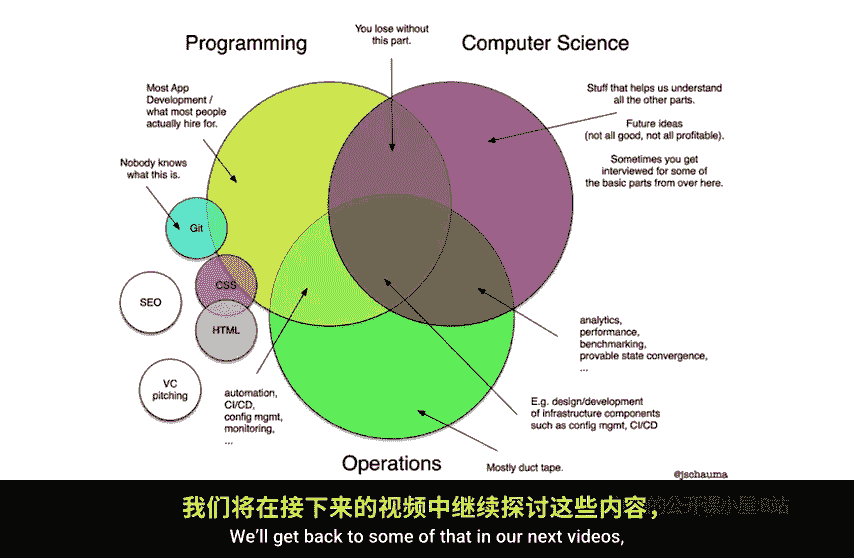
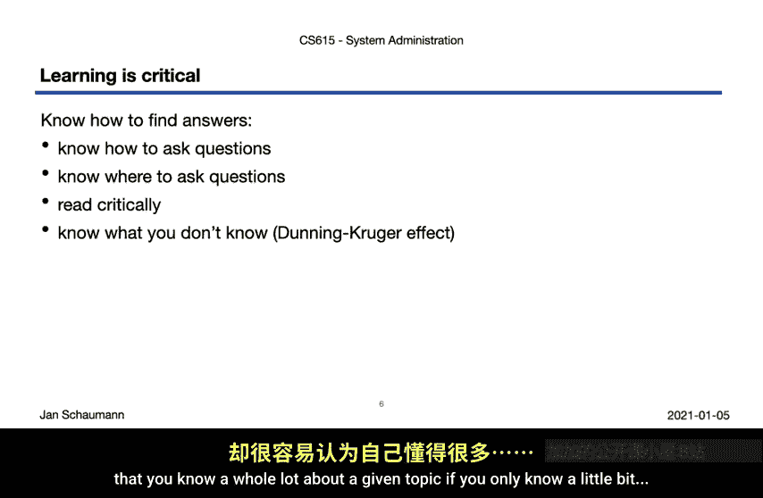
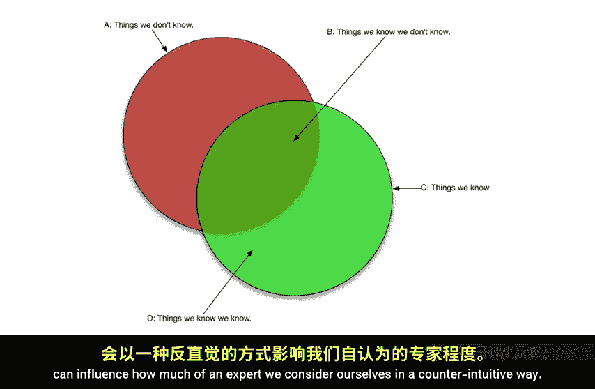
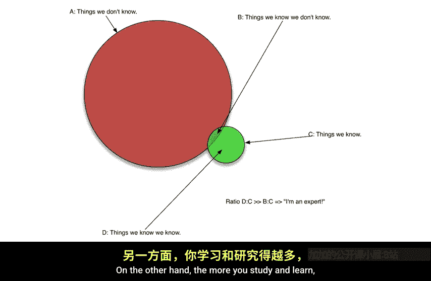
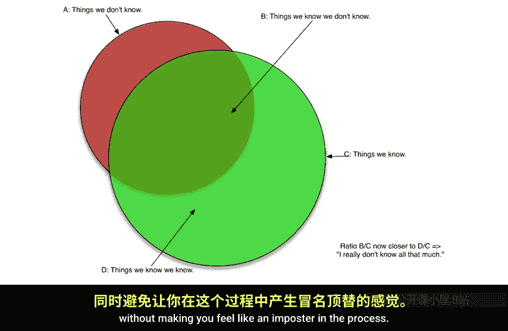
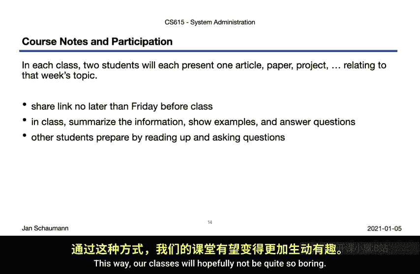
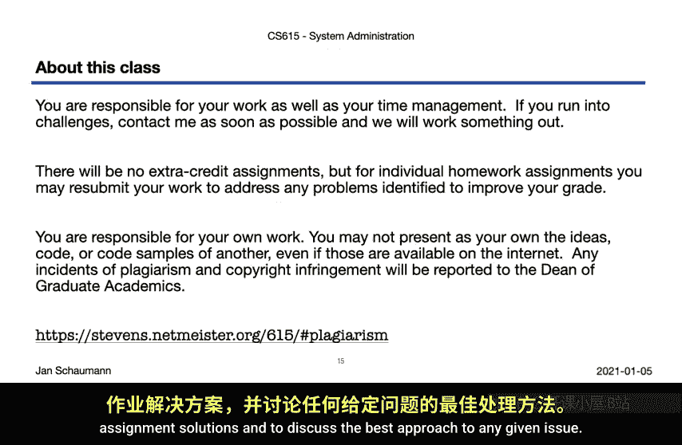
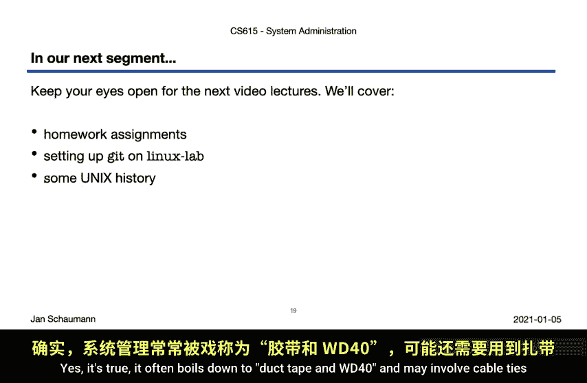
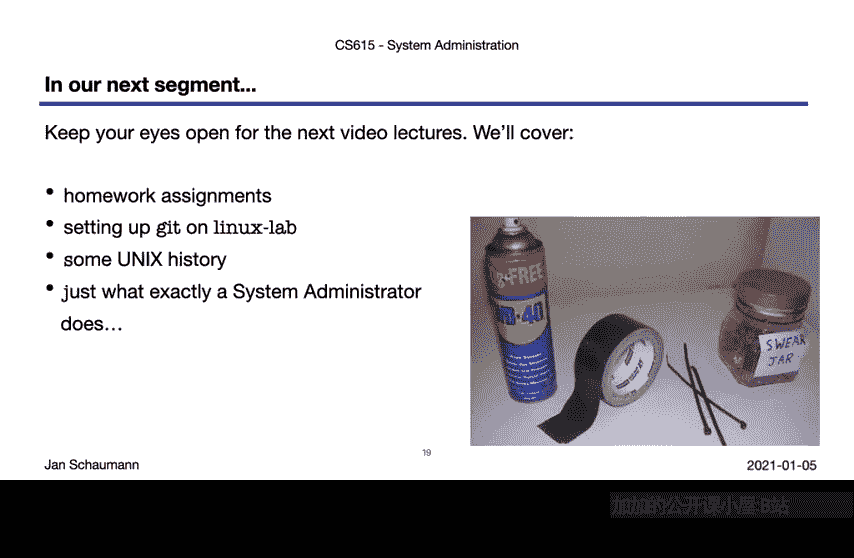

# 计算机系统管理：01：课程介绍与概述 🖥️

在本节课中，我们将学习CS615《计算机系统管理》课程的整体框架、学习目标、评估方式以及所需资源。课程由史蒂文斯理工学院的Jan Sharman教授讲授，旨在介绍系统管理领域的核心概念与实践。

系统管理是一个涉及计算机操作、网络、安全及服务的广泛领域。它不仅是技术操作，更是一门需要深度与广度知识结合的专业。本课程将帮助你理解系统管理在计算机科学中的位置，并为你打下坚实的基础。

## 系统管理在学术中的定位 🤔

上一节我们介绍了课程的整体情况，本节中我们来看看系统管理如何融入学术课程体系。系统管理常被视为运维工作，但它与计算机科学和编程领域既有交集，又有所不同。

系统管理作为一个专业领域，其职业路径并不固定，甚至没有统一的职位描述。不同组织可能称之为站点可靠性工程、DevOps或全栈运维。学习这门专业通常没有传统的学位路径，大多数人依靠实践经验和特定领域的深入钻研。

该领域要求从业者既要有广泛的基础知识，如操作系统、网络和编程，也要有特定领域的深度专业知识。

以下是系统管理员可能需要掌握的知识领域：

*   **广度知识（基础）**：操作系统概念、TCP/IP网络、编程概念、多种语言实践经验、云计算等。
*   **深度知识（专业领域）**：特定操作系统（如某个Linux发行版）、核心服务（如DNS、SMTP、数据库）、特定厂商的软件产品，或更广泛的领域（如安全、自动化）。

正是这种广度与深度的结合，使得系统管理既充满趣味又富有挑战性。

## 课程内容概览 📚

鉴于系统管理领域极其广泛，本课程无法覆盖所有内容，而是选择介绍其中一些最重要的方面，旨在激发你的好奇心并为你奠定基础。

以下是本学期计划涵盖的主要主题：

*   **第1周**：系统管理领域、职业与实践概述；Unix系统历史与基础。
*   **第2周**：存储模型、设备与技术。
*   **第3周**：文件系统基础；软件类型区分。
*   **第4周**：操作系统与软件安装、包管理、多用户基础。
*   **第5-6周**：TCP/IP网络详解，包括各层协议的抽象概念与实践工具。
*   **第7周及以后**：关键服务（DNS、HTTP、TLS、SMTP）、系统管理中的软件开发、监控、备份与灾难恢复、配置管理、系统安全、职业道德。
*   **期末**：夺旗挑战赛，用于复习所学内容。

## 学习方法：学会如何学习 🧠

在系统管理职业生涯中，持续学习至关重要。本课程将特别强调几种核心的学习方法。

首先，学习如何有效提问以获取所需答案，并知道在哪里提问。其次，培养批判性阅读能力，而非盲目跟随搜索引擎的第一个结果。

更重要的是，要理解“已知”与“未知”的边界。这里涉及一个重要的认知偏差——**邓宁-克鲁格效应**。其核心观点是：知识少的人容易高估自己的能力，而知识多的人则更能意识到自己的不足。

我们可以用两个集合来粗略表示：
*   **集合A**：你知道的知识。
*   **集合B**：你知道自己不知道的知识。

对于新手，A远大于B，因此容易自信。随着学习深入，B的增长速度可能超过A，你会意识到有更多未知领域，从而变得谦逊。本课程希望帮助你扩大A的同时，也理性地认识B。

此外，务必理解你所做操作背后的原理，而不仅仅是复制粘贴命令。最后，积极与同行、社区交流信息，这是学习过程中不可或缺的一环。

## 课程评分与作业 📝

作为研究生课程，最终会有成绩评估。评分将综合考虑以下几个方面：

以下是评分构成的详细说明：

1.  **课堂参与（40%）**：
    *   **每周问卷**：针对当前主题的简短问题，用于引导思考，无标准答案，但需完成。
    *   **课程笔记**：需为每次讲座创建Git仓库和文本文件笔记，记录阅读内容、练习完成情况和问题。
    *   **社区活动**：需参加一次线上技术社区活动（如会议、技术演讲），并提交总结。
    *   **课堂分享**：在同步课程中，轮流分享与主题相关的有趣文章或论文。

2.  **实践作业（30%）**：包含一些涉及编码的练习。

3.  **课程项目（20%）**：合作开发一个软件项目，评分依据包括项目管理、设计、文档和代码等贡献。

4.  **期末夺旗赛（10%）**：用于综合实践所学知识。

关于作业提交的重要说明：请自行管理时间，按时提交。如遇特殊情况可申请延期，但不会单纯因时间管理不佳而批准。允许对未获A的作业进行修改并重新提交以提升成绩。**严禁抄袭**，违者将不及格。

## 所需系统与资源 💻

我们将主要使用Unix系统，且全部通过命令行访问。

以下是本课程将使用的系统环境：

*   **亚马逊AWS EC2**：主要实验环境。作为史蒂文斯学生，可通过AWS教育项目获得积分。**请务必在使用后关闭实例以控制费用**。
*   **史蒂文斯Linux Lab系统**：所有学生应已拥有账户。
*   **本地虚拟机（可选）**：例如在VirtualBox中安装NetBSD。可参考CS631课程的安装指南。

请注意，本课程**不是**Unix使用入门课，假定你已能熟练使用命令行。

## 核心课程资源与沟通 📧

请务必收藏以下资源，它们是本课程信息的主要来源。

以下是必须关注的核心资源列表：

*   **课程网站**：所有课程材料的权威来源。史蒂文斯Canvas系统仅提供链接指向该网站。
*   **课程邮件列表**：**主要沟通渠道**。所有重要通知和讨论都发生在此。请使用史蒂文斯邮箱订阅。**除成绩或个人事务外，所有问题都应发送到邮件列表**，以便所有同学受益。
*   **Slack频道（可选）**：用于半同步讨论、分享链接和作业思路。非强制加入，重要通知仍通过邮件列表发送。
*   **推荐教材**：提供免费PDF版本，链接在课程网站上。

## 课前准备与本周任务 ✅

为了从本课程中获得最大收益，请养成以下学习习惯：

在每次讲座前，复习上周的幻灯片和笔记，完成问卷，观看视频讲座。课后，运行讲义中的命令示例以加深理解，并通过邮件列表跟进未解决的问题。

课程网站还提供了许多**非计分的推荐练习**，强烈建议你将其作为自学工具。

**本周的具体任务**是完成所有课程设置：收藏所有资源、初始化课程笔记Git仓库、确保能访问Linux Lab并设置好AWS账户。如果遇到问题，请在邮件列表或Slack中提问。

## 总结与预告 🎬

本节课我们一起学习了CS615系统管理课程的介绍、学习目标、评分方式以及所需资源。我们探讨了系统管理的学术定位、邓宁-克鲁格效应，并强调了学会学习和有效沟通的重要性。

在接下来的视频中，我们将深入探讨如何具体完成作业、在Linux Lab上使用Git、Unix操作系统的历史，以及系统管理员究竟做些什么——除了胶带、WD-40和扎带，还有更多内容值得探索。

敬请期待下次课程！