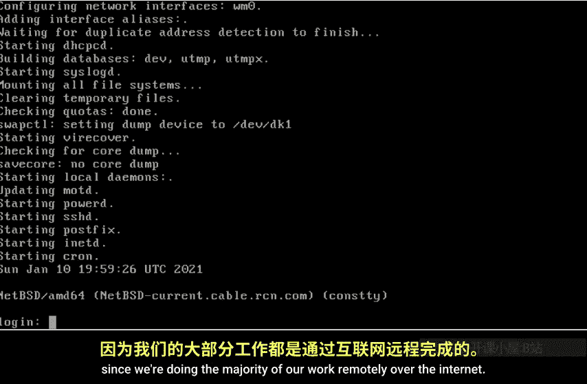
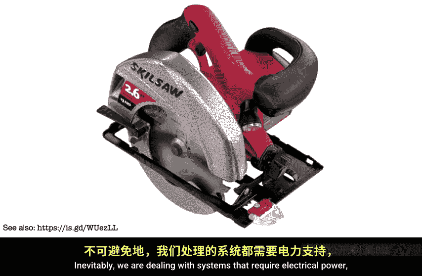
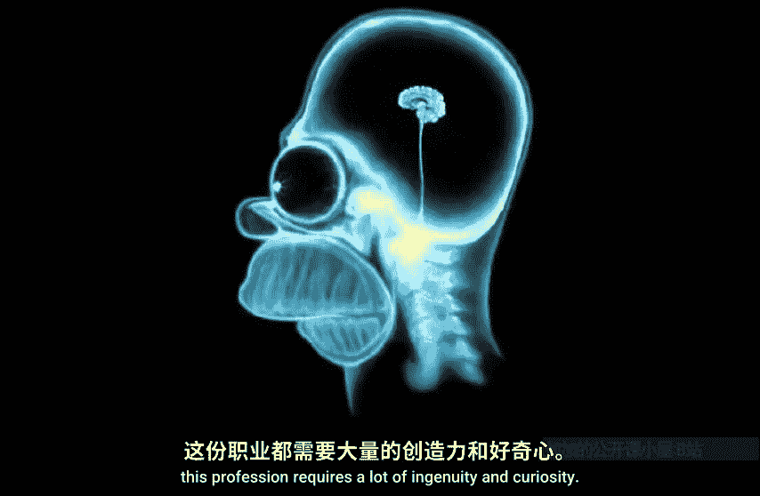
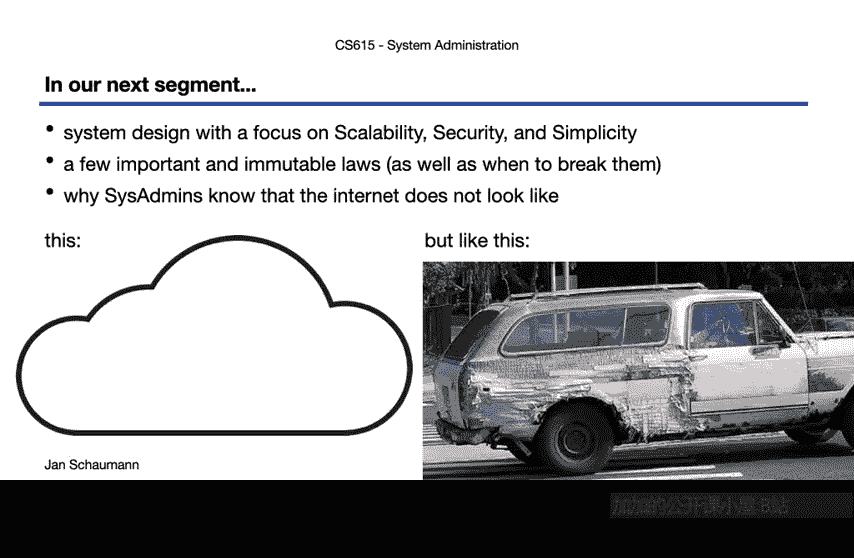

# 史蒂文斯理工学院【中英⚡计算机系统管理｜CS615 2021 System Administration】 p02 p1 Week 01, Segment 02 - The Job of a System Administrator -BV11QQcYmEzD_p2-

Hello and welcome to C S 6，1，5 System Administration。 This is week 1 segment 2。

 And after in our last video， we talked about all the boring administrative stuff for Ron's online class。

 Well now go to get make things a bit more interesting。😊。

You all have enrolled in this class entitled Aspect of system administration。

 So I assume everybody has some sort of idea what a Smin does。Fun fact。 You're all wrong。Well。

 you're also all correct， I suppose， for you see， the job of assistant administrator is not very well defined。

Sure， you get rude in the matrix like our friend Ta here。 And wait， that movie came out 22 years ago。

 Some of you weren't even born yet。 Oh， boy。 I'm going to have to update my pop culture references。

 it seems。Anyway， let's talk about the job of a system administrator。Now， of course。

 we're biased as a system administrator， we view ourselves as the hero of our story。

 nor the other participants in our tech world as buffoonons。

But it's also true that we are often seen by others。 Well， not necessarily in a positive light。

We'll return to this sort of tribalism towards the end of this video。

 but let's think of an example of what a system administrator does。I mean。

 other than flipping off everybody else and single handedly rescuing mankind。Here's an example。

You gotta touch the banana for Wifi access， saysors admin。I like this。

 It's an example of the weird situations Saedmds find themselves in and how they might solve a problem。

In order to grant people time limited Wifi access， a receptionist would have to manage a spreadsheet and print out the codes。

Instead， this person here rig the raspberry pie to a banana and use the voltage drop detected when you touch the banana as a signal to generate a new coat。

It's an example of automating a manual task with a clever and frequently unexpected creative solution。

A various sumin thing to do。ButLet's try to be more specific。

 What exactly does a system administrator do。Sure， says Edmunds work with computers with all sorts of computers。

 with workstations， with obsolete ancient hardware， with laptops。

With tiny little computers like this raspberry Pi， which we just saw in action。But of course。

 also with larger computers。What you see here is an H blade system used in data centers to allow for multiple physical service enclosed in the single chassis。

These boxes are then filled with server blades that are space and energy efficient and are connected using high speed network and storage networks。

 often with hot swap and out of band management capabilities， perhaps optimized for virtual service。

 allowing for a high compute density。😊，But， of course， you can scale that up here。

 you see a set of SGI altic systems， which are oftentimes used to build some of the world's most powerful supercomputers。

 with each system containing up to 2048 dual core microprocessors。 And， yes。

 they are large enough for you to step into these racks if they weren't full of computers and cables。

😊，But， of course， nowadays， people don't only run the attacks on individual servers or CPUus。

 but instead on containers， so many containers， containers everywhere。So naturally。

 sales have to be on top of containers and how to manage workloads using Docker and Kubernetes and whatnot。

You'll see plenty of online memes here around container and shipping code。 So naturally。

 we take it all the way to 11 and think about how to manage such infrastructures。 That is。

 we're in the business of building ship shipping ships to ship containers onto our servers and the data centres in the cloud。

There's probably a recursion joke hidden somewhere in there， as well。But， yes。

 his Edms often work in data centres， and some of them look just like this。 to be honest。

 this isn't a real data centre。 It's the view of a local machine room at a company I once worked at。

You see a typical setup with locked cages， racks along aisles with eraed floors。

 boxes and shelves of equipment and cables going just about everywhere。 kind of a mess。

So along comes to says Edm。Grabbed their cable ties。A second favourite two of all his sentences。

 Edmundds， the mighty label maker。And quite likely。

 an unhealthy amount of caffeine or some other perfectly legal drug。

And after just a few sleepless nights。We've cleaned up the mess。That is。

 says Edmunds bring order to chaos。There's no shortage of O C D in our field。

 but we prefer to consider this level of meticulousness a virtue。

 dedication to doing the right thing， knowing that this investment of time and effort will later our pay off many times over when we need to determine which K will connects which hostse to which switchport。

 for example。There is an entire subway dedicated to the art of clean data centre a cages accent overall。

 cable porn。By the way， not all of these cables are necessarily manually run by a assist admin at a certain scale。

 you may be able to order your X pre cable already， although others consider that cheating。Okay。

 so a clean data centre aisle might look more like this。 As you can tell。

 blue blinken lights are very popular， as is a tendency to keep things identical。

So with larger and larger computing requirements， you end up filling aisle after aisle of racks filled with servers。

 and then you have to start thinking about cooling for all these systems。

So CS segmentss may be involved in the design of data centers and their cooling technologies。

What you see here is not a farm in the middle of nowhere in Nebraska。

 but rather a data centre in the middle of nowhere in Nebraska。

One of Yahoo's data sents to be precise。The buildings have a kind of funny shape because the data centres use a patented approach for cooling。

 The Yahoo Chien coop design。 Nope， not a joke。 The engineers at Yahoo。

 including system administrators， designed their data centres。

 inspired by how chicken coops distribute airflow。As a result。

 the requirements for cooling systems using air conditioners or other electrical systems when drawn drastically。

 and the majority of the cooling is done simply by in a way， opening the windows。

And those data centers have all sorts of access controls。

 including security cameras and biometrics readers。

All of which nowadays are hooked up to the Internet。

 run a web server and suffer from remote coat execution vulnerabilities that some poorsses up and has to try to patch or otherwise mitigate。

Network designed with segregated zones for such equipment then also may fall into the job description of assetman。

All may seem to be users of these controls as we monitor their output。But， of course。

 to install such equipment， every S Edmin everywhere has a giant box or a drawer full of random cables。

 because for some reason， no manufacturer in the world wants to use the same cable as any other manufacturer。

 Not even when you are using industry standards like USB。

 which in order to drive you insane comes in 30 varieties， And in the history of the Internet。

 not once has anybody plugged in a USB cable the right way on the first try。

So connecting things is definitely a Suetteman thing。

 which reminds me of the various projectors used in classrooms at Stevens。

 It was a big problem since different faculty would use different devices and would never have the right adapters。

So a few semesters back， I was pleased to discover these contraptions in every classroom。

 which seemed to me like a various set mini solution。

 a selection of the most common adaptors chained to the projector cable。😊，But of course。

 cables are often not needed any longer。And everything goes wireless。

 which brings with it an entire class of other problems。

 because now you have to support people working in environments you don't control， and which may。

 in fact， just be an invitation for compromise because you can be guaranteed that somewhere in that Starbucks。

 Some clever C S major has set up a rogue Wifi access point and is not sniffing all your traffic。

 But if the user can get to your website， it's still your fault。And on the other hand。

 if you assist is Edmund for Starbucks year， you have the problem of supporting infrastructure for random people or making sure they don't use your systems for things you'll be held liable for。

 Good times， good times。😊，So you go back to your desk and wait， what is this now。All right。

 The punch car。 That's how we used to program。 A long time ago， you wrote your code。

 arranged your punch cards in order， then walked them over to the operator。

 who you'd hope would feed them into the computer。 But who， in reality may have tripped。

 dropped all your cards。 and you now have to put them back into the right order。Well。

 at least we don't have to do that any more。 although now we have to deal with undefined is not a function and similar nonsense。

But we do write a lot of code system administrators， and we do a lot of typing in general。

 So to do our risks to favor， we should use some ergonomic keyboards like this kinaseesis keyboard shown here。

These keyboards are amazing。 They remind you that you probably suck at touch typing。 I certainly do。

When I was a system administrator， he at Stevens， one of the C S professors。

 Use one of these keyboards， and I quickly learned that I didn't actually remember my passwords very well。

 that they were all in my muscle memory。 And it took me a good minute to log in on his keyboard。

Of course， it didn't help that he had changed his keyword layout to Dorac instead of queryer。

I soon touchedshed a spare keyboard in his office。 So if I had to work on the system。

 I'd be able to type normally。Anyway， so since that let's do a lot of typing。

 and of course we do the vast majority of our work on the command line。That is。

 we operate on the console， day in and day out。System administrators know or should know anyway what all the messages flying by here mean。

 as each one is not generated by the operating system for fun。

 but to provide some meaningful information。What you see here is an N B SD AM D 64 virtual machine booting up with kernel messages in green and messages generated once in it takes over and white。

 getting a DHCP lease， starting SS H D， Postfi， Chon， etc cetera。

 and finally offering the login prompt。Most of the time。

 we don't even see those messages since we're doing the majority of our work remotely over the internet。

Right， the Internet。 that's certainly something system administrators have a lot to do with。

We use the Internet， and we build the Internet， a network of networks as illustrated in this partial map。

But of course， to do that， we need other equipment beyond just computers。

So system administrators also deal a lot with network equipment。

 like these ethernets which is shown here。Switchs allow for network connections on layer 2 of the O S I stack。

 which we are rather familiar with。 But if you want to build a more complex network and connect to other networks。

You will also need some routers like this one。You can tell that this has a similar form factor and design as the blade service we saw a minute ago。

 And， of course， it's no surprise。 in order to facilitate installation in the standardized racks inside the data centers。

 This equipment follows the same standards and can also often be extended or upgraded in a similar manner by swapping out individual blades hooking into the back plane within this chassis。

 depending on your routing needs。😊，Why do we deal with all this networking equipment。Oftentimes。

 it's because as a system administrator， we in charge of the Web server running some service using H DP as the universal protocol。

 although， of course， we certainly hope that it's also using T L S to secure the connections。

But this isn't quite what the normal infrastructure looks like， is it。For starters。

 we usually have more than just one web server， and we probably have to store some data in a redundant database。

Then we have a load balancer in front of the Web servers and probably decide that we don't allow just any traffic。

 perhaps by using a firewall to create a security perimeter around the web service。And， of course。

 as we grow our infrastructure， we probably need to add some sort of message queue system。

 a large storage array， and perhaps we had Zookeeper to juggle some services。And of course。

 we need to allow some of our engineers and developers access， so we let their laptops。

 workstations and mobile devices access these internal resources。But damn mostly。

 humans have a tendency to want to go home some time。 Or maybe there's a pandemic going on。

 And all of a sudden， people aren't in the office any more。

So we need to allow folks from outside your peri access。What's more。

 you'll probably have to integrate with a bunch of third party services， because nowadays。

 everything lives in the cloud。 And come on。 if you're not using Gitthub， G and slackck。

 can you really call yourself a hipstar brain to make the world a better place， Of course， you can't。

So you punch some holes into the firewall to let these connections in。 And sooner or later。

 your boss tells you that they decided there would be much better to take your entire infrastructure and move that into the cloud。

 Why not？ So suddenly， you are running on somebody else's computers， Because honestly。

 that's really all the cloud is。 Some else's computers。But yeah。

 so system administrators are involved in building。

 supporting and maintaining just about every piece of this puzzle。 And I'll tell you what。

 nobody will notice。Well， until things go wrong anyway， which they will， sooner or later。And this。

 when shed's really on fire， that's when people will suddenly remember you and call you up to come and fix the mess。

And so you grab your trusty leather and multi tool and get to work。 Serly。

 just what every said I know as one of these， because you never know what you find in the machine room What things you have to unscrew dislodge or dismantle and then put back together。

In fact， there's a surprising number of physical tools that system administrators end up using in their line of work。

Like， for example， a circular saw。Which doesn't necessarily come to mind immediately when you think of system administration。

 But after a few runs to the hardware store for increasingly stronger drill bits to get the halt into the surprisingly hard concrete floors to screw in the rack。

 I once was able to stabilize a number of very happy。

 heavy backup up batteries in that rack by cutting some board to size to support them using just such a saw as shown here。

And perhaps this gives you an idea of how varied the sument's path can be。

 Not everybody will have to handle heavy machinery。

 but the ways in which the systems are connected merely to down that path。

Inevitably， we are dealing with systems that require electrical power。

 And so you may also get to learn a bit about what happens when the power goes out and why it might be a good idea to have diesel generator And to remember that for that to work。

 you need to have diesel fuel， as well as to understand just how much power your systems draw。

 which systems have a higher priority to bring back online， et cetera， et cetera。Alright。

 so a long story a bit shorter。 every S Edmin has their own toolbox from which they pull what they need to fix whatever is broken today。

And a lot of times that involvesductoc tapepe and WD40 or their software programming equivalentvalence。

You may have heard people refer to pearl as the duct tape of the Internet。 And boy。

 folks weren't even kidding。If you have a look under the hood of the internet。

 you will be surprised at how things are held together in your career as a system administrator。

 you will get a chance to learn quite a bit about the layers of glue here。Ultimately， though。

 the single most important tool in the cissatman's tool chest is your brain。

You'll have to come up with new solutions to old problems， applyly old solutions to new problems。

 anything in between。Whether you end up supporting people's workstations run internet load bearing infrastructure in the cloud。

 design and operate data centers or manage everything in between。

 this profession requires a lot of ingenuity and curiosity。

Okay， so after this whirlovend tour through Jan's random collection of images。

 Are we getting closer to answering the question we asked earlier。

 what exactly does a system administrator do。We've pretty much seen that there can't be a uniform job description。

That there's no uniform career path。 and that system administrators oftentimes are just considered as the people who make things run。

That is， we frequently work behind the scenes， rarely being seen unless disaster strikes。

And so the system administrator may fill many roles and sometimes instead be referred to as IT support。

 operator， network administrator， system programmer， system manager， service engineer。

 site reliability engineer or any other variation thereof。In more recent years。

 the two main other job titles beside system administrator widely used were Devops and Sre。

 and the differences as shown here really are not as specific。 Rather。

 it depends on whatever the organization defines the role to be。

W devops in one organization assists Edmin in another。

 And then Sre E may perform the same or completely different tasks， depending on the company。In fact。

 the title used as often a function of organization maturity and scale。

 is no surprised at the term site reliability engineering originated in Port of Google。

 where it was described as what happens when a software engineer is tasked with what used to be called operations。

That is， the various areas that may comprise the date and duties of somebody working in this field might be illustrated as shown here。

In a small environment， you likely only have a small number of staff performing these tasks。

 perhaps only a single person， and they are responsible for everything ranging from dailyly operational tasks to the planning of the services and infrastructureized support。

In larger environments， however， these duties are divided amongst multiple people and even large organizations amongst multiple specialized teams of experts。

You can come back to this graphic as you progress in your su career， if you like， but unfortunately。

 this still doesn't really give us a definition of system administration。So let's try something else。

Let's ask the dictionary。What's a system anyway？嗯，来吃。Here， how about this？

A group of independent but interrelated elements， comprising a whole。I like that。

What about administrator。One would direct managers or dispenses。And system administrator， then。

A person in charge of managing and maintaining a computer system of telecommunication system as for a business or institution。

So this definition then seems pretty good to me as it hits a few important aspects。First。

 there is a clear implication of the job comprising multiple aspects。

 with the management of computer and network systems being only the primary。

 but not the sole responsibility of the system administrator。Secondly。

 the job of a system administrator is clearly to manage these resources on behalf of another。

 meaning there is a large organization or system involved beyond just the individual's goals or desires。

 So I'm afraid running your own home network does not make your assessment。

Let us consider the meaning of the word system， for just another second。In this class。

 we focus primarily on computer human systems。Consisting of obviously， a bunch of computers。

And the network connecting those computers。But also。

 the human component since the system without users， is quite literally useless。Which， unfortunately。

 is something that is easy to forget at times。Similarly。

 the users may act in a certain way that may or may not be in line。

With the organization's goals and policies。As noted a second ago。

 the primary job function of system administrator is to manage these systems on behalf of another。

 such as a company or other organization。 And so this strongly affects and influences almost all aspects of the systems we manage。

And this then gets us back to what we showed earlier。

 the inter office politics and the human nature of neatly creating tribal allegiances based on some sort of as versuscious them feeling。

And guess what。 That's really not helping at all。Instead。

 it's important the system administrators understand how to work with other people from all the different backgrounds。

Because no matter how much we like to focus on the technical aspects of our job。

 we have to remember that solving the technical problems is the easy part。

Even if the bugging your load balancers or trying to unwedge gi or trackingrek down that one weird bug may take you hours is still a lot easier than dealing with people。

Programming and everything surrounding the Internet and the management of the system that make up the Internet。

 All that is really a social thing， something that requires understanding of human beings and their motivations。

Computering in its heart， is a people problem。And so with everything covered in this video in mind。

 I have come to think of system administration as a profession where you primarily solve people's problems。

Sure， oftentimes， this involves comping a bit harder than they did and spending a lot of time convincing computers to do the thing you meant them to do。

 not the thing you told them to do。 But the end goal remains to solve people problems。

 to manage the resources and systems you are in charge of on behalf of the organization and the public interest in mind。

And that then is the job of the system administrator and what we'll focus on in this class。Okay。

 so now having a bit more of an idea for the system administrator made， let's take a break。

I encourage you to research a bit about the job descriptions or the differences between Csedmins。

 Devopps and Sres， and follow the links included in these slides。Having covered a bit of the what。

 we'll then use our next video segment to talk a bit more about the how of system administration。

And discuss what I termed the corpuls of exceptional system design， scalability。

 security and simplicity。We also cover a few guiding principles and several meme worthy laws of system administration and software engineering。

And finally， we'll talk about why people think that the Internet looks like this。But we， Sir Edmunds。

 have pickedd a bit under hood and know that， in fact， it looks more like this。Until the next time。

 thanks for watching。J。

