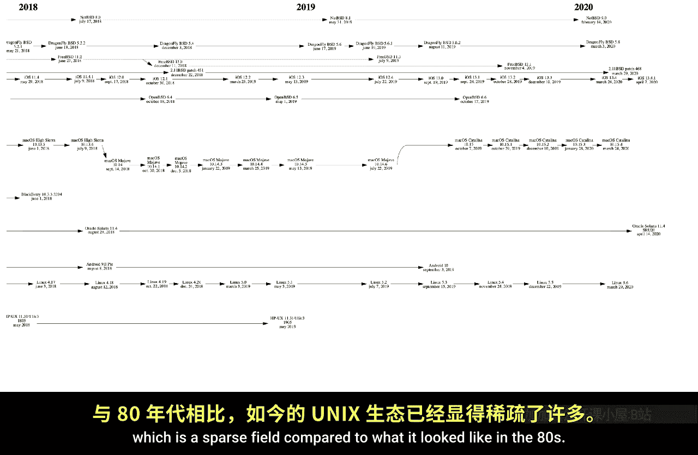
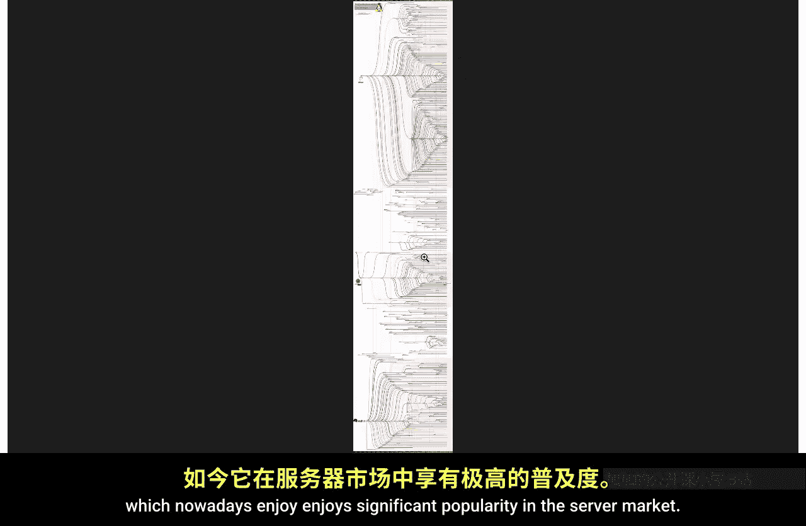
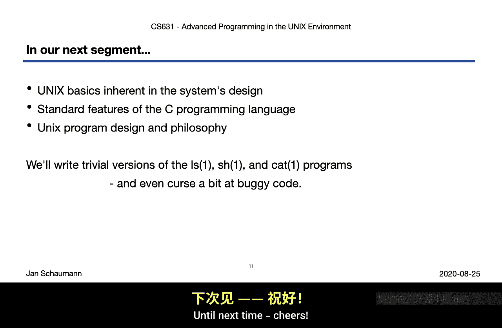

# 史蒂文斯理工学院【中英⚡计算机系统管理｜CS615 2021 System Administration】 p04 p3 Advanced Programming in the UNIX Environment： Week 01 - UNIX History -BV11QQcYmEzD_p4-

Hello and welcome back to our second video lecture for week1 of CS 631 Advance programming in the UniX environment。

In our first segment， we discussed all the what， why and how of the class。

 We introduced the course syllabus， and I want you about all the code you'd have to write for this class。

In this segment， we'll briefly review the history of the Unix operating system。

There will be intrigued lawsuits， differences of opinions and one of the two holy wars。

Although we leave the most sensitive political battle。

 the eye versus emex and addressed so as not to offend anybody value。🤧B I。

The Unix operating Systems family has come a long way from a test platform for Ken Ts and space travel game running on a PDP7 to the most widely used server operating system。

Its history begins at AT&T Bell Las in New Jersey， with Dennis Ritchie and Ken Thompson。

 shown here working on the PDP 11， Work together with Dr McKilroy and Jo Asana in a replacement for the Maltics operating system。

The C programming language was developed in parallel， within as Rie，4 and on Euchs。

 deriving from the B programming language developed by Ken Thompson for the new or S they wrote。Then。

 as Rich he describes the history of the language in the operating system at the link shown here in the slides。

Eventually， sometime around 1973 or so， Eunx itself was rewritten in sea and。Wait a second。

 If it was rewritten， then what was it originally written then。The answer is that early on。

 Eunx was written in assembly for the specific target platform and hardware。

And only as Ken Thompson and as richie developed C as a systems programming language。

 did they then decide to rewrite the Os to take advantage of this new high level programming。

This way， the operating system became portable， meaning it was no longer tied to the hardware question and could be recompiled for other platforms。

In 1975。Cun Thompson was as unsbbatical from Bell Laps and went to the University of California and Berkeley as a visiting professor。

Since its parent and company， AT And T was prohibited from selling the operating system。

 the laboratories licensed it together with a complete source code to academic institutions and commercial entities。

This one might argue ultimately LED directly to the very notion of open source when the computer systemss Research group or C S or G at UC C Berkeley extended the operating system with their patch sets。

Graduate students Jackuck Haley and Bill Joy， who in 1982， would go on to cofos and microcrosystems。

 added new tools and other software and eventually began distributing these as the Berkeley software distribution。

 or BSD。During that time， two main lineages of Unix developed the BSD derived or influence systems。

 as well as those deriving from what became system 5 of Ex。

 one of the first commercial versions of the O。As development on the different operating systems continued。

 the folks over at Berkeley added the TCPIP stack funded by a DARPA Research grant。

This stack is still the defect of cement implementation of TCP IPP and can be found in a number of other operating systems。

In the meantime， a company called BSDI began selling their version of Unix based on the Berkeley software distribution。

Called it Beerers D Os and branding it as eunx。They even had a telephone hotline called 1，800。

 itss Uni。No， Bell labbs had licensed the O S and the source code to Berkeley。

 but P S D I was selling a product derived from this code and was subsequently sued by Uni Systems Laboratories USL。

 a subsidiary of AT& T Bell labs at that time。Now， BSDI claimed that they could not possibly be at fault because they got their code from UC Berkeley。

And so USL said Kbins will sue UC Berkeley as well。But now， things got interesting。

The B S D patches had always been licensed under the so called B S D license。

 which in a nutshell said， you can do whatever you want with this code。

 including selling it as closed source， But you need to give us credit。

 Just say your product includes code developed by us when everything Peeey。Sounds pretty simple。

 right。And the BSD patches included so much cool stuff。You had TCP IP， NFS， VI， and much， much more。

Many of the commercial units providers at the time had by then incorporated these patches。

A said USO in the product they then licensed and sold。

Only USL appears to have forgotten to include in their copyright notices the disclaimer that the code did originate at least in part from BSD。

 which according to the license term， they were obligated to do。So UC Berkeley。

 over the Spky Californians， when threatened with a lawsuit said， you know what， we're suing you。

After some time， then， the case was settled。 UC Berkeley would rewrite the bits that were encumbered by the old AT& T license。

 leading to a code base without any proprietary code known as 4。4 B SD light。At this point in time。

There were about six files that still retained encumbered code out of 18000 files also。

 So eventually that was rewritten and the 4。4 BSD light release of BSD became the new unencumbered version。

At this time， they had already been born two descendants of B S D。

 Ne B S D was first released in March of 1993， with a focus on portability and technical correctness and free B S D first released in December of 1993。

 with a focus on the new I 3，86 platform。Meanwhile， over in Finland。

 a young computer science student named Leno Storws had been playing around with Min。

 a un operating system created by Andrew Tenbaum， and he had just finished his own O Colel。

 turned Linux， which he released on the Internet in 1991。

Ls had chosen the Nu public  licenseence for his colonel。

 This license originated from the Gs Notd Unix Project。

 an effort created in the early 80s by Richard Stman at M T to develop a completely free un like operating system。

The new project had written a compiler， an editor， Emex， of course。

 various utilities and all the other things。 but they had been lacking a kernel up until now。

 an operating system without a kernel is not really an operating system。

 just like a kernel without the remainder of the operating system is not an operating system either。

So the announcement of the Linux kernel under the GPL allowed the Gnew project to create finally a complete operating system。

 Gnew slash Linux。But is， in fact， the correct name for the operating system that nowadays。

 everybody and their brother and sister everywhere refers to as Justlylin。Now。

 in contrast to the BSD license， the GPL provides additional restrictions on the recipient of the software。

It seems counterintuitive in that it was a free softwarelicence， but it did add a restriction。

 an important one。That is you are free to use the code in any way you solve fit。

But if you made any changes to the code， those changes had to be released under the same terms。

 those of the GPL。That is in contrast to the BSD license。

 which merely states you can do whatever you want， including make modifications。

 keep those modifications to yourself and then sell the resulting product so long as you acknowledge where the original code came from。

The birth of this new operating system， Ganew Linux。

 despite a more restrictive license that normally might make businesses hesitant to adopt at the time that the USO versus UC C Berkeley s B SDI lawsuit was ongoing may have directly LED to broader adoption of Linux over the B SD variance and possibly caused Linux's market dominance nowadays。

Of course， we don't know for sure since we can't go back in history and evaluate what ifs at that time。

But be that as it may， throughout the 90s and early 2000s。

 many of the commercial Uni versions lost market share。

 but the number of interesting developments continued onwards from there。

You'll see over here in the slides a whole bunch of them listed by year。

 several items that may be of interest。 Of course， iss not an exhaustive。The Darwin operating system。

 for example， was derived from next using the Mac microcro kernelnel with code from the userland coming from free inNePSSD。

 It was born around 2000。This， of course， is no surprise in that Steve Jobs。

 who had left Apple and then worked for next， had been using this kernel and upon his return to Apple。

 began working on this operating system that would later on develop into Megas 10。Solaris。

 the operating system that followed Sun microcrosystem Sunnos。

 after merging a number of PSD patches and a number of system 5 derived features。

 developed a number of other groundbreak features， including ZFS。

 a very advanced file system with novel ideas， dets and containers when at that time containerization was really not yet widespread use。

Android Linux variant and iOS， effectively a version of Darwin and thus BSD derived。

 ended up on our mobile devices。So throughout the last 50 years。

 we've seen a perhaps surprising number of Uni systems。Some of them are all CAPPS UniX systems。

 which derive directly from the AT&T code。Some are trademark UniX versions。

 meaning they have undergone certification to meet the UniX specification。

This trademark certification is expensive， so not many companies would do that and every time you make a change。

 you would have to undergo the same certification again。 therefore。

 a number of operating systems providers and especially open source projects would not undergo the certification and not become a trademark Uni。

 even if they are a so called genetic units。And then there are so called Unis like operating systems。

 meaning those are operating systems that share no linear or code。

 but they look and behave just like a Uni system。So on this slide。

 you see basically a small selection of Uni systems。

 which I primarily shown to remind people that there are more Uni flavors than merely Linux。

The interesting thing is that even though these different variations of ex do behave by and large in the same way。

Meaning， if you are able to use one operating systems。

 you should be able to quickly and easily adapt to the other。

And if you could write code for one operating system。

 you should be able to quickly adapt your code for the others。And again。

 the difference to Linux here is that all of these are separate operating systems。

 while all the different Linux distributions that we see are just that Linux distributions。

 versions of packaging Linux。But realistically， out there in the so called mystical real world that we occasionally refer to。

 you will only come upon a shorter number of all these different operating systems。

So over here is a list that derives them or that groups them together primarily under Linux BD and other。

 even though， as you can tell， the other category has overlapped with。First， too。It's important。

 again， to note that Linux is a one Uni like operating system。

 which just happens to come in a surprisingly large number of distributions。

 whereby different projects or companies have bundled different pieces of software together。

One company may add a web server or database server。

 another company may focus on desktop usage and still pick and patch together the same pieces。

 the kernel and other libraries and tools， bundle them together， perhaps offer support。

 and call it distribution。This is not even different from the other operating systems。

 which remain whole units and cannot be split up or recombined。

We do not have a number of distributions of net B S D。 There's only one net B SD。

 We do not have a number of variations are free B SD， Open B SD or dragonfly B SD。

 Those are all coherent units that are one and the same。Now。

 the market share for commercial Uni platforms outside of Linux。

 the BSDs and the mobile platforms has increasingly shrunk over the last few years。

 So you are unlikely to encounter the range of operating system variants I showed in the previous slide。

But nevertheless， some of them are still out there working hard。Now。

 our reference platform for this class isn't at BSD。NetPS T then is a direct to true genetic Uni。

 even though it does not hold the Uni trademark。The Open source NePSSD Foundation does not have the monetary resources to undergo certification for their product every time they make a new release。

But as a whole operating system provides not just a kernel。

 but system libraries and user utilities that all are developed together and provide a coherent self and a coherent entire O image。

Being a complete operating system it also includes some additional information。

 such as the summary of the Uni history as it relates to the BSDs。

You can find this history under user share M， and may be fun for you to browse through this tree。

As you can see， we have here。A shortened version of the Unix history。

 as we just rehashshed by identifying the different lineages and showing release dates as they correlate between the different BSD variant。

As we scroll through here， we identify how dragonfly splits are free BSD。

 we saw earlier open BSD splitting of net BSD， and then we move forwards through time as the different releases are made。

Towards the end of the file， we then have an itemized list of all release dates for the different versions。

 including additional history information about the different branches and the operating systems。

And it may be useful for you to just poke around and see where all these things end up。

But to really understand how widely used， how diverse the term Unix is。

 let's have a look at the complete family tree here。

You see the timeline of most Uni versions as has split off the original systems from Bell labbs。

As we scroll to the right， we can see the birth of the Berkeley software distribution with its various releases alongside several commercial Uni distributions。

Over here in 1984。We see Mins being born。T one at the bottom， splitting off off the。

Initial Uni versions。N see progress through the mid 80s。

 You will notice that there's a lot of variation。A lot of code flowing back and forth between the different operating system。

Notably， most OS vendors are importing the BSD patch sets to get all the features developed in Berkeley。

Now， over here in 1991， we see the birth of the Linux colonel branching off of the Linux timeline。

In 1993， you see the first appearance of net BSD。Followed soon after by the birth of free BSD in December of the same year。

Thisis agreements within the Ne BSD developer group leads to the fork of Open BSD of the Net BSD timeline in 1995。

In the late 90s， Apple begins developing Mac O X or Mac O S 10。

Which is officially released for consumer products， around 2001。

M O X server was released before that。Now， as we scroll through the early 200s。

 a time that doesn't feel all that long ago to me by that。 I guess by now actually is。

 we notice that there's distinctly less cross pollination between the different operating systems and fewer commercial versions appear to have survived。

In 2008。Android appears。A Linux version for mobile devices。While Apple's iPhone a O later becomes i。

 as we all know。You see it over here in the timeline。Developing first is iPhone OS then becoming iOS。

We noticed some code sharing in parts based on the liberal BSD license。As we see over here。

 Ne BD code flowing into a few other products， such as the recent Min release around 2012。

and a free b sD feeding back into different products such as juos and PC c b s d and other products。

But as we are catching up with 2019 and 2020。We are left with but a handful of popular unx versions。

The final releases that we see over here remain net BSD， free BSD。Then we have Mac O。

 We have open Solars。 We have Linux， of course， Android， H U X。But that is about it。

 which is a sparse field compared to what it looked like in the 80s。

Now， lest you think the lineage of Linux by itself is any less nuts。

 here's a quick look at how the different Linux distributions developed over time。

It looks just as bonkers as the regular Uni timeline graph， doesn't it。

We identify a few major lineages here as well。 There's Debian， which。

 as we follow this brownish line over to the right。Leads to Uuntu and all the variant。

You see a number of short lived projects。Before we take a look at Slawelllinix。

 one of the oldest distributions alongside Devviian。

 which then also develops or forks off the Sua variant of。At the bottom of our graphic。

 we see Redhead Linux， which now a dis enjoys significant popularity in the server market。

Anyway， as we've seen， the history of Unix and Linux as one version of Uniix like operating systems。

 is diverse。It is no surprise in that nowadays， we find ununuchs just about everywhere。

Your next runs on your desktop， your laptop， your servers。

 It powers the public clouds provided by Amazon and Google， It runs on your TV， your phone。

 your watch， your stereo， your car navigation system。

 meaning you may at times have to pull over off the road to install a software update。

 your thermostat， your refrigerator， your toaster， et cetera。 that one。This is not only fascinating。

 but it also has a number of implications。On the one hand。

 And this is why this class is particularly relevant and hopefully of interest to you。

 It means that if you understand Eunuch， you will better able to understand how all of these things work。

On the other hand， this also means that your fridge now has a CVE that your thermot runs a web server that can be hacked。

We're running a general purpose operating system on the internet of things without much consideration for how to manage the assistance。

But do take a look at the printed manuals or some of your devices。

I'm sure you will find the number of copywriters claimers in them saying this product includes software derived from software contributed to Berkeley Bay or this product includes software written by the regions of the University of California or something similar。

It's a world full of eunuchs， eunuchs， everywhere。Okay， few。

 this concludes our brief history of the UniX operating system。In our next segment。

 we'll take a closer look at the features and properties of the system。

 of the features of the C programming language， and we'll discuss the UniX program design and philosophy。

We'll also finally get to write some code as we explore these features。

 so please make sure to keep your eyes open for the next video lecture。Until next time， pierce。

