# 史蒂文斯理工学院【中英⚡计算机系统管理｜CS615 2021 System Administration】 p07 p6 Week 2, Warmup Exercise 1 - No Space Left On Device -BV11QQcYmEzD_p7-

Hello and welcome back to CS615 System Administration。As we're moving on to week2。

 where we are going to be talking about storage models and file systems。

 I thought it might be useful to start out with a quick exercise to warm up。For this。

 we're going to try to follow every Suman's favourite train of thought。 I wonder what happens if。

I recommend that you use this video to follow along and run the same commands。

 but also to then think beyond just what you've seen and explore more。

So make sure to open the terminal and play along， pausing the video as we run through this episode of Full House entitled No Space left on device。

Let's begin by starting a new screen session。If you're not familiar with screen or with T marks。

 I recommend that you check out the tooled video of link from the course website。But let's continue。

We log into the Linux La and take a look at how much disk space we have on the local file system。

Looks like we have plenty of space，11 gigs。Let's create a large file to use up all that disk space using the DD command shown here。

This is going to take a few seconds， but eventually you're going to run out of space。

The file we created is 11 gig large， so not surprisingly， or our file system is now full。

 preventing us from writing any data or creating any new files。

But this can have other negative side effects that may be quite a bit less obvious。

With the fris not completely full。Let's try the login again。Again， we run SSH and。Oh， oh。

 may get some arrow messages。But we're still logged in， aren't we。Let's try to run a few comments。

What。Nothing's working。Let's check what's going on on the other show where we were logged in in the beginning。

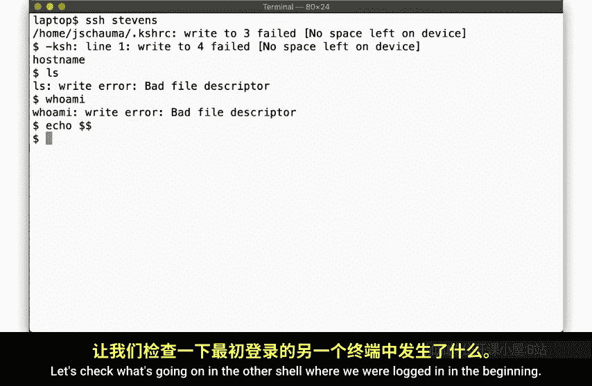

First， let's take a look at the def standard in。 defaf standard out， and def standard are devices。

 They all point into the profs， a pseudo file system representing file descriptors。Now。

Let's see what processes we're running。

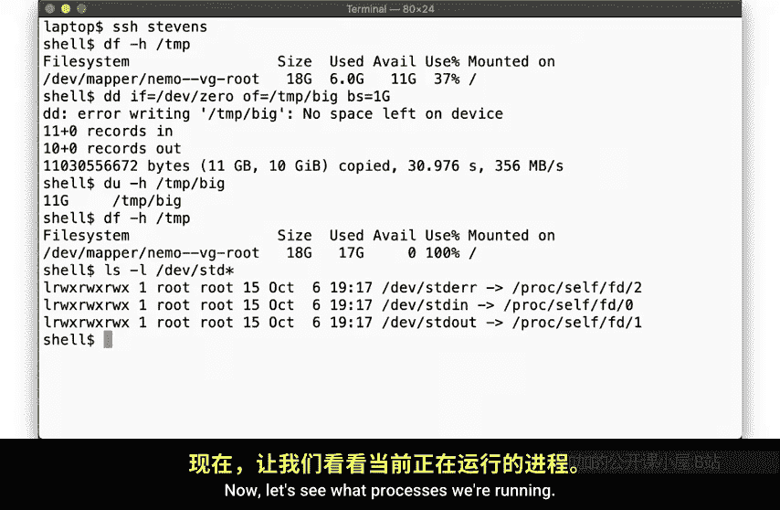

Well， this shell appears to be processed ID 2115。The other show running must then be the one that's so broken。

 Pi 21，57ft。

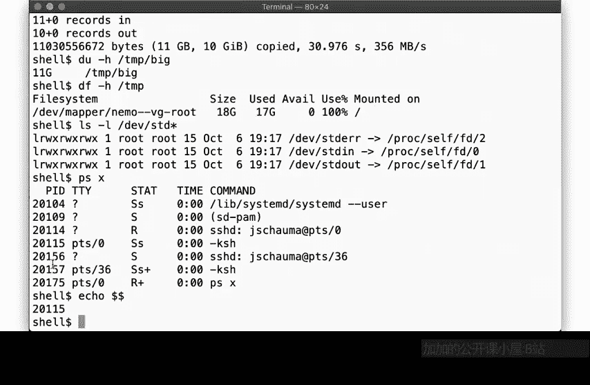

So we can look at the file descriptors associated with that pit under Proc 2157 FD。

Here we find a few open file descriptors with file descriptor 0 and 2， send an in to that error。

 pointing to the pseudo terminalminal PT S 36， but we notice the absence of the file descriptor 1 standard out。

This explains whether the commands we render didn't produce any output。 Senout was apparently closed。

As it turns out， my login shell， KS H， the so called cornorn shellll。

 tries to open a few files and youdirect own you log in， but if the file system is full。

 it can't do that and we end up in an impressively busted state。So let's try another show instead。

The SS H command lets you specify a commander on when you connect。 So let's run bash。 now what。

No error。 Are we logged in。Turns out， we are。When we run a command directly via S S H。

 then we don't get a pseudo terminal allocated， but the command ba in this case is still connected to standard in and send the out of the S H command。

 So we can run commands。 No， there's that big file we created。

But we'd be more comfortable having a normal shell。 let me log in。

So let's ask SSH to allocate a pseudo terminalmin for us by specifying the D T flag。There。

 that looks more normal， doesn't it。So apparently， Bsh has no problem with a full file system at login time。

And we can now remove that big file that we created that's building up all disks based on caused of problems。

Okay， now with that cleaned up， we can exit here。Now that the disc space that was taken up by the file tempic has been made available again。

We can check in our connection in the broken shell， which still remains broken。

Because just by removing the file does not miraculously allocate a proper file descriptor for the show we are sitting here。

So let's exit that shell and reconnect。There， everything's perfectly normally it。Now。

 if you try to recreate the scenario， please do make sure to remove any large files you create so that the system does not get negatively impacted by you playing around with those exercise。

You will likely see slightly different behavior depending on whether you have bash as your login shell。

 but I specifically wanted to illustrate that the act of filling up the file system can have an effect on seemingly unrelated processes with possibly confusing or inconsistent results。

One user might complain while another user might not notice anything odd right away。

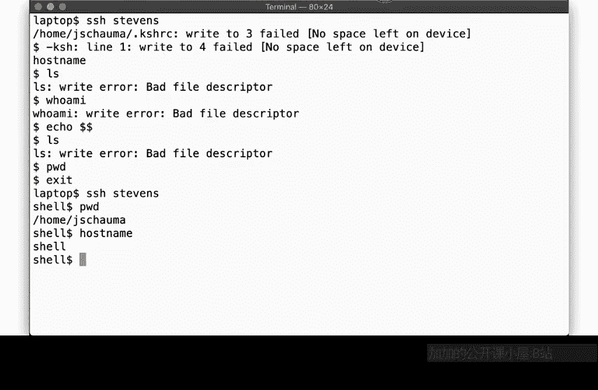

Allright。So you've seen what happens when we fill up all our disk space with one giant file。

 Let's try something else。Again， let's take a look at how much disk space we have available here。

And let's create a directory on their s temp and specify a pass name for a large file we want to work with。

If we look at the output of the DF command， we can extract exactly how much disk space is available。

From the fourth field。There。Now we'll use the truncet command to create a file of a specific size。

Specifically， we'll try to create a fire that's many times larger than the available disk space。

So we copy those command here。And append a few zeros。There。Wait what？

 We were able to create a file that's thousands times larger than the available disk space。

 How did that work。😊，Look at the size of this file。 It's impossible。

And D F even told her that we have plenty of room to spare。 This makes no sense。

What does D you tell us about this file。Okay， the U tells us this file uses zero blocks。

What does that say。

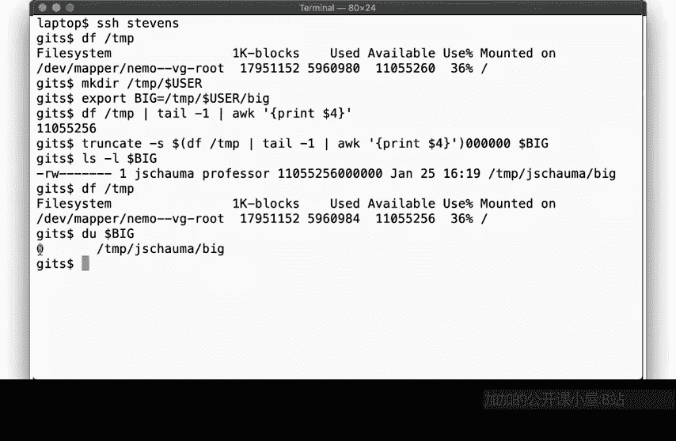

Stat shows us the file size is being really large， but still using zero blocks。

So what on earth is going on here？The file we created clearly appears to both have a huge size and use no disk space。

This is because it was created by simply setting the file size， but not by writing any data to it。

 It's a so called sparse file。Not all file systems supports Spf， but this one does。

What happens when you copy this file。Okay， that seems to work。

 Now we have two of these weirdow files here。Both seemingly huge in using no disk space。

This is because the C command is smart， It detects that this is a sparse file and then creates a true copy of this file。

But if we try to read the file using CA and then redirect the output to another file。

suddenly it takes a really long time。 And eventually。

 we get back the error that put out of disk space。And now I look at these two files。

The second file now uses lots of blocks on disk， so many that it filled up the file system。

This is because when the colonel tries to read a sparse file， it notices that there's no data there。

 So it supplies nullbits instead。 and the reading process will then see nullbits， which in this case。

 it writes out to the second file。Weird，hu。As you can tell， our disc is now actually full again。

 and only after remove the files do we get back our disk space。

So this is an illustration of surprising behavior that may depend on the file system in question。

If you run these commands in some other operating system or using a different file system。

 you may get a different result。But all right， let's move on。

Weve now seen how a system behaves if you create really large files when you actually write data。

 it obviously uses up the disk space， but you are also able to create a file that looks like it's huge but doesn't take up disk space。

But what happens if instead of creating one huge file， you create lots and lots of small files。

Let's give it a try。Here we use the DF D icon and to inspect the Iode usage of the file system。

We'll go into much more detail in a future video segment about what exactly an I note is。

 But for now， suffice it to say that each file is associated with an I note。 So in this case。

 we have 923261 available free i notess。If we create a directory。Then weve used up one eye noteote。

And if we create one file。Then we up another eye note。Likewise， if we removed the file。

Then we get back the eye note。And likewise， for the directory。Makes sense。

So now let's see what happens if we use up all of our Inos For that， we need to create 923261 files。

It's going to be tedious if we run individual commands。

 so I wrote a simple program to create new files for us。You can fetch it from our course website。

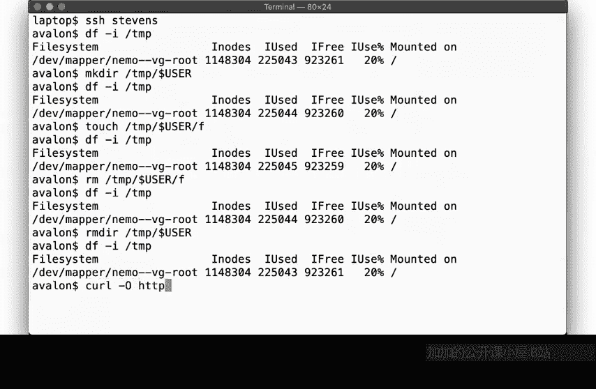

And it looks like so。We create a directory， and then we loop forever creating new files in the directory until we fail。

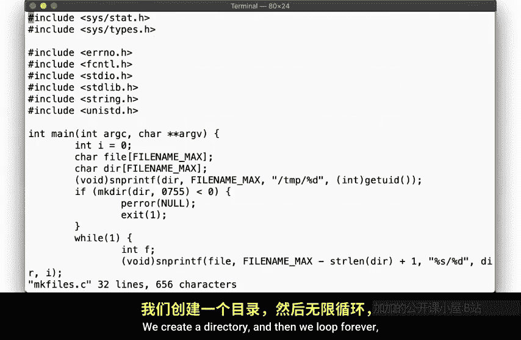

Let's compile and run this program。Okay， so after some time， the program will fail as we expect。

It reports that it has created 923260 files。Plus， that one directory and it created the files。

Note the error message， no space left on the vice。 Sounds like full house。 I mean， disc fall。

Let's take a look at the size of the directory。Nopes， wrong path。Over here in slash temp。There。

 this directory is pretty large。Let's look at the files we created in there。

Notice how even running a lesson on it takes a long time。That's because the directory is so large。

Let's confirm how many files are found in the directory。

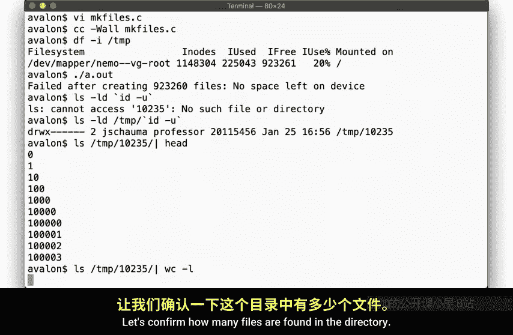

Yip 923260 files。So now let's try to create a new file。

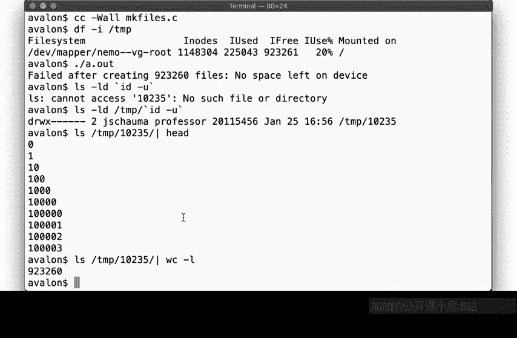

Nope， no can do， no spice left on device。But I can move a fire from the directory and to another one。

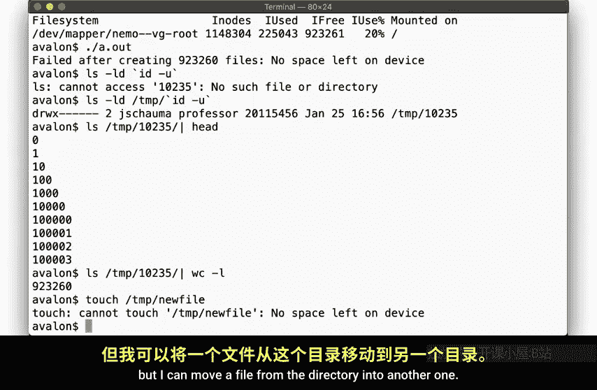

This is because moving a file does not create a new file。 again。

 we'll get the details of that in a future video。

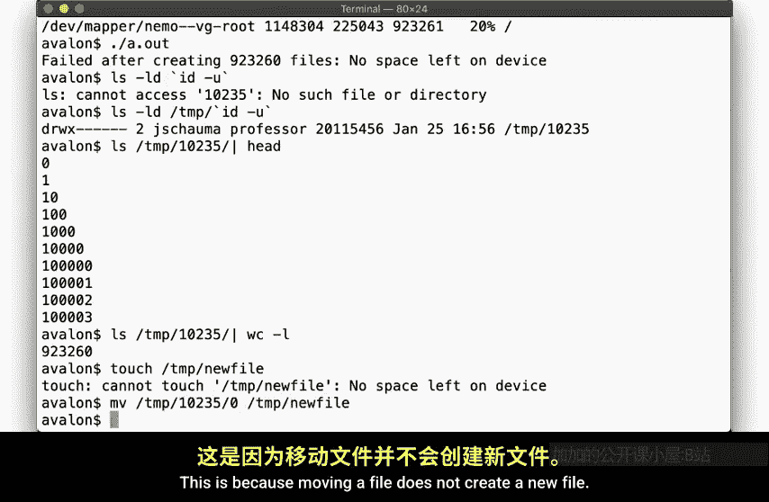

But so the file we created is 0 by in size， and so are the other 923259 files。

But how can we be out of disk space then， didnn't we have 11 leagues of space available。Well。

 it turns out that we aren't out of disk space。 We actually can still write data to the disk。

So long as we write it to an existing file。

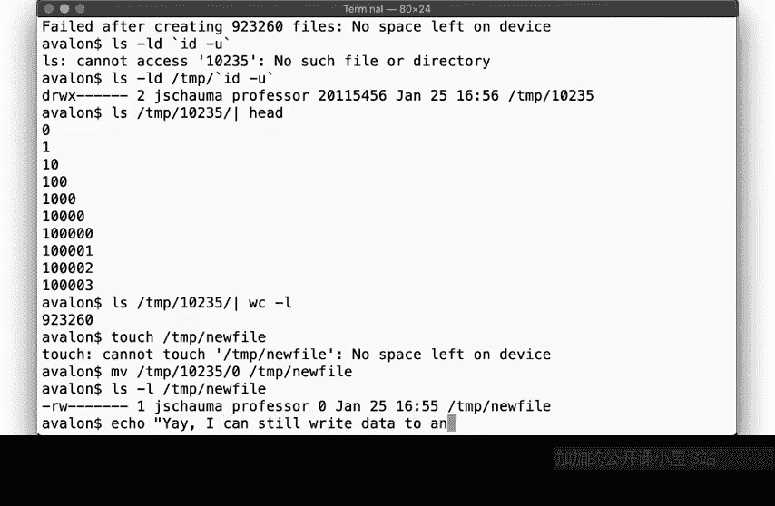

We are out of i notess， meaning we can create new files。

 but we can certainly still have this space available as shown here。

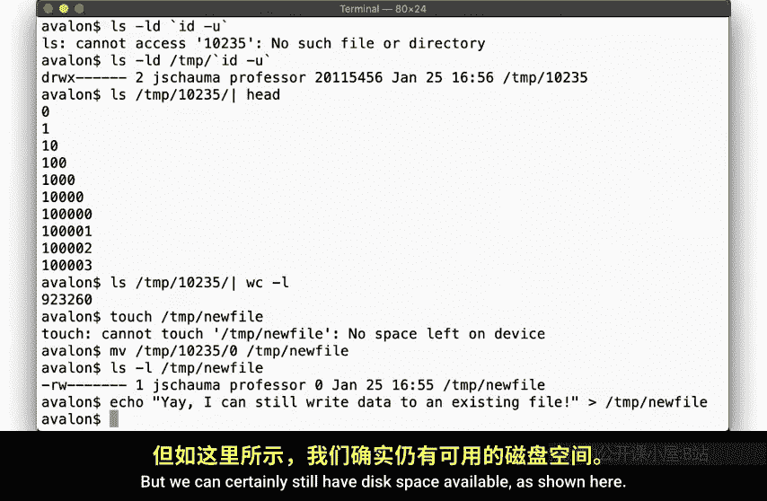

In fact， we can easily write a gigabyte of data to the existing file。

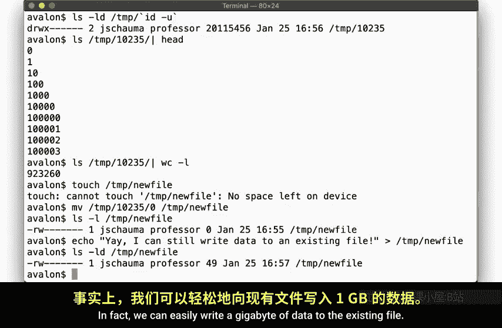

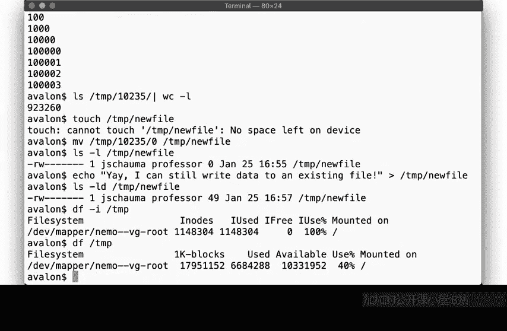

See， no problem。But let's clean up and remove the almost 1 million fires we created here。

Note again that this takes quite some time。Let's suspend the process for a second and check if we've made any progress。

Yep， looks like we've freed up almost 200，00 nodes already。 let's continue。Oh。

 and let's also take a look at the directory size while removing all those files。

Look at that same size as when it contained almost a million files。All right， more on that later。

 Let's continue for now。There we go。Back to where we started。All right。

 Did you run the same examples， Did you play around with what happens when we use up disk space or i notess。

He had the key things that one of exercise was intended to illustrate。One。

 running out of disk space can lead to odd side effects。

We saw that when some users were unable to log into the system because the disc was full。

 but other users had no problem。2， file sizes are not always what they seem to be。

 It's a difference between a file size and how many blocks of disk space a file uses。

 And this difference can be significant depending on the file and file system。

3 error messages aren't always what they seem to be。When we went out of I notess。

 the error message was no space left on device， but this misleading。

If you saw this error message and then ran D F， it would have shown you many gigabytes of fi disk space。

It's important to know the different error scenarios that could lead to this error message when you're troubleshooting your system。

And 4， and this is something we'll get back to time and time again。 All resources are finite。

It may seem that nowadays， we have a lot of disk space， but if it's possible to exhaust it。

 some process somehow will。A common Uni file system may seem to have near infinite number of files it can store。

 but the file system is restricted by the number of available i notess， and those can be used up to。

We'll see many other examples throughout the semester。

We also revisited a lot of what we touched uponny in the next couple of videos。

 but I hope that this warmup exercise helped to get your thinking about file systems and the resources we're managing in this fashion。

Make sure to check out links in the slides and read it up on the suggested reading material。

Next time we'll talk about storage models and I hope that you will keep the limitations we've seen here in the back of your mind when we do。

Until then， thanks for watching， cheer。

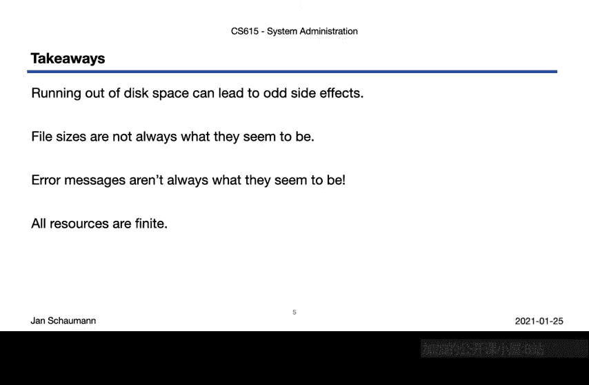