# 计算机系统管理：CS615：第2周第1节 - 存储模型与磁盘 💾

在本节课中，我们将要学习数据存储的基础知识。作为系统管理员，我们需要管理各种存储设备，从无本地存储的系统到支持分布式数据复制和归档的大型企业存储阵列。理解不同的存储模型和磁盘概念是构建、维护和扩展可靠IT基础设施的关键。

我们首先讨论这个话题，是因为没有数据存储，我们甚至无法启动操作系统。我们总是在处理存储数据的方式，因此，作为一项核心资产，我们至少需要大致了解其中涉及的内容、可能出现的问题以及如何扩展数据访问。

谈论数据存储的容量总是一项徒劳的努力，因为无论我们提供多少，很快就会被用完。就在几年前，能访问1GB数据都令人难以置信。如今，为视频、照片和音乐准备1TB存储空间似乎已不稀奇。数据总会膨胀以填满任何可用空间。无论分配多少存储，用户总会找到方法将其用尽。因此，我们需要思考如何避免磁盘永远处于满载状态。

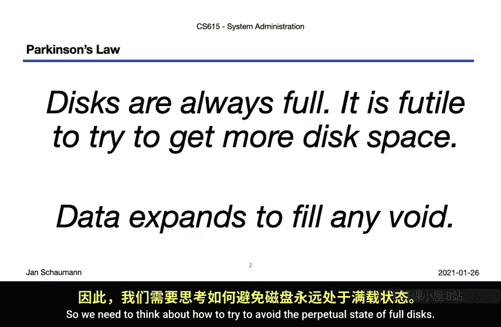

为此，我们将讨论以下内容：
*   基本磁盘概念
*   基本文件系统概念
*   通用文件系统，特别是传统的Unix文件系统

在每个主题下，我们都有一些子主题。为了理解基本磁盘概念，我们需要先了解常见的存储模型，这是本视频的主要主题。之后，我们将讨论磁盘接口、磁盘驱动器的物理特性，以及分区。这些知识对于后续理解文件系统概念至关重要。

接下来，在文件系统概念部分，我们将探讨如何使用冗余磁盘阵列（RAID）和逻辑卷管理（LVM）来组合存储设备，以及格式化设备如何影响存储能力。最后，我们将讨论在正确连接存储介质后可以做什么，包括文件系统的类型以及传统Unix文件系统的工作原理。这部分内容将在下周讲解，而本周我们将尝试涵盖所有其他主题。

那么，让我们开始吧。

## 存储模型 📊

我们根据负责存储比特的设备与上层交互的方式、原始块设备访问的提供位置、创建文件系统以将磁盘空间作为有用单元提供的位置，以及操作系统访问文件系统所使用的协议，来区分不同的存储模型。简化来说，我们识别出以下组件：
*   **操作系统**
*   **存储设备本身**（即实际存储比特的物理设备）
*   **文件系统**，位于存储设备之上，与应用程序软件交互

### 直连存储 (DAS)

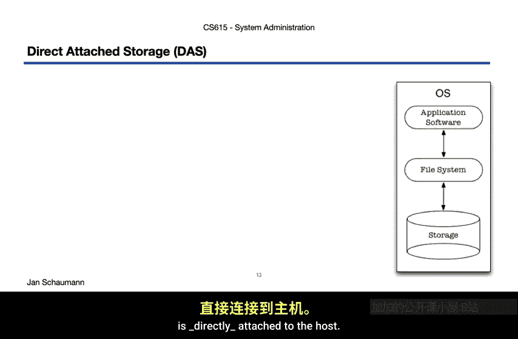

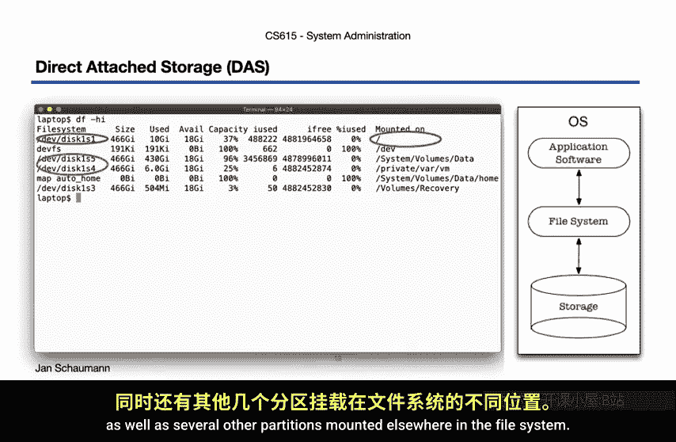

首先，也是最常见、最简单的存储模型是**直连存储**。顾名思义，存储介质（最常见的是物理硬盘）直接连接到主机。

如果你查看你的笔记本电脑、工作站、台式机或物理服务器，很可能会找到一个物理硬盘。在这个模型中，我们在物理磁盘上看到一个分区（例如 `/dev/sda1`）挂载在根目录 `/` 下，以及其他几个分区挂载在文件系统的其他地方。

对于工作站或典型服务器，直连存储设备可能是一个常规的IDE硬盘。存储设备是物理服务器的一部分，由操作系统管理。文件系统在存储设备上创建，并将硬盘提供的块级存储以文件级访问的方式提供给应用程序软件。

直连存储是一种非常简单的架构，具有许多优点。由于操作系统和硬件之间没有网络或其他附加层，因此消除了该层面的故障可能性。同样，由于网络延迟等原因导致的性能损失也不存在。同时，它也有一些缺点。由于存储介质是直接连接的，这意味着它与网络上的其他系统存在一定的隔离。这既是优点也是缺点。一方面，每台服务器都需要某些数据对其操作系统是私有或唯一的。另一方面，一台机器上的数据不能立即提供给其他系统。

### 网络附加存储 (NAS)

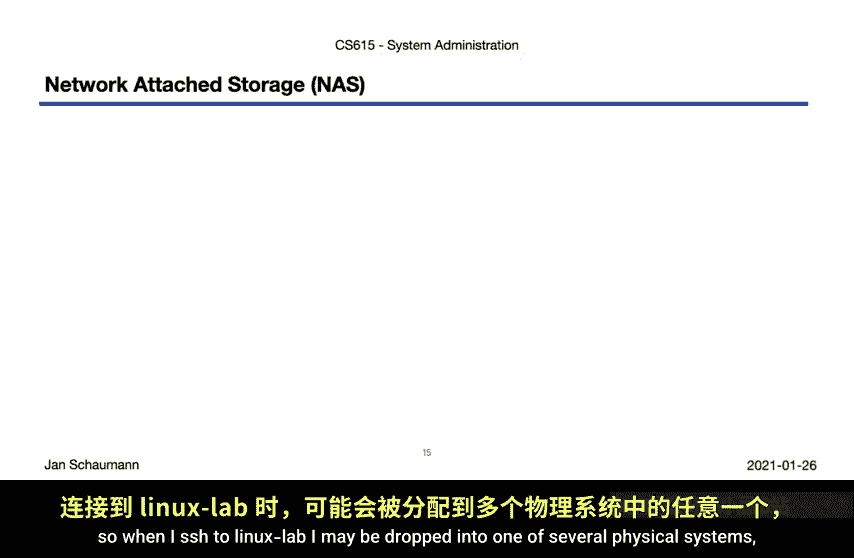

然而，我们经常希望能够从多台服务器访问某些数据。例如，当用户登录到主机A时，她期望找到所有文件，就像登录到主机B时一样。在Stevens的共享Linux系统中，我们通过负载均衡器访问Linux实验室，可能会被分配到几台物理服务器中的一台，但我仍然期望并确实能够访问我的所有文件。

实现这一目标的方法是将数据存储在**网络附加存储**设备上，该设备位于某个中心位置，并通过例如**网络文件系统** 进行访问。那么，这是如何工作的呢？

我们看到有一个中央服务器（例如 `chronos.sit`），它从我的主目录提供数据。在本地主机上，它被挂载在特定的路径下（例如 `/home/ds`）。文件服务器必须拥有实际的存储设备，并在其上创建了文件系统，然后通过网络使其可用，以便客户端可以访问它。但这些客户端需要支持NFS，而NFS又为应用程序软件提供了文件级访问的标准化抽象。

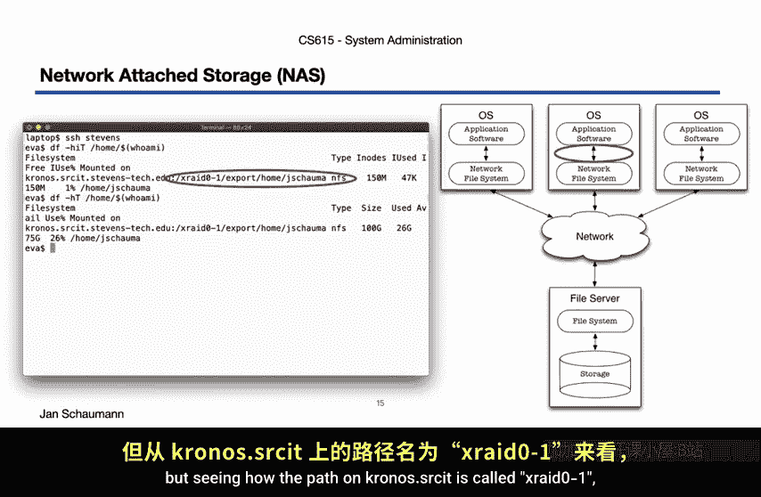

请注意，文件服务器以直连存储的方式访问存储设备，这意味着它（尽我们所能推测）物理连接到该服务器。这在实践中的样子取决于系统的规模。例如，`chronos.sit` 上的路径 `/xraid01` 可能是一个Apple Xraid存储设备。

网络附加存储允许多个客户端通过网络访问同一个文件系统，但这意味着它要求所有客户端都专门使用这个文件系统。NAS文件服务器管理并增强了存储介质上文件系统的创建，并允许共享访问，克服了直连存储的许多限制。

### 存储区域网络 (SAN)

然而，随着我们对存储大小、数据可用性、数据冗余和性能的要求不断提高，特别是当我们需要扩展时，允许不同客户端在块级别访问大块存储变得非常理想。为了实现这一点，我们构建了专门用于管理数据存储的高性能网络，即**存储区域网络**。

在这些专用网络中，中央存储介质使用高性能接口和协议（如光纤通道或iSCSI）进行访问，使暴露的设备在客户端上看起来是本地设备，有效地表现为一个块设备，就像直连存储一样。从存储池中划分出的另一个块，可以被一个单独的文件服务器用来构建新的文件系统，并通过NFS导出，如图所示。

存储区域网络也是专门的网络，也就是说，它们可以配置成真正的交换结构，使用看起来很像网络设备的硬件。它可以使用各种协议在现有网络上叠加存储通信，或构建全新的独立网络，通常使用光纤连接。

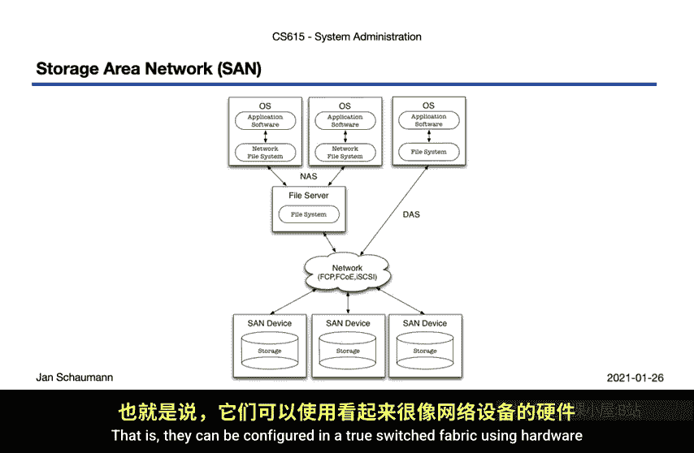

### 云存储 ☁️

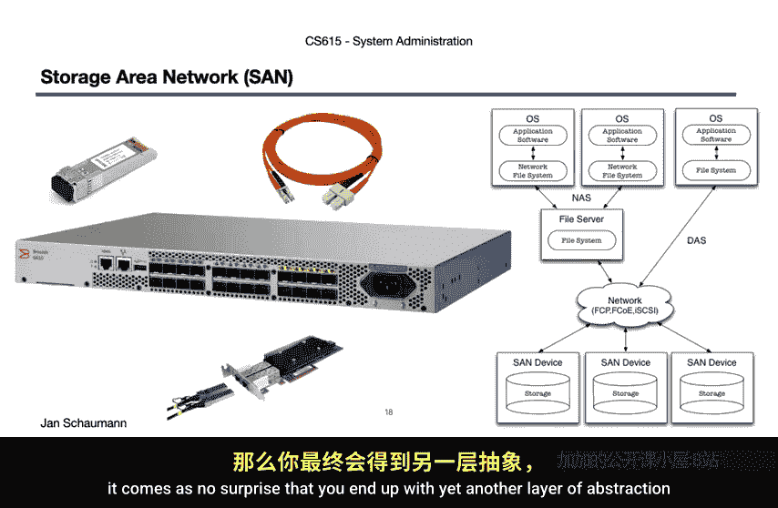

一旦你理解了SAN可以是一个完全交换的结构，并可用于提供灵活的块级存储和文件级网络存储，那么出现另一层抽象并开始以“云”的形式提供存储即服务也就不足为奇了。

在这里，我们还想做出另一组区分：
1.  **提供文件级存储和访问的服务**，例如文件托管服务，如Dropbox、Google Drive或Apple iCloud。
2.  **提供对象级访问的服务**，向客户端隐藏文件系统实现细节，并提供易于抽象到API中的接口，以Amazon简单存储服务 为典型代表。
3.  **在块级别向客户端提供访问的服务**，允许他们根据需要创建文件系统和分区，例如AWS弹性块存储。

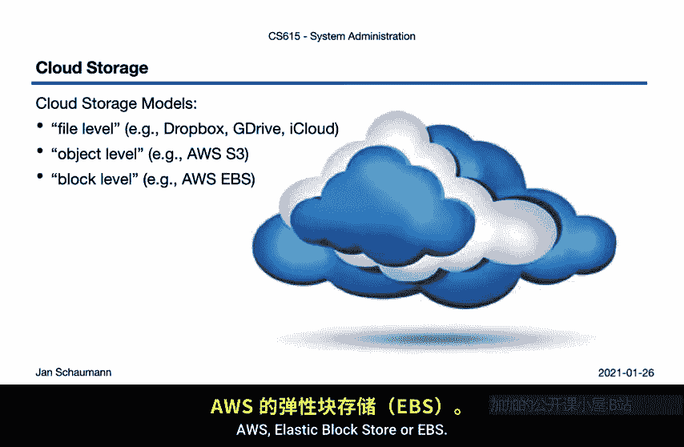

所有这些类别都有一个共同点：为了提供以编程方式访问存储单元的能力，它们提供了一个定义良好的API进行访问，通常是基于HTTP或REST的。在服务提供商端（如图形底部所示），所使用的存储模型对客户来说是一个不透明的系统。他们可能使用存储区域网络来组合大量分布式存储资源，向用户呈现一个大的存储池。作为系统用户，我们并不关心这些，存储就像凭空出现一样神奇。

我们已经并将继续通过使用AWS来了解这是如何工作的，但让我们快速说明对象级和块级之间的区别。

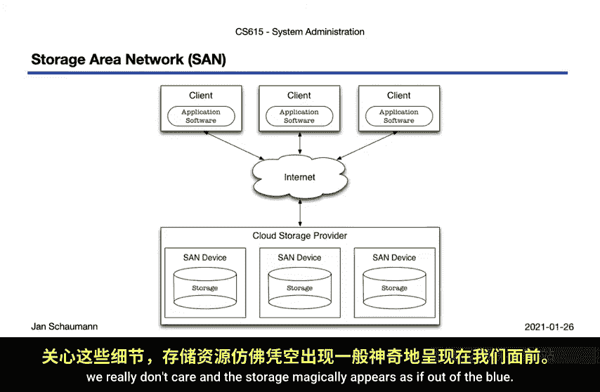

首先，让我们看看S3。我们创建一个新的S3桶，然后递归地将一堆文件复制到其中。就这样，不需要其他任何操作。它真的不能再简单了。就这样，我们将一个充满文件的目录备份到云存储中，能够通过命令行检查内容，而无需担心是否有足够的可用存储空间、文件有多大，或者可以创建多少文件是否有限制。

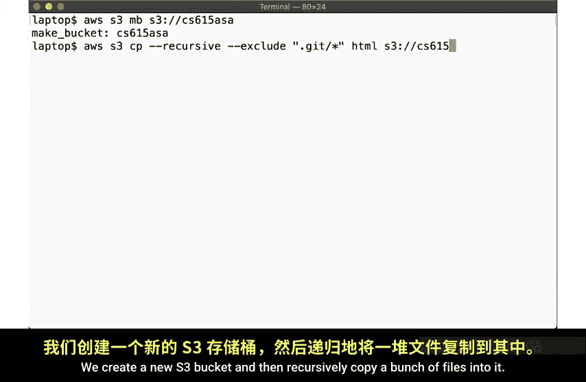

接下来，看看弹性块存储。顾名思义，这种云存储方法允许在块级别进行访问，这意味着我们获得一个看起来和行为都像真实磁盘的设备。从实例的角度来看，这实际上只是直连存储的一种变体，因为虚拟机不知道也不关心块设备来自哪里。事实上，常规的AWS EC2实例将使用EBS卷作为本地存储。

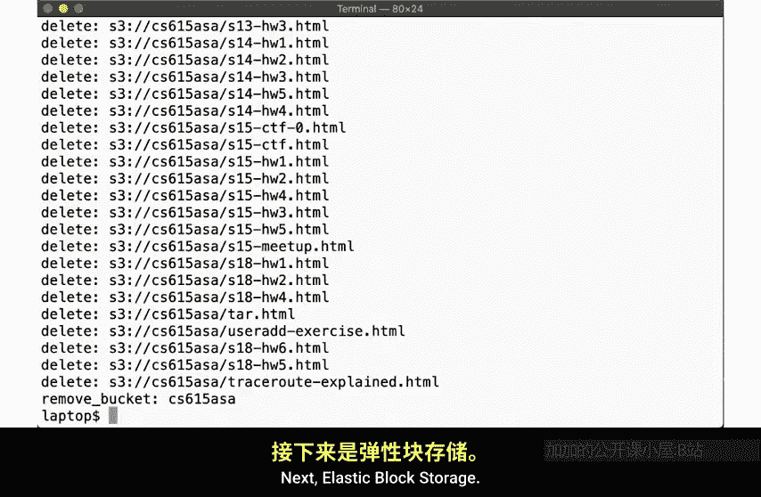

在这里我们看到，有一个卷作为磁盘 `/dev/sda1` 被附加。我们可以通过 `describe-volumes` 命令获取更多信息，了解卷大小和一些属性。使用EBS，我们总是可以神奇地创建新磁盘。例如，创建一个新的4GB大小的磁盘。作为一个块级存储设备，我们不能直接向其中写入文件。我们需要创建一个新的文件系统，我们将在稍后的推荐练习中回到这一点。现在，让这个简短的演示来说明云存储可以是什么样子。

## 总结与回顾 📝

本节课中我们一起学习了四种主要的存储模型：
1.  **直连存储**：存储设备直接物理连接到主机。
2.  **网络附加存储**：通过文件级协议（如NFS）在网络上共享文件系统。
3.  **存储区域网络**：通过专用高速网络提供块级存储访问。
4.  **云存储**：通过API（文件级、对象级或块级）提供的按需存储服务。

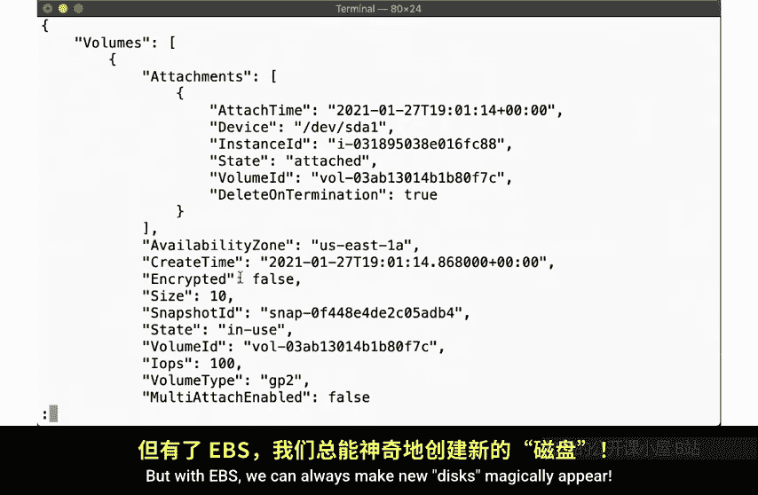

我们注意到这些模型可以组合使用，并提供不同类型的访问，主要区分了**块级访问**（设备表现为直接连接的物理磁盘）和**文件级访问**（系统通过文件系统或API与存储介质交互）。

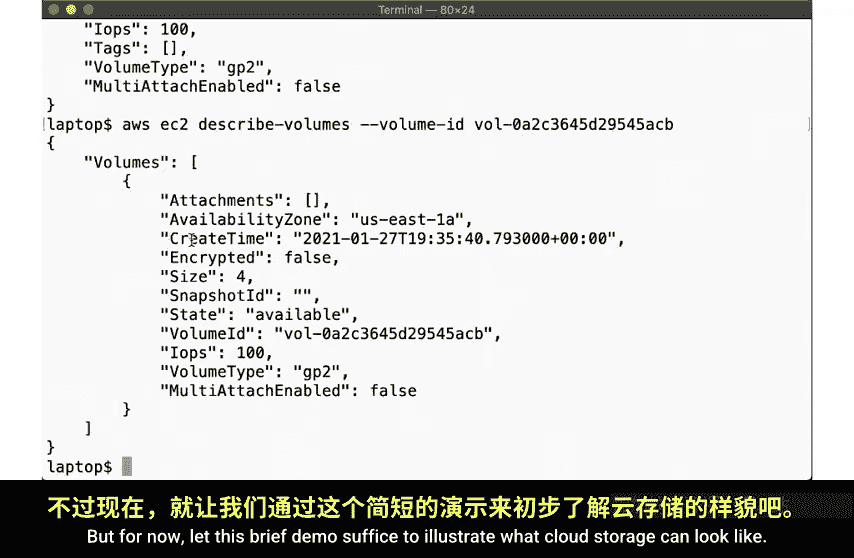

每种模型都有许多含义。首先，重要的是要记住，即使我们处理的是云中凭空出现的“神奇”存储，在某个地方，总有人在管理物理存储介质。其次，随着我们增加抽象层并允许更大的灵活性，我们也在改变安全模型。一个直接连接的物理驱动器只能从该主机或通过物理访问被破坏，但网络文件服务器可能通过网络被破坏。我们还注意到，在组合不同模型时，我们最终可能会使用或组合大量的技术和协议。

我们将在下一个视频中简要介绍其中的一些，届时我们将讨论接口和协议。

## 推荐练习 💡

在结束之前，我想留给你一些推荐的练习和问题，以帮助你加深对今天所学内容的理解：

1.  **研究公共云存储服务的细节**：尝试研究一些公共云存储服务（如AWS、Google Cloud、Microsoft Azure等）的细节。你能找出它们在后端可能使用什么存储解决方案吗？它们必须考虑哪些可扩展性问题？
2.  **思考安全影响**：思考我们讨论的不同存储模型，并识别特定的安全问题。每种模型都有特定的安全含义，但具体可能是什么？
3.  **动手实践EBS**：这是一个更具体的练习，我建议你创建一个EBS卷，将其附加到一个实例，创建一个文件系统，添加一个文件，然后将该卷移动到另一个实例。这将帮助你更熟悉弹性块存储和文件系统概念。

如果在练习中遇到问题，请记得提问。

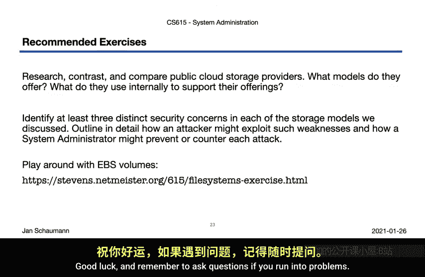

下次见，感谢观看。