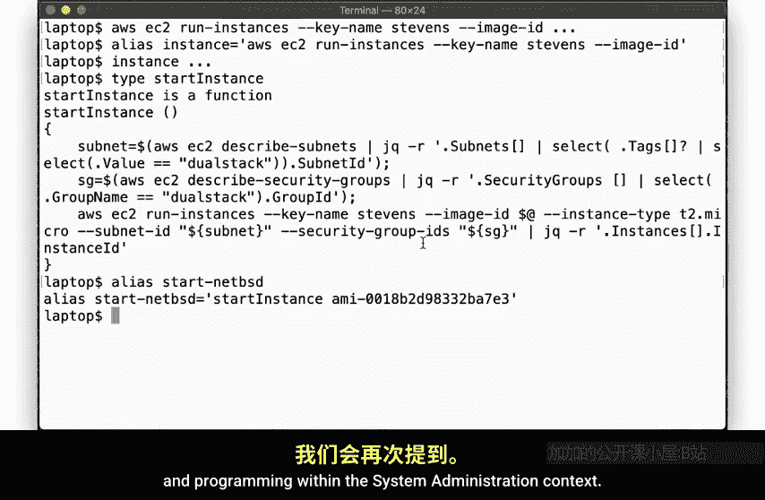
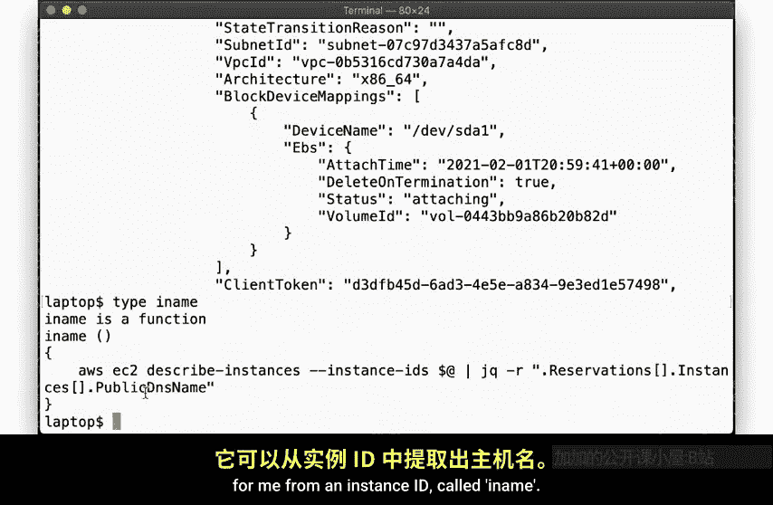
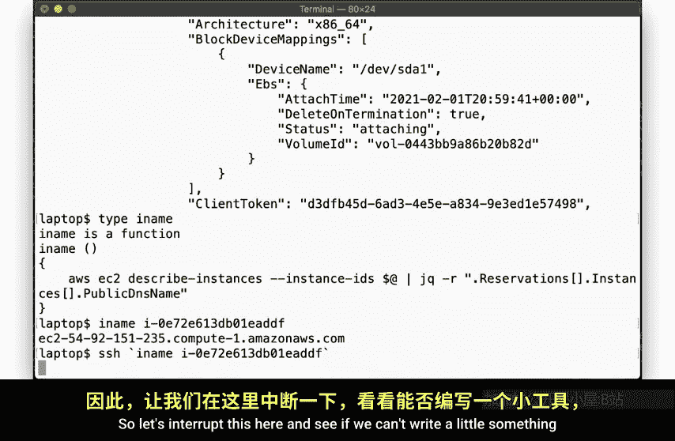
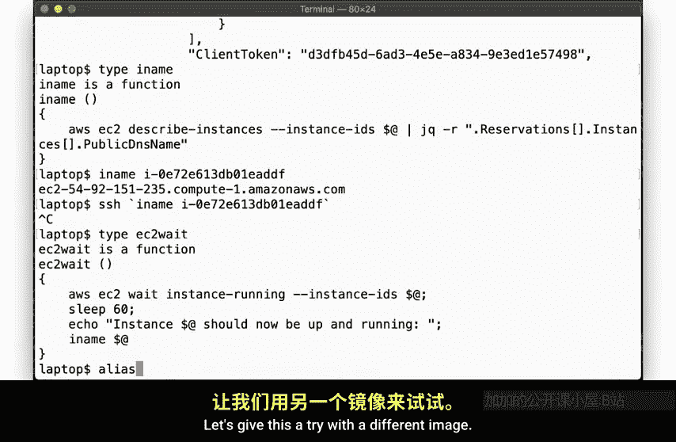
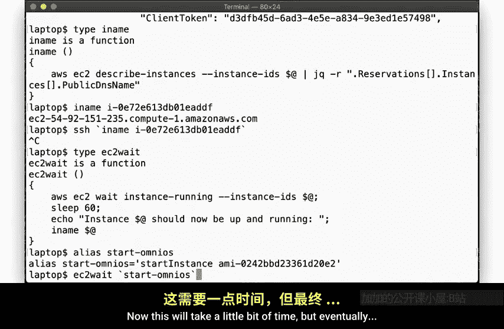
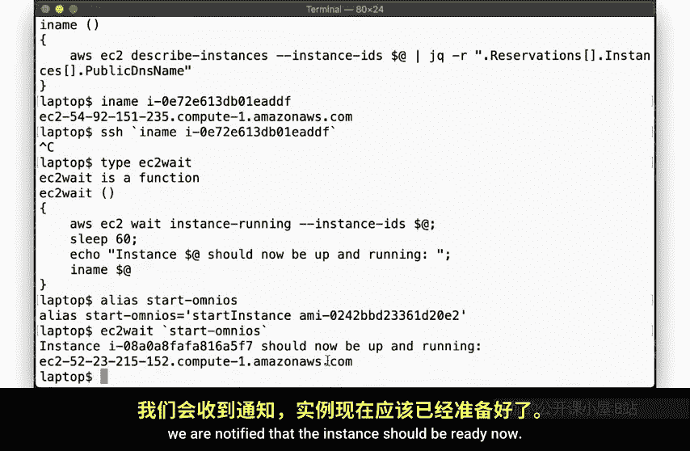
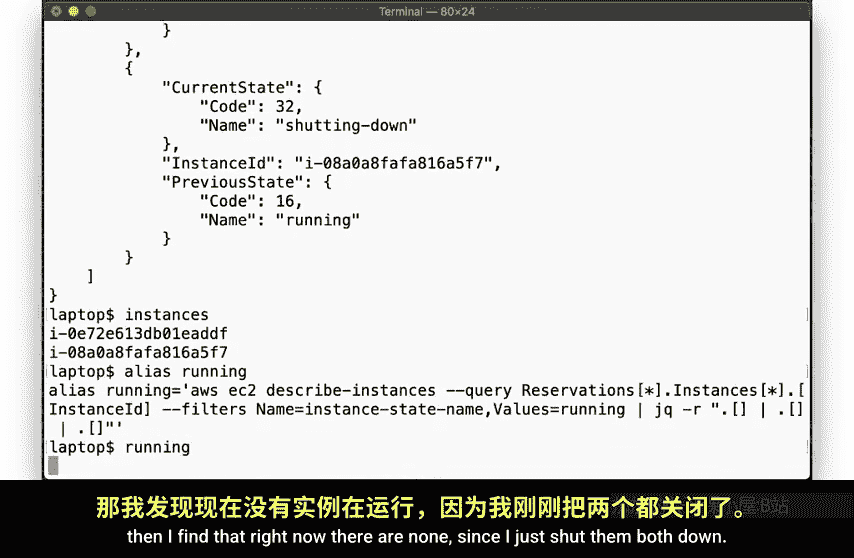
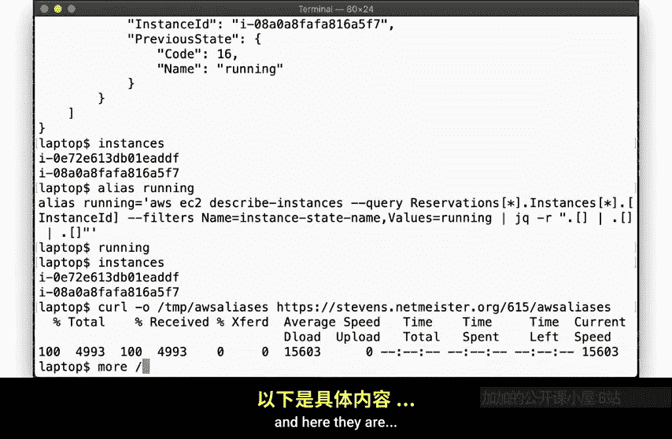
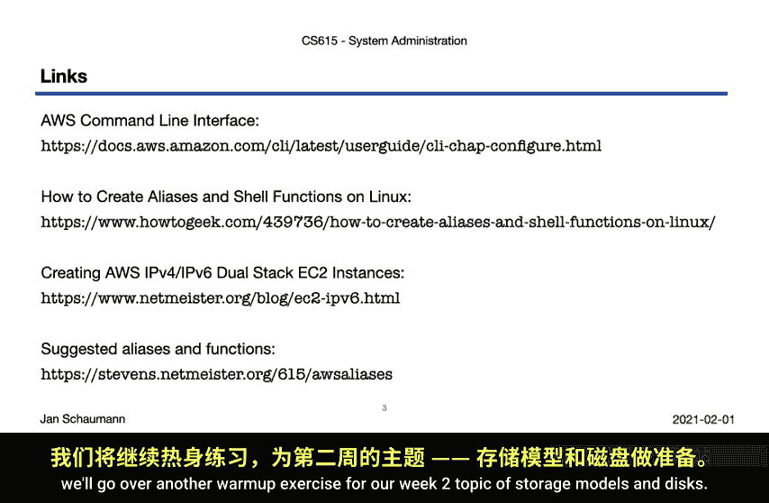

# 史蒂文斯理工学院【中英⚡计算机系统管理｜CS615 2021 System Administration】 p10 p9 Warmup Exercise - AWS aliases -BV11QQcYmEzD_p10-

Hello and welcome back to CS615 System Administration。As you know。

 we'll be using the commandl interface to Amazon Web Services exclusively for all our work in this class。

 and so I wanted to show you a few quick ways to save yourself some typing。As I'm fond of noting。

 system administrators are notoriously lazy and want to avoid having to repeat anything if we don't have to。

To this end， I'll show you how to set up a few shell eliausees and functions to work with the AWS command line tools。

Let's go。So we rather frequently have a need to spin up a new AWS instance。And to do that。

 we have to run the AWS E to run instances command and specify the AMI ID。

But now I happen to use a different keyer for all my AWS instances for this class。

 so I also have to specify key name Stevens for every instance I create。

That's a lot of characters to type。So let's create a shell areas for this。With this。

We can now simply type instance followed by the AMI ID。

But I also want all my instances to be full dual stick IPV4， IPV6 enabled。Unfortunately。

 AWS does not enable this by default， and you need to configure a sub and security group appropriately。

I have a blog post linked at the end of the slides here and if you follow that。

 you end up with a security group and a subnet with a tag dual stack。

So I can rep the command to launch an instance using the subnet via this shell function start instance。

This function grabs the Snet ID and security group ID from the tag。

 then runs the instance alias with those parameters so that you just have to give it an AMI ID。

Now I will frequently use a NePSSD AMMI， and I don't want to have to remember whatever that identifier is。

So I have another alias called StartNetBSD that calls this function with the right AMI。

As we show these aliases and functions， I hope you notice that there's a fair bit of reusing certain building blocks。

 a pattern we will revisit later this semester， and we talk about automation and programming within the system administration context。

But okay， so let's launch one of these instances。By running the start netPSSD alias。

 we will pass this AMI here into the start instance function and get back the instance ID。

But we need to know the host name to be able to log in。So let's run AWS EC2 describe instances。

And there it is。😔，But so that's not very convenient。

So I have another function that extracts just the host name for me from the instance ID called I name。

There。That looks better。So let's try to login。Hm。😊，Now， this is taking a while。

I'm sure you have noticed that when you spinit up an instance。

 it'll take a while for the system to come up。So。Let's interrupt this here and see if we can't write a little something that lets us know when the system is ready。

So here I have a function that uses the AWS EC2 weight command for the instance to enter the running state。

But unfortunately， in instance， being Marcus is running in the AS does not guarantee that it's fully Bued necessarily age is running。

 so we add a little bit of a delay here。This is a bit suboptimal， but it beats trying to。

SSH over and over again， although perhaps you can find a better way。

Let's give this a try with a different image。

We also often will use the Omniio operating system， so here we have an alias for that。

So we can now run the E2 weight function like this。Now， this will take a little bit of time。

But eventually we are notified that the instance should be ready now。

I know。We can enter age for the instance。예。What about the other instance？😔。

You can use the Iim function again。There we go。Alright， so now we have multiple instances running。

 and I often want to check which ones we have。So for that， I have another alias called instances。

This gives me the instance， Ids。But of course， I also often want to see the host names。

 so here we go with the I names alias。What if you want both？No problem。

 we have nailliaius for that tube。See， I told you that Jake Hugh was great， didn't I？All right。

 time to shut down these instances。Yeah，There's so much typing again。There。

 term instance is much easier。And what if I want to just kill all instances I am running？There。

I'll be careful with that one。Okay， now both of the instances I just started are shutting down。

But note that even when they're shutting down。They still show up in the instances alias。

But if I want to know which instances are currently in running state。

And I find that right now there are none， students I just shut them both down。

All right， so those are just some of the aliases and functions I used on a regular basis。

 Ive put most of those into a file that you can download from the course website if you want to use them as well。

For that。You can curl it like this。And here they are。

Including the various instance types we'll be using。

So you can then place that file somewhere convenient。And then source it from your shell startup file。

The next time you start a new shell， you'll have all these handy aliases and functions ready for you to use。

All right， I hope you could play along with this video and see the benefit of customizing your shell environment so that you can save yourself some typing when running the same or close to the same command。

The links here will hopefully also be useful for you。In our next video。

 we'll go over another warm up exercise for a week two topic of storage models and discs。Until then。

 thanks for watching， cheereith。

