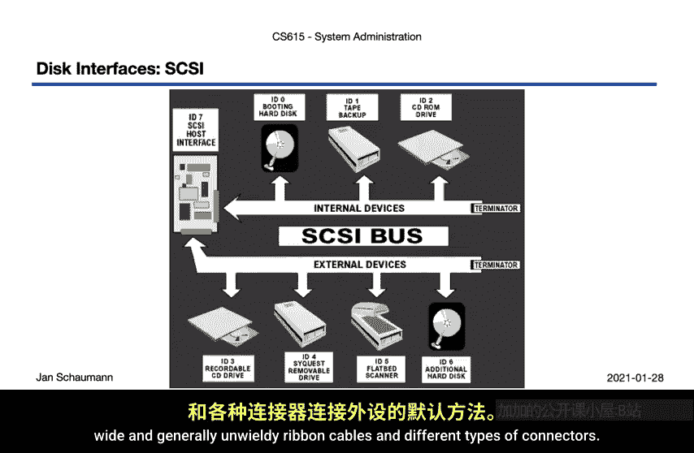
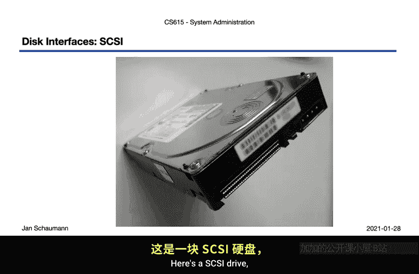
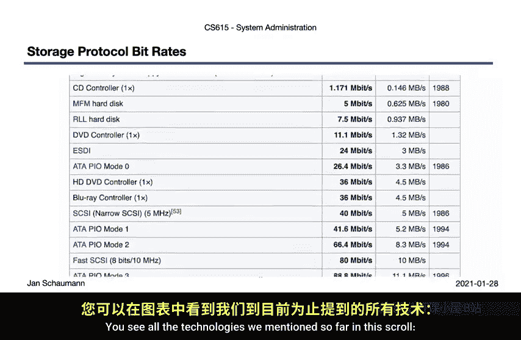
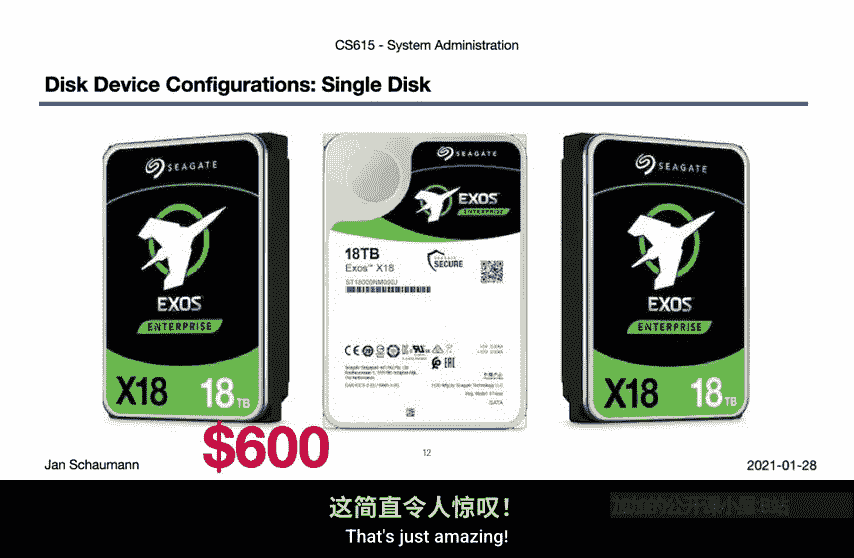
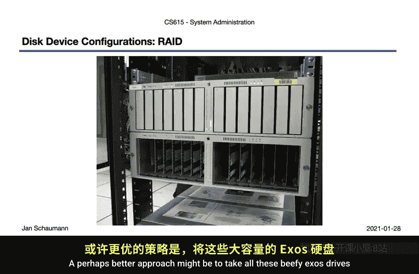
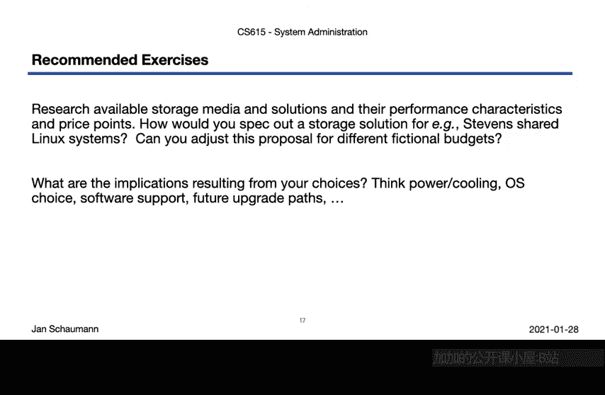

# 计算机系统管理：CS615：Week 02, Segment 2 - 设备接口 💾

## 概述
在本节课中，我们将学习存储设备及其接口技术。上一节我们介绍了存储的概念模型，本节中我们来看看具体的物理设备连接方式。我们将从早期的SCSI标准开始，逐步了解ATA、SATA、光纤通道以及固态硬盘等现代技术，并探讨它们如何组合以满足不同的存储需求。

---

## SCSI：小型计算机系统接口
SCSI是一种描述如何将设备或外设连接到计算机并在它们之间传输数据的较旧标准。它已存在超过30年，并有多种令人困惑的实现和变体。

SCSI曾是使用长而笨重的带状电缆和各种连接器连接任何外设的默认方法。

上图是一个SCSI驱动器。不同设备可能使用不同的连接器并需要不同的电缆。

如今，SCSI在很大程度上已被高级技术附件标准所淘汰，但它仍在iSCSI标准中延续。iSCSI规定了在基于IP的网络上使用SCSI命令协议的存储连接，这是存储区域网络中的常见选择。我们稍后将看到的另一个变体是串行连接SCSI或基于光纤通道协议的SCSI。

---

## ATA与IDE接口
另一方面，ATA标准通常等同于集成设备电子接口。

你可能见过使用扁平带状电缆的并行ATA，这种电缆使得在服务器机箱内连接多个驱动器变得困难。幸运的是，对于系统管理员来说，如今串行ATA更为常见。

这些是你的典型硬盘驱动器。它们之所以被称为“集成设备电子”，是因为驱动器包含了控制器，将原本位于主板和独立控制器上的部分复杂性集成到了驱动器内部。

也就是说，驱动器包含一个控制器电路以及一些固件，以方便访问。

---

## 安全考量
现在我们讨论的是相当底层的连接，但现在是提醒你安全影响一切的好时机。

几年前，有消息公开称美国国家安全局能够将恶意软件植入硬盘固件中。该恶意软件包含一个API，并能够向磁盘上的隐藏扇区读写任意信息。

这是一种非常难以防范的威胁，也很好地提醒了我们，几乎任何东西都可能被入侵。

具体来说，它帮助我们思考“集成设备电子”这个名字的含义，它意味着那里不仅仅有一些有用的“魔法”。

但不必过分担忧，并非每个硬盘都必然被入侵，你也不一定在NSA的目标名单上。

---

## 固态硬盘
然而，出于多种原因，包括安全性和更可能的性能考虑，你可能希望从IDE驱动器转向固态硬盘。

SSD驱动器摒弃了用于存储数据的机械旋转磁性盘片，转而使用集成电路来持久存储数据，例如闪存。

这些驱动器比IDE驱动器更能抵抗物理冲击，更安静，延迟也更低。这就是你的手机很可能使用SSD进行存储的原因。

虽然SSD仍然比传统的机械硬盘更昂贵，但如今即使在服务器市场，你也能发现更多SSD或闪存的使用。

这些驱动器仍会使用SATA标准进行连接，但也可能被组合成更大的存储设备，然后通过例如光纤通道协议在外部或通过存储区域网络连接。

---

## 光纤通道与协议栈
光纤通道通常用于交换式网络结构中，这意味着它的外观和行为很像你正常的交换式以太网网络。

它使用右上图所示的光纤电缆，尽管你也可以通过铜线运行它。

如果所有这些不同的技术还不够，你还需要考虑到，在几乎所有非最简单的环境中，当创建存储和网络时，这些技术都会以某种形式组合使用。

也就是说，你可能会发现一个多层协议栈建立在光纤通道协议之上，该协议可能用于纯光纤通道网络、运行在常规TCP/IP之上的以太网网络等等。

类似地，SCSI协议可以用于上述任何一种之上，或者通过像远程直接内存访问这样的技术。

也就是说，我们有各种方法将一种协议承载在另一种协议之上。

例如，ATA over Ethernet允许我们重用现有的以太网网络，并通过将ATA帧封装到以太网帧中，将其转变为存储区域网络。

Fiber Channel over Ethernet同理，但针对的是光纤通道协议。这让你了解了一种趋势，即人们意识到“嘿，我们已经有一个可用的网络了，就让它也承载块级指令吧”。所以你几乎可以在以太网上运行任何东西。

这使得事情变得相当容易，但也显著意味着，以这种方式构建的存储区域网络受限于同一网络层/网段，并且由于在该层运行，它没有固有的安全属性。

因此，你可以尝试通过使用例如iSCSI来将事情推向协议栈的上层，iSCSI包含身份验证，并且可以包装在IPsec中。

当然，我们还可以更进一步，转向我们之前提到的串行连接SCSI。如今，SAS被用于大型存储阵列中，例如下图所示的这种，它使用SCSI命令和协议在现代硬件上提供高效的高速存储访问。

但忠实于其SCSI传统，SAS当然也不乏令人困惑的变体和连接器。

---

## 性能与容量演进
正如你所见，在存储技术和协议方面，拓宽你理解或专精的机会是无限的。

快速浏览一下技术如何进步，请注意性能吞吐量如何随时间推移和协议不同而增加。

你在下图中可以看到我们到目前为止提到的所有技术，其比特率随时间增长。

注意光纤通道的引入，速率约为每秒100兆字节。

然后随着各种“over Ethernet”变体向前发展，现在超过了千兆以太网，最终超过了100千兆以太网，这确实非常出色。

这解决了吞吐量的比特率范围。但是，我们能在不同介质上存储多少字节呢？

单个IDE硬盘已经从1980年大约5兆字节、售价1500美元的驱动器走了很长的路，不是吗？我清楚地记得，当我们用500兆字节的驱动器构建服务器时，最终一个10千兆字节的驱动器被认为是巨大的，但当然，如今那不算什么。

事实上，IDE驱动器的存储价格下降得如此之多，你现在只需大约600美元就能买到一个18太字节的驱动器。

18太字节，在单个IDE驱动器中，这真是太神奇了。

所以，在某种程度上，升级你的单个磁盘驱动器是我们上一节讨论的纵向扩展的一个例子。

---

## 扩展方案：JBOD与RAID
但是，即使18太字节对你来说还不够，因为正如我们所确定的，使用量会扩张以填满所有可用空间，你可以考虑直接买一大堆驱动器，然后一个一个地连接起来。

这种磁盘配置通常被称为JBOD，即“只是一堆磁盘”，顾名思义。你会买一堆驱动器。

现在你的服务器上会有相当多的开销，因为你有15个独立的磁盘，但这肯定是一种可能代表横向扩展的方法，并带有其所有隐含的缺点。

或者，也许更好的方法是取所有这些大容量驱动器，将它们放入一个RAID控制器中，然后将它们组合成一个单一的卷，实际上结合了纵向和横向扩展的方法。

我们将在下一个视频中更多地讨论RAID。当然，没有什么要求我们必须为此方法使用IDE驱动器，我们可以改用SSD，就像这个一样。这是一个100太字节的固态硬盘。

100太字节，采用小巧的3.5英寸外形规格。唯一的问题是：这将花费你整整40，000美元。

是的，你没听错，100太字节SSD需要40，000美元。SSD确实更贵，但它们也比HDD快得多且可靠，所以这里谈的是纵向扩展。

现在想象一下，将其横向扩展成一个存储设备，该设备结合了SSD或闪存，就像下图所示的NetApp全闪存阵列一样。

---

## 总结
本节课中，我们一起学习了各种存储设备接口技术，从SCSI、ATA/IDE到现代的SATA、光纤通道和SSD。我们探讨了这些技术如何通过不同的组合（如各种“over Ethernet”协议和RAID）来满足性能、容量和安全需求。我们了解到，没有单一的简单解决方案，正确的选择取决于具体的需求、性能目标和预算。存储系统的设计需要在纵向扩展、横向扩展以及不同介质和协议之间进行权衡。

---

## 课后练习
假设你是史蒂文斯理工学院的一名系统管理员，需要更换当前用于Linux实验室主目录的存储系统。
你会提出什么解决方案？显然，你缺乏做出此决定所需的大量信息，但另一方面，你可以根据观察到的使用情况对存储需求做出有根据的猜测。
尝试规划一个解决方案，然后看看它们会花费你多少成本。接着考虑，作为一个学术机构，你可能受到具有某些限制的预算约束。
最后，考虑你的选择可能对计算机环境的其余部分产生什么影响。