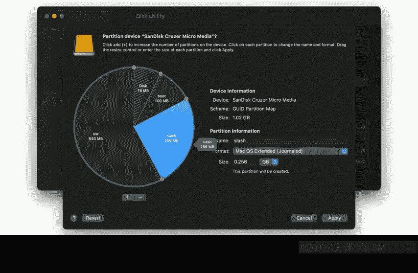
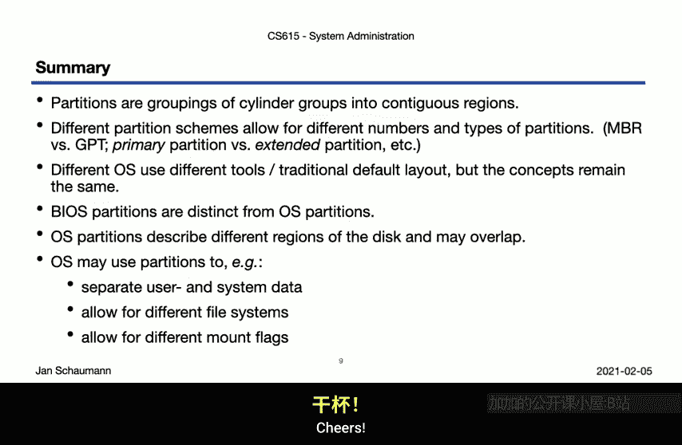

# 计算机系统管理：CS615：第2周第5节 - 磁盘分区 🗂️

在本节课中，我们将要学习磁盘分区和分区表的核心概念。我们将了解物理磁盘如何被逻辑划分，以及不同操作系统如何实现这一过程。

## 概述

上一节我们介绍了传统硬盘驱动器的物理结构。本节中，我们来看看如何将一个物理或虚拟磁盘划分为多个逻辑部分，即分区。



## 分区布局：从饼图到柱面组

许多图形化磁盘工具（例如macOS的磁盘工具）将分区显示为整个磁盘的饼图楔形。然而，这种表示方式具有误导性。

假设分区真的像饼图楔形那样布局。那么我们的磁盘驱动器上会有一个这样的分区。但正如上一节所讨论的，同一分区上的数据很可能被顺序访问。这意味着如果我们想从这个分区读取几个文件，磁头将不得不在整个磁盘上寻道。这会导致效率非常低下。

因此，让我们重新思考分区在磁盘上的实际布局方式。我们不使用饼图楔形，而是使用一组连续的柱面来创建一个分区，其布局如下所示：

```
[柱面组0] [柱面组1] ... [柱面组N]
```

现在，该分区上的所有数据都存储在这个柱面组环内。访问这些数据的效率会高得多，因为我们减少了寻道时间，并且可以在磁盘旋转时进行读写，而无需磁头大幅移动。

所以，与其使用饼图楔形，我们应该将分区可视化为连续的柱面组块。

## 典型分区布局示例

以下是一个典型的分区布局示例，它说明了分区如何按柱面组顺序排列。

首先，我们有一个小的引导分区，通常位于磁盘的开头。在上一节中，我们提到磁盘可能比BIOS能够寻址的范围更大。因此，历史上的布局将引导分区放在磁盘起始附近，以便操作系统能够启动，然后可能使用BIOS无法寻址但操作系统可以寻址的分区。这在现代虽然很大程度上已成为历史，因为现代BIOS和引导加载程序可以处理大磁盘，但这解释了为什么有时你仍然会在磁盘起始处看到独立的引导分区。

接下来，我们可能想创建一个交换分区，它从引导分区结束处开始，并延伸到特定柱面（例如柱面228）。

之后，我们创建根分区以及用户分区，填满剩余的柱面组。

## 实践操作：在不同系统上创建分区

理解了分区按柱面组排列的原理后，我们来看看如何在实践中操作。我们将比较在三种不同操作系统上创建相似分区布局的过程。

### 在 FreeBSD 上操作

在FreeBSD实例中，我们使用 `disklabel` 工具来显示和编辑分区表。

以下是使用 `disklabel` 编辑分区的基本步骤：

1.  显示当前磁盘标签：`disklabel da0`
2.  进入编辑模式：`disklabel -e da0`
3.  定义分区。例如，创建100MB的引导分区（a分区）：
    ```
    a: 63 204800 4.2BSD 0 0
    ```
    其中 `63` 是起始扇区，`204800` 是扇区数（100MB）。
4.  继续定义交换分区（b分区）、根分区（e分区）和用户分区（f分区）。注意，在BSD系统上，`c`分区传统上保留给整个磁盘，`d`分区保留给操作系统使用。
5.  写入更改并退出。

完成分区后，我们可以再次使用 `disklabel` 命令查看新的分区表，确认布局符合我们的柱面组示意图。

### 在 OmniOS 上操作

在OmniOS实例中，我们使用 `format` 工具。OmniOS默认使用ZFS池作为根文件系统，因此我们查看附加的独立磁盘。

以下是使用 `format` 工具的基本步骤：

1.  启动 `format` 工具并选择磁盘（例如 `c1t5d0`）。
2.  工具提示未检测到Solaris分区表（即主引导记录），因此我们运行 `fdisk` 创建一个。
3.  然后进入 `partition` 子菜单编辑分区。
4.  编辑分区0为100MB的可引导、可挂载引导分区。
5.  编辑分区1为256MB的可引导但不可挂载交换分区。
6.  编辑分区3为256MB的根分区。
7.  编辑分区4为用户分区，使用剩余磁盘空间。
8.  写入标签并退出。

之后，可以使用 `prtvtoc` 工具打印卷目录表，显示相同的分区信息。虽然与FreeBSD的示例有些不同，但核心概念相似。

### 在 Linux 上操作

在Linux（例如Fedora）实例中，有多种工具可用。我们使用 `fdisk` 或 `cfdisk`。

以下是使用 `fdisk` 的基本步骤：

1.  使用 `fdisk -l` 查看当前分区表。
2.  使用 `fdisk /dev/vdb`（假设磁盘为vdb）进入交互模式。
3.  使用 `n` 命令创建新分区，依次指定引导分区（100MB）、交换分区、根分区（256MB）和用户分区（剩余空间）。
4.  使用 `w` 命令将分区表写入磁盘。

我们也可以使用 `cfdisk` 工具，它提供菜单驱动的界面来验证布局。或者使用 `lsblk` 命令查看磁盘的分区情况。这些工具虽然语法和界面不同，但实现的目标一致。

## 为何需要分区？

最后，我们应该快速了解一下为什么我们需要对磁盘进行分区，而不是将所有磁盘空间作为一个巨大的整体来使用。

以下是分区的一些主要原因：

*   **分离系统数据与用户数据**：例如，防止用户向其家目录写入数据时填满系统分区。
*   **分离引导分区**：允许引导加载程序启动一个能够寻址对于BIOS来说过大的磁盘的系统。
*   **使用不同的文件系统类型**：不同的分区可以使用更适合其用途的文件系统（如EXT4、XFS、ZFS等）。
*   **应用不同的挂载选项**：例如，将系统分区挂载为只读，这样即使系统被入侵，攻击者也无法持久化安装后门；或者将某个分区标记为 `no suid` 和 `no exec` 以增强安全性；还可以在文件系统中启用或禁用异步I/O。

## 总结

本节课中，我们一起学习了磁盘分区的核心概念。我们了解到硬盘驱动器上的分区是柱面组的连续区域，因此不能可视化为饼图楔形，尽管许多工具中常见这种表示方式。

我们看到了不同的分区方案，提到了不同类型的分区（如引导、交换、根、用户分区）。虽然不同的操作系统可能使用不同的工具并存在一些细微差别，但总体概念保持不变：我们利用柱面组、磁道和扇区来寻址块，并通过描述这些分区来定义分区，最后将分区表写入磁盘。

我们还提到了BIOS或MBR分区与操作系统分区的不同，并将在未来的视频中详细探讨。此外，我们看到了分区可能重叠的情况，这取决于分区的目的（例如，描述整个磁盘的分区会包含其他逻辑分区）。



最后，我们讨论了分区磁盘的多种原因，包括数据分离、引导管理、文件系统多样性和安全加固等。随着后续课程深入文件系统、引导加载程序和系统启动过程，我们将重新审视其中的许多主题。