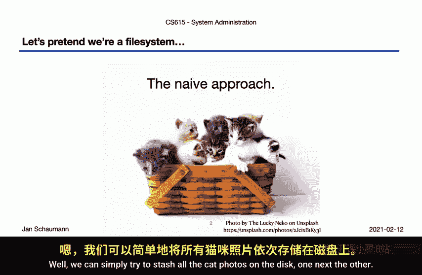
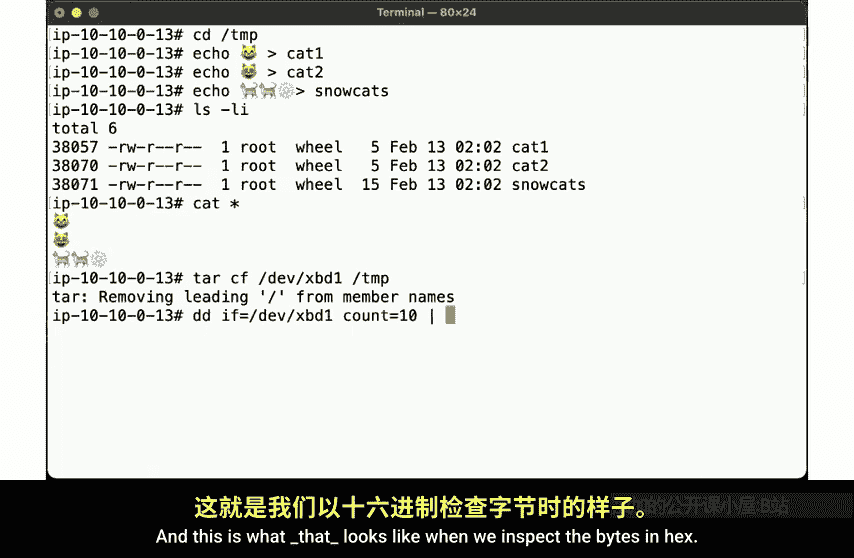
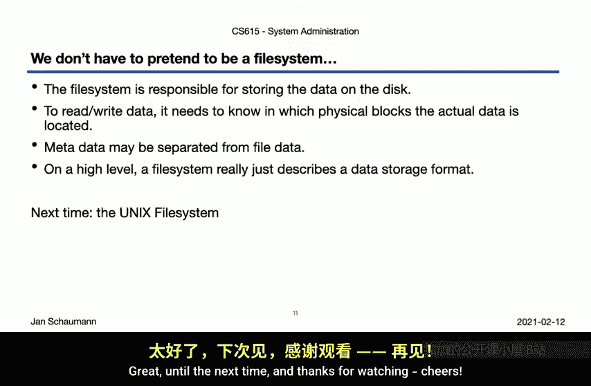

# 史蒂文斯理工学院【中英⚡计算机系统管理｜CS615 2021 System Administration】 p16 p15 Week 03, Segment 2 - Filesystems -BV11QQcYmEzD_p16-

Hello and welcome back to CS615 System Administration。 This is week 3 segment 2。In our last video。

 we spent a fair amount of time looking at the Bo sector and the master boot record in which we define the biopartition。

In the video before， we had discussed a file system or as partition a which a file system would then be created。

But before we go ahead and do that， let's first think a bit about what it means to be a file system。

What is the fundamental goal of a file system， What is its purpose。As we all know。

 the primary function of a file system is to store cat pictures， right？So how do we do that？😊，Well。

 we can simply try to stash all the cat photos on the disc， one next to the other。

 That doesn't sound too complicated。 So let's give it a try。

Here we again start out with our default N BSD instance with an attached volume as before。

We now pretend to be a file system for the disk X P D1， and we have one gig of space to manage。

So let's write our first cat picture to the disc。We use Prif and DD to write the bytes right to the beginning of the disc。

If we now look at the data on the disc， we see that our cat picture consists of four bytes。F 0，9。

 F 9，8， B 8。We have successfully stored our first file。To read this file from disk。

 we simply read the first four bytes。There we go， there's our cat。Okay。

 now it's time to store a second cat photo。Since we don't want to waste space。

 we'll write it right after the first photo。And we can see here。Our 8 bytes of data。

If we read all of those bytes。We get back both of our files。But we can， of course。

 also fetch them from the disk one by one。Okay， so far， so good。Now let's create our third cat photo。

2 cats in snow。We'll write this data right after the second picture。

If we read all the data in a single 512 by read。We get all three photos。And of course。

 we can grab the second photo individually。But if we try to grab the third photo。

 we realize we need to know how large it is。 Just assuming 4 B per photo will not work。

So we kind of need to count。Here' is our first pick。 there is our second pick。So。Nope。There，14 B。

So this illustrates a problem with a very naive approach in order to be able to retrieve files individually。

 we need to know where they start and where they end。 That is。

 we probably want to assign specific areas for each file。

Let's aside one area on the disc for each cat photo。

And that make sure that we only put one cat into each bucket。

They we always know exactly where each catpick starts。So let's illustrate that approach。

Let's  zero out our disk。And start from scratch。Again。

 we can write our first cat photo directly to the beginning of the disc。Now， our second cat photo。

 however。We right to offset 512。That is， we declare that each of our buckets will be 512 bys in size。

So we always know exactly where the next photo will start and offsets incrementing in 512 bytes。

Now we can easily retrieve the file by simply reading a full 512 bytes。And by adjusting the offset。

So。In Hx， this is what the data looks like on a disk now。First by it's right here。

Second bys at offset 512。And the bys for the third file over here。But note that， of course。

 were wasting a fair bit of space， Our photos are less than 512 B in size。

 but we have all this empty space here between the 512 B offsets。In addition to read the files。

 we actually did read a full 512 bytes， even though we only needed four bytes for the first two files and 14 bytes for the third file。

So maybe we should add some metadata to each of the files。So let's start over once more。This time。

We are prefixing the file data with the file number and the size of the file and bys。That way。

 we can later easily determine exactly how many bytes we would need to read。Here's our second file。

Also，4 bys in size。And here is our third file，14 by in size。So now on disk， our files look like so。

The file data for each file is prefixed with a one byte field indicating the file number and a one byte field for the size。

 followed by the actual contents of the file。And so we begin to associate metadata with our files。

 the file number and size in this case。But of course。

 we will probably want to add additional file attributes。

 additional information about ourquque photos。So we can define a new format where we specify that we use 16 bytes of metadata。

A two bite identifier。Four bytes for permissions such as user， group， other， Readr execute。

 as we used to from our Uni file system。A single bite representing the numeric owner of the file。

 one by it for the group。And then we reserve four bytes for the size。

Four bytes seemed a bit better than just one byte， since with just one byte。

 the maximum file size we could represent would be 256 bytes。

And then we decide that it might be even better to separate the metadata from the file data altogether。

 since the 16 bytes here will be consistent for every file。

 but the file data will be variable in size。So we decide to place the metadata at the beginning of the disk。

 and the actual fire data will ride somewhere else on the disk。

Now in order to be able to map that data to the following question。

 we then include the offset here as part of the metadata。Now。

 this starts to look a bit more like a fire system， doesn't it。

Let's see what our simpl system would look like in our simulation。So let's begin。

We write two bytes file number，0，1， in this case。Followed by four bytes of permissions，0，7，4，4 here。

Followed by the user I and group I， both0 in this case。Followed by4 by its file size。

Which in this case， is just4。Followed by the offset of where we find the actual data。

So this is just the metadata for the first file now。And with that committed to disk。

 we can now write the actual file data。To the offset， we had specified in the metadata。There。

Our second file gets its metadata， file I2， and let's say file owner and Group ID D1。

And because we know the offset of the previous file。

 we can now write the file data directly after that， so to offset 1004 he。

And app the metadata directly after the metadata of the first file。

And here come the file contents to offset for 100。So if we now look at the first 32 bys on the disk。

We should find the metadata for the two files。5hi1 over here。And file2 over here。

Having determined the offset of the file from the metadata， we can then retrieve the file contents。

And there you have it。A really simplify file system with a separation of metadata from file data。

And this is to some degree in the difference conceptualceptually how file systems work。

But before we take a break， it's just one more thing I want to show you。

 and that's an illustration that a storage archive format really is rather similar to a file system。

Here， consider this directory slash temp。Let's create a few normal files。When we run LS。

 we can see all the metadata of the files， the inode numbers。

 as well as their permissions and ownerships， etc。And of course。

 we can display the file contents of our cats using， well， cat。Excellent。

So now we can use the tar utility to create an archive of these files with all their metadata。

But instead of writing the archive to a file， as we might usually do。

 we'll simply write it directly to the raw disc。And this is what that looks like when we inspect the bys and hes。

Here we see the structure of the archive。 and I think that you will find that this looks somewhat similar to the format we have created for our trivial file system。

That is， in certain offsets， we find metilada associated with a file。

 including ownership and file names。Before we then。Over here。Find the actual file data by hexbyites。

 F 0，9， F，9，8， B8。And here's the second file。And the third file。

And just like we could write the data to the raw disk。

So can we read the data from the disk and pipe it directly into the tar utility。

 which can then extract the files with all its metadata。

So this illustrates that you don't need a file system on the disk device so long as you write the data in a format that you understand and have to find。

Or rather， that there is no meaningful distinction between an archive file and a file system snapshot。

But O， let's recap before we take a break here。 In our next video。

 we will no longer have to pretend to be a file system after we we just covered here。

But we did learn that， while the file system is responsible for storing the data on the disk。

 obviously。And that in order to read or write files。

 we need to know where on the disk we're writing the actual data。

But we also know that we need some metadata and this metadata may actually be stored separately from the regular file data。

And with that， the bottom line is that on a high level。

 a file system really just describes a data storage format。Now， of course。

 there are other considerations， especially with respect to efficiency。 But roughly speaking。

 we now know how the file system works。In our next video。

 we will look at the traditional UniX file system or UFS and how that file system implements some of the things we discussed here in this video。

Before we go on to that segment， though， do play around with your virtual discs and your cat photos。

 as well as to replay the Tas a file system format example to make sure you understood these concepts。

 okay。Great， until the next time。 And thanks for watching， dearith。

