# 史蒂文斯理工学院【中英⚡计算机系统管理｜CS615 2021 System Administration】 p17 p16 Week 03, Segment 3 - The UNIX Filesystem -BV11QQcYmEzD_p17-

Hello and welcome back to CS615 System Administration。This is week 3， segment 3。

 And after in our last video， we explored what it means to be a file system。

 Well now take a look at a slightly more sophisticated implementation。 The standard Unix file system。

 or UFS。The Unix file system is the historical file system implemented in version 7 of Unix and subsequently superseded by the Berkeley Fast file system。

 also known as the BSD Fastt file system or FFS。Now， of course。

 there are many more types of file systems， and the implementations vary significantly between traditional file systems。

 journaling file systems， and things like ZFS， as we've already hinted at。However。

 the fundamental concepts remain the same。And so it's useful for us to consider how the Uni file system is structured。

Now， recall from our last video that in our file system。

 we quickly identified the need to allocate the storage units for the data we wish to store。

 and that we then equally as quickly realized that we want to be able to associate metadata with a file。

 but that in doing so it would be useful to separate the metadata from the file datata and storing it on different areas of the disk。

We then constructed a crude file system format to accommodate this model， but of course。

 a real file system looks somewhat different。So let's take a look。

As we recall from our earlier video， a physical or virtual disc can be divided into logical partitions that may be described in。

 for example， the masterbo record。

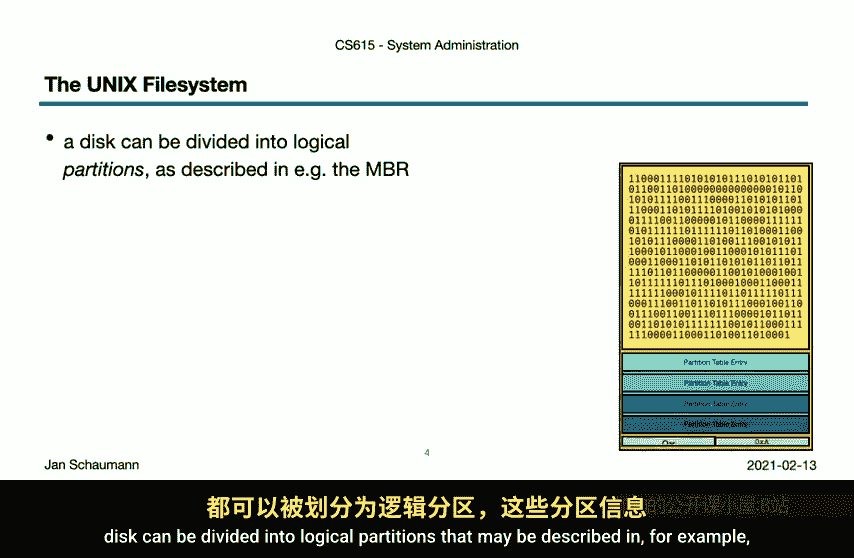

Such a logical partition may be further divided into file system partitions。On BSD derived systems。

 these partitions are described using a so called disk label， which we've also seen before。

The O specific partitions on which we may then decide to create a fire system are comprised of cylinder groups。

 a concept that is applied， even if the hardware being the storage device were， say in SSD。

 and thus really doesn't have any physical cylinders。Either way。

 we can now visualize our physical disk as looking like this。

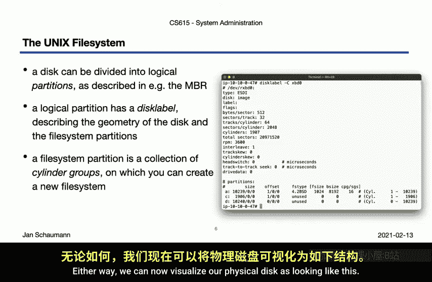

Now， since each partition comprises these cylinder groups。

 we have a need to describe them in a file system specific manner and to store some meta information about the file system itself。

This data is stored in the so called super block， which we generally find near the beginning of the partition。

If the partition is a boot partition， such as our primary OS partition。

 then it may also contain boot blocks at the beginning of the disc as well。

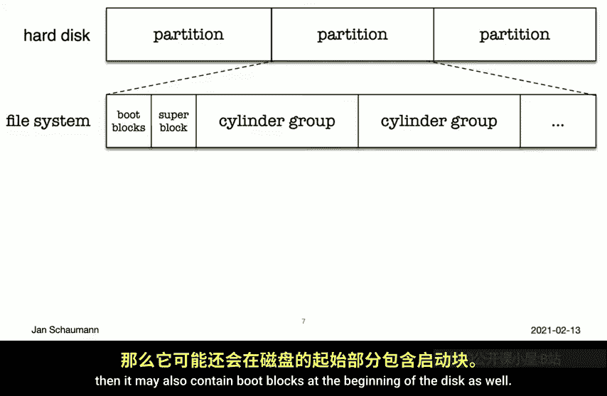

Now， each cylinder group itself contains the actual data blocks。

 the parts where we store the actual bytes that make up our files。

 as well as a list of i notess and blocks set aside for the metada associated with the i notess。

 the In blocks。Since the entire structure of the file system is written in the superb。

 it will be pretty disastrous if you lost this one block。

 so the file system replicates the superblock and cylinder groups。

 thereby allowing recovery of the file system from a corrupted superblock。

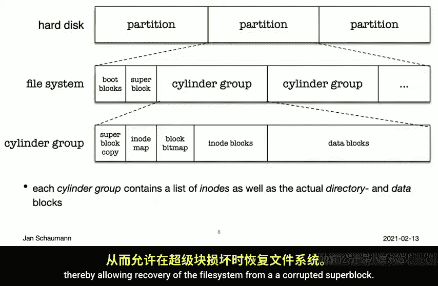

Finally， the actual data that we discuss when we talk about files and directories are stored in different groups of data blocks。

 the IO data blocks and the file data blocks。Here we see how the metadata about the file。

 all the information that we came up with in the last video is stored separately from the actual bys of the files。

As you can tell， we continue to strictly follow the Evergreen mantra of CS。

 where one lay of abstraction reveals further layers as we dive deeper。

But at least we end up with a reasonably easy to understand diagrams such as this one。Now。

 let's see if we can map our understanding from this diagram back to what we actually observe on the disk。

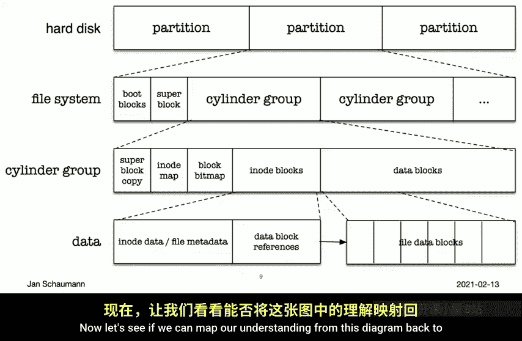

Here we have our usual Ne BSD instance， with our extra volume attached。

To inspect the properties for a file system， we can use the D Fs utility。

 So let's take a look at the manual page。This tool allows us to see details about the super block。

 cylinder group and the i notes， for example。So let's give it a try。

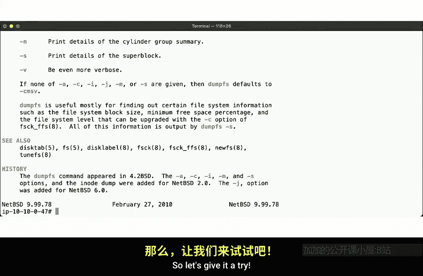

H look at that。 No super block。No surprise。 We haven't created a file system on this disk yet。

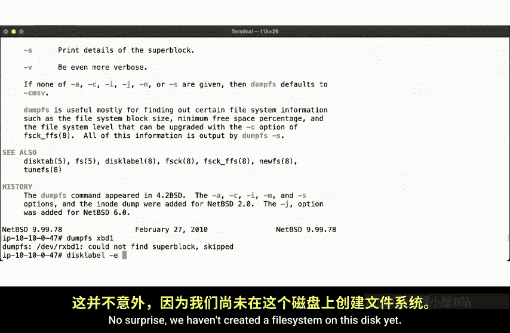

No file system， no superb， no meta information about the file system makes sense。

So let's start by creating a disk label。We accept the default of just using a single partition。

 Sp the entire disk here。 Since this is our second disk and doesn't require a boot block or swap or anything。

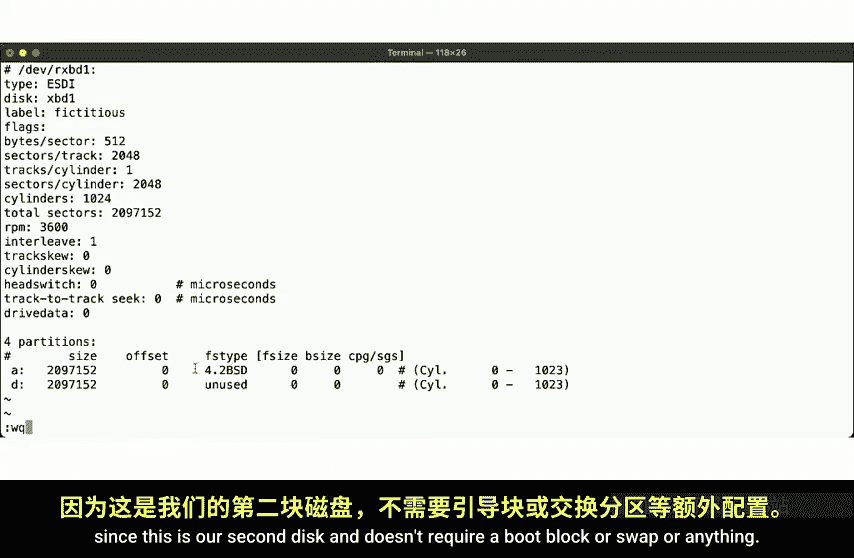

Okay， so D F still doesn't know anything about this disk。

 So let's create a file system on it already。

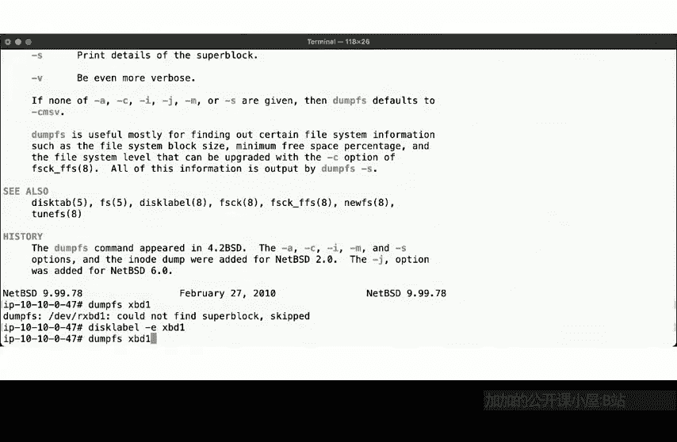

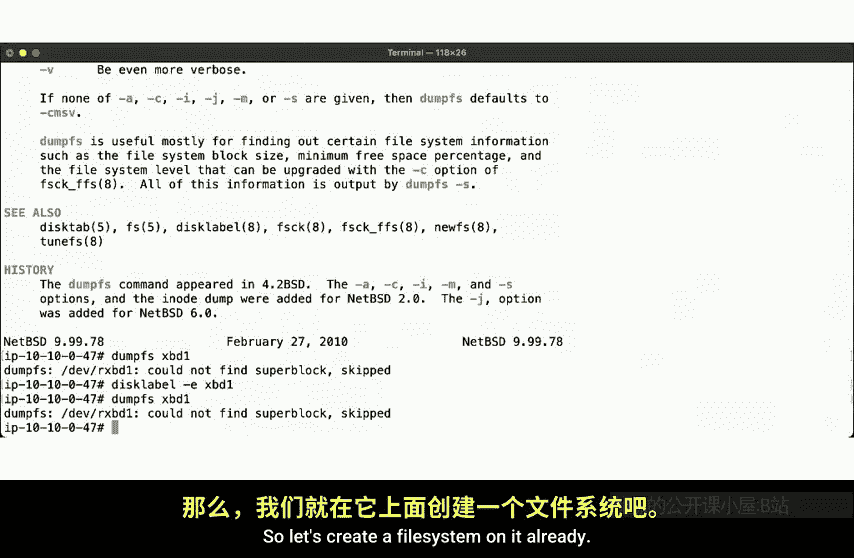

For that， we use the new F tool。The new Fs tool is used to create a new file system。

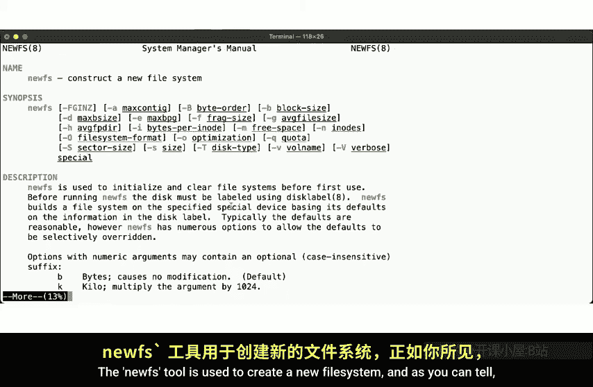

And as you can tell， there are several useful options。For example。

 we can specify a file system block size。That is the smartest storage unit of our a files。

Note that this is a Pism specific property。 The storage device itself will。

 as we discussed in the previous video， have its own physical block size， commonly512 B。

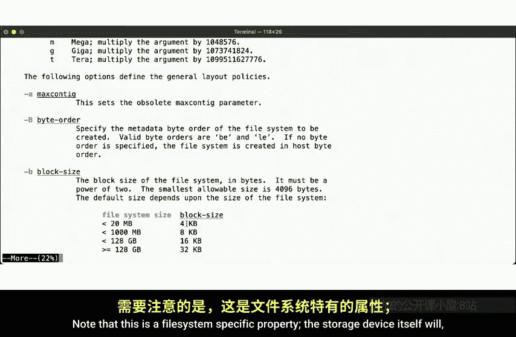

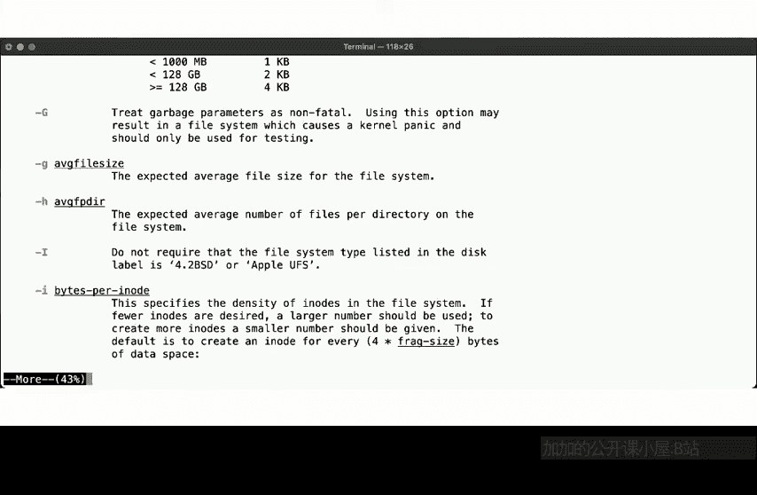

Another option we can specify here is the total number of i notess to create。

 as well as several others。

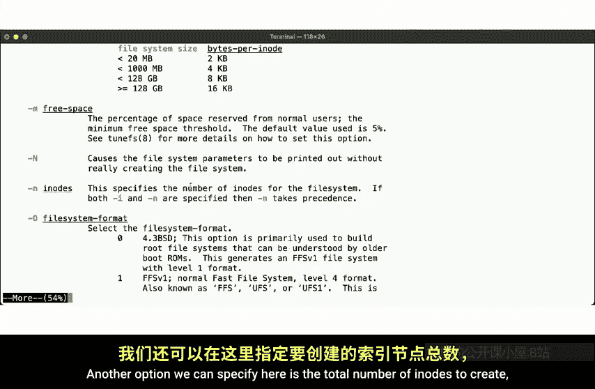

Okay， so let's create a file system on our disk。

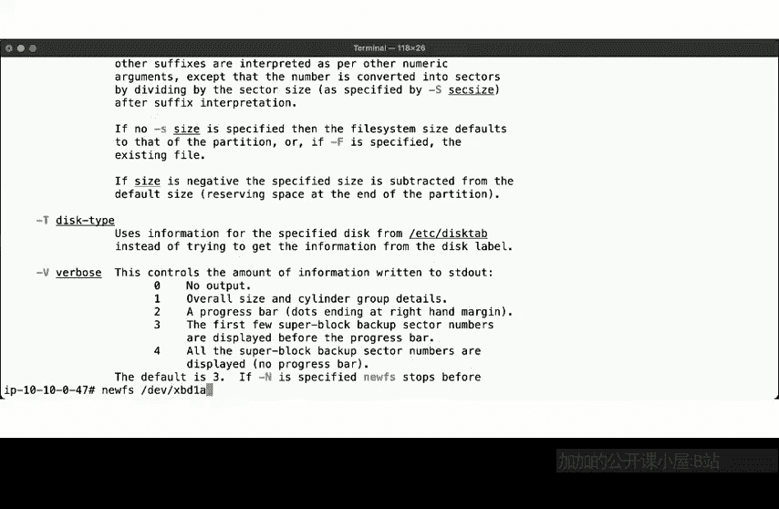

Here we go。We create a file system with a default，16 K block size across6 cylinder groups。

With 21504 i notess each。And a super block stored at these locations across the partition。

Now that we have a file system， we can mount it。

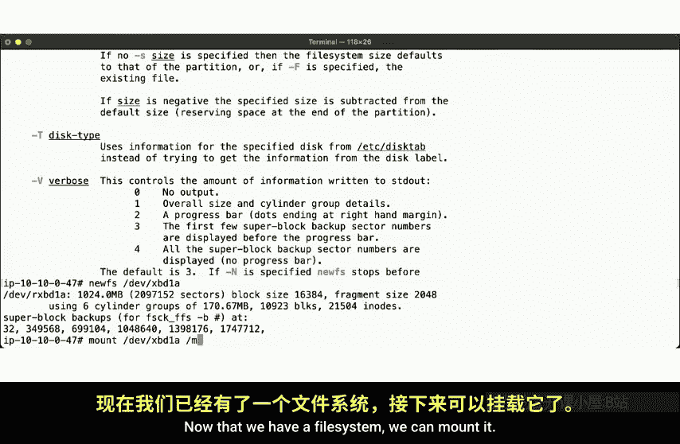

And。Create or are files on it。

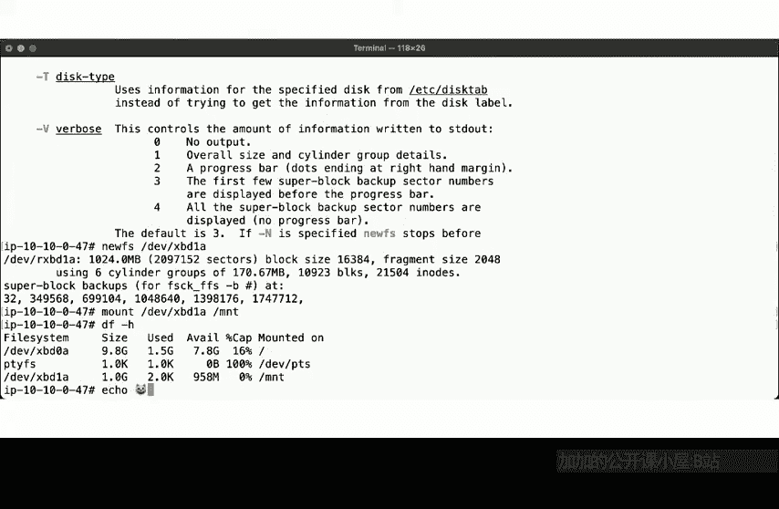

Cat1。

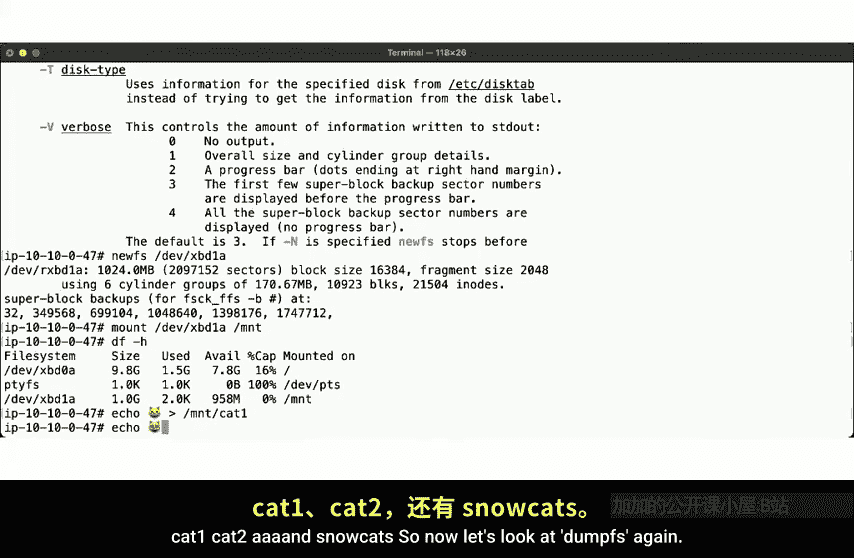

Cat2。And snowcas。

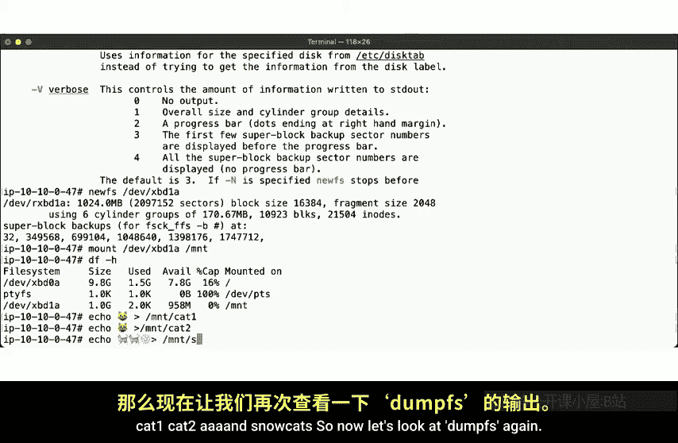

So now let's look at Der again。With the file system created。

 we now get a lot of information displayed here， including about the cylinder groups。

The dump of its utility can also show us information about the iodes and use。

Here we see the information for the files we currently have on disk。Including their permissions。

 file size， the creation time and ownership， etc ce。We can compare with the output from Ls。

And observe the time stamp by a date。I note number two， by the way， isn't missing。

It's the inode of the root directory on this desk。

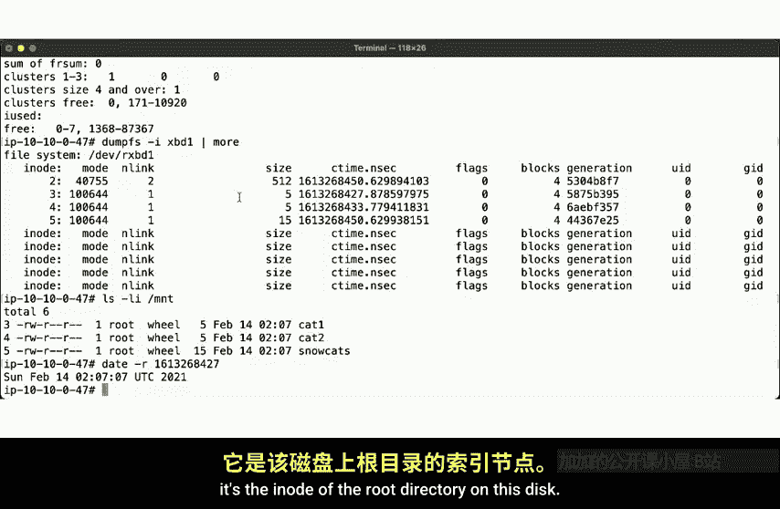

There it is。The size， owner and group as displayed in the dump of his output。

If we run Derest with the V Fl as well， then we also get information about all the ionodes。

 including those that are not yet used。

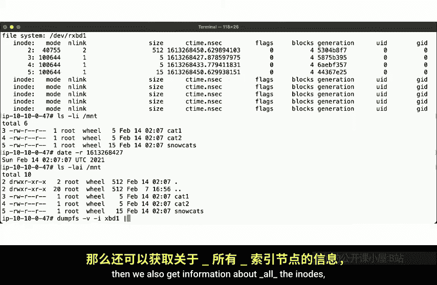

That is， we can see that our file system has indeed allocated a fixed size of i nodes at file system creation time。

 and thus we are limiting how many files we can store on this disk the second we create the file system。

In this case， that's 2153 inots perc in a group。Meaning， we're maxing this disc out at just about 1。

3 million files。

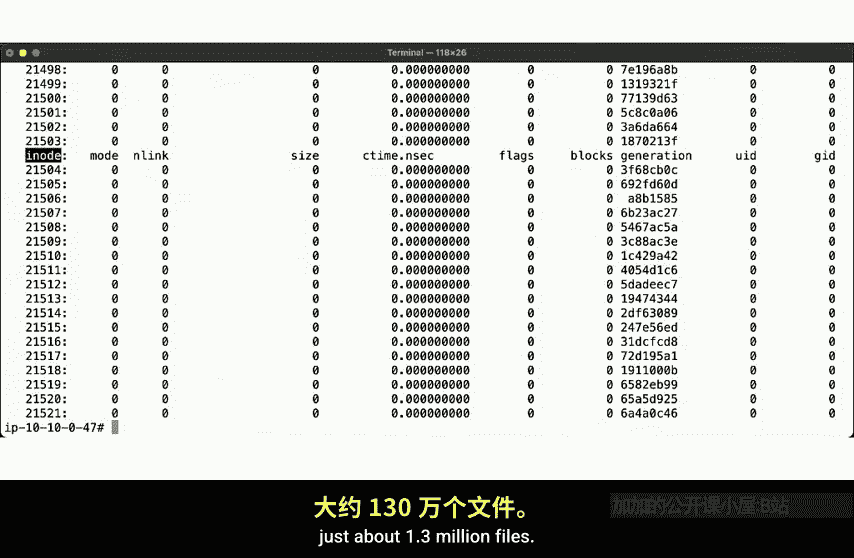

Okay。Time for another break。 Let's summarize。We've seen that our file system divides the disc into surrendery groups。

The information about the file system in cylinder groups is then stored in a super block。

 which to avoid it being a single point of failure is replicated into the different cylinder groups。

 thereby allowing recovery and reconstruction of the file system。

 even if one of the cylinder groups is corrupted from the alternate super block。

We also saw that our file system has the concept of a block size。

 The basic optimal I O unit that the file system will fetch or write data in。

And may be different from the physical block size of the disk。Next。

 and in alignment with what we had come up with ourselves in our last video。

We want to separate where we write actual file data from where we write the metada。

This allows for more efficient storage and less wasted space。

 but also increases IO efficiency since often we don't really need to access the actual data of a file。

Think about how when you run L S Dl， you are retrieving and displaying all the metadata associated with the fire。

 but not the contents。By separating the Ial blocks from the data blocks。

 we can rapidly fetch all the metadata without having to seek to the data blocks back and forth。

Talking about i nodes， we observed that the total number of inots。

 that is the total number of files the file system can hold is fixed at file system creation time。

And that， together with the file system block size are just two of the various things we can tune at file system creation time to accommodate the anticipated use of the disk。

That is， if we know that this disc we're putting in place is intended to be used to store primarily a relative small number of really large files。

 then you might choose a different Iod densitysity and block size than if you wanted to store huge numbers of tiny files。

In the first case， you'd use a larger block size to improve IO and select a smaller number of iNots and fragments。

And the latter， the smaller block size and larger number of rhnots。

The FS manual page in Section 5 has a lot more details here。

 and be a good exercise for you to try to create file systems using different parameters and see if you can exercise and observe performance differences based on the different use cases。

All right， so with all this information and the exercises you've seen。

 we now have a pretty good understanding of the basics of the Unix fire system。

And although other types of file systems utilize different techniques to manage the storage space。

 lot what we discussed here remains directly applicable。So with that。

 we can finally move on to briefly summarizing the different file types we're dealing with。

 as well as some of their attributes， as well as talking about where we mount our file systems and what conventions exist for our file system hierarchy。

Until next time， thanks for watching， cheer。

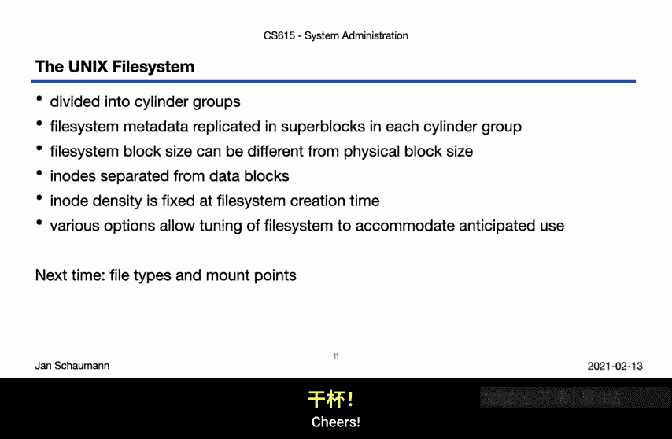