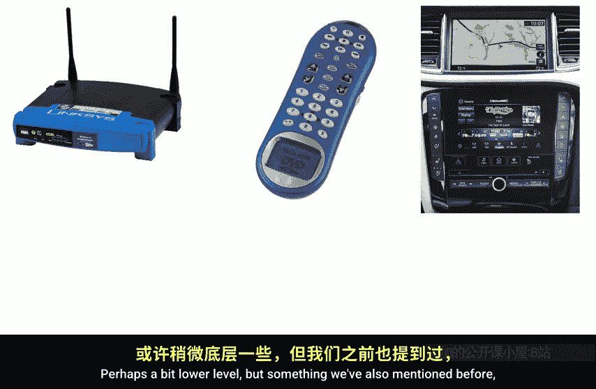
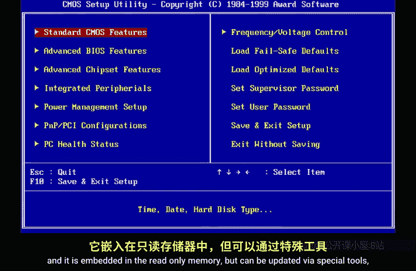
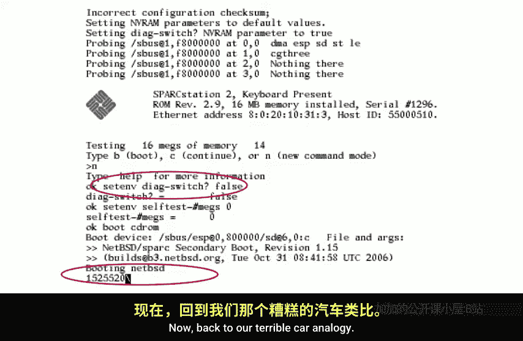
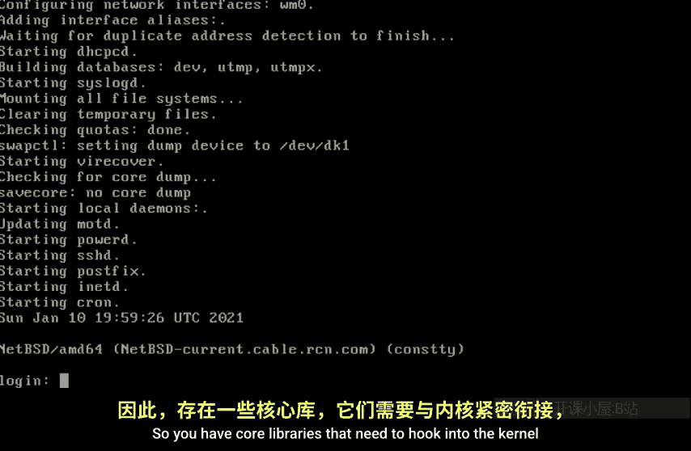
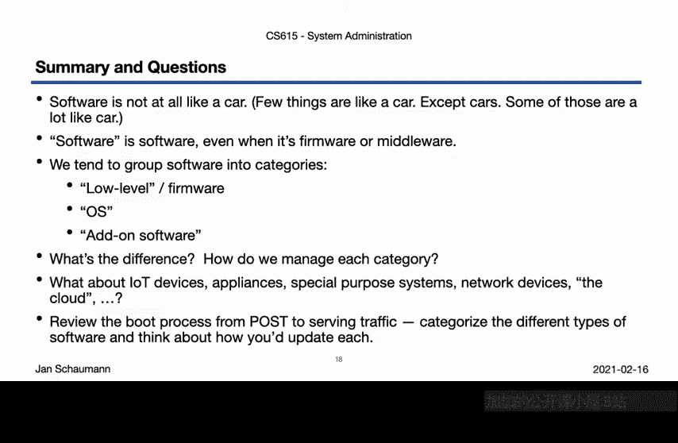

# 史蒂文斯理工学院【中英⚡计算机系统管理｜CS615 2021 System Administration】 p21 p20 Week 04, Segment 1 - Types of Software -BV11QQcYmEzD_p21-

Hello and welcome back to CS615 System Administration。This is week 4。

 and after we've covered storage models and disks， as well as the boot process。

 Partitions and the Unix file system， will'll spend a fair chunk of the videos for this week on the topic of software and more specifically how to install it and how to manage it。

😊，In our last video， we already talked a bit about the file system hierarchy and a look at the here manual page。

 and we found out that there's a reason for why we have a certain directory structure。

 which tells us which software parts go where。This will be something we will get back to when we talk about package management and software installation in particular。

In its most general definition， software is just another term for a programme telling a computer to perform a certain task。

Practically， however， there are a number of different types of software。

 and we've already seen some of them as part of our discussion of booting a system。In this video。

 we will attempt to categorize these types， even though the distinctions or differentiating factors are far from clear cut。

 as you will quickly notice。We've already identified a specific component that happens to be implemented in software。

 the file system。Instinctively， we categorize the file system as being in a lower layer than certain applications。

 such as the web server， for example。But the file system is only one component of the operating system。

 which in turn comprises regular application software， such as a text editor or a compiler。

 So libraries used by many of these applications such as the Resolr library used to turn host names into I addresses。

 device drivers providing access to and control off certain hardware components。

And the most central component of the O S itself， the kernel。

Looking at software from this perspective quickly makes it clear that the term operating system itself requires some definition。

 as different O S providers include different components under this umbrella term。

But before we attempt to tackle the question of what exactly defines an operating system。

 let us take a step back and attempt to better categorize software business proximity to the hardware or the end user。

And what better way to do that than to compare software or the operating system to a car。

People always like to compare other things to cars， for some reason。

I suspect this is because we all see cars all the time。

 and that belief that everybody understands how cars work。But all right。

 let's try and roll with this。When we boot up a system。

 we've seen that before our operating system is up and running。

 a bunch of things happen on a lower layer。So we clumsily represent this part here via this diagram of the ignition system。

The analogous element in the world of computers might then be firmware。

 That is the bits of software executing early on when we power on our system would fall into this category。

But firmer is even more widespread。And covers， for example。

 the software running on your wfi access point。 Now。

 this illustrates that it's quite difficult to properly categorize software。

 We know that a switch or route runs a full operating system albeit be it a specialized one。

 And many of the consumer products do as well， frequently used customized versions of， for example。

 Linux。But since we often have no way of updating or managing the software。

 we consider it to be not quite so soft。 And so we grouped this under firmware as well。

Other devices that may be running some sort of firmware include things like remote controls。

 which nowadays can be of surprising complexity。Or say your car's infotainment that navigation system。

Again， these days， your car is more likely to run a full fleshed operating system here。

 but as a user， it remains largely opaque to us。Perhaps a bit lower level。

 but something we've also mentioned before includes the electronics embedded in an IDE drive or really anything using USB。

And as we also mentioned earlier， the fact that all these things are running some sort of software。

 firmware means that they can be manipulated or compromised。Now， back to our server systems。

 the system bio certainly qualifies as a type of firmware。

 and it is embedded in the read only memory， but can be updated via our special tools flashing the rom。

 for example。

Similarly， different persistent memory modules such as NVra。

 as shown here by example of an old spark station that then also function as a first stage boot loader。

As we can see， there are ways to change the state of the system here in an interactive way。

As a bootloader， then eventually hence control off to the kernel。Now。

 back to our terrible car analogy， what would we say represents the colonel。

Well， perhaps we can think of the kernel as the motor。Without it， your car is pretty useless。

 But similarly， if all you have is a colonel， well， then you aren't going to get anywhere either。

This， by the way， is why， as annoying as it may be， it actually is technically correct。

 The best kind of correct to insist on saying the os is called Gnu Linux。

But we don't have to be pedantic。 anyway， So our kernel is a piece of software。 As you may know。

 there are different types of O S kernels， microcro kernels， as well as monolithic kernels。

The latter are the common kernels you will find in the Uni systems we're looking at in this class。

And so we've already seen a way to visualize with the kernelel does by looking at the boot messages。

 we see that it manages the hardware， manages memory and process scheduling。

 and provides the system calls for the regular user and libraries to interact with。But again。

 just like a motor all by itself。 so is a kernel all by itself of limited use。

What we need to build a more useful environment in which we can build our services is。

The core operating system， that is all the bits and pieces that are not running in kernel space。

 but that are necessary for the system to become useful， usable。

The operating system needs to be tightly integrated with the kernel。

 You can' just take a motor and plunk it into any chassy and think itll work。

 You need compatible parts and connectors that fit。Likewise。

 the kernelel is not independent from the rest of the system。

 And this is where things get a bit hairy。You will know that there exist many Unix versions。

 but those all remain their own coherent operating system。But with Linux， for example。

 we have many different variations of combining the Linux kernel with certain tools。

 many of which are the same or similar across distributions to build an O S variation。

Some distributions use the in startup up system。 Other use system D， for example。

 some ship with version X of library Y， others with version X plus1。

So you have core libraries that need to hook into the kernel and that really aren't completely independent of it。

But on top of that， you also have a number of system components that specifically define how your operating system behaves and how users interact with it。

You get additional functionality， but a lot of the functionality is quite involved in how to operate the system。

 how to interact with it， how to change settings。For， perhaps the equivalent here system software。

 core components of the OS， as well as the bits that influence their behavior。

 the configuration files and the like。Again， all of these are tied primarily to the operating of the system itself。

 And so most of the time， people have a need to extend the system to add customizations。

 to buy some addons。In the software world， the equivalent to these sexy。

 fuzzy wheel cover and pimp out seats， we might consider。As adds， things like a web server。

A database。An additional programming language interpreter with its libraries。A language platform。

 and virtual machine。C mail system editor， I D E Kitch sinkincoatron。

Or a revision control system that nobody knows how it works。Now， you are probably wondering， hey。

 wait a second。 my O comes with all of these under the box。

 Those aren't add on packages or customizations。But therein lies a dilemma in the larger discussion well go into in our next video。

 deciding what software components are part of the O， what is strictly speaking in addon。

 What is core system software， and what is optional pink fuzzy frills。

But besides the categories we've so far identified firmware， kernel， operating system。

 system software and Aon applications， we also increasingly have to deal with systems that fall in between。

Since nowadays， just about every device that you can plug into a power out that comes with a full fledged。

 insecure， configured operating system running a web server that you can turn off。

And even though we may not always think about these devices and focus on server environments。

 it's useful to remember that the same principles do apply when managing embedded devices and non compute resources brought into your network。

What's more， all these separations of types of software fall further apart as we move into the area of virtualization containers and say un kernels。

Is a static， immutable container an instance of an operating system or is it more akin to firmware or a closed system application。

Does the hypervisor in a richless environment count as a proper operating system。

And where do individual applications running inside containers on the Uniorral fall？Well。

 I'm afraid I don't have answers for you other than it depends。 And it gets messy real quick。 But。

 hey， welcome to the wonderful world of system administration。As I said。

 we'll try to bring a little more clarity to some of this in the coming videos。

 When we talk about software bundling and installation and the separation of system software from the O S。

But first， let's try to summarize what we covered today。First of all。

 and I hope this much should be very clear， softwareft really is not at all like a car。

 Car analogies are almost always pretty awful。Next， and even though this sounds obvious。

 we sometimes forget all of this software we're talking about is indeed software。The it's flexible。

 can be changed， can be configured， can be compromised。

That as many of the principles will apply when we talk about package management。

 software updates or security principles in the coming videos all apply more or less equally to firmware as to the baseOS as to add on software。

And so these are really the three broad groups we tend to divide software in。

The low level firmware by which we often mean software that we generally do not change that sits very close to the hardware and that may be proprietary or require special tools to interface with。

The cooperating system， although we've already gotten a taste that it's not really a very clear cut definition。

 no obvious line that separates Aon software from system software。

But we do determine that there are some software that we consider to not be part of the operating system and that we would need to add after OS installation。

 for example。But with these categories。😊，We then immediately get to these questions。

 What really is the main difference， Is there one， perhaps when it comes to how we manage the software。

And what about all these other in between things we mentioned。

 all the terrible internet of broken things。 What about network gear storage equipment。

 a special purpose hardware， such as HSM or third party appliances。Well。

 perhaps this video here has really only led us to more questions than answers。

 and it's probably a good idea for you to start thinking in these terms before we move on to software package management in our next video。

So as you look back， as well as in preparation for that topic。

You should perhaps go back to the different boot sequences you looked at from last week and try to identify the different types of software you encountered and how they interact with one another。

Then think about what the impact is of trying to update each one。 Is it a straightforward thing。

 Can you make a change to one without the other。What things do you have to consider when you do that。

Answers to some of these questions will be given in our next video。 So enter the next time。

 And thanks for watching， cheerith。

