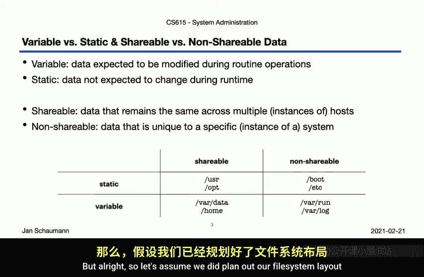
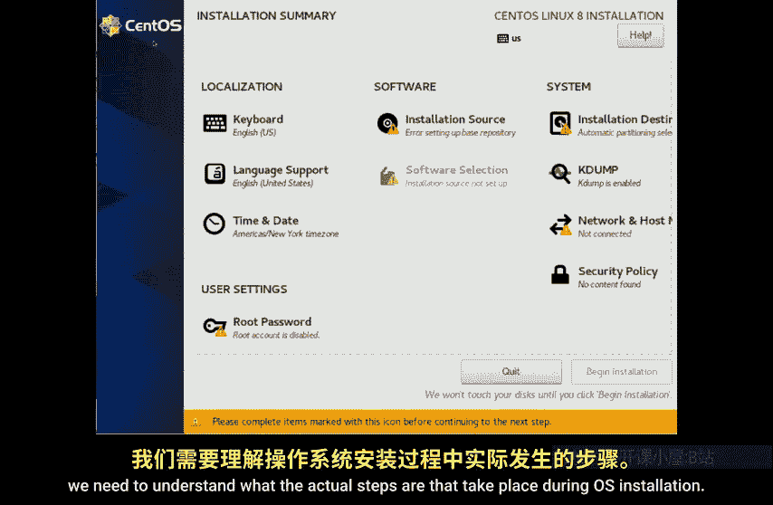
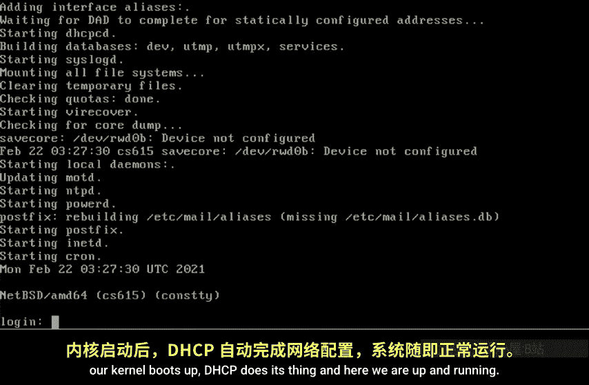
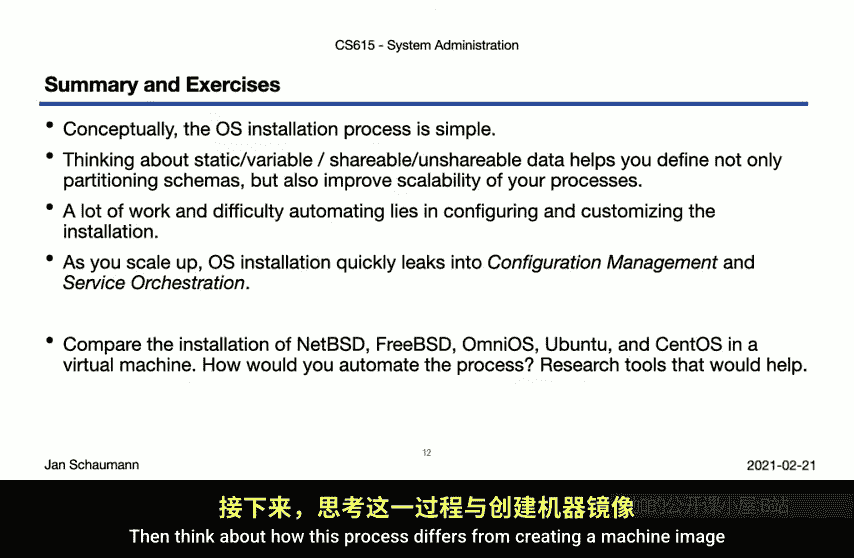

# 计算机系统管理：04：操作系统安装

在本节课中，我们将学习如何安装操作系统。我们将重点关注如何以可扩展和自动化的方式进行安装，而不是仅仅在单台机器上手动操作。我们将从规划文件系统布局开始，然后逐步执行手动安装过程，最后讨论如何将这些步骤自动化。

## 文件系统布局规划

上一节我们介绍了不同类型的软件。本节中，我们来看看如何将操作系统安装到磁盘上。但在开始安装之前，我们需要规划好文件应该存放在哪里。

在之前的课程中，我们提到了文件系统层次结构标准（FHS）。它描述了各种文件应放置的目录层次。例如，我们注意到 `/bin` 和 `/usr/bin` 目录之间的区别。`/usr` 下的内容在系统启动时并非必需，因此可以放在启动过程中挂载的不同分区上。

`/var` 目录用于存放可变数据。但为什么我们要关心将可变数据放在单独的分区呢？要回答这个问题，我们需要了解不同类型数据的定义。

以下是不同类型数据的定义：

*   **可变数据**：在常规操作期间预期会被修改的数据。例如日志文件和用户家目录中的文件。
*   **静态数据**：在正常操作过程中预期不会改变的数据。例如操作系统文件、库和应用程序。
*   **可共享数据**：在多台主机上保持相同的数据。
*   **不可共享数据**：每台主机独有的数据。

了解哪些数据会变化、哪些不会变化后，你就可以相应地设置独立的分区并挂载文件系统。可变数据分区可以设置为读写模式，并使用异步I/O以提高性能；静态数据分区可以设置为只读模式。这种分离不仅使攻击者更难破坏系统，还能帮助你跨多台主机组织文件系统。

为了进一步组织，你可能希望将数据分为可共享数据和不可共享数据。如果知道哪些数据集在成百上千台主机上是相同的，就可以考虑如何以集中的方式共享、部署或管理它们。而不可共享的部分则需要逐台主机进行管理。

以下是不同类型数据的示例矩阵：

| 数据类型 | 可共享 | 不可共享 |
| :--- | :--- | :--- |
| **静态** | `/usr`（库和应用程序）、`/opt`（附加软件） | `/etc`（系统配置文件）、引导块 |
| **可变** | `/home`（用户家目录）、`/data/project`（项目数据） | `/var/run`（运行时文件）、日志文件（特定主机部分） |

当然，这些区分取决于你的具体设置。但希望你能看到，以这种方式规划数据管理是有用的。更重要的是，在开始操作系统安装之前就决定好这种布局，以便创建正确的分区并适当地安装文件，这将非常有益。

## 手动安装操作系统

现在，假设我们已经规划好了文件系统布局和分区方案，接下来我们开始安装操作系统。

你可能熟悉类似下图的图形化安装界面，它提供几个按钮让你点击来安装操作系统。




这对于单次安装很有用，但它不利于自动化和扩展。在工业环境中，我们使用部署引擎，通常是自定义构建的，允许基于系统配置文件完全自动化地安装操作系统。

为了能够构建这样的系统，我们需要理解操作系统安装过程中实际发生的步骤。因此，让我们执行一次手动安装，但不是使用图形界面，而是使用图形安装程序实际会调用的命令。

我们启动一个 NetBSD 安装 CD 的虚拟机，它让我们进入一个基于菜单的安装程序。这仍然太交互式，无法显示命令。所以我们决定退出菜单。



这让我们进入从 CD 启动的 RAM 磁盘上的 root shell。现在，我们可以运行安装操作系统所需的所有命令。

以下是安装步骤：

1.  **识别硬盘**：首先，识别可用于安装操作系统的硬盘。例如，我们使用 `wd0`。
    ```bash
    dmesg | grep wd0
    ```

2.  **设置分区表**：计算从偏移量 63 开始后剩余的扇区总数，然后使用 `fdisk` 命令在偏移量 63 处创建一个类型为 NetBSD 的分区。
    ```bash
    fdisk -i wd0
    ```

3.  **安装引导代码**：将实际的引导代码复制到引导扇区，并将分区标记为活动。
    ```bash
    fdisk -b /usr/mdec/mbr wd0
    fdisk -a wd0
    ```

4.  **创建 BSD 磁盘标签**：使用 `disklabel` 编辑器创建磁盘标签。我们创建一个大的分区供操作系统使用。
    ```bash
    disklabel -e wd0
    ```

5.  **创建文件系统**：在分区上创建文件系统。
    ```bash
    newfs /dev/rwd0a
    ```

6.  **挂载目标文件系统**：将新创建的文件系统挂载到 `/mnt`。
    ```bash
    mount -o async /dev/wd0a /mnt
    ```

7.  **提取操作系统数据**：从安装介质（如 CD）提取操作系统归档文件到挂载点。我们可以选择要安装的组件集。
    ```bash
    tar -xzf /path/to/base.tgz -C /mnt
    tar -xzf /path/to/etc.tgz -C /mnt
    # ... 提取其他组件
    ```

8.  **安装引导加载程序**：将引导加载程序复制到正确位置。
    ```bash
    cp /usr/mdec/boot /mnt/boot
    installboot -v /dev/rwd0a /usr/mdec/bootxx_ffsv1
    ```



9.  **创建设备节点**：在目标系统的 `/dev` 目录下创建设备节点。
    ```bash
    cd /mnt/dev && ./MAKEDEV all
    ```

10. **基本系统配置**：通过 `chroot` 进入新安装的系统，进行一些基本配置，如设置主机名、启用 DHCP 和 NTP、配置 `/etc/fstab` 等。
    ```bash
    chroot /mnt /bin/ksh
    echo "hostname=myserver" >> /etc/rc.conf
    echo "dhcpcd=YES" >> /etc/rc.conf
    echo "ntpd=YES" >> /etc/rc.conf
    echo "/dev/wd0a / ffs rw 1 1" > /etc/fstab
    exit
    ```

11. **完成安装**：卸载磁盘并重启系统。
    ```bash
    umount /mnt
    reboot
    ```

系统重启后，将加载我们安装的引导加载程序，并启动新安装的操作系统。

## 通用安装步骤与自动化

我们为什么要不厌其烦地自己运行所有这些命令，而不是使用操作系统提供的完美安装程序呢？正如前面提到的，那些安装程序不利于自动化。更重要的是，在这门课程中，我们旨在真正理解系统是如何工作的。

根据我们刚才的观察，让我们概括一下安装系统所需的通用步骤。

以下是操作系统安装的通用步骤：

1.  **系统启动**：系统加电启动。
2.  **从备用介质引导**：由于目标磁盘上没有操作系统，需要从备用介质（如 CD、USB 或通过网络 PXE 启动）引导到一个临时环境（如 RAM 磁盘）。
3.  **识别目标磁盘**：在临时环境中，识别要安装操作系统的硬盘。
4.  **分区和磁盘布局**：在目标磁盘上创建分区表（如 MBR/GPT）和分区。
5.  **创建文件系统**：在目标分区上创建文件系统（如 ext4, UFS, ZFS）。
6.  **安装引导加载程序**：将引导代码（如 GRUB, boot0）写入磁盘的引导扇区，并配置引导加载程序。
7.  **获取操作系统数据**：从本地介质（如 CD）或网络源（如 HTTP 服务器）获取操作系统软件包或镜像。
8.  **部署数据到磁盘**：将操作系统文件提取或复制到目标文件系统。
9.  **安装额外软件**：安装任何超出基础操作系统范围的额外所需软件。
10. **执行初始配置**：进行最基本的系统配置（主机名、网络、`fstab` 等）。
11. **重启系统**：卸载磁盘，重启计算机，从新安装的磁盘引导。

这些步骤对于大多数类 Unix 系统来说大同小异，主要区别在于执行它们所使用的具体命令。理解了这些步骤，你就可以自动化整个过程，构建一个部署引擎。

然而，你可能也注意到，这个过程的基础部分并不复杂。更困难的部分发生在其他地方。为了构建一个能在多台系统上无人值守自动化安装操作系统的部署系统，你需要：

*   **硬件清单**：某种硬件清单系统。
*   **配置映射**：一种确定哪类镜像应安装到哪台硬件上的方法。
*   **软件定义**：定义需要安装哪些超出基础操作系统的软件。这可以通过为不同工作负载或镜像定义配置文件或标识来完成。
*   **初始配置与注册**：执行至少一些初始系统配置，并在清单中注册新安装的系统。
*   **基础设施**：许多这些步骤需要周围的基础设施和组织支持。

此外，启动新系统和配置运行系统之间的界限并不总是清晰的。这与配置管理以及服务编排等更大的主题有重叠。

最后，我们一直在讨论将操作系统安装到物理或虚拟裸机上。但如今，构建单独的容器或操作系统镜像可能更常见，也更具可扩展性。例如，AWS 机器镜像就是操作系统被安装到一个可被实例化的机器镜像中的例子。创建容器和实例化机器镜像虽有不同，但我们之前讨论的前期规划（决定哪些数据可共享、可变、静态等）以及概述的通用步骤，同样有助于我们更好地理解那个过程。

## 总结与练习

本节课中我们一起学习了操作系统安装的核心概念和步骤。

首先，尽管第一次操作时可能令人生畏，但安装操作系统所涉及的步骤并不非常复杂。更重要的是，这些步骤在不同系统间是相同或相似的，这就是为什么手动安装系统的练习很有用。

其次，我们看到了规划文件系统布局可以帮助我们简化安装过程，提高其可扩展性。因此，大部分工作不在于执行相同的命令集，而在于识别需要考虑的周边属性、因素和系统方面。所有这些都与系统管理的其他工作领域（如配置管理）有所重叠。

为了加深理解和巩固所学知识，你可以尝试以下练习：



*   **重复安装过程**：为几种不同的操作系统（如 Linux 发行版、BSD 变体）重复上述过程。下载安装镜像并将其安装到虚拟机中。
*   **分析安装程序**：跟随它们提供的图形或文本安装程序，注意它们执行了哪些步骤。然后看看你是否能通过手动运行命令来重复这个过程。
*   **思考自动化**：思考如何自动化安装这些不同操作系统的过程。研究现有的自动化安装工具（如 Kickstart, Preseed, AutoYaST, FAI），了解它们的工作原理。
*   **对比镜像创建**：思考这个过程与创建机器镜像（而非安装到裸机）有何不同。在这种环境中，你将如何处理主机特定的部分？云平台需要提供哪些基础设施服务来使之成为可能？

正如你所见，仅在这个主题上就可以花费大量时间。系统管理员们发现，供应商或开源项目提供的操作系统与你最终系统上的内容之间存在区别。你将需要添加更多软件，有些是开源的，有些是专有的，有些是内部开发的。我们如何尝试管理所有这些不同的组件，将是我们下一节讨论软件包管理时的主题。

---
**本节课中我们一起学习了**：操作系统安装不仅涉及将软件部署到磁盘，更重要的是前期的文件系统布局规划和分区策略。我们通过手动安装 NetBSD 的实例，剖析了从识别磁盘、分区、创建文件系统、部署文件、安装引导程序到基本配置的完整步骤。理解这些通用步骤是构建自动化、可扩展部署系统的基础。真正的挑战在于围绕这些步骤构建必要的基础设施，如硬件清单、配置映射和与配置管理的集成。