# 计算机系统管理：04：软件包管理 📦

在本节课中，我们将要学习软件包管理的核心概念。我们将探讨操作系统核心组件与附加软件之间的模糊界限，并深入了解软件包管理器如何通过管理依赖关系、提供系统清单和增强安全性来简化系统管理。

## 操作系统与附加软件的界限 🔍

上一节我们完成了操作系统的安装，但要让系统真正可用，通常还需要安装额外的软件。这引出了一个根本问题：哪些软件属于操作系统核心，哪些属于第三方附加软件？

为了理清这个概念，我们来看一些软件示例，并尝试将它们归类。以下是几个例子，请思考它们应属于“系统软件”还是“附加软件”：

*   **内核模块**：扩展内核功能的驱动程序。通常由操作系统提供，但对于某些专用硬件，可能需要由硬件制造商提供，此时应视为第三方附加软件。
*   **固件**：如BIOS或磁盘控制器上的微码。操作系统可能提供管理工具，但固件本身通常被视为附加组件。
*   **C库（如glibc）**：这是与内核及其他应用程序紧密集成的核心库。更新它可能破坏整个系统，因此它无疑是操作系统的一部分。虽然可以安装其他实现，但这很罕见。
*   **Shell**：几乎所有Unix系统都自带一个Shell（如Bash），但用户也可以安装其他Shell（如Zsh）。因此，它可能同时属于两个类别。
*   **SSH客户端/服务器**：情况与Shell类似。大多数系统自带OpenSSH，但也可以安装其他实现。
*   **邮件服务器**：由于历史原因（Unix是多用户服务器系统），许多系统默认包含邮件服务器。当然，也可以安装其他实现。
*   **HTTP服务器**：传统上不属于操作系统，但因其普遍性，越来越多系统将其纳入基础安装包。
*   **数据库**：通常不作为操作系统核心部分，主要是独立的附加应用程序。
*   **Python解释器**：这很有趣。它显然是附加软件，可以安装多个版本。但许多操作系统也默认包含它，因为一些系统工具可能依赖Python。

从以上例子可以看出，区分核心与附加软件非常困难，界限取决于操作系统发行版的定义。我们关心这个区分的原因之一，是为了理解组件间的依赖关系。一个将特定核心组件作为一个连贯单元发布的系统，比一堆独立部署的软件包更易于管理和升级。

为了解决这些依赖关系，我们通常使用所谓的**软件包管理器**。

## 软件包管理器的职责范围 📊

那么，软件包管理器应该管理哪些组件呢？在系统管理领域，常见的答案是：**视情况而定**。

这取决于具体的操作系统及其发行版。有些操作系统仅对附加软件使用包管理器，核心系统则不用。而另一些系统则使用同一个包管理器来管理所有组件，包括内核模块和内核本身。

我们可以从另一个视角来看待软件管理。从底层到顶层依次是：
1.  **硬件**
2.  **固件**
3.  **内核**
4.  **系统软件**（如设备驱动、核心库）
5.  **实用工具和应用程序**（如Shell、常用Unix命令）
6.  **附加软件**（如浏览器、Web服务器、数据库、编程语言环境）

在某个（有些随意的）时间点，操作系统发行商会定义哪些组件属于操作系统，哪些不属于。但即使对于不属于操作系统的组件，我们仍然希望用统一的方式来管理它们及其依赖。因此，软件包管理实际上涵盖了所有这些层次。

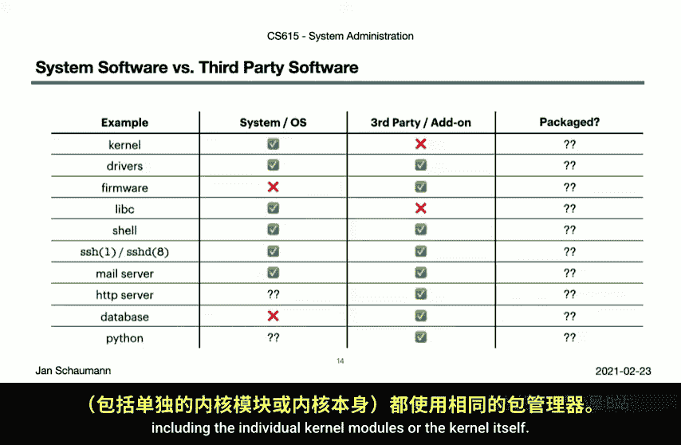

这意味着，即使操作系统使用包管理器，它也可能用其来管理附加软件。但很快你会发现，总有一些软件无法通过包管理器获得，这时你必须小心管理。此时，区分操作系统软件和附加软件就变得更有意义了。例如，升级操作系统是否会导致与附加软件不兼容？附加软件可能将配置文件放在你认为是静态的位置，或者与系统组件冲突。

## 软件包管理器的核心功能 ⚙️

既然软件包管理器是系统管理员工具箱中的关键工具，让我们通过实例来看看它提供的一些核心功能。我们将以Debian（使用`dpkg`）、Fedora（使用`rpm`）和NetBSD（使用`pkgsrc`）为例。

### 1. 软件清单与文件查询

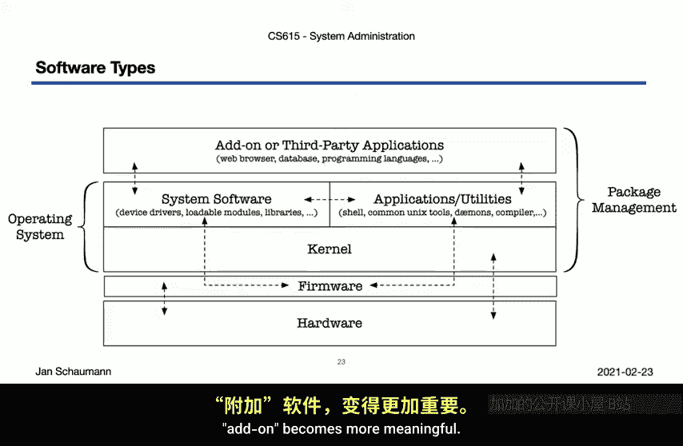

软件包管理器最基本的功能是提供系统上所有已安装软件的清单。

在Debian系统上，你可以运行：
```bash
dpkg -l
```
这将列出所有已安装的软件包及其版本，例如总共1319个包。拥有一个完整的软件清单非常重要。

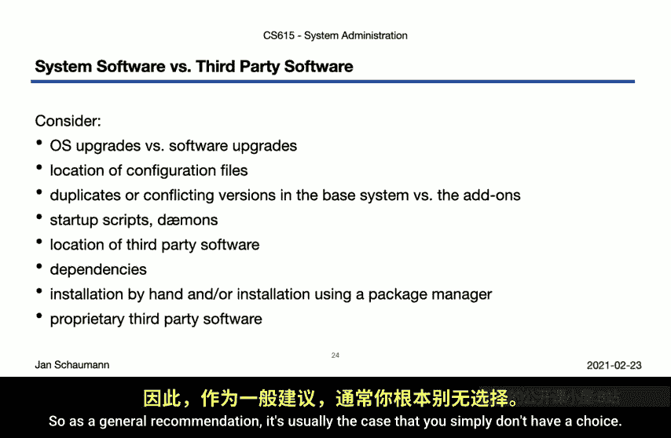

接下来，对于任何给定的软件包，你可以列出其包含的所有文件。例如，查看`tcpdump`包的内容：
```bash
dpkg -L tcpdump
```
反之，你也可以查询某个文件属于哪个软件包：
```bash
dpkg -S /path/to/file
```
这提供了正向（包->文件）和反向（文件->包）的便捷查询功能。

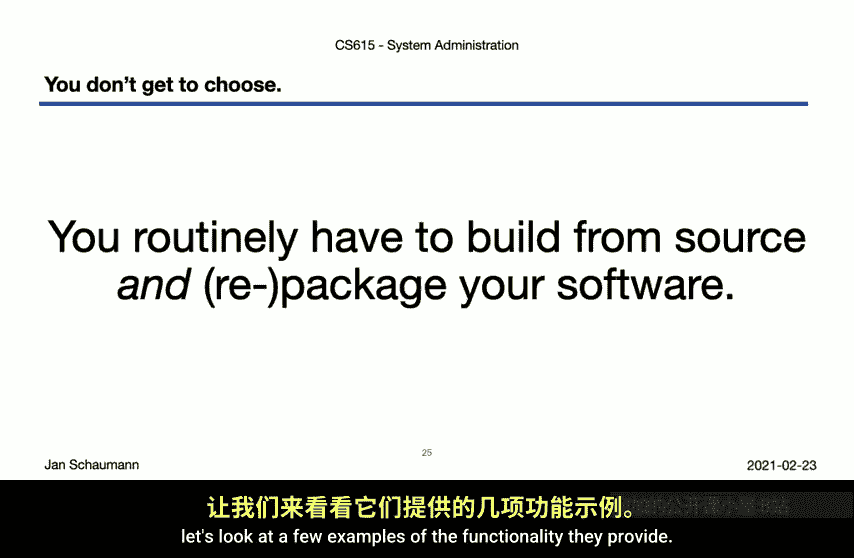

**请注意**：这些功能仅对通过包管理器安装的软件有效。为了保持一致性，你应该确保将所有附加软件都打包。假设你想升级Python，但AWS工具依赖旧版本且会因此损坏。如果AWS工具是在包管理器之外安装的，包管理器就无法知晓这个依赖，从而允许你升级并破坏系统。这非常糟糕。

### 2. 文件完整性校验与入侵检测

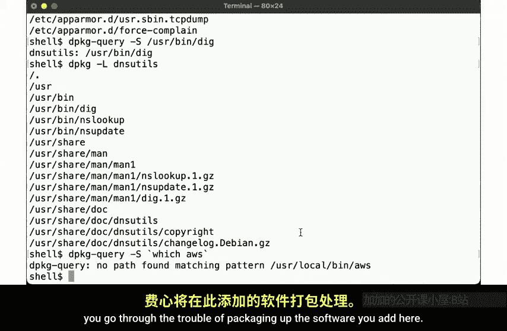

软件包管理器的另一个强大功能是文件完整性校验，这构成了一个隐式的入侵检测系统。

在Fedora系统（使用`rpm`）上，同样可以列出所有已安装的包（例如344个）。假设我们模拟一次系统入侵，攻击者修改了`/etc/pam.d/sudo`文件以改变`sudo`的认证方式。我们更改了文件内容、所有者和组。

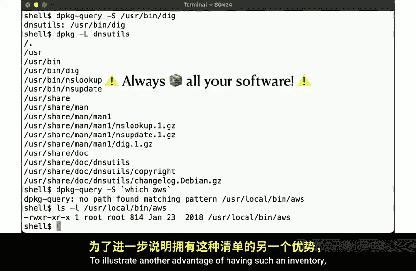

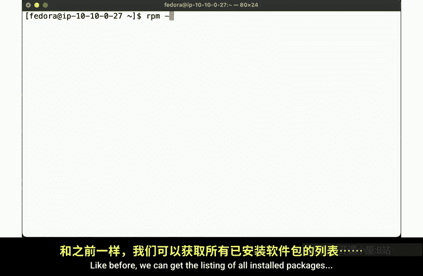

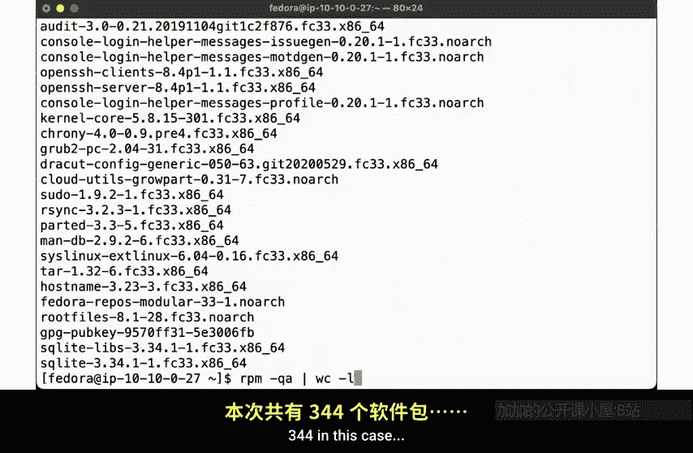

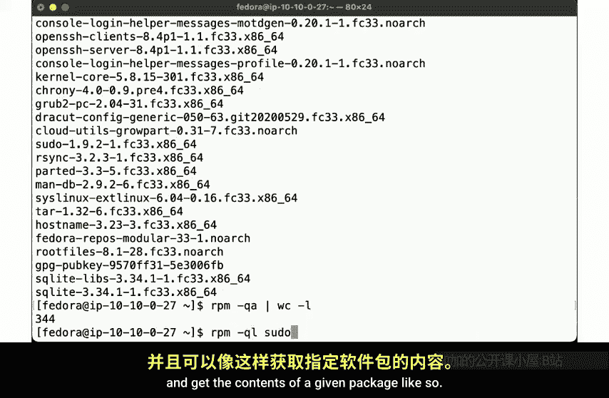

如何发现文件被篡改？包管理器在安装时记录了每个文件的所有权、权限、大小甚至内容校验和。因此，我们可以通过包管理器来验证包的完整性。

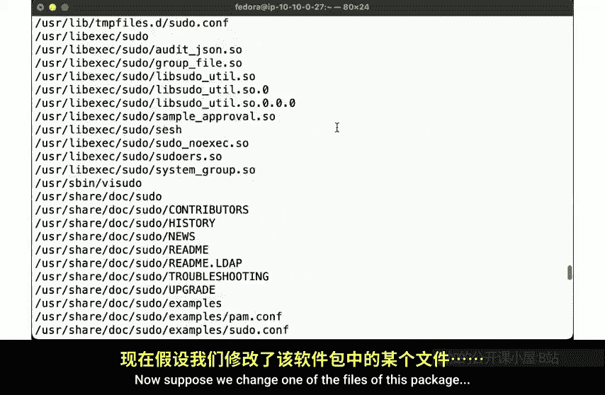

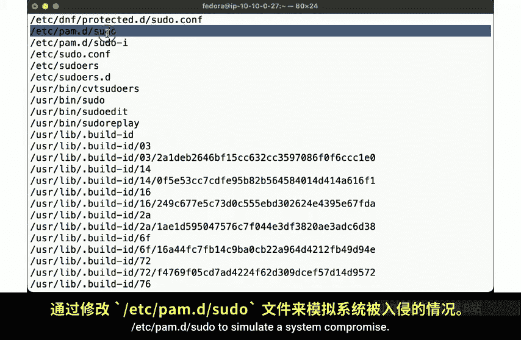

运行以下命令：
```bash
rpm -V sudo
```
输出会显示文件大小、MD5校验和、所有者、最后修改时间与安装时的记录不符。这非常酷！通过包管理器，我们获得了一个隐式的入侵检测工具。

当然，正常运行时，一些文件（如配置文件、日志文件）的变化是预期的。因此，要有效监控系统，你需要理解上下文并知道什么是正常状态。我们将在后续关于系统监控的课程中再讨论这一点。

### 3. 安全漏洞审计与自动更新

软件包管理器还能帮助我们自动分析系统上哪些软件包存在已知的安全漏洞，从而指导打补丁。

在NetBSD系统（使用`pkgsrc`）上，我们先列出已安装的包（例如177个）。为了进行漏洞审计，我们需要获取已知漏洞列表，这通常由发行版的安全团队提供。

通过包管理工具可以获取这个列表。但请注意，这个列表文件通常使用PGP进行加密签名，以确保数据的真实性和未被篡改。你需要导入并信任相应的GPG密钥才能验证签名。

验证签名后，运行包审计命令。结果可能会显示许多漏洞，例如`bash`存在权限提升漏洞。这正是系统管理的常态——软件总可能存在安全漏洞。

接着，我们可以使用包管理工具来拉取并安装更新版本。工具会自动计算依赖关系，下载新包，移除旧版本并安装新版本。完成更新后，再次运行审计，`bash`的漏洞就不再显示了。

## 本节总结 📝

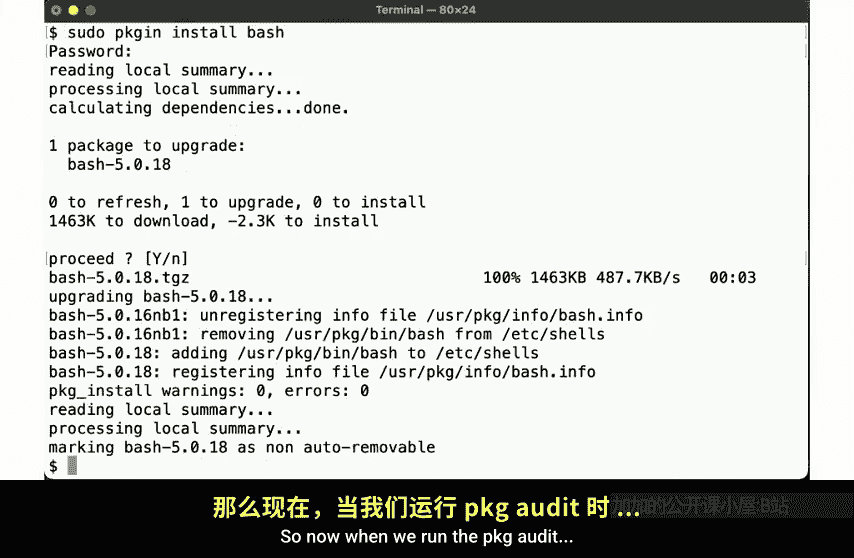

本节课我们一起学习了软件包管理的核心内容。

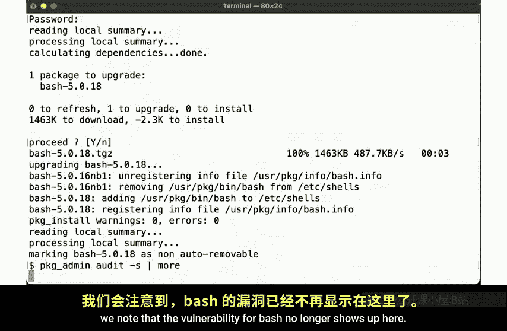

我们了解到，区分什么是操作系统核心、什么是附加软件并非易事。有些依赖关系（如内核与C库）耦合紧密，更新它们需要协调和兼容性；而其他软件则有多种选择。将哪些软件组合在一起作为操作系统，很大程度上取决于发行版提供商。

无论如何，我们阐明了所有这些软件都可以且应该以某种连贯的方式进行管理。一个好的软件包管理器提供了一系列优秀功能，包括：
*   **轻松安装软件并自动解析依赖**。
*   **提供完整的软件包和文件清单**。
*   **支持文件和软件包完整性校验**，用于入侵检测。
*   **提供全面的安全漏洞审计机制**。

只要软件被一致地打包，这些功能既适用于操作系统软件，也适用于附加软件。因此，你可能希望确保你的包管理器与操作系统深度集成，使其本身也成为操作系统栈的一部分。

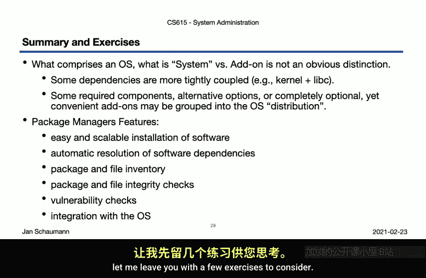

关于软件包管理的话题我们尚未结束。在下节课中，我们将继续深入探讨语言特定的软件包管理，以及该领域中一系列与安全相关的概念。

## 课后练习 💡

在进入下一节的讨论之前，请思考以下练习以巩固所学知识：

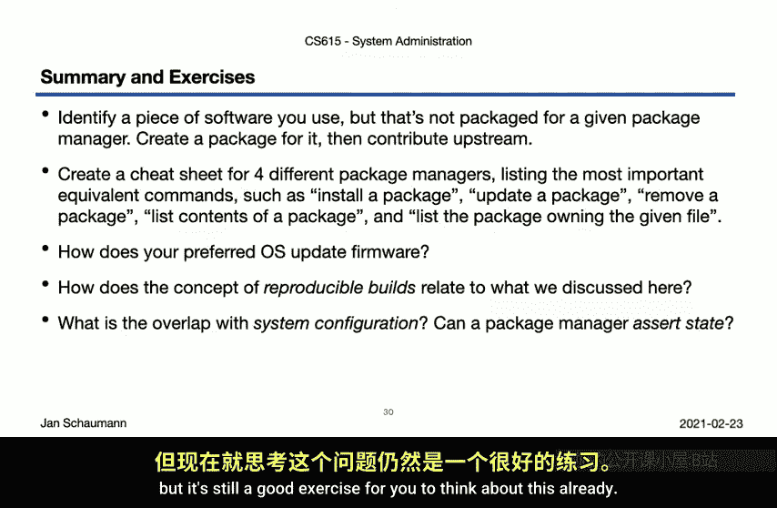

*   **练习打包**：找一个你喜欢的工具，检查它是否已为你喜欢的Unix发行版打好包。如果没有，尝试为其打包。上游项目很可能会乐于接受你的贡献。
*   **比较不同包管理器**：类似本节课在不同平台上的示例，找出执行包管理核心任务（安装、查询、更新、删除、验证）的基本命令。整理一个清晰的速查表，这对你未来切换不同Unix系统非常有价值。
*   **思考固件管理**：研究你首选的操作系统是如何处理固件更新的。
*   **研究可重现构建**：思考这个概念与我们讨论的内容有何关联。即，在不同的系统上运行相同的包管理器命令，是否总能得到完全相同的结果？可能会产生哪些差异？
*   **思考包管理与配置管理的关系**：你能否使用包管理器来断言系统达到某个特定配置的期望状态？我们将在学期末回到这个讨论，但现在就开始思考是一个很好的练习。

最后，这里有一个更详细的练习建议：比较手动安装软件和通过包管理器安装软件的过程。这个练习能让你对本章及下一章讨论的内容有更深入的见解。我知道这看起来工作量很大，但正如我一直强调的，你能从这门课中获得多少，取决于你自己。如果你对系统管理感兴趣，这些练习将真正深化你的理解，并在实践中对你有所帮助。