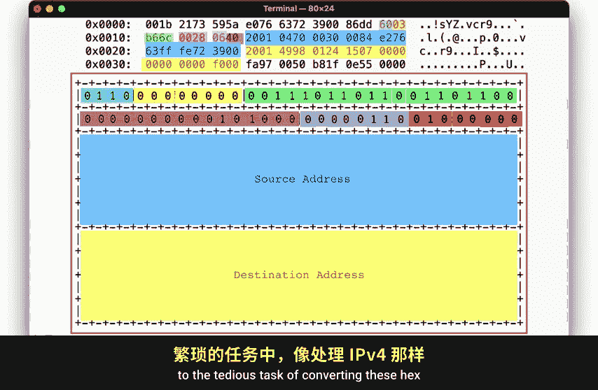
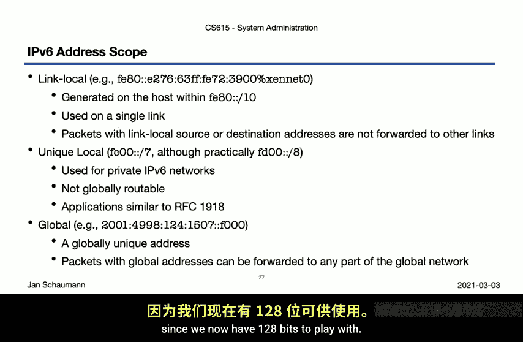
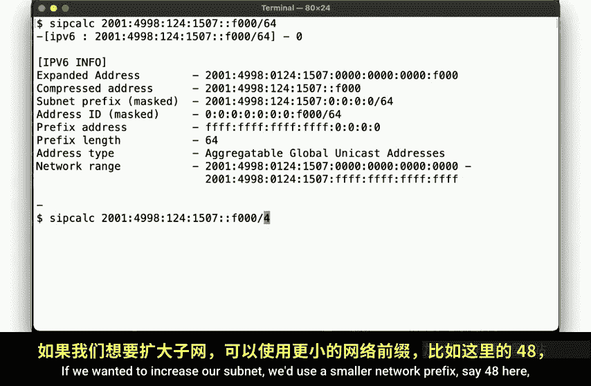
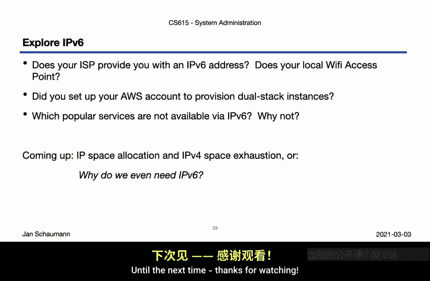

# 史蒂文斯理工学院【中英⚡计算机系统管理｜CS615 2021 System Administration】 p27 p26 Week 5, Segment 3 - Networking I： IPv6 Basics -BV11QQcYmEzD_p27-

Hello and welcome back to CS615 System Administration。

This is week5 second three and following ON analysis of the IPV4 packet and the concept of classless into the main routing or cider subniing。

It's time to now take a look at our big hero IPV6 coming to rescue us for IP exhaustion。

So to refresh our memory。Let's look real quick at this illustration from a previous video showing the structure of the IPV4 packet。

 we've identified the various segments based on a single TCP packet captured using TCP D while talking to the Steven Sea Web server。

We had called out the 32bit source and destination addresses and looked at how a sub mask can be used to divide the address into a network and a host portion。

So now what does this look like when using IPV6？For that。

 we'd like to repeat the previous packet capture only this time we'll make a request to a website that has an IV6 address。

Note that you do of course need to be on an IPV6 enabled system to repeat this exercise。

 your home ISP may or may not offer you an IPV 6 address and your local Wifi access point may not be configured to offer IPV 6。

Unfortunately， its 2021， and Amazon still does not enable IPV6 by default and all your resources。

But at least since 2017， you can actually get a native IPV6 address in AWS and don't need to use a tunnel broker。

 so who ready for progress。Anyway， so if you want to ensure your new AWS instances comes up with both IPV 4 and IPV 6 enabled。

 also known as being Gt， you can follow the steps I outlined here in this blog post。With that。

 your instance should then get a routeable IPV 6 address so we can then start our packet capture。

Okay， so we again start out with TCP dump。This time looking for packet communicating with www。

yahhooo。com。We make our curl request， as before。And then read the first packet we captured from the file。

Now， the first few bytes are going to be the same since this is on the data link layer using the same Mac address as we did before。

But then the next field describing the type of the protocol， the Mac frame wraps， is no longer IP。

 but not the value for IPV6。The bite starting after that。😊，And going up to。About here？

Are the IPB6 header with the remainder as the TCP payload。

Let's look at our I addresses on the Zennet0 interface。

And what dot ya docom resolves to so you can compare that output to what we find in the TCP dump packet。

那， there一个。Now let's compare to what we did for IPV4。 Here's the structure of the IPV 6 header。

 which looks similar， but a bit simpler than the IPV 4 header， don't you think。

Let's look at the fields。First， we have a fourbid version field。Which is said to6， not surprise。Next。

 we have the traffic class， which similar to an IPV4， includes the DSCP and ECN bits all zero here。

After that comes a 20 bit flow label。 A flow is really just a group of packets that belong together。

 such as say， a TCP session。By having this identifier。

 we can later more easily trace a full request across the network。Anyway。

 so this flow label is generated randomly。😊，And the first 32 bits here are represented in the above8 hexbys。

Next comes the payload length， 28 hex or 40 decimal， since we have no additional IPV6 headers here。

Then we specify the protocol of the payload TCP in this case。And at a hop limit， effectively the TTL。

 we recall from the IPV4 header with a default value of 64， just like an IPV 4 as well。

And that's really it。😊，The remaining 256 bits。I used for the source address。

And the destination address highlighted here in the TCP dump output and hex。Okay。

 so now do we have to go back to the TDS task of converting these hex characters into an IP address as we did for IPV4？

Take a look。Turns out we don't。 IPV4 addresses are in Hex， so we see our actual IP address here。

 literally in the TCP dump packet， which is rather convenient。Now let's again compare to IPU 4。

As we observed in our last video， IPV4 addresses are 32 bit numbers， and as we've seen。

 IPV6 addresses are a bit larger。Specifically， IPV6 addresses are 128 bit numbers。

Why we ended up with 128 bits and what problems IPV6 was intended to solve。

 something we'll cover in our next video， but for now let's focus merely on the structure of the address。

And so having 128 bids makes for a rather unwielly long address。 If we use the do decimal notation。

 we'd end up with 16octs。So， instead。We use 8，16 B fields that we convert to hex and separate by a coal。

 So that our really long bit string here becomes。This hexadeciimal strip。

But since strings like this can still be a bit large， we have a few ways of shortening them。

For starters， any leading zeroes can be let out。But in addition。

If we have successive fields of zeros， then we can leave those out completely。

But note that we can only do this once。Meaning that if we had double zeros on the left and on the right。

 you have to decide which ones you want to compress。So for example， if you had an address like this。

Then you could either。Compress it like this by lightinging the two leftmost de bit fields。

Or you can compress it like this， Aling the three right most0 fields。

Let note that we cannot compress both sides， since now it's impossible to determine how many fields should be filled in on the left or right。

But， do note。That either of these two compressions。

Right only or left only are valid and represent the same address。

As does the uncompressed version of the string。Okay， so in addition to the compression of the string。

 there are a few additional things you want to consider when it comes to written IPV6 addresses。

Just like an IPV4， where we have 127。0。0。1 on the Luck device， we also have an IPV6 Lock address。

 column column1。Note that this is really not a special case at all。

 it is merely an address with 127 leading zero bits translating to seven words of all zeros which we compressed。

The bigger difference here is that the Luex device and IPV4 actually got an entire class A network。

 not just that one address， but we'll get back to that in a future video。

If your system is dual stack configured and your socket allows both IPV4 and IPV6 addresses。

 you may encounter socalled IPV4 mapped addresses where a 32bit IPV4 address and dotted decimal format is stuffed into an  IV6 address with a special prefix of all zerosFF。

Next， although not strictly the part of the IP address。

 we have to consider how applications handle specifying a port in addition to an address。

In IPV 4 we use the colon port notation to specify an IP address port pair。

 but since IPV6 addresses use the colon as a separator， we can't do that。For that reason。

We use a new syntax where we use brackets around the IPV 6 address followed by a column and the port。

Finally， we need to point out that different IPV6 addresses have different implicit scopes。

As you may have noticed when we looked at the output of if config。

 we noticed that each interface multiple addresses。So far。

 that's not unusual as any interface can have multiple IPV4 addresses too。But in IPV6。

 each interface always has a so called link local scope address。

This link local address is generated under the host itself without requiring any specific network knowledge or DHP hub or anything like that。

It is an address within the F8 s 10 network with a low 64 bits generated using a standardized algorithm。

This address。Is only used on the specific link， and any packets received or sent to or from this address are never forwarded to any other link。

 meaning you are guaranteed that the packets stay on the interface。Next。

 we have so called unique local addresses in the Fc 00 s7 network。

Which are used for private IPV6 networks and which are not globally routed。

This is conceptually similar to the IPV4 RFFCC 1918 IP space that you're familiar with from your local Wifi network。

 your AWS default IPV4 space， etc。Lastly， we have the global addresses。

These are the normal addresses you will see and use， such as the one we use no examples here。

They are globally unique and can be routed on the public internet。

Now as you can see from looking at these bullet points here。

 we frequently talk about network space in terms of slash notation。

 just like we did when we talked about IPV4 Cyrus subnetting。

 and that's one of the things where IPV6 really is not that different from IPV4。

We still use a bitmask called a subnet prefix here， and the slash notation still applies。

 The only difference is that the number after the slash can be lot larger。

 since we now have 128 bits to play with。

So it should come as no surprise that we can use similar tools to calculate and inspect the different subnet prefixes。

The IP count utility we used in our last video doesn't support IPV6， unfortunately。

 so we are using a different tool， Scalalc。If we specify slash 64 subnet length。

Then we get output like this， illustrating the expanded and compressed forms。

 as well as the subnet prefix， the address scope and the network range。

 all looking rather similar to our previous IV4 examples。If we wanted to increase our subnet。

 we'd use a smaller network prefix， say slash 48 here。

And if we picked a slash 72 prefix， things look would look like so。Note， however。

 that one of the most commonly encountered prefixes will be slash 64。Why that is。

 something we'll cover in our next video。Alright， so now it's your turn to look around and explore the IPV6 word around you。

Check if you get an IPV6 address and if so， whether your normal network is IPV6 enabled。

 this can extend to common public networks or your home network。

If your home network currently doesn't support IP6， can you change that？What about our AWS instances。

 I already link the blog post that describes how you can set up your environment to ensure your instances come up dual stack。

 If you haven't done so already， please do that now as we'll be using dual stack networking in our next videos and exercises。

Do some research and find out which popular services and systems are IPVCs enabled。

You may assume that all the big players would be， but are they， Which services are not。

 Why do you think that is。In our next video， then we'll talk a bit about Internet governance and discuss where IP addresses come from。

 how they are allocated and why exactly we even need IPV6 at all。

32 B should have been enough for this little experiment called the Internet now。Until the next time。

 thanks for watching， cheer。

