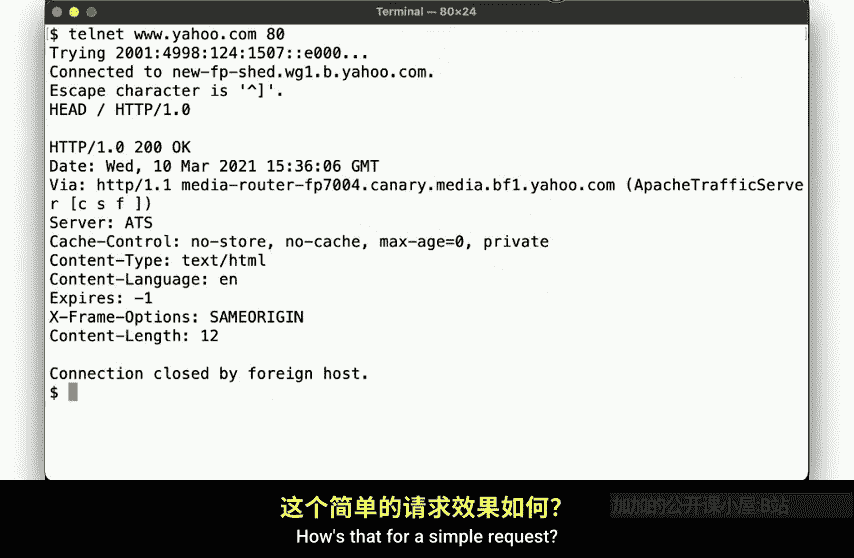
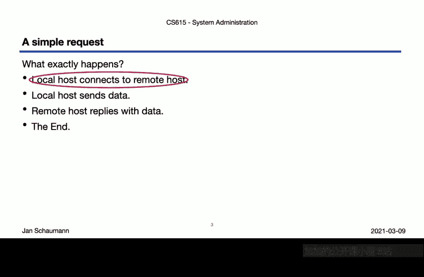
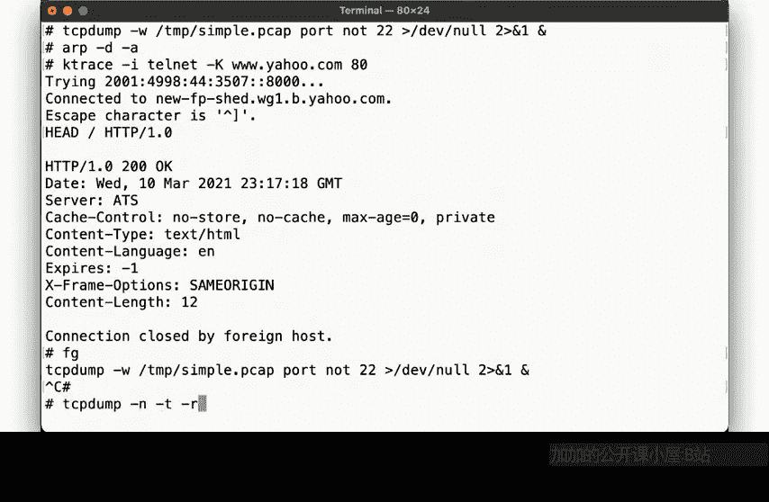
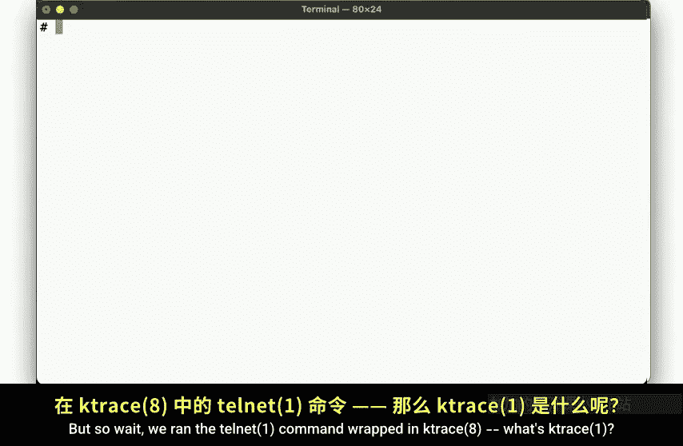
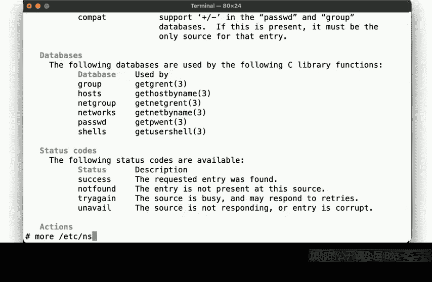
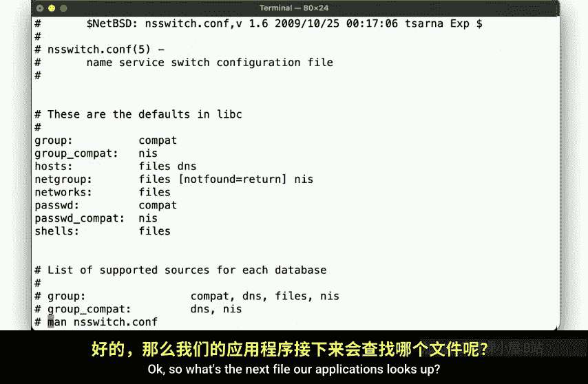
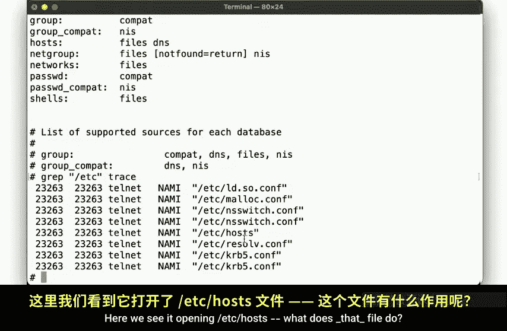
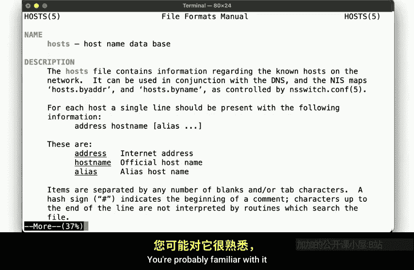
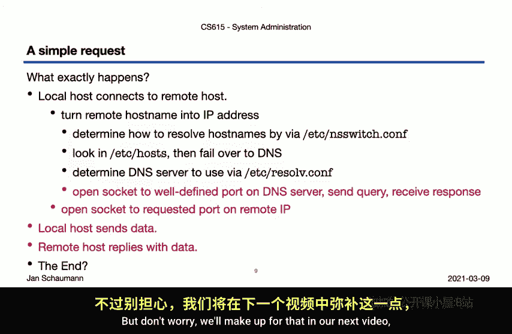
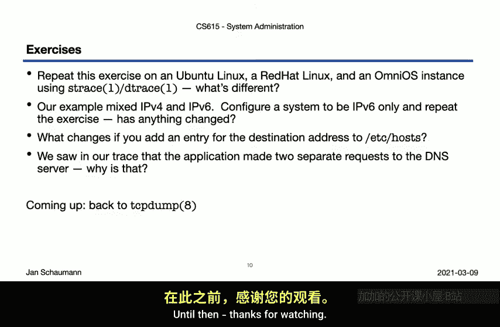

# 计算机系统管理：CS615：Week 06, Segment 1 - 网络 II，一个简单的请求 🌐

在本节课中，我们将继续探讨网络这个宏大主题。我们将通过追踪一个非常简单的网络请求，来深入了解系统之间是如何具体通信的，以及数据包在网络中是如何流动的。

上一节我们介绍了互联网的宏观视图、IP地址空间的治理以及物理网络的影响。本节中，我们来看看一个具体的网络请求在本地系统层面是如何运作的。



## 一个简单的请求示例

一个简单的请求可能是什么样的？超文本传输协议（HTTP）是一个显而易见的选择，因为它无处不在且易于理解。让我们模拟一个最基本的HTTP请求。



我们使用 `telnet` 命令，从我们的标准AWS EC2双栈FreeBSD实例上，建立一个到 `www.yahoo.com` 端口80的TCP连接，并发出一个HTTP HEAD请求。

```bash
telnet www.yahoo.com 80
HEAD / HTTP/1.0
```





服务器会回复一些信息，然后连接终止。这就是一个简单的请求。

## 深入探究：连接是如何建立的？

表面上，这个过程看起来是：本地主机连接到远程主机，发送数据，接收回复，然后完成。但让我们深入挖掘一下，本地主机究竟是如何连接到远程主机的。

为了详细分析，我们重复这个简单请求，但这次会捕获一些信息，以便重建系统上发生的详细过程。



以下是操作步骤：
1.  在后台运行 `tcpdump` 以捕获网络数据包。
2.  清除ARP缓存，确保从最底层开始。
3.  使用 `ktrace` 工具包装 `telnet` 命令并执行请求。
4.  停止数据包捕获，并分析收集到的信息。





`ktrace` 是一个用于追踪其他命令的工具，可以让你看到它执行了哪些系统调用和I/O操作。在其他Unix变体上，你可以找到类似的工具，如Linux上的 `strace` 或OmniOS上的 `dtrace`。



## 主机名解析的步骤

通过分析 `ktrace` 的输出，我们发现，一个简单的“连接到远程主机”的步骤，实际上分解为几个子步骤。

首先，需要将给定的主机名转换为IP地址。这个步骤本身又分解为：
1.  应用程序通过查询 `/etc/nsswitch.conf` 文件，来确定如何将主机名转换为IP地址。
2.  根据 `nsswitch.conf` 的配置（通常是先查文件，再查DNS），首先在 `/etc/hosts` 文件中查找主机名。
3.  如果在 `/etc/hosts` 中未找到，则需要查询DNS。为此，系统需要读取 `/etc/resolv.conf` 文件来确定使用哪个DNS服务器。
4.  然后，应用程序会打开一个UDP套接字连接到DNS服务器，发送查询，并等待回复。

只有在成功获得IP地址后，应用程序才能继续下一步：建立到远程系统的TCP连接并进行通信。

因此，我们最初认为的简单请求，当考虑到本地系统上发生的所有这些步骤时，突然看起来不再那么简单了。

## 本节总结与下节预告

本节课我们一起学习了如何通过系统调用追踪工具（如 `ktrace`）来剖析一个简单网络请求在本地系统上的执行过程。我们看到了主机名解析的完整链条，涉及 `/etc/nsswitch.conf`、`/etc/hosts` 和 `/etc/resolv.conf` 等关键配置文件。



记住，我们最初还使用 `tcpdump` 捕获了网络数据包，但尚未分析它们。在下一个视频中，我们将弥补这一点，详细追踪这些网络数据包的旅程。

---

在进入下一个视频之前，这里有一些练习供你尝试：



以下是不同系统上的实践练习：
*   在Ubuntu Linux、Alpine Linux和OmniOS实例上重复此练习。在这些系统上，你需要使用不同于 `ktrace` 的工具（`ktrace` 是BSD工具）。在Linux系统上，你应该能找到 `strace` 命令；在OmniOS上，是 `dtrace` 命令。它们的行为略有不同，但都提供相同的信息。
*   每个操作系统可能使用不同的配置文件，请确保你能追踪主机名解析和连接建立的具体过程。
*   在我们的例子中，看到了连接到IPv4和IPv6系统的连接。比较一下纯IPv6系统的配置会很有趣。配置一个纯IPv6的实例，看看有什么不同。
*   我们提到主机名查找始于 `/etc/hosts`。请验证你能否通过在该文件中添加地址来绕过DNS查询，并追踪应用程序的行为。
*   最后，如果你查看 `ktrace` 的输出，可能已经注意到我们向DNS服务器建立了两个独立的连接，但我们只解析了一个主机名，不是吗？这是为什么？