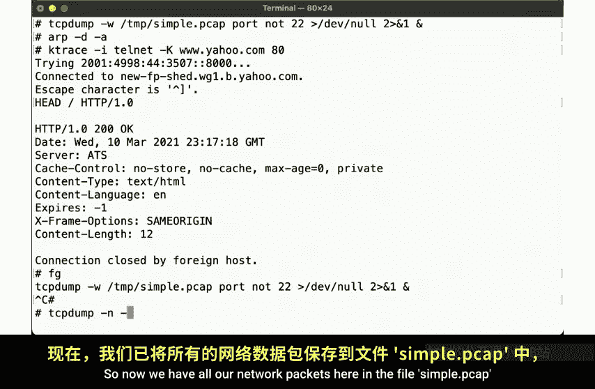
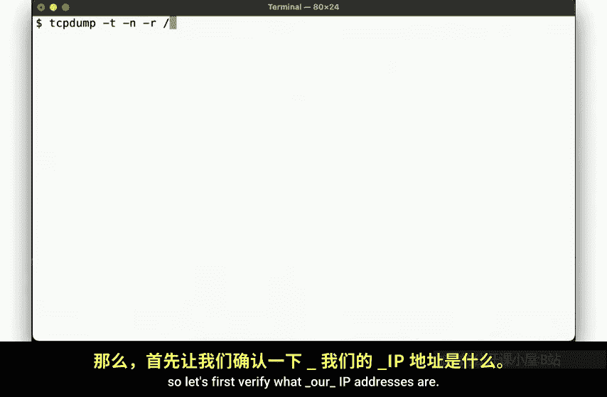
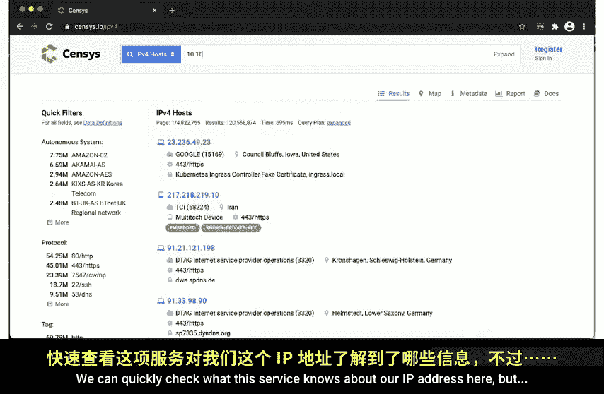
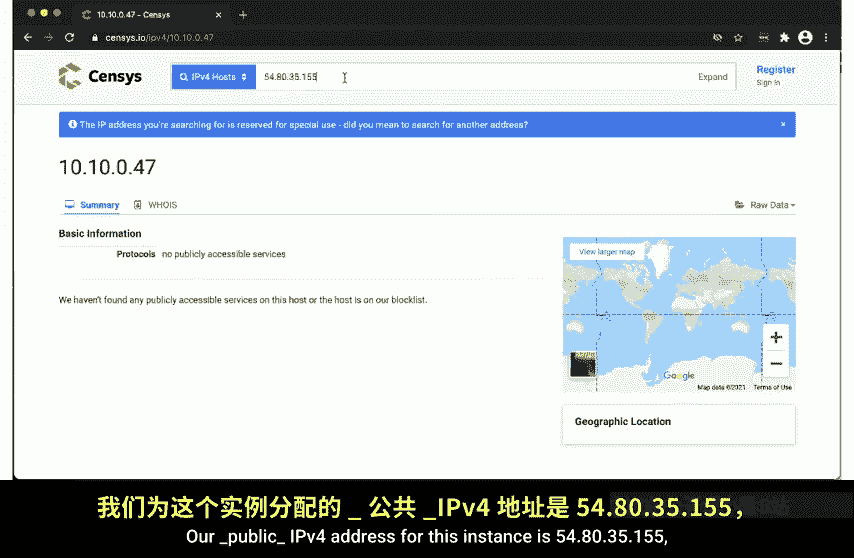
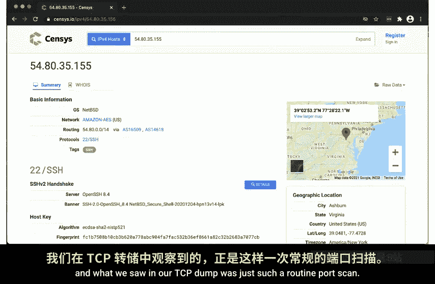
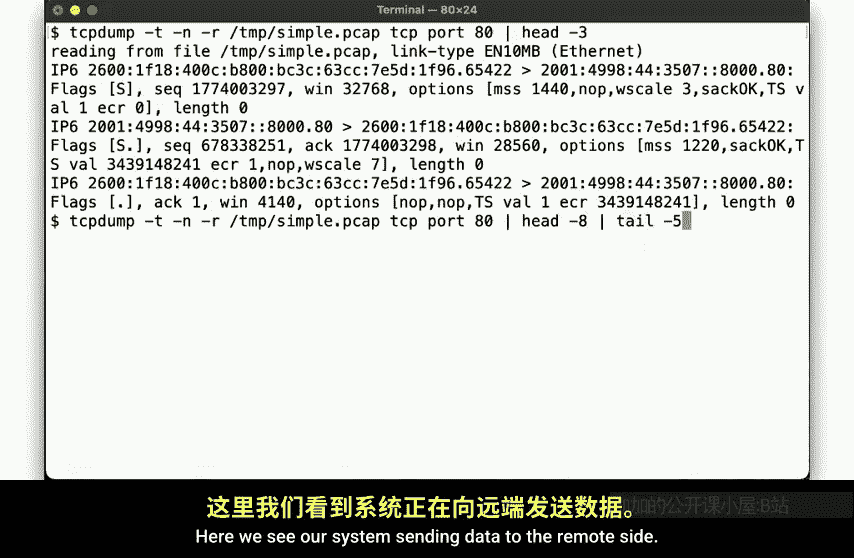
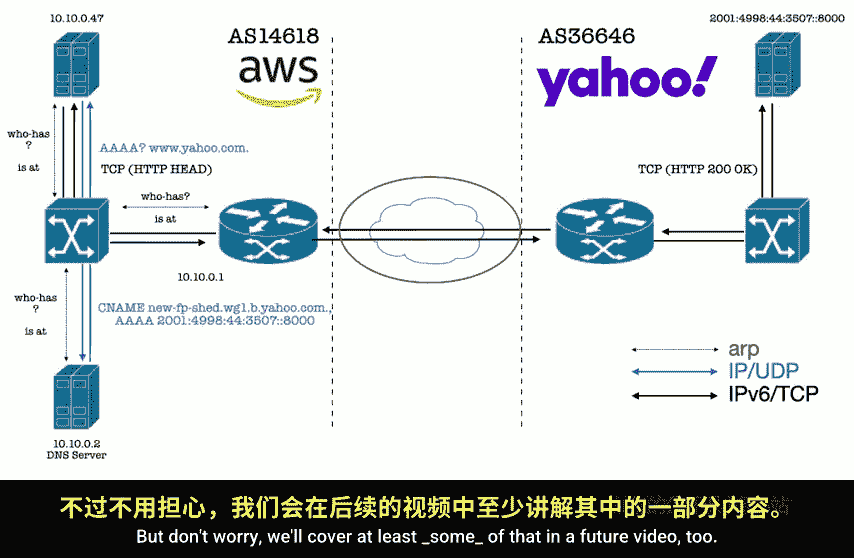
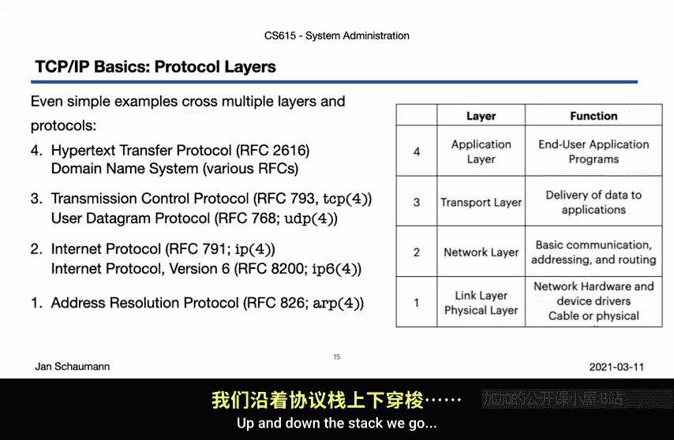
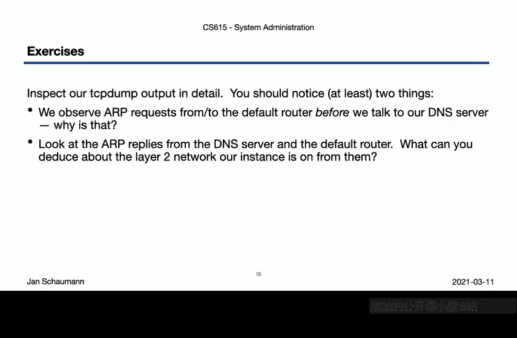

# 史蒂文斯理工学院【中英⚡计算机系统管理｜CS615 2021 System Administration】 p32 p31 Week 06, Segment 2 - A Simple Request, Part II -BV11QQcYmEzD_p32-

Hello and welcome back to CS 615 System Administration。This is week 6 segment2。

 and we're continuing to trace a simple HETP head request from one system to another。

In our last video， we used the K trace utility to inspect the executable and see what filess it opens and what system calls it makes in the process。

 we learned how the system determines how it should resolve a host name to an IP address。

 and we saw it make connections to the DNS server before then sending the HTP request to the destination by a TCP。

But we didn't look at all at the network packets we are captured。 So in this video。

 we'll pick up right there。So remember， this is how we started our invocation of Tnet。

We told TPam to capture all packets， except at his age traffic。Flued our ac。

And then began the execution of our command。So now we have all our network packets here the fire。

 simpleimple dot PC， and can begin our analysis。

If we look at what we captured， we see a whole bunch of packets having beengged between different I P addresses。

So let's first verify what our I addresses are on this instance。

If Config tells us that our IPV4 address is 10。10。0。47， that we have two IPV 6 addresses。

A link local address， starting with F E80 Colcon and the global scope address， starting with 2600。

Now， the first two packets in our TCP dump look like this。

We see a TCP send packet being sent from this IP address。1，6，2，1，4，2，1，2，5，1，50。2 hour 10。

 10 IP address at random port。We don't have anything listening on this port。

 so of course we sent back a reset。But what's up with that， we didn't ask for this traffic。

 Why are we seeing it Has nothing to do with our towner command。

Let's look at who might be behind the ascending I P address。Well。

 the address reverses to a name in the censuscanner。com domain。

 suggesting that what we're seeing here is a generic port scan。

 the kind of thing that just happens to every system that's on the public internet。

Random outside systems begin to scan you and try to identify just what exactly you're exposing to the internet。

Some of these scans are malicious， Some trying to actively。

 or at least opportunistically break into your host。

 and some are just overall internet reconnaissance。In this case。

 the IP address appears to belong to the census。 io service。

 which provides a text service detection analysis as a service。

We can quickly check what this service knows about our IP address here。

But of course， that I'm going to be very productive since the IP address we entered here is an RF 1918 address。

 a private address。As you probably are aware， our AWS instances are provisioned with RFC 1918 IPV4 addresses。

 but we are able to reach them from the internet via network address translation or net mechanism。

Our public IPV4 address， for this instance。Is 54， 80， 35，155， so let's put that in here instead。

And here we go， look at that， the system knows quite a bit about us。It knows that we are in Amazon。

 which we recently learned is easy enough to figure out by a simple who is look up。

It knows the net block and As numbers， of course， and after a port scan。

 it was able to determine that SH is running on port 22。From there。

 it was then able to fingerprint the SSH version and determine even the operating system version。

Since we don't have anything else exposed here， that's all the system knows。

 but this goes to show you that yes， anything you put on the internet will be scanned rather quickly and what we saw now at EP dump was just such a routine port scan。

But okay， let's now focus on the packets that do have something to do with our simple request。

 shall we？After the first two packets that we just discussed， we then see a few R packets。

Numbers  three through6 and packets 8 and nine over here。Let's just extract only the a traffic。There。

What we see here is the link layer lookups of the Mac address associated with some of the IP addresses on our layer 2 segment。

Let's see who we're talking with here。Remember that if we want to talk to any host that we can communicate with directly here on layer 2。

 then we send the packet to a default route， which of course then must be on our layer 2 segment。

So our default route for IPV4。Appears to be 10。10。0。1 and our address is 1010047。

Which is why we see these R broadcast queries and the respective responses here。

The default router is asking what the Mac address for our IP addresses is。

 and we are asking if anybody out there knows what the Mac address for the default router might be。

Then we each reply with the answer， update our up cache accordingly。

 and we are able to talk to one another by creating an Ethernet packet with a correct Mac address of the other side。

Note that we also see an R request from us for the Mac address of 10。10。0。2。

 which you may remember from the last video was the IP address of our DNS server that is at this point our tool has already gone through EtsyNswitch。

com， Etsyhosts and Etsyresolve。com to determine that it needs the IP address of the DNS resolver found that to be 10。

10。0。2 and is now looking to send a package to that address。We know that DNS uses UDP port 53。

 so let's see what the relevant packets we find in our NTCPdom for that protocol。Here we go。

We see our system sending a query to the DNS server， 10 1002 and port 53。

The first packet for which the previous Alookup was necessary。

We are asking the DNS server for a Q a lookup of www。yhooo。com and receive an answer。

Including a C name and several Q a records。We'll go into the details of the DNS system in a future video。

 but here we can also see a second query for an a record， an IPP4 address also。

With a similar response from the DNS server。All right。

So now we know what IP address we want to connect to and since the reply we got from the DNS server included an IPV6 address。

 and since that address is not on our local broadcast domain。

 we are now creating our TCP packets to enter to the default router。

 10 1000 load1 for which we have the Mac address nor ApCache。As you all know。

 the TCP connection is initiated via the three way handshake。

 so let's just look at those three packets。Here we go。

Our global Sccope IPV 6 address sends a packet to the destination address on port 80 with a sunflag set。

The remote site acknowledges our package and sends the sin as well， the synac。And finally。

 we will reply with the act of that packet， thereby completing the three way handshake， S。

 syn act act。We're now in business and have an open TCP connection。Now。

 let's look at the actual traffic once the connection has been established。

Here we see our system sending data to the remote site， the push Flger site。

 and TCP dump hopefully shows the ASII data we are sending。

Head slash HTP s 1。0， which with a carriage return line feet is 17 bytes。Hence。

 showing a sequence numbers 1 through 18。The remote side acknowledges byte 18 and we send an empty line。

 another carriage return and line feet， I2 bytes。Yahoo' serverver acts these two bytes。

 then sends us a 234 byte long response that starts with HtTP 1。0200 OK。After that。

 and because we are speaking HtTP 1。0， the remote server closes the connection。

By sending a packet with a f flag set。Our server X the data， the remote server send。

 then x the Fin packet with its own Finflake set， upon which the remote server acts that fin。

 and our TCP connection is now terminated。And there you have it。

 that's all the traffic and OTCP dump fire here for our simple HTP request。

Now having seen the packets in the TCP dump， we can then visualize exactly how the request was made。

We illustrate our instance up here in the upper left。

 and Amazon's AS 14618 network and Yao's web server on the right in its AS 36646 network。

As we saw in OTCB dump， we started out by sending an A request looking for the DNS server。

 which whatever network which were connected to will broadcast to all connected systems。

Upon which the DNS server will duti fully reply with its Mac address。

Allowing us to then send our UDP packet to port 53 on the DNS server。

 asking for the Q records of W w w。yahoo do com。Which then replies with the correct answer。Now。

 at this point， we're ready to send a packet to the Yahoo web server， but that system of course。

 doesn't live in our local network， so we need to hand the packet to the default router。So next。

 we then send out an our broadcast request for the default router。

Which then replies with its Mac address， so we are then ready to wrap our TCP packet to the Yahoo Ob server into an ethernet frame for the default router and send it packet out。

The default router then will forward the packet to the next top where it'll at some point cross the internet until it reaches the router on Yaos network。

 which will then forward the packet to the right web server。The web server processes it。

And inspect the reply。 and so we note that are a simple request that we already identified as not being quite so simple。

Ends up going across a few layers and systems altogether illustrated over here like this with thirded arrows representing arc traffic。

 blue arrows representing DNS traffic and the black arrows representing the HETP traffic。

It's also worth noting that we are still quite far from a complete view of the simple request as we glossed over all of this year。

 but don't worry， we'll cover at least some of that in a future video too。

For now， let's just observe that looking at our TCP IP stack。

 even a simple request crosses multiple layers on protocols。In our example here。

 we've used the H ETP protocol and the application layer because it's a simple request response protocol that lends itself a trivial analysis。

 We discuss H ETP in more detail and with nigh towards the serving aspects in a future video。

The other application layer we've used here is， of course。

 the DNS protocol that too will be covered in more detail in another video in the future。

Below the application layer on the transport layer。

 we've seen both TCP used for HETP and UDP used for DNS。

These two transport layer protocols were encapsulated by a network layer protocol。

The Internet protocol IP， thats in the case of our communications with the DNS server and the IPV 6 protocol。

 which we used to talk to Yao's web server。Finally， at the bottom of the stack。

 we saw the example of the R protocol how those packets were encapsulated on the link layer。

Up and on the step， we go。

But before I let you go， take another look at the TCP dump that we collected and review the packets we presented here in this video。

There were at least two things we didn't explicitly address。

We observe aRP requests from to the default router before we talk to a DNS server。

 but then we run through our example， we claim that the ARP request for the default router happens only after we've received the IP reference from the DNS server。

In fact， the TCPum does show that the ARP request happened before， but why is that？Secondly。

 look again at the articles and the responses from both the DNS server and the default router。

 what does that tell you about the network layout of this particular segment？Together。

 these two thought exercises allow you to hopefully realize just how much information we can extract from observing the packages and even such a simpler request as the one we run through here。

In our next video， we'll reinforce some of these lessons by walking through a few more protocols and layers by extracting information from packet catchers。

Uncle， then， thanks for watching， cheer。

