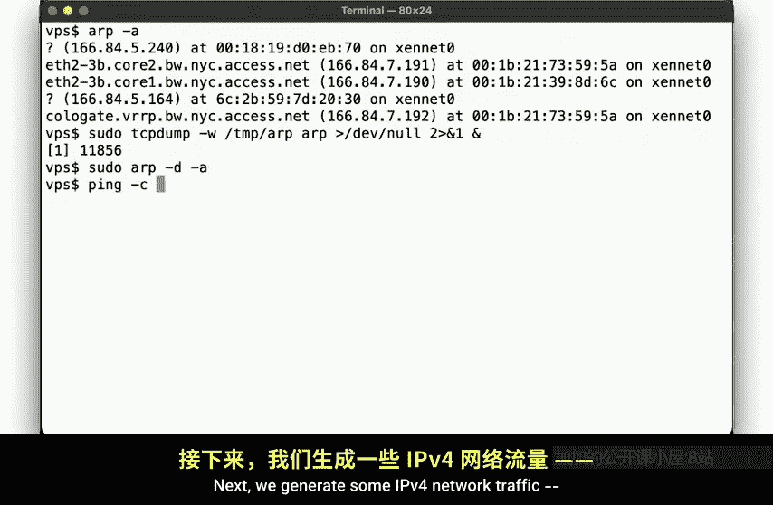
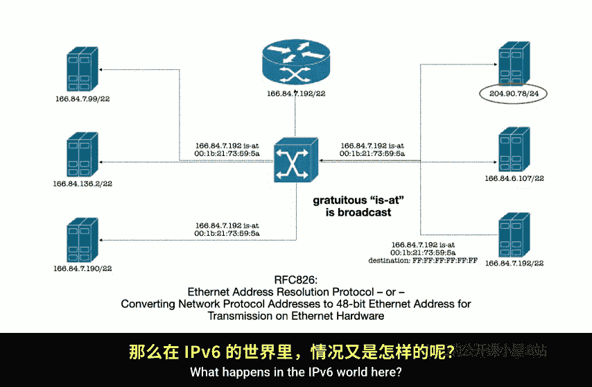
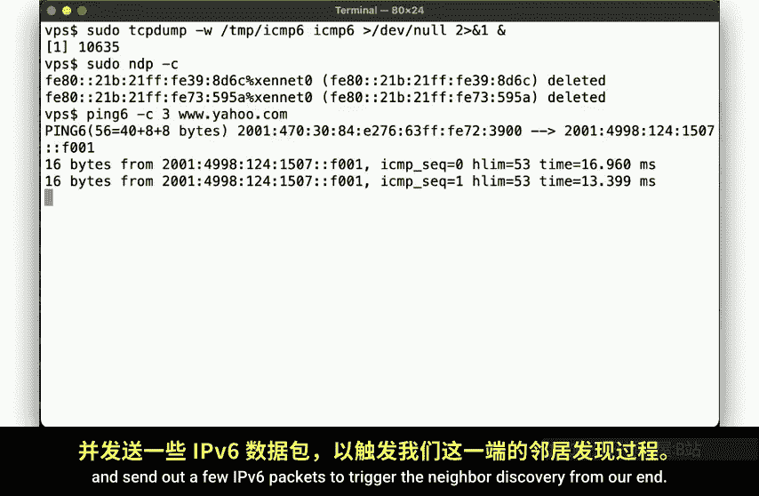
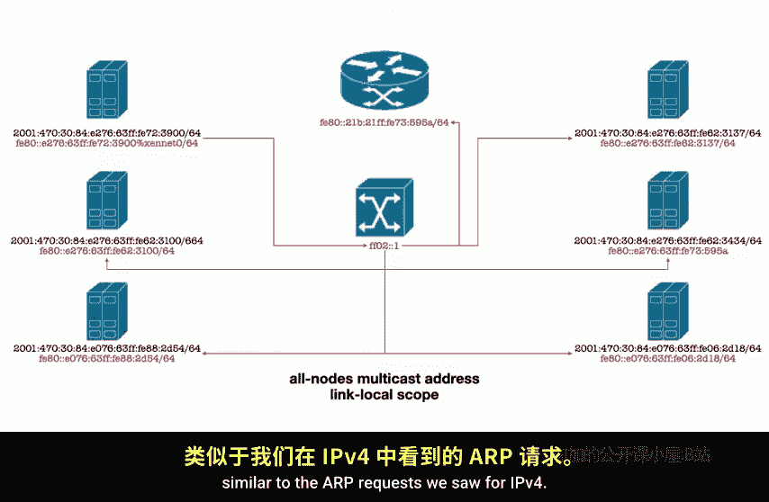
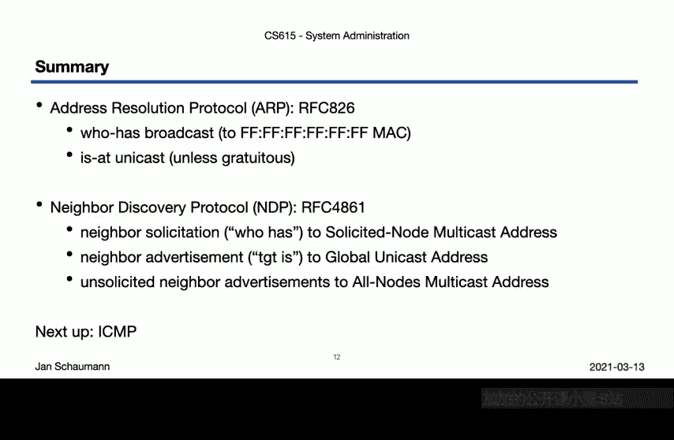

# 计算机网络管理：06-03：ARP与NDP协议详解 🖧

在本节课中，我们将学习网络层中两个关键的地址解析协议：用于IPv4的**地址解析协议（ARP）** 和用于IPv6的**邻居发现协议（NDP）**。我们将通过实际操作和抓包分析，理解它们如何将IP地址转换为MAC地址，以及两者在设计和行为上的核心差异。

---

## 概述

上一节我们介绍了网络基础，本节我们将深入探讨数据链路层与网络层交互的关键环节：地址解析。无论是IPv4还是IPv6网络，设备都需要知道目标IP地址对应的物理（MAC）地址才能进行本地通信。我们将通过分析`tcpdump`抓取的真实网络数据包，来直观地理解ARP和NDP的工作机制。

---

## ARP：IPv4的地址解析协议

ARP用于在IPv4网络中，根据目标IP地址查询其对应的MAC地址。

### ARP缓存表



在分析协议行为前，我们先查看系统的ARP缓存。ARP缓存存储了已知的IP到MAC地址的映射，可以加速通信。

在典型的系统中，使用 `arp -a` 或 `ip neigh show` 命令可以查看ARP缓存。初始时，如果网络中没有其他活跃设备，缓存可能为空或条目很少。

为了进行有效分析，我们需要在一个有多台设备的活跃网络中进行操作，并需要超级用户权限来刷新缓存和抓取网络包。

### 实战分析：捕获ARP流量

以下是通过一系列命令捕获并分析ARP流量的过程：

1.  **启动抓包**：使用 `tcpdump` 捕获所有ARP流量。
    ```bash
    sudo tcpdump -i eth0 arp -w arp_capture.pcap
    ```
2.  **刷新ARP缓存**：清空现有的ARP条目，强制系统重新进行地址解析。
    ```bash
    sudo ip neigh flush all
    ```
3.  **生成网络流量**：向一个已知或未知的IPv4地址发送数据包（例如使用`ping`），以触发ARP请求。
    ```bash
    ping -c 1 192.168.1.1
    ```
4.  **查看更新后的ARP缓存**：
    ```bash
    ip neigh show
    ```
5.  **停止抓包并分析**：分析捕获的`arp_capture.pcap`文件，可以看到大量ARP报文。

### 解读ARP报文

在抓包结果中，主要看到两种ARP报文：

*   **“Who has”请求（广播）**：当主机A需要与主机B（IP地址已知，MAC地址未知）通信时，它会发送一个ARP请求报文。这个报文的目标MAC地址是广播地址 `FF:FF:FF:FF:FF:FF`，询问“谁有IP地址B？请告诉A”。交换机会将这个广播帧发送给同一广播域内的所有设备。
    ```
    主机A -> 广播域所有主机: “Who has 192.168.1.100? Tell 192.168.1.50”
    ```
*   **“Is at”回复（单播）**：只有拥有该IP地址的主机B会直接向主机A的单播MAC地址回复一个ARP应答，告知自己的MAC地址。
    ```
    主机B -> 主机A: “192.168.1.100 is at aa:bb:cc:dd:ee:ff”
    ```

此外，还可能观察到一种特殊的报文：

*   **无故ARP**：这是一种未经请求的ARP回复。主机主动广播自己的IP-MAC映射，通常发生在新接口启用或IP地址变更时，用于更新网络中其他设备的ARP缓存或检测IP地址冲突。
    ```
    主机C -> 广播域所有主机: “192.168.1.200 is at aa:bb:cc:11:22:33” (但没人问过)
    ```

### ARP过程可视化总结

1.  **请求阶段（广播）**：源主机发送 **`ARP Request`** 到 `MAC: FF:FF:FF:FF:FF:FF`，询问目标IP的MAC地址。
2.  **响应阶段（单播）**：目标主机收到请求后，向源主机发送 **`ARP Reply`**。
3.  **特殊公告（广播）**：主机可主动发送 **`Gratuitous ARP`** 进行公告或冲突检测。



需要注意的是，在复杂的网络环境中（如一个VLAN内配置了多个子网），你可能会观察到来自你所在子网之外的IP地址的ARP请求，因为它们仍处于同一个广播域中。

---

## 从IPv4 ARP过渡到IPv6 NDP



以上我们详细了解了IPv4环境下的ARP协议。那么，在IPv6世界中，地址解析是如何进行的呢？IPv6不再使用ARP，而是通过**邻居发现协议（NDP）** 来实现类似及更丰富的功能，NDP是ICMPv6协议的一部分。

---

## NDP：IPv6的邻居发现协议

NDP使用ICMPv6报文类型来管理邻居关系，其设计更加高效和安全。

### 实战分析：捕获NDP流量

让我们用类似的方法分析NDP：

1.  **启动抓包**：捕获ICMPv6流量（NDP使用ICMPv6）。
    ```bash
    sudo tcpdump -i eth0 icmp6 -w ndp_capture.pcap
    ```
2.  **刷新NDP邻居表**：
    ```bash
    sudo ip -6 neigh flush all
    ```
3.  **生成IPv6流量**：触发邻居发现过程。
    ```bash
    ping6 -c 1 fe80::1%eth0 # 向链路本地地址发送ping
    ```
4.  **查看NDP邻居表**：
    ```bash
    ip -6 neigh show
    ```
5.  **分析抓包文件**：观察`ndp_capture.pcap`中的ICMPv6报文。

### 解读NDP报文

IPv6主机通常拥有多个地址：**链路本地地址**（以`fe80::/10`开头）和**全球单播地址**。NDP的核心交互如下：

*   **邻居请求（Neighbor Solicitation, NS） - “Who has”**：当主机A需要解析主机B的IPv6地址时，它不会广播，而是向一个特定的**被请求节点多播地址**发送NS报文。这个地址由前缀`FF02::1:FF00:0/104`加上目标IPv6地址的低24位组成。只有对应IPv6地址匹配这些低24位的主机才会监听这个多播地址。
    ```
    主机A -> 被请求节点多播地址: “Who has 2001:db8::1?”
    ```
*   **邻居通告（Neighbor Advertisement, NA） - “Is at”**：目标主机B收到NS后，会直接向主机A的单播地址回复NA报文，告知自己的MAC地址。
    ```
    主机B -> 主机A: “2001:db8::1 is at aa:bb:cc:dd:ee:ff”
    ```

与ARP的广播相比，NDP的多播机制大幅减少了无关主机的处理开销。

NDP也有类似“广播”所有主机的机制：

*   **所有节点多播地址**：地址 `FF02::1` 是一个链路本地范围内的所有节点多播地址。向此地址发送报文（如`ping6 FF02::1`），链路本地广播域内的所有IPv6主机都会收到并可能回复，这类似于IPv4中向广播地址发送数据包。这可以用来快速发现网络中的邻居，并会在本地NDP缓存中生成大量条目。

### NDP过程可视化总结



1.  **请求阶段（多播）**：源主机向**被请求节点多播地址**发送 **`Neighbor Solicitation`**。
2.  **响应阶段（单播）**：目标主机向源主机发送 **`Neighbor Advertisement`**。
3.  **主动通告**：主机可以发送**未经请求的NA**（类似于无故ARP）来宣告自身变化。
4.  **全局发现**：向 **`FF02::1`（所有节点多播地址）** 发送报文，可与链路上所有主机交互。

一个关键区别是：**NDP运行在网络层，使用ICMPv6报文；而ARP独立于IP，运行在链路层之上**。

---

## 总结

本节课中，我们一起深入学习了两种地址解析协议：

*   **对于IPv4**，我们探讨了**地址解析协议（ARP，RFC 826）**。它使用广播请求（`Who has`）和单播回复（`Is at`）来解析地址，并可通过无故ARP进行主动公告。
*   **对于IPv6**，我们探讨了**邻居发现协议（NDP）**。它使用ICMPv6，通过向**被请求节点多播地址**发送邻居请求（`Neighbor Solicitation`），并接收单播的邻居通告（`Neighbor Advertisement`）来完成解析。这种方式比广播更高效。同时，`FF02::1`地址提供了链路范围内的“所有主机”通信能力。



理解ARP和NDP对于诊断二层网络连接问题至关重要。请务必在你自己的系统上使用 `tcpdump` 或 `Wireshark` 工具进行抓包实践，观察这些协议的真实交互过程。在接下来的课程中，我们将更频繁地使用 `tcpdump` 来分析其他网络协议。