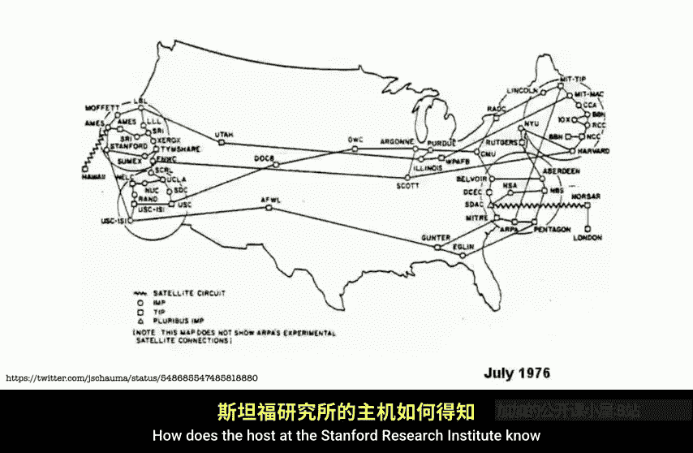
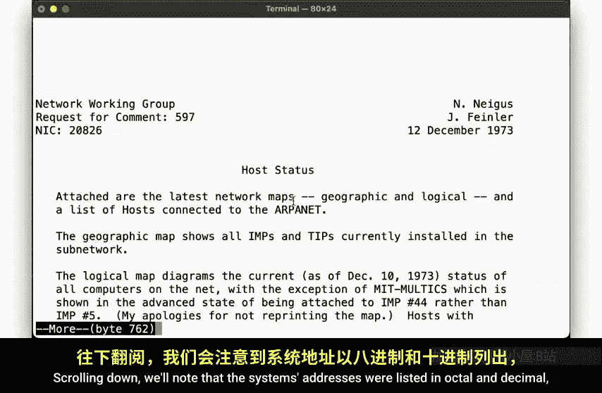
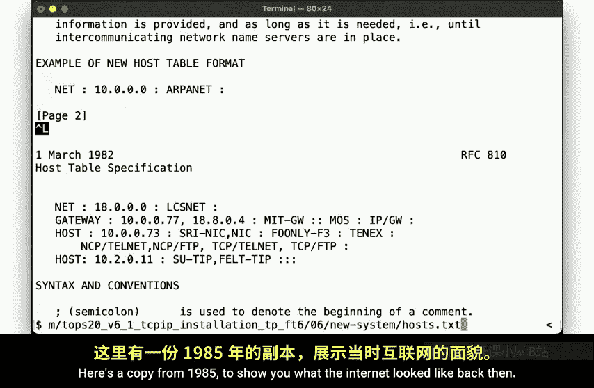
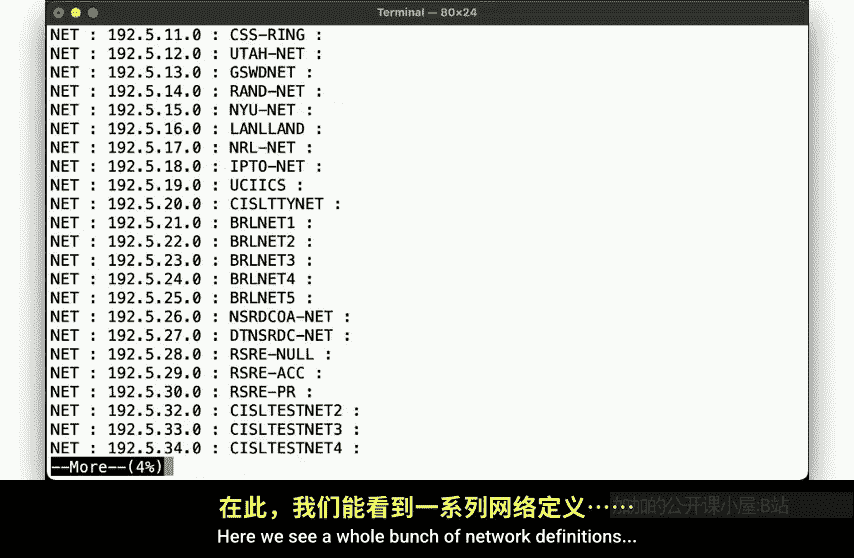
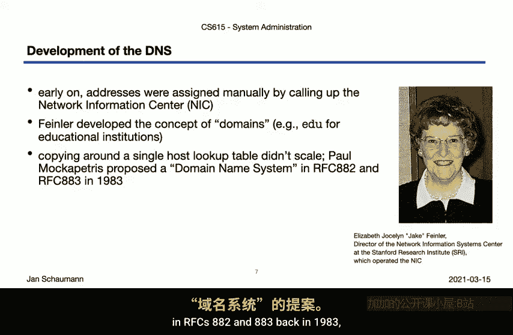
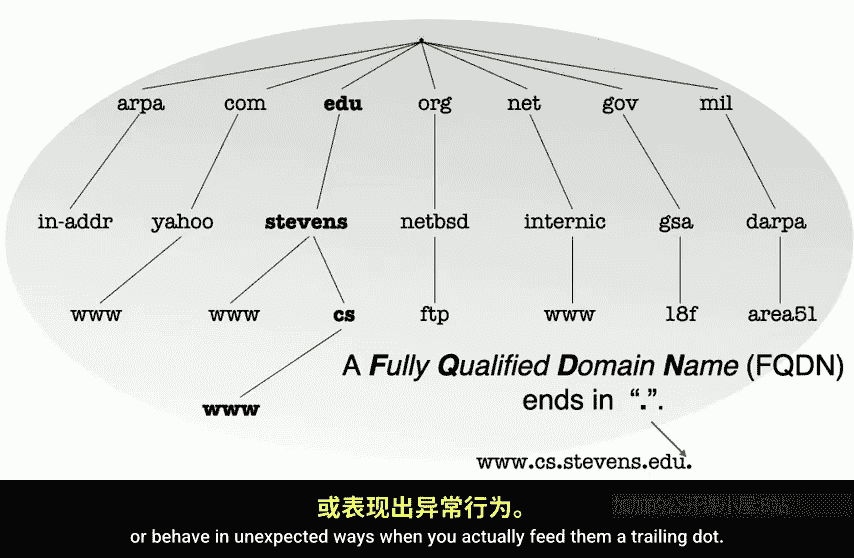
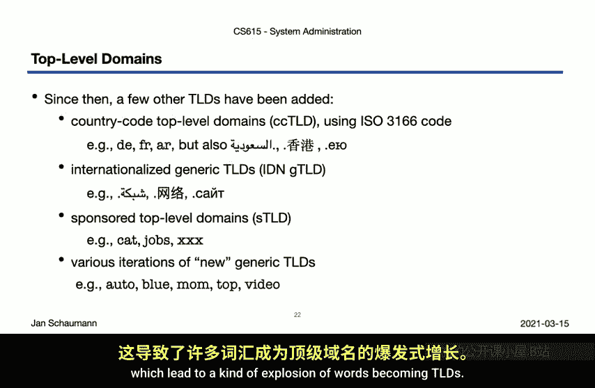
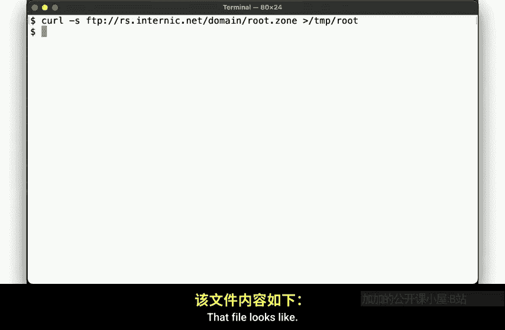
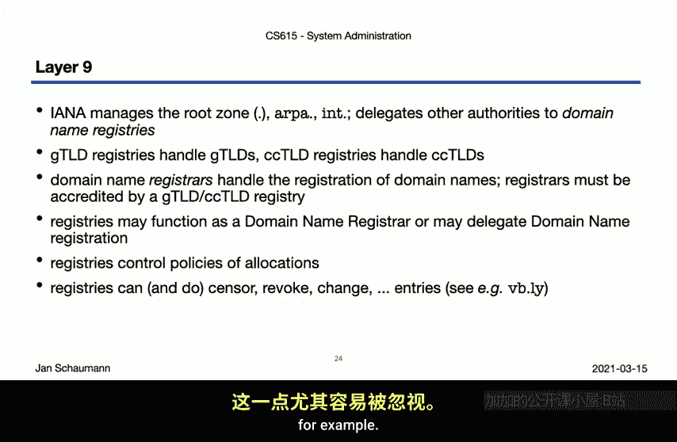
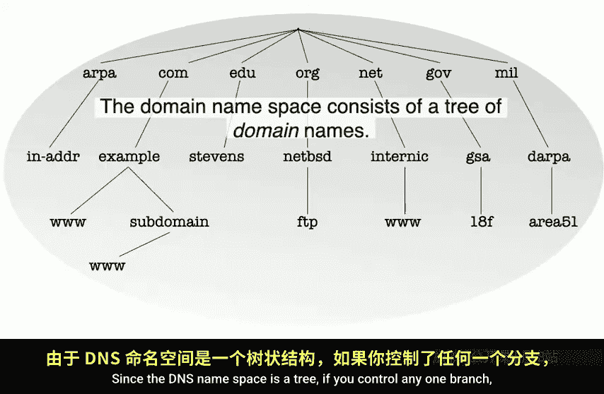

# 史蒂文斯理工学院【中英⚡计算机系统管理｜CS615 2021 System Administration】 p35 p34 Week 07, Segment 1 - The Domain Name System, Part I -BV11QQcYmEzD_p35-

Hello and welcome back to CS615 System Administration。We are now in week 7。

 past the midpoint of the semester， congratulations。In our last video。

 we've looked closely at the details of networking with a focus on the TCPIP stack。In the process。

 we've seen how we make connections between different systems。

 how the different autonomous systems connect to one another。

 and how we can trick the routers into sending us a packet back to reveal the path our messages are taking across the internet。

But in almost all of these examples， we've started out with a host name， not an IP address directly。

 that is we begin all our communications with a lookup of the host name to translate that into an I address。

 which you all know happens via the use of the DNS。By the way， it's the DNS， not the DNS system。

 since they'd be saying the domain name system system， So kind of like an ATM machine。But anyway。

 the DNS is a critical part of the internet's infrastructure。

 and one of the fundamental components a system administrator needs to understand if only to come to the realization that at the end of a long day of troubleshooting。

 when nothing makes sense， it's probably a DNS problem。

Either that or somebody monkeyed around with Etsy hosts， which never。

 not even once has not come back to bite you。 So don't do that。But we're getting ahead of ourselves。

To better understand the DNS， let's rewind and go back to the early days of the internet。

If you have only two hosts that you're connecting。And all you really need is the network interface card in each。

Hook them up with a cable and there you go。 You know how to reach the other system without any need for looking up addresses or anything。

But， of course， as soon， as you add just a few other systems， you have a problem。

 How do you know how to reach each system， Well， we assign them I P addresses。

But now you have a problem。You have to remember that system up here in the upper left that you want to talk to has the IP address。

 198， 51，100195。And the other one， host B has address 192，0，280， and so on。

And people are really bad at remembering numbers。Especially as the internet grew。

 this became an unscalable solution。What you see here is the map of the early days of the ARPpannet as the initial sites were connected and the network grew。

During those days， how did we keep track of which hosts were located where？

How does the host at the Stanford Research Institute know what the address of the system at MIT it wants to talk to us？

Well， let's recall how our system looked up this information。For our earlier video。

 youll remember that our tools consulted with EtsyNwitch。

com on how to resolve host names to IP addresses。And by default。

 we are starting out by looking in at sea hosts。Which might contain a set of IP address to host name mappings。

But hold on a second。 Doesn't this pose a chicken egg problem。

 How we know the information to put into that fire to begin with。

Let's look at the menu of page once more。On this system。

The manual page still contains this paragraph over here。

 where it notes that this file may actually originate from the central Network Information center on Nick。

Funny aside， this comment was removed from the NePSD manual page literally just last week。

 as one as serendipitously， the topic of Ho's database came up just as I was preparing this video lecture。

Anyway， so this main page tells us that the Etsy hoststs file used to come from the NI， meaning yes。

 we did indeed have one central EsyHost file that contained all the IP addresses of all the host on the internet and we copied that file around and updated it whenever a new host was connected to the internet。

One of the earliest documentation of this host database was RF 5，9，7。Which looks like this。

In December 1973， this document provided the latest network maps。Scrolling down。

We'll note that the system's addresses。Were listed inoctal and decimal， not by I P address。

 but included information about their location， as well as what type of system they were。

You will find a whole bunch of PDPs and old IBM systems here。After some time， as the networks grew。

It became clear that the format used here was no longer suitable and the new RFC。

R F 810 was published。In 1982。By Elizabeth Feinler。

 who well talk about a bit more in a second and others。This RF defined the DD hosts table。

 which not only include information about the hosts or systems。

 but also about the networks and gateways and the operating system of the remote systems。

This document included information about where you could get this host table from。Namely。

 the Stanford Research Institute's Network Information Center， Ezraai Nick。By an anonymous FTP。

The format now looked like this。With entries named net， gateway or host。

You can still find some of the historical host tables。

I've included a link at the end of the slides for this video segment。Here is a copy from 1985。

To show you what the internet looked like back then。

Not all the detailed information about the systems included here in this file。

So here we see a whole bunch of network definitions。

Then some gateway systems indicating which hosts bridge， which networks。And on here。

There are host entries， giving you the IP address as well as the operating system。

 as well as what services the host offers。Let's just see how many hosts there were on the internet back in 1985。

Looks like the internet back then consisted of 1325 hosts。And so back at that time。

 this was our resolved names more or less。All addresses were manually assigned。

 The management of this information was handled by the Network Information Centre at the Stanford Research Institute under the direction of Elizabeth Joscelyn Feiner。

 whose name we just saw in the earlier overseass。Finr， together with John Pastel。

 whom we encountered in earlier videos， basically ran the Internet back then。

 If you wanted to connect to a new host， you had to call Leser Iick and ask them to assign you address。

 then update the host database and publish it with all other systems。

 then having to fetch the new copy。During that time。

 Elizabeth finally came up with the concept of using domains to group names based on their functions。

 such as， for example， using EU for educational institutions。But of course。

 copying around a text file was obviously not a scalable solution。 So another direction of John Palo。

 Paul Macerpatrick， developed a proposal for a domain name system in RFCs 882 and 883 back in 1983。

And four grad students at UC Berkeley were the first to implement this proposal as a Uniix name server named the Berkeley Internet Na domainin or bind in 1984。

Binnd is to this day， the most widely used DNS server on the Internet and currently maintained by the Internet Systems Consortium or ISC。

The domain name system is based on the concept of a domain name space in a tree like hierarchical structure comprising so called domain names。

This tree is rootd in a note， simply known as dot。And the subdivided into individual zones。

 Each zone may itself consist of one or more domains。

 which themselves may contain sub domains and so on。

The domains directly under the route are referred to as top level domains， or TlDs。

Which are then further divided。Into second level domains。

 which in turn can be divided into third level domains and so on。

But who controls how a given zone may be divided。That decision power is called having authority over his own。

And this authority is not central， but may be delegated with a niche zone。Now。

 since the entire Dionnes tree is rooted and dot the root zone。

This zone must delegate authority over the top level zones。

Which then delegate authority over each of the individual's second level domains to the rightful operators。

Now， note that his zone may further delegate authority any way it sees fit。So for example。

 the Stevens， which has authority over the Stevens Zone under the EduU top level domain。

 may decide to delegate authority over the CS subdomain to a different entity。Next， within this tree。

 every node must have a label， a name， and each node may have additional information associated with it。

There's a number of different pieces of information that you can associate with a given node。

 but it's not completely free form。 Instead， we have to find a number of so called resource record types that describe the information。

So the most common resource records are of course the IP address associations via the A and Q records。

 but Im sure you are all also familiar with the C name or canonical name resource record。

 which kind of works like a symbolic link in the file system and that it merely points to another node in the DNS tree。

But there are other types。 one retail's record we'll see again in a future video is the Mx record defining the mail servers responsible for the domain。

But let's stick with the DNS where we have N S records defining the name servers responsible before a given zone。

 or say records associated with DNst an extension to the DNS to add cryptographic authentication。Now。

 when we construct the domain name， we simply walk up the tree。

 concatenating the labels of the nodes with a dot。So for example， we get du， du du。Dot C。Dot Stevens。

Don't eat you。Now， in order for this name to become a fully qualified domain name or F QdN。

 the last label， the dot for the route needs to be appended。

This trailing dot signals to the resolving libraries that no further walking up the tree is to be attempted。

 But， of course， most people leave out this dot。 and a shameful number of systems have been coatd up that break or behave in unexpected ways when you actually feed them a trailing dot。

Or you may be able to evade a paywall simply by using the FQDN of the domain。This， by the way。

 is one of the more benign things that can happen in software developers do not understand the DNS。

Anyway。So let's take a quick look at the top level domains we have。Originally。

 RFFCC 920 edit the following。Come for commercial use。

 Yahoo All come is the example we use as Yahoo is a commercial entity。EDU for Educational use。

 Stevens St EduU is the example we used for obvious reasons。Golf for government use。

 mill for military use。And org for any other organization nowadays。

 often types used for nonprofits or otherwise to distinguish a domain from a commercial counterpart。

Then there's ARPA， which was supposed to be temporarily for ARPA net administrative purposes。

But as you all already know， from a discussion of the temporary IPV4 space， temporary rarely is。

But as you all know， we have several other tea at these nowadays。We have country code specific TLDs。

 such as DE for Germany， for our France， are for Argentina and so on。

This nowadays also includes several internationalized country code TlDs。

 such as those shown here for Egypt， Hong Kong and EU using Cyyrilllic letters。

Then we have a number of internationalized generic TlDs。

So called sponsor TLDs backed by a narrow community， but not for example， a single commercial entity。

Here we show the Cat TLD representing the Qatalan linguistic and cultural community。

 jobsbs for human resourcesource managers or XXX as a voluntary option for pornographic websites。

 although of course though often generally operate out of。com。After all that。

 we also get a whole lot of new generic TlDs when I can announce that anybody could propose and become a sponsor for a generic top level domain。

 which LED to a kind of explosion of words becoming TlDs。

So how many TlDs does that make in total？Let's take a look。

 We can fetch the top level root zoneone file from InternetNe。That fire。

Looks like so。We see various records， including the resource records for the root name service。

And as we scroll through this file， we find the name service for all the different TLDs。

Since this is where this information necessarily must be kept。

So let's extract all the N's record entries。now let's count how many unique TLDs we find。

And the answer is， as of more 16， 2021， there are 1504 TlDs。Now， how do we manage all these domains。

 Remember， we operating up here layer 9 and control of the DNS seems to have some pretty obvious implications。

For starters。 and this really isn't very surprising if you have paid attention to our last few videos。

 Weve found that Aena manages the root zone， as well as the infrastructure， critical zones。

 Apa and int。All other domains， that is the management of all the TRDs is delegated to so called domain name registries。

For the GTLDs， there are specific GTLE registries and each country has their own country code TLD to manage。

 so use their own registry。The domainium registries may then outsource the registration of names to domainium registrars。

 which they a credit to ensure compliance with their rules and requirements。

 meaning a registry may either be a registrar themselves or delegated function。

While the registries control the policies of the allocation。

 such as placingting restrictions on the use of the domains within their TlD。For example。

 the cat domain we just mentioned a minute ago is not actually for cat pictures on the internet。

 but rather for the promotion of the Catalan language and community。

 so you can't randomly register domain under dot cat unless your page is in Catalan。

Now one thing to note here is that the registries do have control over the entire namespace within their domain。

 and they have the power to make your website disappear if they don't like it。For example。

 the LY TLD is a popular choice for several websites。

 but this domain is actually the country called TLD for Libya。

 which is not known to be the most progressive country in the world。AFew years ago。

 there was a case where the adult blogger， Violet Blue had registered the domain VBLY。

 but the Libyan government deemed the content to not follow Sharia law and thus took it on。

So when you choose your domain name， you probably want to make sure that you don't become subject to the rules of a country or organization that doesn't align with your principles。

This is particularly easy to forget when you want to grab a cool sounding name ending in another country's TLD such as LY or IO。

 which is the CCTLD for the British Indian Ocean Territ， for example。

Which is a good thing to keep in mind since the DNS namespace is a tree。

If you control only one branch， you control all the branch subtes and notes below that particular branch。

Meaning， if you compromise the registry for dot com or the registrar for example dot com。

 then you control。All the other nodes underneath。For this reason。

 it's quite critical to ensure that your Ns records are not compromised。

 If I can trick you into pointing these to my name server， then I have control over your entire zone。

All right。 I think at this point， we can take a break。

 Having seen the history and logical structure of the DNs。

 where next dive back down into the network packets and begin tracing DNS requests to better understand how we are traversing this tree。

Until then， thanks for watching and make sure to get your TCP ready for use。解es。

