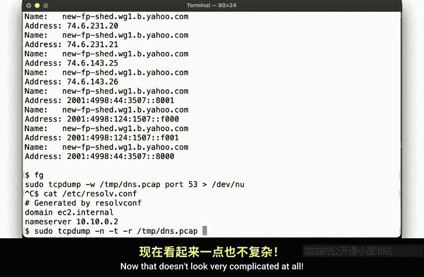
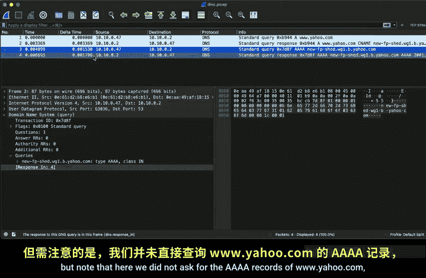
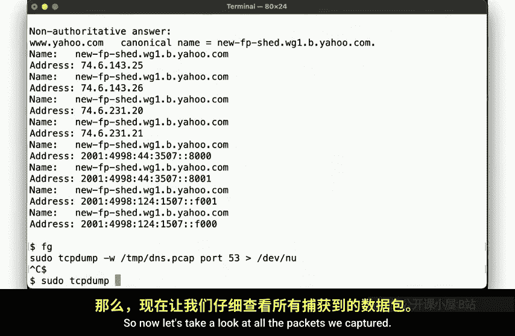

# 史蒂文斯理工学院【中英⚡计算机系统管理｜CS615 2021 System Administration】 p36 p35 Week 07, Segment 2 - The Domain Name System, Part II -BV11QQcYmEzD_p36-

Hello and welcome back to CS615 System Administration。 This is week 7 segment 2。

 and we continue our discussion of the domain name system。😊，In our last video。

 we provide a bit of historical context， as well as presented the hierarchical structure of the domain name space。

 So now it's time to go back to the trenches， dig out our trusted UCP dump and look at some packets to really understand how the name resolution process works。

So let's not waste any time and jump right in。We know that DNS uses port 53 by default。

 so let's start capturing those packets here。And then。Perform a simple DNS lookup。There we go。

We can stop our packet capture and then take a look at the result。

The NSs lookup tool tells us which name surveyed used，10 or 10 not0 2。

Which no surprise is the one configured in Esy resolved at conf， as we recall from our earlier video。

Next， we'll note that our result presented by Anna's lookup is marked as being non authoritative。

This is because the name server that we asked for the results is not the name server that's in charge of the zon in question。

We'll go into the details of this distinction in a little bit。

 but for now we note that authoritative or not， we did get back the results here。

So now let's look at what packets we captured。

No， that doesn't look very complicated at all。We see your query to the name server asking for an A record together with the result it returned。

 then a query for Q record again with a result。That's all。

But let's look at these packets in more detail。This time using wirere Shark。

Let's select this packet here。And we see that Wireshark correctly identifies it as a DNS query packet。

Which contains a single question for an A record。The response is in the second packet。Mch contains。

5 answer resource records。Namely。The canonical name for w w dot Yahoo dot com。

 as well as the different I addresses that the canonical name resolves to。Our second query here。

 the request for Qua a records。Yields a result that looks similar。

But note that here we did not ask for the Q records ofcom， but for those of the scenee。

When we drill down into the flags here。We know that this is where we are informed that the response was non authoritative。

So one little example all by itself already illustrated some important aspects。1。

 there is a difference between an authoritative name server and a server that simply resolves things。

 That is an authoritative name server provides authoritative answers。

 A resolver relates answers it determined by asking the right authoritative name server。

These resolvers typically cache these results for some time to avoid having to go and ask the authoritative servers again and again for this reason。

 they are also oftentimes called a caching resolver。

We also saw that this simple request involved several independent queries and multiple resource record types。

We asked for www。yo。com， which had a C name record， indicating that the canonical name for www。yhoo。

com is newfpsheddwg1。b。yhoo。com。The tools we used， as well as the DNS itself are smart enough to know that the users are most likely interested in the IP addresses of the names they ask for。

 so unless specified otherwise they will then look for both the IPV4 addresses， A records。

 as well as IPV6 addresses， Q records。Taking these packets and visualizing them gives us this image。

 We ask our resolver to get us the right I P addresses。 And then well， basically。

 as best as we can tell from looking at our packets， some magic happens over here。

 and the resolver can then give us the answer。We will repeat this by asking for the Q records， again。

 some magic happens and the resolver hence us the results。But come on， this is a CS class。

 We don't do magic。 We want to actually explain and understand what happens over here。

 So let's try to break this down。We'll start another TCP dump。

 and this time we're trying to be a bit smarter。We want to get an authoritative response。

 we want to find out who's in charge of www。yaho。com。

So we ask for the name server responsible for this name。Again， we get back the response at ww。Jhoo。

com is a sea name， but we also get information about where we can find an authoritative answer。

By asking Y F1 dotjaho dot co。So let's go ahead and ask that server。There。

Here we see that Ens Lookup didn't ask our local resolver， but asked why W Jhao had come directly。

And the answer is missing the note about this not being an authoritative response。 since well。

 this is an authoritative response directly from the horse's mouth。So， let's see。

What the packets look like now？Here we go。The first few lines show the N lookup against our resolver。

 and then down here we see that we are asking Yf1。yahhoo。com directly。So let's again。

 visualize what we did。Step1， we want to determine the names server responsible for ww。com。

 so we ask a local resolver for the Ns record then some magic happens and the resolver tells us the answer。

But now we only know that we need to ask Y f1。 Jho。 co。

 but of course we need an IP address for that name。

 so we again ask our local resolver for the IP address of YF1。 Jho。 co。

Then some magic happens and the resolver gives us the IP address of Yf1。yahhoo。com。

So that we can now ask Yf1。yahhoo。com for the authoritative answer to the question of life。

 the universe and everything， or perhaps more simply what the IP address is for a Ufp shewg1。yahhoo。

com。Which this name server can then provide to us。 Thank you very much。

But we've still had to involve magic over here in steps 1 and2。 So that's no good。

Suppose we didn't have this magic resolver done here。 How would we get these answers。That is。

 instead of relying on a resolver， what if we were the resolver， how do we find all the answers？

For that， let's remember what we learned in our last video about the tree structure of the domain name space。

Looking at this。We know that in order to find out where w ww do yahoo。com is。

 we need to first find out where Yahoo。com is。To find out where how do come is。

 we need to find out where calm is。And how do you figure out where comm？I have an idea。

 Let's ask the route。So here we go， we send our query for www。Jhoo。com to the root name server。Well。

 at least that's what we used to do for decades。 Every query we had we'd send to every name server in the entire process。

 But the root name server really wouldn't care about your whole query and telling everybody on the Internet or the names you're looking up has a number of privacy implications。

 So nowadays， many name servers implement DNS query name minimization。

Whereby they strip off all the labels and thus send a more private query。

So we're going to ask the root name server about the comm TLD。

And the root DNS name server is going to reply with a name servers that are responsible for that TL。

But again， since the name server knows that you're likely going to want to contact the Com TlD name servers and that you'll need the IP addresses for that。

 it will hopefully supply the IP addresses right away in the same response packet and the so called additional section。

All right， cool， now we have the IP addresses of the GTLD name service responsible for comm。

Let's ask one of those。Note that now the name you' are asking about has been extended from underscore do com to underscoreyhoo dot com。

 In effect， asking， hey， do you know where I can find answers in the Yahoo dot com zone。

Since that server is authoritative for the entire Com zone。

 it doesn't need to invoke any magic and can tell us that N S1。

 Yahoo do co and friends are responsible for Yahoo do com。

It then also tells us the IP addresses how convenient。So then we can ask ns1。yaho。com。

 which will tell us that www。yahhoo。com is a c name and that we really should be talking to yf1。

yahoo。com。This illustrates that we talked about in our previous video regarding the ability to further delegate any zone。

 just because a company controls one zone does not mean that there is a single authoritative server for all names under that zone。

So in this example， y f1。dao。com is responsible or authoritative for the wg1。b。yhoo。com domain。

And we then ask that server for the IP addresses of the canonical name for w w w。tyahoo。 com。

 which is then returned to us。And this then is the rough outline of what lookups a caching DNS Rer performs whenever you ask it for an IP address。

Now note that of course the casching resolver will more cache the results。

 So the next time you ask it for a record in the Yahoocom domain。

 it won't have to go all the way back to the route with the GtlD name server but it can directly ask ns1yahoo。

 co。 And if you were to look up， say do Google do co then this resolver would only need to ask the GtlD server where to find Google's authoritative server and so on。

As you can tell， that's quite a few packets floating around the internet here。

 but we can still capture them。But to fully observe these lookups。

 we just illustrated we need to turn our EC2 instance here into a caching name server。Fortunately。

 this is really easy to do on that PSD。We just enable name the and Etsyrc dot co。

Update our Esyresolve。com to use a local hosts as the resolvers so we don't talk to the default resolver at 10。

10。0。2 any longer。Start our TCP dump as before。And start the Buant name server。

Then we flush any outstanding caches real quick to ensure that our TCP dumpm captures all queries when we issue a lookup request。

Run， and let's look up again。And there we go。We now see that En' Lookup asked our caching resolver on local hosts。

 which provided us with the answer。 So now let's take a look at all the packets we captured。

You'll note that theres quite a few packets here， including TCP and UDP traffic。

 and including various resource record lookups we haven't talked about。

But as you scroll through the output here， you should be able to identify the queries we discussed。

The hit to the root name server， the query to the GTLE name server。

 as well as to Yahoo's name server。Since teasing out these packets will be part of your next homework assignment。

 I'm not going to individually highlight each query here。

 but if you've been playing along with the videos， you should have no problem identifying the right packets。

Do pay some attention to whether we're using UDP or TCP for which lookups though。

 we generally talk about DNS traffic using UDP port 53， so why are we seeing TCP traffic here？

Another question that you should ask yourself is that while we avoided relying on magic for most of the lookups。

 we did simply declare that we were going to ask the root name service for our first query without discussing just how we know what the root name servers are。

How we find out， as well as some other considerations of these rather important internet infrastructure load bearing systems will be the topic of our next video。

Until then， thanks for watching， cheer。