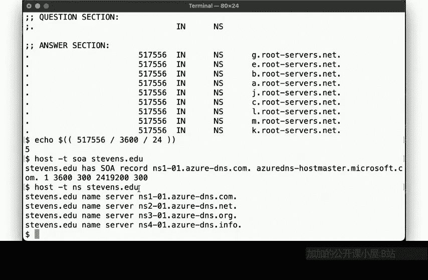
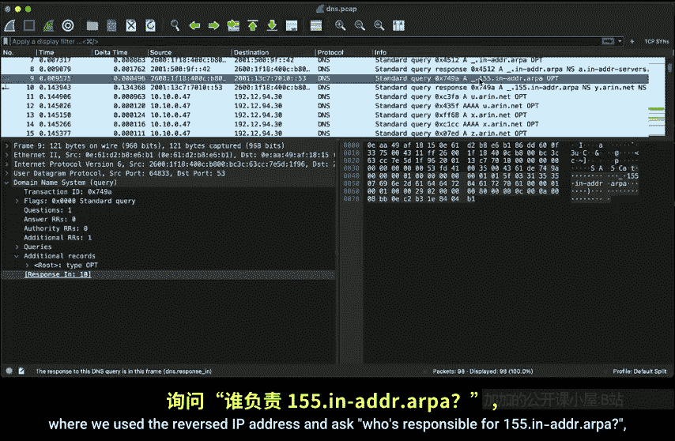
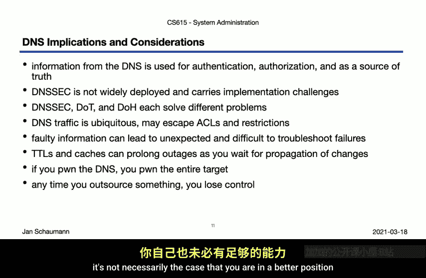

# 计算机系统管理：07-3：域名系统（第三部分）🎯

在本节课中，我们将完成对域名系统（DNS）的讨论。我们将探讨DNS的根服务器、资源记录、反向查询以及DNS安全扩展（DNSSEC）等核心概念。虽然DNS是一个庞大的主题，无法在短时间内详尽覆盖，但本节旨在提供一个足够全面的概述，使你能够基于对底层基础设施的理解，排查常见的DNS相关问题。

## 根服务器与引导过程🔍

上一节我们详细追踪了一个完整的DNS解析过程。我们提到查询始于根服务器，但我们当时“作弊”了，因为我们没有解释如何知道根服务器的位置。本节中，我们来看看这个初始的“魔法”步骤是如何实现的。

根服务器本质上也是权威名称服务器，只不过它负责的区（zone）是整个域名空间的根。因此，我们可以像查询其他域名一样，通过DNS查询根服务器本身的信息。

以下是使用 `dig` 工具查询根服务器NS记录的示例：
```bash
dig NS .
```
查询结果会返回13条NS记录，对应从 `a.root-servers.net` 到 `m.root-servers.net` 的根服务器。同时，响应中还包含了这些服务器的IP地址（包括IPv4和IPv6）。选择13这个数字，是因为它恰好能容纳在一个512字节的标准UDP数据包内。

这引出了一个“先有鸡还是先有蛋”的问题：为了查询根服务器的信息，我们首先需要知道根服务器是谁。因此，每个新部署的名称服务器都需要一个初始的引导文件来获取根服务器信息。

在BIND（一个常用的DNS软件）系统中，这个文件通常是 `namedb.root` 或 `root.hints`。该文件包含了所有根服务器的NS和A记录。服务器启动时会读取此文件，然后立即通过DNS重新查询根服务器信息并缓存，从而可能覆盖文件中的旧信息。这个文件可以从互联网（如InterNIC）获取，其内容更新并不频繁。

## 根服务器的分布与任播🌐

只有13台服务器作为整个互联网DNS的基石，这听起来似乎很脆弱。但实际上，“13个根服务器”指的是13个根服务器管理机构（从A到M），每个机构都通过**任播**技术在全球部署了数十甚至数百台服务器实例。

*   **管理机构**：这13个根服务器由12个独立的国际组织运营，以确保没有任何单一国家能完全控制域名空间。
*   **任播技术**：任播允许多台服务器使用相同的IP地址。网络路由协议会将查询引导到拓扑结构上“最近”的服务器实例。这既提供了冗余，也降低了查询延迟。
*   **全球分布**：你可以在 `root-servers.org` 上看到根服务器实例的全球分布图。它们大多部署在网络枢纽和互联网交换中心，以确保良好的连通性。

例如，你可以通过查询特定记录来确定你正在与哪个地理位置的F根服务器实例通信：
```bash
dig +short TXT hostname.bind @f.root-servers.net chaos
```
此查询可能会返回包含机场代码（如`DFW`）的文本记录，指示该服务器实例的大致地理位置。

## DNS资源记录详解📝

DNS是一个分布式数据库，它通过不同类型的**资源记录**来存储信息。每条记录都有一个**生存时间**，它规定了缓存服务器可以保存该记录的时间长度。

以下是一些关键的资源记录类型：



*   **A / AAAA记录**：将主机名映射到IPv4或IPv6地址。
*   **NS记录**：指定负责某个区的权威名称服务器。
*   **SOA记录**：起始授权记录。它定义了区的基本信息，包括主名称服务器、管理员邮箱、序列号以及辅助服务器同步参数。
    *   **公式示例**：`example.com. IN SOA ns1.example.com. admin.example.com. ( 2023123001 3600 1800 604800 86400 )`
*   **CNAME记录**：规范名称记录，用于将一个域名别名指向另一个域名。
*   **MX记录**：邮件交换记录，指定负责接收该域邮件的服务器。
*   **TXT记录**：文本记录，可用于存放任意文本信息，常被用于域名所有权验证、邮件安全策略等。
*   **CAA记录**：证书颁发机构授权记录，指定哪些CA可以为此域名颁发SSL/TLS证书。
*   **RRSIG记录**：资源记录签名，用于DNSSEC，对一组资源记录进行数字签名。
*   **DS记录**：委托签名者记录，用于DNSSEC，在父区中注册子区密钥的哈希值，建立信任链。

值得注意的是，一个域的权威名称服务器不一定位于该域下。例如，DNS服务提供商经常将名称服务器分布在多个顶级域中，以增强冗余性。

## 反向DNS查询与PTR记录🔄

除了将主机名解析为IP地址，DNS还能进行反向查询。反向查询使用特殊的 `in-addr.arpa`（IPv4）或 `ip6.arpa`（IPv6）域，并查询 **PTR记录**。



其工作原理是将IP地址的字节顺序反转，然后追加到相应的 `.arpa` 域后进行查询。例如，查询IP地址 `155.246.x.x` 的反向记录，实际上是查询 `x.246.155.in-addr.arpa.` 的PTR记录。

反向查询的授权委托与IP地址块的分配保持一致。互联网号码分配机构将 `155.0.0.0/8` 这个IP块分配给了某个组织（例如ARIN），那么ARIN就负责 `155.in-addr.arpa` 区。如果ARIN将 `155.246.0.0/16` 这个子块分配给了史蒂文斯理工学院，那么 `246.155.in-addr.arpa` 这个区就会被委托给史蒂文斯理工学院管理，由他们自行添加PTR记录。

## DNS安全与挑战🔒

我们捕获的DNS流量显示，查询和响应默认是通过不加密的UDP（或TCP）协议传输的。这意味着路径上的攻击者可能篡改或伪造响应。为了提供数据来源验证和完整性保护，**DNSSEC** 被开发出来。

在启用DNSSEC的查询中，响应不仅包含答案，还包含 **RRSIG记录**（数字签名）和 **DS记录**（用于建立信任链）。验证签名需要获取对应的公钥（DNSKEY记录），而该公钥本身又由其父区的密钥签名，如此层层递进，直至根区的密钥（这是一个预置的信任锚）。

尽管DNSSEC至关重要，但其部署并不广泛，部分原因是配置复杂且一旦出错可能导致整个域名无法访问。

此外，DNS还面临其他安全与隐私挑战：
*   **DNS over TLS / DNS over HTTPS**：这些协议旨在加密DNS查询内容，防止窃听和中间人攻击，解决的是与DNSSEC不同的威胁模型（隐私 vs. 完整性）。
*   **数据泄露**：DNS查询本身可能被用于隐蔽的数据外泄通道。
*   **配置风险**：DNS配置错误可能导致服务中断，且由于缓存和TTL的存在，排查问题可能比较棘手。正如一个经验法则所说：“当一切都很混乱且毫无头绪时，问题很可能出在DNS上。”
*   **控制权**：DNS是互联网基础设施的基石。如果攻击者控制了你的DNS，他们几乎可以重定向你的所有流量，危害极大。因此，无论是自行管理还是外包给第三方提供商，都需要极其谨慎地对待DNS服务的安全性和可靠性。

## 总结📚

本节课中，我们一起深入探讨了域名系统的几个核心部分。



我们首先解决了根服务器的“引导”问题，了解了初始 `hints` 文件的作用。接着，我们揭示了根服务器并非只有13台物理机器，而是通过任播技术实现的全球分布式网络。然后，我们系统性地回顾了各种DNS资源记录及其用途，特别是SOA记录的构成。我们还剖析了反向DNS查询的原理，理解了其如何通过反转IP地址并与 `.arpa` 域结合来实现。最后，我们触及了DNS安全的核心——DNSSEC，了解了它如何通过数字签名链来验证响应真实性，同时也认识到其部署的挑战。我们还简要提到了DoT/DoH等加密DNS协议以及其他安全考量。

DNS是一个深邃且关键的系统，支撑着互联网的运转。鼓励你使用 `dig`、`nslookup` 等工具，并结合 Wireshark 分析网络抓包，亲自探索不同域名的解析过程，这将极大地加深你的理解。