# 计算机系统管理：CS615：Week 08, Segment 3 - 电子邮件，第三部分 - 垃圾邮件防护机制 🔐

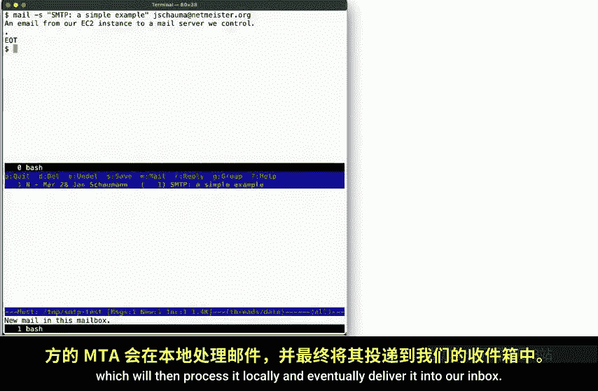

在本节课中，我们将深入学习电子邮件系统中的垃圾邮件问题及其防护机制。我们将探讨为何垃圾邮件如此泛滥，并详细介绍几种关键的防护技术，包括SPF、DKIM和DMARC。通过理解这些机制，你将能够更好地配置和管理邮件服务器，以抵御垃圾邮件的侵扰。

## 概述：垃圾邮件问题与基础协议

上一节我们介绍了使用TLS为SMTP提供传输层加密。这虽然提供了安全性，但并未解决电子邮件的所有问题。本节中，我们将重点探讨一个突出的问题：垃圾邮件。

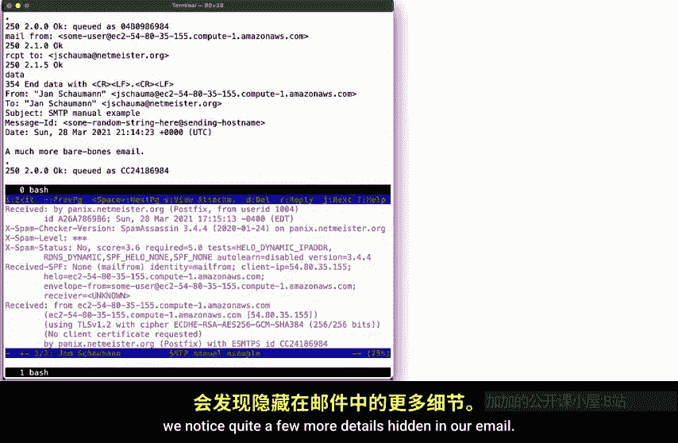

正如我们在第一封关于电子邮件的视频中提到的，垃圾邮件占所有发送邮件的70%甚至更多。因此，我们需要了解为何批量发送未经请求的邮件如此容易，以及我们有哪些防御机制。

## 电子邮件结构剖析

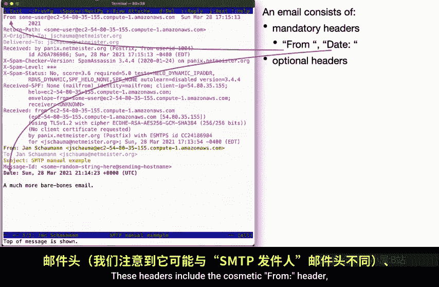

首先，让我们剖析一封电子邮件的基本结构。一封邮件不仅仅包含我们看到的正文内容。

以下是电子邮件的主要组成部分：

*   **必需头部**： 这些头部是邮件投递所必需的。缺少它们，邮件将无法被投递。这包括 `From` 头部（也称为SMTP `MAIL FROM` 命令）、收件人地址以及 `Date` 头部。
*   **可选头部**： 邮件协议本身不要求这些头部，但正如我们将看到的，缺少它们可能导致其他系统将邮件归类为垃圾邮件。因为来自实际友好协作邮件系统的邮件通常包含这些头部。这些头部包括：
    *   **显示用的 `From` 头部**： 注意，它可以与SMTP `MAIL FROM` 头部不同。
    *   **`To` 头部**： 它也可以与SMTP `RCPT TO` 命令中的收件人不同。
    *   **`Subject` 头部**等等。
*   **邮件正文**： 我们通常认为正文是纯文本，但不幸的是，现在也常是HTML。正文内容独立于SMTP协议，甚至可以包含附件和多部分消息，这些由其他标准定义。

## 中继限制与开放中继

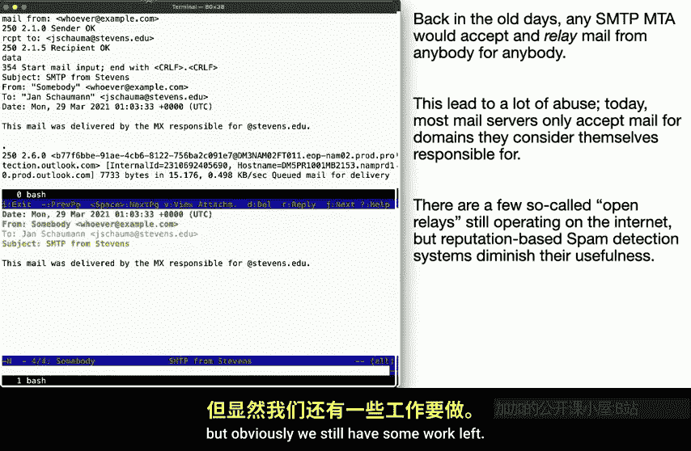

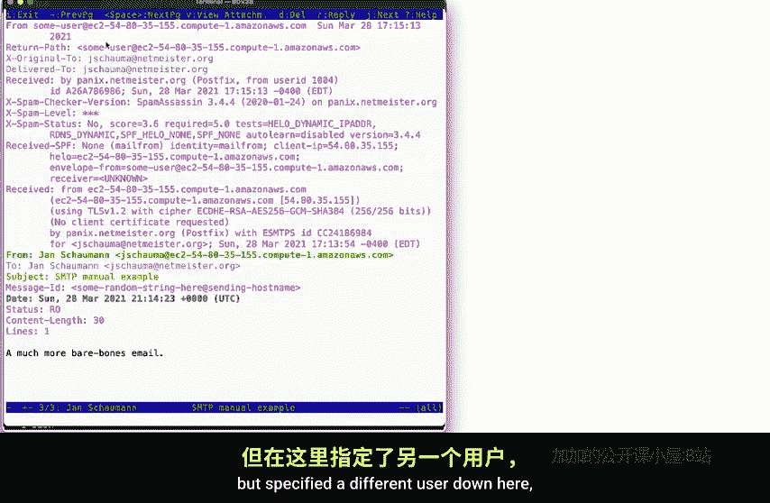

现在，我们来看看垃圾邮件防护的第一道防线：限制邮件中继。

早期互联网上，邮件服务器数量有限，任何邮件服务器都乐于接受并转发给其他邮件服务器的邮件。但这意味着你可以滥用其他邮件服务器，通过它向其他系统发送邮件。因此，随着时间的推移，邮件服务器开始规定：只允许用户提交发送给其自身用户的邮件。这就是所谓的“不中继邮件”。

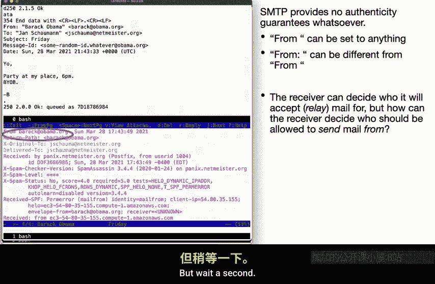

如今，互联网上仍然存在一些所谓的“开放中继”，但它们经常被垃圾邮件发送者滥用，以隐藏自己的来源，从而最终被列入各种互联网黑名单。

为了向特定域发送电子邮件，你必须与该域负责的邮件服务器通信，这可以通过查询该域的MX DNS记录来找到。

## 发送方策略框架

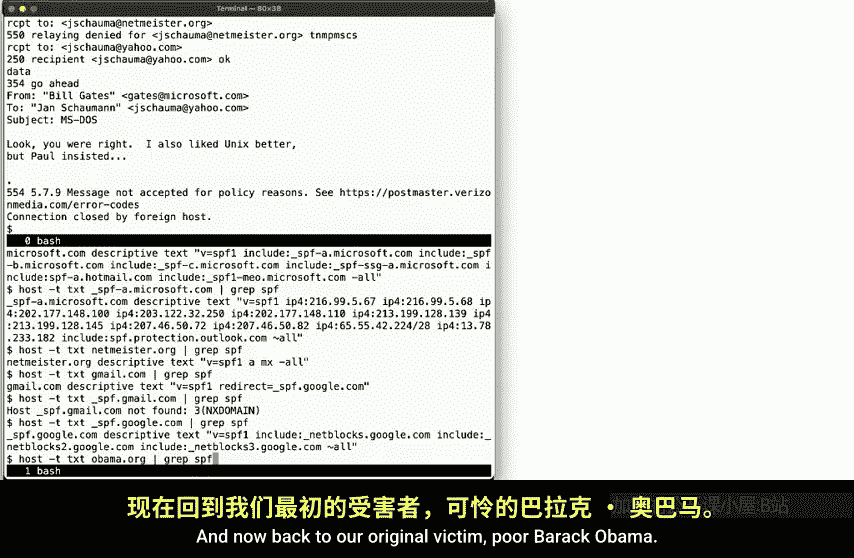

SMTP不提供任何真实性保证。如果你能向我发送电子邮件，你可以假装自己是任何人。`SMTP MAIL FROM` 命令可以设置为任何内容，甚至不必与邮件中显示的 `From` 头部一致。

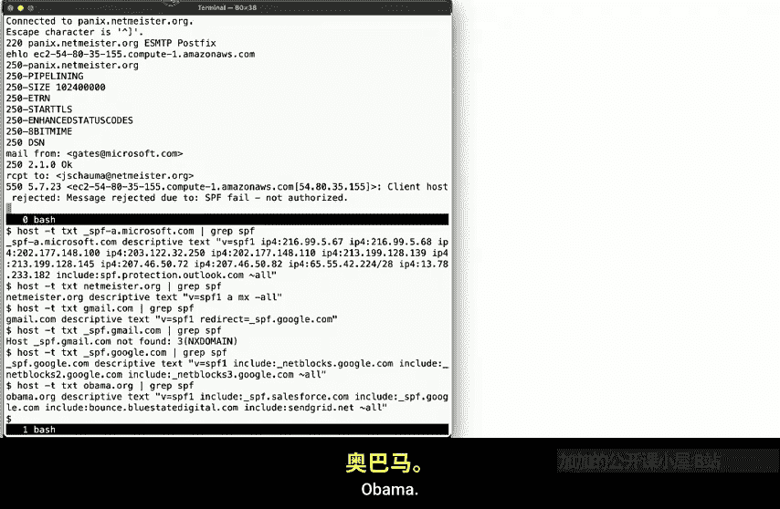

那么，接收方服务器如何知道连接它的系统是否有权代表其声称的域发送邮件呢？这引出了**发送方策略框架**。

SPF允许域所有者指定哪些系统被允许代表其域发送电子邮件。这是通过在域的DNS中发布一条TXT记录来实现的。

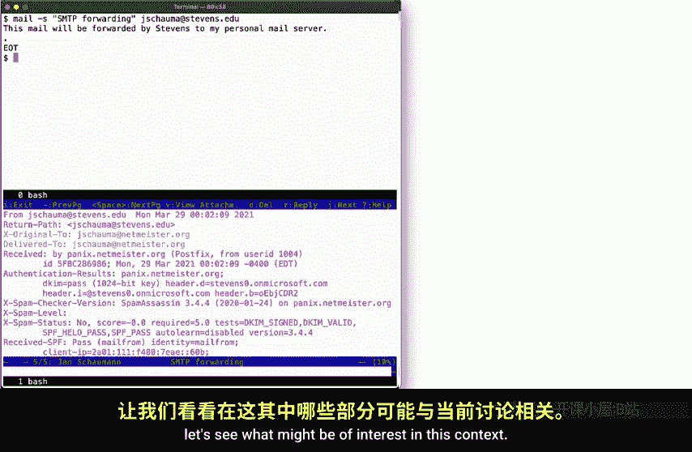

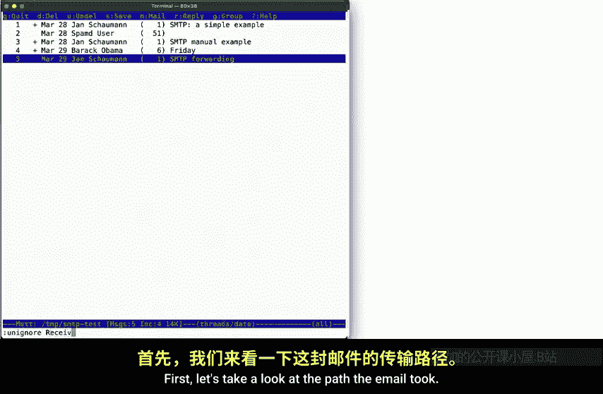

例如，一个SPF记录可能如下所示：
```
v=spf1 include:_spf.google.com ~all
```
这条记录表示允许 `_spf.google.com` 包含的IP地址发送邮件，而其他所有来源则标记为“软失败”。

SPF检查发生在接收邮件服务器接受邮件的早期阶段。如果SPF检查失败（硬失败），服务器可以立即拒绝该邮件。如果是软失败，服务器可能会接受邮件，但会在邮件头部添加警告信息，供后续处理系统参考。

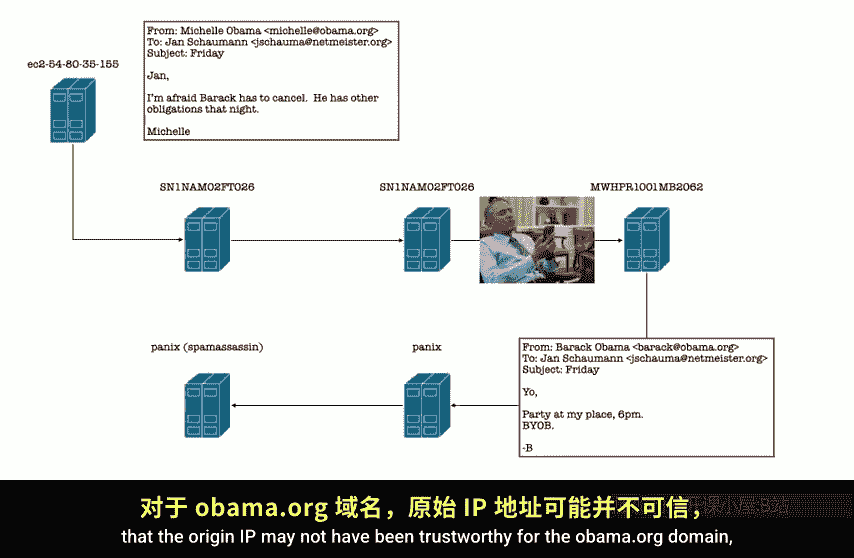

## 域名密钥识别邮件

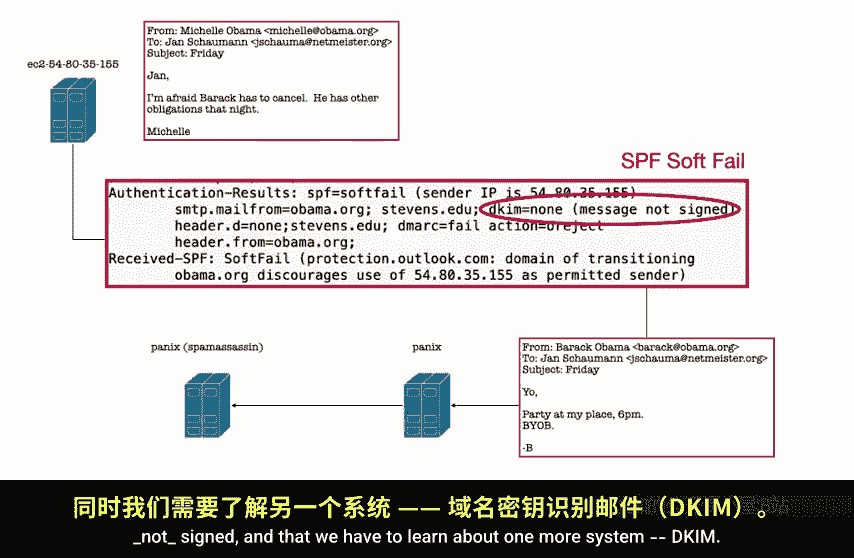

SPF解决了IP授权问题，但邮件在传输过程中可能被篡改。为了确保邮件的完整性和真实性，我们引入了**域名密钥识别邮件**。

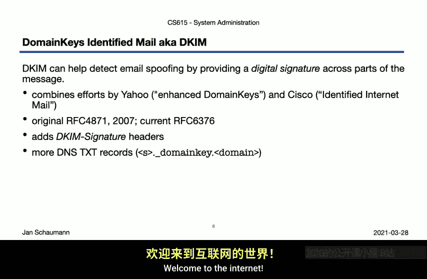

DKIM通过为邮件部分内容（如特定头部和正文）添加数字签名来工作。签名信息被添加到一个新的邮件头部 `DKIM-Signature` 中。

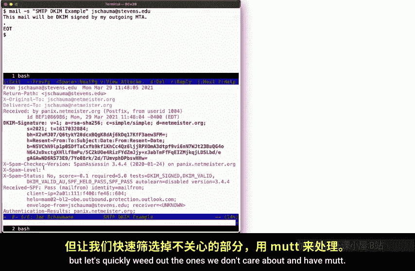

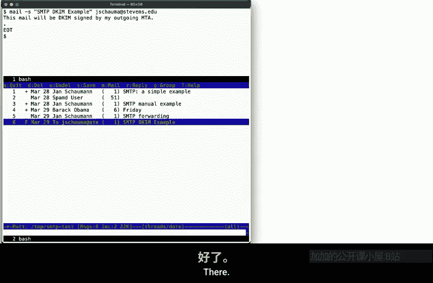

DKIM签名头部包含以下关键信息：
*   `d=`： 签名所代表的域名。
*   `s=`： 选择器，允许使用多个密钥对。
*   `h=`： 被签名的头部字段列表。
*   `bh=`： 邮件正文的哈希值。
*   `b=`： 实际的数字签名。

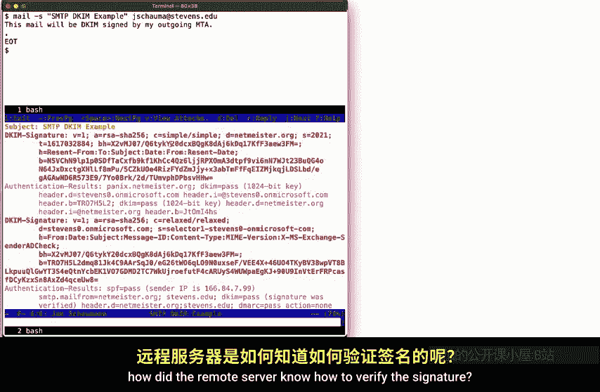

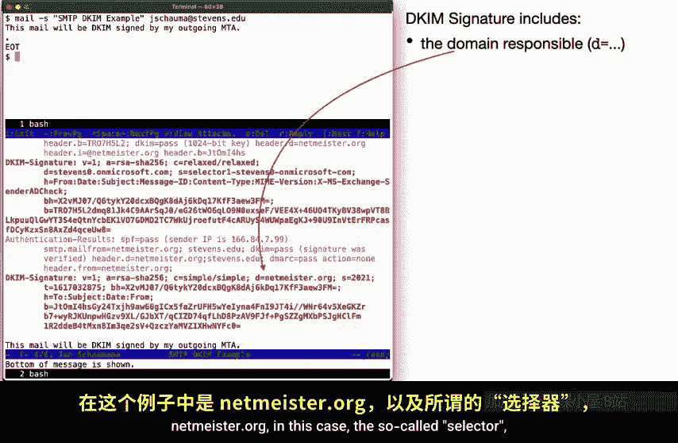

接收方服务器通过查询DNS来获取验证签名所需的公钥。查询的格式类似于 `{selector}._domainkey.{domain}` 的TXT记录。

## 基于域的消息认证、报告和一致性

我们有了SPF和DKIM，但接收方服务器在发现不匹配时应该怎么做呢？过于严格地拒绝邮件可能导致误拒合法邮件，这比误收垃圾邮件更令人不满。

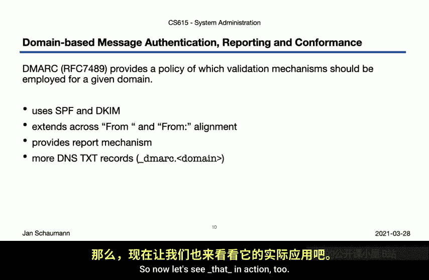

为了解决这个问题，我们引入了**基于域的消息认证、报告和一致性**。

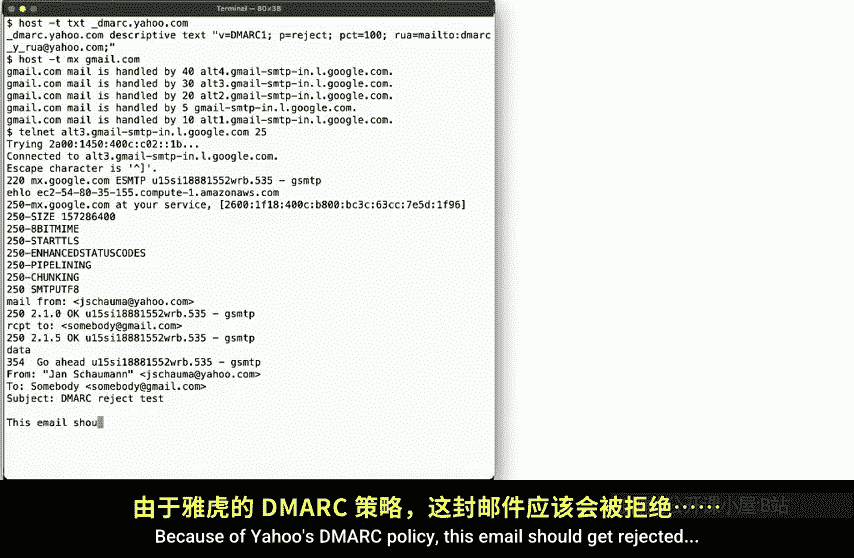

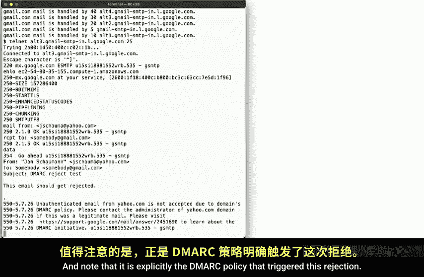

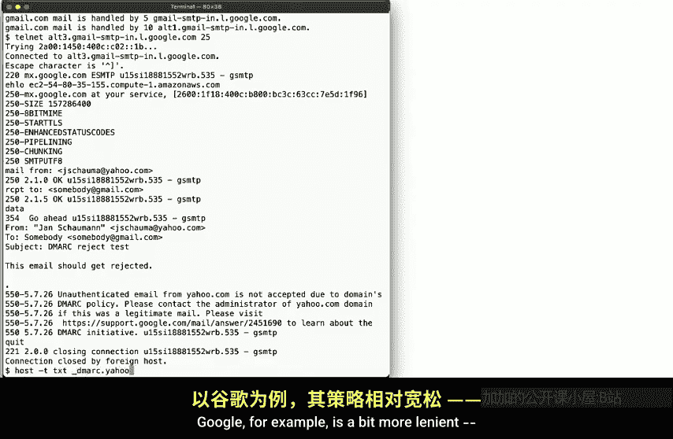

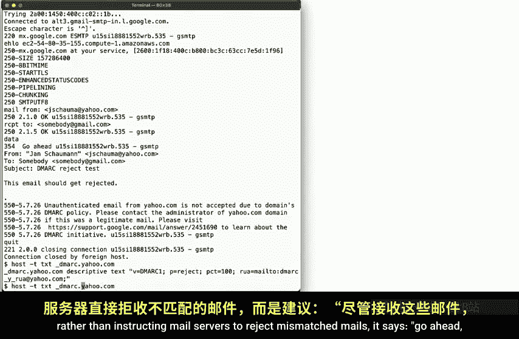

DMARC结合了SPF和DKIM的使用，并检查SMTP `MAIL FROM` 与邮件 `From` 头部是否对齐。更重要的是，它定义了当接收方遇到验证失败时应采取的策略，并通过DNS告知世界。

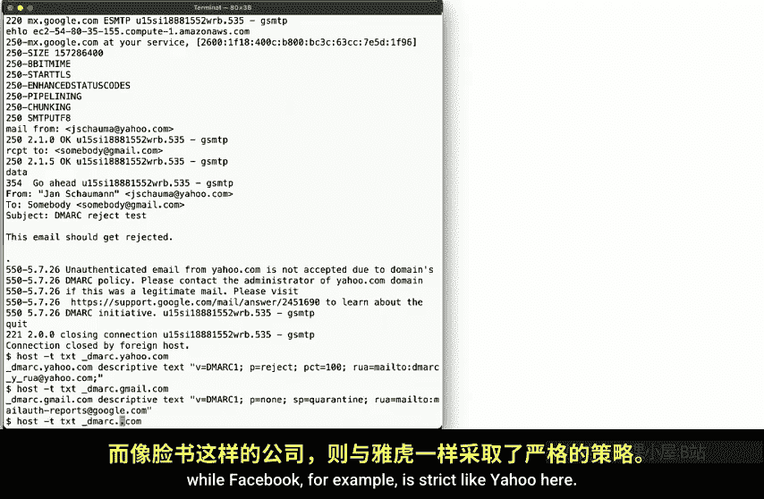

一个DMARC策略DNS记录示例如下：
```
v=DMARC1; p=reject; rua=mailto:dmarc-reports@example.com
```
这条记录表示策略是拒绝（`p=reject`）未通过验证的邮件，并将聚合报告发送到指定邮箱（`rua`）。

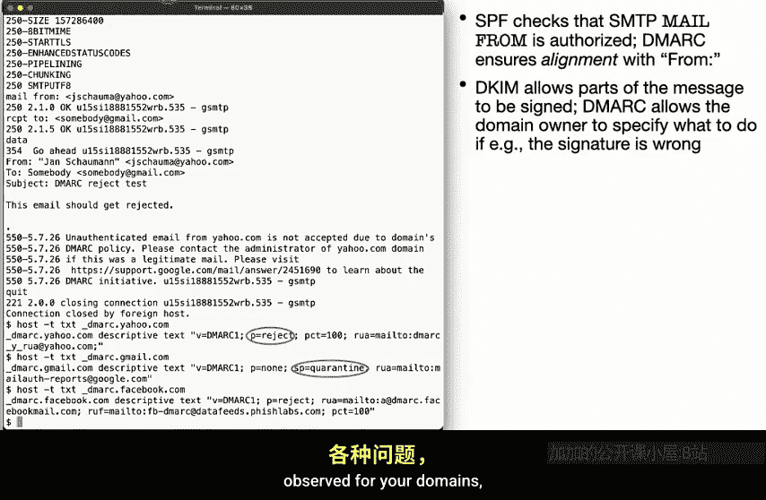

DMARC策略可以是：
*   `none`： 不采取特殊操作，仅用于监测。
*   `quarantine`： 将邮件标记为可疑并放入隔离区。
*   `reject`： 拒绝接收该邮件。

## 总结与扩展思考

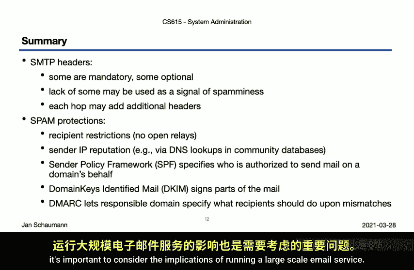

本节课我们一起学习了电子邮件垃圾邮件防护的核心机制。

我们了解到，由于SMTP协议简单且缺乏内置认证，伪造邮件很容易。因此，我们需要一系列防护措施：
1.  **限制中继**： 只允许向自己负责的域发送邮件。
2.  **发送方策略框架**： 定义谁可以代表你的域发送邮件。
3.  **域名密钥识别邮件**： 对邮件进行签名，确保其真实性和完整性。
4.  **基于域的消息认证、报告和一致性**： 告知接收方如何处理验证失败的邮件，并接收报告。

这些机制比我们最初谈论简单邮件传输协议时要复杂得多，但这还不是故事的全部。例如，考虑邮件列表处理和重新分发邮件时对DKIM签名的影响。运行大规模电子邮件服务还需要考虑性能、日志记录、隐私（尤其是使用第三方服务时）以及区分垃圾邮件与合法批量邮件（如业务通讯）等复杂问题。

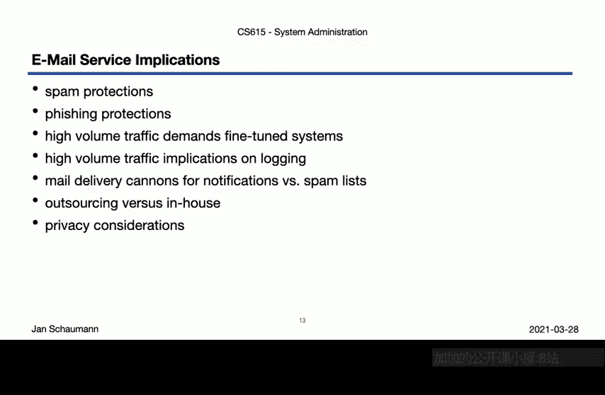

理解这些材料的最佳方式，仍然是亲自尝试视频中的命令和示例。查看你收到邮件的头部，尝试伪造一些邮件并观察哪些防护机制生效，你一定会发现一些有趣的角度。