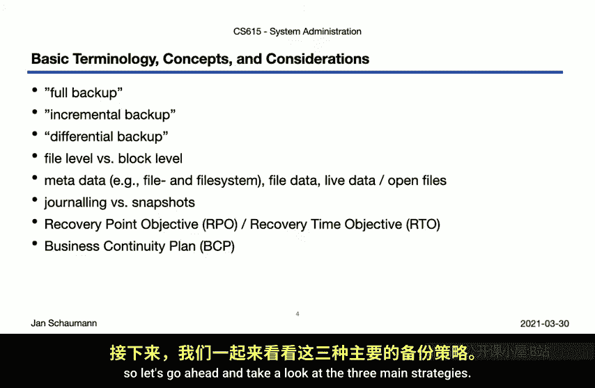
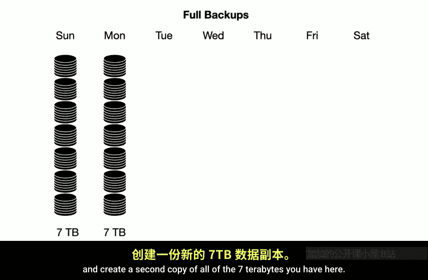
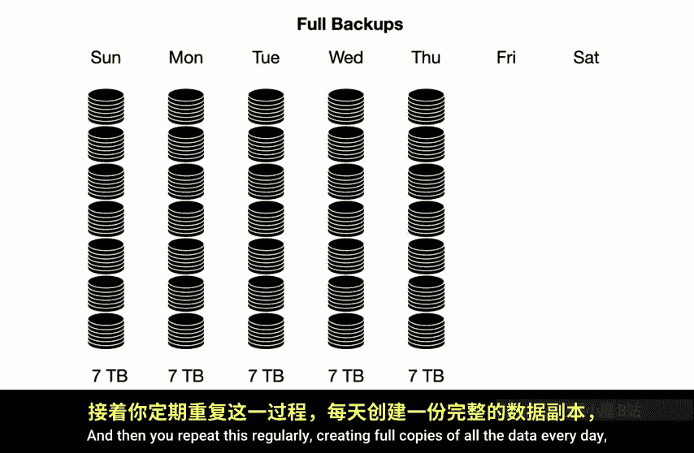
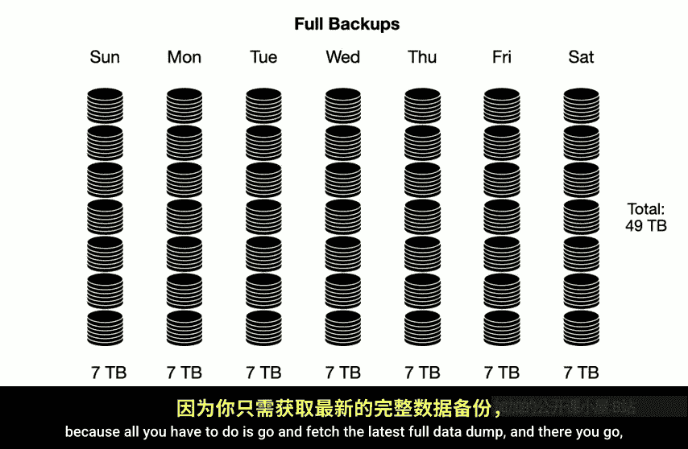
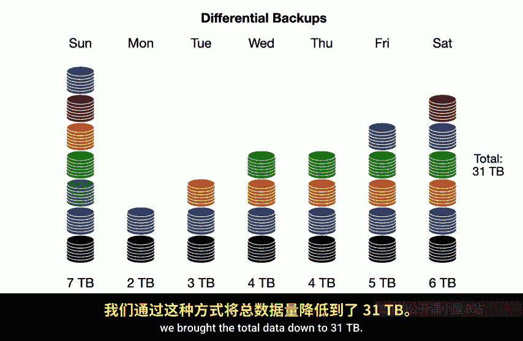
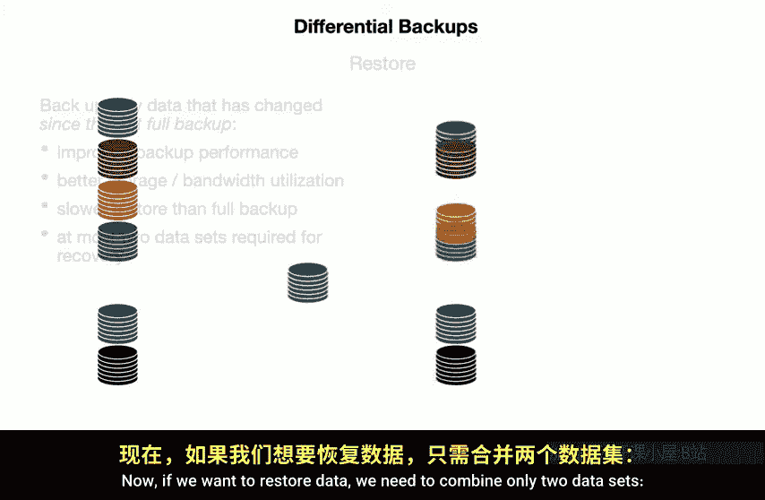
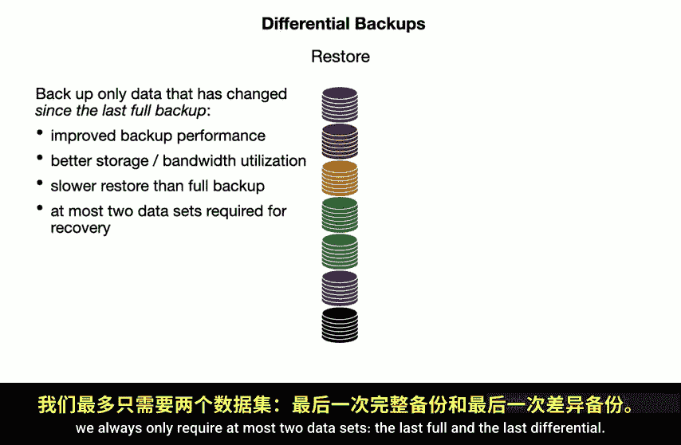
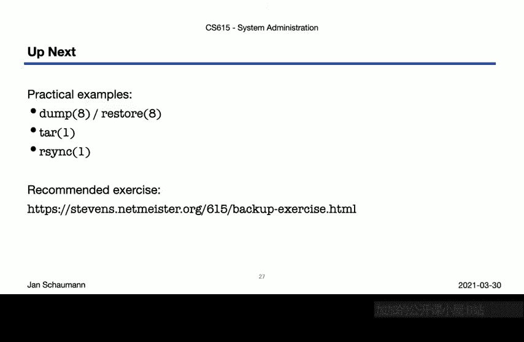

# 计算机系统管理：09：备份（第一部分）💾

在本节课中，我们将要学习系统管理中一个至关重要但常被忽视的主题：数据备份。我们将探讨备份的核心概念、不同策略及其背后的权衡，并理解为什么备份的真正价值在于恢复数据的能力。

---

## 概述 📋

备份是确保数据安全、防止意外丢失的关键手段。然而，许多人只关注备份操作本身，而忘记了其最终目的是为了能够**恢复数据**。本节将介绍备份的基本术语、三种主要策略（完全备份、差异备份、增量备份）以及选择备份存储介质时需要考虑的因素。我们还将讨论恢复点目标（RPO）和恢复时间目标（RTO）等业务概念。

---

## 备份的核心概念与术语 🔑

在深入探讨之前，我们需要明确一些基本术语。理解这些概念是制定有效备份策略的基础。

### 备份类型

以下是三种主要的备份类型：

1.  **完全备份**：创建所有数据的完整副本。这是最直接但最耗资源的备份方式。
    *   **公式表示**：`备份数据量 = 总数据量`

2.  **增量备份**：仅备份自**上一次备份（无论何种类型）** 以来发生变化的数据。
    *   **公式表示**：`备份数据量 = 自上次备份以来的数据变化量`

3.  **差异备份**：备份自**上一次完全备份**以来发生变化的所有数据。
    *   **公式表示**：`备份数据量 = 自上次完全备份以来的累计数据变化量`

### 恢复目标

在业务连续性计划中，有两个关键指标：

*   **恢复点目标**：指系统能够容忍的数据丢失时间窗口。例如，如果每天午夜备份一次，RPO就是24小时。
*   **恢复时间目标**：指在发生故障后，恢复系统或数据到可运行状态所需的时间。

---

## 三种备份策略详解 📊

上一节我们介绍了备份的基本类型，本节中我们来看看这三种策略在实际操作中的具体表现、数据量以及恢复过程的差异。

### 策略一：完全备份

这是最简单的策略。我们定期创建所有数据的完整副本。

**示例流程**：
*   周日：备份全部 7 TB 数据。
*   周一：再次备份全部 7 TB 数据。
*   如此每日重复。

一周后，总备份数据量为 **49 TB**。

**恢复过程**：
恢复非常简单，只需获取**最近一次**的完整备份副本即可。

**优缺点**：
*   **优点**：恢复过程最快、最直接。
*   **缺点**：备份速度慢，存储空间消耗巨大。

### 策略二：差异备份

此策略在初始完全备份后，后续每次备份都复制自上次完全备份以来所有变更的数据。

**示例流程**：
*   周日：完全备份 7 TB。
*   周一：备份自周日以来变更的 2 TB 数据（假设）。
*   周二：备份自周日以来累计变更的（2 TB + 新增的 1 TB）= 3 TB 数据。
*   每日持续累积变更数据，直到下一次完全备份。

一周后，总备份数据量可能降至 **31 TB**。

**恢复过程**：
恢复需要两个数据集：**最近的完全备份** + **最近的差异备份**。

**优缺点**：
*   **优点**：相比完全备份，节省了备份时间和存储空间。
*   **缺点**：恢复比完全备份稍慢，因为需要合并两个数据集。

### 策略三：增量备份

此策略在初始完全备份后，后续每次只备份自**上一次备份**以来变更的数据。

**示例流程**：
*   周日：完全备份 7 TB。
*   周一：备份自周日以来变更的 2 TB。
*   周二：仅备份自周一以来新变更的 1 TB（而非累计变更）。
*   周三无变更，则不备份。
*   如此继续，只备份真正新变化的数据块。

一周后，总备份数据量可能仅为 **13 TB**。

**恢复过程**：
恢复过程最复杂。需要从**初始的完全备份**开始，然后按顺序逐一应用**所有的增量备份**。

**优缺点**：
*   **优点**：备份速度最快，存储空间占用最小。
*   **缺点**：恢复过程最慢、最复杂，且任何一环增量备份损坏都可能导致整个恢复链失败。

---

## 备份存储介质的选择 💽

选择备份目的地与选择备份策略同样重要。不同的存储介质具有不同的特性，适用于不同的场景。

以下是常见的备份存储介质及其相关考虑因素：

*   **磁带**：传统介质，在企业级长期归档中仍占主导地位，通常使用大型自动化磁带库。
*   **硬盘**：可通过存储区域网络（SAN）等方式用于备份，性能较好。
*   **固态硬盘**：提供更高的IO性能，但成本也更高。
*   **云存储**：提供可扩展性、异地性和按需付费模式。
*   **一次性写入介质**：如DVD-R或企业级WORM存储，可防止数据被篡改，适用于合规性要求高的场景。

**选择介质时需考虑的因素**：
*   **I/O性能**：备份通常涉及大数据块的顺序写入，而非随机读写。
*   **可重用性与寿命**：介质需要能长期可靠地保存数据。
*   **成本**：包括介质本身的成本和长期维护的成本。
*   **附加功能**：是否支持内置压缩、加密或重复数据删除。

---

## 备份的目的与特殊考虑 🎯

备份并非只有一个单一的目的。根据不同的目标，我们需要采取不同的策略。

### 长期归档 vs. 快速恢复

*   **长期归档**：为了满足法规遵从或历史记录保存（如政府文件、报纸档案），可能需要将数据保存数十年。这要求使用稳定的介质、完整的备份（而非增量），并妥善保管解密密钥和读取设备（考虑技术过时问题）。
*   **快速恢复**：针对日常的数据丢失（如误删除、硬盘故障），要求恢复过程迅速。这通常与上述的日常备份策略相关。

### 针对不同故障场景的恢复

数据丢失的原因不同，恢复策略也应有所侧重：

*   **用户误操作/软件Bug**：通常需要**文件级**的细粒度恢复。
*   **硬件故障**：通常需要**整个系统**的恢复。
*   **安全漏洞**：系统可能已被破坏，需要从干净的备份中重建**整个系统**，且不能使用已被入侵的系统上的工具进行恢复。
*   **自然灾害**：这超出了本地备份的范畴，进入**灾难恢复**领域，要求数据在 geographically 分散的地点有副本。

---

## 最佳实践与重要原则 🛡️

在制定了备份策略后，还有一些通用的原则和必须执行的步骤来确保其有效性。

### 3-2-1 备份原则

一个广泛认可的最佳实践是 **3-2-1 原则**：
*   **3**：保存**3份**数据副本。
*   **2**：使用**两种**不同的存储介质。
*   **1**：将其中**1份**副本存放在异地。

### 验证备份的完整性

这是最关键却最常被忽略的一步。**无法恢复的备份毫无价值**。你必须定期：
1.  随机抽取备份数据进行恢复测试。
2.  验证恢复出的数据是否正确、可用。
3.  确保你拥有且熟悉执行恢复所需的工具和流程。

### 备份安全

备份软件本身需要访问所有数据，因此它也可能成为攻击目标。需注意：
*   备份数据可能包含恶意软件，恢复时可能重新引入系统。
*   从不信任的系统（如已被入侵的系统）上运行的恢复工具本身也可能是不可信的。

---

## 总结 📝

本节课中我们一起学习了数据备份的基础知识。我们明确了备份的终极目标是**恢复**。我们详细分析了完全备份、差异备份和增量备份三种策略的优缺点及适用场景。我们还探讨了如何根据备份目的（长期归档或快速恢复）和故障类型来选择策略和存储介质。最后，我们强调了遵循 **3-2-1 原则**和**定期验证备份**的极端重要性。

记住，备份就像保险：你希望永远用不上它，但拥有它让你高枕无忧。现在，是时候去检查一下你自己的备份是否真的可用了。

在下一个视频中，我们将更实际地探讨在文件级别进行备份的常用工具和技术。