# 计算机系统管理：09：备份实战 🛡️

在本节课中，我们将通过具体实例学习如何执行系统备份。我们将探讨几种不同的工具和方法，了解它们各自的优缺点，并学习如何从备份中恢复数据。

上一节我们介绍了备份的核心概念，如全量备份与增量备份的区别。本节中，我们来看看如何将这些概念付诸实践，使用具体的工具来创建和管理备份。

## 备份策略的实践考量

从灾难或系统性故障中恢复数据可能涉及复杂的操作。但即使是恢复单个文件，我们也需要注意一些细节，这些细节将定义我们的整体备份策略。

具体来说，我们需要为用户提供一些保证：被删除的文件应该能在给定的时间窗口内被恢复。

从纯粹的可用性角度来看，用户可能期望能够撤销更改。而像 `rm` 这样的 Unix 工具，其正常行为就是完全删除文件，而不是将其移动到特殊目录。因此，在文件系统层面没有内置的“撤销”功能。

因此，我们必须与用户协商，确定一个现实的**恢复点目标**。即，我们定义数据丢失的时间窗口，或者说我们备份的粒度。

例如，我们可以说我们执行夜间备份，这意味着我们平均只能恢复大约12小时前、最坏情况下24小时前的数据。

但数据一旦丢失，即使它在恢复点目标范围内，恢复过程通常也不是即时的。

这就是为什么我们必须定义**恢复时间目标**，即恢复文件所需的时间。

这包括人员可用性及其开销。例如，如果你需要填写支持工单来请求文件恢复，那么必须有人阅读该工单并有时间采取行动。

此外，如果磁带库当前正忙于将当前数据集备份到磁带，它可能无法立即恢复你的数据。在大型企业中，这通常不是问题，因为可能有多种访问备份的方式。但在较小的环境中，这可能是一个实际问题。

当然，检索数据本身也需要时间。如果你丢失了一个文件，但它在一个20TB的磁带备份上，你可能需要读取数百GB的数据才能找到你的文件。同样，如果你丢失了20TB的数据，恢复这些数据必然需要时间，这受到磁带性能和你恢复数据的目标设备的I/O速度的限制。

所有这些都使得恢复数据成为一个漫长而繁琐的过程。因此，如果能够设置备份系统以允许**自助服务恢复**，让任何用户都能自行连接并恢复其数据备份，那将更好。但这并不容易实现，尤其是在大规模环境中。不过，我们将在下一个视频中看到一些有助于实现这一目标的方法。

最后，值得一提的是备份也有一个意想不到的副作用：被删除的数据现在仍然在某个地方可用。在某些情况下，这可能是一个问题。有时当你删除数据时，你真的希望确保它已消失且无法恢复。

## 使用 `tar` 进行备份 📦

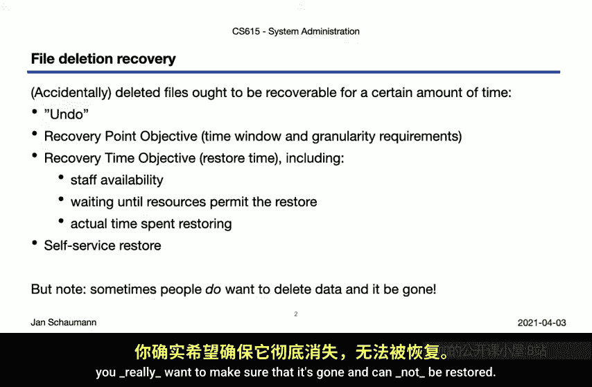

让我们看几个实际例子。我们将使用的工具之一是 `tar`，你在提交作业时已经经常使用它。

`tar` 是一个磁带归档器，是 Unix 工具之一，支持相当多的命令行选项，其中一些甚至不需要短横线。这部分原因使得 `tar` 常被引作 Unix 神秘巫术的例子，但它其实并没有那么复杂。`tar` 是一个古老的工具，在 Unix 早期，许多工具不需要短横线来指定选项。

`tar` 的整体使用可以归结为少数几个命令。

`tar` 是一个用于创建文件系统层次结构归档的工具，通常用于将其写入磁带，默认设备是 `/dev/rst0`。

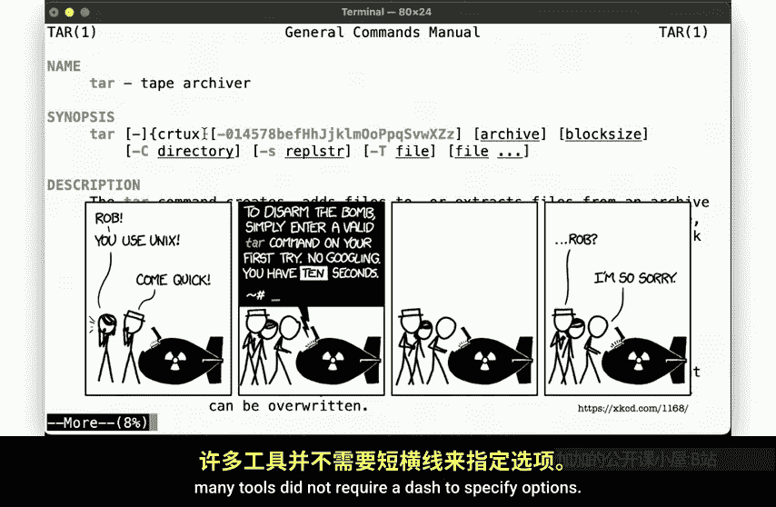

让我们看看如何使用 `tar` 进行备份。

以下是一个简单的双卷实例，连接了第二个卷。我们在其上创建一个新的文件系统，并将其挂载到 `/backup` 下。

现在，我们创建一个以当前日期时间戳命名的目录。

然后，我们可以使用 `tar` 备份我们的 `/usr/local` 目录，创建一个归档并将其写入文件系统。

现在，我们在额外的磁盘上有了副本。这很好。

但我们的备份磁盘仍然位于本地系统上。也就是说，我们只是在同一系统的另一个磁盘上创建了一个副本。

由于 `tar` 可以将数据写入标准输出，我们可以简单地将其通过管道传递给任何命令。因此，我们可以将数据写入远程系统。

当然，没有什么要求我们必须将数据写回文件系统。请记住，`tar` 旨在创建归档，即特定格式的文件。

因此，我们可以将数据直接写入块设备，而不是像上一个例子那样将其提取到文件系统中。为此，我们可以使用老朋友 `dd` 命令。

现在，在远程备份目标上检查，我们可以从块设备读回数据。是的，我们确实将归档写到了这里的磁盘上。

现在，回到我们的原始服务器。如果我们不小心从这个目录删除了数据，我们可以从远程系统上的备份中恢复它。

通过使用 `tar` 并将数据写入管道，我们还可以获得额外的功能。例如，我们可以在将数据写入远程站点之前压缩它。

我们还可以添加其他数据转换。例如，我们可以在发送数据之前对其进行加密，这里使用 `openssl enc` 命令进行说明。

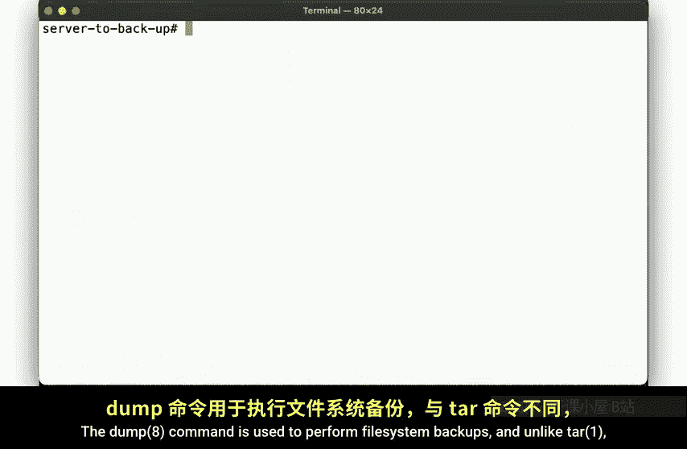

现在，要恢复数据，我们只需反转步骤：先解密，然后解压缩，最后写入文件系统。这非常有用，很好地说明了 `tar` 的灵活性——它不仅仅是一个提交作业的工具。

## 使用 `dump` 进行备份 💾

为了创建备份，我们还有其他工具。其中最古老的工具之一是 `dump` 命令。

`dump` 命令用于执行文件系统备份，与 `tar` 不同，它有一些逻辑来确定应该备份哪些内容。

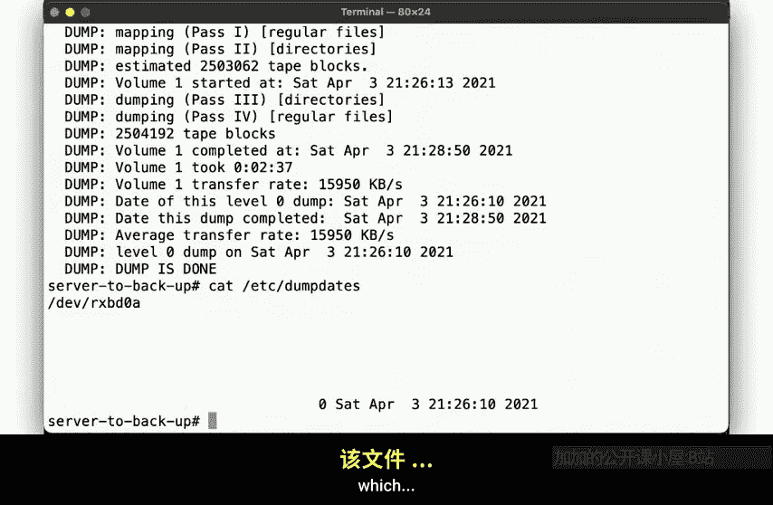

`dump` 还区分了我们之前讨论过的**全量**或**0级**备份和**增量**备份，这意味着它可以用于仅备份自上次备份以来已更改的数据。

这次，我们将数据写入远程主机文件系统上的一个文件，通过将 `dump` 命令的输出通过管道传递给 `ssh` 和 `cat`。

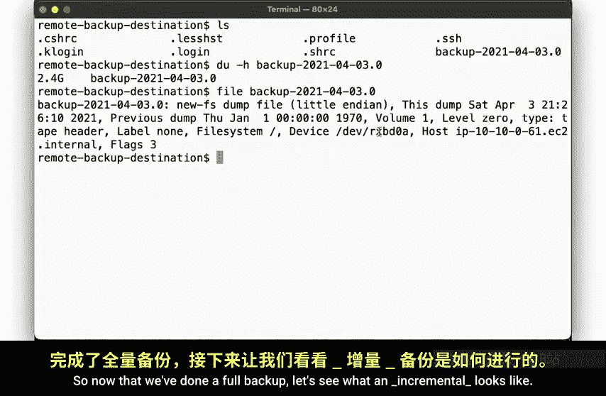

`dump` 命令将需要几分钟来确定需要备份哪些文件（在本次迭代中，所有文件都在执行0级或全量备份），然后将数据通过网络写入远程文件。

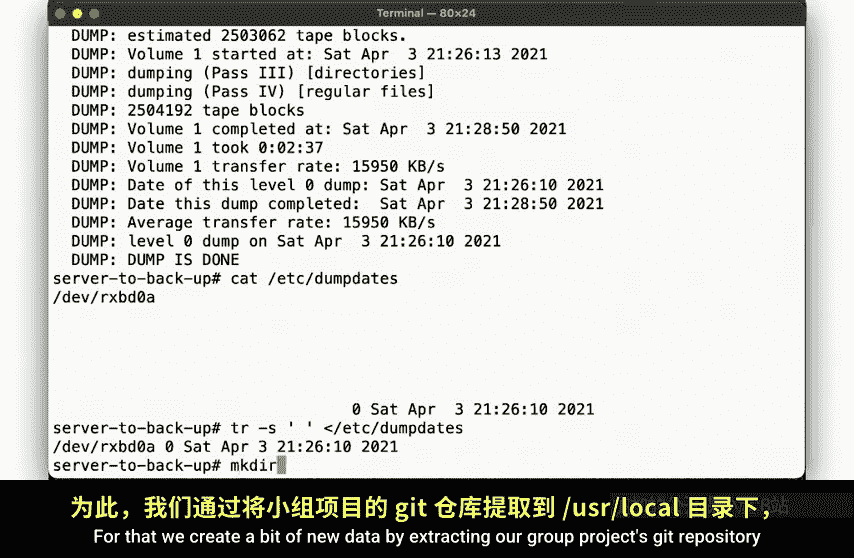

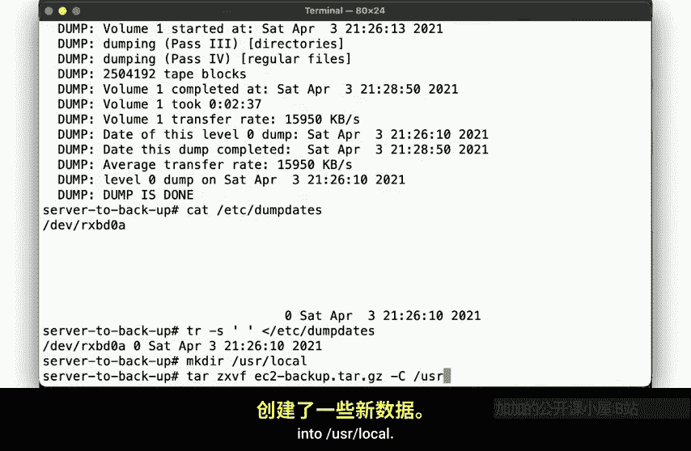

`dump` 会通过写入 `/etc/dumpdates` 来记录它执行了哪个级别的备份，该文件指定了磁盘、备份级别和日期。

在远程系统上，我们找到了完整的0级备份文件，它告诉我们备份的写入时间、上次执行全量备份的时间（这里是纪元时间，因为我们从未执行过备份）以及其他一些信息。

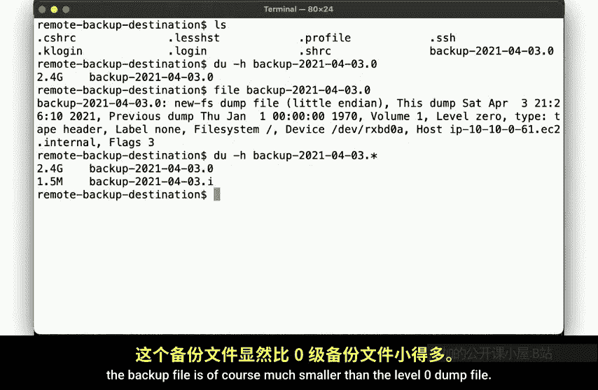

现在我们已经完成了全量备份，让我们看看增量备份是什么样子。

为此，我们通过将我们的组项目 Git 仓库提取到 `/usr/local` 来创建一些新数据。

现在，再次运行 `dump`，这次作为增量备份，并将数据写入第二个文件。

请注意，我们的备份完成速度比之前快得多，因为它只需要复制自上次全量备份以来已更改的文件。在远程目标上，备份文件当然比0级 `dump` 文件小得多。

在我们的服务器上，`/etc/dumpdates` 已更新以反映增量备份。

现在，让我们通过删除一些文件来模拟数据丢失。这些文件消失了。现在怎么办？让我们从上次备份中恢复数据。我们使用 `restore` 命令，要求它从上次增量备份中提取 `/usr/local` 的文件。

命令告诉我们数据来自何时，然后将其写入我们的文件系统。数据回来了。

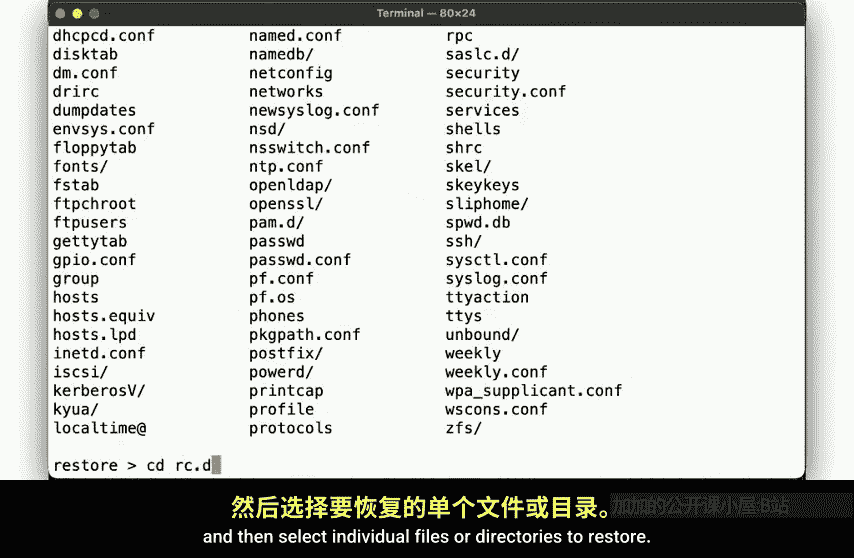

但我们也删除了 `/etc/rc.d` 目录。让我们尝试恢复它，但没有成功。`/etc/rc.d` 在相关备份中未找到，这并不奇怪，因为增量备份只复制了自上次0级备份以来已更改的文件，而 `/etc/rc.d` 没有更改。所以让我们查看全量备份。

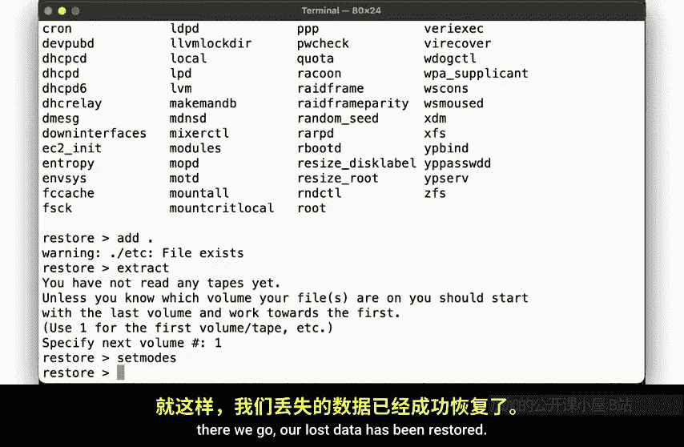

为此，我们将文件复制到这里，以便可以交互式地检查它。

现在，我们可以在交互模式下运行 `restore`，这会让我们进入一个类似 shell 的提示符。可以像这样显示备份的信息，因为 `restore` 命令为我们提供了一些简单的命令来与备份交互。

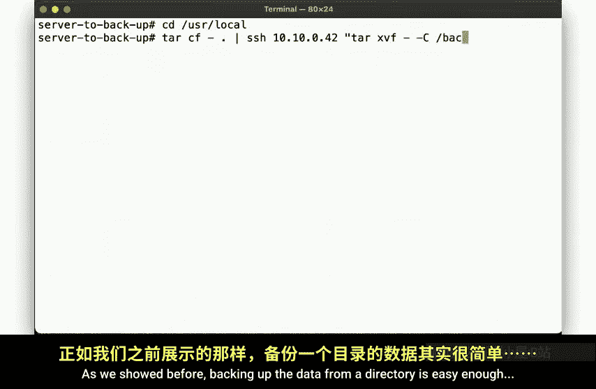

我们可以使用 `ls` 命令列出备份的内容，进入目录并检查其内容，然后选择要恢复的单个文件或目录。

然后，我们可以提取数据，设置权限。我们的数据已经恢复。

因此，`dump` 命令原生支持增量备份，而 `restore` 允许选择要恢复的数据。这与我们之前使用 `tar` 的例子有些不同。

## 使用 `rsync` 进行备份 🔄

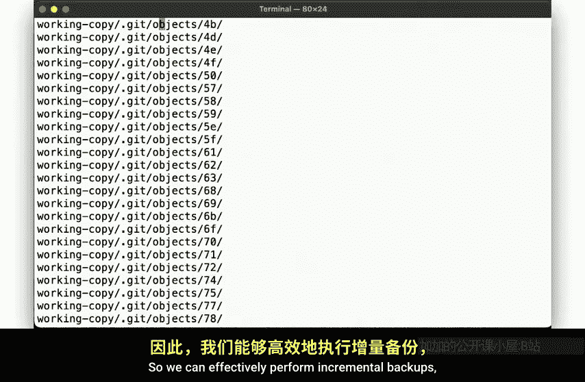

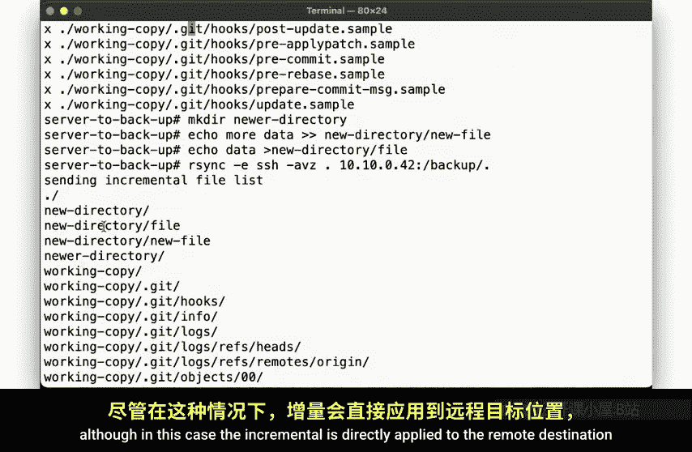

但是否有办法以类似的方式使用其他工具呢？让我们再次尝试使用 `tar`。如前所示，备份目录中的数据很容易。

但是，如果我们在这里创建新数据，然后再次运行备份命令，我们又会复制所有数据。这里没有增量备份。

但是，如果我们不使用 `tar`，而是使用不同的工具呢？`rsync` 命令允许我们将目录层次结构同步到另一个位置。

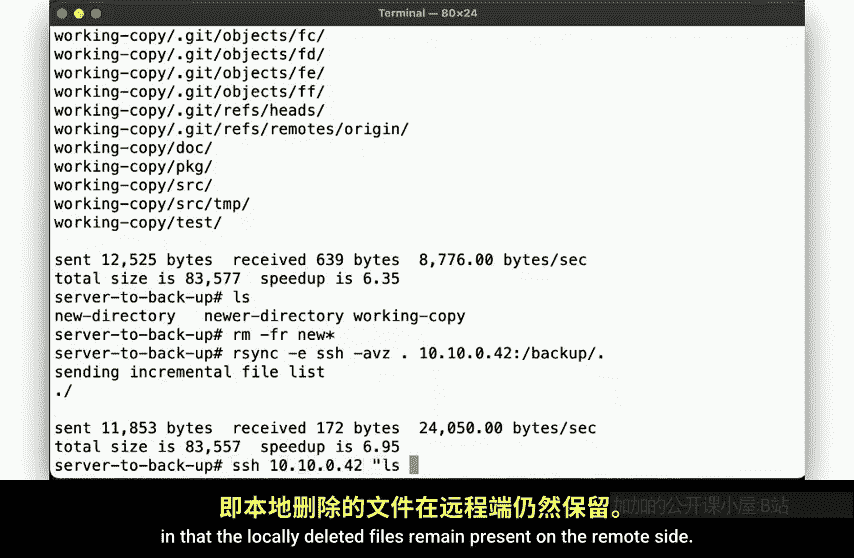

运行它。你会注意到，即使它列出了所有目录，它实际上并没有再次复制所有文件，而是只复制了新修改的文件。因此，我们可以有效地执行增量备份，尽管在这种情况下，增量是直接应用到远程目标的，而不是像 `dump` 那样作为单独的增量文件保存。

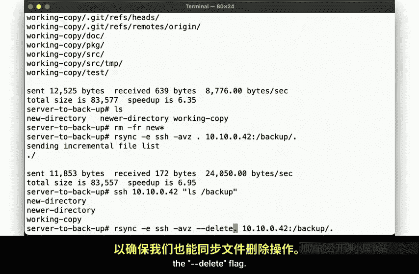

但现在请注意，我们还有另一个用例。我们不仅希望跟踪我们有哪些文件，有时我们还希望确保从文件系统中删除的文件也从另一侧删除。

虽然 `dump` 在创建增量备份方面很出色，但增量备份实际上只包含已更改文件的数据，而没有关于哪些文件已被删除的记录。因此，当我们在这里删除一些文件，然后运行 `rsync` 备份时，它的行为就像 `dump` 一样，本地删除的文件在远程端仍然存在。

但 `rsync` 有另一个选项可以确保我们也同步文件删除操作：`--delete` 标志。

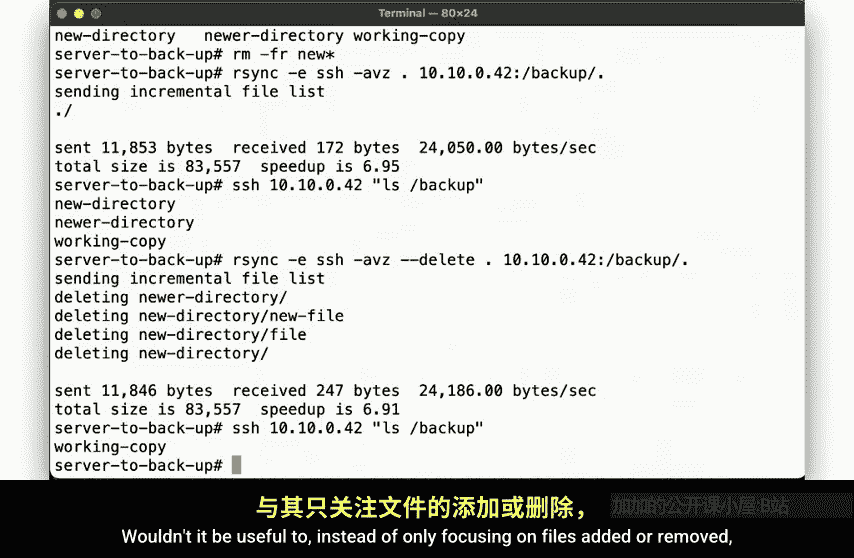

使用该标志后，当文件在本地消失时，我们也会删除远程站点上的文件。这很有用，因为它提供了 `dump` 工具所不具备的功能。

但现在我们有了另一个问题。如果我们以后再次添加这些文件，如何回滚本地所做的更改？我们将无法回到它们最初被删除的状态。

与其只关注文件的添加或删除，拥有一种更好的方式，即能够说“向我展示文件系统在给定时间点的样子”，这不是很有用吗？

我们确实有办法做到这一点，但恐怕你必须等到下一个视频才能发现这些方法是如何工作的。

## 总结 📝

本节课中我们一起学习了如何使用不同工具进行备份。

我们看到了 `tar` 如何用于创建文件系统层次结构的归档，以及如何对以这种方式创建的数据进行多种操作，而不仅仅是写入文件。我们可以使用 `dd` 将其写入原始磁盘设备，通过 `ssh` 将其复制到远程系统，并在此过程中转换数据，例如压缩和加密。但正如我们在最后一个例子中所示，使用 `tar` 意味着全量备份，因为 `tar` 不支持增量备份。

另一方面，`dump` 确实支持增量备份，并且与系统集成更紧密：`/etc/fstab` 包含一个字段来帮助 `dump` 决定需要备份哪些文件系统，而 `/etc/dumpdates` 会跟踪上次备份的时间等。要恢复以此方式备份的数据，可以使用 `restore` 命令来恢复所有数据、部分数据，或交互式地浏览备份。

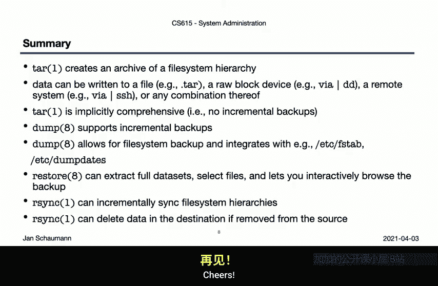

然后，我们研究了 `rsync`，以展示它如何增量备份数据，并且与 `dump` 不同，它甚至可以从数据集中删除数据。但我们也提到，我们仍然缺少一些功能，比如能够回滚时间并有效地浏览文件系统在特定时间点的状态。如何做到这一点将是我们下一个视频的主题。