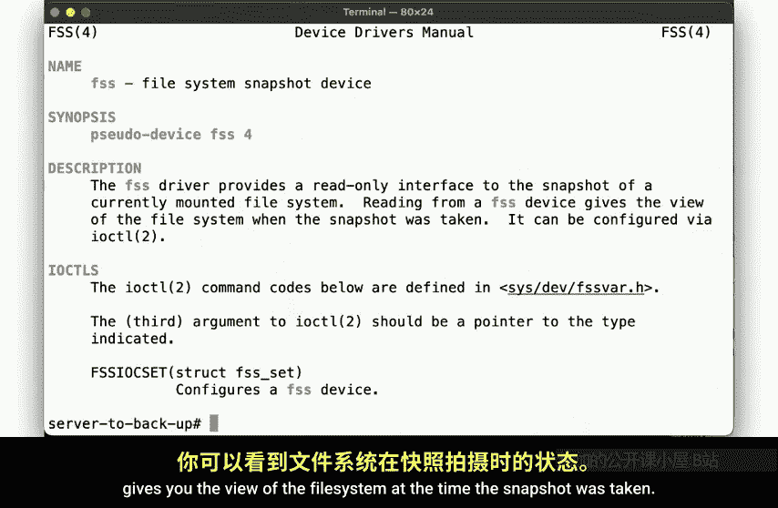
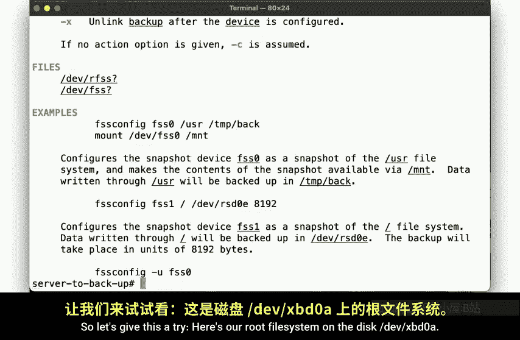
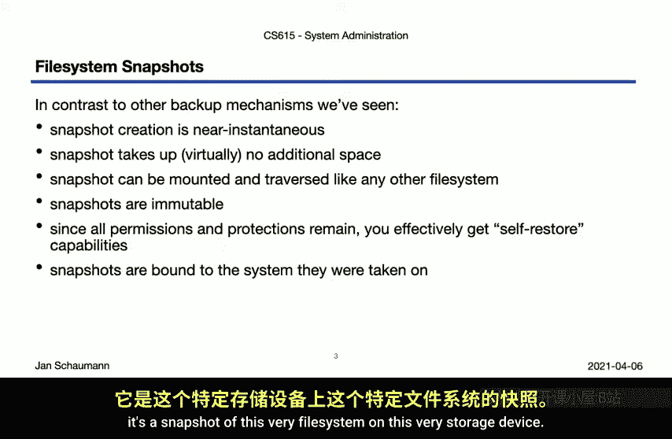
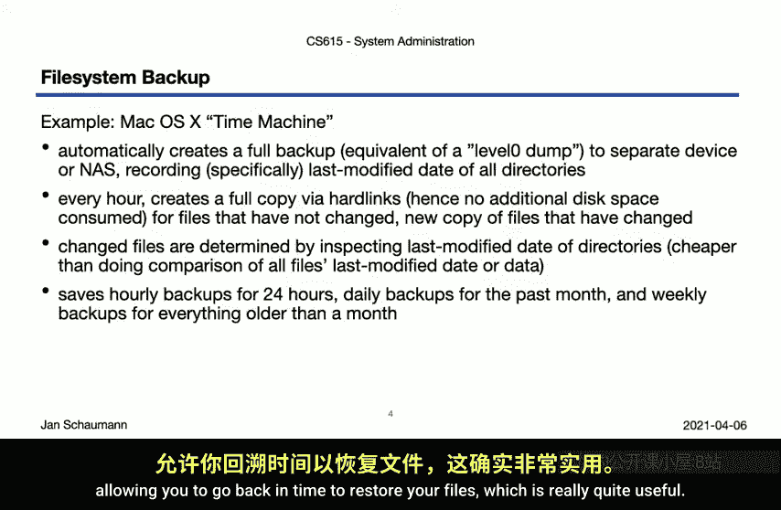
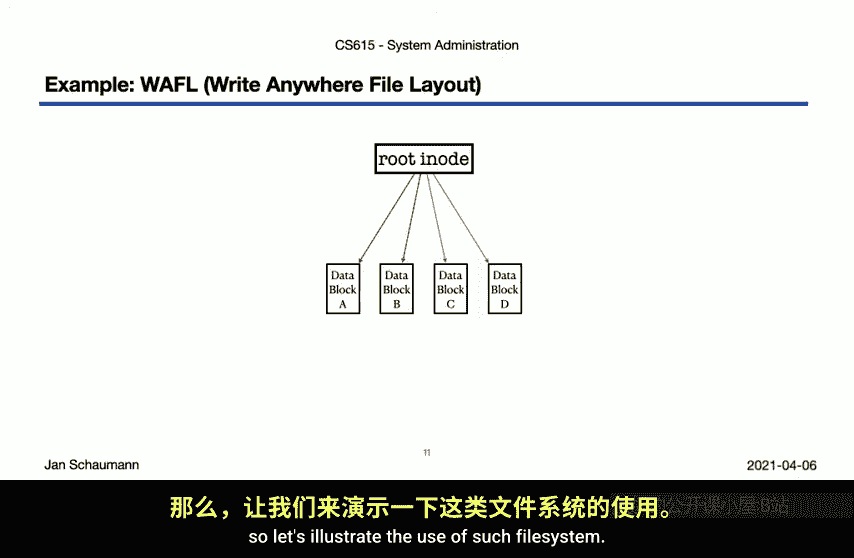
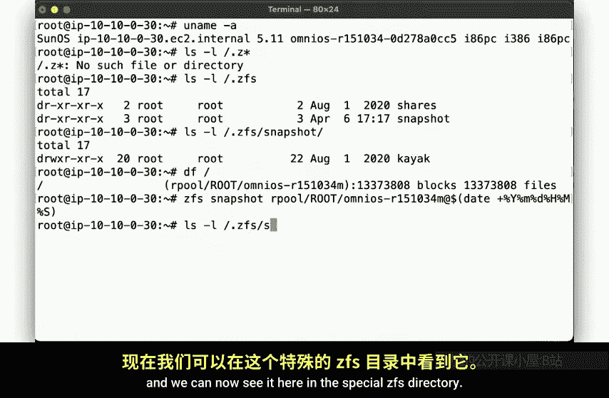
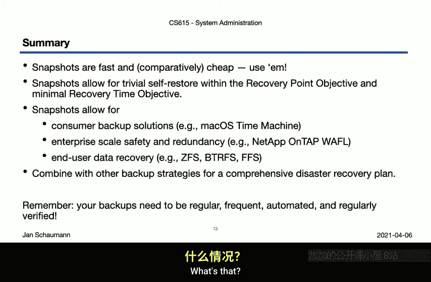

# 史蒂文斯理工学院【中英⚡计算机系统管理｜CS615 2021 System Administration】 p43 p42 Week 09, Segment 3 - Time Travel and Snapshot -BV11QQcYmEzD_p43-

Hello and welcome back to CS 615 System Administration。 This is week 9 segment 3。

 and we are ready to join Marty Mc Fly in the darkck in their time travelling adventures。

 So hop into our deloian here and buckle up。 our flux capacitors charged with 1。

21 gigawWs ready to go。😊，Remember how in our last video。

 we talked about the difference between simply backing up all files and being able to review changes from a given point in time。

We had noticed that just having a copy of files in the past is somewhat different from seeing what the file system actually looked like at that time。

 especially when it comes to file or directory deletions。

If we have the ability to snapshot the fire system， then we the ability to time travel， well。

 at least into the past。 So hey， why not give it a try。Here we have our Neps D E C2 instance。

 And if you paid attention to the dump manual page after our previous video。

 you might have seen a passing reference to so called snap backs， backups to a snapshot。

The default file system on that B SD F F S supports so called file system snapshots。

 which it implements using a solar device that when accessed gives you the view of the file system at the time of the snapshot was taken。

You can create and configure such snapshots using the FSS config utility。

As shown here in the example section of the manual page。So let's give this a try。

Here's our root file system on the disk F X PD0 a。We configure FSS0 of slash under slash backup。

He know， that went quickly。And that's already one of the main points of snapshot。

 Unlike a full level0 backup， they are near instantaneous。

We'll take a closer look at how this works in a minute。

 but for now let's continue to see how we can use the snapshot。

So this file looks pretty large here around 10 gigin size。

 which seems weird in that our entire file system is 10 gig and size。

 So how did we create a file at large。Maybe we can compress it to save some space。H， no。

 can't do that。But permission should allow me to read the file。 Let's make extra sure。Nope。

 no can do。But I'm rude。 God damn it。Let's look at the file flags。 Oh， I see。

 This is no ordinary file， but a special snapshot file。

Let's try to use it as per the manual page and mount it instead via the F S0 device。There it is。

Looks like it's just about the same as our root file system。

Let's change into the directory and see what we find。Hey， need。

 that looks just like our root file system。😊，But we can't manipulate the files here。

 The snapshot is read only a frozen moment in time。

Which is really all for the best since we know that time travel is dangerous。 And before you know it。

 you end up dating your mother and start to disappear。 So probably best to keep the past immutable。

But now， if we were to suffer some unexpected data loss。No。Then we can， of course。

Trivially restore it from the snapshot。耶。😔，And when we're done， we can unmountund the snapshot。

And if we no longer need it， we can unconfigure the pseudo device。

Note that the special backup file here remains in play so we could reconfigure the FSS device and remount it if needed。

If we want to get rid of it completely， we nuke the file。

So how did this approach differ from the previous backup mechanisms。In our last video。

 we saw that using the dump utility， or using tar or arsnc。

 all take some time if they create true copies of the data inputs set。In contrast。

 the file system snapshot is immediate near instantaneous， so that's a pretty big advantage。

Similarly， snapshots do not take up any additional space without not creating another copy of the data。

 so we don't have to write additional data blocks。We can mount the snapshot and then have a complete file system hierarchy view of all data in the snapshot。

 which makes it very convenient to use。At the same time。

 we can't accidentally override data in the snapshot。 It remains immutable。

 and even root can't make any changes。And with all that。

 an immutable file system that's mounted and can be accessed like any other part of the file system。

You really get a self restore mechanism， any user who accidentally deleted a file can go and fetch the preserved copy from this snapshot。

So you could configure your system such that it takes a snapshot every hour and thereby offer your users a self restore backup solution with a recovery point objective of an hour and an instantaneous recovery time objective。

The only disadvantage here is that the snapshot is invariably bound to the system on which it was taken。

That is you can't really take a snapshot or move it off it。

 nor can you snapshot the file system to a separate disk。

 It's a snapshot of this very file system on this very storage device。

But the general idea here is indeed what underlies some common backup systems。

 Most commonly to use perhaps the Mekos time machine。

 which perhaps surprisingly operates entirely without flux dispersal。

 but instead uses a similar concept to P system snapshots。That is。

 time machine starts out by creating an expensive time consuming full level zero backup of the file system in question。

This is usually done to a network attached storage device。

 although as a consumer targeted backup solution， this often works with whatever local storage you might have as what。

Then every hour it creates a second view of the file system。

 but it does that in a manner that preserves disk space and time。

Instead of creating a copy of all the files， it looks at what files have not changed and creates heart links for those。

 only copying the new or modified files。So in a way。

 this uses heartlinks and emm delta to create a variation of a differential backup。

 overlaying changes over the references to the unchanged files。

Time machine sacrifices accuracy for speed。 It will copy any file that is in a foli with a new or last modified timest。

 even if it hasn't changed， This is somewhat more efficient than comparing individual files。

But the end result is that you have multiple space saving views of the file system across time。

As it performs this logic hourly， daily， weekly and monthly。

 allowing you to go back in time to restore your files， which is really quite useful。

A slightly different approach is used by the right anywhere final layout or waffle。

 And who doesn't like waffles。This file system is used by Nab's data on tap operating system on the industry standard high scale data storage devices。

These devices have a high reliability requirement， they use the concept of file system snapshots and file system checkpoints to provide data security。

In particular， they perform these snapshot every 10 seconds as consistency checkpoints to guarantee a small recovery point objective。

 as well as recovery time objective。Similar to what we've seen a minute ago。

 the fire system utilizes near instantaneous snapshot with modifications of the root fire system taking place in the new blocks。

This utilizes a mechanism often referred to as copy onr。

 but is more accurately described as redirect on right。Here。

 let's take a look at how such snapshots work。In waffle。

 we use concepts close to what we discussed in our week three videos about the Unix fire system。

 but the structure is somewhat different。The system uses a root in。

 but does not have in blocks and data blocks separated the way we saw。 Instead。

 all the metadata and data of the files can be indirected through from the root in。

 meaning you can rebuild the whole file system from that route Iode。

So when you want to create a new file system snapshot， all you need to do is copy the route I note。

And the new snapshot， Ro Iode will reference all the same data and metadata blocks as the original。

This operation is obviously， fast and cheap。But now suppose we want to perform an update on some files。

Say we want to make changes to block C and D here。In the copy on right model。

 wed now first create a copy of block C and D。Then update the references the snapshot uses。

And then write the modified blocks， C prime and D prime。this requires multiply all operations。

 namely the copy and the write。In a redirect and right approach。

 when we want to make changes to block C and D。You simply write the new data and keep the snapshot references pointing to the original blocks。

So this is a bit more efficient， even though oftentimes the details of the implementation are glossed over and still be referred to as copy on right。

But anyway， so now we have the second snapshot route I know here。How do we roll back a change？Well。

 all we really have to do is copy the snapshot route ind back over the original route In。

 and we're magically back to the point in time where the snapshot was taken and the new unreferenced modified data blocks。

Can be freed。In this manner， both the initial snapshot creation。

 as well as the rollback are near instantaneous。 Pret clever。

Other file systems implemented the same concept， and one of them is ZFS。

 so let's illustrate the use of such file systems snapshots on such a system。

So here。We have an omniio E C2 instance， using Z FS。But Z F S is a bit weird。 Look。

 there are no files here starting with thought Zfs。Except there is a directory。

 and in that directory， we see a sub directory named Snapshot。

That is the system here already contains a ZFS snapshot named Kaayak。

 which happens to be the OmniioOS install system， but we can ignore that snapshot here and focus on creating our own。

So let's look at our root file system， which we have in previous videos already observed to be located on a ZFS pool。

So let's create a Z of snapshot using this command。We can specify any label here。

 but perhaps well use a date string so we can easily identify from when the snapshot was taken。

As you can see， the snapshot again is instantaneous。

 and we can now see it here in the special dot Zev S directory。

You can list all snapshots also using the ZFS command itself， of course。

 and just like anure FFS example， we can change the directory here and browse the snapshot。So now。

If we make some changes to the live file system。Then we can observe differences simply by comparing the two。

And can easily self restore the file we lost。But note that， of course。

 this is for individual file recovery。If we wanted to really travel back in time to when we took the file system snapshot。

 then we'd also want to have newly created files disappear， for example。

So let's suppose we encountered some tragedy and wanted to completelyroll back all changes from the snapshot。

For that， we use the ZFS rollback command and specify the snapshot in question。Again。

 this is fast as all it has to do is restore the original block references and just like that。

 we were back in time two minutes ago before we lost data and both before we created these files in this directory here。

And if we don't want the snapshot any longer， then we can destroy it。Al right。

 let's take a look at what we've observed here in this video。

We saw that snapshots are really fast and cheap， so if your fire system supports them。

 go right ahead and use them。 snapapshots are really quite useful。

Since they allow you to give your users the ability to restore a fight on their own without involving you at all。

The concept of a snapshot can then be used for various purposes。

We've seen the example of consumer backup solutions like Mac OS time machine。

 although that's not a true file system snapshot。The example of Nebs waffle。And just now。

 our example of using Z FS snapshots。As mentioned earlier。

 snapshots do remain bound to the file system from which they were taken。 so all by themselves。

 they do not offer a comprehensive backup and recovery strategy。

But you should combine them with some of the other approaches we discussed。

Whatever solution you come up with， though， please do make sure that it is an automated solution that runs regularly and frequently that meets your recovery point objective and most importantly。

 that you verify that it works on a regular basis。So why don't you go ahead right now and check on your backups。

 You do have working backups， don't you。What's that， if I。

Gotta go。 See you next time， Gs。