# 计算机系统管理：10.1：配置管理（第一部分）🚀

## 概述

在本节课中，我们将要学习**配置管理**。配置管理是系统管理中的一个核心领域，它结合了管理成百上千台系统、服务以及分布式计算的广泛概念。我们将探讨什么是配置管理、为什么需要它，以及系统管理员在实践中如何演进其管理方法。

---

## 什么是配置管理？

系统管理的核心目标之一是确保系统能够稳定、可靠地提供服务。然而，系统并非静态的。文件会被创建、修改或删除；用户会登录并运行命令；服务会启动或终止。此外，业务需求和技术演进也要求系统频繁地更新软件、调整配置、管理用户账户和调度任务。

换句话说，我们的系统**持续经历着变化**。

在单台主机上，这些变化通过修改本地配置文件、执行特定命令以及安装或调整应用程序来完成。而当我们需要将同样的变更应用到大量系统时，问题就变得复杂了。

---

## 为什么需要配置管理？

手动管理大量系统的变更是不现实的。例如，为一个安全漏洞打补丁，我们需要：
1.  准确知道哪些主机运行了有漏洞的软件版本。
2.  在每台主机上执行相同的升级步骤。

我们无法亲自跟踪成千上万个系统上的数百项变更。因此，我们将“应用定义明确的变更集到大量系统”的任务，委托给一类称为**软件配置管理系统**的软件，简称 **CM**。

配置管理系统与我们之前讨论的多个主题紧密相关：
*   **系统初始化**：在操作系统安装后，需要进行最小化的自定义配置。
*   **软件管理**：CM 需要与系统的包管理器紧密集成。
*   **用户管理**：用户账户的增删改查是动态的。
*   **备份自动化**：备份策略需要中心化配置，并根据主机差异进行分发。

---

## 配置管理方法的演进

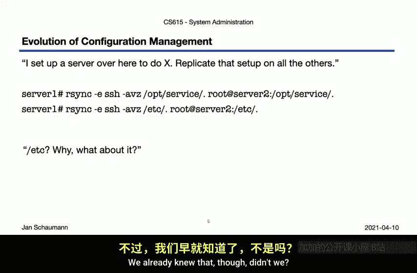

几乎每位系统管理员都经历过管理方法的演进。这个过程通常遵循一个可预测的模式。

以下是系统管理员在尝试规模化管理系统配置时，常见的演进步骤：

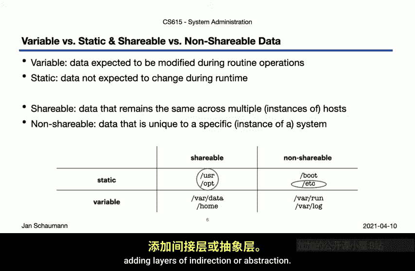

1.  **手动复制**：在一台服务器上完成配置，然后手动将必要的文件和配置复制到其他服务器。这种方法效率低下且容易出错。
2.  **使用 `rsync` 同步**：意识到全量复制低效后，转而使用 `rsync` 等工具仅同步有差异的数据。但直接同步存在风险，因为不同主机之间存在**不可共享的独有数据**（如网络配置、主机名）。
3.  **构建“黄金镜像”**：创建一个包含所有可共享数据的基准镜像用于部署，同时单独管理每台主机特定的配置。这种方法适用于少量主机，但**按顺序循环处理**大量主机时存在**可扩展性问题**。
4.  **拉取模式**：反转流程，让每台服务器主动从中心服务器“拉取”配置。这缓解了推送模式的中心节点压力，但可能导致所有客户端同时连接中心服务器，造成“惊群”效应。常见的缓解措施是添加随机延迟或分阶段部署。
5.  **采用成熟的 CM 系统**：最终转向使用如 Puppet、Chef、Ansible 等专业的配置管理系统。这些系统提供了声明式的语言来定义系统状态，并能智能地处理依赖关系和变更。

然而，即使使用了 CM 系统，有时仍会遇到其无法处理的边缘情况，管理员可能不得不暂时退回更手动的方法。关键在于找到平衡。

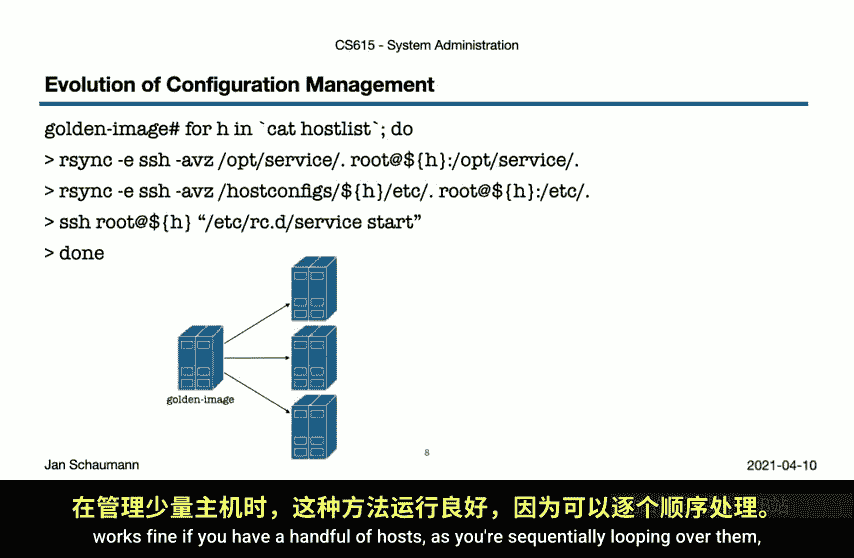

---

## 配置数据的分类

为了有效地进行配置管理，我们需要对配置数据进行分类。回顾我们在第 3 周讨论的**文件系统层次结构标准**，我们可以根据数据的**可变性**和**共享性**来区分。

在实践中，系统的配置可以分为两大类：

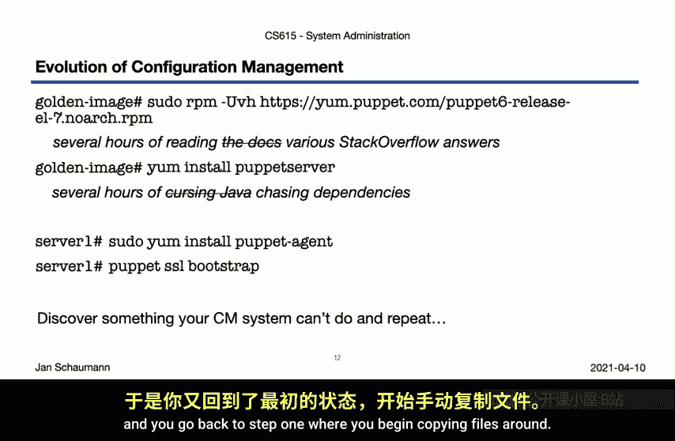

*   **系统特定但可预测的配置**：这些配置因主机的位置或角色而异，但其内容是可以通过规则推导的。
    *   **示例**：网络配置（如默认网关）、关键基础设施服务地址（如本地 DNS、NTP、Syslog 服务器）、操作系统最低版本要求、用户与 SSH 配置。
    *   **特点**：通常可以从系统属性（如数据中心区域、主机角色）在运行时派生。

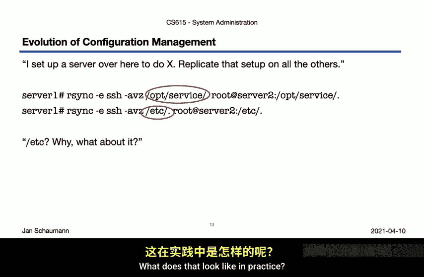

*   **服务特定的配置**：这些配置由运行的服务本身决定，需要在所有运行该服务的主机上保持一致。
    *   **示例**：Web 服务器软件包、TLS 证书与密钥、数据库连接配置、服务托管的具体内容。
    *   **特点**：与业务逻辑直接相关，跨主机需要高度一致。

假设我们在全球多个数据中心（如美西、美东、欧洲、亚太）部署相同的 HTTP 服务。所有主机都需要相同的 Web 服务器软件，但每台主机的 DNS 解析器地址必须是其本地数据中心的。这就是上述两类配置的典型例子。

---

## 配置管理系统的抽象与复用

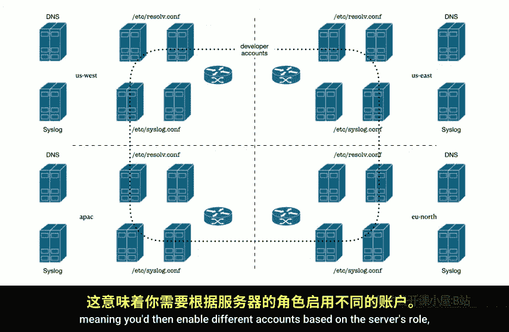

成熟的配置管理系统允许我们以**声明式**和**抽象化**的方式定义配置，并支持代码复用。

不同的 CM 系统使用不同的语法，但核心思想相似：定义**资源**（如软件包、服务、文件）及其应有的**状态**。

以下是不同 CM 系统的配置示例，它们都旨在实现相似的目标：

**Puppet 示例**：使用其领域特定语言定义软件包和服务。
```puppet
package { 'openssh-server':
  ensure => latest,
}

service { 'sshd':
  ensure  => running,
  enable  => true,
  require => Package['openssh-server'],
}

file { '/etc/ssh/sshd_config':
  ensure  => file,
  owner   => 'root',
  group   => 'root',
  mode    => '0600',
  source  => 'puppet:///modules/ssh/sshd_config',
  require => Package['openssh-server'],
  notify  => Service['sshd'],
}
```

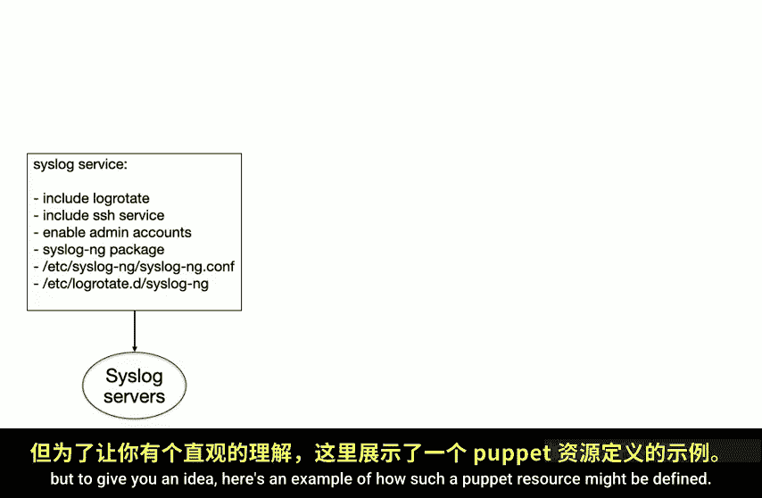

**Chef 示例**：使用 Ruby 风格的语法定义资源。
```ruby
package 'rsyslog' do
  action :install
end

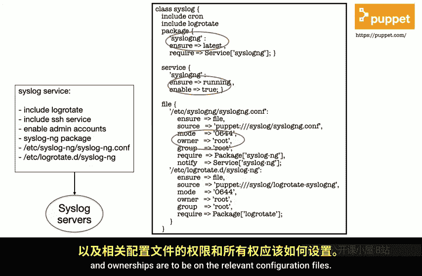

service 'rsyslog' do
  action [:enable, :start]
end
```

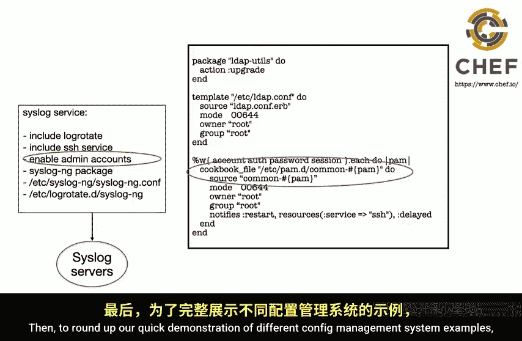

**CFEngine 示例**：另一种定义承诺的方式。
```cfengine
bundle agent main
{
  packages:
    “openssh-server” policy => “present”;

  services:
    “ssh” service_policy => “start”;
}
```

这些系统的强大之处在于**抽象与复用**。我们可以将通用功能（如日志轮转、基础用户配置）定义为独立的模块或“类”，然后在不同的服务配置中引用它们。这类似于软件开发中的函数调用，避免了代码重复，使配置更易于维护和更新。

例如，可以为“基础安全设置”创建一个模块，其中包含 SSH 配置和防火墙规则，然后让所有服务器配置都包含这个模块。

---

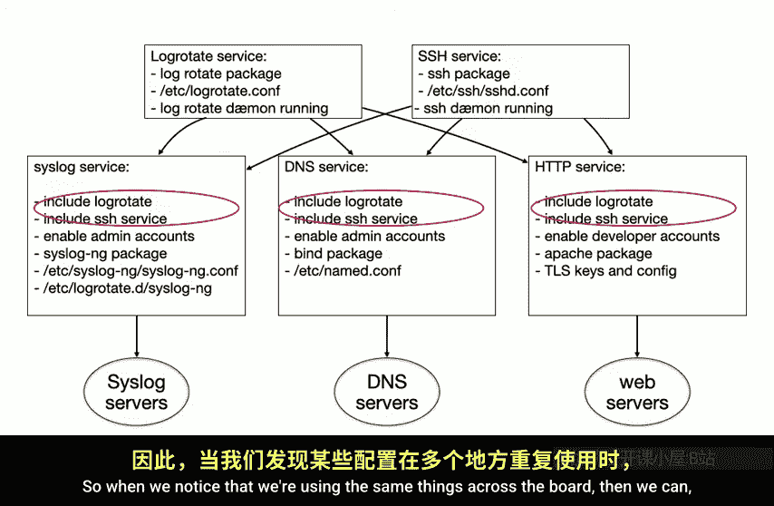

## 总结与下节预告

本节课我们一起学习了**配置管理**的基础概念。我们了解到，由于系统持续变化且规模庞大，手动管理配置是不可行的。配置管理系统的演进从简单复制发展到声明式、可编程的自动化。我们学会了将配置数据分类为**系统特定配置**和**服务特定配置**，并看到了如何使用 CM 系统通过抽象和复用来高效、规模化地定义这些配置。

告别了难以扩展的手工操作，我们进入了更高效、更可靠的自动化管理时代。

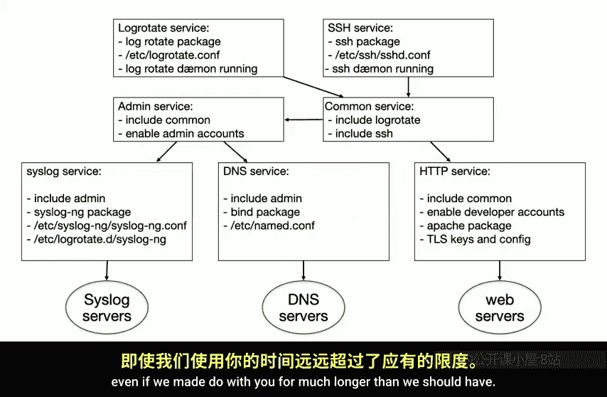

在下一个视频中，我们将深入探讨配置管理系统的**核心能力**，介绍**状态声明**的概念，并简要提及分布式系统中的 **CAP 定理**及其对配置管理的影响。

---

## 课后练习

为了加深理解，建议你完成以下练习：

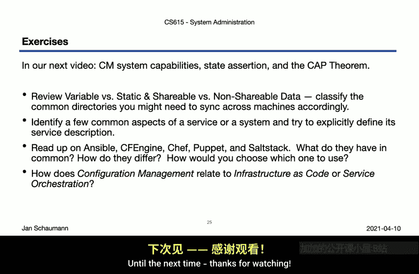

1.  **复习文件系统层次结构**：回顾第 3 周的内容，尝试对你系统上的不同目录和文件进行分类（共享/非共享，可变/静态）。这对理解配置数据的处理方式至关重要。
2.  **尝试定义一项服务**：选择一项服务（例如 SMTP 服务器），尝试列出配置它所需的所有不同组件和服务（软件包、配置文件、用户、依赖服务等）。
3.  **研究不同的 CM 系统**：了解 Puppet、Chef、Ansible、SaltStack 等主流配置管理工具的异同。有些更容易设置，不妨尝试搭建一个简单的实验环境。
4.  **阅读相关概念**：提前阅读 **基础设施即代码** 和 **服务编排** 的相关资料。这两个领域与配置管理有大量重叠和交叉，但又不完全相同。我们将在后续视频中重新探讨它们之间的关系。