# 计算机系统管理：10.2：配置管理（第二部分）🎯

在本节课中，我们将继续深入探讨配置管理系统的核心概念。我们将了解这些系统如何影响系统运行，以及在安装、运行和管理它们时需要牢记的重要考量。

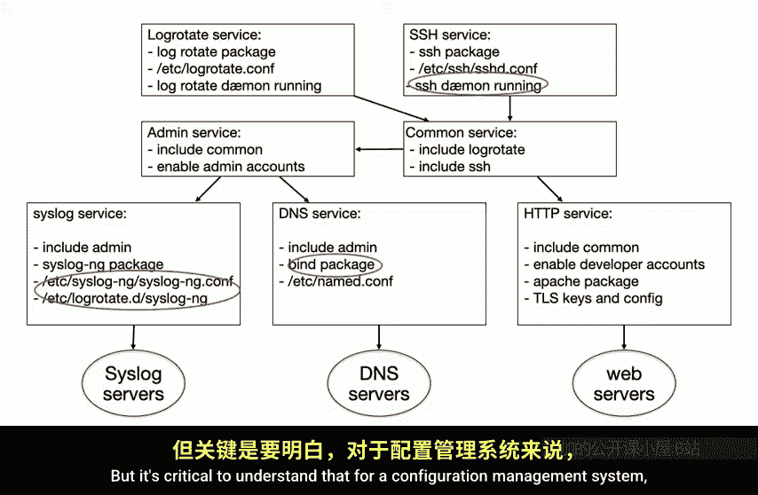

上一节我们介绍了服务定义抽象化的概念。本节中，我们将进一步探讨这些关键基础设施服务如何影响系统运行，以及配置管理系统的核心任务。

## 配置管理的核心：断言状态

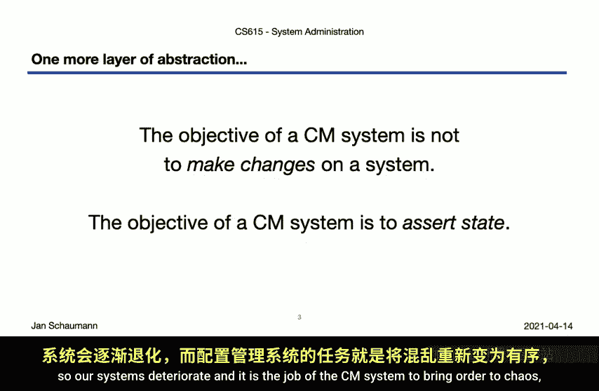

配置管理系统的主要任务并非执行具体的更改。相反，其核心工作是**断言状态**。

这两者之间存在显著差异，并深刻影响着系统的工作方式。这听起来可能有些反直觉，但仔细想想，你确实不希望系统执行特定的更改，而是希望确保主机被正确配置，然后仅应用那些必要的更改以使其达到该状态。

我们知道，封闭系统的熵会随时间增加，因此我们的系统会逐渐“恶化”。配置管理系统的职责就是将秩序带回混沌，让系统重回正轨。

以下是系统可能经历的状态：

*   **未配置状态**：系统不满足我们的要求，未安装正确的软件包或缺少正确的配置文件。这可能是一台仅安装了基本操作系统的全新主机。
*   **已配置状态**：配置管理系统执行定义的更改后，所有必需的软件包都已正确安装和配置，主机上的所有服务都在运行。系统已准备好投入生产。
*   **偏离状态**：随着时间的推移，熵或用户操作可能导致系统偏离期望状态，进入偏离状态。例如，有人手动更改了系统或安装了与现有服务冲突的软件包。
*   **未知状态**：系统处于未明确定义的状态。这可能是因为配置管理代理已停止运行，或正在错误地应用配置。主机可能已关机、网络中断，甚至可能已被入侵。

配置管理系统定期运行，检测到偏离后，会逆转或覆盖这些更改，使系统回到已知的良好状态。一个正常运行的配置管理系统至少具备一定的自愈能力。

此外，系统还可能被标记为以下两种服务状态，这些状态可能由配置管理系统影响，也可能与之无关：

*   **服务中**：系统已准备好接收生产流量。
*   **服务外**：系统已从生产流量中移除。

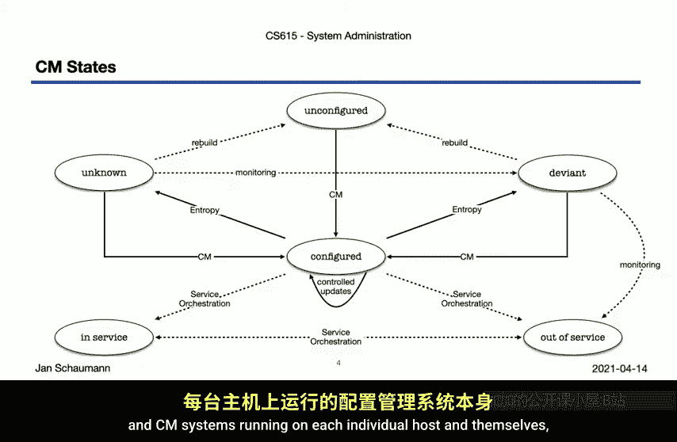

这些状态转换有时由一个独立的监督服务（称为服务编排）来管理，它可以根据外部定义的属性，将单个系统从“已配置状态”置入或移出服务。

## 分布式系统的挑战：CAP定理

任何单台主机都不是孤立运行的。运行在每台主机上的配置管理系统本身通常由一个中心服务协调，因此它们本身就是**分布式系统**。

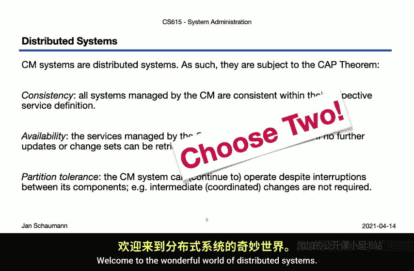

作为分布式系统，配置管理系统也受**CAP定理**约束。这意味着我们必须考虑三个重要但无法同时完全满足的属性：

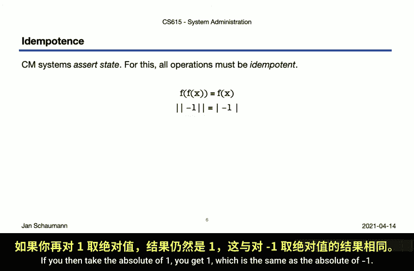

1.  **一致性**：确保所有系统彼此一致，每个系统都能一致地接收相同的更新。
2.  **可用性**：系统能够接收更新，并确保其管理的服务在整个操作过程中保持可用。
3.  **分区容错性**：当系统无法接收更新时不会崩溃，并能够优雅地从任何此类网络分区中恢复。

由于系统的分布式特性，我们一次只能保证这三个属性中的两个。

## 操作的关键属性：幂等性

配置管理系统在断言状态时，其执行的操作必须是**幂等**的。

幂等性是指一个函数可以重复应用，以其自身的结果作为输入，并产生相同的输出。用数学公式表示即：`F(F(x)) = F(x)`。

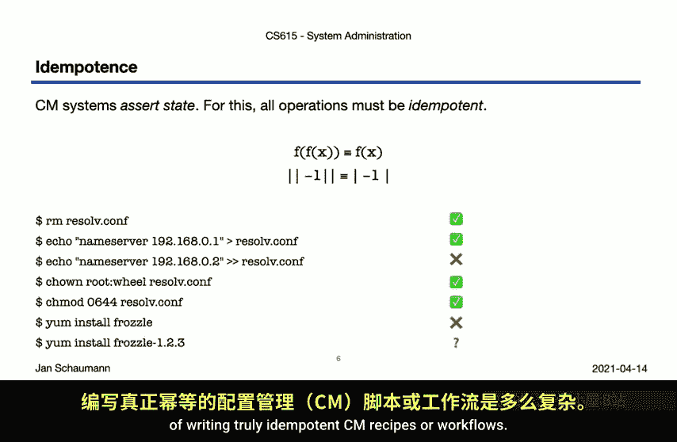

在我们的上下文中，这意味着可以连续多次执行相同的操作，并始终获得相同的结果。这与“做同样的事情”有显著区别。

以下是判断操作是否幂等的例子：

*   **删除文件**：命令完成后文件不存在。再次运行命令，结果相同（文件仍不存在），尽管命令可能报错。此操作是幂等的。
*   **写入配置文件**：每次运行都会截断文件并写入相同内容，结果是相同的。此操作是幂等的。
*   **向文件追加数据**：运行两次命令会得到不同的结果（文件包含两行相同内容）。此操作不是幂等的。
*   **更改文件所有者或权限**：是幂等操作。
*   **安装软件包**：通常不是幂等操作。如果指定安装最新版本，每次调用可能安装不同版本。即使指定确切版本，由于软件包安装脚本可能依赖系统参数，也无法绝对保证幂等性。

幂等性是实现某种形式自愈能力的重要要求，因为它允许重复执行相同步骤以达到期望状态，而不会造成损害。但请注意，这并不意味着它一定是高效的。

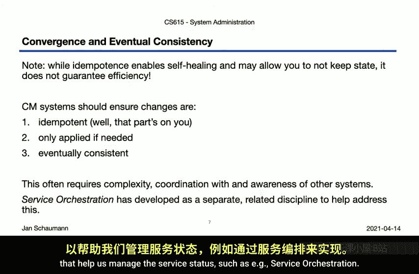

## 跨主机的最终一致性

配置管理系统需要确保在执行更改后，能在多台主机上达到期望的最终状态。这就要求跨主机的**最终一致性**。

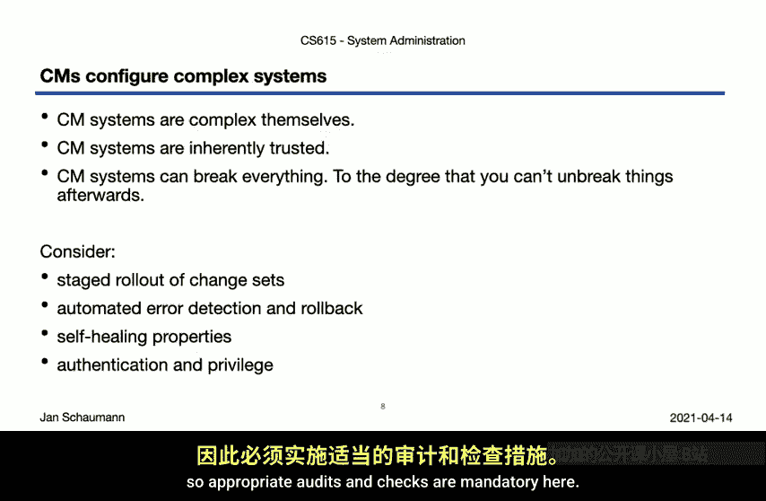

例如，假设你想在所有HTTP服务器上推出一个软件包更新。如果10台系统中有1台因故无法应用更新，你该如何处理？是让那台主机保持原样（导致9台一致，1台不一致），还是在9台上回滚更改以确保所有系统一致，或者将第10台标记为偏离状态并将其移出服务？

不同的系统以不同的方式解决这个问题。这通常需要与其他系统进行显著的通信和状态感知，因此我们常与监控系统（如服务编排工具）集成来帮助管理服务状态。

## 配置管理系统的功能与复杂性

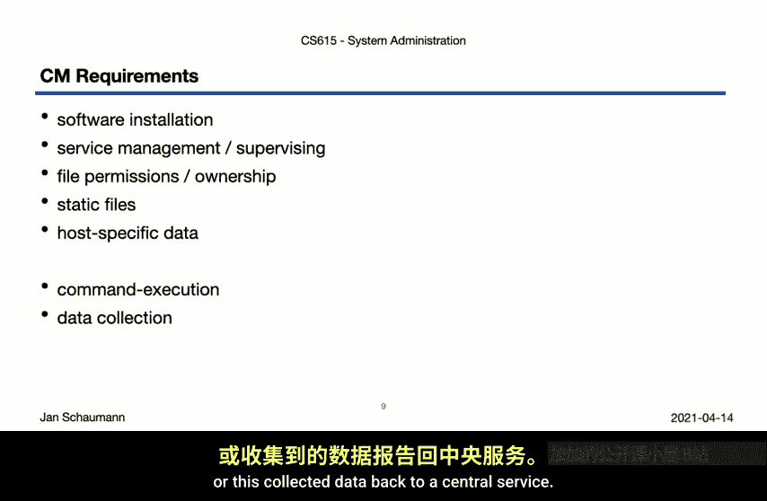

配置管理系统本身也是复杂的系统，可能以复杂的方式失败。它们本质上被高度信任，拥有在主机上进行更改的特权，因此也有可能严重破坏系统，以至于无法自行恢复，需要手动干预。

因此，为任何即将推出的更改制定周密的分阶段推出计划至关重要，应缓慢地、增量式地应用到系统子集，并配合适当的监控、检查以及故障时的自动回滚机制。

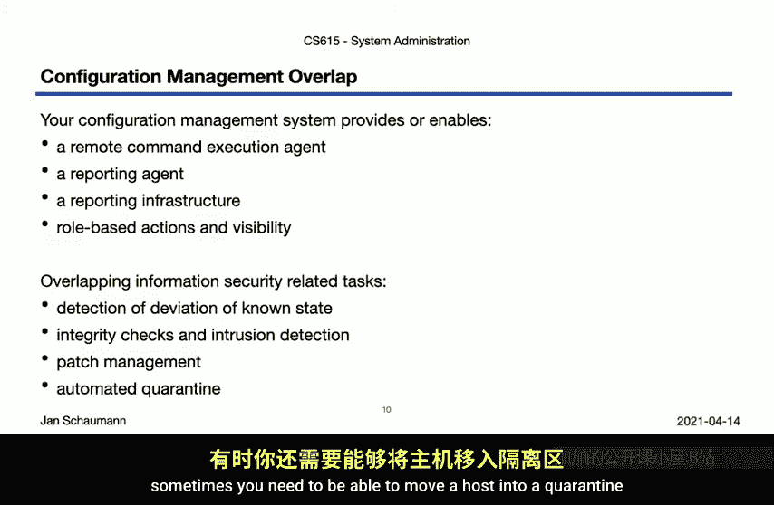

一个配置管理系统需要具备以下核心功能：

*   与软件包管理器集成以安装软件。
*   与系统初始化组件（如systemd）集成以确保服务启动、重启和持续运行。
*   应用文件权限和所有权。
*   安装静态文件、向现有文件添加内容，或根据系统/网络位置属性生成主机特定的配置文件。
*   执行超出文件、权限或软件包管理的特定命令。
*   从主机收集数据并报告其状态。

## 与其他管理领域的重叠

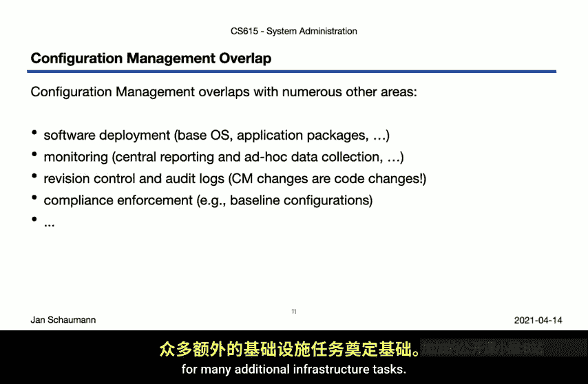

观察上述功能列表，你会发现配置管理系统与你使用的许多其他重要系统和服务存在重叠：

*   **软件部署**：与部署引擎或持续部署流水线直接重叠。
*   **监控解决方案**：用于常规报告和临时数据收集。
*   **版本控制**：一旦配置被充分抽象化，所有更改都成为代码更改，软件工程中的版本控制优势在此变得必要。
*   **合规性强制执行**：配置管理系统是保证在所有系统上部署法规要求更改的方式。

因此，配置管理通常为许多额外的基础设施任务提供基础，它与资产清单、角色定义、服务编排、部署和监控等领域相互交织。

## 容器化与配置管理

那么，在使用静态、小型、定义明确的容器时，我们是否以同样的方式使用配置管理？答案是：既是，也不是。这取决于具体情况。

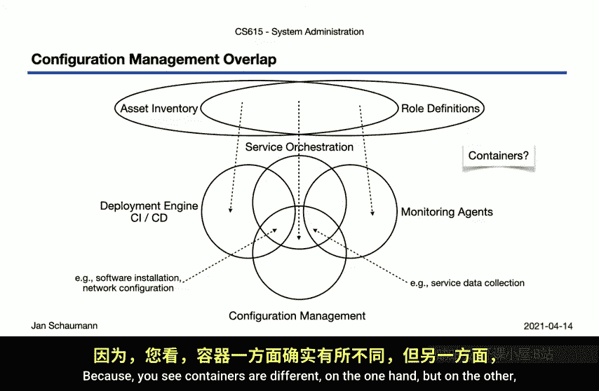

容器一方面是不同的，但另一方面，它们又是相同概念的演进。就像配置管理系统断言系统状态一样，我们的容器在某种程度上也是一种状态断言。我们仍然需要资源、实例和目标的清单。

关键区别在于，我们的容器**应该是不可变的**，即它们不应在运行时被更改，从而保证正确的状态。我们不是尝试更新运行中系统的配置，而是通过集成代码更改并部署更新的容器镜像来确定状态偏差。

即使在容器化的新世界里，许多繁重的工作仍然由之前的相同工具完成。在成熟的组织中，运行时系统的配置已从单独的手动系统转向通用的、定义明确的、不可变的组件，这些组件可以以自动化方式构建和部署，即**基础设施即代码**。

## 总结与应用范围

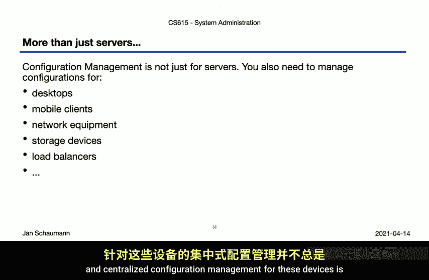

本节课中，我们一起学习了配置管理系统的核心概念。让我们回顾一下最重要的要点：

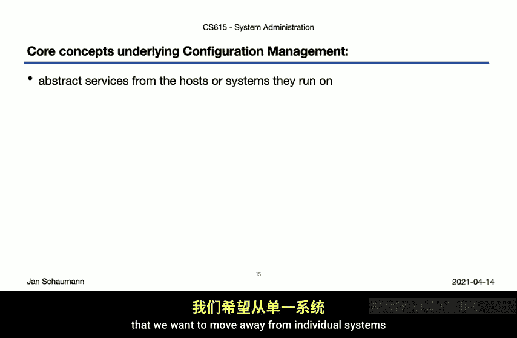

首先，我们需要从关注单个系统转向清晰定义我们所部署的服务。这意味着不再费力维护只有少数人记得其确切配置的脆弱个体系统，而是转向可以随时重建和实例化的、完全可替换和可交换的系统。

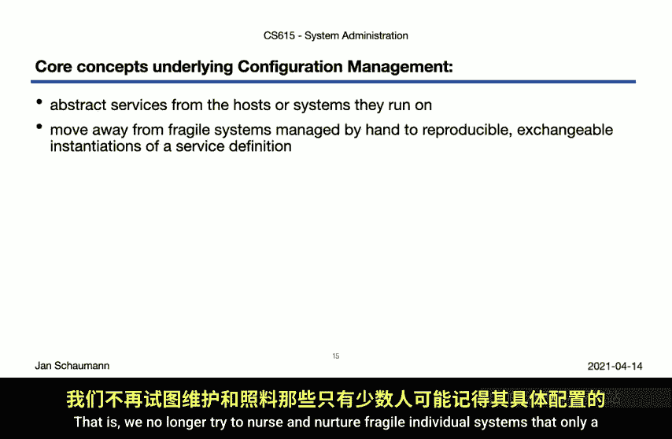

为实现这一点，我们应聚焦于**断言状态**，定义结果而非配置系统的方式。鉴于配置系统的分布式特性，我们需要意识到其局限性，并为分布式系统可能失败的各种方式建立防护措施。

我们构建的状态定义，应能通过应用**幂等**的更改集来达到，并可靠地保证最终收敛于一个已知状态。

所有这些都与系统管理中使用的其他组件、服务和系统存在显著重叠。随着行业从专业化服务转向更描述性的、能够通过集成测试、代码审查和持续集成/部署实现自动化的方式，配置管理已成为大规模系统管理中最重要的领域之一。

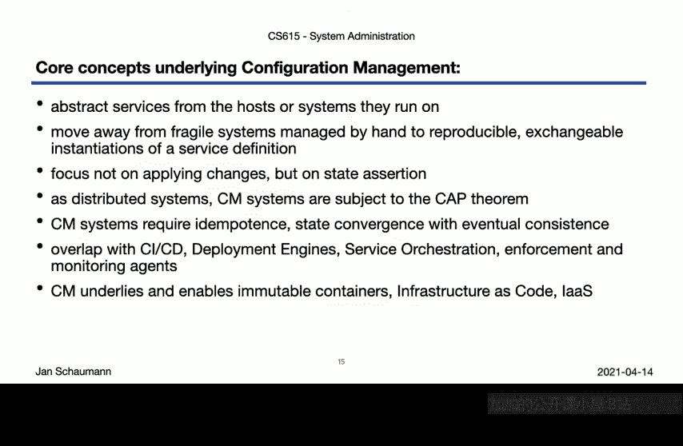

最后，请记住，状态断言和配置管理的所有好处不仅适用于服务器，也同样适用于桌面和移动客户端（尽管使用不同的企业工具），以及路由器、交换机、存储设备、负载均衡器等网络设备。我们在此学到的所有知识都可以并应该应用于这些领域。