# 计算机系统管理：11.1：系统安全 I - 风险评估 🔐

在本节课中，我们将开始学习系统安全的核心概念。我们将探讨安全的本质，理解它为何不是一个终极目标，并学习进行风险评估的基本方法。

---

## 课程概述

随着学期接近尾声，我们现在回到最初视频中提到的、对系统管理员工作至关重要的一个主题：系统安全。在整个学期中，我们反复提及所涵盖主题的安全方面。当然，不可能在短短几个视频中充分详细地涵盖像安全这样广泛的主题。但正如之前所讨论的，我们的目标是提供足够的信息，让你知道在哪里寻找更多内容，并理解哪些方面最重要。所以，让我们来谈谈系统安全。

首先，我必须让你失望：我无法告诉你如何使你的系统变得安全。根本没有一个简单的公式。天下没有免费的午餐。我希望通过这些视频，你能理解其中的原因。

我也不会告诉你如何入侵其他系统，尽管理解如何入侵通常是理解如何防御系统免受侵害的副产品。当然，你会学到一些东西，让你更容易攻破其他系统，例如系统安全的本质。但无论如何，我显然无法告诉你关于这个主题你需要知道的一切。你可以选修专注于信息安全许多方面的其他课程，你可以获得网络安全学位或专业，你可以在行业工作多年，但仍然无法了解所有知识。因此，在这里，我们仅仅是浅尝辄止。

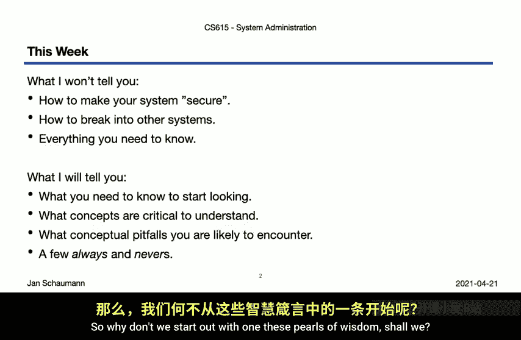

那么，这些视频对你有何用处呢？以下是我希望你能从中获得的一些东西。正如我所提到的，我希望这些视频能给你足够的信息来开始探索，为你提供关键词和概念，让你了解哪些是至关重要的。我将尝试解决信息安全行业以及我们应用安全概念时存在的一些问题。这一点也很重要。在此过程中，我会尝试加入一些“总是”和“从不”的规则。当然，这些规则总是有例外，因此并非真正的“总是”和“从不”，但作为经验法则，它们对你未来的职业生涯将是有益的。

那么，我们何不从其中一条智慧箴言开始呢？

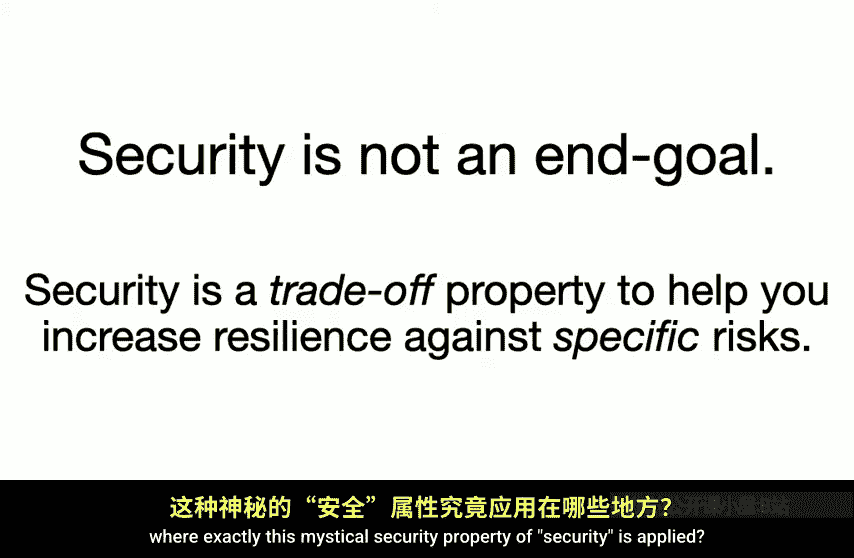

---

## 安全不是终极目标 🎯

这是一个重要的观点。安全本身不是一个终极目标。它不是一个结果。它本身并不是有价值的东西。相反，安全是系统的一种属性，一种可能有助于提高你对特定风险抵御能力的属性。而这种属性是有代价的，所以你总是在权衡利弊。

我们稍后会更多地讨论这个“特定风险”的概念。但也许我们应该首先弄清楚这个神秘的安全属性究竟应用在哪里。

---

## 安全贯穿所有层次

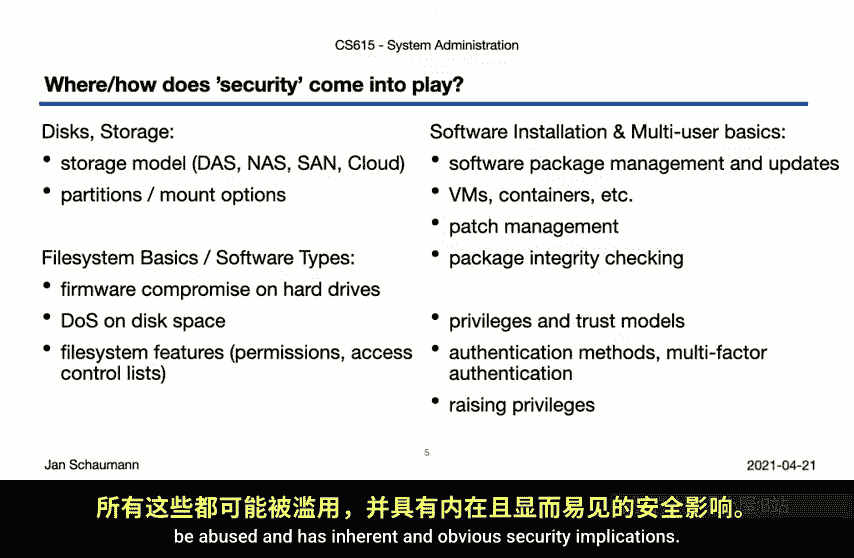

安全贯穿技术栈的所有层次。我们很早就提到过，安全不能是事后添加的东西，它需要是系统内在的属性。因此，我们当然需要在每一层都考虑安全。我们这学期确实已经这样做了。让我们回顾一下本学期涵盖的材料。

以下是本学期各主题中涉及的安全方面：

*   **第2周：磁盘与存储**：我们讨论了不同的存储模型，并注意到从DAS到NAS到SAN再到云存储的抽象层次如何增加了复杂性和数据暴露的风险。
*   **本地文件系统**：我们注意到可以通过应用不同的挂载选项来增强系统安全性，例如将某些文件系统挂载为只读，或使用 `noexec` 或 `nosuid` 等选项。
*   **文件系统基础与软件类型**：我们指出即使是硬盘上的固件（即IDE驱动器名称来源的集成设备电子部件）也可能被攻破。我们还通过共享文件系统实验，观察了耗尽所有文件空间或inode可能发生的情况。
*   **Unix文件系统属性**：我们讨论了Unix文件系统作为多用户系统的标准属性，因此需要文件所有权和权限，同时也提到了扩展文件系统访问控制列表（ACL）的可用性。
*   **软件安装**：这是一个充满安全隐患的主题。通过容器和虚拟机实现的权限分离，以及补丁管理和软件包完整性保证，都是一些例子。
*   **多用户基础**：我们在课堂上花时间讨论了不同的信任模型、身份验证方法，以及用户如何提升权限，所有这些都可能被滥用，并具有内在且明显的安全隐患。
*   **网络**：我们说明了每一层中元信息的可见性，并且看到仅使用 `tcpdump`，我们不仅可以查看主机上的所有数据，还可以查看网络上经过的一些数据。这当然意味着，如果你与攻击者在同一网络段，可能会发生什么。
*   **互联网的物理性质**：我们讨论了互联网的物理性质，以及政治格局如何影响允许通过某些网络的流量，以及流量在传输过程中是否可以被检查。
*   **DNS**：我们很快意识到，如果你能控制一个区域，那么你就能控制流量的几乎所有其他方面，这就是为什么攻击你的域名服务器记录注册地变得如此有趣。我们看到DNS被用于各种侧信道攻击，经常提供带有身份验证上下文的额外信息。我们注意到不幸的是，大多数DNS流量是不受保护和未经身份验证的，但我们也提到了一些补救方法，如DNSSEC、DNS over TLS和DNS over HTTPS。
*   **HTTP**：我们指出HTTP是跨网络的通用入口点。我们讨论了如今HTTP不再只是静态文档，而是在服务器端和客户端动态执行的，这带来了所有安全隐患。我们还讨论了将流量外包给CDN可能对安全和隐私产生的影响。
*   **HTTPS与TLS**：了解到我们可以使用 `tcpdump` 观察纯HTTP文本，从而看到网络上的流量，我们接着讨论了HTTPS和TLS来加密传输中的流量。这引出了通过公钥基础设施（PKI）对服务进行身份验证，而PKI建立在数量惊人的证书颁发机构之上。我们简要提到了TLS协议开发过程中遇到的一些困难。
*   **SMTP与电子邮件**：我们讨论了电子邮件本身作为一种攻击载体，垃圾邮件和网络钓鱼利用了简单邮件传输协议的工作原理，因为它是在开放网络时代开发的。然后我们讨论了使用STARTTLS及其机会主义加密方法，以及各种相关的DNS记录试图提供另一层安全性和真实性，这些并未包含在原始协议中。
*   **开发工具与自动化**：在课堂上，我们讨论了在评估环境中开发工具、编写代码和编程，我们可以利用自动化作为保护机制，但需要注意选择错误的工具可能导致严重的安全问题。这要求我们理解所使用的语言和框架，并努力通过专注于简单性来减少攻击面，因为我们编写的所有代码都不可避免地包含错误，我们需要小心不要在部署自动化时引入安全漏洞。
*   **灾难恢复与监控**：与系统安全的联系是显而易见的，因为我们必须准备的灾难中就包括安全漏洞。但更一般地说，任何数据丢失都是安全故障。我们稍微讨论了可能感染备份系统或备份数据本身的恶意软件，并提到了在备份机制中对静态数据进行加密的概念。在监控环境中，我们检测不良事件的能力对系统安全和防御能力至关重要。我们需要意识到所记录数据的敏感性，因为这些数据可能包含密码或其他机密或私人数据，这可能影响你将监控外包给第三方提供商的能力。
*   **配置管理系统**：我们说明了用户角色和服务定义，这可能允许我们提供更细粒度的访问控制和服务配置文件。但我们也指出了使用配置管理系统的固有权力和风险，其中CA定理可能对我们系统的安全性产生直接影响。

是的，正如学期初所承诺的，我们确实在每一节课中都包含了安全的某些方面。如果你在我们完成这个迷你系列后回顾早期的视频，希望你会发现我们在这里也涵盖了很多领域，并且你现在可能看到需要更深入地研究安全相关方面的更多领域。

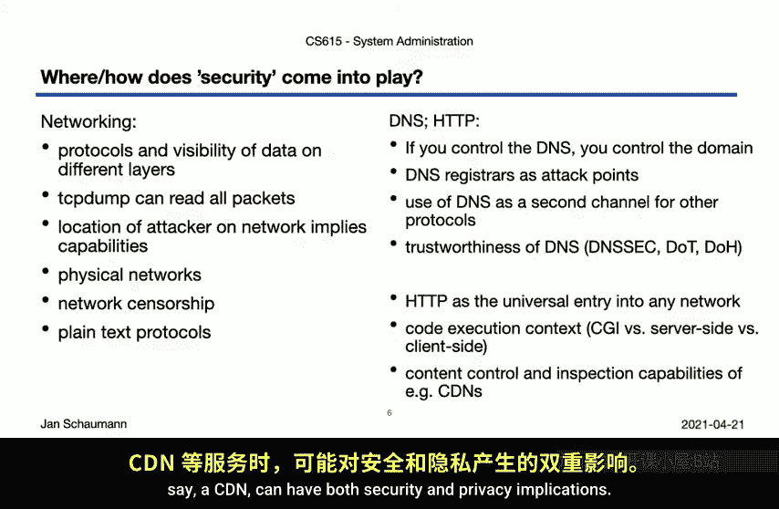

我们发现，系统安全确实触及一切，每个主题，我们面临的每个问题，以及我们开发的每个解决方案。

---

## 那么，安全究竟是什么？

让我们问问词典。首先，我们发现安全被递归地定义为“处于安全状态”。所以，谢谢《国际英语协作词典》。

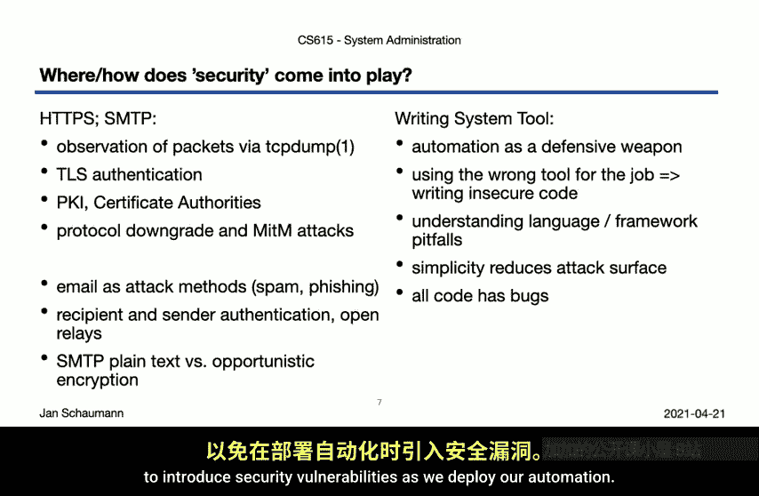

但韦氏词典有一个更好的定义：**免于风险**。这是一个相当不错的初步定义。

然而，在计算环境中，它包含更多内容。具体来说，我们在这个词条中看到了一个很好的细分：**机密性、完整性、身份验证、访问控制、不可否认性、可用性、隐私、物理安全、操作安全、人员安全、系统安全和网络安全**。它还提到加密是我们可能用来在某些领域实现某种安全的方法之一，这一点我很喜欢，因为重要的是不要将加密等同于安全。当然，我们注意到科罗拉多州有一个叫“Security”的城镇，人口近3万，但这真的不相关。

但好吧，这实际上很有用。在接下来的几个视频中，我们将实际分解其中几个重要方面。但我想回到我们看到的第一个有用的定义：**免于风险**。这是我们第二次看到对风险的强调。所以也许让我们去看看风险是什么。

---

## 理解风险 ⚠️

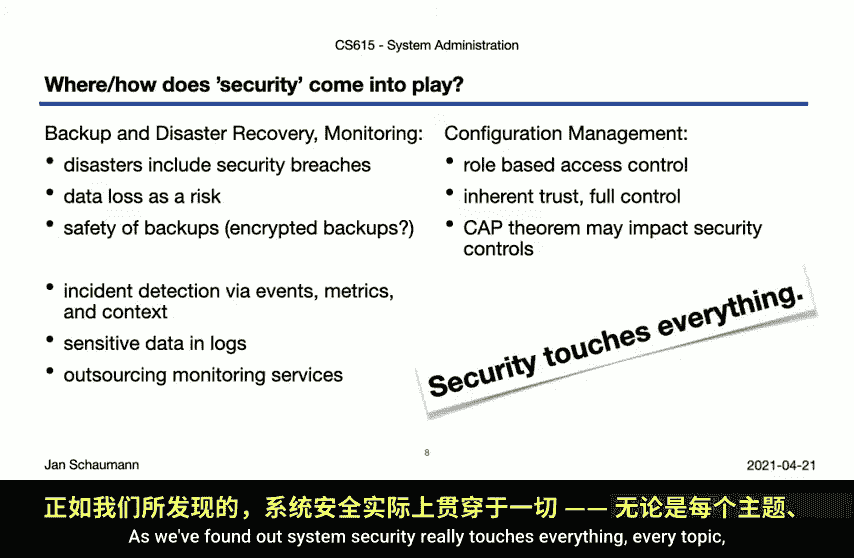

风险被定义为危险的来源，遭受损失的可能性。这真的很重要。风险不是一场有保证的灾难。它是发生可怕事情的可能性。

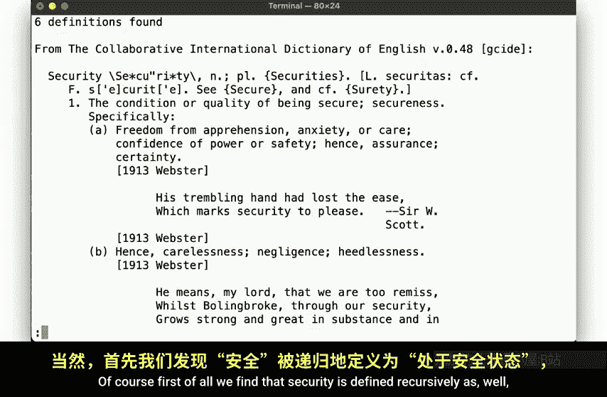

但要评估特定风险的影响，我们需要确定具体是什么处于风险之中。确实有许多我们可能面临失去危险的东西，例如对数据的访问（如勒索软件的情况），或者我们可能担心数据的完整性，担心有人可能更改了它。我们可能担心数据的可用性（想想拒绝服务攻击）。任何对我们的数据发生的坏事也可能带来间接后果，例如声誉损失，这意味着你可能会失去用户和客户。当然，金钱使世界运转，我们可能担心由于上述任何原因而损失我们宝贵的金钱。在某些情况下，我们甚至可能担心某些事物的物理价值。在数据驱动的科技世界中，这与数据访问或完整性的价值是完全不同的威胁。

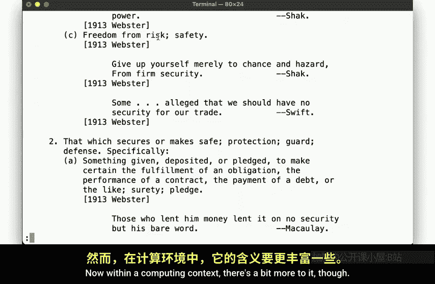

所以你看，显然有不同的东西可能处于风险之中，而每一种都显然以不同的方式面临风险，因此应该以不同的方式加以保护。

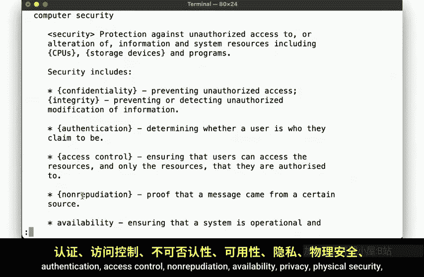

因此，为了我们在“保护某物”方面取得任何进展，我们必须——尽管这听起来可能很无聊——**进行风险评估**。我知道，这听起来像是一个能让你自己睡着的主题，但请稍等片刻。

---

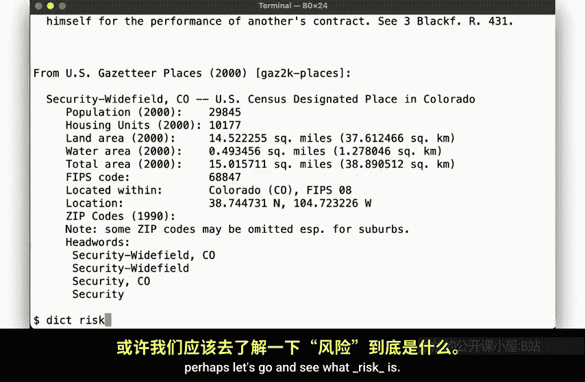

## 进行风险评估 📊

我们所说的风险评估是什么意思？首先，我们需要准确确定处于风险中的是什么。正如我们刚才所说，我们需要识别我们想要保护的资产。每项资产面临不同的威胁，所以让我们为每一项识别这些威胁。也就是说，我们需要确定每项资产究竟什么可能构成危险。

每个威胁可能以不同的方式表现出来。我们称这些方式为**漏洞**，即系统中的弱点、滥用协议、工具甚至人类行为的方式。

但是，利用这些漏洞中的每一个都不是必然的，并且每一个被利用时也不一定会导致完全的系统沦陷。这就是为什么我们需要确定或至少估计损害发生的概率，包括我们可能已经实施的任何可能的缓解措施。例如，如果我们担心数据丢失，但我们有一个每分钟创建快照的文件系统，实际数据丢失的概率就会降低。

另一方面，我们还必须考虑当损害确实发生时我们该怎么做。我们如何恢复？我们必须做什么才能重新启动和运行？我们必须重建系统、更换硬件、开展广告活动以试图向用户保证我们的可信度吗？所有这些都让我们了解到如果发生这样的灾难，情况会有多糟糕。

然后，我们需要反过来问自己，防范这种威胁需要花费多少成本。我们能防范这种情况吗？如果我们拥有无限的资源呢？实施缓解策略的成本是多少？

有了这个成本计算，我们就会得出几个粗略的数字：灾难的成本（即如果发生灾难，我们会损失多少）、灾难发生的概率以及防御该场景的成本。有了这些数字，你就可以做出相当合理的逻辑决策，并确定投资于该场景的防御是否有意义。

换句话说，我们确定风险的方法是评估威胁成功利用漏洞的可能性，以及由此可能产生的短期和长期估计成本或潜在损害。这就是风险评估。这听起来很简单。有时确实如此。但当然，通常需要一些实践才能真正识别所有相关因素并排除不相关因素。

但这里的关键要点是：**风险是具体的、可量化的**。大多数时候，当我们面对关于抽象意义上的安全的讨论时，很容易陷入只以模糊、理论化的方式谈论非常模糊的问题的陷阱。这种讨论中可能会掺杂很多恐惧、不确定性和怀疑。所以请始终记住，为了能够解决、缓解或最小化风险，它需要被具体界定、明确定义。只有这样，你才能对它采取行动。

---

## 如何保护系统？

那么，我们如何保护一个系统呢？答案是：你无法做到。不存在“安全”的系统，因为正如我们开头提到的，安全不是系统的一种属性，我们需要具体说明我们的意思。

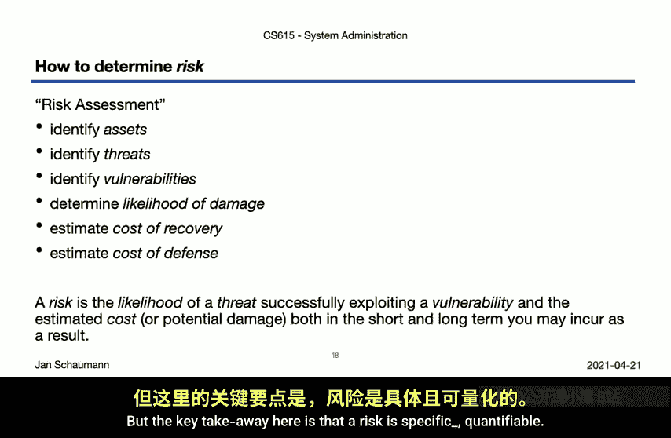

因此，与其试图使系统变得安全，我们只能通过各种方式最小化或解决特定的风险。我们可以尝试关闭攻击向量。我们可以尝试消除允许威胁显现的漏洞。即使我们无法消除漏洞或关闭攻击向量，我们也可以尝试减少攻击面。或者，这是另一个经常被忽视的强大机制：**我们可以改变攻击者的经济成本**。因为请记住，就像我们在评估风险时进行成本效益计算一样，攻击者也会计算尝试利用给定漏洞是否值得他们花费时间。例如，如果我们能提高攻击者的成本，那么他们可能会寻求其他途径，或者被迫完全撤退。

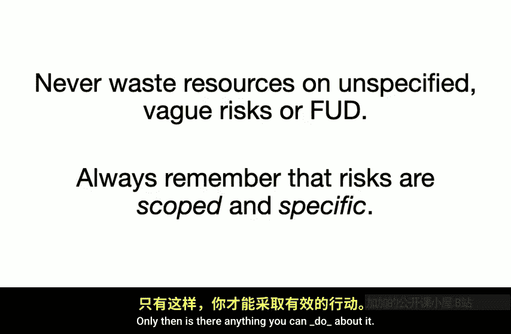

但为了我们能够做到上述任何一点，我们不仅需要了解我们的风险，还需要了解我们的攻击者、他们的动机、他们的目标，以及我们自己的能力。也就是说，我们需要开发并利用一个**威胁模型**，这是一种正式评估谁可能尝试追求哪些攻击向量以达到何种目的的方法。

但更多关于威胁模型的内容将在下一个视频中讨论。

---

## 总结

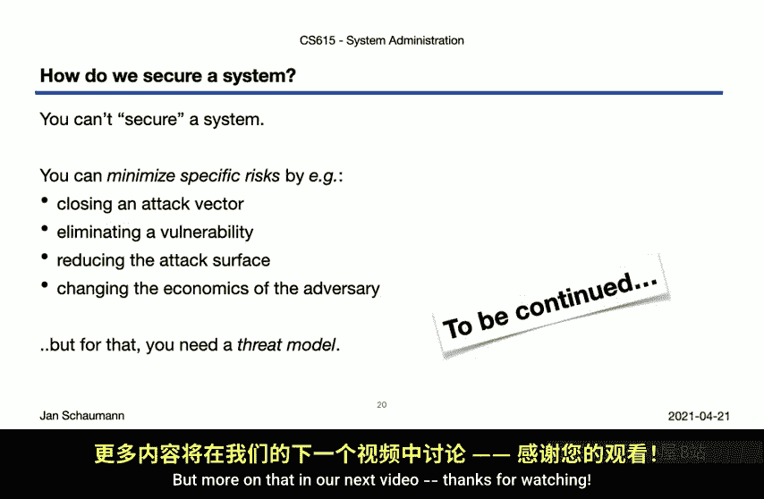

本节课中，我们一起学习了系统安全的基础。我们明确了安全不是系统的终极目标，而是系统的一种属性，用于抵御特定风险。我们回顾了本学期各技术层次中涉及的安全考量。最重要的是，我们学习了**风险评估**的核心流程：识别资产、分析威胁与漏洞、评估损害概率与影响、计算防御成本，并据此做出决策。记住，只有具体、可量化的风险，才能被有效地管理和缓解。在下一节中，我们将深入探讨**威胁模型**，以更好地理解我们的对手。